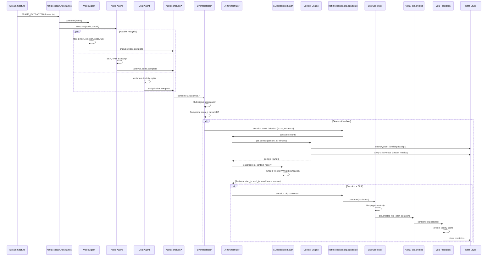
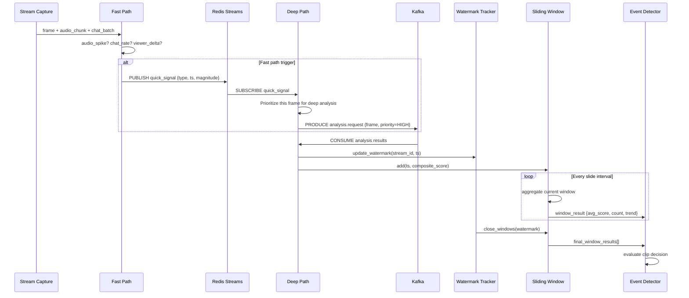
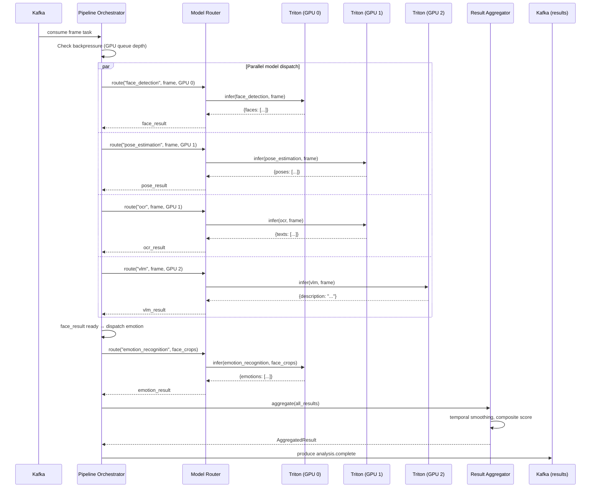
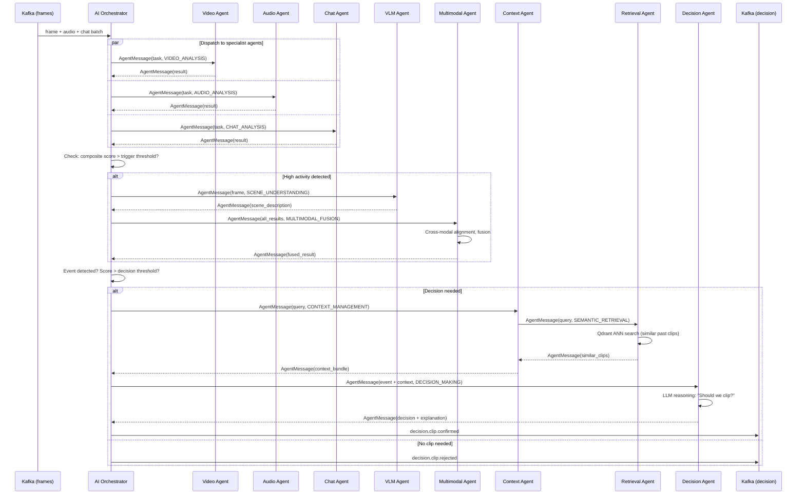
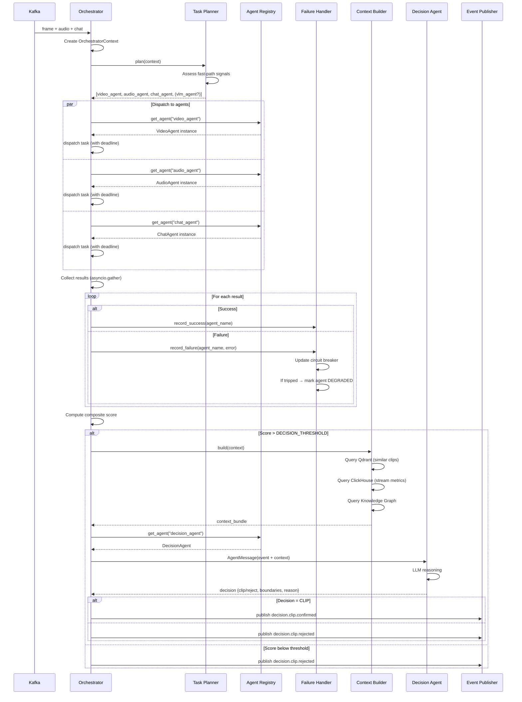

# INTELLIGENCE PLATFORM — PART 1
# Architecture & Multi-Agent System

**Topics:** Event Driven Architecture · Real-time Stream Processing · Distributed AI Pipeline · Multi-Agent Architecture · AI Orchestrator · Model Router

---

# 1. EVENT DRIVEN ARCHITECTURE (EDA)

## 1.1 Neden EDA?

Intelligence Platform, doğası gereği **çoklu eşzamanlı veri akışı** ile çalışır:

- Video stream (30-60 FPS, ~6 Mbps)
- Audio stream (48kHz, stereo)
- Chat WebSocket stream (burst pattern, 1000+ msg/s)
- Viewer count API polling
- Platform API calls (OAuth, metadata)
- AI inference results (async, GPU-bound)
- Creator feedback events

Monolitik bir mimaride bu akışların her biri diğerini bloklar. EDA'da her bileşen **event'ler** üzerinden iletişim kurar — doğrudan metod çağrısı yoktur.

### EDA'nın Temel Prensipleri

```
1. EVENT SOURCING — Her state değişikliği immutable event olarak kaydedilir
2. CQRS — Write path (events) ve read path (projections) ayrılır
3. EVENTUAL CONSISTENCY — Servisler nihai tutarlılığa ulaşır, anlık değil
4. CHOREOGRAPHY — Merkezi orkestratör yok, servisler event'lere reaksiyon gösterir
5. SAP (Single Actor Principle) — Her event tek bir servis tarafından üretilir
```

## 1.2 Event Topology

### Kafka Topic Design — Full Map

```
┌─────────────────────────────────────────────────────────────────────────┐
│                        KAFKA CLUSTER (3+ brokers)                       │
│                                                                         │
│  ┌─────────────────────────────────────────────────────────────────┐    │
│  │  TIER 1: INGESTION (high throughput, short retention 7d)       │    │
│  │  ├── stream.raw.frames         (12 partitions, 2 FPS frames)   │    │
│  │  ├── stream.raw.audio          (6 partitions, 1s chunks)        │    │
│  │  ├── stream.raw.chat           (6 partitions, raw messages)     │    │
│  │  └── stream.raw.metadata       (3 partitions, viewer counts)    │    │
│  └─────────────────────────────────────────────────────────────────┘    │
│                                                                         │
│  ┌─────────────────────────────────────────────────────────────────┐    │
│  │  TIER 2: ANALYSIS (medium throughput, 14d retention)           │    │
│  │  ├── analysis.video.complete    (6 partitions)                  │    │
│  │  ├── analysis.audio.complete    (6 partitions)                  │    │
│  │  ├── analysis.chat.complete     (6 partitions)                  │    │
│  │  ├── analysis.vlm.complete      (3 partitions)                  │    │
│  │  ├── analysis.multimodal.fused  (3 partitions)                  │    │
│  │  └── analysis.ocr.complete      (3 partitions)                  │    │
│  └─────────────────────────────────────────────────────────────────┘    │
│                                                                         │
│  ┌─────────────────────────────────────────────────────────────────┐    │
│  │  TIER 3: DECISION (low throughput, 30d retention)              │    │
│  │  ├── decision.event.detected    (3 partitions)                  │    │
│  │  ├── decision.clip.candidate    (3 partitions)                  │    │
│  │  ├── decision.clip.confirmed    (3 partitions)                  │    │
│  │  ├── decision.clip.rejected     (3 partitions)                  │    │
│  │  └── decision.llm.reasoning     (3 partitions)                  │    │
│  └─────────────────────────────────────────────────────────────────┘    │
│                                                                         │
│  ┌─────────────────────────────────────────────────────────────────┐    │
│  │  TIER 4: EXECUTION (low throughput, 30d retention)             │    │
│  │  ├── clip.created               (3 partitions)                  │    │
│  │  ├── clip.subtitle.ready        (3 partitions)                  │    │
│  │  ├── clip.thumbnail.ready       (3 partitions)                  │    │
│  │  ├── clip.edited                (3 partitions)                  │    │
│  │  ├── clip.published             (3 partitions)                  │    │
│  │  └── clip.metadata.generated    (3 partitions)                  │    │
│  └─────────────────────────────────────────────────────────────────┘    │
│                                                                         │
│  ┌─────────────────────────────────────────────────────────────────┐    │
│  │  TIER 5: INTELLIGENCE (low throughput, 90d retention)           │    │
│  │  ├── intelligence.viral.predicted  (3 partitions)               │    │
│  │  ├── intelligence.trend.detected   (3 partitions)               │    │
│  │  ├── intelligence.score.updated    (3 partitions)               │    │
│  │  ├── intelligence.feedback.received(3 partitions)               │    │
│  │  └── intelligence.embedding.indexed(3 partitions)              │    │
│  └─────────────────────────────────────────────────────────────────┘    │
│                                                                         │
│  ┌─────────────────────────────────────────────────────────────────┐    │
│  │  TIER 6: SYSTEM (internal, 30d retention)                      │    │
│  │  ├── system.lifecycle            (3 partitions)                 │    │
│  │  ├── system.health               (3 partitions)                 │    │
│  │  ├── system.scale                (3 partitions)                 │    │
│  │  └── system.dlq                  (3 partitions, dead letter)    │    │
│  └─────────────────────────────────────────────────────────────────┘    │
└─────────────────────────────────────────────────────────────────────────┘
```

### Partition Strategy

```
Partition Key = stream_id

Bu sayede:
  - Aynı stream'e ait tüm event'ler aynı partition'a gider
  - Partition içinde event sırası garanti edilir (FIFO)
  - Farklı stream'ler paralel işlenir (horizontal scaling)

Consumer Group → Partition Assignment:
  ┌─────────────┐
  │ Consumer    │──→ Partition 0, 1, 2  (stream A, B, C)
  │ Group:      │
  │ video-agent │──→ Partition 3, 4, 5  (stream D, E, F)
  │ (3 replicas)│
  │             │──→ Partition 6, 7, ... (stream G, H, ...)
  └─────────────┘

Rebalance scenario: Consumer crash → partition'lar otomatik redistribute
```

## 1.3 Event Schema Registry

### Avro Schema — Analysis Complete Event

```json
{
  "type": "record",
  "name": "AnalysisCompleteEvent",
  "namespace": "com.intelligence.platform.analysis",
  "fields": [
    {"name": "event_id", "type": "string"},
    {"name": "stream_id", "type": "string"},
    {"name": "frame_id", "type": "string"},
    {"name": "timestamp_ms", "type": "long"},
    {"name": "analysis_type", "type": {
      "type": "enum", "name": "AnalysisType",
      "symbols": ["VIDEO", "AUDIO", "CHAT", "VLM", "MULTIMODAL", "OCR"]
    }},
    {"name": "results", "type": {
      "type": "record", "name": "AnalysisResults",
      "fields": [
        {"name": "faces", "type": {"type": "array", "items": {
          "type": "record", "name": "FaceDetection",
          "fields": [
            {"name": "face_id", "type": "string"},
            {"name": "bbox", "type": {"type": "array", "items": "float"}},
            {"name": "confidence", "type": "float"},
            {"name": "emotion", "type": ["null", "string"], "default": null},
            {"name": "emotion_scores", "type": {"type": "map", "values": "float"}, "default": {}}
          ]
        }}},
        {"name": "emotions", "type": {"type": "array", "items": "string"}},
        {"name": "poses", "type": {"type": "array", "items": {
          "type": "record", "name": "PoseData",
          "fields": [
            {"name": "keypoints", "type": {"type": "array", "items": "float"}},
            {"name": "gestures", "type": {"type": "array", "items": "string"}}
          ]
        }}},
        {"name": "objects", "type": {"type": "array", "items": {
          "type": "record", "name": "ObjectDetection",
          "fields": [
            {"name": "class_name", "type": "string"},
            {"name": "bbox", "type": {"type": "array", "items": "float"}},
            {"name": "confidence", "type": "float"}
          ]
        }}},
        {"name": "text_detected", "type": {"type": "array", "items": "string"}},
        {"name": "audio_features", "type": ["null", {
          "type": "record", "name": "AudioFeatures",
          "fields": [
            {"name": "rms_energy", "type": "float"},
            {"name": "is_speech", "type": "boolean"},
            {"name": "emotion", "type": ["null", "string"]},
            {"name": "transcript", "type": ["null", "string"]}
          ]
        }], "default": null},
        {"name": "scene_description", "type": ["null", "string"], "default": null},
        {"name": "composite_score", "type": "float", "default": 0.0}
      ]
    }},
    {"name": "model_versions", "type": {"type": "map", "values": "string"}},
    {"name": "inference_time_ms", "type": "float"}
  ]
}
```

### Event Schema Evolution Strategy

```
Schema Registry Rules:
  ┌─────────────────────────────────────────────────────┐
  │  BACKWARD COMPATIBLE (default)                      │
  │  Yeni consumer eski event'leri okuyabilir           │
  │  → Yeni alan ekle (default value ile)               │
  │  → Alan silme YOK (deprecate et, null bırak)        │
  │                                                      │
  │  FORWARD COMPATIBLE                                 │
  │  Eski consumer yeni event'leri okuyabilir           │
  │  → Alan ekleme YOK (yok sayılır)                    │
  │  → Alan sil (eski consumer için sorun yok)          │
  │                                                      │
  │  FULL COMPATIBILITY (hedef)                          │
  │  Hem backward hem forward                            │
  │  → Sadece optional alan ekle (default ile)          │
  │  → Alias kullan (rename için)                       │
  └─────────────────────────────────────────────────────┘

Versioning:
  v1 → v2: Yeni optional alanlar eklendi (backward compatible)
  v2 → v3: Enum'a yeni değer eklendi (backward compatible)
  v3 → v4: Alan tipi değişti (BREAKING → yeni topic)
```

## 1.4 Event Flow — End-to-End Sequence



## 1.5 Database Tables — Event Store (PostgreSQL CQRS Read Model)

```sql
-- Event Store projection table (read-optimized)
CREATE TABLE event_store_projection (
    event_id          UUID PRIMARY KEY DEFAULT gen_random_uuid(),
    event_type        VARCHAR(100) NOT NULL,
    stream_id         VARCHAR(100),
    timestamp_ms      BIGINT NOT NULL,
    source_service    VARCHAR(50) NOT NULL,
    correlation_id    UUID NOT NULL,
    causation_id      UUID,
    payload           JSONB NOT NULL,
    schema_version    INT NOT NULL DEFAULT 1,
    processed_at      TIMESTAMPTZ DEFAULT now(),
    
    -- Indexes for common query patterns
    INDEX idx_event_type_ts (event_type, timestamp_ms DESC),
    INDEX idx_stream_ts (stream_id, timestamp_ms DESC),
    INDEX idx_correlation (correlation_id),
    INDEX idx_payload_gin (payload JSONB_PATH_OPS)
);

-- Event replay log (append-only, never update)
CREATE TABLE event_replay_log (
    replay_id         UUID PRIMARY KEY DEFAULT gen_random_uuid(),
    stream_id         VARCHAR(100) NOT NULL,
    start_timestamp   BIGINT NOT NULL,
    end_timestamp     BIGINT NOT NULL,
    events_replayed   INT NOT NULL,
    triggered_by      VARCHAR(100) NOT NULL,
    status            VARCHAR(20) DEFAULT 'pending', -- pending, running, complete, failed
    created_at        TIMESTAMPTZ DEFAULT now(),
    completed_at      TIMESTAMPTZ
);

-- Dead Letter Queue table (for failed events)
CREATE TABLE event_dlq (
    dlq_id            UUID PRIMARY KEY DEFAULT gen_random_uuid(),
    original_event_id UUID NOT NULL,
    event_type        VARCHAR(100) NOT NULL,
    topic             VARCHAR(100) NOT NULL,
    partition         INT NOT NULL,
    offset            BIGINT NOT NULL,
    payload           JSONB NOT NULL,
    error             TEXT NOT NULL,
    error_count       INT DEFAULT 1,
    first_failed_at   TIMESTAMPTZ DEFAULT now(),
    last_failed_at    TIMESTAMPTZ DEFAULT now(),
    status            VARCHAR(20) DEFAULT 'pending' -- pending, retried, dead
);
```

## 1.6 API Design — Event Bus Management

```python
# api/rest/events.py

from fastapi import APIRouter, HTTPException, Query
from typing import Optional

router = APIRouter(prefix="/v1/events", tags=["events"])

@router.get("/stream/{stream_id}")
async def get_stream_events(
    stream_id: str,
    event_type: Optional[str] = None,
    start_time: Optional[int] = Query(None, description="Epoch ms"),
    end_time: Optional[int] = None,
    limit: int = Query(100, le=1000),
):
    """Retrieve events for a specific stream (CQRS read model)."""
    ...

@router.post("/replay")
async def replay_events(
    stream_id: str,
    start_time: int,
    end_time: int,
    target_service: str,
):
    """Trigger event replay for a stream (re-process historical events)."""
    ...

@router.get("/dlq")
async def get_dead_letter_queue(
    topic: Optional[str] = None,
    status: str = "pending",
    limit: int = 50,
):
    """List events in the dead letter queue."""
    ...

@router.post("/dlq/{dlq_id}/replay")
async def replay_dlq_event(dlq_id: str):
    """Replay a specific dead-lettered event."""
    ...
```

## 1.7 Production Scenarios

### Scenario: Kafka Broker Failure

```
1. Broker 2 crashes (holds partitions 4, 5, 6)
2. Kafka cluster: partition leader election (broker 1 or 3 takes over)
3. Producers: automatic failover (< 5s)
4. Consumers: rebalance, resume from last committed offset
5. Impact: 2-10 second event delivery delay
6. Recovery: broker 2 restarts, syncs from ISR, becomes follower

Mitigation:
  - replication.factor = 3 (all topics)
  - min.insync.replicas = 2
  - unclean.leader.election.enable = false (prevent data loss)
  - Consumer: enable.auto.commit = false (manual commit after processing)
```

### Scenario: Event Storm (chat explosion)

```
1. Streamer goes viral → chat 10,000 msg/s
2. Kafka topic stream.raw.chat fills up
3. Chat Agent consumer lag grows
4. Backpressure: Chat Agent drops to sampling mode (every 10th msg)
5. Event Detector receives reduced chat signal
6. Auto-scaler detects lag → spins up 2 more Chat Agent replicas
7. Lag drains, full processing resumes

Mitigation:
  - Consumer lag alerting (Prometheus: kafka_consumer_lag > 5000)
  - HPA on consumer lag metric
  - Backpressure mode in Chat Agent (graceful degradation)
  - Dead letter queue for unprocessable messages
```

## 1.8 Scalability Strategy

```
Scaling Dimensions:
                                                         
  ┌─────────────────────────────────────────────────┐
  │ VERTICAL (scale up)                              │
  │  - Increase broker disk/CPU                      │
  │  - Increase partition count (requires reassign)  │
  │  - Increase consumer instance resources          │
  └─────────────────────────────────────────────────┘
  ┌─────────────────────────────────────────────────┐
  │ HORIZONTAL (scale out)                           │
  │  - Add Kafka brokers (elastic cluster)           │
  │  - Add consumer replicas (partition limited)     │
  │  - Partition count = max parallelism             │
  └─────────────────────────────────────────────────┘
  ┌─────────────────────────────────────────────────┐
  │ TOPIC-LEVEL                                      │
  │  - Tier 1 (ingestion): 12+ partitions            │
  │  - Tier 3 (decision): 3 partitions (low volume)  │
  │  - Right-size partitions per topic               │
  └─────────────────────────────────────────────────┘

Rule of thumb:
  partitions >= max(consumer_replicas) for each consumer group
  partitions = expected_throughput / per_partition_throughput
  per_partition_throughput ≈ 10 MB/s (safe estimate)
```

---

# 2. REAL-TIME STREAM PROCESSING

## 2.1 Architecture

Real-time stream processing, video/audio/chat akışlarını **sub-second latency** ile işlemektir. Sistem iki modda çalışır:

```
┌─────────────────────────────────────────────────────────────────────┐
│                    STREAM PROCESSING MODES                          │
│                                                                     │
│  ┌──────────────────────┐    ┌──────────────────────────────────┐  │
│  │  FAST PATH (< 100ms) │    │  DEEP PATH (100ms - 5s)          │  │
│  │                      │    │                                  │  │
│  │  Frame extraction    │    │  Face detection (GPU)            │  │
│  │  Audio RMS spike     │    │  Emotion recognition             │  │
│  │  Chat rate counter   │    │  Pose estimation                 │  │
│  │  Viewer delta        │    │  OCR                             │  │
│  │  Simple threshold    │    │  VLM scene description           │  │
│  │  → Quick event flag  │    │  Multimodal fusion               │  │
│  │                      │    │  LLM reasoning                   │  │
│  │  Redis Streams       │    │  → Rich clip decision            │  │
│  │  (pub/sub, no persist)│   │                                  │  │
│  │                      │    │  Kafka (persistent, replayable)  │  │
│  └──────────────────────┘    └──────────────────────────────────┘  │
│                                                                     │
│  FAST PATH triggers DEEP PATH:                                      │
│    Audio spike detected (fast) → "analyze this frame deeply" (deep) │
│    Chat explosion (fast) → "check emotions + VLM now" (deep)       │
└─────────────────────────────────────────────────────────────────────┘
```

## 2.2 Stream Processing Pipeline

### Folder Structure

```
services/stream_processing/
├── __init__.py
├── fast_path/
│   ├── __init__.py
│   ├── audio_spike_detector.py     # RMS energy spike (sub-50ms)
│   ├── chat_rate_counter.py        # Messages per second tracker
│   ├── viewer_delta_tracker.py     # Viewer count change detector
│   └── frame_scorer.py             # Lightweight frame scoring
├── deep_path/
│   ├── __init__.py
│   ├── analysis_dispatcher.py      # Route to GPU agents
│   ├── result_aggregator.py        # Merge multi-modal results
│   └── composite_scorer.py         # Weighted scoring across signals
├── windowing/
│   ├── __init__.py
│   ├── tumbling_window.py          # Fixed-size time windows
│   ├── sliding_window.py           # Overlapping windows
│   └── session_window.py           # Activity-based windows
├── watermarks/
│   ├── __init__.py
│   └── watermark_tracker.py        # Event-time watermarking
└── config.py
```

### Watermark & Event-Time Processing

```python
# services/stream_processing/watermarks/watermark_tracker.py

import time
from collections import defaultdict
from dataclasses import dataclass, field
from typing import Optional

@dataclass
class WatermarkState:
    """Tracks event-time watermarks for each stream.

    Watermark = guarantee that no event with timestamp < watermark
    will arrive anymore. Allows safe window closing.

    Stream 1: [t1] [t2] [t3] ----watermark=10s---- (window 0-10s can close)
    Stream 2: [t1] ----watermark=5s---- (window 0-5s can close, 5-10s waits)

    Late events (timestamp < watermark):
      - Drop (strict)
      - Side output (for debugging)
      - Update (allowed lateness, e.g., 5s grace period)
    """
    stream_id: str
    max_timestamp_seen: int = 0        # Max event timestamp observed
    watermark: int = 0                  # Current watermark
    allowed_lateness_ms: int = 5000     # Grace period for late events
    out_of_order_tolerance: int = 2000  # Max out-of-order duration

    def update(self, event_timestamp: int) -> bool:
        """Update watermark based on new event. Returns True if event is on-time."""
        if event_timestamp > self.max_timestamp_seen:
            self.max_timestamp_seen = event_timestamp

        # Watermark = max_seen - tolerance (allow out-of-order events)
        new_watermark = self.max_timestamp_seen - self.out_of_order_tolerance
        self.watermark = max(self.watermark, new_watermark)

        # Check if event is late
        is_late = event_timestamp < (self.watermark - self.allowed_lateness_ms)
        return not is_late


class WatermarkTracker:
    """Manages watermarks across all active streams."""

    def __init__(self):
        self._streams: dict[str, WatermarkState] = {}

    def get_or_create(self, stream_id: str) -> WatermarkState:
        if stream_id not in self._streams:
            self._streams[stream_id] = WatermarkState(stream_id=stream_id)
        return self._streams[stream_id]

    def get_watermark(self, stream_id: str) -> int:
        state = self._streams.get(stream_id)
        return state.watermark if state else 0
```

### Sliding Window Aggregation

```python
# services/stream_processing/windowing/sliding_window.py

import time
from collections import deque
from dataclasses import dataclass
from typing import Callable, TypeVar

T = TypeVar('T')

@dataclass
class WindowResult:
    """Result of a windowed aggregation."""
    window_start: int
    window_end: int
    count: int
    aggregate: float
    is_final: bool  # True when watermark passes window end


class SlidingWindowAggregator:
    """
    Sliding window aggregation for real-time stream processing.

    Window: 10 seconds, slide: 2 seconds
    → Overlapping windows, each event belongs to multiple windows

    Use cases:
      - "Average emotion intensity over last 30s, updated every 5s"
      - "Chat message rate over last 60s, updated every 1s"
      - "Composite score over last 15s, updated every 3s"

    Implementation: time-based eviction, efficient O(1) updates
    """

    def __init__(
        self,
        window_size_ms: int,
        slide_ms: int,
        aggregator_fn: Callable[[list], float],
    ):
        self.window_size = window_size_ms
        self.slide = slide_ms
        self.aggregator_fn = aggregator_fn
        self._events: deque[tuple[int, float]] = deque()  # (timestamp, value)
        self._windows: dict[int, list[float]] = {}  # window_start → values

    def add(self, timestamp: int, value: float):
        """Add an event to all applicable windows."""
        self._events.append((timestamp, value))

        # Add to all windows this event belongs to
        earliest_window = (timestamp // self.slide) * self.slide
        latest_window_start = timestamp - self.window_size + self.slide

        w = earliest_window
        while w <= timestamp:
            if w + self.window_size > timestamp:  # Event falls in this window
                if w not in self._windows:
                    self._windows[w] = []
                self._windows[w].append(value)
            w += self.slide

        # Evict old events
        cutoff = timestamp - self.window_size
        while self._events and self._events[0][0] < cutoff:
            self._events.popleft()

    def get_window(self, window_start: int) -> WindowResult | None:
        """Get aggregation result for a specific window."""
        if window_start not in self._windows:
            return None

        values = self._windows[window_start]
        return WindowResult(
            window_start=window_start,
            window_end=window_start + self.window_size,
            count=len(values),
            aggregate=self.aggregator_fn(values),
            is_final=False,  # Set by watermark callback
        )

    def close_windows(self, watermark: int) -> list[WindowResult]:
        """Close and return all windows whose end <= watermark."""
        closed = []
        to_remove = []

        for window_start, values in self._windows.items():
            window_end = window_start + self.window_size
            if window_end <= watermark:
                closed.append(WindowResult(
                    window_start=window_start,
                    window_end=window_end,
                    count=len(values),
                    aggregate=self.aggregator_fn(values),
                    is_final=True,
                ))
                to_remove.append(window_start)

        for ws in to_remove:
            del self._windows[ws]

        return closed
```

## 2.3 Stream Processing — Sequence Diagram



## 2.4 Database — ClickHouse Time Series

```sql
-- ClickHouse: Real-time stream metrics
CREATE TABLE stream_metrics (
    stream_id        String,
    timestamp_ms     UInt64,
    metric_name      LowCardinality(String),  -- 'audio_rms', 'chat_rate', 'viewer_count', 'emotion_intensity'
    metric_value     Float64,
    signal_source    LowCardinality(String),  -- 'fast_path', 'deep_path'
    
    INDEX idx_ts (timestamp_ms) TYPE minmax GRANULARITY 4,
    INDEX idx_stream (stream_id) TYPE set(1000) GRANULARITY 4
) ENGINE = MergeTree
PARTITION BY toYYYYMMDD(fromUnixTimestamp64Milli(timestamp_ms))
ORDER BY (stream_id, timestamp_ms)
TTL toDateTime(timestamp_ms / 1000) + INTERVAL 90 DAY
SETTINGS index_granularity = 8192;

-- Materialized view: 1-minute aggregations
CREATE MATERIALIZED VIEW stream_metrics_1min
ENGINE = SummingMergeTree
PARTITION BY toYYYYMMDD(fromUnixTimestamp64Milli(window_start))
ORDER BY (stream_id, window_start, metric_name)
AS SELECT
    stream_id,
    toStartOfMinute(fromUnixTimestamp64Milli(timestamp_ms)) AS window_start,
    metric_name,
    count() AS sample_count,
    avg(metric_value) AS avg_value,
    max(metric_value) AS max_value,
    min(metric_value) AS min_value
FROM stream_metrics
GROUP BY stream_id, window_start, metric_name;

-- Query: "What was the chat rate trend for stream X in last 5 minutes?"
SELECT
    window_start,
    avg_value AS chat_rate_per_sec,
    max_value AS peak_chat_rate
FROM stream_metrics_1min
WHERE stream_id = 'stream_123'
  AND metric_name = 'chat_rate'
  AND window_start > now() - INTERVAL 5 MINUTE
ORDER BY window_start;
```

---

# 3. DISTRIBUTED AI PIPELINE

## 3.1 Architecture

Distributed AI Pipeline, birden fazla GPU node'da paralel AI inference çalıştıran dağıtık sistemdir. Her model ayrı bir container'da, Triton Inference Server arkasında servis edilir.

```
┌──────────────────────────────────────────────────────────────────────┐
│                    DISTRIBUTED AI PIPELINE                           │
│                                                                      │
│  ┌──────────┐                                                       │
│  │ Frame    │──→ ┌──────────────────────────────────────────────┐   │
│  │ Queue    │    │          MODEL ROUTER                        │   │
│  │ (Kafka)  │    │  Routes by: model_type, priority, GPU avail  │   │
│  └──────────┘    └──────┬──────┬──────┬──────┬──────┬──────────┘   │
│                         │      │      │      │      │               │
│                  ┌──────▼┐ ┌──▼───┐ ┌▼────┐ ┌▼────┐ ┌▼────────┐    │
│                  │ Face  │ │Emotion│ │Pose │ │ OCR │ │ VLM     │    │
│                  │ Detect│ │ Recogn│ │ Est.│ │     │ │ Agent   │    │
│                  │ GPU 0 │ │ GPU 0 │ │GPU 1│ │GPU 1│ │ GPU 2   │    │
│                  └──┬────┘ └──┬───┘ └──┬──┘ └──┬──┘ └──┬──────┘    │
│                     │         │        │       │       │             │
│                  ┌──▼─────────▼────────▼───────▼───────▼──────┐     │
│                  │            RESULT AGGREGATOR               │     │
│                  │  Merges multi-model outputs by frame_id    │     │
│                  │  Applies temporal smoothing                │     │
│                  └──────────────────┬────────────────────────┘     │
│                                     │                               │
│                              ┌──────▼──────┐                       │
│                              │ EVENT BUS   │                       │
│                              │ (Kafka)     │                       │
│                              └─────────────┘                       │
└──────────────────────────────────────────────────────────────────────┘
```

## 3.2 Folder Structure

```
inference/
├── distributed_pipeline/
│   ├── __init__.py
│   ├── pipeline_orchestrator.py    # Main pipeline coordinator
│   ├── frame_dispatcher.py         # Distribute frames to model workers
│   ├── result_aggregator.py        # Collect and merge results
│   ├── backpressure_manager.py     # GPU queue backpressure
│   └── health_checker.py           # GPU health monitoring
├── triton/
│   ├── model_repository/
│   │   ├── face_detection/
│   │   │   ├── 1/model.onnx
│   │   │   └── config.pbtxt
│   │   ├── emotion_recognition/
│   │   │   ├── 1/model.onnx
│   │   │   └── config.pbtxt
│   │   ├── pose_estimation/
│   │   │   ├── 1/model.onnx
│   │   │   └── config.pbtxt
│   │   ├── ocr/
│   │   │   ├── 1/model.onnx
│   │   │   └── config.pbtxt
│   │   └── vlm/
│   │       ├── 1/model.plan       # TensorRT engine
│   │       └── config.pbtxt
│   └── triton_server.py           # Triton client wrapper
├── tensorrt/
│   ├── __init__.py
│   ├── engine_builder.py          # ONNX → TensorRT
│   ├── calibrator.py              # INT8 calibration
│   └── profiler.py                # Engine profiling
├── onnx/
│   ├── __init__.py
│   ├── model_zoo.py               # Model download/management
│   └── session_manager.py         # ONNX Runtime session pool
├── gpu_scheduler/
│   ├── __init__.py
│   ├── scheduler.py               # GPU task scheduling
│   ├── gpu_pool.py                # GPU resource pool
│   └── metrics.py                 # GPU utilization metrics
└── model_router/
    ├── __init__.py
    ├── router.py                  # Model routing logic
    ├── routing_rules.py           # Routing rule definitions
    └── endpoint_registry.py       # Model endpoint registry
```

## 3.3 Pipeline Orchestrator

```python
# inference/distributed_pipeline/pipeline_orchestrator.py

import asyncio
import time
from dataclasses import dataclass, field
from typing import Optional
import logging

logger = logging.getLogger(__name__)


@dataclass
class FrameTask:
    """A single frame processing task with all required models."""
    frame_id: str
    stream_id: str
    timestamp_ms: int
    frame_data: bytes           # JPEG-encoded frame
    audio_chunk: Optional[bytes] = None
    required_models: list[str] = field(default_factory=lambda: [
        "face_detection",
        "emotion_recognition",
        "pose_estimation",
        "ocr",
    ])
    priority: int = 5           # 1=highest, 10=lowest
    results: dict = field(default_factory=dict)
    started_at: float = 0.0
    completed_models: set = field(default_factory=set)


class DistributedPipelineOrchestrator:
    """
    Orchestrates distributed AI inference across multiple GPUs.

    Architecture:
    1. Frame tasks arrive from Kafka consumer
    2. Orchestrator dispatches model requests in parallel
    3. Each model request goes to Model Router → Triton
    4. Results collected and aggregated by frame_id
    5. Backpressure: if GPU queues full, drop low-priority frames

    Key Design Decisions:
    - All models for a frame run in PARALLEL (not sequential)
    - Emotion recognition waits for face detection (dependency)
    - Results are idempotent (retry-safe)
    - Deadlines: if frame not processed in 2s, skip (stale frame)
    """

    def __init__(
        self,
        model_router,
        result_aggregator,
        backpressure_manager,
        max_concurrent_frames: int = 8,
        frame_timeout_s: float = 2.0,
    ):
        self.model_router = model_router
        self.result_aggregator = result_aggregator
        self.backpressure = backpressure_manager
        self.max_concurrent_frames = max_concurrent_frames
        self.frame_timeout = frame_timeout_s

        self._semaphore = asyncio.Semaphore(max_concurrent_frames)
        self._pending: dict[str, asyncio.Task] = {}

    async def process_frame(self, task: FrameTask) -> Optional[dict]:
        """Process a single frame through all required models."""

        # Check backpressure
        if not await self.backpressure.can_accept(task.priority):
            logger.debug(f"Frame {task.frame_id} dropped (backpressure)")
            return None

        async with self._semaphore:
            task.started_at = time.time()
            deadline = task.started_at + self.frame_timeout

            try:
                # Step 1: Run independent models in parallel
                independent_models = [
                    m for m in task.required_models
                    if m != "emotion_recognition"  # Emotion depends on face
                ]

                parallel_tasks = []
                for model_name in independent_models:
                    parallel_tasks.append(
                        self._run_model_with_timeout(model_name, task, deadline)
                    )

                # Step 2: Run face detection first (emotion depends on it)
                if "face_detection" in task.required_models:
                    face_task = asyncio.create_task(
                        self._run_model("face_detection", task)
                    )

                    # Wait for face detection before starting emotion
                    face_result = await asyncio.wait_for(face_task, timeout=1.0)
                    task.results["face_detection"] = face_result
                    task.completed_models.add("face_detection")

                    # Now run emotion recognition on face crops
                    if "emotion_recognition" in task.required_models and face_result:
                        emotion_result = await self._run_emotion(task, face_result)
                        task.results["emotion_recognition"] = emotion_result
                        task.completed_models.add("emotion_recognition")

                # Wait for parallel models
                results = await asyncio.gather(*parallel_tasks, return_exceptions=True)
                for model_name, result in zip(independent_models, results):
                    if isinstance(result, Exception):
                        logger.warning(f"Model {model_name} failed: {result}")
                        task.results[model_name] = None
                    else:
                        task.results[model_name] = result
                    task.completed_models.add(model_name)

                # Step 3: Aggregate results
                aggregated = self.result_aggregator.aggregate(
                    frame_id=task.frame_id,
                    stream_id=task.stream_id,
                    timestamp_ms=task.timestamp_ms,
                    model_results=task.results,
                )

                return aggregated

            except asyncio.TimeoutError:
                logger.warning(f"Frame {task.frame_id} timed out")
                return None
            except Exception as e:
                logger.error(f"Frame {task.frame_id} error: {e}", exc_info=True)
                return None

    async def _run_model_with_timeout(
        self, model_name: str, task: FrameTask, deadline: float
    ):
        """Run a model with deadline awareness."""
        remaining = deadline - time.time()
        if remaining <= 0:
            return None
        return await asyncio.wait_for(
            self._run_model(model_name, task),
            timeout=remaining,
        )

    async def _run_model(self, model_name: str, task: FrameTask):
        """Route model request through Model Router to Triton."""
        return await self.model_router.route(
            model_name=model_name,
            input_data=task.frame_data,
            stream_id=task.stream_id,
            frame_id=task.frame_id,
            priority=task.priority,
        )

    async def _run_emotion(self, task: FrameTask, face_result: dict):
        """Run emotion recognition on detected face crops."""
        if not face_result or not face_result.get("faces"):
            return None

        face_crops = face_result["faces"]
        return await self.model_router.route(
            model_name="emotion_recognition",
            input_data=face_crops,  # List of face crops
            stream_id=task.stream_id,
            frame_id=task.frame_id,
            priority=task.priority,
        )
```

## 3.4 Result Aggregator

```python
# inference/distributed_pipeline/result_aggregator.py

import time
from collections import deque
from dataclasses import dataclass, field
from typing import Optional
import numpy as np


@dataclass
class AggregatedResult:
    """Fully aggregated analysis result for a single frame."""
    frame_id: str
    stream_id: str
    timestamp_ms: int
    faces: list[dict] = field(default_factory=list)
    emotions: list[dict] = field(default_factory=list)
    poses: list[dict] = field(default_factory=list)
    objects: list[dict] = field(default_factory=list)
    texts: list[dict] = field(default_factory=list)
    audio_features: Optional[dict] = None
    scene_description: Optional[str] = None
    composite_score: float = 0.0
    inference_time_ms: float = 0.0
    model_versions: dict = field(default_factory=dict)


class ResultAggregator:
    """
    Aggregates results from multiple models for the same frame.

    Responsibilities:
    1. Merge model outputs into unified result
    2. Apply temporal smoothing (reduce jitter)
    3. Compute composite highlight score
    4. Attach model version metadata

    Temporal Smoothing:
    - Emotion scores can flicker frame-to-frame
    - Apply exponential moving average (EMA) across frames
    - α = 0.3 (30% new, 70% historical)
    """

    # Signal weights for composite score
    SIGNAL_WEIGHTS = {
        "audio_spike": 0.25,
        "emotion_intensity": 0.20,
        "pose_gesture": 0.15,
        "chat_spike": 0.15,
        "ocr_keyword": 0.10,
        "object_detection": 0.05,
        "viewer_spike": 0.10,
    }

    def __init__(self):
        # Per-stream temporal smoothing state
        self._emotion_history: dict[str, deque] = {}  # stream_id → deque
        self._score_ema: dict[str, float] = {}

    def aggregate(
        self,
        frame_id: str,
        stream_id: str,
        timestamp_ms: int,
        model_results: dict,
    ) -> AggregatedResult:
        start = time.time()

        result = AggregatedResult(
            frame_id=frame_id,
            stream_id=stream_id,
            timestamp_ms=timestamp_ms,
        )

        # Extract individual model results
        if face_data := model_results.get("face_detection"):
            result.faces = face_data.get("faces", [])

        if emotion_data := model_results.get("emotion_recognition"):
            raw_emotions = emotion_data.get("emotions", [])
            # Apply temporal smoothing
            result.emotions = self._smooth_emotions(stream_id, raw_emotions)

        if pose_data := model_results.get("pose_estimation"):
            result.poses = pose_data.get("poses", [])

        if ocr_data := model_results.get("ocr"):
            result.texts = ocr_data.get("texts", [])

        if audio_data := model_results.get("audio_analysis"):
            result.audio_features = audio_data

        if vlm_data := model_results.get("vlm"):
            result.scene_description = vlm_data.get("description")

        # Compute composite score
        result.composite_score = self._compute_composite_score(result)

        # Attach model versions
        for model_name, model_result in model_results.items():
            if model_result and isinstance(model_result, dict):
                version = model_result.get("model_version", "unknown")
                result.model_versions[model_name] = version

        result.inference_time_ms = (time.time() - start) * 1000
        return result

    def _smooth_emotions(
        self, stream_id: str, raw_emotions: list[dict]
    ) -> list[dict]:
        """Apply EMA smoothing to emotion scores across frames."""
        if stream_id not in self._emotion_history:
            self._emotion_history[stream_id] = deque(maxlen=5)

        history = self._emotion_history[stream_id]
        alpha = 0.3  # Smoothing factor

        smoothed = []
        for i, emotion in enumerate(raw_emotions):
            if history and i < len(history[-1]):
                # Blend with previous frame's emotion
                prev = history[-1][i] if i < len(history[-1]) else emotion
                blended = {}
                for key in emotion.get("scores", {}):
                    new_val = emotion["scores"].get(key, 0)
                    old_val = prev.get("scores", {}).get(key, 0)
                    blended[key] = alpha * new_val + (1 - alpha) * old_val
                emotion = {**emotion, "scores": blended}

            smoothed.append(emotion)

        history.append(smoothed)
        return smoothed

    def _compute_composite_score(self, result: AggregatedResult) -> float:
        """Compute weighted composite highlight score (0.0 - 1.0)."""
        scores = {}

        # Audio spike score
        if result.audio_features:
            scores["audio_spike"] = min(1.0, result.audio_features.get("spike_magnitude", 0))

        # Emotion intensity (max confidence of highlight emotions)
        highlight_emotions = {"happy", "surprise", "fear", "angry"}
        if result.emotions:
            max_intensity = max(
                (e.get("confidence", 0) for e in result.emotions
                 if e.get("label") in highlight_emotions),
                default=0,
            )
            scores["emotion_intensity"] = max_intensity

        # Pose gesture score
        if result.poses:
            gesture_scores = []
            for pose in result.poses:
                for gesture in pose.get("gestures", []):
                    gesture_scores.append(pose.get("gesture_scores", {}).get(gesture, 0.5))
            scores["pose_gesture"] = max(gesture_scores, default=0)

        # OCR keyword match
        if result.texts:
            highlight_keywords = {"victory", "kill", "penta", "gg", "winner"}
            keyword_score = sum(
                1 for t in result.texts
                if any(kw in t.get("text", "").lower() for kw in highlight_keywords)
            ) / max(len(result.texts), 1)
            scores["ocr_keyword"] = keyword_score

        # Compute weighted sum
        composite = sum(
            self.SIGNAL_WEIGHTS.get(signal, 0) * score
            for signal, score in scores.items()
        )

        return min(1.0, composite)
```

## 3.5 Distributed Pipeline Sequence Diagram



## 3.6 Production Scenario — GPU Failure

```
1. GPU 1 (hosting pose + OCR models) goes down
2. Triton health check fails for GPU 1 endpoints
3. Model Router detects endpoint unavailability
4. Model Router reroutes pose + OCR to GPU 0 (has spare capacity)
5. GPU 0 now handles face + emotion + pose + OCR (higher latency)
6. HPA detects increased latency → scale up: deploy new pod with GPU 1
7. New GPU pod joins Triton cluster, models load
8. Model Router detects new endpoint, rebalances load
9. System returns to normal latency

Total recovery time: 30-60 seconds
Impact: 2-4x latency increase during degradation, no frame drops (backpressure absorbs)
```

---

# 4. MULTI-AGENT ARCHITECTURE

## 4.1 Why Multi-Agent?

Tek bir devasa AI modeli yerine, **uzmanlaşmış ajanlar** koordineli çalışır:

```
SINGLE MODEL (monolithic)              MULTI-AGENT (specialized)
════════════════════════                ════════════════════════
One model does everything               Each agent is an expert
Slow (everything sequential)            Fast (parallel specialists)
Hard to update (retrain whole)          Easy to update (swap one agent)
No explainability                       Each agent's reasoning is visible
Fixed capability                        Dynamic capability (add/remove agents)
Context window bloat                    Focused context per agent
```

### Agent Roster

```
┌─────────────────────────────────────────────────────────────────────┐
│                     MULTI-AGENT SYSTEM                              │
│                                                                     │
│  ┌──────────────────────────────────────────────────────────────┐   │
│  │                    AI ORCHESTRATOR                           │   │
│  │           (Coordinator — not a worker, a manager)            │   │
│  └──────┬───────┬───────┬───────┬───────┬───────┬──────────────┘   │
│         │       │       │       │       │       │                   │
│    ┌────▼──┐ ┌─▼───┐ ┌─▼───┐ ┌─▼───┐ ┌─▼───┐ ┌─▼────────┐         │
│    │ Video │ │Audio│ │Chat │ │ VLM │ │Multi│ │ Decision │         │
│    │ Agent │ │Agent│ │Agent│ │Agent│ │modal│ │  Agent   │         │
│    │       │ │     │ │     │ │     │ │Agent│ │  (LLM)   │         │
│    │ Face  │ │ SER │ │ Sent│ │Scene│ │Fusio│ │ Reason   │         │
│    │ Emoti │ │ VAD │ │ Toxi│ │Desc │ │n    │ │ Decide   │         │
│    │ Pose  │ │ Diar│ │ Spike│ │Action│ │     │ │ Explain  │         │
│    │ OCR   │ │Trans│ │ Donate│ │     │ │     │ │          │         │
│    └───────┘ └─────┘ └─────┘ └─────┘ └─────┘ └──────────┘         │
│                                                                     │
│    ┌──────────┐  ┌──────────┐  ┌──────────┐  ┌──────────────┐     │
│    │ Context  │  │Retrieval │  │Feedback  │  │  Knowledge   │     │
│    │ Agent    │  │ Agent    │  │ Agent    │  │  Graph Agent │     │
│    │          │  │          │  │          │  │              │     │
│    │Memory mgmt│ │ RAG     │  │ RLCF     │  │ Entity store │     │
│    │Window    │  │ Semantic│  │ Reward   │  │ Relations    │     │
│    │          │  │ Search  │  │          │  │              │     │
│    └──────────┘  └──────────┘  └──────────┘  └──────────────┘     │
└─────────────────────────────────────────────────────────────────────┘
```

## 4.2 Agent Communication Protocol

```python
# agents/shared/protocol.py

from abc import ABC, abstractmethod
from dataclasses import dataclass, field
from enum import Enum
from typing import Any, Optional
import uuid
import time


class AgentCapability(Enum):
    """Capabilities an agent can provide."""
    VIDEO_ANALYSIS = "video_analysis"
    AUDIO_ANALYSIS = "audio_analysis"
    CHAT_ANALYSIS = "chat_analysis"
    SCENE_UNDERSTANDING = "scene_understanding"
    MULTIMODAL_FUSION = "multimodal_fusion"
    DECISION_MAKING = "decision_making"
    CONTEXT_MANAGEMENT = "context_management"
    SEMANTIC_RETRIEVAL = "semantic_retrieval"
    FEEDBACK_PROCESSING = "feedback_processing"
    KNOWLEDGE_QUERY = "knowledge_query"


@dataclass
class AgentMessage:
    """Standardized inter-agent communication message."""
    message_id: str = field(default_factory=lambda: str(uuid.uuid4()))
    from_agent: str = ""               # Agent name (e.g., "video_agent")
    to_agent: str = ""                 # Agent name or "orchestrator"
    message_type: str = ""             # "task", "result", "query", "notify"
    capability: Optional[AgentCapability] = None
    payload: dict = field(default_factory=dict)
    correlation_id: str = ""           # Links to original request
    priority: int = 5                  # 1=highest, 10=lowest
    timestamp_ms: int = field(default_factory=lambda: int(time.time() * 1000))
    deadline_ms: Optional[int] = None  # Soft deadline
    requires_response: bool = False


class BaseAgent(ABC):
    """
    Base class for all agents in the multi-agent system.

    Agent Lifecycle:
    1. INIT — Agent loads models, connects to event bus
    2. READY — Agent is ready to receive tasks
    3. PROCESSING — Agent is working on a task
    4. DEGRADED — Agent is partially functional (model fallback)
    5. SHUTDOWN — Agent is shutting down

    Agent Contract:
    - Each agent has ONE area of expertise (Single Responsibility)
    - Agents communicate ONLY via AgentMessage (no direct calls)
    - Agents are stateless between messages (state in external stores)
    - Agents must handle timeouts gracefully (no blocking)
    - Agents report their health and capabilities to Orchestrator
    """

    def __init__(self, name: str, capabilities: list[AgentCapability]):
        self.name = name
        self.capabilities = capabilities
        self.state = "INIT"
        self._message_handler = None
        self._metrics = {
            "messages_received": 0,
            "messages_processed": 0,
            "messages_failed": 0,
            "avg_processing_time_ms": 0.0,
        }

    @abstractmethod
    async def process(self, message: AgentMessage) -> Optional[AgentMessage]:
        """Process an incoming message and optionally return a response."""
        ...

    @abstractmethod
    async def health_check(self) -> dict:
        """Return health status for orchestrator monitoring."""
        ...

    def get_capabilities(self) -> list[AgentCapability]:
        return self.capabilities

    def get_metrics(self) -> dict:
        return {**self._metrics, "name": self.name, "state": self.state}
```

## 4.3 Video Agent Implementation

```python
# agents/video_agent/agent.py

from agents.shared.protocol import BaseAgent, AgentMessage, AgentCapability
from inference.distributed_pipeline.pipeline_orchestrator import FrameTask
import time
import logging

logger = logging.getLogger(__name__)


class VideoAgent(BaseAgent):
    """
    Video Analysis Agent — expert in visual frame analysis.

    Capabilities:
    - Face detection (YOLO-Face)
    - Emotion recognition (ViT-Face)
    - Pose estimation (MediaPipe + HRNet)
    - OCR (EasyOCR)
    - Object detection (YOLOv8)

    This agent wraps the Distributed Pipeline Orchestrator.
    It receives frame tasks, dispatches to GPU models, and returns
    aggregated results.

    Agent-specific logic:
    - Decides WHICH models to run per frame (not every frame needs all models)
    - Applies adaptive sampling (skip frames during low-activity periods)
    - Manages per-stream state (face tracking, pose history)
    """

    def __init__(self, pipeline_orchestrator):
        super().__init__(
            name="video_agent",
            capabilities=[
                AgentCapability.VIDEO_ANALYSIS,
            ],
        )
        self.pipeline = pipeline_orchestrator
        self._stream_state: dict[str, dict] = {}  # Per-stream tracking state

    async def process(self, message: AgentMessage) -> AgentMessage | None:
        """Process a video analysis task."""
        self._metrics["messages_received"] += 1
        start = time.time()

        try:
            stream_id = message.payload.get("stream_id")
            frame_data = message.payload.get("frame_data")
            frame_id = message.payload.get("frame_id")
            timestamp_ms = message.payload.get("timestamp_ms")

            # Adaptive model selection
            required_models = self._select_models(stream_id, message.payload)

            # Create frame task
            task = FrameTask(
                frame_id=frame_id,
                stream_id=stream_id,
                timestamp_ms=timestamp_ms,
                frame_data=frame_data,
                required_models=required_models,
                priority=message.priority,
            )

            # Process through distributed pipeline
            result = await self.pipeline.process_frame(task)

            if result is None:
                self._metrics["messages_failed"] += 1
                return None

            # Update stream state
            self._update_stream_state(stream_id, result)

            # Build response
            elapsed = (time.time() - start) * 1000
            self._metrics["messages_processed"] += 1
            self._update_avg_time(elapsed)

            return AgentMessage(
                from_agent=self.name,
                to_agent=message.from_agent,
                message_type="result",
                capability=AgentCapability.VIDEO_ANALYSIS,
                payload={
                    "frame_id": frame_id,
                    "stream_id": stream_id,
                    "analysis": result.__dict__ if hasattr(result, '__dict__') else result,
                    "processing_time_ms": elapsed,
                },
                correlation_id=message.correlation_id,
            )

        except Exception as e:
            logger.error(f"VideoAgent error: {e}", exc_info=True)
            self._metrics["messages_failed"] += 1
            return None

    def _select_models(self, stream_id: str, payload: dict) -> list[str]:
        """
        Adaptive model selection — not every frame needs all models.

        Strategy:
        - Low activity: face + pose only (skip OCR, object detection)
        - Medium activity: face + emotion + pose + OCR
        - High activity (triggered): all models + VLM
        """
        state = self._stream_state.get(stream_id, {})
        activity_level = state.get("activity_level", "medium")
        trigger_flag = payload.get("fast_path_trigger", False)

        if trigger_flag:
            return ["face_detection", "emotion_recognition", "pose_estimation",
                    "ocr", "object_detection"]

        if activity_level == "low":
            return ["face_detection", "pose_estimation"]

        return ["face_detection", "emotion_recognition", "pose_estimation", "ocr"]

    def _update_stream_state(self, stream_id: str, result):
        """Update per-stream tracking state."""
        if stream_id not in self._stream_state:
            self._stream_state[stream_id] = {
                "activity_level": "medium",
                "last_face_count": 0,
                "frames_since_full_analysis": 0,
            }

        state = self._stream_state[stream_id]
        state["frames_since_full_analysis"] += 1

        # Adjust activity level based on results
        if hasattr(result, 'composite_score'):
            if result.composite_score > 0.7:
                state["activity_level"] = "high"
            elif result.composite_score < 0.2:
                state["activity_level"] = "low"
            else:
                state["activity_level"] = "medium"

    async def health_check(self) -> dict:
        return {
            "agent": self.name,
            "state": self.state,
            "gpu_available": True,  # Checked via pipeline
            "active_streams": len(self._stream_state),
            "metrics": self.get_metrics(),
        }
```

## 4.4 Multi-Agent Sequence Diagram



## 4.5 Database — Agent State (PostgreSQL)

```sql
-- Agent registry and health
CREATE TABLE agent_registry (
    agent_id          VARCHAR(50) PRIMARY KEY,
    agent_name        VARCHAR(100) NOT NULL,
    capabilities      TEXT[] NOT NULL,           -- Array of capability strings
    endpoint          VARCHAR(200),              -- gRPC/HTTP endpoint
    state             VARCHAR(20) DEFAULT 'INIT', -- INIT, READY, PROCESSING, DEGRADED, SHUTDOWN
    last_heartbeat    TIMESTAMPTZ,
    health_status     JSONB DEFAULT '{}',
    metrics           JSONB DEFAULT '{}',
    version           VARCHAR(20),
    created_at        TIMESTAMPTZ DEFAULT now(),
    updated_at        TIMESTAMPTZ DEFAULT now()
);

-- Agent task log (for debugging and audit)
CREATE TABLE agent_task_log (
    task_id           UUID PRIMARY KEY DEFAULT gen_random_uuid(),
    agent_name        VARCHAR(100) NOT NULL,
    message_id        UUID NOT NULL,
    correlation_id    UUID NOT NULL,
    stream_id         VARCHAR(100),
    message_type      VARCHAR(50) NOT NULL,
    payload_summary   TEXT,                     -- Truncated payload for debugging
    result_summary    TEXT,
    processing_ms     FLOAT,
    status            VARCHAR(20) DEFAULT 'pending', -- pending, success, failed, timeout
    error             TEXT,
    started_at        TIMESTAMPTZ DEFAULT now(),
    completed_at      TIMESTAMPTZ,
    
    INDEX idx_agent_status (agent_name, status, started_at DESC),
    INDEX idx_correlation (correlation_id),
    INDEX idx_stream (stream_id, started_at DESC)
);

-- Agent interaction graph (who talks to whom)
CREATE TABLE agent_interactions (
    interaction_id    UUID PRIMARY KEY DEFAULT gen_random_uuid(),
    from_agent        VARCHAR(100) NOT NULL,
    to_agent          VARCHAR(100) NOT NULL,
    message_type      VARCHAR(50) NOT NULL,
    capability        VARCHAR(50),
    correlation_id    UUID NOT NULL,
    timestamp         TIMESTAMPTZ DEFAULT now(),
    
    INDEX idx_from_to (from_agent, to_agent, timestamp DESC),
    INDEX idx_correlation (correlation_id)
);
```

---

# 5. AI ORCHESTRATOR

## 5.1 Role

AI Orchestrator, multi-agent sistemin **koordinatörüdür**. Kendi başına analiz yapmaz — ajanları yönetir, görev dağıtır, sonuçları toplar ve karar verir.

```
Orchestrator vs. Worker Agents:
                                          
  ORCHESTRATOR (brain)                     WORKER AGENTS (hands)
  ─────────────────────                    ─────────────────────
  Does NOT analyze frames                  DOES analyze frames
  Decides WHICH agent to call              Does the actual analysis
  Manages priorities and deadlines         Reports results back
  Handles failures and retries             Does NOT call other agents
  Builds context for decisions             Stateless between tasks
  Makes final clip decisions               Provides input to decisions
```

## 5.2 Folder Structure

```
agents/orchestrator/
├── __init__.py
├── orchestrator.py              # Main orchestrator class
├── task_planner.py              # Task decomposition and planning
├── agent_registry.py            # Agent discovery and health tracking
├── priority_manager.py          # Dynamic priority adjustment
├── deadline_tracker.py          # Soft deadline management
├── failure_handler.py           # Retry, fallback, circuit breaker
├── context_builder.py           # Build context for decision agents
├── decision_collector.py        # Collect and merge agent decisions
└── config.py
```

## 5.3 Orchestrator Implementation

```python
# agents/orchestrator/orchestrator.py

import asyncio
import time
import logging
from dataclasses import dataclass, field
from typing import Optional
from enum import Enum

from agents.shared.protocol import BaseAgent, AgentMessage, AgentCapability

logger = logging.getLogger(__name__)


class OrchestratorState(Enum):
    IDLE = "idle"
    DISPATCHING = "dispatching"
    COLLECTING = "collecting"
    DECIDING = "deciding"
    DEGRADED = "degraded"


@dataclass
class OrchestratorContext:
    """Context for a single orchestration cycle."""
    stream_id: str
    frame_id: str
    timestamp_ms: int
    frame_data: bytes
    audio_chunk: Optional[bytes] = None
    chat_batch: Optional[list] = None
    fast_path_signals: dict = field(default_factory=dict)
    agent_results: dict = field(default_factory=dict)  # agent_name → result
    decisions: list = field(default_factory=list)
    correlation_id: str = ""
    deadline_ms: int = 0
    state: OrchestratorState = OrchestratorState.IDLE


class AIOrchestrator:
    """
    AI Orchestrator — coordinates multi-agent system.

    Orchestration Cycle:
    1. RECEIVE: Ingest frame/audio/chat from Kafka
    2. ASSESS: Check fast-path signals (audio spike? chat burst?)
    3. PLAN: Decide which agents to activate (adaptive)
    4. DISPATCH: Send tasks to selected agents (parallel)
    5. COLLECT: Wait for agent results (with deadlines)
    6. FUSE: If multiple modalities, trigger Multimodal Agent
    7. CONTEXT: Build context for decision (past clips, stream history)
    8. DECIDE: Trigger Decision Agent (LLM) if threshold met
    9. ACT: Publish decision (clip confirmed/rejected)
    10. LEARN: Store outcome for feedback loop

    Adaptive Activation (cost optimization):
    - Low activity → 2 agents (video + audio)
    - Medium activity → 3 agents (+ chat)
    - High activity → 5 agents (+ VLM + multimodal)
    - Fast-path trigger → immediate full analysis
    """

    def __init__(
        self,
        agent_registry,
        task_planner,
        failure_handler,
        context_builder,
        event_publisher,
        max_cycle_time_ms: int = 3000,
    ):
        self.agent_registry = agent_registry
        self.task_planner = task_planner
        self.failure_handler = failure_handler
        self.context_builder = context_builder
        self.event_publisher = event_publisher
        self.max_cycle_time = max_cycle_time_ms

        self._active_contexts: dict[str, OrchestratorContext] = {}
        self._metrics = {
            "cycles_total": 0,
            "cycles_complete": 0,
            "cycles_timeout": 0,
            "clips_confirmed": 0,
            "clips_rejected": 0,
            "avg_cycle_time_ms": 0.0,
        }

    async def orchestrate(self, context: OrchestratorContext) -> Optional[dict]:
        """Main orchestration cycle."""
        self._metrics["cycles_total"] += 1
        start = time.time()
        context.deadline_ms = int(start * 1000) + self.max_cycle_time
        context.state = OrchestratorState.DISPATCHING

        try:
            # Step 1: Plan which agents to activate
            agent_plan = self.task_planner.plan(context)
            logger.debug(
                f"Orchestration plan for {context.stream_id}: "
                f"{[a['agent_name'] for a in agent_plan]}"
            )

            # Step 2: Dispatch tasks to agents in parallel
            context.state = OrchestratorState.DISPATCHING
            tasks = []
            for plan_item in agent_plan:
                agent = self.agent_registry.get_agent(plan_item["agent_name"])
                if agent is None:
                    logger.warning(f"Agent {plan_item['agent_name']} not available")
                    continue

                message = AgentMessage(
                    from_agent="orchestrator",
                    to_agent=plan_item["agent_name"],
                    message_type="task",
                    capability=plan_item["capability"],
                    payload=plan_item["payload"],
                    correlation_id=context.correlation_id,
                    priority=plan_item.get("priority", 5),
                    deadline_ms=context.deadline_ms,
                    requires_response=True,
                )

                tasks.append(self._dispatch_with_timeout(agent, message, context))

            # Step 3: Collect results
            context.state = OrchestratorState.COLLECTING
            results = await asyncio.gather(*tasks, return_exceptions=True)

            for plan_item, result in zip(agent_plan, results):
                agent_name = plan_item["agent_name"]
                if isinstance(result, Exception):
                    logger.warning(f"Agent {agent_name} failed: {result}")
                    self.failure_handler.record_failure(agent_name, result)
                    context.agent_results[agent_name] = None
                else:
                    context.agent_results[agent_name] = result
                    self.failure_handler.record_success(agent_name)

            # Step 4: Check if decision threshold is met
            composite_score = self._compute_composite(context)

            if composite_score < 0.5:
                # Below threshold — no clip needed
                self._metrics["cycles_complete"] += 1
                self._update_cycle_time(start)
                await self.event_publisher.publish(
                    "decision.clip.rejected",
                    {"stream_id": context.stream_id, "score": composite_score},
                )
                self._metrics["clips_rejected"] += 1
                return {"decision": "reject", "score": composite_score}

            # Step 5: Build context for decision agent
            context.state = OrchestratorState.DECIDING
            context_bundle = await self.context_builder.build(context)

            # Step 6: Trigger Decision Agent (LLM)
            decision_agent = self.agent_registry.get_agent("decision_agent")
            if decision_agent:
                decision_msg = AgentMessage(
                    from_agent="orchestrator",
                    to_agent="decision_agent",
                    message_type="task",
                    capability=AgentCapability.DECISION_MAKING,
                    payload={
                        "stream_id": context.stream_id,
                        "composite_score": composite_score,
                        "agent_results": context.agent_results,
                        "context": context_bundle,
                        "timestamp_ms": context.timestamp_ms,
                    },
                    correlation_id=context.correlation_id,
                    deadline_ms=context.deadline_ms,
                    requires_response=True,
                )

                decision = await self._dispatch_with_timeout(
                    decision_agent, decision_msg, context
                )

                if decision and decision.payload.get("decision") == "clip":
                    self._metrics["clips_confirmed"] += 1
                    await self.event_publisher.publish(
                        "decision.clip.confirmed",
                        {
                            "stream_id": context.stream_id,
                            "start_ts": decision.payload.get("start_ts"),
                            "end_ts": decision.payload.get("end_ts"),
                            "confidence": decision.payload.get("confidence"),
                            "reason": decision.payload.get("reason"),
                            "score": composite_score,
                        },
                    )
                    result = {"decision": "clip", **decision.payload}
                else:
                    self._metrics["clips_rejected"] += 1
                    await self.event_publisher.publish(
                        "decision.clip.rejected",
                        {"stream_id": context.stream_id, "score": composite_score},
                    )
                    result = {"decision": "reject", "score": composite_score}
            else:
                # No decision agent — use score-based decision
                if composite_score > 0.7:
                    self._metrics["clips_confirmed"] += 1
                    await self.event_publisher.publish(
                        "decision.clip.confirmed",
                        {
                            "stream_id": context.stream_id,
                            "start_ts": context.timestamp_ms - 15000,
                            "end_ts": context.timestamp_ms + 5000,
                            "confidence": composite_score,
                            "reason": "High composite score (no LLM)",
                            "score": composite_score,
                        },
                    )
                    result = {"decision": "clip", "score": composite_score}
                else:
                    self._metrics["clips_rejected"] += 1
                    result = {"decision": "reject", "score": composite_score}

            self._metrics["cycles_complete"] += 1
            self._update_cycle_time(start)
            return result

        except asyncio.TimeoutError:
            self._metrics["cycles_timeout"] += 1
            logger.warning(f"Orchestration cycle timed out for {context.stream_id}")
            return None
        except Exception as e:
            logger.error(f"Orchestration error: {e}", exc_info=True)
            return None

    async def _dispatch_with_timeout(
        self, agent: BaseAgent, message: AgentMessage, context: OrchestratorContext
    ) -> Optional[AgentMessage]:
        """Dispatch to agent with deadline-aware timeout."""
        remaining_ms = context.deadline_ms - int(time.time() * 1000)
        if remaining_ms <= 0:
            return None
        return await asyncio.wait_for(
            agent.process(message),
            timeout=remaining_ms / 1000,
        )

    def _compute_composite(self, context: OrchestratorContext) -> float:
        """Compute composite score from agent results."""
        scores = []
        for agent_name, result in context.agent_results.items():
            if result and isinstance(result, AgentMessage):
                score = result.payload.get("analysis", {}).get("composite_score", 0)
                scores.append(score)
        return max(scores, default=0)

    def _update_cycle_time(self, start: float):
        elapsed = (time.time() - start) * 1000
        self._metrics["avg_cycle_time_ms"] = (
            self._metrics["avg_cycle_time_ms"] * 0.9 + elapsed * 0.1
        )

    def get_metrics(self) -> dict:
        return {**self._metrics, "active_contexts": len(self._active_contexts)}
```

## 5.4 Task Planner

```python
# agents/orchestrator/task_planner.py

from dataclasses import dataclass
from typing import Optional
import logging

from agents.orchestrator.orchestrator import OrchestratorContext
from agents.shared.protocol import AgentCapability

logger = logging.getLogger(__name__)


@dataclass
class PlanItem:
    agent_name: str
    capability: AgentCapability
    payload: dict
    priority: int = 5


class TaskPlanner:
    """
    Decides which agents to activate for each orchestration cycle.

    Planning Strategy:
    1. ALWAYS activate: Video Agent, Audio Agent (core signals)
    2. CONDITIONALLY activate: Chat Agent (if chat data available)
    3. TRIGGERED activate: VLM Agent (if fast-path signal or high score)
    4. TRIGGERED activate: Multimodal Agent (if 2+ modalities have results)
    5. TRIGGERED activate: Decision Agent (if composite score > threshold)

    Cost Optimization:
    - VLM is expensive (GPU 2, ~200ms per frame)
    - Only run VLM when fast-path signals indicate potential highlight
    - Multimodal fusion only when we have rich multi-modal data
    """

    # Score thresholds for agent activation
    VLM_TRIGGER_SCORE = 0.4      # Activate VLM if composite > 0.4
    MULTIMODAL_TRIGGER_SCORE = 0.5  # Activate fusion if > 0.5
    DECISION_TRIGGER_SCORE = 0.5    # Activate LLM decision if > 0.5

    def plan(self, context: OrchestratorContext) -> list[dict]:
        """Generate agent activation plan."""
        plan = []

        # Core agents — always activate
        plan.append({
            "agent_name": "video_agent",
            "capability": AgentCapability.VIDEO_ANALYSIS,
            "payload": {
                "stream_id": context.stream_id,
                "frame_id": context.frame_id,
                "frame_data": context.frame_data,
                "timestamp_ms": context.timestamp_ms,
                "fast_path_trigger": bool(context.fast_path_signals),
            },
            "priority": 3,
        })

        if context.audio_chunk:
            plan.append({
                "agent_name": "audio_agent",
                "capability": AgentCapability.AUDIO_ANALYSIS,
                "payload": {
                    "stream_id": context.stream_id,
                    "audio_chunk": context.audio_chunk,
                    "timestamp_ms": context.timestamp_ms,
                },
                "priority": 3,
            })

        if context.chat_batch:
            plan.append({
                "agent_name": "chat_agent",
                "capability": AgentCapability.CHAT_ANALYSIS,
                "payload": {
                    "stream_id": context.stream_id,
                    "chat_batch": context.chat_batch,
                    "timestamp_ms": context.timestamp_ms,
                },
                "priority": 4,
            })

        # Triggered agents
        fast_path_score = max(
            context.fast_path_signals.values(),
            default=0,
        )

        if fast_path_score > self.VLM_TRIGGER_SCORE or context.fast_path_signals.get("force_vlm"):
            plan.append({
                "agent_name": "vlm_agent",
                "capability": AgentCapability.SCENE_UNDERSTANDING,
                "payload": {
                    "stream_id": context.stream_id,
                    "frame_data": context.frame_data,
                    "timestamp_ms": context.timestamp_ms,
                    "context_hint": context.fast_path_signals,
                },
                "priority": 2,  # High priority (triggered)
            })

        return plan
```

## 5.5 Orchestrator Sequence Diagram



## 5.6 Production Scenario — Agent Cascading Failure

```
1. Video Agent's GPU runs out of memory (OOM)
2. Video Agent crashes → state = SHUTDOWN
3. Agent Registry detects heartbeat loss → marks agent unavailable
4. Orchestrator: Task Planner skips video_agent in plan
5. Orchestrator: Only audio + chat agents active → reduced signal quality
6. Failure Handler: Circuit breaker for video_agent (open, 60s cooldown)
7. K8s: Pod restart policy restarts Video Agent container
8. Video Agent: Reinitializes, loads models, sends heartbeat
9. Agent Registry: Marks video_agent as READY
10. Orchestrator: Resumes full multi-agent processing

Impact: 30-120s of degraded analysis (audio + chat only)
Mitigation: Audio is the STRONGEST single signal, so clips still detected
```

---

# 6. MODEL ROUTER

## 6.1 Role

Model Router, inference isteklerini **en uygun model endpoint'ine** yönlendirir. Birden fazla GPU, birden fazla model versiyonu ve farklı optimizasyon seviyeleri arasında akıllı routing yapar.

```
┌──────────────────────────────────────────────────────────────────┐
│                      MODEL ROUTER                                │
│                                                                  │
│  Incoming Request:                                               │
│    {model_name: "face_detection", priority: 3, stream_id: "..."}│
│                                                                  │
│  Routing Decision Factors:                                       │
│  1. Model availability (which endpoints serve this model?)       │
│  2. GPU utilization (don't overload one GPU)                     │
│  3. Queue depth (route to least-loaded endpoint)                 │
│  4. Priority (high priority → fastest endpoint)                  │
│  5. Model version (canary routing for new versions)              │
│  6. Cost (CPU fallback for low-priority when GPU full)          │
│                                                                  │
│  ┌───────────────────────────────────────────────────────────┐   │
│  │  ENDPOINT REGISTRY                                         │   │
│  │                                                           │   │
│  │  face_detection:                                          │   │
│  │    ├── triton-gpu-0:8001  (TensorRT FP16, 2ms, load=0.3) │   │
│  │    ├── triton-gpu-1:8001  (ONNX FP32, 5ms, load=0.7)     │   │
│  │    └── onnx-cpu-0:8002    (ONNX CPU, 120ms, load=0.2)    │   │
│  │                                                           │   │
│  │  emotion_recognition:                                     │   │
│  │    ├── triton-gpu-0:8001  (TensorRT FP16, 1.5ms)         │   │
│  │    └── triton-gpu-2:8001  (TensorRT INT8, 1ms, canary)   │   │
│  └───────────────────────────────────────────────────────────┘   │
│                                                                  │
│  Routing Decision:                                               │
│    face_detection, priority=3 → triton-gpu-0 (least loaded)     │
│    face_detection, priority=1 → triton-gpu-0 (fastest)          │
│    face_detection, priority=8 → onnx-cpu-0 (cost saving)        │
└──────────────────────────────────────────────────────────────────┘
```

## 6.2 Folder Structure

```
inference/model_router/
├── __init__.py
├── router.py                    # Main routing logic
├── routing_rules.py             # Rule definitions
├── endpoint_registry.py         # Endpoint discovery and health
├── load_balancer.py             # Load balancing strategies
├── health_monitor.py            # Endpoint health checking
├── canary_manager.py            # Canary deployment routing
├── cost_optimizer.py            # Cost-aware routing
└── metrics.py                   # Routing metrics
```

## 6.3 Router Implementation

```python
# inference/model_router/router.py

import asyncio
import time
import random
from dataclasses import dataclass, field
from typing import Optional
from enum import Enum
import logging

logger = logging.getLogger(__name__)


class RoutingStrategy(Enum):
    FASTEST = "fastest"           # Route to lowest-latency endpoint
    LEAST_LOADED = "least_loaded" # Route to endpoint with smallest queue
    ROUND_ROBIN = "round_robin"   # Distribute evenly
    WEIGHTED = "weighted"         # Weight by capacity
    COST_AWARE = "cost_aware"     # Route to cheapest acceptable endpoint
    CANARY = "canary"             # Route percentage to canary version


@dataclass
class ModelEndpoint:
    """A model serving endpoint."""
    endpoint_id: str
    model_name: str
    model_version: str
    url: str                      # e.g., "triton-gpu-0:8001"
    protocol: str = "triton"      # "triton", "onnx", "http"
    precision: str = "fp16"       # "fp32", "fp16", "int8"
    avg_latency_ms: float = 0.0
    queue_depth: int = 0
    gpu_utilization: float = 0.0  # 0.0 - 1.0
    is_healthy: bool = True
    is_canary: bool = False
    max_batch_size: int = 8
    last_health_check: float = 0.0


class ModelRouter:
    """
    Routes inference requests to optimal model endpoints.

    Decision Tree:
    1. Filter: Get all healthy endpoints for requested model
    2. If canary endpoint exists and request is eligible → route X% to canary
    3. If priority >= 7 (low) → consider CPU endpoints (cost saving)
    4. Apply strategy: FASTEST for high priority, LEAST_LOADED for normal
    5. Fallback: If all endpoints unhealthy → return error, trigger alert

    Health Monitoring:
    - Background task pings each endpoint every 5s
    - Tracks avg latency, queue depth, GPU utilization
    - Unhealthy endpoints removed from routing pool
    - Auto-recovery: re-check unhealthy endpoints every 30s
    """

    def __init__(
        self,
        endpoint_registry,
        health_monitor,
        canary_manager,
        health_check_interval_s: float = 5.0,
    ):
        self.registry = endpoint_registry
        self.health_monitor = health_monitor
        self.canary_manager = canary_manager

        self._round_robin_idx: dict[str, int] = {}  # model_name → index
        self._routing_metrics = {
            "total_requests": 0,
            "successful_routes": 0,
            "failed_routes": 0,
            "fallback_used": 0,
            "canary_routes": 0,
        }

        # Start health monitoring
        self._health_task: Optional[asyncio.Task] = None

    async def start(self):
        """Start background health monitoring."""
        self._health_task = asyncio.create_task(self._health_loop())

    async def stop(self):
        if self._health_task:
            self._health_task.cancel()

    async def route(
        self,
        model_name: str,
        input_data,
        stream_id: str,
        frame_id: str,
        priority: int = 5,
        strategy: RoutingStrategy = RoutingStrategy.LEAST_LOADED,
    ) -> Optional[dict]:
        """Route an inference request to the best endpoint."""
        self._routing_metrics["total_requests"] += 1

        # Get healthy endpoints for this model
        endpoints = self.registry.get_healthy_endpoints(model_name)
        if not endpoints:
            logger.error(f"No healthy endpoints for model {model_name}")
            self._routing_metrics["failed_routes"] += 1
            return None

        # Canary routing
        canary_endpoint = next((e for e in endpoints if e.is_canary), None)
        if canary_endpoint and self.canary_manager.should_route_to_canary(stream_id):
            endpoint = canary_endpoint
            self._routing_metrics["canary_routes"] += 1
        else:
            # Filter canary out for normal routing
            endpoints = [e for e in endpoints if not e.is_canary]

            # Cost-aware: for low priority, prefer CPU if available
            if priority >= 7 and strategy != RoutingStrategy.FASTEST:
                cpu_endpoints = [e for e in endpoints if e.protocol == "onnx"]
                if cpu_endpoints and all(e.queue_depth < 20 for e in cpu_endpoints):
                    endpoints = cpu_endpoints
                    strategy = RoutingStrategy.LEAST_LOADED

            # Select endpoint based on strategy
            endpoint = self._select_endpoint(endpoints, strategy, priority)

        if endpoint is None:
            self._routing_metrics["failed_routes"] += 1
            return None

        # Execute inference
        try:
            result = await self._execute_inference(endpoint, input_data, frame_id)
            self._routing_metrics["successful_routes"] += 1

            # Update endpoint metrics
            latency = result.get("inference_time_ms", 0) if result else 0
            self.registry.update_metrics(endpoint.endpoint_id, latency)

            return result

        except Exception as e:
            logger.warning(f"Inference failed on {endpoint.endpoint_id}: {e}")
            self.registry.mark_unhealthy(endpoint.endpoint_id)
            self._routing_metrics["failed_routes"] += 1

            # Retry on different endpoint
            remaining = [e for e in endpoints if e.endpoint_id != endpoint.endpoint_id]
            if remaining:
                logger.info(f"Retrying on different endpoint for {model_name}")
                self._routing_metrics["fallback_used"] += 1
                fallback = self._select_endpoint(remaining, strategy, priority)
                if fallback:
                    return await self._execute_inference(fallback, input_data, frame_id)

            return None

    def _select_endpoint(
        self,
        endpoints: list[ModelEndpoint],
        strategy: RoutingStrategy,
        priority: int,
    ) -> Optional[ModelEndpoint]:
        """Select the best endpoint based on routing strategy."""

        if strategy == RoutingStrategy.FASTEST or priority <= 2:
            # Select endpoint with lowest latency
            return min(endpoints, key=lambda e: e.avg_latency_ms)

        elif strategy == RoutingStrategy.LEAST_LOADED:
            # Select endpoint with lowest combined load score
            def load_score(e: ModelEndpoint) -> float:
                return (
                    e.queue_depth * 0.5 +
                    e.gpu_utilization * 50 +
                    e.avg_latency_ms * 0.1
                )
            return min(endpoints, key=load_score)

        elif strategy == RoutingStrategy.ROUND_ROBIN:
            model_name = endpoints[0].model_name
            idx = self._round_robin_idx.get(model_name, 0)
            self._round_robin_idx[model_name] = (idx + 1) % len(endpoints)
            return endpoints[idx]

        elif strategy == RoutingStrategy.WEIGHTED:
            # Weight by inverse of load
            weights = [1.0 / (e.queue_depth + 1) for e in endpoints]
            total = sum(weights)
            r = random.random() * total
            cumulative = 0
            for endpoint, weight in zip(endpoints, weights):
                cumulative += weight
                if r <= cumulative:
                    return endpoint
            return endpoints[-1]

        return endpoints[0]

    async def _execute_inference(
        self, endpoint: ModelEndpoint, input_data, frame_id: str
    ) -> dict:
        """Execute inference on the selected endpoint."""
        if endpoint.protocol == "triton":
            return await self._call_triton(endpoint, input_data, frame_id)
        elif endpoint.protocol == "onnx":
            return await self._call_onnx(endpoint, input_data, frame_id)
        else:
            return await self._call_http(endpoint, input_data, frame_id)

    async def _call_triton(self, endpoint: ModelEndpoint, input_data, frame_id: str) -> dict:
        """Call Triton Inference Server."""
        import tritonclient.http.aio as httpclient

        client = httpclient.InferenceServerClient(url=endpoint.url)
        # ... Triton-specific inference call
        # (Implementation depends on model config)
        result = await client.infer(
            model_name=endpoint.model_name,
            model_version=endpoint.model_version,
            inputs=[input_data],
            outputs=[],
        )
        return {"result": result, "endpoint": endpoint.endpoint_id, "inference_time_ms": 0}

    async def _call_onnx(self, endpoint: ModelEndpoint, input_data, frame_id: str) -> dict:
        """Call ONNX Runtime endpoint."""
        # ... ONNX Runtime inference
        return {"result": None, "endpoint": endpoint.endpoint_id}

    async def _call_http(self, endpoint: ModelEndpoint, input_data, frame_id: str) -> dict:
        """Call HTTP inference endpoint."""
        import httpx
        async with httpx.AsyncClient() as client:
            response = await client.post(
                f"http://{endpoint.url}/infer",
                json={"input": input_data, "frame_id": frame_id},
                timeout=5.0,
            )
            return response.json()

    async def _health_loop(self):
        """Background health monitoring loop."""
        while True:
            try:
                await self.health_monitor.check_all(self.registry)
            except Exception as e:
                logger.error(f"Health check error: {e}")
            await asyncio.sleep(5.0)

    def get_metrics(self) -> dict:
        return self._routing_metrics
```

## 6.4 Endpoint Registry & Health Monitor

```python
# inference/model_router/endpoint_registry.py

import asyncio
import time
from dataclasses import dataclass, field
from typing import Optional
import logging

logger = logging.getLogger(__name__)


class EndpointRegistry:
    """
    Manages model endpoint discovery and health state.

    Endpoints can be:
    - Static (configured in config file)
    - Dynamic (discovered via K8s service discovery or Consul)

    Health states:
    - HEALTHY: Normal operation
    - DEGRADED: High latency or errors, but functional
    - UNHEALTHY: Not responding, removed from pool
    - DRAINING: Being removed, no new requests
    """

    def __init__(self):
        self._endpoints: dict[str, list[ModelEndpoint]] = {}  # model_name → endpoints
        self._unhealthy: set[str] = set()  # endpoint_ids
        self._recovery_check_interval = 30  # seconds

    def register(self, endpoint: ModelEndpoint):
        """Register a new endpoint."""
        if endpoint.model_name not in self._endpoints:
            self._endpoints[endpoint.model_name] = []
        self._endpoints[endpoint.model_name].append(endpoint)
        logger.info(f"Registered endpoint {endpoint.endpoint_id} for {endpoint.model_name}")

    def deregister(self, endpoint_id: str):
        """Remove an endpoint."""
        for model_name, endpoints in self._endpoints.items():
            self._endpoints[model_name] = [
                e for e in endpoints if e.endpoint_id != endpoint_id
            ]
        self._unhealthy.discard(endpoint_id)

    def get_healthy_endpoints(self, model_name: str) -> list[ModelEndpoint]:
        """Get all healthy endpoints for a model."""
        endpoints = self._endpoints.get(model_name, [])
        return [
            e for e in endpoints
            if e.is_healthy and e.endpoint_id not in self._unhealthy
        ]

    def get_all_endpoints(self, model_name: str) -> list[ModelEndpoint]:
        return self._endpoints.get(model_name, [])

    def mark_unhealthy(self, endpoint_id: str):
        """Mark an endpoint as unhealthy."""
        self._unhealthy.add(endpoint_id)
        for endpoints in self._endpoints.values():
            for e in endpoints:
                if e.endpoint_id == endpoint_id:
                    e.is_healthy = False
        logger.warning(f"Endpoint {endpoint_id} marked unhealthy")

    def mark_healthy(self, endpoint_id: str):
        """Mark an endpoint as healthy again."""
        self._unhealthy.discard(endpoint_id)
        for endpoints in self._endpoints.values():
            for e in endpoints:
                if e.endpoint_id == endpoint_id:
                    e.is_healthy = True
        logger.info(f"Endpoint {endpoint_id} recovered")

    def update_metrics(self, endpoint_id: str, latency_ms: float):
        """Update endpoint performance metrics."""
        for endpoints in self._endpoints.values():
            for e in endpoints:
                if e.endpoint_id == endpoint_id:
                    # EMA update
                    e.avg_latency_ms = e.avg_latency_ms * 0.9 + latency_ms * 0.1
                    e.last_health_check = time.time()
                    break

    def get_endpoint_stats(self) -> list[dict]:
        """Get stats for all endpoints (for monitoring)."""
        stats = []
        for model_name, endpoints in self._endpoints.items():
            for e in endpoints:
                stats.append({
                    "endpoint_id": e.endpoint_id,
                    "model_name": model_name,
                    "url": e.url,
                    "precision": e.precision,
                    "avg_latency_ms": round(e.avg_latency_ms, 2),
                    "queue_depth": e.queue_depth,
                    "gpu_utilization": round(e.gpu_utilization, 3),
                    "is_healthy": e.is_healthy,
                    "is_canary": e.is_canary,
                })
        return stats
```

## 6.5 Model Router API

```python
# api/rest/model_router.py

from fastapi import APIRouter
from pydantic import BaseModel

router = APIRouter(prefix="/v1/models", tags=["model-router"])


class InferenceRequest(BaseModel):
    model_name: str
    input_data: str  # Base64-encoded
    stream_id: str
    frame_id: str
    priority: int = 5


class InferenceResponse(BaseModel):
    result: dict
    endpoint_id: str
    inference_time_ms: float


@router.post("/infer", response_model=InferenceResponse)
async def infer(request: InferenceRequest):
    """Direct inference through Model Router."""
    ...


@router.get("/endpoints")
async def list_endpoints(model_name: str | None = None):
    """List all model endpoints and their health status."""
    ...


@router.get("/endpoints/{endpoint_id}/health")
async def get_endpoint_health(endpoint_id: str):
    """Get detailed health for a specific endpoint."""
    ...


@router.post("/endpoints")
async def register_endpoint(endpoint_config: dict):
    """Register a new model endpoint (dynamic scaling)."""
    ...


```

## 6.6 Database — Model Endpoint Registry (PostgreSQL)

```sql
CREATE TABLE model_endpoints (
    endpoint_id       VARCHAR(100) PRIMARY KEY,
    model_name        VARCHAR(100) NOT NULL,
    model_version     VARCHAR(50) NOT NULL,
    url               VARCHAR(200) NOT NULL,
    protocol          VARCHAR(20) DEFAULT 'triton',
    precision         VARCHAR(10) DEFAULT 'fp16',
    max_batch_size    INT DEFAULT 8,
    is_canary         BOOLEAN DEFAULT FALSE,
    is_healthy        BOOLEAN DEFAULT TRUE,
    avg_latency_ms    FLOAT DEFAULT 0,
    gpu_id            INT,
    gpu_utilization   FLOAT DEFAULT 0,
    created_at        TIMESTAMPTZ DEFAULT now(),
    updated_at        TIMESTAMPTZ DEFAULT now(),
    
    INDEX idx_model_health (model_name, is_healthy),
    INDEX idx_canary (is_canary)
);

CREATE TABLE inference_logs (
    log_id            UUID PRIMARY KEY DEFAULT gen_random_uuid(),
    endpoint_id       VARCHAR(100) NOT NULL,
    model_name        VARCHAR(100) NOT NULL,
    stream_id         VARCHAR(100),
    frame_id          VARCHAR(100),
    latency_ms        FLOAT,
    status            VARCHAR(20),  -- success, failed, timeout
    error             TEXT,
    timestamp         TIMESTAMPTZ DEFAULT now(),
    
    INDEX idx_endpoint_ts (endpoint_id, timestamp DESC),
    INDEX idx_model_ts (model_name, timestamp DESC)
) PARTITION BY RANGE (timestamp);

-- Create monthly partitions
CREATE TABLE inference_logs_2026_07 PARTITION OF inference_logs
    FOR VALUES FROM ('2026-07-01') TO ('2026-08-01');
```

## 6.7 Scalability Strategy

```
Model Router Scaling:

1. ENDPOINT ELASTICITY
   - K8s HPA scales Triton pods based on GPU utilization
   - New pod → register with Endpoint Registry → Model Router includes in pool
   - Pod scale-down → graceful drain (mark DRAINING, wait for in-flight requests)

2. MULTI-GPU SUPPORT
   - Each Triton pod = 1 GPU (K8s GPU plugin)
   - Model Router distributes across GPUs
   - GPU affinity: cache model weights on specific GPU (avoid reloading)

3. MODEL VERSIONING
   - Blue/Green: new version deployed alongside old
   - Canary: 5% traffic to new version, monitor error rate
   - Rollback: instant switch back to old version

4. FALLBACK CHAIN
   GPU (TensorRT FP16) → GPU (ONNX FP32) → CPU (ONNX FP32)
   - Automatic degradation when GPUs overloaded
   - CPU fallback for low-priority requests
   - Alert when fallback rate > 10%

5. BATCHING OPTIMIZATION
   - Model Router collects requests within 10ms window
   - Sends batch to Triton (dynamic batching)
   - 8x throughput improvement for batch size 8
```

---

## Part 1 Summary

| Component | Key Files | Event Topics | Database |
|---|---|---|---|
| EDA | `shared/event_bus/` | All Kafka tiers (1-6) | `event_store_projection`, `event_dlq` |
| Stream Processing | `services/stream_processing/` | `stream.raw.*`, `analysis.*` | ClickHouse `stream_metrics` |
| Distributed AI Pipeline | `inference/distributed_pipeline/` | `analysis.*.complete` | `inference_logs` |
| Multi-Agent | `agents/` | Inter-agent `AgentMessage` | `agent_registry`, `agent_task_log` |
| AI Orchestrator | `agents/orchestrator/` | `decision.clip.*` | `agent_interactions` |
| Model Router | `inference/model_router/` | (internal, no Kafka) | `model_endpoints`, `inference_logs` |

---

*Continue to `IP_PART2_AI_INTELLIGENCE.md` for AI Intelligence Layer.*
