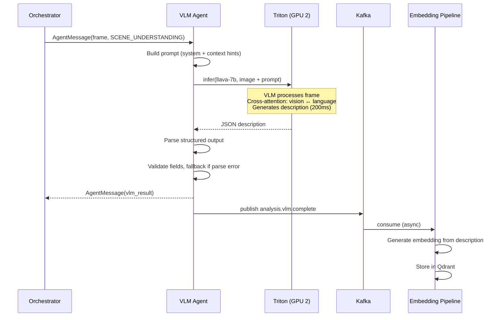
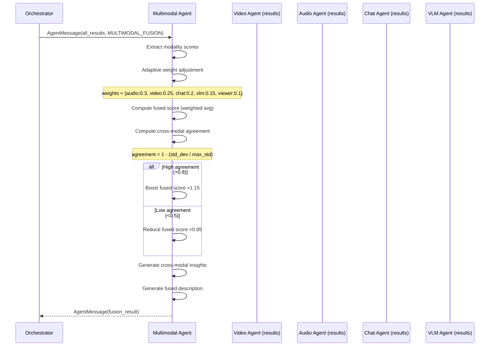
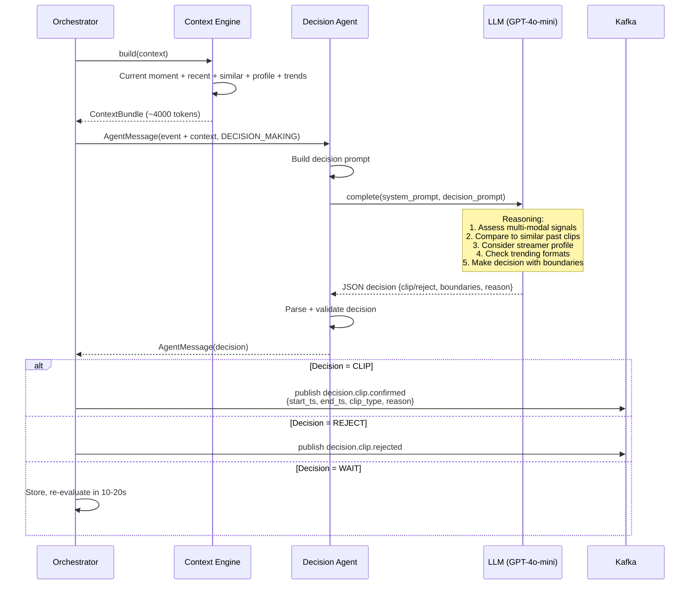

# INTELLIGENCE PLATFORM — PART 2
# AI Intelligence Layer

**Topics:** Video Understanding · Vision Language Models (VLM) · Multimodal AI · Long Context Memory · Knowledge Graph · Context Engine · Semantic Timeline · Retrieval Engine · Embedding Pipeline · LLM Decision Layer

---

# 7. VIDEO UNDERSTANDING

## 7.1 Beyond Detection — Understanding

Video Understanding, basit nesne tespitinin ötesine geçer: sahne bağlamını, eylem sıralarını ve görsel anlatıyı anlamak.

```
DETECTION (Level 1)          →   "There are 2 faces, 1 person, text 'VICTORY'"
UNDERSTANDING (Level 2)      →   "Streamer won the game, celebrating with arms raised"
SEMANTIC UNDERSTANDING (Level 3) → "This is a high-energy climax moment suitable for a 15s clip"
```

### Video Understanding Pipeline

```
┌──────────────────────────────────────────────────────────────────────┐
│                    VIDEO UNDERSTANDING PIPELINE                       │
│                                                                      │
│  ┌──────────┐  ┌──────────┐  ┌──────────┐  ┌──────────┐            │
│  │ Scene    │→ │ Action   │→ │ Context  │→ │ Semantic │            │
│  │ Detect   │  │ Recogn.  │  │ Builder  │  │ Label    │            │
│  │          │  │          │  │          │  │          │            │
│  │ Shot     │  │ What is  │  │ Connect  │  │ "Winning │            │
│  │ boundary │  │ happen-  │  │ scenes   │  │ celebra- │            │
│  │ detect   │  │ ing?     │  │ into     │  │ tion"    │            │
│  │          │  │          │  │ narrative│  │          │            │
│  └──────────┘  └──────────┘  └──────────┘  └──────────┘            │
│       │              │              │              │                  │
│       ▼              ▼              ▼              ▼                  │
│  scene_id       action_type    narrative_id   semantic_label         │
│  start_ts       confidence     scene_chain    excitement_score       │
│  end_ts         actors         temporal_pos   clip_worthy            │
│  shot_type                     context_summary                       │
└──────────────────────────────────────────────────────────────────────┘
```

## 7.2 Folder Structure

```
agents/video_agent/
├── __init__.py
├── agent.py                     # VideoAgent (from Part 1)
├── understanding/
│   ├── __init__.py
│   ├── scene_detector.py        # Shot boundary, scene segmentation
│   ├── action_recognizer.py     # Action recognition (Temporal 3D CNN)
│   ├── context_builder.py       # Build scene narrative
│   ├── semantic_labeler.py      # Assign semantic labels to scenes
│   └── temporal_tracker.py      # Track objects/actions across frames
├── models/
│   ├── face_detector.py         # (from SAD Part 2)
│   ├── emotion_recognizer.py    # (from SAD Part 2)
│   ├── pose_estimator.py        # (from SAD Part 2)
│   ├── ocr_engine.py            # (from SAD Part 2)
│   └── object_detector.py       # YOLOv8
└── config.py
```

## 7.3 Scene Detection

```python
# agents/video_agent/understanding/scene_detector.py

import numpy as np
from dataclasses import dataclass, field
from typing import Optional
from enum import Enum
import cv2
import logging

logger = logging.getLogger(__name__)


class ShotType(Enum):
    """Camera shot classification."""
    WIDE = "wide"           # Full scene visible
    MEDIUM = "medium"       # Streamer + immediate surroundings
    CLOSEUP = "closeup"     # Streamer face fills frame
    GAMEPLAY = "gameplay"   # Game screen dominant
    OVERLAY = "overlay"     # Chat/graphics overlay dominant
    TRANSITION = "transition"  # Scene change in progress


@dataclass
class Scene:
    """A detected scene segment."""
    scene_id: str
    stream_id: str
    start_ts_ms: int
    end_ts_ms: int = 0
    shot_type: ShotType = ShotType.MEDIUM
    keyframe_path: Optional[str] = None
    dominant_colors: list[str] = field(default_factory=list)
    motion_intensity: float = 0.0
    face_count: int = 0
    text_detected: list[str] = field(default_factory=list)
    activity_label: str = ""


class SceneDetector:
    """
    Detects scene boundaries and classifies shot types.

    Scene Boundary Detection Methods:
    1. Histogram difference (color distribution change)
    2. Edge change ratio (structural change)
    3. Motion vector analysis (movement pattern change)
    4. Deep features (CNN embedding distance)

    Threshold: If histogram difference > 0.3 AND edge change > 0.4 → new scene

    Shot Type Classification:
    - Analyze face size relative to frame (closeup vs wide)
    - Check if game screen dominates (gameplay detection)
    - Detect overlay regions (chat panels, alerts)
    """

    def __init__(
        self,
        histogram_threshold: float = 0.3,
        edge_threshold: float = 0.4,
        min_scene_duration_s: float = 2.0,
    ):
        self.histogram_threshold = histogram_threshold
        self.edge_threshold = edge_threshold
        self.min_scene_duration = min_scene_duration_s

        self._prev_histogram: Optional[np.ndarray] = None
        self._prev_edges: Optional[np.ndarray] = None
        self._current_scene: Optional[Scene] = None

    def detect_boundary(self, frame_bgr: np.ndarray, timestamp_ms: int) -> bool:
        """Check if this frame starts a new scene."""
        # Method 1: Color histogram comparison
        hist = cv2.calcHist([frame_bgr], [0, 1, 2], None, [8, 8, 8],
                            [0, 256, 0, 256, 0, 256])
        hist = cv2.normalize(hist, hist).flatten()

        hist_diff = 1.0
        if self._prev_histogram is not None:
            hist_diff = cv2.compareHist(
                self._prev_histogram.astype(np.float32),
                hist.astype(np.float32),
                cv2.HISTCMP_BHATTACHARYYA,
            )

        # Method 2: Edge change ratio
        gray = cv2.cvtColor(frame_bgr, cv2.COLOR_BGR2GRAY)
        edges = cv2.Canny(gray, 50, 150)
        edge_density = np.sum(edges > 0) / edges.size

        edge_diff = 1.0
        if self._prev_edges is not None:
            edge_diff = abs(edge_density - self._prev_edges)

        self._prev_histogram = hist
        self._prev_edges = edge_density

        # Scene boundary if both signals exceed thresholds
        is_boundary = hist_diff > self.histogram_threshold and edge_diff > self.edge_threshold

        # Enforce minimum scene duration
        if is_boundary and self._current_scene:
            duration = (timestamp_ms - self._current_scene.start_ts_ms) / 1000
            if duration < self.min_scene_duration:
                return False  # Too short, extend current scene

        return is_boundary

    def classify_shot(self, frame_bgr: np.ndarray, face_boxes: list) -> ShotType:
        """Classify the camera shot type of a frame."""
        h, w = frame_bgr.shape[:2]
        frame_area = h * w

        if not face_boxes:
            # No faces → likely gameplay or overlay
            # Check for game UI patterns (rectangular regions, text-heavy)
            gray = cv2.cvtColor(frame_bgr, cv2.COLOR_BGR2GRAY)
            text_density = self._estimate_text_density(gray)
            if text_density > 0.15:
                return ShotType.OVERLAY
            return ShotType.GAMEPLAY

        # Check face size relative to frame
        largest_face = max(face_boxes, key=lambda b: (b[2]-b[0]) * (b[3]-b[1]))
        face_area = (largest_face[2] - largest_face[0]) * (largest_face[3] - largest_face[1])
        face_ratio = face_area / frame_area

        if face_ratio > 0.15:
            return ShotType.CLOSEUP
        elif face_ratio > 0.03:
            return ShotType.MEDIUM
        else:
            return ShotType.WIDE

    def _estimate_text_density(self, gray: np.ndarray) -> float:
        """Estimate text density using edge detection."""
        edges = cv2.Canny(gray, 100, 200)
        # Text regions have high edge density with horizontal/vertical patterns
        contours, _ = cv2.findContours(edges, cv2.RETR_EXTERNAL, cv2.CHAIN_APPROX_SIMPLE)
        text_like = sum(
            1 for c in contours
            if 20 < cv2.contourArea(c) < 5000  # Text-like contour size
        )
        return text_like / max(len(contours), 1)
```

## 7.4 Action Recognition

```python
# agents/video_agent/understanding/action_recognizer.py

import numpy as np
from dataclasses import dataclass
from typing import Optional
from enum import Enum
import logging

logger = logging.getLogger(__name__)


class ActionType(Enum):
    """Recognized action types in stream content."""
    # Gaming actions
    KILL = "kill"
    DEATH = "death"
    VICTORY = "victory"
    DEFEAT = "defeat"
    LEVEL_UP = "level_up"
    ACHIEVEMENT = "achievement"

    # Physical actions (streamer)
    HAND_RAISE = "hand_raise"
    JUMP = "jump"
    LEAN_FORWARD = "lean_forward"
    STAND_UP = "stand_up"
    FACE_PALM = "face_palm"
    TABLE_SLAM = "table_slam"

    # Emotional actions
    LAUGH = "laugh"
    SCREAM = "scream"
    CHEER = "cheer"
    RAGE = "rage"

    # Interactive actions
    CHAT_REPLY = "chat_reply"
    DONATION_READ = "donation_read"
    SUB thank = "sub_thank"

    UNKNOWN = "unknown"


@dataclass
class ActionRecognition:
    """Result of action recognition."""
    action_type: ActionType
    confidence: float
    start_ts_ms: int
    end_ts_ms: int
    evidence: dict  # Supporting evidence from multiple signals
    temporal_context: str = ""  # What happened before/after


class ActionRecognizer:
    """
    Multi-signal action recognition.

    Unlike video action recognition (which uses 3D CNNs on video clips),
    we use a MULTI-SIGNAL approach because streams are real-time:

    Signal Fusion for Action Recognition:
    ┌──────────────┐  ┌──────────────┐  ┌──────────────┐
    │ Visual       │  │ Audio        │  │ Text (OCR)   │
    │ - Pose gesture│ │ - Energy spike│ │ - "VICTORY"  │
    │ - Face emotion│ │ - Pitch      │  │ - "KILL"     │
    │ - Body motion │ │ - Speech     │  │ - Score change│
    └──────┬───────┘  └──────┬───────┘  └──────┬───────┘
           │                 │                  │
           └────────────────┬┘──────────────────┘
                            │
                   ┌────────▼────────┐
                   │  ACTION FUSION  │
                   │  (Rule-based +  │
                   │   ML classifier) │
                   └────────┬────────┘
                            │
                   ┌────────▼────────┐
                   │  ACTION_TYPE    │
                   │  + confidence   │
                   └─────────────────┘

    Example:
      Pose: arms_spread (0.9) + Audio: scream (0.85) + OCR: "VICTORY" (0.95)
      → Action: VICTORY (confidence: 0.92)

      Pose: table_slam (0.8) + Audio: rage (0.7) + Emotion: angry (0.8)
      → Action: RAGE (confidence: 0.78)
    """

    # Action signature definitions (multi-signal patterns)
    ACTION_SIGNATURES = {
        ActionType.VICTORY: {
            "pose": ["arms_spread", "hand_raise"],
            "audio": ["cheer", "scream"],
            "ocr": ["victory", "winner", "win", "champion"],
            "emotion": ["happy", "surprise"],
            "min_signals": 2,
            "base_confidence": 0.85,
        },
        ActionType.DEFEAT: {
            "pose": ["face_palm", "lean_forward"],
            "audio": ["sigh", "silence"],
            "ocr": ["defeat", "game over", "eliminated"],
            "emotion": ["sad", "angry"],
            "min_signals": 2,
            "base_confidence": 0.75,
        },
        ActionType.KILL: {
            "ocr": ["kill", "eliminated", "down"],
            "audio": ["scream", "excited"],
            "emotion": ["happy", "surprise"],
            "min_signals": 1,
            "base_confidence": 0.70,
        },
        ActionType.RAGE: {
            "pose": ["table_slam", "stand_up"],
            "audio": ["yell", "angry"],
            "emotion": ["angry"],
            "min_signals": 2,
            "base_confidence": 0.80,
        },
        ActionType.CHEER: {
            "pose": ["hand_raise", "arms_spread"],
            "audio": ["cheer", "laugh"],
            "emotion": ["happy"],
            "min_signals": 2,
            "base_confidence": 0.75,
        },
    }

    def recognize(
        self,
        pose_gestures: list[str],
        audio_events: list[str],
        ocr_texts: list[str],
        emotions: list[str],
        timestamp_ms: int,
    ) -> list[ActionRecognition]:
        """Recognize actions from multi-signal input."""
        results = []

        for action_type, signature in self.ACTION_SIGNATURES.items():
            matched_signals = 0
            evidence = {}

            # Check pose
            pose_match = any(g in signature.get("pose", []) for g in pose_gestures)
            if pose_match:
                matched_signals += 1
                evidence["pose"] = [g for g in pose_gestures if g in signature["pose"]]

            # Check audio
            audio_match = any(a in signature.get("audio", []) for a in audio_events)
            if audio_match:
                matched_signals += 1
                evidence["audio"] = [a for a in audio_events if a in signature["audio"]]

            # Check OCR
            ocr_texts_lower = [t.lower() for t in ocr_texts]
            ocr_match = any(kw in " ".join(ocr_texts_lower) for kw in signature.get("ocr", []))
            if ocr_match:
                matched_signals += 1
                evidence["ocr"] = [kw for kw in signature["ocr"] if kw in " ".join(ocr_texts_lower)]

            # Check emotion
            emotion_match = any(e in signature.get("emotion", []) for e in emotions)
            if emotion_match:
                matched_signals += 1
                evidence["emotion"] = [e for e in emotions if e in signature["emotion"]]

            # Determine if action is recognized
            if matched_signals >= signature["min_signals"]:
                # Confidence increases with more matched signals
                signal_boost = (matched_signals - signature["min_signals"]) * 0.05
                confidence = min(1.0, signature["base_confidence"] + signal_boost)

                results.append(ActionRecognition(
                    action_type=action_type,
                    confidence=confidence,
                    start_ts_ms=timestamp_ms,
                    end_ts_ms=timestamp_ms + 3000,  # Default 3s action duration
                    evidence=evidence,
                ))

        # Sort by confidence, return top match
        results.sort(key=lambda x: x.confidence, reverse=True)
        return results
```

## 7.5 Video Understanding Event Schema

```json
{
  "type": "record",
  "name": "VideoUnderstandingEvent",
  "namespace": "com.intelligence.platform.understanding",
  "fields": [
    {"name": "event_id", "type": "string"},
    {"name": "stream_id", "type": "string"},
    {"name": "scene_id", "type": "string"},
    {"name": "timestamp_ms", "type": "long"},
    {"name": "shot_type", "type": {
      "type": "enum", "name": "ShotType",
      "symbols": ["WIDE", "MEDIUM", "CLOSEUP", "GAMEPLAY", "OVERLAY", "TRANSITION"]
    }},
    {"name": "actions", "type": {"type": "array", "items": {
      "type": "record", "name": "Action",
      "fields": [
        {"name": "action_type", "type": "string"},
        {"name": "confidence", "type": "float"},
        {"name": "evidence", "type": {"type": "map", "values": {
          "type": "array", "items": "string"
        }}}
      ]
    }}},
    {"name": "semantic_label", "type": "string"},
    {"name": "excitement_score", "type": "float"},
    {"name": "clip_worthy", "type": "boolean"}
  ]
}
```

---

# 8. VISION LANGUAGE MODELS (VLM)

## 8.1 Why VLM?

VLM'ler, görsel içeriği doğal dilde açıklar. Bu, sistemin "gördüğünü anlamasını" sağlar:

```
Traditional CV Pipeline Output:
  faces: [{bbox: [100, 200, 300, 400], emotion: "happy", confidence: 0.89}]
  objects: [{class: "person", confidence: 0.95}]
  text: ["VICTORY"]

VLM Output:
  "The streamer is visibly excited, with both arms raised in celebration.
   The game screen shows 'VICTORY' text. This appears to be a winning moment
   in a competitive match. The streamer's facial expression indicates pure joy."

Why this matters:
  1. LLM Decision Agent can reason about VLM description
  2. Semantic search: "find clips where streamer celebrated a win"
  3. Accessibility: auto-generated clip descriptions
  4. Context: VLM understands WHAT is happening, not just WHAT is there
```

## 8.2 VLM Architecture

```
┌──────────────────────────────────────────────────────────────────────┐
│                        VLM AGENT                                     │
│                                                                      │
│  ┌──────────┐    ┌──────────────┐    ┌─────────────┐               │
│  │ Frame    │───→│ Vision       │───→│ Language    │──→ Description│
│  │ Encoder  │    │ Decoder      │    │ Decoder     │               │
│  │ (CLIP)   │    │ (Cross-Attn) │    │ (LLM)       │               │
│  └──────────┘    └──────────────┘    └─────────────┘               │
│                                                                      │
│  Model Options:                                                      │
│  ┌────────────────┬──────────┬──────────┬────────────┬─────────┐   │
│  │ Model          │ VRAM     │ Latency  │ Quality    │ Batch   │   │
│  ├────────────────┼──────────┼──────────┼────────────┼─────────┤   │
│  │ LLaVA-7B       │ 16 GB    │ 200ms    │ Good       │ Yes     │   │
│  │ LLaVA-13B      │ 28 GB    │ 400ms    │ Better     │ Limited │   │
│  │ Qwen-VL-Chat   │ 15 GB    │ 180ms    │ Good       │ Yes     │   │
│  │ CogVLM-17B     │ 36 GB    │ 500ms    │ Best       │ No      │   │
│  │ MiniGPT-4-7B   │ 14 GB    │ 150ms    │ Moderate   │ Yes     │   │
│  └────────────────┴──────────┴──────────┴────────────┴─────────┘   │
│                                                                      │
│  Production Choice: LLaVA-7B (best speed/quality tradeoff)          │
│  Optimized: TensorRT-LLM, FP16, dynamic batching via Triton         │
└──────────────────────────────────────────────────────────────────────┘
```

## 8.3 VLM Agent Implementation

```python
# agents/vlm_agent/agent.py

import asyncio
import base64
import time
from dataclasses import dataclass
from typing import Optional
import logging

from agents.shared.protocol import BaseAgent, AgentMessage, AgentCapability

logger = logging.getLogger(__name__)


@dataclass
class VLMResult:
    """Result of VLM analysis."""
    description: str          # Natural language scene description
    scene_type: str           # "gaming", "just_chatting", "irl", etc.
    key_entities: list[str]   # Important things in the scene
    activity_level: str       # "low", "medium", "high", "extreme"
    emotional_tone: str       # "positive", "negative", "neutral", "excited"
    suggested_clip: bool      # VLM thinks this is clip-worthy
    confidence: float
    processing_time_ms: float


class VLMAgent(BaseAgent):
    """
    Vision-Language Model Agent.

    Processes frames through a VLM to generate natural language descriptions.
    These descriptions feed into:
    1. LLM Decision Agent (for reasoning)
    2. Semantic Timeline (for stream narrative)
    3. Retrieval Engine (for semantic search)
    4. Embedding Pipeline (for vector indexing)

    Prompt Engineering:
    - System prompt: "You are analyzing a live stream frame..."
    - Task-specific prompts: "Describe what's happening in this frame..."
    - Few-shot: Include examples of good descriptions
    - Structured output: Request JSON with specific fields

    Optimization:
    - VLM runs ONLY on triggered frames (not every frame)
    - Triggered by: fast-path signals, high composite score, event detection
    - Runs on dedicated GPU (GPU 2) to avoid contention
    - Batch processing: up to 4 frames per inference
    """

    SYSTEM_PROMPT = """You are an AI analyzing live streaming content. 
Analyze the provided frame and respond with a JSON object containing:
- "description": A 1-2 sentence natural language description of what's happening
- "scene_type": The streaming category (gaming, just_chatting, irl, music, sports)
- "key_entities": List of important visual elements (max 5)
- "activity_level": Energy level (low, medium, high, extreme)
- "emotional_tone": Overall emotional tone (positive, negative, neutral, excited)
- "suggested_clip": Whether this moment is worth clipping (true/false)
- "confidence": Your confidence in the analysis (0.0-1.0)

Respond ONLY with valid JSON. No markdown, no explanation."""

    # Few-shot examples for better output quality
    FEW_SHOT_EXAMPLES = [
        {
            "input": "Frame showing streamer with arms raised, game screen shows VICTORY",
            "output": {
                "description": "The streamer celebrates a victory with both arms raised in triumph, visible joy on their face.",
                "scene_type": "gaming",
                "key_entities": ["streamer", "victory_text", "raised_arms", "joyful_expression"],
                "activity_level": "extreme",
                "emotional_tone": "excited",
                "suggested_clip": True,
                "confidence": 0.92
            }
        }
    ]

    def __init__(self, triton_client, model_name: str = "llava-7b"):
        super().__init__(
            name="vlm_agent",
            capabilities=[AgentCapability.SCENE_UNDERSTANDING],
        )
        self.triton = triton_client
        self.model_name = model_name
        self._request_count = 0

    async def process(self, message: AgentMessage) -> Optional[AgentMessage]:
        """Process a VLM analysis request."""
        self._metrics["messages_received"] += 1
        start = time.time()

        try:
            frame_data = message.payload.get("frame_data")
            stream_id = message.payload.get("stream_id")
            frame_id = message.payload.get("frame_id", "")
            timestamp_ms = message.payload.get("timestamp_ms", 0)
            context_hint = message.payload.get("context_hint", {})

            # Build prompt with context
            prompt = self._build_prompt(context_hint)

            # Call VLM via Triton
            vlm_output = await self._call_vlm(frame_data, prompt)

            # Parse structured output
            result = self._parse_output(vlm_output, timestamp_ms)

            elapsed = (time.time() - start) * 1000
            result.processing_time_ms = elapsed

            self._metrics["messages_processed"] += 1
            self._update_avg_time(elapsed)

            return AgentMessage(
                from_agent=self.name,
                to_agent=message.from_agent,
                message_type="result",
                capability=AgentCapability.SCENE_UNDERSTANDING,
                payload={
                    "frame_id": frame_id,
                    "stream_id": stream_id,
                    "vlm_result": result.__dict__,
                },
                correlation_id=message.correlation_id,
            )

        except Exception as e:
            logger.error(f"VLMAgent error: {e}", exc_info=True)
            self._metrics["messages_failed"] += 1
            return None

    def _build_prompt(self, context_hint: dict) -> str:
        """Build VLM prompt with context."""
        prompt_parts = [self.SYSTEM_PROMPT]

        # Add context hint if available
        if context_hint:
            hints = []
            if context_hint.get("audio_spike"):
                hints.append("Audio spike detected (possible scream/cheer)")
            if context_hint.get("chat_spike"):
                hints.append("Chat activity spike detected")
            if hints:
                prompt_parts.append(f"Context signals: {', '.join(hints)}")

        prompt_parts.append("Analyze this frame:")
        return "\n\n".join(prompt_parts)

    async def _call_vlm(self, frame_data: bytes, prompt: str) -> str:
        """Call VLM model via Triton Inference Server."""
        # Encode frame as base64
        frame_b64 = base64.b64encode(frame_data).decode()

        # Triton inference call
        result = await self.triton.infer(
            model_name=self.model_name,
            inputs={
                "image": frame_b64,
                "prompt": prompt,
                "max_tokens": 200,
                "temperature": 0.3,  # Low temperature for consistent output
            },
        )

        return result.get("text", "")

    def _parse_output(self, vlm_output: str, timestamp_ms: int) -> VLMResult:
        """Parse VLM output into structured result."""
        import json

        try:
            # Try to parse as JSON
            parsed = json.loads(vlm_output)
            return VLMResult(
                description=parsed.get("description", ""),
                scene_type=parsed.get("scene_type", "unknown"),
                key_entities=parsed.get("key_entities", []),
                activity_level=parsed.get("activity_level", "medium"),
                emotional_tone=parsed.get("emotional_tone", "neutral"),
                suggested_clip=parsed.get("suggested_clip", False),
                confidence=parsed.get("confidence", 0.5),
                processing_time_ms=0,
            )
        except json.JSONDecodeError:
            # Fallback: treat entire output as description
            return VLMResult(
                description=vlm_output[:500],
                scene_type="unknown",
                key_entities=[],
                activity_level="medium",
                emotional_tone="neutral",
                suggested_clip=False,
                confidence=0.3,
                processing_time_ms=0,
            )

    async def health_check(self) -> dict:
        return {
            "agent": self.name,
            "state": self.state,
            "model": self.model_name,
            "requests_processed": self._request_count,
            "metrics": self.get_metrics(),
        }
```

## 8.4 VLM Sequence Diagram



---

# 9. MULTIMODAL AI

## 9.1 What is Multimodal Fusion?

Multimodal AI, farklı veri tiplerini (video, audio, chat) **tek bir anlayışta** birleştirir. Her modality ayrı ayrı zayıf olabilir, ama birlikte güçlü bir sinyal oluşturur.

```
UNIMODAL (each alone):                    MULTIMODAL (fused):
                                          
Video: "Person smiling"     (0.6 score)   ┌─────────────────────────────┐
Audio: "Laughter sound"     (0.7 score)   │ "Streamer is genuinely      │
Chat: "hahaha LMAO"         (0.5 score)   │  laughing at something funny│
                                           │  in the game. Chat is also  │
Each signal is ambiguous alone.            │  laughing. High-confidence  │
                                           │  comedy moment."            │
                                           │                             │
                                           │ Fused score: 0.88           │
                                           │ (higher than any single)    │
                                           └─────────────────────────────┘
```

### Fusion Strategies

```
┌─────────────────────────────────────────────────────────────────────┐
│                    FUSION STRATEGIES                                 │
│                                                                     │
│  EARLY FUSION (feature-level)                                       │
│  ┌─────┐ ┌─────┐ ┌─────┐                                           │
│  │Video│ │Audio│ │Chat│ → [Concat Features] → Fusion Model → Score │
│  │Feat │ │Feat │ │Feat │                                           │
│  └─────┘ └─────┘ └─────┘                                           │
│  Pros: Captures cross-modal interactions early                      │
│  Cons: Requires aligned inputs, complex training                    │
│                                                                     │
│  LATE FUSION (decision-level) — OUR CHOICE                          │
│  ┌─────┐ ┌─────┐ ┌─────┐                                           │
│  │Video│ │Audio│ │Chat│ → [各自的Score] → Weighted Avg → Final     │
│  │Model│ │Model│ │Model│                                           │
│  └─────┘ └─────┘ └─────┘                                           │
│  Pros: Simple, modular, each model independently upgradable        │
│  Cons: Misses fine-grained cross-modal patterns                     │
│                                                                     │
│  HYBRID FUSION (both)                                               │
│  Video+Audio → Early fusion → Score1                               │
│  Chat → Independent → Score2                                       │
│  Score1 + Score2 → Late fusion → Final                             │
│  Pros: Best of both worlds                                         │
│  Cons: More complex, needs more data                               │
└─────────────────────────────────────────────────────────────────────┘
```

## 9.2 Multimodal Agent

```python
# agents/multimodal_agent/agent.py

import numpy as np
from dataclasses import dataclass, field
from typing import Optional
import logging

from agents.shared.protocol import BaseAgent, AgentMessage, AgentCapability

logger = logging.getLogger(__name__)


@dataclass
class MultimodalFusionResult:
    """Result of multimodal fusion."""
    fused_score: float
    fused_description: str
    modality_scores: dict      # {"video": 0.7, "audio": 0.8, "chat": 0.6}
    cross_modal_insights: list[str]  # Insights from cross-modal analysis
    confidence: float
    disagreement: float       # How much modalities disagree (0=agree, 1=max disagree)


class MultimodalAgent(BaseAgent):
    """
    Multimodal Fusion Agent — combines signals from all modalities.

    This agent receives results from Video, Audio, Chat, and VLM agents
    and produces a unified understanding of the current moment.

    Fusion Logic:
    1. Collect all modality results for the same timestamp
    2. Normalize scores to [0, 1] range
    3. Apply learned weights (or adaptive weights based on reliability)
    4. Check cross-modal agreement (all modalities agree = high confidence)
    5. Generate fused description
    6. Detect cross-modal insights (e.g., "audio agrees with video emotion")

    Adaptive Weighting:
    - If audio analysis is high-confidence → weight audio more
    - If VLM is available → weight VLM description highly
    - If chat is sparse → reduce chat weight
    - If video analysis failed → redistribute weight to others

    Cross-Modal Agreement:
    - All modalities high → STRONG signal (boost score)
    - Modalities disagree → WEAK signal (reduce confidence)
    - One modality very high, others low → check for false positive
    """

    # Base weights (will be adjusted adaptively)
    BASE_WEIGHTS = {
        "audio": 0.30,       # Audio is strongest single signal
        "video": 0.25,       # Visual analysis
        "chat": 0.20,        # Chat sentiment
        "vlm": 0.15,         # VLM understanding
        "viewer": 0.10,      # Viewer count trend
    }

    def __init__(self):
        super().__init__(
            name="multimodal_agent",
            capabilities=[AgentCapability.MULTIMODAL_FUSION],
        )

    async def process(self, message: AgentMessage) -> Optional[AgentMessage]:
        """Fuse multimodal results."""
        self._metrics["messages_received"] += 1

        try:
            agent_results = message.payload.get("agent_results", {})
            stream_id = message.payload.get("stream_id")
            timestamp_ms = message.payload.get("timestamp_ms")

            # Extract modality scores
            modality_scores = self._extract_scores(agent_results)

            # Adaptive weight adjustment
            weights = self._adjust_weights(modality_scores, agent_results)

            # Compute fused score
            fused_score = self._compute_fused_score(modality_scores, weights)

            # Check cross-modal agreement
            agreement = self._compute_agreement(modality_scores)
            disagreement = 1.0 - agreement

            # Agreement boost: if all modalities agree, boost score
            if agreement > 0.8:
                fused_score = min(1.0, fused_score * 1.15)
            elif disagreement > 0.5:
                fused_score = fused_score * 0.85

            # Generate cross-modal insights
            insights = self._generate_insights(modality_scores, agent_results)

            # Generate fused description
            description = self._generate_description(agent_results, insights)

            result = MultimodalFusionResult(
                fused_score=fused_score,
                fused_description=description,
                modality_scores=modality_scores,
                cross_modal_insights=insights,
                confidence=agreement,
                disagreement=disagreement,
            )

            self._metrics["messages_processed"] += 1

            return AgentMessage(
                from_agent=self.name,
                to_agent=message.from_agent,
                message_type="result",
                capability=AgentCapability.MULTIMODAL_FUSION,
                payload={
                    "stream_id": stream_id,
                    "timestamp_ms": timestamp_ms,
                    "fusion_result": result.__dict__,
                },
                correlation_id=message.correlation_id,
            )

        except Exception as e:
            logger.error(f"MultimodalAgent error: {e}", exc_info=True)
            self._metrics["messages_failed"] += 1
            return None

    def _extract_scores(self, agent_results: dict) -> dict[str, float]:
        """Extract normalized scores from each agent's results."""
        scores = {}

        for agent_name, result in agent_results.items():
            if result is None or not isinstance(result, AgentMessage):
                continue

            payload = result.payload

            if agent_name == "video_agent":
                analysis = payload.get("analysis", {})
                scores["video"] = analysis.get("composite_score", 0)

            elif agent_name == "audio_agent":
                analysis = payload.get("analysis", {})
                scores["audio"] = analysis.get("spike_magnitude",
                                               analysis.get("intensity", 0))

            elif agent_name == "chat_agent":
                analysis = payload.get("analysis", {})
                scores["chat"] = analysis.get("spike_score",
                                               analysis.get("sentiment_intensity", 0))

            elif agent_name == "vlm_agent":
                vlm_result = payload.get("vlm_result", {})
                scores["vlm"] = vlm_result.get("confidence", 0) * (
                    1.0 if vlm_result.get("suggested_clip") else 0.5
                )

        return scores

    def _adjust_weights(self, scores: dict, agent_results: dict) -> dict[str, float]:
        """Adaptively adjust modality weights based on reliability."""
        weights = self.BASE_WEIGHTS.copy()

        # If a modality has no data, redistribute its weight
        total_missing_weight = 0
        for modality in list(weights.keys()):
            if modality not in scores:
                total_missing_weight += weights[modality]
                weights[modality] = 0

        if total_missing_weight > 0 and any(weights.values()):
            # Redistribute to present modalities
            present_total = sum(weights.values())
            for modality in weights:
                if weights[modality] > 0:
                    weights[modality] += total_missing_weight * (
                        weights[modality] / present_total
                    )

        # Normalize
        total = sum(weights.values())
        if total > 0:
            weights = {k: v / total for k, v in weights.items()}

        return weights

    def _compute_fused_score(self, scores: dict, weights: dict) -> float:
        """Compute weighted fused score."""
        if not scores:
            return 0.0
        return sum(weights.get(m, 0) * s for m, s in scores.items())

    def _compute_agreement(self, scores: dict) -> float:
        """Compute how much modalities agree (0=max disagreement, 1=full agreement)."""
        if len(scores) < 2:
            return 1.0

        values = list(scores.values())
        # Agreement = 1 - (std_dev / max_possible_std)
        std = np.std(values)
        max_std = 0.5  # Theoretical max for [0,1] values
        return max(0.0, 1.0 - (std / max_std))

    def _generate_insights(self, scores: dict, agent_results: dict) -> list[str]:
        """Generate cross-modal insights."""
        insights = []

        # Audio + Video emotion agreement
        audio_score = scores.get("audio", 0)
        video_score = scores.get("video", 0)

        if audio_score > 0.7 and video_score > 0.7:
            insights.append("Audio and video signals strongly agree — high-confidence moment")
        elif audio_score > 0.7 and video_score < 0.3:
            insights.append("Audio spike without visual change — possible off-screen event")
        elif video_score > 0.7 and audio_score < 0.3:
            insights.append("Visual excitement without audio — muted reaction or silent surprise")

        # Chat + VLM agreement
        chat_score = scores.get("chat", 0)
        vlm_score = scores.get("vlm", 0)

        if chat_score > 0.6 and vlm_score > 0.6:
            insights.append("Chat reaction matches scene content — authentic engagement")

        return insights

    def _generate_description(self, agent_results: dict, insights: list[str]) -> str:
        """Generate a fused natural language description."""
        parts = []

        for agent_name, result in agent_results.items():
            if result is None or not isinstance(result, AgentMessage):
                continue

            payload = result.payload
            if agent_name == "vlm_agent":
                vlm_desc = payload.get("vlm_result", {}).get("description", "")
                if vlm_desc:
                    parts.append(f"Visual: {vlm_desc}")
            elif agent_name == "audio_agent":
                audio_analysis = payload.get("analysis", {})
                if audio_analysis.get("transcript"):
                    parts.append(f"Audio: \"{audio_analysis['transcript']}\"")
                if audio_analysis.get("spike_magnitude", 0) > 0.5:
                    parts.append(f"Audio intensity: {audio_analysis['spike_magnitude']:.1f}")
            elif agent_name == "chat_agent":
                chat_analysis = payload.get("analysis", {})
                if chat_analysis.get("top_keywords"):
                    parts.append(f"Chat topics: {', '.join(chat_analysis['top_keywords'][:3])}")

        if insights:
            parts.append("Insights: " + "; ".join(insights))

        return " | ".join(parts) if parts else "No significant activity detected"

    async def health_check(self) -> dict:
        return {"agent": self.name, "state": self.state, "metrics": self.get_metrics()}
```

## 9.3 Multimodal Fusion Sequence Diagram



---

# 10. LONG CONTEXT MEMORY

## 10.1 Why Memory?

LLM'ler ve AI ajanları **sınırlı context window**'a sahiptir. Bir 4 saatlik yayın sırasında her şeyi tek bir context'e sığdıramazsınız. Long Context Memory, önemli bilgileri özetler ve saklar.

```
WITHOUT MEMORY                          WITH MEMORY
════════════                            ══════════
Frame 1: "Streamer is playing Valorant"  Episodic Memory:
Frame 2: "Streamer killed enemy"          ┌────────────────────────────┐
Frame 3: "Streamer died"                  │ Hour 1: Playing Valorant,  │
...                                       │ 3 kills, 2 deaths, 1 ace  │
Frame 7200: "Streamer won"                │ won 2 rounds, lost 1       │
                                          │                            │
Context: 7200 frames × 200 words         │ Hour 2: Chatting with      │
= 1.4M tokens → OVERFLOW                 │ viewers, received $50      │
                                          │ donation, laughed a lot    │
                                          │                            │
                                          │ Current: Hour 3, intense   │
                                          │ competitive match, 1-1     │
                                          └────────────────────────────┘
                                          
                                          Semantic Memory:
                                          ┌────────────────────────────┐
                                          │ Streamer profile:          │
                                          │ - Plays FPS games          │
                                          │ - Gets emotional on wins   │
                                          │ - Best clips: clutch plays │
                                          │ - Peak viewers: 5000       │
                                          └────────────────────────────┘
```

## 10.2 Memory Architecture

```
┌──────────────────────────────────────────────────────────────────────┐
│                    LONG CONTEXT MEMORY                               │
│                                                                      │
│  ┌──────────────────────────────────────────────────────────────┐    │
│  │  EPISODIC MEMORY (what happened when)                        │    │
│  │                                                              │    │
│  │  Short-term (last 5 min):                                   │    │
│  │  ┌────┐ ┌────┐ ┌────┐ ┌────┐ ┌────┐                       │    │
│  │  │frame│→│frame│→│frame│→│frame│→│frame│  (rolling buffer)│    │
│  │  └────┘ └────┘ └────┘ └────┘ └────┘                       │    │
│  │  Storage: Redis (volatile, fast)                            │    │
│  │                                                              │    │
│  │  Medium-term (last 1 hour):                                 │    │
│  │  ┌─────────┐ ┌─────────┐ ┌─────────┐                      │    │
│  │  │5min sum │→│5min sum │→│5min sum │  (summaries)        │    │
│  │  └─────────┘ └─────────┘ └─────────┘                      │    │
│  │  Storage: Qdrant (embeddings) + PostgreSQL (text)          │    │
│  │                                                              │    │
│  │  Long-term (entire stream):                                 │    │
│  │  ┌──────────────┐ ┌──────────────┐ ┌──────────────┐      │    │
│  │  │Hour 1 summary│→│Hour 2 summary│→│Hour 3 summary│      │    │
│  │  └──────────────┘ └──────────────┘ └──────────────┘      │    │
│  │  Storage: PostgreSQL + Qdrant                               │    │
│  └──────────────────────────────────────────────────────────────┘    │
│                                                                      │
│  ┌──────────────────────────────────────────────────────────────┐    │
│  │  SEMANTIC MEMORY (general knowledge about streamer)          │    │
│  │                                                              │    │
│  │  ┌────────────┐ ┌────────────┐ ┌────────────┐              │    │
│  │  │ Streamer   │ │ Game prefs │ │ Clip prefs │              │    │
│  │  │ profile    │ │ (what games│ │ (what makes│              │    │
│  │  │ (name,     │ │ they play) │ │ good clips)│              │    │
│  │  │ style)     │ │            │ │            │              │    │
│  │  └────────────┘ └────────────┘ └────────────┘              │    │
│  │  Storage: Knowledge Graph (Neo4j) + PostgreSQL              │    │
│  └──────────────────────────────────────────────────────────────┘    │
│                                                                      │
│  ┌──────────────────────────────────────────────────────────────┐    │
│  │  WORKING MEMORY (current context window for LLM)             │    │
│  │                                                              │    │
│  │  ┌──────────────────────────────────────────────────────┐   │    │
│  │  │ [Recent 5 min summary] + [Current frame analysis]   │   │    │
│  │  │ + [Relevant past clips] + [Streamer preferences]    │   │    │
│  │  │ = LLM context window (~4000 tokens)                 │   │    │
│  │  └──────────────────────────────────────────────────────┘   │    │
│  │  Assembly: Context Engine (see section 12)                   │    │
│  └──────────────────────────────────────────────────────────────┘    │
└──────────────────────────────────────────────────────────────────────┘
```

## 10.3 Implementation

```python
# intelligence/long_context_memory/memory_manager.py

import asyncio
import time
from dataclasses import dataclass, field
from typing import Optional
from collections import deque
import logging

logger = logging.getLogger(__name__)


@dataclass
class EpisodicEntry:
    """A single episodic memory entry."""
    entry_id: str
    stream_id: str
    timestamp_ms: int
    duration_ms: int           # Time span this entry covers
    summary: str               # Natural language summary
    key_events: list[str]      # Important events in this period
    emotion_arc: str           # Emotional trajectory
    highlight_score: float     # Max highlight score in this period
    embedding_id: Optional[str] = None  # Qdrant point ID


@dataclass
class SemanticEntry:
    """A semantic memory entry (persistent knowledge)."""
    entry_id: str
    entity_type: str           # "streamer", "game", "format"
    entity_id: str
    attributes: dict           # Key-value attributes
    relationships: list[dict]  # [{type: "plays", target: "valorant"}]
    confidence: float
    last_updated: int


class LongContextMemoryManager:
    """
    Manages multi-tier memory for the AI system.

    Memory Tiers:
    1. SHORT-TERM (working memory): Last 5 minutes, in Redis
       - Raw analysis results, fast access
       - TTL: 5 minutes, auto-eviction

    2. MEDIUM-TERM (episodic): Last 1 hour, in Qdrant + PostgreSQL
       - 5-minute summaries with embeddings
       - Semantic search for relevant past events

    3. LONG-TERM (semantic): Permanent, in Knowledge Graph + PostgreSQL
       - Streamer profiles, game preferences, clip patterns
       - Updated after each stream

    Memory Consolidation (sleep-like process):
    - Every 5 minutes: consolidate short-term → medium-term
    - Every 1 hour: consolidate medium-term → long-term
    - After stream ends: full consolidation + learning

    Retrieval (for context building):
    - Given current timestamp + query
    - Retrieve: recent context (short-term) + relevant episodes (medium) + profile (long-term)
    - Assemble into ~4000 token context window
    """

    SHORT_TERM_DURATION_MS = 5 * 60 * 1000    # 5 minutes
    MEDIUM_TERM_INTERVAL_MS = 5 * 60 * 1000   # Consolidate every 5 min
    LONG_TERM_INTERVAL_MS = 60 * 60 * 1000    # Consolidate every 1 hour

    def __init__(self, redis_client, qdrant_client, postgres_pool, llm_client):
        self.redis = redis_client
        self.qdrant = qdrant_client
        self.postgres = postgres_pool
        self.llm = llm_client

        # Short-term buffer (per stream)
        self._short_term: dict[str, deque] = {}  # stream_id → deque of recent analysis

        # Consolidation timers
        self._last_medium_consolidation: dict[str, int] = {}
        self._last_long_consolidation: dict[str, int] = {}

    async def add_short_term(
        self, stream_id: str, timestamp_ms: int, analysis: dict
    ):
        """Add analysis result to short-term memory."""
        if stream_id not in self._short_term:
            self._short_term[stream_id] = deque(maxlen=60)  # ~60 frames at 2fps = 30s

        entry = {
            "timestamp_ms": timestamp_ms,
            "analysis": analysis,
        }
        self._short_term[stream_id].append(entry)

        # Also store in Redis for cross-process access
        await self.redis.lpush(
            f"memory:short:{stream_id}",
            str(entry),
        )
        await self.redis.expire(
            f"memory:short:{stream_id}",
            self.SHORT_TERM_DURATION_MS // 1000,
        )

    async def consolidate_medium_term(self, stream_id: str):
        """
        Consolidate short-term memory into medium-term episodic memory.

        This is called every 5 minutes. It:
        1. Collects all short-term entries from the last 5 minutes
        2. Uses LLM to generate a summary
        3. Generates embedding from the summary
        4. Stores summary in PostgreSQL, embedding in Qdrant
        """
        now_ms = int(time.time() * 1000)
        last_consolidation = self._last_medium_consolidation.get(stream_id, 0)

        if now_ms - last_consolidation < self.MEDIUM_TERM_INTERVAL_MS:
            return  # Not time yet

        # Get short-term entries
        entries = list(self._short_term.get(stream_id, []))
        if not entries:
            return

        # Build LLM prompt for summarization
        recent_analyses = [e["analysis"] for e in entries]
        prompt = self._build_consolidation_prompt(recent_analyses, stream_id)

        # LLM summarization
        summary_response = await self.llm.complete(
            prompt=prompt,
            max_tokens=300,
            temperature=0.3,
        )

        # Parse summary
        import json
        try:
            summary_data = json.loads(summary_response)
        except json.JSONDecodeError:
            summary_data = {"summary": summary_response[:500], "key_events": [],
                           "emotion_arc": "unknown", "highlight_score": 0}

        # Generate embedding
        embedding = await self._generate_embedding(summary_data["summary"])

        # Store in Qdrant
        point_id = f"ep_{stream_id}_{last_consolidation}"
        await self.qdrant.upsert(
            collection_name="episodic_memory",
            points=[{
                "id": point_id,
                "vector": embedding,
                "payload": {
                    "stream_id": stream_id,
                    "timestamp_ms": last_consolidation,
                    "duration_ms": now_ms - last_consolidation,
                    "summary": summary_data["summary"],
                    "key_events": summary_data.get("key_events", []),
                    "emotion_arc": summary_data.get("emotion_arc", "unknown"),
                    "highlight_score": summary_data.get("highlight_score", 0),
                },
            }],
        )

        # Store in PostgreSQL
        async with self.postgres.acquire() as conn:
            await conn.execute(
                """INSERT INTO episodic_memory 
                   (entry_id, stream_id, timestamp_ms, duration_ms, summary, 
                    key_events, emotion_arc, highlight_score, embedding_id)
                   VALUES ($1, $2, $3, $4, $5, $6, $7, $8, $9)""",
                point_id, stream_id, last_consolidation, now_ms - last_consolidation,
                summary_data["summary"], summary_data.get("key_events", []),
                summary_data.get("emotion_arc", "unknown"),
                summary_data.get("highlight_score", 0),
                point_id,
            )

        self._last_medium_consolidation[stream_id] = now_ms
        logger.info(f"Consolidated medium-term memory for {stream_id}")

    def _build_consolidation_prompt(self, analyses: list[dict], stream_id: str) -> str:
        """Build LLM prompt for memory consolidation."""
        # Compress analyses into key signals
        signals = []
        for a in analyses[-20:]:  # Last 20 entries
            signals.append({
                "ts": a.get("timestamp_ms"),
                "score": a.get("composite_score", 0),
                "emotions": a.get("emotions", []),
                "actions": a.get("actions", []),
                "audio": a.get("audio_features", {}).get("spike_magnitude", 0),
            })

        return f"""Summarize the last 5 minutes of stream {stream_id} based on these analysis signals.
Respond with JSON containing:
- "summary": 2-3 sentence summary of what happened
- "key_events": list of important events (max 5)
- "emotion_arc": emotional trajectory (e.g., "calm → excited → ecstatic")
- "highlight_score": peak highlight score (0.0-1.0)

Signals: {signals}

Respond with valid JSON only."""

    async def retrieve_context(
        self, stream_id: str, current_ts: int, query: str = ""
    ) -> dict:
        """
        Retrieve context from all memory tiers for the current moment.

        Returns a context bundle suitable for the LLM Decision Layer.
        """
        context = {
            "stream_id": stream_id,
            "current_timestamp_ms": current_ts,
            "short_term": [],
            "medium_term_relevant": [],
            "long_term_profile": {},
        }

        # Short-term: last 5 minutes of raw analysis
        short_entries = list(self._short_term.get(stream_id, []))
        context["short_term"] = [
            {
                "timestamp_ms": e["timestamp_ms"],
                "score": e["analysis"].get("composite_score", 0),
                "emotions": e["analysis"].get("emotions", []),
            }
            for e in short_entries[-10:]  # Last 10 entries
        ]

        # Medium-term: semantic search for relevant past episodes
        if query:
            query_embedding = await self._generate_embedding(query)
            results = await self.qdrant.search(
                collection_name="episodic_memory",
                query_vector=query_embedding,
                query_filter={"stream_id": stream_id},
                limit=5,
            )
            context["medium_term_relevant"] = [
                {
                    "timestamp_ms": r.payload.get("timestamp_ms"),
                    "summary": r.payload.get("summary"),
                    "highlight_score": r.payload.get("highlight_score"),
                    "score": r.score,
                }
                for r in results
            ]

        # Long-term: streamer profile
        async with self.postgres.acquire() as conn:
            profile = await conn.fetchrow(
                "SELECT * FROM streamer_profiles WHERE stream_id = $1",
                stream_id,
            )
            if profile:
                context["long_term_profile"] = dict(profile)

        return context

    async def _generate_embedding(self, text: str) -> list[float]:
        """Generate embedding using sentence-transformers via Triton."""
        # Call embedding model
        result = await self.llm.embed(text)
        return result
```

## 10.4 Memory Database Schema

```sql
-- Episodic memory (medium and long term)
CREATE TABLE episodic_memory (
    entry_id          VARCHAR(100) PRIMARY KEY,
    stream_id         VARCHAR(100) NOT NULL,
    timestamp_ms      BIGINT NOT NULL,
    duration_ms       BIGINT NOT NULL,
    summary           TEXT NOT NULL,
    key_events        TEXT[] DEFAULT '{}',
    emotion_arc       VARCHAR(200),
    highlight_score   FLOAT DEFAULT 0,
    embedding_id      VARCHAR(100),
    tier              VARCHAR(20) DEFAULT 'medium', -- short, medium, long
    created_at        TIMESTAMPTZ DEFAULT now(),
    
    INDEX idx_stream_ts (stream_id, timestamp_ms DESC),
    INDEX idx_tier (tier, stream_id)
);

-- Streamer profiles (semantic memory)
CREATE TABLE streamer_profiles (
    stream_id         VARCHAR(100) PRIMARY KEY,
    streamer_name     VARCHAR(200),
    primary_games     TEXT[] DEFAULT '{}',
    streaming_style   TEXT,          -- "high_energy", "calm", "comedic"
    avg_viewers       INT DEFAULT 0,
    peak_viewers      INT DEFAULT 0,
    total_clips       INT DEFAULT 0,
    best_clip_topics  TEXT[] DEFAULT '{}',
    preferred_clip_len_s INT DEFAULT 30,
    created_at        TIMESTAMPTZ DEFAULT now(),
    updated_at        TIMESTAMPTZ DEFAULT now()
);

-- Memory consolidation log
CREATE TABLE memory_consolidation_log (
    id                UUID PRIMARY KEY DEFAULT gen_random_uuid(),
    stream_id         VARCHAR(100) NOT NULL,
    consolidation_type VARCHAR(20),  -- medium, long
    entries_processed INT,
    summary_generated TEXT,
    duration_ms       BIGINT,
    created_at        TIMESTAMPTZ DEFAULT now()
);
```

## 10.5 Qdrant Collection — Episodic Memory

```json
{
  "collection_name": "episodic_memory",
  "vectors_config": {
    "size": 384,
    "distance": "Cosine"
  },
  "payload_schema": {
    "stream_id": "keyword",
    "timestamp_ms": "integer",
    "duration_ms": "integer",
    "summary": "text",
    "key_events": "keyword[]",
    "emotion_arc": "keyword",
    "highlight_score": "float",
    "tier": "keyword"
  },
  "optimizers_config": {
    "default_segment_number": 4,
    "indexing_threshold": 10000
  }
}
```

---

# 11. KNOWLEDGE GRAPH

## 11.1 What & Why

Knowledge Graph, sistemin **dünyayı anlaması** için varlıklar ve ilişkilerden oluşan bir grafiktir:

```
                    ┌──────────┐
                    │ Streamer │
                    │ "Tuncay" │
                    └────┬─────┘
                         │
          ┌──────────────┼──────────────┐
          │              │              │
          ▼              ▼              ▼
    ┌──────────┐  ┌──────────┐  ┌──────────┐
    │  Game    │  │  Viewer  │  │  Clip    │
    │ "Valorant"│ │ Demographic│ │ Pattern  │
    └────┬─────┘  └──────────┘  └────┬─────┘
         │                           │
         ▼                           ▼
    ┌──────────┐              ┌──────────┐
    │  Agent   │              │  Trend   │
    │ "Jett"   │              │ "Clutch" │
    └──────────┘              └──────────┘

Relationships:
  (Tuncay)-[:PLAYS]->(Valorant)
  (Tuncay)-[:MAIN_AGENT]->(Jett)
  (Tuncay)-[:BEST_CLIP_TYPE]->(Clutch)
  (Tuncay)-[:HAS_VIEWERS]->(18-24_male_dominant)
  (Valorant)-[:HAS_AGENT]->(Jett)
  (Clutch)-[:IS_TRENDING]->(2026-07)
```

## 11.2 Knowledge Graph Schema (Neo4j)

```cypher
// Node definitions
CREATE CONSTRAINT streamer_id IF NOT EXISTS
FOR (s:Streamer) REQUIRE s.streamer_id IS UNIQUE;

CREATE CONSTRAINT game_id IF NOT EXISTS
FOR (g:Game) REQUIRE g.game_id IS UNIQUE;

CREATE CONSTRAINT agent_id IF NOT EXISTS
FOR (a:GameAgent) REQUIRE a.agent_id IS UNIQUE;

CREATE CONSTRAINT clip_id IF NOT EXISTS
FOR (c:Clip) REQUIRE c.clip_id IS UNIQUE;

CREATE CONSTRAINT trend_id IF NOT EXISTS
FOR (t:Trend) REQUIRE t.trend_id IS UNIQUE;

// Relationship types:
// (Streamer)-[:PLAYS {hours: 120, skill: "high"}]->(Game)
// (Streamer)-[:MAIN_AGENT {win_rate: 0.65}]->(GameAgent)
// (Streamer)-[:CREATED {timestamp: ...}]->(Clip)
// (Clip)-[:FEATURES {relevance: 0.9}]->(GameAgent)
// (Clip)-[:MATCHES {score: 0.85}]->(Trend)
// (Streamer)-[:HAS_DEMOGRAPHIC {percentage: 0.6}]->(Demographic)
// (Game)-[:HAS_AGENT]->(GameAgent)
// (Trend)-[:TRENDING_IN {period: "2026-07"}]->(TimePeriod)
```

## 11.3 Implementation

```python
# intelligence/knowledge_graph/graph_service.py

from dataclasses import dataclass
from typing import Optional, Any
import logging

logger = logging.getLogger(__name__)


class KnowledgeGraphService:
    """
    Knowledge Graph service using Neo4j.

    Maintains entities and relationships for:
    - Streamers (profile, preferences, history)
    - Games (titles, agents/characters, mechanics)
    - Clips (patterns, themes, performance)
    - Trends (viral formats, keywords, topics)
    - Viewers (demographics, behavior patterns)

    Queries:
    - "What games does this streamer play?"
    - "What clip types perform best for this streamer?"
    - "What agents are trending in Valorant?"
    - "Find similar streamers based on clip patterns"
    """

    def __init__(self, neo4j_driver):
        self.driver = neo4j_driver

    async def upsert_streamer(self, streamer_data: dict):
        """Create or update a streamer node."""
        query = """
        MERGE (s:Streamer {streamer_id: $streamer_id})
        SET s.name = $name,
            s.streaming_style = $streaming_style,
            s.avg_viewers = $avg_viewers,
            s.peak_viewers = $peak_viewers,
            s.total_clips = $total_clips,
            s.updated_at = datetime()
        """
        async with self.driver.session() as session:
            await session.run(query, **streamer_data)

    async def add_game_relationship(
        self, streamer_id: str, game_id: str, game_name: str,
        hours_played: int, skill_level: str
    ):
        """Record that a streamer plays a game."""
        query = """
        MERGE (s:Streamer {streamer_id: $streamer_id})
        MERGE (g:Game {game_id: $game_id})
        SET g.name = $game_name
        MERGE (s)-[r:PLAYS]->(g)
        SET r.hours = $hours_played,
            r.skill = $skill_level,
            r.last_played = datetime()
        """
        async with self.driver.session() as session:
            await session.run(query,
                streamer_id=streamer_id, game_id=game_id, game_name=game_name,
                hours_played=hours_played, skill_level=skill_level)

    async def record_clip_pattern(
        self, streamer_id: str, clip_id: str, clip_type: str,
        game_id: str, viral_score: float, views: int
    ):
        """Record a clip and its pattern in the graph."""
        query = """
        MERGE (s:Streamer {streamer_id: $streamer_id})
        MERGE (c:Clip {clip_id: $clip_id})
        SET c.clip_type = $clip_type,
            c.viral_score = $viral_score,
            c.views = $views,
            c.created_at = datetime()
        MERGE (s)-[:CREATED]->(c)
        WITH c
        MATCH (g:Game {game_id: $game_id})
        MERGE (c)-[:FROM_GAME]->(g)
        """
        async with self.driver.session() as session:
            await session.run(query,
                streamer_id=streamer_id, clip_id=clip_id, clip_type=clip_type,
                game_id=game_id, viral_score=viral_score, views=views)

    async def get_streamer_context(self, streamer_id: str) -> dict:
        """
        Get comprehensive context about a streamer for decision making.
        
        Returns: games, best clip types, trending agents, viewer demographics
        """
        query = """
        MATCH (s:Streamer {streamer_id: $streamer_id})
        OPTIONAL MATCH (s)-[:PLAYS]->(g:Game)
        OPTIONAL MATCH (s)-[:MAIN_AGENT]->(a:GameAgent)
        OPTIONAL MATCH (s)-[:CREATED]->(c:Clip)
        WITH s, collect(DISTINCT g) as games, collect(DISTINCT a) as agents,
             collect(c) as clips
        RETURN s, games, agents, clips
        """
        async with self.driver.session() as session:
            result = await session.run(query, streamer_id=streamer_id)
            record = await result.single()

            if not record:
                return {}

            return {
                "streamer": dict(record["s"]),
                "games": [dict(g) for g in record["games"]],
                "main_agents": [dict(a) for a in record["agents"]],
                "recent_clips": [
                    {
                        "clip_id": c.get("clip_id"),
                        "clip_type": c.get("clip_type"),
                        "viral_score": c.get("viral_score"),
                        "views": c.get("views"),
                    }
                    for c in record["clips"][-10:]  # Last 10 clips
                ],
            }

    async def find_similar_clip_patterns(
        self, streamer_id: str, clip_type: str, limit: int = 5
    ) -> list[dict]:
        """Find similar past clips for context."""
        query = """
        MATCH (s:Streamer {streamer_id: $streamer_id})-[:CREATED]->(c:Clip)
        WHERE c.clip_type = $clip_type
        RETURN c.clip_id as clip_id, c.viral_score as viral_score,
               c.views as views, c.created_at as created_at
        ORDER BY c.viral_score DESC
        LIMIT $limit
        """
        async with self.driver.session() as session:
            result = await session.run(query,
                streamer_id=streamer_id, clip_type=clip_type, limit=limit)
            return [dict(r) async for r in result]

    async def get_trending_for_game(self, game_name: str) -> list[dict]:
        """Get trending clip types and agents for a game."""
        query = """
        MATCH (g:Game {name: $game_name})<-[:FROM_GAME]-(c:Clip)-[:MATCHES]->(t:Trend)
        WHERE t.trend_period = date().strftime('%Y-%m')
        RETURN t.name as trend, t.trend_type as type,
               count(c) as clip_count, avg(c.viral_score) as avg_viral
        ORDER BY clip_count DESC
        LIMIT 10
        """
        async with self.driver.session() as session:
            result = await session.run(query, game_name=game_name)
            return [dict(r) async for r in result]
```

---

# 12. CONTEXT ENGINE

## 12.1 Role

Context Engine, LLM Decision Layer için **en uygun context window'u**组装r. 4 saatlik bir yayından hangi bilgiler LLM'e verilmeli?

```
┌──────────────────────────────────────────────────────────────────────┐
│                     CONTEXT ENGINE                                   │
│                                                                      │
│  Available Memory (massive):                Assembled Context (~4K): │
│  ┌──────────────────────┐                   ┌──────────────────────┐│
│  │ Short-term (5 min)   │────┐              │ [Current moment]     ││
│  │ Medium-term (1 hour) │────┤              │ Composite score: 0.82││
│  │ Long-term (forever)  │────┤──→ FILTER →  │ Actions: VICTORY     ││
│  │ Knowledge Graph      │────┤    RANK      │ Audio: scream (0.9)  ││
│  │ Past clips (Qdrant)  │────┤    ASSEMBLE  │                      ││
│  │ Stream metrics       │────┘              │ [Recent context]     ││
│  │ Trend data           │                   │ Last 5 min: intense  ││
│  └──────────────────────┘                   │ match, 1-1 score     ││
│                                              │                      ││
│  Token budget: ~4000 tokens                 │ [Similar past clips] ││
│  Must select MOST RELEVANT                  │ 3 similar winning    ││
│  information for decision                   │ clips (avg 50K views)││
│                                              │                      ││
│                                              │ [Streamer profile]   ││
│                                              │ Best clip type: win  ││
│                                              │ Avg clip length: 20s ││
│                                              └──────────────────────┘│
└──────────────────────────────────────────────────────────────────────┘
```

## 12.2 Implementation

```python
# agents/context_agent/context_engine.py

import time
from dataclasses import dataclass, field
from typing import Optional
import logging

logger = logging.getLogger(__name__)


@dataclass
class ContextBundle:
    """Assembled context for LLM Decision Layer."""
    current_moment: dict         # What's happening RIGHT NOW
    recent_context: dict         # Last 5 minutes summary
    relevant_episodes: list      # Similar past moments from medium-term memory
    similar_clips: list          # Past clips similar to current situation
    streamer_profile: dict       # Streamer preferences and history
    trending_context: dict       # Current trends relevant to this stream
    token_estimate: int = 0
    components_used: list = field(default_factory=list)


class ContextEngine:
    """
    Builds optimal context window for LLM Decision Layer.

    Context Assembly Algorithm:
    1. CURRENT MOMENT (always, ~500 tokens):
       - Current composite score
       - Active signals (audio, video, chat, VLM)
       - Detected actions
       - Current scene description

    2. RECENT CONTEXT (always, ~800 tokens):
       - Last 5 minutes summary from episodic memory
       - Emotion arc trajectory
       - Signal trend (increasing/decreasing)

    3. SIMILAR PAST CLIPS (if available, ~1000 tokens):
       - Query Qdrant for clips similar to current moment
       - Include their outcomes (viral score, views)
       - Helps LLM predict: "will this clip go viral?"

    4. STREAMER PROFILE (always, ~500 tokens):
       - Best clip types for this streamer
       - Preferred clip length
       - Historical performance

    5. TRENDING CONTEXT (if available, ~500 tokens):
       - Current trending formats
       - Relevant game trends

    6. REMAINING BUDGET (~700 tokens):
       - Fill with relevant episodes from long-term memory
       - Prioritize by relevance score

    Token Budget Management:
    - Hard limit: 4096 tokens
    - Each component has soft budget
    - If one component exceeds budget, truncate
    - Prioritize: current > recent > similar > profile > trends > episodes
    """

    TOKEN_BUDGET = 4096
    COMPONENT_BUDGETS = {
        "current_moment": 500,
        "recent_context": 800,
        "similar_clips": 1000,
        "streamer_profile": 500,
        "trending_context": 500,
        "relevant_episodes": 700,
    }

    def __init__(
        self,
        memory_manager,
        retrieval_engine,
        knowledge_graph,
        clickhouse_client,
    ):
        self.memory = memory_manager
        self.retrieval = retrieval_engine
        self.graph = knowledge_graph
        self.clickhouse = clickhouse_client

    async def build(self, orchestrator_context) -> ContextBundle:
        """Build context bundle for LLM decision."""
        bundle = ContextBundle(
            current_moment={},
            recent_context={},
            relevant_episodes=[],
            similar_clips=[],
            streamer_profile={},
            trending_context={},
        )

        stream_id = orchestrator_context.stream_id
        timestamp_ms = orchestrator_context.timestamp_ms

        # 1. Current moment (from agent results)
        bundle.current_moment = self._extract_current_moment(orchestrator_context)
        bundle.components_used.append("current_moment")

        # 2. Recent context (from short-term memory)
        recent = await self.memory.retrieve_context(stream_id, timestamp_ms)
        bundle.recent_context = {
            "short_term": recent.get("short_term", []),
            "summary": "Recent activity available in short-term memory",
        }
        bundle.components_used.append("recent_context")

        # 3. Similar past clips (from Qdrant via retrieval engine)
        query = self._build_similarity_query(bundle.current_moment)
        similar = await self.retrieval.search_similar_clips(
            query=query,
            stream_id=stream_id,
            limit=3,
        )
        bundle.similar_clips = similar
        bundle.components_used.append("similar_clips")

        # 4. Streamer profile (from Knowledge Graph)
        profile = await self.graph.get_streamer_context(stream_id)
        bundle.streamer_profile = profile
        bundle.components_used.append("streamer_profile")

        # 5. Trending context (from ClickHouse + trend detection)
        if profile and profile.get("games"):
            game_name = profile["games"][0].get("name", "")
            if game_name:
                trends = await self.graph.get_trending_for_game(game_name)
                bundle.trending_context = {"trends": trends}
                bundle.components_used.append("trending_context")

        # 6. Relevant episodes (fill remaining budget)
        relevant = await self.memory.retrieve_context(
            stream_id, timestamp_ms, query=query
        )
        bundle.relevant_episodes = relevant.get("medium_term_relevant", [])
        bundle.components_used.append("relevant_episodes")

        # Estimate token count
        bundle.token_estimate = self._estimate_tokens(bundle)

        return bundle

    def _extract_current_moment(self, context) -> dict:
        """Extract current moment from orchestrator context."""
        moment = {
            "timestamp_ms": context.timestamp_ms,
            "composite_score": 0,
            "signals": {},
            "actions": [],
            "scene_description": "",
        }

        for agent_name, result in context.agent_results.items():
            if result is None or not isinstance(result, AgentMessage):
                continue

            payload = result.payload

            if agent_name == "video_agent":
                analysis = payload.get("analysis", {})
                moment["composite_score"] = analysis.get("composite_score", 0)
                moment["signals"]["video"] = {
                    "emotions": analysis.get("emotions", []),
                    "poses": analysis.get("poses", []),
                }
                moment["actions"] = analysis.get("actions", [])

            elif agent_name == "audio_agent":
                analysis = payload.get("analysis", {})
                moment["signals"]["audio"] = {
                    "spike_magnitude": analysis.get("spike_magnitude", 0),
                    "transcript": analysis.get("transcript", ""),
                }

            elif agent_name == "chat_agent":
                analysis = payload.get("analysis", {})
                moment["signals"]["chat"] = {
                    "spike_score": analysis.get("spike_score", 0),
                    "top_keywords": analysis.get("top_keywords", []),
                }

            elif agent_name == "vlm_agent":
                vlm_result = payload.get("vlm_result", {})
                moment["scene_description"] = vlm_result.get("description", "")

            elif agent_name == "multimodal_agent":
                fusion = payload.get("fusion_result", {})
                moment["fused_score"] = fusion.get("fused_score", 0)
                moment["cross_modal_insights"] = fusion.get("cross_modal_insights", [])

        return moment

    def _build_similarity_query(self, current_moment: dict) -> str:
        """Build a text query for similarity search."""
        parts = []
        if current_moment.get("scene_description"):
            parts.append(current_moment["scene_description"])
        if current_moment.get("actions"):
            parts.append(" ".join(current_moment["actions"]))
        if current_moment.get("signals", {}).get("chat", {}).get("top_keywords"):
            parts.append(" ".join(current_moment["signals"]["chat"]["top_keywords"]))
        return " ".join(parts) if parts else "highlight moment"

    def _estimate_tokens(self, bundle: ContextBundle) -> int:
        """Rough token estimate (4 chars ≈ 1 token)."""
        import json
        text = json.dumps(bundle.__dict__, default=str)
        return len(text) // 4
```

---

# 13. SEMANTIC TIMELINE

## 13.1 What is Semantic Timeline?

Semantic Timeline, bir yayını **anlamlı bölümlere** ayırır ve her bölüme semantik etiketler koyar:

```
RAW TIMELINE (frames):
  |------------------------------------------------------------------>
  00:00  00:30  01:00  01:30  02:00  02:30  03:00  03:30  04:00 ...

SEMANTIC TIMELINE:
  |─────────────|──────────|────────────────|──────────|──────────|
  "Intro &      | "Casual  | "Intense       | "Winning  | "Chatting|
  setup"        | gameplay"| competitive   | moment!"  | with chat"
  low energy    | medium   | match"         | EXTREME   | medium   |
  score: 0.1    | score:0.3| score: 0.5     | score:0.9 | score:0.2|
                            |                |           |
                         Clip!           CLIP!!!       No clip
```

## 13.2 Implementation

```python
# intelligence/semantic_timeline/timeline_builder.py

import time
from dataclasses import dataclass, field
from typing import Optional
from collections import deque
import logging

logger = logging.getLogger(__name__)


@dataclass
class TimelineSegment:
    """A segment of the semantic timeline."""
    segment_id: str
    stream_id: str
    start_ts_ms: int
    end_ts_ms: int
    semantic_label: str           # "casual_gameplay", "intense_moment", etc.
    description: str              # Natural language description
    activity_level: str           # "low", "medium", "high", "extreme"
    avg_score: float
    peak_score: float
    key_events: list[str] = field(default_factory=list)
    clip_candidates: list[str] = field(default_factory=list)  # Clip IDs
    embedding_id: Optional[str] = None


class SemanticTimelineBuilder:
    """
    Builds a semantic timeline of a live stream.

    Process:
    1. Ingest analysis results (frame by frame)
    2. Detect segment boundaries (score transitions, scene changes)
    3. Label each segment semantically (using VLM descriptions + LLM)
    4. Track activity level and score trajectory
    5. Store segments with embeddings for future retrieval

    Segment Boundary Detection:
    - Score transition: avg score changes by > 0.3 over 10s window
    - Scene change: VLM description changes significantly
    - Action change: different action types detected
    - Time gap: no analysis for > 30s (stream paused/buffering)

    Segment Labeling:
    - Combine VLM description + actions + emotions + audio features
    - Use LLM to generate concise semantic label
    - Example: "Intense Valorant competitive match, streamer winning"
    """

    SEGMENT_TRANSITION_THRESHOLD = 0.3
    MIN_SEGMENT_DURATION_MS = 10_000  # 10 seconds

    def __init__(self, llm_client, qdrant_client, postgres_pool):
        self.llm = llm_client
        self.qdrant = qdrant_client
        self.postgres = postgres_pool

        # Per-stream state
        self._current_segments: dict[str, TimelineSegment] = {}
        self._score_history: dict[str, deque] = {}  # stream_id → deque of (ts, score)

    async def process_analysis(
        self, stream_id: str, timestamp_ms: int, analysis: dict
    ):
        """Process a new analysis result and update timeline."""
        score = analysis.get("composite_score", 0)
        vlm_desc = analysis.get("scene_description", "")
        actions = analysis.get("actions", [])

        # Update score history
        if stream_id not in self._score_history:
            self._score_history[stream_id] = deque(maxlen=120)  # 60s at 2fps
        self._score_history[stream_id].append((timestamp_ms, score))

        # Check if we need to start a new segment
        if self._should_start_new_segment(stream_id, timestamp_ms, score):
            await self._close_segment(stream_id, timestamp_ms)
            await self._start_segment(stream_id, timestamp_ms, analysis)

        # Update current segment
        segment = self._current_segments.get(stream_id)
        if segment:
            segment.end_ts_ms = timestamp_ms
            segment.peak_score = max(segment.peak_score, score)
            # Rolling average
            segment.avg_score = (segment.avg_score * 0.95 + score * 0.05)
            if actions:
                segment.key_events.extend(actions[:2])

    def _should_start_new_segment(
        self, stream_id: str, timestamp_ms: int, current_score: float
    ) -> bool:
        """Check if current score indicates a segment transition."""
        history = self._score_history.get(stream_id, deque())

        # Need at least 20 data points (10s) to detect transition
        if len(history) < 20:
            return False

        # Check if current segment exists
        segment = self._current_segments.get(stream_id)
        if segment is None:
            return True  # No current segment, start one

        # Check minimum duration
        duration = timestamp_ms - segment.start_ts_ms
        if duration < self.MIN_SEGMENT_DURATION_MS:
            return False

        # Check score transition
        recent_scores = [s for _, s in list(history)[-20:]]
        older_scores = [s for _, s in list(history)[-40:-20]]

        if older_scores:
            recent_avg = sum(recent_scores) / len(recent_scores)
            older_avg = sum(older_scores) / len(older_scores)
            if abs(recent_avg - older_avg) > self.SEGMENT_TRANSITION_THRESHOLD:
                return True

        return False

    async def _start_segment(
        self, stream_id: str, timestamp_ms: int, analysis: dict
    ):
        """Start a new timeline segment."""
        segment_id = f"seg_{stream_id}_{timestamp_ms}"

        segment = TimelineSegment(
            segment_id=segment_id,
            stream_id=stream_id,
            start_ts_ms=timestamp_ms,
            end_ts_ms=timestamp_ms,
            semantic_label="",
            description=analysis.get("scene_description", ""),
            activity_level=self._score_to_activity(analysis.get("composite_score", 0)),
            avg_score=analysis.get("composite_score", 0),
            peak_score=analysis.get("composite_score", 0),
            key_events=analysis.get("actions", [])[:3],
        )

        self._current_segments[stream_id] = segment

    async def _close_segment(self, stream_id: str, end_ts_ms: int):
        """Close the current segment and persist it."""
        segment = self._current_segments.get(stream_id)
        if segment is None:
            return

        segment.end_ts_ms = end_ts_ms

        # Generate semantic label using LLM
        label = await self._generate_label(segment)
        segment.semantic_label = label

        # Generate embedding
        embedding = await self._generate_embedding(segment.description)
        segment.embedding_id = f"tl_{segment.segment_id}"

        # Store in Qdrant
        await self.qdrant.upsert(
            collection_name="semantic_timeline",
            points=[{
                "id": segment.embedding_id,
                "vector": embedding,
                "payload": {
                    "stream_id": stream_id,
                    "segment_id": segment.segment_id,
                    "start_ts_ms": segment.start_ts_ms,
                    "end_ts_ms": segment.end_ts_ms,
                    "semantic_label": segment.semantic_label,
                    "description": segment.description,
                    "activity_level": segment.activity_level,
                    "avg_score": segment.avg_score,
                    "peak_score": segment.peak_score,
                },
            }],
        )

        # Store in PostgreSQL
        async with self.postgres.acquire() as conn:
            await conn.execute(
                """INSERT INTO semantic_timeline
                   (segment_id, stream_id, start_ts_ms, end_ts_ms,
                    semantic_label, description, activity_level,
                    avg_score, peak_score, key_events, embedding_id)
                   VALUES ($1, $2, $3, $4, $5, $6, $7, $8, $9, $10, $11)""",
                segment.segment_id, segment.stream_id,
                segment.start_ts_ms, segment.end_ts_ms,
                segment.semantic_label, segment.description,
                segment.activity_level, segment.avg_score,
                segment.peak_score, segment.key_events,
                segment.embedding_id,
            )

        logger.info(f"Closed timeline segment: {segment.semantic_label} "
                    f"({segment.start_ts_ms}-{segment.end_ts_ms}ms)")

    async def _generate_label(self, segment: TimelineSegment) -> str:
        """Generate semantic label using LLM."""
        prompt = f"""Generate a concise semantic label (3-5 words) for this stream segment:

Description: {segment.description}
Activity level: {segment.activity_level}
Peak score: {segment.peak_score:.2f}
Key events: {', '.join(segment.key_events[:3])}

Label (3-5 words):"""

        response = await self.llm.complete(prompt=prompt, max_tokens=20, temperature=0.3)
        return response.strip().strip('"').strip("'")

    def _score_to_activity(self, score: float) -> str:
        if score > 0.7:
            return "extreme"
        elif score > 0.5:
            return "high"
        elif score > 0.3:
            return "medium"
        else:
            return "low"

    async def _generate_embedding(self, text: str) -> list[float]:
        """Generate embedding for timeline segment."""
        return await self.llm.embed(text)

    async def get_timeline(
        self, stream_id: str, start_ts: int = 0, end_ts: int = 0
    ) -> list[dict]:
        """Retrieve semantic timeline for a stream."""
        async with self.postgres.acquire() as conn:
            rows = await conn.fetch(
                """SELECT * FROM semantic_timeline
                   WHERE stream_id = $1
                   AND ($2 = 0 OR start_ts_ms >= $2)
                   AND ($3 = 0 OR end_ts_ms <= $3)
                   ORDER BY start_ts_ms""",
                stream_id, start_ts, end_ts,
            )
            return [dict(r) for r in rows]
```

## 13.3 Timeline Database

```sql
CREATE TABLE semantic_timeline (
    segment_id        VARCHAR(100) PRIMARY KEY,
    stream_id         VARCHAR(100) NOT NULL,
    start_ts_ms       BIGINT NOT NULL,
    end_ts_ms         BIGINT NOT NULL,
    semantic_label    VARCHAR(200) NOT NULL,
    description       TEXT,
    activity_level    VARCHAR(20),
    avg_score         FLOAT,
    peak_score        FLOAT,
    key_events        TEXT[] DEFAULT '{}',
    embedding_id      VARCHAR(100),
    created_at        TIMESTAMPTZ DEFAULT now(),
    
    INDEX idx_stream_ts (stream_id, start_ts_ms),
    INDEX idx_activity (activity_level, stream_id)
);
```

---

# 14. RETRIEVAL ENGINE

## 14.1 Architecture

Retrieval Engine, RAG (Retrieval-Augmented Generation) için semantik arama yapar. "Buna benzer geçmiş klip'ler" sorusunu yanıtlar.

```
┌──────────────────────────────────────────────────────────────────────┐
│                    RETRIEVAL ENGINE                                   │
│                                                                      │
│  Query: "streamer winning competitive valorant match"               │
│                                                                      │
│  ┌──────────┐    ┌──────────────┐    ┌──────────────┐              │
│  │ Query    │──→ │ Embedding    │──→ │ Qdrant ANN   │              │
│  │ Text     │    │ Model        │    │ Search       │              │
│  └──────────┘    └──────────────┘    └──────┬───────┘              │
│                                             │                        │
│                                             ▼                        │
│                                     ┌──────────────┐               │
│                                     │ Re-ranker    │               │
│                                     │ (Cross-encoder│               │
│                                     │  fine-tuned) │               │
│                                     └──────┬───────┘               │
│                                             │                        │
│                                             ▼                        │
│                                     ┌──────────────┐               │
│                                     │ Filter +     │               │
│                                     │ Rank         │               │
│                                     └──────┬───────┘               │
│                                             │                        │
│                                             ▼                        │
│                                     Top-K Results:                   │
│                                     1. Clip "Ace clutch" (0.92)    │
│                                     2. Clip "1v3 retake" (0.87)    │
│                                     3. Clip "Match point" (0.84)   │
└──────────────────────────────────────────────────────────────────────┘
```

## 14.2 Implementation

```python
# intelligence/retrieval_engine/retrieval_service.py

from dataclasses import dataclass
from typing import Optional
import logging

logger = logging.getLogger(__name__)


@dataclass
class RetrievalResult:
    """A single retrieval result."""
    id: str
    score: float
    payload: dict
    reranked_score: Optional[float] = None


class RetrievalEngine:
    """
    Semantic retrieval engine using Qdrant vector database.

    Capabilities:
    1. Search similar clips (by description, actions, emotions)
    2. Search episodic memory (past stream moments)
    3. Search semantic timeline segments
    4. Hybrid search (vector + metadata filter)

    Collections:
    - "clips": All generated clips with embeddings
    - "episodic_memory": Stream episode summaries
    - "semantic_timeline": Timeline segment embeddings

    Re-ranking:
    - Initial ANN search returns top-20 (fast, approximate)
    - Cross-encoder re-ranks top-20 → top-5 (slow, precise)
    - Re-ranker is fine-tuned on clip similarity data

    Hybrid Search:
    - Vector similarity (semantic match)
    + Metadata filters (stream_id, date range, clip_type)
    + Score boost (viral_score, view_count)
    """

    def __init__(self, qdrant_client, embedding_model, reranker_model=None):
        self.qdrant = qdrant_client
        self.embedder = embedding_model
        self.reranker = reranker_model

    async def search_similar_clips(
        self,
        query: str,
        stream_id: Optional[str] = None,
        clip_type: Optional[str] = None,
        limit: int = 5,
        min_viral_score: float = 0.0,
    ) -> list[RetrievalResult]:
        """Search for clips similar to the query text."""
        # Generate query embedding
        query_vector = await self.embedder.embed(query)

        # Build filter
        filters = {}
        must = []
        if stream_id:
            must.append({"key": "stream_id", "match": {"value": stream_id}})
        if clip_type:
            must.append({"key": "clip_type", "match": {"value": clip_type}})
        if min_viral_score > 0:
            must.append({"key": "viral_score", "range": {"gte": min_viral_score}})
        if must:
            filters["must"] = must

        # ANN search (retrieve top 3x for re-ranking)
        search_limit = min(limit * 3, 20)
        results = await self.qdrant.search(
            collection_name="clips",
            query_vector=query_vector,
            query_filter=filters if filters else None,
            limit=search_limit,
            with_payload=True,
        )

        # Convert to RetrievalResult
        retrieval_results = [
            RetrievalResult(
                id=r.id,
                score=r.score,
                payload=r.payload,
            )
            for r in results
        ]

        # Re-rank if reranker available
        if self.reranker and len(retrieval_results) > limit:
            retrieval_results = await self._rerank(query, retrieval_results)
            retrieval_results = retrieval_results[:limit]

        return retrieval_results[:limit]

    async def search_episodes(
        self,
        query: str,
        stream_id: str,
        limit: int = 5,
    ) -> list[RetrievalResult]:
        """Search episodic memory for relevant past episodes."""
        query_vector = await self.embedder.embed(query)

        results = await self.qdrant.search(
            collection_name="episodic_memory",
            query_vector=query_vector,
            query_filter={"must": [{"key": "stream_id", "match": {"value": stream_id}}]},
            limit=limit,
            with_payload=True,
        )

        return [
            RetrievalResult(id=r.id, score=r.score, payload=r.payload)
            for r in results
        ]

    async def search_timeline(
        self,
        query: str,
        stream_id: str,
        limit: int = 10,
    ) -> list[RetrievalResult]:
        """Search semantic timeline segments."""
        query_vector = await self.embedder.embed(query)

        results = await self.qdrant.search(
            collection_name="semantic_timeline",
            query_vector=query_vector,
            query_filter={"must": [{"key": "stream_id", "match": {"value": stream_id}}]},
            limit=limit,
            with_payload=True,
        )

        return [
            RetrievalResult(id=r.id, score=r.score, payload=r.payload)
            for r in results
        ]

    async def _rerank(
        self, query: str, results: list[RetrievalResult]
    ) -> list[RetrievalResult]:
        """Re-rank results using cross-encoder model."""
        pairs = []
        for r in results:
            doc_text = r.payload.get("description", "") or r.payload.get("summary", "")
            pairs.append((query, doc_text))

        # Get re-ranker scores
        scores = await self.reranker.score_pairs(pairs)

        # Update reranked scores and sort
        for r, score in zip(results, scores):
            r.reranked_score = float(score)

        results.sort(key=lambda x: x.reranked_score or x.score, reverse=True)
        return results
```

---

# 15. EMBEDDING PIPELINE

## 15.1 Architecture

Embedding Pipeline, tüm metinsel ve görsel içeriği vektörlere dönüştürür ve Qdrant'a indexer.

```
┌──────────────────────────────────────────────────────────────────────┐
│                   EMBEDDING PIPELINE                                  │
│                                                                      │
│  Sources:                                                            │
│  ┌──────────┐ ┌──────────┐ ┌──────────┐ ┌──────────┐ ┌──────────┐  │
│  │ Clip     │ │ VLM      │ │ Episode  │ │ Timeline │ │ Chat     │  │
│  │ descrip. │ │ descrip. │ │ summary  │ │ segment  │ │ messages │  │
│  └────┬─────┘ └────┬─────┘ └────┬─────┘ └────┬─────┘ └────┬─────┘  │
│       │            │            │            │            │          │
│       └────────────┴────────────┴────────────┴────────────┘          │
│                              │                                        │
│                    ┌─────────▼─────────┐                              │
│                    │  EMBEDDING MODEL   │                              │
│                    │  (sentence-transformers│                          │
│                    │   all-MiniLM-L6-v2) │                            │
│                    │  384 dimensions     │                              │
│                    └─────────┬─────────┘                              │
│                              │                                        │
│                    ┌─────────▼─────────┐                              │
│                    │  QDRANT INDEXER    │                              │
│                    │                    │                              │
│                    │  Collections:      │                              │
│                    │  - clips           │                              │
│                    │  - episodic_memory │                              │
│                    │  - semantic_timeline│                             │
│                    │  - chat_topics     │                              │
│                    └────────────────────┘                              │
└──────────────────────────────────────────────────────────────────────┘
```

## 15.2 Implementation

```python
# intelligence/embedding_pipeline/pipeline.py

import asyncio
import hashlib
import time
from dataclasses import dataclass
from typing import Optional
import logging

logger = logging.getLogger(__name__)


@dataclass
class EmbeddingTask:
    """A single embedding task."""
    task_id: str
    collection: str          # "clips", "episodic_memory", etc.
    text: str
    payload: dict
    priority: int = 5


class EmbeddingPipeline:
    """
    Generates and indexes embeddings for all content types.

    Model: sentence-transformers/all-MiniLM-L6-v2
    - 384 dimensions (compact, fast)
    - Multilingual (works for English + Turkish)
    - 80MB model size
    - 15ms per embedding on GPU
    - 45ms per embedding on CPU

    For visual embeddings: CLIP ViT-B/32
    - 512 dimensions
    - Bridges text and image space
    - Used for frame-to-text similarity

    Batching:
    - Collect embedding requests for 100ms
    - Batch process (up to 32 texts per call)
    - 3x throughput improvement

    Indexing Strategy:
    - Upsert (idempotent — safe to retry)
    - Use content hash as point ID (deduplication)
    - Payload includes metadata for filtering
    """

    def __init__(self, embedding_model, qdrant_client, batch_interval_ms: int = 100):
        self.model = embedding_model
        self.qdrant = qdrant_client
        self.batch_interval = batch_interval_ms / 1000

        self._queue: asyncio.Queue[EmbeddingTask] = asyncio.Queue()
        self._running = False
        self._metrics = {
            "embeddings_generated": 0,
            "batches_processed": 0,
            "errors": 0,
            "avg_batch_size": 0.0,
        }

    async def start(self):
        """Start the background embedding worker."""
        self._running = True
        asyncio.create_task(self._worker_loop())

    async def stop(self):
        self._running = False

    async def submit(self, task: EmbeddingTask):
        """Submit an embedding task (non-blocking)."""
        await self._queue.put(task)

    async def _worker_loop(self):
        """Background worker that batches and processes embedding tasks."""
        while self._running:
            batch = []
            try:
                # Wait for first task
                first = await asyncio.wait_for(self._queue.get(), timeout=1.0)
                batch.append(first)

                # Collect more tasks within batch interval
                deadline = time.time() + self.batch_interval
                while len(batch) < 32 and time.time() < deadline:
                    try:
                        remaining = deadline - time.time()
                        task = await asyncio.wait_for(
                            self._queue.get(), timeout=max(0.01, remaining)
                        )
                        batch.append(task)
                    except asyncio.TimeoutError:
                        break

                # Process batch
                if batch:
                    await self._process_batch(batch)

            except asyncio.TimeoutError:
                continue
            except Exception as e:
                logger.error(f"Embedding worker error: {e}", exc_info=True)

    async def _process_batch(self, batch: list[EmbeddingTask]):
        """Process a batch of embedding tasks."""
        try:
            # Group by collection
            by_collection: dict[str, list[EmbeddingTask]] = {}
            for task in batch:
                if task.collection not in by_collection:
                    by_collection[task.collection] = []
                by_collection[task.collection].append(task)

            # Generate embeddings and index per collection
            for collection, tasks in by_collection.items():
                texts = [t.text for t in tasks]

                # Batch embed
                embeddings = await self.model.embed_batch(texts)

                # Build Qdrant points
                points = []
                for task, embedding in zip(tasks, embeddings):
                    # Use content hash as ID for deduplication
                    point_id = hashlib.md5(
                        task.text.encode()
                    ).hexdigest()

                    points.append({
                        "id": point_id,
                        "vector": embedding,
                        "payload": {
                            **task.payload,
                            "text": task.text[:1000],  # Store truncated text
                            "created_at": int(time.time() * 1000),
                        },
                    })

                # Upsert to Qdrant
                await self.qdrant.upsert(
                    collection_name=collection,
                    points=points,
                )

            # Update metrics
            self._metrics["embeddings_generated"] += len(batch)
            self._metrics["batches_processed"] += 1
            self._metrics["avg_batch_size"] = (
                self._metrics["avg_batch_size"] * 0.9 + len(batch) * 0.1
            )

        except Exception as e:
            logger.error(f"Batch embedding error: {e}", exc_info=True)
            self._metrics["errors"] += 1

    def get_metrics(self) -> dict:
        return self._metrics
```

---

# 16. LLM DECISION LAYER

## 16.1 Role

LLM Decision Layer, sistemin **beynidir**. Tüm sinyalleri, context'i ve geçmişi sentezler ve "Bu anı klip yapmalı mıyız?" sorusunu yanıtlar.

```
┌──────────────────────────────────────────────────────────────────────┐
│                    LLM DECISION LAYER                                 │
│                                                                      │
│  Input:                                                              │
│  ┌──────────────────────────────────────────────────────────────┐    │
│  │ Context Bundle (~4000 tokens):                               │    │
│  │  - Current moment (score, signals, actions, VLM description) │    │
│  │  - Recent context (last 5 min)                               │    │
│  │  - Similar past clips (with outcomes)                        │    │
│  │  - Streamer profile (preferences, history)                   │    │
│  │  - Trending context                                          │    │
│  └──────────────────────────────────────────────────────────────┘    │
│                                                                      │
│  LLM Reasoning:                                                      │
│  "The streamer just won a clutch round in Valorant.                 │
│   Composite score is 0.85, with audio spike (scream) and            │
│   arms raised. Similar past clips for this streamer averaged        │
│   45K views. The streamer's best clip type is 'clutch wins'.        │
│   This moment matches that pattern.                                  │
│                                                                      │
│   Decision: CLIP                                                     │
│   Start: -12s (include build-up)                                    │
│   End: +5s (include celebration)                                    │
│   Confidence: 0.88                                                   │
│   Reason: High-intensity victory moment matching streamer's best    │
│   clip pattern. Strong multi-modal signal agreement."               │
│                                                                      │
│  Output:                                                             │
│  {                                                                   │
│    "decision": "clip",                                              │
│    "start_offset_ms": -12000,                                       │
│    "end_offset_ms": 5000,                                           │
│    "confidence": 0.88,                                              │
│    "reason": "...",                                                 │
│    "clip_type": "clutch_win",                                       │
│    "predicted_virality": 0.75                                       │
│  }                                                                   │
└──────────────────────────────────────────────────────────────────────┘
```

## 16.2 Implementation

```python
# agents/decision_agent/agent.py

import json
import time
from dataclasses import dataclass
from typing import Optional
import logging

from agents.shared.protocol import BaseAgent, AgentMessage, AgentCapability

logger = logging.getLogger(__name__)


@dataclass
class ClipDecision:
    """LLM's clip decision."""
    decision: str               # "clip", "reject", "wait"
    start_offset_ms: int        # Relative to current timestamp (negative = before)
    end_offset_ms: int          # Relative to current timestamp (positive = after)
    confidence: float
    reason: str
    clip_type: str              # "clutch_win", "rage_moment", "funny_chat", etc.
    predicted_virality: float   # 0.0 - 1.0
    target_platforms: list[str]  # ["youtube", "tiktok", "instagram"]


class DecisionAgent(BaseAgent):
    """
    LLM-powered Decision Agent.

    Uses a Large Language Model to make nuanced clip decisions that
    go beyond simple threshold-based scoring.

    LLM Options:
    - GPT-4o-mini: Fast (500ms), good quality, API cost
    - Claude 3 Haiku: Fast (400ms), good quality, API cost
    - Llama 3 70B (local via vLLM): Slower (1s), good quality, no API cost
    - Llama 3 8B (local via vLLM): Fast (300ms), moderate quality, no API cost

    Production Strategy:
    - Primary: GPT-4o-mini (best speed/quality/cost ratio)
    - Fallback: Llama 3 8B local (when API unavailable)
    - A/B test: Route 10% to Claude 3 Haiku for comparison

    Decision Types:
    1. CLIP: Generate a clip from this moment
    2. REJECT: Not worth clipping (below threshold or not interesting)
    3. WAIT: Potentially interesting, but need more context (wait for more signals)

    The LLM provides:
    - Precise clip boundaries (not just "clip everything")
    - Human-readable reasoning (for audit and learning)
    - Clip type classification
    - Virality prediction (from similar past clips)
    - Platform recommendations
    """

    DECISION_SYSTEM_PROMPT = """You are the AI Decision Agent for a live stream clip generation system.

Your job is to decide whether the current moment in a live stream should be clipped.

You will receive:
1. Current moment analysis (score, signals, actions, scene description)
2. Recent context (last 5 minutes)
3. Similar past clips (with their performance)
4. Streamer profile (preferences, best clip types)
5. Trending context

Make a decision and respond with JSON:
{
  "decision": "clip" | "reject" | "wait",
  "start_offset_ms": <int>,  // Negative = before current moment
  "end_offset_ms": <int>,    // Positive = after current moment
  "confidence": <float>,     // 0.0 - 1.0
  "reason": "<string>",      // 1-2 sentence explanation
  "clip_type": "<string>",   // Category of clip
  "predicted_virality": <float>,  // 0.0 - 1.0
  "target_platforms": ["youtube", "tiktok", ...]
}

Guidelines:
- CLIP when: high multi-modal agreement, matches streamer's best pattern, strong signals
- REJECT when: weak signals, false positive likely, already clipped similar moment recently
- WAIT when: signals increasing but not yet at peak, might get better in 10-20 seconds
- Clip length: typically 15-45 seconds (start before the moment, end after)
- Consider: streamer's style, audience preferences, trending formats
- Respond with valid JSON only, no markdown."""

    def __init__(self, llm_client, model_name: str = "gpt-4o-mini"):
        super().__init__(
            name="decision_agent",
            capabilities=[AgentCapability.DECISION_MAKING],
        )
        self.llm = llm_client
        self.model_name = model_name
        self._decision_count = 0

    async def process(self, message: AgentMessage) -> Optional[AgentMessage]:
        """Process a decision request."""
        self._metrics["messages_received"] += 1
        start = time.time()

        try:
            payload = message.payload
            stream_id = payload.get("stream_id")
            composite_score = payload.get("composite_score", 0)
            agent_results = payload.get("agent_results", {})
            context_bundle = payload.get("context", {})
            timestamp_ms = payload.get("timestamp_ms", 0)

            # Build LLM prompt
            prompt = self._build_decision_prompt(
                composite_score, agent_results, context_bundle
            )

            # Call LLM
            llm_response = await self.llm.complete(
                prompt=prompt,
                system_prompt=self.DECISION_SYSTEM_PROMPT,
                model=self.model_name,
                max_tokens=300,
                temperature=0.2,  # Low temperature for consistent decisions
            )

            # Parse decision
            decision = self._parse_decision(llm_response, timestamp_ms)

            elapsed = (time.time() - start) * 1000
            self._metrics["messages_processed"] += 1
            self._update_avg_time(elapsed)
            self._decision_count += 1

            logger.info(
                f"Decision: {decision.decision} (confidence: {decision.confidence:.2f}) "
                f"for stream {stream_id} — {decision.reason[:80]}"
            )

            return AgentMessage(
                from_agent=self.name,
                to_agent=message.from_agent,
                message_type="result",
                capability=AgentCapability.DECISION_MAKING,
                payload={
                    "stream_id": stream_id,
                    "decision": decision.decision,
                    "start_ts": timestamp_ms + decision.start_offset_ms,
                    "end_ts": timestamp_ms + decision.end_offset_ms,
                    "confidence": decision.confidence,
                    "reason": decision.reason,
                    "clip_type": decision.clip_type,
                    "predicted_virality": decision.predicted_virality,
                    "target_platforms": decision.target_platforms,
                    "llm_model": self.model_name,
                    "processing_time_ms": elapsed,
                },
                correlation_id=message.correlation_id,
            )

        except Exception as e:
            logger.error(f"DecisionAgent error: {e}", exc_info=True)
            self._metrics["messages_failed"] += 1
            return None

    def _build_decision_prompt(
        self, score: float, agent_results: dict, context: dict
    ) -> str:
        """Build the decision prompt from context bundle."""
        import json

        prompt_parts = []

        # Current moment
        prompt_parts.append(f"COMPOSITE SCORE: {score:.2f}")

        # Extract key signals
        signals = {}
        for agent_name, result in agent_results.items():
            if result is None or not isinstance(result, AgentMessage):
                continue
            payload = result.payload

            if agent_name == "video_agent":
                analysis = payload.get("analysis", {})
                signals["video"] = {
                    "emotions": [e.get("label") for e in analysis.get("emotions", [])],
                    "actions": analysis.get("actions", []),
                    "objects": [o.get("class_name") for o in analysis.get("objects", [])[:5]],
                }
            elif agent_name == "audio_agent":
                analysis = payload.get("analysis", {})
                signals["audio"] = {
                    "spike": analysis.get("spike_magnitude", 0),
                    "transcript": analysis.get("transcript", "")[:100],
                }
            elif agent_name == "chat_agent":
                analysis = payload.get("analysis", {})
                signals["chat"] = {
                    "spike": analysis.get("spike_score", 0),
                    "keywords": analysis.get("top_keywords", [])[:5],
                }
            elif agent_name == "vlm_agent":
                vlm = payload.get("vlm_result", {})
                signals["vlm"] = {
                    "description": vlm.get("description", "")[:200],
                    "suggested_clip": vlm.get("suggested_clip", False),
                }

        prompt_parts.append(f"SIGNALS: {json.dumps(signals, indent=2)}")

        # Context
        if context:
            # Recent context
            recent = context.get("recent_context", {})
            if recent.get("short_term"):
                prompt_parts.append(
                    f"RECENT: {len(recent['short_term'])} recent frames, "
                    f"trend: {'increasing' if score > recent['short_term'][-1].get('score', 0) else 'decreasing'}"
                )

            # Similar clips
            similar = context.get("similar_clips", [])
            if similar:
                clip_summaries = [
                    f"  - Type: {c.get('clip_type', '?')}, "
                    f"Views: {c.get('views', '?')}, "
                    f"Viral: {c.get('viral_score', '?')}"
                    for c in similar[:3]
                ]
                prompt_parts.append("SIMILAR PAST CLIPS:\n" + "\n".join(clip_summaries))

            # Streamer profile
            profile = context.get("streamer_profile", {})
            if profile:
                streamer = profile.get("streamer", {})
                prompt_parts.append(
                    f"STREAMER: {streamer.get('name', '?')}, "
                    f"style: {streamer.get('streaming_style', '?')}, "
                    f"best clips: {streamer.get('best_clip_topics', [])[:3]}"
                )

            # Trends
            trending = context.get("trending_context", {})
            if trending.get("trends"):
                trend_names = [t.get("trend", "") for t in trending["trends"][:3]]
                prompt_parts.append(f"TRENDING: {', '.join(trend_names)}")

        prompt_parts.append("\nMake your decision:")
        return "\n\n".join(prompt_parts)

    def _parse_decision(self, llm_response: str, timestamp_ms: int) -> ClipDecision:
        """Parse LLM response into ClipDecision."""
        try:
            parsed = json.loads(llm_response)
            return ClipDecision(
                decision=parsed.get("decision", "reject"),
                start_offset_ms=parsed.get("start_offset_ms", -15000),
                end_offset_ms=parsed.get("end_offset_ms", 5000),
                confidence=float(parsed.get("confidence", 0.5)),
                reason=parsed.get("reason", "No reason provided"),
                clip_type=parsed.get("clip_type", "unknown"),
                predicted_virality=float(parsed.get("predicted_virality", 0.5)),
                target_platforms=parsed.get("target_platforms", ["youtube"]),
            )
        except (json.JSONDecodeError, ValueError) as e:
            logger.warning(f"Failed to parse LLM decision: {e}")
            return ClipDecision(
                decision="reject",
                start_offset_ms=0,
                end_offset_ms=0,
                confidence=0.3,
                reason="LLM response parse error, defaulting to reject",
                clip_type="unknown",
                predicted_virality=0.0,
                target_platforms=[],
            )

    async def health_check(self) -> dict:
        return {
            "agent": self.name,
            "state": self.state,
            "model": self.model_name,
            "decisions_made": self._decision_count,
            "metrics": self.get_metrics(),
        }
```

## 16.3 LLM Decision Sequence Diagram



## 16.4 Production Scenario — LLM API Failure

```
1. GPT-4o-mini API returns 503 (service unavailable)
2. Decision Agent catches exception
3. Fallback: Switch to local Llama 3 8B via vLLM
4. Llama 3 8B: Slightly lower quality but still functional
5. Alert: "Primary LLM unavailable, using fallback"
6. Retry GPT-4o-mini every 60s
7. When GPT-4o-mini recovers → switch back
8. Log all fallback decisions for quality comparison

Impact: Slightly lower decision quality during fallback (5-10% accuracy drop)
Mitigation: Fallback chain: GPT-4o-mini → Llama 3 8B → Score-based threshold
```

---

## Part 2 Summary

| Component | Key Files | Collections/Tables | Event Topics |
|---|---|---|---|
| Video Understanding | `agents/video_agent/understanding/` | `semantic_timeline` (PG) | `analysis.video.understanding` |
| VLM Agent | `agents/vlm_agent/` | — | `analysis.vlm.complete` |
| Multimodal AI | `agents/multimodal_agent/` | — | `analysis.multimodal.fused` |
| Long Context Memory | `intelligence/long_context_memory/` | `episodic_memory` (PG+Qdrant), `streamer_profiles` (PG) | (internal) |
| Knowledge Graph | `intelligence/knowledge_graph/` | Neo4j graph | (internal) |
| Context Engine | `agents/context_agent/` | — | (internal) |
| Semantic Timeline | `intelligence/semantic_timeline/` | `semantic_timeline` (PG+Qdrant) | (internal) |
| Retrieval Engine | `intelligence/retrieval_engine/` | Qdrant: `clips`, `episodic_memory`, `semantic_timeline` | (internal) |
| Embedding Pipeline | `intelligence/embedding_pipeline/` | Qdrant: all collections | `intelligence.embedding.indexed` |
| LLM Decision Layer | `agents/decision_agent/` | `clip_decisions` (PG) | `decision.llm.reasoning` |

---

*Continue to `IP_PART3_STREAM_INTELLIGENCE.md` for Stream Intelligence & Predictive Engines.*
