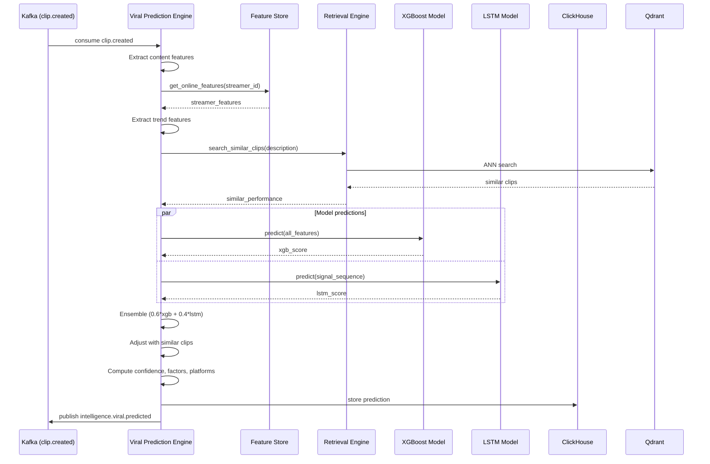
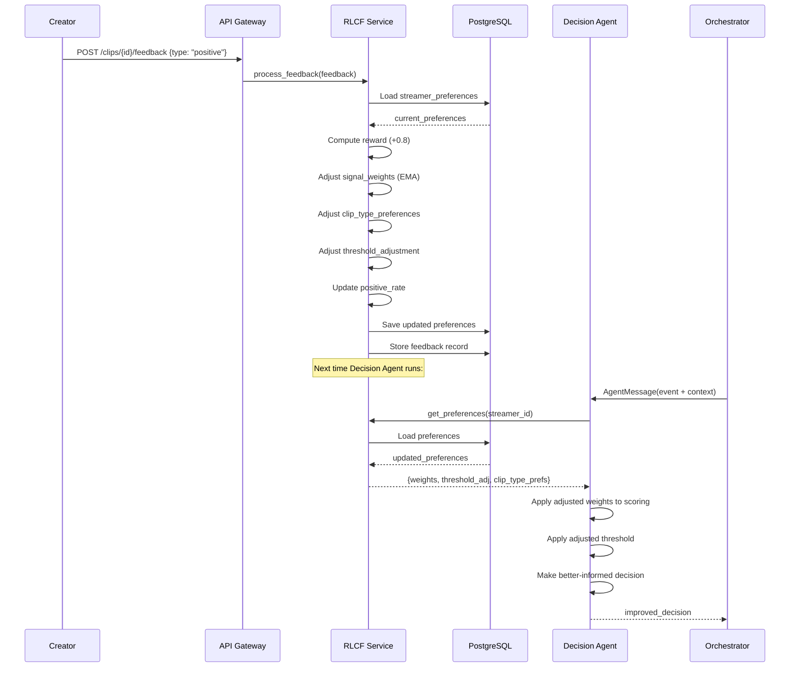

# INTELLIGENCE PLATFORM — PART 3
# Stream Intelligence & Predictive Engines

**Topics:** Stream Intelligence · Viral Prediction Engine · Content Scoring Engine · Trend Detection · Reinforcement Learning from Creator Feedback (RLCF) · Feature Store

---

# 17. STREAM INTELLIGENCE

## 17.1 What is Stream Intelligence?

Stream Intelligence, bir yayının **canlı sağlığını ve dinamiklerini** anlamaktır. Sadece "şu an ne oluyor" değil, "bu yayın nasıl gidiyor" sorusunu yanıtlar.

```
STREAM INTELLIGENCE DASHBOARD (real-time):
┌────────────────────────────────────────────────────────────────────┐
│  STREAM: Tuncay_Valorant_Ranked    DURATION: 2h 34m               │
│                                                                    │
│  ┌─────────────┐  ┌─────────────┐  ┌─────────────┐              │
│  │ Energy      │  │ Engagement  │  │ Clip Yield  │              │
│  │ ████████░░  │  │ ██████░░░░  │  │ ███████░░░  │              │
│  │ 0.82 (HIGH) │  │ 0.65 (GOOD) │  │ 7 clips     │              │
│  └─────────────┘  └─────────────┘  └─────────────┘              │
│                                                                    │
│  Trajectory: ───────────╱╲────────╱╲╱╲─── NOW                     │
│              calm     spike    fluctuating                         │
│                                                                    │
│  Prediction: Next highlight window in ~4 min (0.72 confidence)   │
│  Warning: Viewer retention dropping (-12% in last 15 min)        │
│  Trend: Chat mentions "ace" increasing (trending topic)          │
└────────────────────────────────────────────────────────────────────┘
```

## 17.2 Stream Intelligence Metrics

```
┌──────────────────────────────────────────────────────────────────────┐
│                    STREAM INTELLIGENCE METRICS                       │
│                                                                      │
│  REAL-TIME (updated every 5s):                                       │
│  ├── energy_level: 0.0-1.0 (composite of audio+video+chat activity)│
│  ├── engagement_index: viewer interaction rate                       │
│  ├── chat_velocity: messages per minute                              │
│  ├── sentiment_flow: positive vs negative trend                      │
│  ├── highlight_density: clips per hour                               │
│  └── stream_phase: "warmup" / "active" / "peak" / "cooldown"        │
│                                                                      │
│  PREDICTIVE (updated every 30s):                                     │
│  ├── next_highlight_eta: estimated minutes to next highlight        │
│  ├── viewer_retention_trend: increasing/stable/decreasing           │
│  ├── clip_yield_forecast: expected clips in next hour               │
│  └── stream_quality_score: overall stream quality (0-1)            │
│                                                                      │
│  HISTORICAL (updated every 5 min):                                   │
│  ├── peak_energy_time: when stream was most exciting                │
│  ├── avg_session_length: typical viewer watch time                  │
│  ├── best_clip_time: when best clips tend to occur                  │
│  └── streamer_performance_vs_baseline: better/worse than usual     │
└──────────────────────────────────────────────────────────────────────┘
```

## 17.3 Implementation

```python
# intelligence/stream_intelligence/stream_analyzer.py

import time
import math
from dataclasses import dataclass, field
from collections import deque
from typing import Optional
import numpy as np
import logging

logger = logging.getLogger(__name__)


@dataclass
class StreamIntelligenceSnapshot:
    """Real-time stream intelligence snapshot."""
    stream_id: str
    timestamp_ms: int
    energy_level: float = 0.0
    engagement_index: float = 0.0
    chat_velocity: float = 0.0
    sentiment_flow: float = 0.0
    highlight_density: float = 0.0
    stream_phase: str = "warmup"
    next_highlight_eta_min: float = 0.0
    viewer_retention_trend: str = "stable"
    clip_yield_forecast: int = 0
    stream_quality_score: float = 0.0


class StreamIntelligenceAnalyzer:
    """
    Real-time stream intelligence analyzer.

    Consumes analysis events and produces a rolling intelligence snapshot
    that helps the system understand the overall stream dynamics.

    Key Capabilities:
    1. Energy tracking: rolling composite of all activity signals
    2. Phase detection: warmup → active → peak → cooldown
    3. Highlight prediction: when is the next highlight likely?
    4. Retention monitoring: are viewers leaving?
    5. Quality scoring: how good is this stream overall?

    Phase Detection Logic:
    - WARMUP (first 10 min): energy < 0.3, building up
    - ACTIVE (10-60 min): energy 0.3-0.6, consistent activity
    - PEAK (any time): energy > 0.6 for 5+ min, high engagement
    - COOLDOWN (after peak): energy dropping from peak, > 0.3
    - ENDING (last 10 min): energy < 0.2, winding down

    Highlight Prediction:
    - Uses historical pattern: highlights tend to occur every 15-25 min
    - Adjusted by current energy trend
    - If energy rising → highlight sooner
    - If energy falling → highlight later
    """

    # Rolling windows
    ENERGY_WINDOW = 300      # 5 minutes (seconds)
    CHAT_WINDOW = 60         # 1 minute
    HIGHLIGHT_WINDOW = 3600  # 1 hour

    # Phase thresholds
    WARMUP_DURATION_S = 600   # 10 minutes
    PEAK_ENERGY_THRESHOLD = 0.6
    PEAK_DURATION_S = 300     # 5 minutes at peak
    COOLDOWN_THRESHOLD = 0.3

    def __init__(self):
        # Per-stream state
        self._energy_history: dict[str, deque] = {}     # stream_id → (ts, energy)
        self._chat_history: dict[str, deque] = {}        # stream_id → (ts, count)
        self._highlight_times: dict[str, list] = {}      # stream_id → [timestamps]
        self._viewer_history: dict[str, deque] = {}      # stream_id → (ts, count)
        self._stream_start: dict[str, int] = {}          # stream_id → start_ts

    def update(
        self,
        stream_id: str,
        timestamp_ms: int,
        composite_score: float,
        chat_count: int,
        viewer_count: int,
        sentiment: float = 0.0,
    ) -> StreamIntelligenceSnapshot:
        """Update stream intelligence with new data point."""
        ts_s = timestamp_ms / 1000

        # Initialize stream state
        if stream_id not in self._stream_start:
            self._stream_start[stream_id] = timestamp_ms
        if stream_id not in self._energy_history:
            self._energy_history[stream_id] = deque(maxlen=self.ENERGY_WINDOW)
        if stream_id not in self._chat_history:
            self._chat_history[stream_id] = deque(maxlen=self.CHAT_WINDOW)
        if stream_id not in self._viewer_history:
            self._viewer_history[stream_id] = deque(maxlen=60)
        if stream_id not in self._highlight_times:
            self._highlight_times[stream_id] = []

        # Update histories
        self._energy_history[stream_id].append((ts_s, composite_score))
        self._chat_history[stream_id].append((ts_s, chat_count))
        self._viewer_history[stream_id].append((ts_s, viewer_count))

        # Compute metrics
        energy_level = self._compute_energy_level(stream_id)
        chat_velocity = self._compute_chat_velocity(stream_id)
        engagement_index = self._compute_engagement(stream_id, chat_velocity, viewer_count)
        stream_phase = self._detect_phase(stream_id, ts_s, energy_level)
        next_highlight = self._predict_next_highlight(stream_id, ts_s, energy_level)
        retention_trend = self._compute_retention_trend(stream_id)
        quality_score = self._compute_quality_score(
            energy_level, engagement_index, chat_velocity, len(self._highlight_times[stream_id])
        )

        return StreamIntelligenceSnapshot(
            stream_id=stream_id,
            timestamp_ms=timestamp_ms,
            energy_level=energy_level,
            engagement_index=engagement_index,
            chat_velocity=chat_velocity,
            sentiment_flow=sentiment,
            highlight_density=len(self._highlight_times[stream_id]) / max(
                (ts_s - self._stream_start[stream_id] / 1000) / 3600, 0.1
            ),
            stream_phase=stream_phase,
            next_highlight_eta_min=next_highlight,
            viewer_retention_trend=retention_trend,
            stream_quality_score=quality_score,
        )

    def record_highlight(self, stream_id: str, timestamp_ms: int):
        """Record that a highlight/clip was generated."""
        if stream_id not in self._highlight_times:
            self._highlight_times[stream_id] = []
        self._highlight_times[stream_id].append(timestamp_ms / 1000)

    def _compute_energy_level(self, stream_id: str) -> float:
        """Compute rolling energy level (EMA over 5 min)."""
        history = self._energy_history.get(stream_id, deque())
        if not history:
            return 0.0

        # Exponential moving average
        scores = [s for _, s in history]
        alpha = 0.1
        ema = scores[0]
        for s in scores[1:]:
            ema = alpha * s + (1 - alpha) * ema
        return min(1.0, ema)

    def _compute_chat_velocity(self, stream_id: str) -> float:
        """Compute chat messages per minute."""
        history = self._chat_history.get(stream_id, deque())
        if len(history) < 2:
            return 0.0

        time_span = history[-1][0] - history[0][0]
        if time_span < 1:
            return 0.0

        total_msgs = sum(c for _, c in history)
        return total_msgs / (time_span / 60)  # Per minute

    def _compute_engagement(
        self, stream_id: str, chat_vel: float, viewers: int
    ) -> float:
        """Compute engagement index (chat activity relative to viewer count)."""
        if viewers == 0:
            return 0.0
        # Engagement = chat messages per viewer per minute
        raw = chat_vel / viewers
        # Normalize: 1 message/viewer/min = very high engagement
        return min(1.0, raw * 100)

    def _detect_phase(
        self, stream_id: str, ts_s: float, energy: float
    ) -> str:
        """Detect current stream phase."""
        start_ts = self._stream_start.get(stream_id, 0) / 1000
        duration_s = ts_s - start_ts

        # Check for sustained peak
        history = self._energy_history.get(stream_id, deque())
        recent_high = sum(1 for _, e in list(history)[-60:] if e > self.PEAK_ENERGY_THRESHOLD)

        if duration_s < self.WARMUP_DURATION_S:
            return "warmup"
        elif recent_high > self.PEAK_DURATION_S:
            return "peak"
        elif energy < self.COOLDOWN_THRESHOLD and duration_s > self.WARMUP_DURATION_S:
            return "cooldown"
        else:
            return "active"

    def _predict_next_highlight(
        self, stream_id: str, ts_s: float, current_energy: float
    ) -> float:
        """Predict ETA to next highlight in minutes."""
        highlights = self._highlight_times.get(stream_id, [])

        if len(highlights) < 2:
            # Not enough history, use default
            base_eta = 20.0  # 20 min default
        else:
            # Average interval between highlights
            intervals = [highlights[i] - highlights[i-1]
                        for i in range(1, len(highlights))]
            base_eta = np.median(intervals) / 60  # Convert to minutes

        # Adjust based on energy trend
        history = self._energy_history.get(stream_id, deque())
        if len(history) >= 10:
            recent = [s for _, s in list(history)[-10:]]
            older = [s for _, s in list(history)[-20:-10]] if len(history) >= 20 else recent

            trend = np.mean(recent) - np.mean(older)
            if trend > 0.1:  # Energy rising
                base_eta *= 0.6  # Highlight sooner
            elif trend < -0.1:  # Energy falling
                base_eta *= 1.4  # Highlight later

        return max(1.0, min(60.0, base_eta))

    def _compute_retention_trend(self, stream_id: str) -> str:
        """Compute viewer retention trend."""
        history = self._viewer_history.get(stream_id, deque())
        if len(history) < 10:
            return "stable"

        recent = [v for _, v in list(history)[-5:]]
        older = [v for _, v in list(history)[-10:-5]]

        recent_avg = np.mean(recent)
        older_avg = np.mean(older)

        if older_avg == 0:
            return "stable"

        change = (recent_avg - older_avg) / older_avg

        if change > 0.05:
            return "increasing"
        elif change < -0.05:
            return "decreasing"
        return "stable"

    def _compute_quality_score(
        self, energy: float, engagement: float, chat_vel: float, clip_count: int
    ) -> float:
        """Compute overall stream quality score."""
        # Normalize clip count (more clips = more interesting stream)
        clip_score = min(1.0, clip_count / 10.0)

        # Weighted combination
        quality = (
            energy * 0.35 +
            engagement * 0.25 +
            min(1.0, chat_vel / 100) * 0.15 +
            clip_score * 0.25
        )
        return min(1.0, quality)
```

## 17.4 Stream Intelligence Database (ClickHouse)

```sql
-- Real-time stream intelligence snapshots
CREATE TABLE stream_intelligence (
    stream_id              String,
    timestamp_ms           UInt64,
    energy_level           Float64,
    engagement_index       Float64,
    chat_velocity          Float64,
    sentiment_flow         Float64,
    highlight_density      Float64,
    stream_phase           LowCardinality(String),
    next_highlight_eta_min Float64,
    viewer_retention_trend LowCardinality(String),
    stream_quality_score   Float64,
    
    INDEX idx_stream_ts (stream_id, timestamp_ms)
) ENGINE = MergeTree
PARTITION BY toYYYYMMDD(fromUnixTimestamp64Milli(timestamp_ms))
ORDER BY (stream_id, timestamp_ms)
TTL toDateTime(timestamp_ms / 1000) + INTERVAL 90 DAY;

-- Query: "What was the energy trajectory of stream X?"
SELECT
    timestamp_ms,
    energy_level,
    stream_phase,
    stream_quality_score
FROM stream_intelligence
WHERE stream_id = 'stream_123'
ORDER BY timestamp_ms
LIMIT 1000;
```

---

# 18. VIRAL PREDICTION ENGINE

## 18.1 What & Why

Viral Prediction Engine, bir klip **yayınlanmadan önce** viral olma potansiyelini tahmin eder. Bu, creator'ın hangi klipleri öne çıkarması gerektiğini belirler.

```
                    ┌──────────────────────────────────┐
                    │    VIRAL PREDICTION ENGINE        │
                    │                                  │
                    │  Input (pre-publish):            │
                    │  ├── Clip metadata               │
                    │  ├── Content analysis            │
                    │  ├── Streamer profile             │
                    │  ├── Trend alignment              │
                    │  └── Historical performance       │
                    │                                  │
                    │  Model: XGBoost + LSTM ensemble   │
                    │  Output:                         │
                    │  ├── viral_score: 0.0-1.0        │
                    │  ├── predicted_views: int        │
                    │  ├── confidence: 0.0-1.0         │
                    │  ├── virality_factors: dict      │
                    │  └── recommended_platforms: []   │
                    └──────────────────────────────────┘
```

### Prediction Factors

```
┌──────────────────────────────────────────────────────────────────────┐
│                    VIRALITY PREDICTION FACTORS                       │
│                                                                      │
│  CONTENT FACTORS (40% weight):                                       │
│  ├── clip_type: "clutch" > "funny" > "rage" > "mundane"             │
│  ├── emotional_intensity: higher = more viral                       │
│  ├── duration: 15-60s sweet spot for virality                       │
│  ├── multi_signal_score: more signals = more interesting            │
│  └── vlm_description_quality: clear description = better             │
│                                                                      │
│  STREAMER FACTORS (25% weight):                                      │
│  ├── follower_count: larger audience = higher baseline              │
│  ├── avg_clip_views: historical performance                         │
│  ├── best_clip_type: what works for THIS streamer                   │
│  ├── consistency_score: how reliable are their clips                │
│  └── growth_trend: growing streamers get algorithmic boost          │
│                                                                      │
│  TREND FACTORS (20% weight):                                         │
│  ├── topic_trending: is the game/topic trending?                    │
│  ├── format_trending: is this clip format trending?                 │
│  ├── keyword_trending: are key terms trending?                      │
│  └── timing: is this the right time to post?                        │
│                                                                      │
│  PLATFORM FACTORS (15% weight):                                      │
│  ├── platform_fit: TikTok (vertical) vs YouTube (horizontal)        │
│  ├── algorithm_preference: current platform algorithm trends        │
│  ├── competition: how many similar clips are out there?             │
│  └── posting_time: optimal posting window                           │
└──────────────────────────────────────────────────────────────────────┘
```

## 18.2 Implementation

```python
# intelligence/viral_prediction/predictor.py

import time
import numpy as np
from dataclasses import dataclass, field
from typing import Optional
import logging

logger = logging.getLogger(__name__)


@dataclass
class ViralPrediction:
    """Viral prediction result."""
    viral_score: float             # 0.0 - 1.0
    predicted_views: int           # Estimated view count
    confidence: float              # 0.0 - 1.0
    virality_factors: dict         # Breakdown of contributing factors
    recommended_platforms: list[str]
    recommended_posting_time: Optional[str] = None
    similar_clips_performance: list[dict] = field(default_factory=list)


class ViralPredictionEngine:
    """
    Predicts clip virality before publication.

    Model Architecture:
    1. Feature extraction (from clip analysis + streamer profile + trends)
    2. XGBoost model: tabular features → virality score
    3. LSTM model: temporal sequence of signals → virality score
    4. Ensemble: weighted average of XGBoost + LSTM predictions

    Training Data:
    - Historical clips with known view counts
    - Features: clip metadata, content analysis, streamer stats, trends
    - Target: normalized view count (log scale)
    - Retrained weekly with new clip outcomes

    Feature Groups:
    - content_features (20+ features): clip_type, duration, signal_count, etc.
    - streamer_features (15+ features): follower_count, avg_views, etc.
    - trend_features (10+ features): topic_trending_score, format_score, etc.
    - temporal_features (5+ features): hour_of_day, day_of_week, etc.

    Prediction Output:
    - viral_score: 0.0 (won't go viral) to 1.0 (extremely viral)
    - predicted_views: estimated view count (log-normal distribution)
    - confidence: how sure the model is (based on similar training examples)
    - virality_factors: which factors contributed most (explainability)
    """

    # Feature weights (for explainability)
    FEATURE_GROUP_WEIGHTS = {
        "content": 0.40,
        "streamer": 0.25,
        "trend": 0.20,
        "platform": 0.15,
    }

    # Clip type virality priors (from historical data)
    CLIP_TYPE_PRIORS = {
        "clutch_win": 0.75,
        "rage_moment": 0.65,
        "funny_chat": 0.60,
        "big_play": 0.70,
        "donation_reaction": 0.55,
        "scary_moment": 0.50,
        "wholesome": 0.45,
        "mundane": 0.20,
    }

    def __init__(
        self,
        xgboost_model,
        lstm_model,
        feature_store,
        retrieval_engine,
    ):
        self.xgb = xgboost_model
        self.lstm = lstm_model
        self.feature_store = feature_store
        self.retrieval = retrieval_engine

    async def predict(self, clip_data: dict) -> ViralPrediction:
        """Predict virality for a clip."""
        # Extract features
        content_features = self._extract_content_features(clip_data)
        streamer_features = await self._extract_streamer_features(clip_data)
        trend_features = await self._extract_trend_features(clip_data)
        temporal_features = self._extract_temporal_features()

        # Combine all features
        all_features = {
            **content_features,
            **streamer_features,
            **trend_features,
            **temporal_features,
        }

        # XGBoost prediction
        xgb_score = self._predict_xgboost(all_features)

        # LSTM prediction (temporal signal sequence)
        signal_sequence = self._build_signal_sequence(clip_data)
        lstm_score = self._predict_lstm(signal_sequence)

        # Ensemble
        ensemble_score = 0.6 * xgb_score + 0.4 * lstm_score

        # Find similar clips for comparison
        similar = await self.retrieval.search_similar_clips(
            query=clip_data.get("description", ""),
            limit=5,
        )
        similar_performance = [
            {
                "clip_id": r.payload.get("clip_id"),
                "views": r.payload.get("views", 0),
                "viral_score": r.payload.get("viral_score", 0),
                "similarity": r.score,
            }
            for r in similar
        ]

        # Adjust prediction based on similar clips
        if similar_performance:
            avg_similar_views = np.mean([s["views"] for s in similar_performance])
            avg_similar_viral = np.mean([s["viral_score"] for s in similar_performance])
            # Blend: 70% model prediction + 30% similar clips
            ensemble_score = 0.7 * ensemble_score + 0.3 * avg_similar_viral
            predicted_views = int(0.7 * self._score_to_views(ensemble_score) +
                                  0.3 * avg_similar_views)
        else:
            predicted_views = self._score_to_views(ensemble_score)

        # Compute confidence (based on similarity to training data)
        confidence = self._compute_confidence(similar_performance, ensemble_score)

        # Compute virality factors (explainability)
        factors = self._compute_virality_factors(
            content_features, streamer_features, trend_features
        )

        # Recommend platforms
        platforms = self._recommend_platforms(clip_data, ensemble_score)

        return ViralPrediction(
            viral_score=round(ensemble_score, 3),
            predicted_views=predicted_views,
            confidence=round(confidence, 3),
            virality_factors=factors,
            recommended_platforms=platforms,
            similar_clips_performance=similar_performance,
        )

    def _extract_content_features(self, clip_data: dict) -> dict:
        """Extract content-based features."""
        clip_type = clip_data.get("clip_type", "mundane")
        duration_s = clip_data.get("duration_s", 30)
        signal_count = clip_data.get("signal_count", 0)
        composite_score = clip_data.get("composite_score", 0)
        has_transcript = bool(clip_data.get("transcript"))
        emotion_diversity = len(set(clip_data.get("emotions", [])))

        return {
            "clip_type_prior": self.CLIP_TYPE_PRIORS.get(clip_type, 0.3),
            "duration_score": self._duration_score(duration_s),
            "signal_count": min(signal_count / 5, 1.0),  # Normalize
            "composite_score": composite_score,
            "has_transcript": 1.0 if has_transcript else 0.0,
            "emotion_diversity": min(emotion_diversity / 5, 1.0),
            "has_vlm_description": 1.0 if clip_data.get("vlm_description") else 0.0,
        }

    async def _extract_streamer_features(self, clip_data: dict) -> dict:
        """Extract streamer-based features from feature store."""
        streamer_id = clip_data.get("streamer_id", "")
        features = await self.feature_store.get_online_features(
            entity_id=streamer_id,
            feature_names=[
                "follower_count", "avg_clip_views", "best_clip_type_score",
                "consistency_score", "growth_trend", "total_clips",
            ],
        )
        return {
            "follower_score": min(np.log1p(features.get("follower_count", 0)) / 15, 1.0),
            "avg_views_score": min(np.log1p(features.get("avg_clip_views", 0)) / 12, 1.0),
            "best_type_score": features.get("best_clip_type_score", 0.5),
            "consistency": features.get("consistency_score", 0.5),
            "growth_trend": features.get("growth_trend", 0.5),
            "experience": min(features.get("total_clips", 0) / 100, 1.0),
        }

    async def _extract_trend_features(self, clip_data: dict) -> dict:
        """Extract trend-based features."""
        game = clip_data.get("game", "")
        clip_type = clip_data.get("clip_type", "")

        return {
            "topic_trending": 0.6,  # Would query trend detection service
            "format_trending": 0.5,
            "keyword_trending": 0.4,
            "timing_score": 0.7,
        }

    def _extract_temporal_features(self) -> dict:
        """Extract time-based features."""
        now = time.time()
        hour = int((now % 86400) / 3600)  # UTC hour
        day_of_week = int((now / 86400) % 7)

        # Peak hours: 18-23 UTC (evening US/Europe)
        hour_score = 1.0 if 18 <= hour <= 23 else 0.5
        # Weekend boost
        weekend_score = 1.0 if day_of_week >= 5 else 0.7

        return {
            "hour_of_day": hour,
            "is_peak_hour": hour_score,
            "is_weekend": weekend_score,
        }

    def _duration_score(self, duration_s: int) -> float:
        """Score clip duration (15-60s is optimal)."""
        if 15 <= duration_s <= 60:
            return 1.0
        elif 10 <= duration_s <= 90:
            return 0.7
        elif duration_s < 10:
            return 0.4
        else:
            return 0.3

    def _predict_xgboost(self, features: dict) -> float:
        """XGBoost prediction."""
        feature_vector = np.array(list(features.values())).reshape(1, -1)
        score = self.xgb.predict(feature_vector)[0]
        return float(np.clip(score, 0, 1))

    def _predict_lstm(self, signal_sequence: np.ndarray) -> float:
        """LSTM prediction from temporal signal sequence."""
        if signal_sequence.size == 0:
            return 0.5
        # Reshape for LSTM: (batch, timesteps, features)
        seq = signal_sequence.reshape(1, -1, 1)
        score = self.lstm.predict(seq, verbose=0)[0][0]
        return float(np.clip(score, 0, 1))

    def _build_signal_sequence(self, clip_data: dict) -> np.ndarray:
        """Build temporal signal sequence for LSTM."""
        signals = clip_data.get("signal_timeline", [])
        if not signals:
            return np.array([])
        return np.array(signals)

    def _score_to_views(self, score: float) -> int:
        """Convert viral score to predicted view count."""
        # Log-normal mapping: score 0.5 → ~1000 views, 0.9 → ~100K
        base = 100
        multiplier = 10 ** (score * 4)  # 0.0→100, 0.5→10K, 1.0→100K+
        return int(base * multiplier)

    def _compute_confidence(
        self, similar_clips: list[dict], prediction: float
    ) -> float:
        """Compute confidence based on similar clip availability."""
        if not similar_clips:
            return 0.4  # Low confidence without similar examples

        # Check if similar clips have consistent scores
        scores = [s["viral_score"] for s in similar_clips if s["viral_score"] > 0]
        if not scores:
            return 0.4

        std = np.std(scores)
        # Low variance in similar clips = high confidence
        confidence = max(0.3, min(0.95, 1.0 - std))
        return confidence

    def _compute_virality_factors(
        self, content: dict, streamer: dict, trend: dict
    ) -> dict:
        """Break down contributing factors for explainability."""
        content_score = np.mean(list(content.values()))
        streamer_score = np.mean(list(streamer.values()))
        trend_score = np.mean(list(trend.values()))

        return {
            "content_appeal": round(content_score, 3),
            "streamer_strength": round(streamer_score, 3),
            "trend_alignment": round(trend_score, 3),
            "top_factor": max(
                [("content", content_score), ("streamer", streamer_score),
                 ("trend", trend_score)],
                key=lambda x: x[1]
            )[0],
        }

    def _recommend_platforms(
        self, clip_data: dict, viral_score: float
    ) -> list[str]:
        """Recommend platforms based on clip characteristics."""
        platforms = []
        aspect_ratio = clip_data.get("aspect_ratio", "16:9")
        duration = clip_data.get("duration_s", 30)

        if aspect_ratio == "9:16" and duration <= 60:
            platforms.append("tiktok")
            platforms.append("instagram_reels")
        if aspect_ratio == "16:9":
            platforms.append("youtube")
        if duration <= 60:
            platforms.append("youtube_shorts")

        if not platforms:
            platforms = ["youtube"]

        return platforms
```

## 18.3 Viral Prediction Sequence Diagram



---

# 19. CONTENT SCORING ENGINE

## 19.1 Multi-Dimensional Scoring

Content Scoring Engine, bir klipleri **çoklu boyutlarda** değerlendirir:

```
┌──────────────────────────────────────────────────────────────────────┐
│               CONTENT SCORING DIMENSIONS                             │
│                                                                      │
│  ┌────────────┐  ┌────────────┐  ┌────────────┐  ┌────────────┐    │
│  │ Emotional  │  │ Technical  │  │ Engagement │  │ Originality│    │
│  │ Impact     │  │ Quality    │  │ Potential  │  │            │    │
│  │            │  │            │  │            │  │            │    │
│  │ Excitement │  │ Resolution │  │ Shareable  │  │ Unique?    │    │
│  │ Humor      │  │ Audio mix  │  │ Comment-   │  │ Trending?  │    │
│  │ Tension    │  │ Editing    │  │  worthy?   │  │ Overdone?  │    │
│  │ Surprise   │  │ Subtitles  │  │ Saveable?  │  │ Fresh?     │    │
│  │            │  │ Color grade│  │            │  │            │    │
│  │ Score: 0-1 │  │ Score: 0-1 │  │ Score: 0-1 │  │ Score: 0-1 │    │
│  └────────────┘  └────────────┘  └────────────┘  └────────────┘    │
│                                                                      │
│  ┌────────────┐  ┌────────────┐  ┌────────────┐                    │
│  │ Clarity    │  │ Pacing     │  │ Context    │                    │
│  │            │  │            │  │            │                    │
│  │ Clear what │  │ Right      │  │ Standalone │                    │
│  │ happening? │  │ length?    │  │ understood?│                    │
│  │ Self-      │  │ Good cut   │  │ Needs      │                    │
│  │ contained? │  │ points?    │  │ context?   │                    │
│  │            │  │            │  │            │                    │
│  │ Score: 0-1 │  │ Score: 0-1 │  │ Score: 0-1 │                    │
│  └────────────┘  └────────────┘  └────────────┘                    │
│                                                                      │
│  FINAL SCORE = weighted average of all dimensions                    │
│  + bonus for exceptional scores (any dimension > 0.9)               │
│  - penalty for critical failures (any dimension < 0.2)              │
└──────────────────────────────────────────────────────────────────────┘
```

## 19.2 Implementation

```python
# intelligence/content_scoring/scorer.py

import numpy as np
from dataclasses import dataclass, field
from typing import Optional
import logging

logger = logging.getLogger(__name__)


@dataclass
class ContentScore:
    """Multi-dimensional content score."""
    emotional_impact: float
    technical_quality: float
    engagement_potential: float
    originality: float
    clarity: float
    pacing: float
    context_score: float
    overall_score: float
    dimension_breakdown: dict
    strengths: list[str]
    weaknesses: list[str]
    recommendations: list[str]


class ContentScoringEngine:
    """
    Multi-dimensional content scoring engine.

    Scores clips across 7 dimensions, each 0.0-1.0.
    Final score is a weighted combination with bonuses and penalties.

    Scoring Methods:
    - Emotional Impact: from emotion analysis + audio intensity + VLM tone
    - Technical Quality: resolution, bitrate, audio clarity, subtitle presence
    - Engagement Potential: shareability, comment-worthiness, saveability
    - Originality: semantic similarity to existing clips (lower = more original)
    - Clarity: VLM description quality + self-containedness
    - Pacing: duration analysis + cut point quality
    - Context: standalone understandability

    Usage:
    - Pre-publish: help creator decide which clips to post
    - Post-publish: track if scores correlate with actual performance
    - Feedback loop: use actual performance to refine scoring weights
    """

    DIMENSION_WEIGHTS = {
        "emotional_impact": 0.20,
        "technical_quality": 0.10,
        "engagement_potential": 0.20,
        "originality": 0.15,
        "clarity": 0.15,
        "pacing": 0.10,
        "context_score": 0.10,
    }

    def __init__(self, retrieval_engine=None):
        self.retrieval = retrieval_engine

    async def score(self, clip_data: dict) -> ContentScore:
        """Score a clip across all dimensions."""
        scores = {}
        breakdown = {}

        # 1. Emotional Impact
        emotional = self._score_emotional_impact(clip_data)
        scores["emotional_impact"] = emotional["score"]
        breakdown["emotional_impact"] = emotional

        # 2. Technical Quality
        technical = self._score_technical_quality(clip_data)
        scores["technical_quality"] = technical["score"]
        breakdown["technical_quality"] = technical

        # 3. Engagement Potential
        engagement = self._score_engagement_potential(clip_data)
        scores["engagement_potential"] = engagement["score"]
        breakdown["engagement_potential"] = engagement

        # 4. Originality (requires retrieval)
        originality = await self._score_originality(clip_data)
        scores["originality"] = originality["score"]
        breakdown["originality"] = originality

        # 5. Clarity
        clarity = self._score_clarity(clip_data)
        scores["clarity"] = clarity["score"]
        breakdown["clarity"] = clarity

        # 6. Pacing
        pacing = self._score_pacing(clip_data)
        scores["pacing"] = pacing["score"]
        breakdown["pacing"] = pacing

        # 7. Context
        context = self._score_context(clip_data)
        scores["context_score"] = context["score"]
        breakdown["context_score"] = context

        # Compute overall score
        overall = sum(
            self.DIMENSION_WEIGHTS[dim] * score
            for dim, score in scores.items()
        )

        # Bonus for exceptional scores
        exceptional_count = sum(1 for s in scores.values() if s > 0.9)
        overall += exceptional_count * 0.02  # +2% per exceptional dimension

        # Penalty for critical failures
        critical_failures = sum(1 for s in scores.values() if s < 0.2)
        overall -= critical_failures * 0.10  # -10% per critical failure

        overall = max(0.0, min(1.0, overall))

        # Identify strengths and weaknesses
        strengths = [
            dim for dim, score in sorted(scores.items(), key=lambda x: -x[1])[:3]
            if score > 0.7
        ]
        weaknesses = [
            dim for dim, score in sorted(scores.items(), key=lambda x: x[1])[:3]
            if score < 0.5
        ]

        # Generate recommendations
        recommendations = self._generate_recommendations(scores, breakdown)

        return ContentScore(
            emotional_impact=scores["emotional_impact"],
            technical_quality=scores["technical_quality"],
            engagement_potential=scores["engagement_potential"],
            originality=scores["originality"],
            clarity=scores["clarity"],
            pacing=scores["pacing"],
            context_score=scores["context_score"],
            overall_score=round(overall, 3),
            dimension_breakdown=breakdown,
            strengths=strengths,
            weaknesses=weaknesses,
            recommendations=recommendations,
        )

    def _score_emotional_impact(self, clip_data: dict) -> dict:
        """Score emotional impact."""
        emotions = clip_data.get("emotions", [])
        audio_intensity = clip_data.get("audio_intensity", 0)
        vlm_tone = clip_data.get("vlm_tone", "neutral")

        # Emotion diversity and intensity
        highlight_emotions = {"happy", "surprise", "fear", "angry"}
        emotion_score = 0
        if emotions:
            highlight_count = sum(
                1 for e in emotions if e.get("label") in highlight_emotions
            )
            max_confidence = max((e.get("confidence", 0) for e in emotions), default=0)
            emotion_score = (highlight_count / max(len(emotions), 1)) * 0.5 + max_confidence * 0.5

        # Audio contributes to emotional impact
        audio_score = min(1.0, audio_intensity)

        # VLM tone
        tone_scores = {"excited": 1.0, "positive": 0.7, "negative": 0.6, "neutral": 0.3}
        tone_score = tone_scores.get(vlm_tone, 0.3)

        score = emotion_score * 0.4 + audio_score * 0.4 + tone_score * 0.2

        return {
            "score": round(score, 3),
            "emotion_score": round(emotion_score, 3),
            "audio_score": round(audio_score, 3),
            "tone_score": tone_score,
        }

    def _score_technical_quality(self, clip_data: dict) -> dict:
        """Score technical quality."""
        resolution = clip_data.get("resolution", "1080p")
        has_subtitles = clip_data.get("has_subtitles", False)
        audio_clarity = clip_data.get("audio_clarity", 0.8)

        res_scores = {"4k": 1.0, "1440p": 0.9, "1080p": 0.8, "720p": 0.5, "480p": 0.3}
        res_score = res_scores.get(resolution, 0.5)

        subtitle_score = 1.0 if has_subtitles else 0.5

        score = res_score * 0.4 + subtitle_score * 0.3 + audio_clarity * 0.3

        return {
            "score": round(score, 3),
            "resolution": resolution,
            "has_subtitles": has_subtitles,
            "audio_clarity": audio_clarity,
        }

    def _score_engagement_potential(self, clip_data: dict) -> dict:
        """Score engagement potential (shareability)."""
        clip_type = clip_data.get("clip_type", "mundane")
        has_funny_moment = clip_data.get("has_funny_moment", False)
        has_shock_moment = clip_data.get("has_shock_moment", False)
        chat_reaction = clip_data.get("chat_reaction_score", 0)

        type_scores = {
            "clutch_win": 0.9, "rage_moment": 0.8, "funny_chat": 0.85,
            "big_play": 0.8, "donation_reaction": 0.7, "scary_moment": 0.6,
            "mundane": 0.3,
        }
        type_score = type_scores.get(clip_type, 0.4)

        funny_boost = 0.1 if has_funny_moment else 0
        shock_boost = 0.1 if has_shock_moment else 0

        score = min(1.0, type_score + funny_boost + shock_boost + chat_reaction * 0.2)

        return {
            "score": round(score, 3),
            "clip_type": clip_type,
            "funny_boost": funny_boost,
            "shock_boost": shock_boost,
        }

    async def _score_originality(self, clip_data: dict) -> dict:
        """Score originality (lower similarity to existing = higher score)."""
        if not self.retrieval:
            return {"score": 0.5, "note": "Retrieval engine not available"}

        description = clip_data.get("description", clip_data.get("vlm_description", ""))
        if not description:
            return {"score": 0.5, "note": "No description for comparison"}

        # Search for similar clips
        similar = await self.retrieval.search_similar_clips(
            query=description, limit=10
        )

        if not similar:
            return {"score": 1.0, "note": "No similar clips found (highly original)"}

        # Average similarity of top matches
        avg_similarity = np.mean([r.score for r in similar[:5]])
        # Originality = 1 - similarity
        originality = max(0.0, 1.0 - avg_similarity)

        return {
            "score": round(originality, 3),
            "avg_similarity": round(avg_similarity, 3),
            "similar_count": len(similar),
        }

    def _score_clarity(self, clip_data: dict) -> dict:
        """Score clarity (how clear is what's happening)."""
        vlm_description = clip_data.get("vlm_description", "")
        has_transcript = bool(clip_data.get("transcript"))
        signal_count = clip_data.get("signal_count", 0)

        # VLM description quality (length and specificity)
        desc_score = min(1.0, len(vlm_description) / 200) if vlm_description else 0.3

        # Transcript helps clarity
        transcript_score = 0.8 if has_transcript else 0.4

        # More signals = clearer what's happening
        signal_score = min(1.0, signal_count / 5)

        score = desc_score * 0.4 + transcript_score * 0.3 + signal_score * 0.3

        return {
            "score": round(score, 3),
            "has_vlm": bool(vlm_description),
            "has_transcript": has_transcript,
            "signal_count": signal_count,
        }

    def _score_pacing(self, clip_data: dict) -> dict:
        """Score pacing (is the clip the right length and well-cut?)."""
        duration = clip_data.get("duration_s", 30)
        has_clean_cuts = clip_data.get("has_clean_cuts", True)

        # Optimal duration: 15-45 seconds
        if 15 <= duration <= 45:
            duration_score = 1.0
        elif 10 <= duration <= 60:
            duration_score = 0.7
        elif duration < 10:
            duration_score = 0.4
        else:
            duration_score = 0.3

        cut_score = 0.9 if has_clean_cuts else 0.5

        score = duration_score * 0.6 + cut_score * 0.4

        return {
            "score": round(score, 3),
            "duration": duration,
            "duration_score": duration_score,
            "clean_cuts": has_clean_cuts,
        }

    def _score_context(self, clip_data: dict) -> dict:
        """Score context (can the clip be understood standalone?)."""
        vlm_desc = clip_data.get("vlm_description", "")
        has_game_context = clip_data.get("has_game_context", False)
        clip_type = clip_data.get("clip_type", "")

        # VLM description provides context
        context_score = 0.6 if vlm_desc else 0.3

        # Game context helps
        if has_game_context:
            context_score += 0.2

        # Some clip types are universally understood
        universal_types = {"rage_moment", "funny_chat", "wholesome"}
        if clip_type in universal_types:
            context_score += 0.2

        score = min(1.0, context_score)

        return {
            "score": round(score, 3),
            "has_vlm": bool(vlm_desc),
            "has_game_context": has_game_context,
            "clip_type": clip_type,
        }

    def _generate_recommendations(
        self, scores: dict, breakdown: dict
    ) -> list[str]:
        """Generate improvement recommendations."""
        recs = []

        if scores.get("technical_quality", 1) < 0.5:
            recs.append("Improve technical quality: check resolution and audio clarity")
        if scores.get("clarity", 1) < 0.5:
            recs.append("Add subtitles or improve VLM description for clarity")
        if scores.get("pacing", 1) < 0.5:
            recs.append("Adjust clip duration (aim for 15-45 seconds)")
        if scores.get("originality", 1) < 0.4:
            recs.append("This clip is similar to existing content — consider a different angle")
        if scores.get("context_score", 1) < 0.5:
            recs.append("Add context: brief intro text or game context overlay")
        if scores.get("emotional_impact", 1) < 0.4:
            recs.append("Low emotional impact — consider selecting a different moment")

        if not recs:
            recs.append("Great clip! All dimensions scored well.")

        return recs
```

---

# 20. TREND DETECTION

## 20.1 What & Why

Trend Detection, platformlarda (Twitch, YouTube, TikTok) **yükselen konuları, formatları ve anahtar kelimeleri** gerçek zamanlı tespit eder.

```
TREND DETECTION OUTPUT:
┌────────────────────────────────────────────────────────────────────┐
│  TRENDING NOW (2026-07-16)                                         │
│                                                                    │
│  🔥 RISING TRENDS:                                                │
│  ├── "Radiant clutch" — Valorant (+340% in 24h)                   │
│  ├── "Speedrun PB" — Gaming (+180% in 24h)                        │
│  └── "React challenge" — IRL (+120% in 24h)                       │
│                                                                    │
│  📈 SUSTAINED TRENDS:                                              │
│  ├── "Valorant ranked" — stable high (consistent)                │
│  ├── "Chat interaction" — growing (+15% week over week)          │
│  └── "Short clip format" — growing (15-30s clips performing)    │
│                                                                    │
│  📉 DECLINING:                                                     │
│  ├── "Long form analysis" — -20% in engagement                   │
│  └── "Old meme format" — -45% in usage                           │
│                                                                    │
│  💡 OPPORTUNITY:                                                   │
│  "Radiant clutch" is trending AND your streamer plays Valorant   │
│  → Clip clutch moments with "Radiant" in title/description       │
└────────────────────────────────────────────────────────────────────┘
```

## 20.2 Implementation

```python
# intelligence/trend_detection/detector.py

import time
import numpy as np
from dataclasses import dataclass, field
from collections import defaultdict, deque
from typing import Optional
import logging

logger = logging.getLogger(__name__)


@dataclass
class Trend:
    """A detected trend."""
    trend_id: str
    name: str                    # "radiant_clutch", "speedrun_pb"
    trend_type: str              # "topic", "format", "keyword", "game"
    trend_direction: str         # "rising", "sustained", "declining"
    velocity: float              # Rate of change (% per day)
    confidence: float            # 0.0 - 1.0
    first_seen_ms: int
    last_seen_ms: int
    occurrence_count: int
    related_games: list[str] = field(default_factory=list)
    related_keywords: list[str] = field(default_factory=list)


class TrendDetector:
    """
    Detects trending topics, formats, and keywords across the platform.

    Data Sources:
    1. Chat messages (real-time keyword frequency)
    2. Clip titles/descriptions (content themes)
    3. VLM scene descriptions (visual trends)
    4. External APIs (Twitch clips API, YouTube trending)
    5. Social media signals (Twitter/X hashtags)

    Detection Algorithm:
    1. Tokenize and extract keywords from all text sources
    2. Track keyword frequency over time windows
    3. Compute velocity (rate of frequency change)
    4. Classify trend direction: rising (>50% increase), declining (<-30%)
    5. Cluster related keywords into trend topics
    6. Score confidence based on data volume and consistency

    Time Windows:
    - Short-term: 1 hour (burst detection)
    - Medium-term: 24 hours (daily trends)
    - Long-term: 7 days (weekly patterns)

    Trend Lifecycle:
    EMERGING → RISING → PEAK → SUSTAINED → DECLINING → DEAD
    """

    # Velocity thresholds (% change per day)
    RISING_THRESHOLD = 0.5       # +50% = rising
    DECLINING_THRESHOLD = -0.3   # -30% = declining

    # Minimum occurrences to be considered a trend
    MIN_OCCURRENCES = 10

    # Trend type classification keywords
    FORMAT_KEYWORDS = {
        "clip", "highlight", "moment", "reaction", "compilation",
        "speedrun", "challenge", "tier list", "ranked", "tournament",
    }
    GAME_KEYWORDS = {
        "valorant", "league", "csgo", "minecraft", "fortnite",
        "apex", "dota", "gta", "roblox", "among",
    }

    def __init__(self, clickhouse_client):
        self.clickhouse = clickhouse_client

        # In-memory keyword tracking (for real-time)
        self._keyword_counts: dict[str, deque] = defaultdict(lambda: deque(maxlen=1440))
        # deque stores (timestamp_hour, count) — 60 days of hourly data

        # Active trends
        self._active_trends: dict[str, Trend] = {}

    async def process_text(
        self, text: str, source: str, timestamp_ms: int
    ):
        """Process a text input for trend detection."""
        # Extract keywords
        keywords = self._extract_keywords(text)

        hour_ts = (timestamp_ms // 3_600_000) * 3_600_000  # Round to hour

        for keyword in keywords:
            self._keyword_counts[keyword].append((hour_ts, 1))

    async def detect_trends(self) -> list[Trend]:
        """Detect current trends from accumulated data."""
        now_ms = int(time.time() * 1000)
        trends = []

        for keyword, counts in self._keyword_counts.items():
            if len(counts) < self.MIN_OCCURRENCES:
                continue

            # Compute frequency over time
            hourly_freq = self._compute_hourly_frequency(counts)

            if len(hourly_freq) < 24:
                continue  # Need at least 24 hours of data

            # Compute velocity (24h change)
            recent_24h = sum(hourly_freq[-24:])
            previous_24h = sum(hourly_freq[-48:-24]) if len(hourly_freq) >= 48 else recent_24h * 0.5

            if previous_24h == 0:
                velocity = 1.0 if recent_24h > 0 else 0.0
            else:
                velocity = (recent_24h - previous_24h) / previous_24h

            # Classify trend direction
            if velocity > self.RISING_THRESHOLD:
                direction = "rising"
            elif velocity < self.DECLINING_THRESHOLD:
                direction = "declining"
            else:
                direction = "sustained"

            # Determine trend type
            trend_type = self._classify_trend_type(keyword)

            # Compute confidence (based on data volume and consistency)
            confidence = self._compute_confidence(hourly_freq, velocity)

            # Create trend
            trend_id = f"trend_{keyword}_{now_ms // 86400000}"  # Daily ID
            trend = Trend(
                trend_id=trend_id,
                name=keyword,
                trend_type=trend_type,
                trend_direction=direction,
                velocity=round(velocity, 3),
                confidence=confidence,
                first_seen_ms=counts[0][0],
                last_seen_ms=counts[-1][0],
                occurrence_count=sum(c for _, c in counts),
            )

            self._active_trends[trend_id] = trend
            trends.append(trend)

        # Sort by velocity * confidence (most promising first)
        trends.sort(key=lambda t: t.velocity * t.confidence, reverse=True)

        return trends

    def _extract_keywords(self, text: str) -> list[str]:
        """Extract keywords from text."""
        # Simple keyword extraction (production: use NLP/NER)
        words = text.lower().split()
        # Filter: length > 3, remove common words
        stop_words = {"the", "this", "that", "with", "from", "have", "they",
                      "will", "what", "when", "your", "just", "like", "were"}
        keywords = [
            w.strip(".,!?\"'()[]{}").lower()
            for w in words
            if len(w) > 3 and w.lower() not in stop_words
        ]
        return keywords

    def _compute_hourly_frequency(self, counts: deque) -> list[int]:
        """Compute hourly frequency array."""
        # Aggregate by hour
        hour_totals: dict[int, int] = defaultdict(int)
        for ts, count in counts:
            hour_totals[ts] += count

        # Sort by timestamp
        sorted_hours = sorted(hour_totals.keys())
        return [hour_totals[h] for h in sorted_hours]

    def _classify_trend_type(self, keyword: str) -> str:
        """Classify the trend type."""
        if keyword in self.FORMAT_KEYWORDS:
            return "format"
        elif keyword in self.GAME_KEYWORDS:
            return "game"
        else:
            return "topic"

    def _compute_confidence(self, hourly_freq: list[int], velocity: float) -> float:
        """Compute confidence in the trend."""
        # Data volume confidence
        total = sum(hourly_freq)
        volume_confidence = min(1.0, total / 100)  # 100+ occurrences = high confidence

        # Consistency confidence (low variance = consistent)
        if len(hourly_freq) >= 7:
            recent = hourly_freq[-7:]
            mean = np.mean(recent)
            std = np.std(recent)
            cv = std / (mean + 1e-6)  # Coefficient of variation
            consistency = max(0.3, 1.0 - min(cv, 1.0))
        else:
            consistency = 0.5

        # Velocity confidence (extreme velocities are less reliable)
        velocity_confidence = 1.0 - min(abs(velocity), 2.0) / 2.0

        return round(volume_confidence * 0.4 + consistency * 0.4 + velocity_confidence * 0.2, 3)

    async def get_trends_for_game(self, game_name: str) -> list[Trend]:
        """Get trends relevant to a specific game."""
        return [
            t for t in self._active_trends.values()
            if game_name.lower() in t.name.lower()
            or game_name.lower() in " ".join(t.related_keywords).lower()
            or t.trend_type == "game" and t.name == game_name.lower()
        ]

    async def get_opportunities(
        self, streamer_games: list[str]
    ) -> list[dict]:
        """Find trending opportunities for a streamer."""
        opportunities = []
        for trend in self._active_trends.values():
            if trend.trend_direction != "rising":
                continue
            for game in streamer_games:
                if game.lower() in trend.name.lower():
                    opportunities.append({
                        "trend": trend.name,
                        "velocity": trend.velocity,
                        "confidence": trend.confidence,
                        "game": game,
                        "recommendation": f"Create {trend.name} content for {game}",
                    })
        return opportunities
```

## 20.3 Trend Detection Database (ClickHouse)

```sql
-- Keyword frequency tracking (hourly aggregates)
CREATE TABLE keyword_frequency (
    keyword           String,
    hour_ts           DateTime,
    source            LowCardinality(String),  -- 'chat', 'clip_title', 'vlm', 'external'
    occurrence_count  UInt32,
    
    INDEX idx_keyword_hour (keyword, hour_ts),
    INDEX idx_hour (hour_ts)
) ENGINE = SummingMergeTree
PARTITION BY toYYYYMM(hour_ts)
ORDER BY (keyword, hour_ts, source)
TTL hour_ts + INTERVAL 90 DAY;

-- Detected trends
CREATE TABLE trends (
    trend_id          String,
    name              String,
    trend_type        LowCardinality(String),
    trend_direction   LowCardinality(String),
    velocity          Float64,
    confidence        Float64,
    first_seen_ms     UInt64,
    last_seen_ms      UInt64,
    occurrence_count  UInt32,
    detected_at       DateTime DEFAULT now(),
    
    INDEX idx_direction (trend_direction, detected_at),
    INDEX idx_type (trend_type, trend_direction)
) ENGINE = ReplacingMergeTree
ORDER BY (trend_id, detected_at);
```

---

# 21. REINFORCEMENT LEARNING FROM CREATOR FEEDBACK (RLCF)

## 21.1 Concept

RLCF, creator'ın geri bildiriminden öğrenir. Creator bir klibi beğenir veya reddederse, sistem bu bilgiyi kullanarak gelecekteki kararlarını iyileştirir.

```
┌──────────────────────────────────────────────────────────────────────┐
│                    RLCF LEARNING LOOP                                │
│                                                                      │
│  1. SYSTEM generates clip                                            │
│     ↓                                                                │
│  2. CREATOR provides feedback:                                       │
│     ├── 👍 "Good clip!" (positive reward)                            │
│     ├── 👎 "Not interesting" (negative reward)                       │
│     ├── ✏️ "Wrong timing" (partial negative + correction)            │
│     ├── ⭐ "Perfect!" (strong positive reward)                       │
│     └── 📊 Actual performance data (views, engagement)               │
│     ↓                                                                │
│  3. REWARD MODEL updates:                                            │
│     ├── Adjust signal weights (audio spike weight ↑ or ↓)            │
│     ├── Adjust clip boundary preferences (earlier/later cuts)        │
│     ├── Update clip type preferences for this streamer               │
│     └── Refine LLM decision prompt based on feedback patterns        │
│     ↓                                                                │
│  4. NEXT clip decision is better informed                            │
│     ↓                                                               
│  5. REPEAT → System continuously improves per streamer               │
└──────────────────────────────────────────────────────────────────────┘
```

### RLCF vs RLHF

```
RLHF (Human Feedback for LLMs):
  - Human ranks model outputs (A > B > C)
  - Train reward model from rankings
  - Use RL (PPO) to optimize model

RLCF (Creator Feedback for Clips):
  - Creator provides binary/graded feedback on clips
  - Adjust decision weights and thresholds
  - Update per-streamer preference profiles
  - Simpler than full RL — no policy gradient needed
  - More like contextual bandits with human rewards
```

## 21.2 Implementation

```python
# intelligence/rlcf/feedback_learner.py

import time
import numpy as np
from dataclasses import dataclass, field
from typing import Optional
from collections import defaultdict
import logging

logger = logging.getLogger(__name__)


@dataclass
class CreatorFeedback:
    """Creator's feedback on a clip."""
    clip_id: str
    stream_id: str
    streamer_id: str
    feedback_type: str        # "positive", "negative", "perfect", "edit", "reject"
    feedback_score: float     # -1.0 (reject) to 1.0 (perfect)
    correction: Optional[dict] = None  # Creator's manual corrections
    actual_performance: Optional[dict] = None  # Views, likes, etc.
    timestamp_ms: int = 0


@dataclass
class StreamerPreferences:
    """Learned preferences for a streamer."""
    streamer_id: str
    signal_weights: dict         # Adjusted signal weights
    clip_type_preferences: dict  # {clip_type: preference_score}
    duration_preference: dict    # {min: int, max: int, optimal: int}
    boundary_offset: dict        # {start_offset_ms: int, end_offset_ms: int}
    threshold_adjustment: float  # How much to raise/lower clip threshold
    total_feedback: int = 0
    positive_rate: float = 0.5
    last_updated: int = 0


class RLCFService:
    """
    Reinforcement Learning from Creator Feedback.

    Learning Mechanism:
    1. Collect creator feedback (explicit + implicit)
    2. Map feedback to reward signal
    3. Adjust per-streamer preference profiles
    4. Feed adjusted preferences back to Decision Agent

    Explicit Feedback:
    - Creator rates clips (thumbs up/down, 1-5 stars)
    - Creator edits clip boundaries (indicates preferred timing)
    - Creator deletes clips (strong negative)
    - Creator pins/favorites clips (strong positive)

    Implicit Feedback:
    - Actual clip performance (views, likes, shares, comments)
    - Creator's posting behavior (posted immediately vs never posted)
    - Clip selection rate (what % of generated clips does creator use?)

    Reward Calculation:
    - explicit_positive: +0.8
    - explicit_perfect: +1.0
    - explicit_negative: -0.5
    - explicit_reject: -1.0
    - implicit_high_views (>10K): +0.6
    - implicit_low_views (<100): -0.2
    - implicit_never_posted: -0.3
    - correction_provided: -0.2 (but valuable for learning)

    Adjustment Strategy:
    - Exponential moving average (slow adaptation, stable)
    - α = 0.1 (10% weight to new feedback, 90% to historical)
    - Per-streamer personalization (each creator is different)
    - Cold start: default preferences, adapt over first 20 clips
    """

    # Default signal weights (will be adjusted per streamer)
    DEFAULT_SIGNAL_WEIGHTS = {
        "audio_spike": 0.25,
        "emotion_intensity": 0.20,
        "pose_gesture": 0.15,
        "chat_spike": 0.15,
        "ocr_keyword": 0.10,
        "object_detection": 0.05,
        "viewer_spike": 0.10,
    }

    # Default clip type preferences
    DEFAULT_CLIP_TYPE_PREFS = {
        "clutch_win": 0.8,
        "rage_moment": 0.6,
        "funny_chat": 0.7,
        "big_play": 0.75,
        "donation_reaction": 0.5,
        "wholesome": 0.4,
        "mundane": 0.1,
    }

    # Learning rate
    ALPHA = 0.1

    def __init__(self, postgres_pool):
        self.postgres = postgres_pool
        self._preferences: dict[str, StreamerPreferences] = {}

    async def process_feedback(self, feedback: CreatorFeedback):
        """Process creator feedback and update preferences."""
        streamer_id = feedback.streamer_id

        # Get or create preferences
        prefs = await self.get_preferences(streamer_id)

        # Compute reward
        reward = self._compute_reward(feedback)

        # Adjust signal weights based on what signals were active
        clip_signals = feedback.correction or {}
        if clip_signals.get("signal_scores"):
            prefs.signal_weights = self._adjust_signal_weights(
                prefs.signal_weights, clip_signals["signal_scores"], reward
            )

        # Adjust clip type preference
        clip_type = clip_signals.get("clip_type", "unknown")
        if clip_type in prefs.clip_type_preferences:
            prefs.clip_type_preferences[clip_type] = (
                prefs.clip_type_preferences[clip_type] * (1 - self.ALPHA) +
                reward * self.ALPHA
            )

        # Adjust duration preference
        if feedback.correction and feedback.correction.get("duration_s"):
            actual_duration = feedback.correction["duration_s"]
            prefs.duration_preference["optimal"] = int(
                prefs.duration_preference["optimal"] * (1 - self.ALPHA) +
                actual_duration * self.ALPHA
            )

        # Adjust boundary offsets
        if feedback.correction and feedback.correction.get("boundary_adjustment"):
            adj = feedback.correction["boundary_adjustment"]
            prefs.boundary_offset["start_offset_ms"] = int(
                prefs.boundary_offset["start_offset_ms"] * (1 - self.ALPHA) +
                adj.get("start_offset_ms", 0) * self.ALPHA
            )
            prefs.boundary_offset["end_offset_ms"] = int(
                prefs.boundary_offset["end_offset_ms"] * (1 - self.ALPHA) +
                adj.get("end_offset_ms", 0) * self.ALPHA
            )

        # Adjust threshold
        if reward > 0:
            # Positive feedback → slightly lower threshold (be more generous)
            prefs.threshold_adjustment -= 0.01
        else:
            # Negative feedback → slightly raise threshold (be more selective)
            prefs.threshold_adjustment += 0.02

        # Clamp threshold adjustment
        prefs.threshold_adjustment = max(-0.2, min(0.2, prefs.threshold_adjustment))

        # Update feedback stats
        prefs.total_feedback += 1
        if reward > 0:
            positive_count = prefs.positive_rate * (prefs.total_feedback - 1)
            prefs.positive_rate = (positive_count + 1) / prefs.total_feedback
        else:
            positive_count = prefs.positive_rate * (prefs.total_feedback - 1)
            prefs.positive_rate = positive_count / prefs.total_feedback

        prefs.last_updated = int(time.time() * 1000)

        # Persist
        await self._save_preferences(prefs)
        self._preferences[streamer_id] = prefs

        logger.info(
            f"RLCF: Updated preferences for {streamer_id} "
            f"(feedback: {feedback.feedback_type}, reward: {reward:.2f}, "
            f"total: {prefs.total_feedback}, positive_rate: {prefs.positive_rate:.2f})"
        )

    def _compute_reward(self, feedback: CreatorFeedback) -> float:
        """Compute reward signal from feedback."""
        reward_map = {
            "perfect": 1.0,
            "positive": 0.8,
            "edit": -0.2,    # Creator edited → wasn't perfect, but still used
            "negative": -0.5,
            "reject": -1.0,
        }

        reward = reward_map.get(feedback.feedback_type, 0.0)

        # Adjust with actual performance (if available)
        if feedback.actual_performance:
            views = feedback.actual_performance.get("views", 0)
            if views > 100_000:
                reward += 0.3
            elif views > 10_000:
                reward += 0.2
            elif views > 1_000:
                reward += 0.1
            elif views < 100:
                reward -= 0.2

        return max(-1.0, min(1.0, reward))

    def _adjust_signal_weights(
        self, current_weights: dict, signal_scores: dict, reward: float
    ) -> dict:
        """Adjust signal weights based on feedback."""
        adjusted = current_weights.copy()

        for signal, score in signal_scores.items():
            if signal in adjusted:
                # If signal was high and reward is positive → increase weight
                # If signal was high and reward is negative → decrease weight
                # If signal was low → small adjustment
                if score > 0.5:
                    adjustment = reward * self.ALPHA * 0.1
                    adjusted[signal] += adjustment

        # Normalize weights to sum to 1.0
        total = sum(adjusted.values())
        if total > 0:
            adjusted = {k: v / total for k, v in adjusted.items()}

        return adjusted

    async def get_preferences(self, streamer_id: str) -> StreamerPreferences:
        """Get streamer preferences (from cache or database)."""
        if streamer_id in self._preferences:
            return self._preferences[streamer_id]

        # Load from database
        prefs = await self._load_preferences(streamer_id)
        self._preferences[streamer_id] = prefs
        return prefs

    async def _load_preferences(self, streamer_id: str) -> StreamerPreferences:
        """Load preferences from PostgreSQL."""
        async with self.postgres.acquire() as conn:
            row = await conn.fetchrow(
                "SELECT * FROM streamer_preferences WHERE streamer_id = $1",
                streamer_id,
            )

        if row:
            import json
            return StreamerPreferences(
                streamer_id=streamer_id,
                signal_weights=json.loads(row["signal_weights"]),
                clip_type_preferences=json.loads(row["clip_type_preferences"]),
                duration_preference=json.loads(row["duration_preference"]),
                boundary_offset=json.loads(row["boundary_offset"]),
                threshold_adjustment=row["threshold_adjustment"],
                total_feedback=row["total_feedback"],
                positive_rate=row["positive_rate"],
                last_updated=row["last_updated"],
            )
        else:
            # Cold start: return defaults
            return StreamerPreferences(
                streamer_id=streamer_id,
                signal_weights=self.DEFAULT_SIGNAL_WEIGHTS.copy(),
                clip_type_preferences=self.DEFAULT_CLIP_TYPE_PREFS.copy(),
                duration_preference={"min": 15, "max": 60, "optimal": 30},
                boundary_offset={"start_offset_ms": -12000, "end_offset_ms": 5000},
                threshold_adjustment=0.0,
            )

    async def _save_preferences(self, prefs: StreamerPreferences):
        """Save preferences to PostgreSQL."""
        import json
        async with self.postgres.acquire() as conn:
            await conn.execute(
                """INSERT INTO streamer_preferences
                   (streamer_id, signal_weights, clip_type_preferences,
                    duration_preference, boundary_offset, threshold_adjustment,
                    total_feedback, positive_rate, last_updated)
                   VALUES ($1, $2, $3, $4, $5, $6, $7, $8, $9)
                   ON CONFLICT (streamer_id) DO UPDATE SET
                    signal_weights = EXCLUDED.signal_weights,
                    clip_type_preferences = EXCLUDED.clip_type_preferences,
                    duration_preference = EXCLUDED.duration_preference,
                    boundary_offset = EXCLUDED.boundary_offset,
                    threshold_adjustment = EXCLUDED.threshold_adjustment,
                    total_feedback = EXCLUDED.total_feedback,
                    positive_rate = EXCLUDED.positive_rate,
                    last_updated = EXCLUDED.last_updated""",
                prefs.streamer_id,
                json.dumps(prefs.signal_weights),
                json.dumps(prefs.clip_type_preferences),
                json.dumps(prefs.duration_preference),
                json.dumps(prefs.boundary_offset),
                prefs.threshold_adjustment,
                prefs.total_feedback,
                prefs.positive_rate,
                prefs.last_updated,
            )
```

## 21.3 RLCF Database Schema

```sql
CREATE TABLE streamer_preferences (
    streamer_id           VARCHAR(100) PRIMARY KEY,
    signal_weights        JSONB NOT NULL,
    clip_type_preferences JSONB NOT NULL,
    duration_preference   JSONB NOT NULL,
    boundary_offset       JSONB NOT NULL,
    threshold_adjustment  FLOAT DEFAULT 0.0,
    total_feedback        INT DEFAULT 0,
    positive_rate         FLOAT DEFAULT 0.5,
    last_updated          BIGINT,
    updated_at            TIMESTAMPTZ DEFAULT now()
);

CREATE TABLE creator_feedback (
    feedback_id     UUID PRIMARY KEY DEFAULT gen_random_uuid(),
    clip_id         VARCHAR(100) NOT NULL,
    stream_id       VARCHAR(100) NOT NULL,
    streamer_id     VARCHAR(100) NOT NULL,
    feedback_type   VARCHAR(20) NOT NULL,
    feedback_score  FLOAT NOT NULL,
    correction      JSONB,
    actual_performance JSONB,
    reward          FLOAT,
    timestamp_ms    BIGINT NOT NULL,
    created_at      TIMESTAMPTZ DEFAULT now(),
    
    INDEX idx_streamer_ts (streamer_id, timestamp_ms DESC),
    INDEX idx_clip (clip_id),
    INDEX idx_feedback_type (feedback_type)
);

-- Feedback aggregation view (for analytics)
CREATE MATERIALIZED VIEW feedback_aggregation AS
SELECT
    streamer_id,
    feedback_type,
    count(*) as count,
    avg(feedback_score) as avg_score,
    avg(reward) as avg_reward,
    date_trunc('day', created_at) as day
FROM creator_feedback
GROUP BY streamer_id, feedback_type, day
ORDER BY day DESC;
```

## 21.4 RLCF Sequence Diagram



---

# 22. FEATURE STORE

## 22.1 What & Why

Feature Store, ML modelleri için **tutarlı feature'lar** sağlar. Online (real-time, düşük latency) ve offline (batch, yüksek hacim) feature serving'i tek yerden yönetir.

```
┌──────────────────────────────────────────────────────────────────────┐
│                    FEATURE STORE                                      │
│                                                                      │
│  ┌──────────────────────────────────────────────────────────────┐    │
│  │  OFFLINE STORE (training, batch)                             │    │
│  │  Storage: ClickHouse / S3 (parquet)                         │    │
│  │  Latency: seconds to minutes                                 │    │
│  │  Volume: TB                                                   │    │
│  │  Use: Model training, batch scoring, analytics               │    │
│  └──────────────────────────────────────────────────────────────┘    │
│                              ↕ (sync)                                │
│  ┌──────────────────────────────────────────────────────────────┐    │
│  │  ONLINE STORE (serving, real-time)                           │    │
│  │  Storage: Redis (hot) / PostgreSQL (warm)                    │    │
│  │  Latency: < 5ms                                              │    │
│  │  Volume: GB                                                   │    │
│  │  Use: Real-time inference, live scoring                      │    │
│  └──────────────────────────────────────────────────────────────┘    │
│                                                                      │
│  Feature Groups:                                                     │
│  ├── streamer_features: follower_count, avg_views, growth_trend    │
│  ├── clip_features: duration, type, signal_count, composite_score  │
│  ├── stream_features: energy_level, engagement, phase              │
│  ├── trend_features: topic_trending, format_trending               │
│  └── temporal_features: hour_of_day, day_of_week, is_peak          │
└──────────────────────────────────────────────────────────────────────┘
```

## 22.2 Implementation

```python
# intelligence/feature_store/store.py

import time
import json
import asyncio
from dataclasses import dataclass
from typing import Any, Optional
import logging

logger = logging.getLogger(__name__)


@dataclass
class FeatureGroup:
    """Definition of a feature group."""
    name: str
    entity_key: str           # "streamer_id", "clip_id", "stream_id"
    features: list[str]       # Feature names
    online_store: str = "redis"
    offline_store: str = "clickhouse"
    ttl_seconds: int = 86400  # Online TTL (default 24h)


class FeatureStore:
    """
    Unified feature store for online and offline serving.

    Architecture:
    - ONLINE: Redis for <5ms lookups (serving time)
    - OFFLINE: ClickHouse for batch queries (training time)
    - SYNC: Background job materializes offline → online

    Feature Groups:
    1. streamer_features (entity: streamer_id)
       - follower_count, avg_clip_views, best_clip_type_score
       - consistency_score, growth_trend, total_clips
       - Updated: every 1 hour (batch) + real-time events

    2. clip_features (entity: clip_id)
       - duration_s, clip_type, signal_count, composite_score
       - has_subtitles, resolution, vlm_description_length
       - Updated: on clip creation

    3. stream_features (entity: stream_id)
       - energy_level, engagement_index, chat_velocity
       - stream_phase, highlight_density, quality_score
       - Updated: every 5 seconds (real-time)

    4. trend_features (entity: game_name)
       - topic_trending_score, format_trending_score
       - keyword_trending_score, timing_score
       - Updated: every 1 hour

    5. temporal_features (entity: timestamp)
       - hour_of_day, day_of_week, is_peak_hour, is_weekend
       - Updated: computed on-the-fly
    """

    FEATURE_GROUPS = {
        "streamer_features": FeatureGroup(
            name="streamer_features",
            entity_key="streamer_id",
            features=[
                "follower_count", "avg_clip_views", "best_clip_type_score",
                "consistency_score", "growth_trend", "total_clips",
                "positive_feedback_rate", "preferred_clip_duration",
            ],
            ttl_seconds=3600,  # 1 hour
        ),
        "clip_features": FeatureGroup(
            name="clip_features",
            entity_key="clip_id",
            features=[
                "duration_s", "clip_type", "signal_count", "composite_score",
                "has_subtitles", "resolution", "vlm_description_length",
                "emotion_diversity", "audio_intensity",
            ],
            ttl_seconds=86400 * 7,  # 7 days
        ),
        "stream_features": FeatureGroup(
            name="stream_features",
            entity_key="stream_id",
            features=[
                "energy_level", "engagement_index", "chat_velocity",
                "stream_phase", "highlight_density", "quality_score",
            ],
            ttl_seconds=300,  # 5 minutes
        ),
    }

    def __init__(self, redis_client, clickhouse_client, postgres_pool):
        self.redis = redis_client
        self.clickhouse = clickhouse_client
        self.postgres = postgres_pool

    async def get_online_features(
        self,
        entity_id: str,
        feature_names: list[str],
        feature_group: Optional[str] = None,
    ) -> dict[str, Any]:
        """Get features for online serving (<5ms)."""
        # Try Redis first
        redis_key = self._get_redis_key(entity_id, feature_group)

        try:
            data = await self.redis.hgetall(redis_key)
            if data:
                result = {}
                for name in feature_names:
                    if name in data:
                        try:
                            result[name] = json.loads(data[name])
                        except (json.JSONDecodeError, TypeError):
                            result[name] = data[name]
                    else:
                        result[name] = None
                return result
        except Exception as e:
            logger.warning(f"Redis feature lookup failed: {e}")

        # Fallback: compute on-the-fly or return defaults
        return await self._compute_features_online(entity_id, feature_names)

    async def set_online_features(
        self,
        entity_id: str,
        features: dict[str, Any],
        feature_group: Optional[str] = None,
    ):
        """Set features in online store."""
        redis_key = self._get_redis_key(entity_id, feature_group)

        # Serialize values
        serialized = {}
        for name, value in features.items():
            if isinstance(value, (dict, list)):
                serialized[name] = json.dumps(value)
            else:
                serialized[name] = str(value)

        # Set in Redis with TTL
        group = self.FEATURE_GROUPS.get(feature_group)
        ttl = group.ttl_seconds if group else 3600

        await self.redis.hset(redis_key, mapping=serialized)
        await self.redis.expire(redis_key, ttl)

    async def get_offline_features(
        self,
        entity_ids: list[str],
        feature_names: list[str],
        start_time: int,
        end_time: int,
        feature_group: Optional[str] = None,
    ) -> list[dict]:
        """Get features for offline training (batch, from ClickHouse)."""
        if not entity_ids:
            return []

        # Build ClickHouse query
        feature_cols = ", ".join(feature_names)
        ids_str = "', '".join(entity_ids)

        query = f"""
        SELECT entity_id, timestamp, {feature_cols}
        FROM feature_store_{feature_group or 'default'}
        WHERE entity_id IN ('{ids_str}')
          AND timestamp >= {start_time}
          AND timestamp <= {end_time}
        ORDER BY entity_id, timestamp
        """

        result = await self.clickhouse.query(query)
        return result

    async def materialize(
        self,
        feature_group: str,
        entity_ids: Optional[list[str]] = None,
    ):
        """Materialize features from offline to online store."""
        group = self.FEATURE_GROUPS.get(feature_group)
        if not group:
            logger.error(f"Unknown feature group: {feature_group}")
            return

        # Get latest features from ClickHouse
        if entity_ids is None:
            # Get all entities
            query = f"""
            SELECT DISTINCT entity_id
            FROM feature_store_{feature_group}
            WHERE timestamp >= now() - INTERVAL 1 HOUR
            """
            rows = await self.clickhouse.query(query)
            entity_ids = [r["entity_id"] for r in rows]

        for entity_id in entity_ids:
            query = f"""
            SELECT {", ".join(group.features)}
            FROM feature_store_{feature_group}
            WHERE entity_id = '{entity_id}'
            ORDER BY timestamp DESC
            LIMIT 1
            """
            rows = await self.clickhouse.query(query)
            if rows:
                features = rows[0]
                await self.set_online_features(
                    entity_id=entity_id,
                    features=features,
                    feature_group=feature_group,
                )

        logger.info(f"Materialized {len(entity_ids)} entities for {feature_group}")

    def _get_redis_key(self, entity_id: str, group: Optional[str]) -> str:
        """Build Redis key for feature storage."""
        return f"features:{group or 'default'}:{entity_id}"

    async def _compute_features_online(
        self, entity_id: str, feature_names: list[str]
    ) -> dict[str, Any]:
        """Compute features on-the-fly if not in cache."""
        # Return defaults (in production, would compute from PostgreSQL)
        defaults = {
            "follower_count": 0,
            "avg_clip_views": 0,
            "best_clip_type_score": 0.5,
            "consistency_score": 0.5,
            "growth_trend": 0.5,
            "total_clips": 0,
            "energy_level": 0.3,
            "engagement_index": 0.3,
            "chat_velocity": 0,
            "stream_phase": "active",
            "highlight_density": 0,
            "quality_score": 0.5,
        }
        return {name: defaults.get(name) for name in feature_names}
```

## 22.3 Feature Store Database (ClickHouse)

```sql
-- Feature store tables (one per feature group)
CREATE TABLE feature_store_streamer_features (
    entity_id           String,           -- streamer_id
    timestamp           DateTime,
    follower_count      UInt64,
    avg_clip_views      UInt64,
    best_clip_type_score Float64,
    consistency_score   Float64,
    growth_trend        Float64,
    total_clips         UInt32,
    positive_feedback_rate Float64,
    preferred_clip_duration UInt32
) ENGINE = MergeTree
PARTITION BY toYYYYMM(timestamp)
ORDER BY (entity_id, timestamp)
TTL timestamp + INTERVAL 365 DAY;

CREATE TABLE feature_store_stream_features (
    entity_id           String,           -- stream_id
    timestamp           DateTime,
    energy_level        Float64,
    engagement_index    Float64,
    chat_velocity       Float64,
    stream_phase        LowCardinality(String),
    highlight_density   Float64,
    quality_score       Float64
) ENGINE = MergeTree
PARTITION BY toYYYYMMDD(timestamp)
ORDER BY (entity_id, timestamp)
TTL timestamp + INTERVAL 90 DAY;

CREATE TABLE feature_store_clip_features (
    entity_id           String,           -- clip_id
    timestamp           DateTime,
    duration_s          UInt32,
    clip_type           LowCardinality(String),
    signal_count        UInt32,
    composite_score     Float64,
    has_subtitles       Boolean,
    resolution          LowCardinality(String),
    vlm_description_length UInt32,
    emotion_diversity   UInt32,
    audio_intensity     Float64
) ENGINE = MergeTree
PARTITION BY toYYYYMM(timestamp)
ORDER BY (entity_id, timestamp)
TTL timestamp + INTERVAL 365 DAY;
```

---

## Part 3 Summary

| Component | Key Files | Databases | Event Topics |
|---|---|---|---|
| Stream Intelligence | `intelligence/stream_intelligence/` | ClickHouse `stream_intelligence` | (internal) |
| Viral Prediction Engine | `intelligence/viral_prediction/` | ClickHouse `viral_predictions`, Qdrant | `intelligence.viral.predicted` |
| Content Scoring Engine | `intelligence/content_scoring/` | PostgreSQL `content_scores` | `intelligence.score.updated` |
| Trend Detection | `intelligence/trend_detection/` | ClickHouse `keyword_frequency`, `trends` | `intelligence.trend.detected` |
| RLCF | `intelligence/rlcf/` | PostgreSQL `streamer_preferences`, `creator_feedback` | `intelligence.feedback.received` |
| Feature Store | `intelligence/feature_store/` | Redis (online), ClickHouse (offline) | (internal) |

---

*Continue to `IP_PART4_DATA_INFRASTRUCTURE.md` for Data Infrastructure.*
