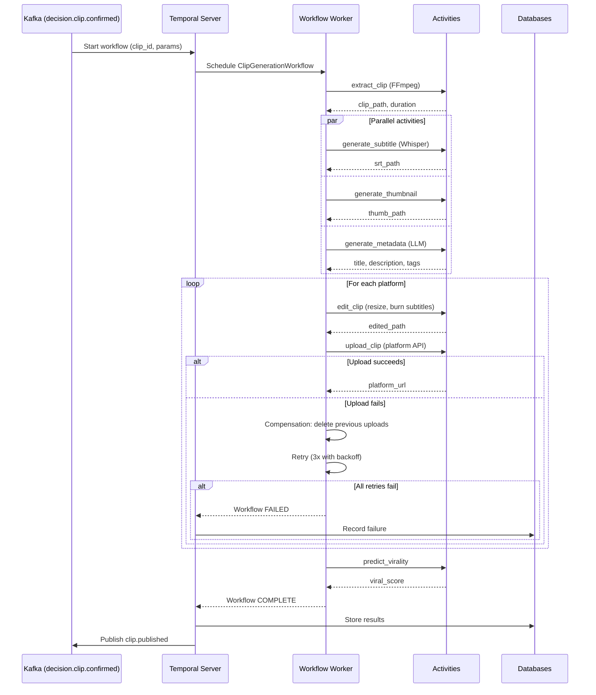
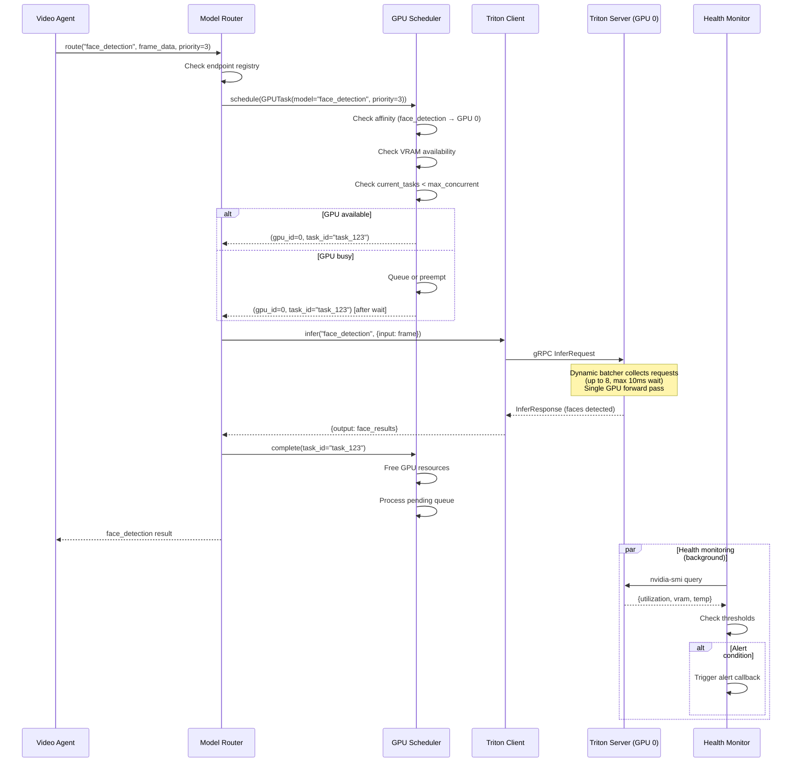

# INTELLIGENCE PLATFORM — PART 5
# GPU & Orchestration Infrastructure

**Topics:** AI Workflow Orchestration (Temporal/Airflow/Prefect) · GPU Scheduling · TensorRT Optimization · ONNX Runtime · Triton Inference Server

---

# 28. AI WORKFLOW ORCHESTRATION

## 28.1 Why Workflow Orchestration?

Workflow Orchestration, uzun süren AI görevlerini **dayanıklı (durable)** şekilde çalıştırır. Bir görev 5 dakika sürüyorsa ve sunucu çökerse, görev kaybolmamalı — kaldığı yerden devam etmeli.

```
WITHOUT ORCHESTRATION                    WITH ORCHESTRATION (Temporal)
════════════════════════════════         ═══════════════════════════════
Clip generation:                         Clip generation (Temporal workflow):
  1. Extract clip (FFmpeg)                 1. Extract clip (FFmpeg)
     → if server crashes: LOST               → if server crashes: RESTART from step 1
  2. Generate subtitle (Whisper)           2. Generate subtitle (Whisper)
     → if timeout: manual retry              → if timeout: auto-retry (3x, backoff)
  3. Generate thumbnail                    3. Generate thumbnail
     → if fails: clip incomplete             → if fails: compensation (skip thumbnail)
  4. Upload to platform                    4. Upload to platform
     → if API rate limited: stuck            → if rate limited: wait + retry
                                           5. Store result + notify
                                           → FULLY RECOVERABLE
```

## 28.2 Tool Comparison: Temporal vs Airflow vs Prefect

```
┌──────────────────────────────────────────────────────────────────────────┐
│                    ORCHESTRATION TOOL COMPARISON                          │
│                                                                          │
│  ┌─────────────┬──────────────┬──────────────┬──────────────────────┐   │
│  │ Feature     │ Temporal     │ Airflow      │ Prefect              │   │
│  ├─────────────┼──────────────┼──────────────┼──────────────────────┤   │
│  │ Durability  │ Excellent    │ Good         │ Good                 │   │
│  │             │ (event-sourced│ (DB-backed)  │ (DB-backed)          │   │
│  │ State recovery│ Full replay │ Checkpoint   │ Checkpoint           │   │
│  │ Code-first  │ Yes (Python/Go│ Yes (Python) │ Yes (Python)         │   │
│  │             │  /TypeScript) │              │                      │   │
│  │ Real-time   │ Excellent    │ Limited      │ Good                 │   │
│  │ Long-running│ Hours/days   │ Minutes/hours│ Minutes/hours        │   │
│  │ Retry logic │ Built-in     │ Manual       │ Built-in             │   │
│  │ Compensation│ Yes (Sagas)  │ Limited      │ Limited              │   │
│  │ Versioning  │ Yes          │ Limited      │ Limited              │   │
│  │ Monitoring  │ Built-in UI  │ Built-in UI  │ Built-in UI          │   │
│  │ Complexity  │ Medium-High  │ Medium       │ Low-Medium           │   │
│  │ Best for    │ Microservices│ Data pipelines│ Data pipelines      │   │
│  │             │ AI workflows │ Batch jobs   │ Dynamic workflows    │   │
│  └─────────────┴──────────────┴──────────────┴──────────────────────┘   │
│                                                                          │
│  OUR CHOICE: TEMPORAL                                                    │
│  Reasons:                                                                │
│  1. Durable execution — AI tasks can take 10+ minutes                    │
│  2. Saga pattern — compensation for failed multi-step workflows          │
│  3. Code-first — define workflows in Python (natural for our team)       │
│  4. Built-in retry with exponential backoff                              │
│  5. Versioning — update workflow code without breaking running instances │
│  6. Activity-level recovery — restart from failed activity, not beginning│
└──────────────────────────────────────────────────────────────────────────┘
```

## 28.3 Temporal Workflow Implementation

```python
# inference/workflows/clip_generation_workflow.py

from temporalio import workflow, activity
from temporalio.common import RetryPolicy
from dataclasses import dataclass
from typing import Optional
import asyncio
import logging
from datetime import timedelta

logger = logging.getLogger(__name__)


# --- Activity Definitions ---
# Activities are the actual work units. They can fail and be retried.

@activity.defn
async def extract_clip_activity(
    stream_id: str, start_ts: int, end_ts: int, output_path: str
) -> dict:
    """Extract a clip from the stream buffer using FFmpeg."""
    # FFmpeg extraction
    # ... implementation
    return {"clip_path": output_path, "duration_s": (end_ts - start_ts) / 1000}


@activity.defn
async def generate_subtitle_activity(clip_path: str) -> dict:
    """Generate subtitles using Whisper."""
    # Whisper transcription
    # ... implementation
    return {"srt_path": clip_path.replace(".mp4", ".srt"),
            "transcript": "..."}


@activity.defn
async def generate_thumbnail_activity(clip_path: str) -> dict:
    """Generate thumbnail from clip."""
    # Thumbnail generation
    # ... implementation
    return {"thumbnail_path": clip_path.replace(".mp4", "_thumb.jpg")}


@activity.defn
async def edit_clip_activity(
    clip_path: str, platform: str, subtitle_path: Optional[str] = None
) -> dict:
    """Edit clip for target platform (resize, burn subtitles, etc.)."""
    # Video editing
    # ... implementation
    return {"edited_path": clip_path.replace(".mp4", f"_{platform}.mp4")}


@activity.defn
async def upload_clip_activity(
    file_path: str, platform: str, metadata: dict
) -> dict:
    """Upload clip to platform."""
    # Platform API upload
    # ... implementation
    return {"platform_url": "https://...", "platform_clip_id": "..."}


@activity.defn
async def generate_metadata_activity(clip_data: dict) -> dict:
    """Generate AI metadata (title, description, tags)."""
    # LLM metadata generation
    # ... implementation
    return {"title": "...", "description": "...", "tags": ["...", "..."]}


@activity.defn
async def predict_virality_activity(clip_data: dict) -> dict:
    """Predict clip virality."""
    # Viral prediction engine
    # ... implementation
    return {"viral_score": 0.75, "predicted_views": 50000}


@activity.defn
async def compensate_upload_activity(platform: str, platform_clip_id: str):
    """Compensation activity: delete uploaded clip if workflow fails later."""
    # Delete from platform
    # ... implementation
    pass


# --- Workflow Definition ---

@dataclass
class ClipGenerationInput:
    """Input for clip generation workflow."""
    clip_id: str
    stream_id: str
    start_ts: int
    end_ts: int
    clip_type: str
    streamer_id: str
    target_platforms: list[str]
    generate_subtitle: bool = True
    generate_thumbnail: bool = True
    predict_virality: bool = True


@workflow.defn
class ClipGenerationWorkflow:
    """
    Temporal workflow for end-to-end clip generation.

    Workflow Steps:
    1. Extract clip from stream buffer (FFmpeg)
    2. Generate subtitle (Whisper) — optional, parallel with 3
    3. Generate thumbnail — optional, parallel with 2
    4. Generate AI metadata (title, description, tags) — parallel with 2,3
    5. For each target platform:
       a. Edit clip for platform (resize, burn subtitles)
       b. Upload to platform
    6. Predict virality (if enabled)
    7. Store results + publish events

    Failure Handling:
    - Activities retry automatically (3 attempts, exponential backoff)
    - If upload succeeds but later step fails: compensation (delete upload)
    - If clip extraction fails: workflow fails (no compensation needed)
    - Timeout: 10 minutes total (configurable)

    Saga Pattern:
    - Each platform upload is a saga step
    - If any platform upload fails after others succeeded:
      → Compensation: delete previously uploaded clips
      → Workflow fails with clear error
    """

    @workflow.run
    async def run(self, input: ClipGenerationInput) -> dict:
        workflow.logger.info(f"Starting clip generation: {input.clip_id}")

        # Retry policy for all activities
        retry_policy = RetryPolicy(
            initial_interval=timedelta(seconds=1),
            maximum_interval=timedelta(seconds=30),
            maximum_attempts=3,
        )

        # Step 1: Extract clip
        clip_result = await workflow.execute_activity(
            extract_clip_activity,
            args=[input.stream_id, input.start_ts, input.end_ts,
                  f"data/clips/{input.clip_id}.mp4"],
            start_to_close_timeout=timedelta(seconds=60),
            retry_policy=retry_policy,
        )

        # Steps 2-4: Parallel activities
        subtitle_task = None
        thumbnail_task = None
        metadata_task = None

        if input.generate_subtitle:
            subtitle_task = workflow.execute_activity(
                generate_subtitle_activity,
                args=[clip_result["clip_path"]],
                start_to_close_timeout=timedelta(seconds=120),
                retry_policy=retry_policy,
            )

        if input.generate_thumbnail:
            thumbnail_task = workflow.execute_activity(
                generate_thumbnail_activity,
                args=[clip_result["clip_path"]],
                start_to_close_timeout=timedelta(seconds=30),
                retry_policy=retry_policy,
            )

        metadata_task = workflow.execute_activity(
            generate_metadata_activity,
            args=[{
                "clip_id": input.clip_id,
                "clip_type": input.clip_type,
                "duration_s": clip_result["duration_s"],
            }],
            start_to_close_timeout=timedelta(seconds=30),
            retry_policy=retry_policy,
        )

        # Wait for parallel activities
        parallel_results = await asyncio.gather(
            *[t for t in [subtitle_task, thumbnail_task, metadata_task] if t],
            return_exceptions=True,
        )

        subtitle_result = None
        thumbnail_result = None
        metadata_result = None
        idx = 0
        if subtitle_task:
            r = parallel_results[idx]
            subtitle_result = r if not isinstance(r, Exception) else None
            idx += 1
        if thumbnail_task:
            r = parallel_results[idx]
            thumbnail_result = r if not isinstance(r, Exception) else None
            idx += 1
        if metadata_task:
            r = parallel_results[idx]
            metadata_result = r if not isinstance(r, Exception) else None

        # Step 5: Platform uploads (Saga pattern)
        uploaded_platforms = []
        upload_results = {}

        for platform in input.target_platforms:
            try:
                # Edit for platform
                edit_result = await workflow.execute_activity(
                    edit_clip_activity,
                    args=[clip_result["clip_path"], platform,
                          subtitle_result.get("srt_path") if subtitle_result else None],
                    start_to_close_timeout=timedelta(seconds=120),
                    retry_policy=retry_policy,
                )

                # Upload
                upload_result = await workflow.execute_activity(
                    upload_clip_activity,
                    args=[edit_result["edited_path"], platform, {
                        "title": metadata_result.get("title", "") if metadata_result else "",
                        "description": metadata_result.get("description", "") if metadata_result else "",
                        "tags": metadata_result.get("tags", []) if metadata_result else [],
                    }],
                    start_to_close_timeout=timedelta(seconds=300),
                    retry_policy=retry_policy,
                )

                upload_results[platform] = upload_result
                uploaded_platforms.append((platform, upload_result["platform_clip_id"]))

            except Exception as e:
                workflow.logger.error(f"Upload to {platform} failed: {e}")
                # Compensation: delete previously uploaded clips
                for p, clip_id in uploaded_platforms:
                    try:
                        await workflow.execute_activity(
                            compensate_upload_activity,
                            args=[p, clip_id],
                            start_to_close_timeout=timedelta(seconds=30),
                        )
                    except Exception:
                        pass  # Best effort compensation
                raise

        # Step 6: Virality prediction (optional)
        viral_result = None
        if input.predict_virality:
            try:
                viral_result = await workflow.execute_activity(
                    predict_virality_activity,
                    args=[{
                        "clip_id": input.clip_id,
                        "clip_type": input.clip_type,
                        "duration_s": clip_result["duration_s"],
                        "description": metadata_result.get("description", "") if metadata_result else "",
                    }],
                    start_to_close_timeout=timedelta(seconds=10),
                    retry_policy=retry_policy,
                )
            except Exception as e:
                workflow.logger.warning(f"Virality prediction failed: {e}")
                # Non-critical, continue

        # Step 7: Return final result
        result = {
            "clip_id": input.clip_id,
            "clip_path": clip_result["clip_path"],
            "duration_s": clip_result["duration_s"],
            "subtitle": subtitle_result,
            "thumbnail": thumbnail_result,
            "metadata": metadata_result,
            "uploads": upload_results,
            "viral_prediction": viral_result,
            "workflow_id": workflow.info().workflow_id,
        }

        workflow.logger.info(f"Clip generation complete: {input.clip_id}")
        return result
```

## 28.4 Workflow Sequence Diagram



---

# 29. GPU SCHEDULING

## 29.1 Architecture

GPU Scheduling, sınırlı GPU kaynaklarını birden fazla model ve servis arasında **adil ve verimli** şekilde paylaştırır.

```
┌──────────────────────────────────────────────────────────────────────┐
│                    GPU SCHEDULING ARCHITECTURE                        │
│                                                                      │
│  ┌──────────────────────────────────────────────────────────────┐    │
│  │                    GPU SCHEDULER                              │    │
│  │                                                              │    │
│  │  ┌──────────┐  ┌──────────┐  ┌──────────┐  ┌──────────┐   │    │
│  │  │ GPU 0    │  │ GPU 1    │  │ GPU 2    │  │ GPU 3    │   │    │
│  │  │          │  │          │  │          │  │          │   │    │
│  │  │ Face Det │  │ Pose Est │  │ VLM      │  │ Whisper  │   │    │
│  │  │ Emotion  │  │ OCR      │  │ (LLaVA)  │  │ SER      │   │    │
│  │  │ Obj Det  │  │          │  │          │  │          │   │    │
│  │  │          │  │          │  │          │  │          │   │    │
│  │  │ Util:65% │  │ Util:40% │  │ Util:80% │  │ Util:30% │   │    │
│  │  │ VRAM:6GB │  │ VRAM:4GB │  │ VRAM:16GB│  │ VRAM:4GB │   │    │
│  │  └──────────┘  └──────────┘  └──────────┘  └──────────┘   │    │
│  │                                                              │    │
│  │  Scheduling Policies:                                        │    │
│  │  1. AFFINITY: Models stay on assigned GPU (avoid reload)    │    │
│  │  2. PRIORITY: High-priority tasks preempt low-priority      │    │
│  │  3. BATCH: Collect requests, batch on same GPU              │    │
│  │  4. FAIRNESS: No model starves (min share guarantee)        │    │
│  │  5. EFFICIENCY: Use least-loaded GPU for new models         │    │
│  └──────────────────────────────────────────────────────────────┘    │
│                                                                      │
│  Kubernetes GPU Integration:                                         │
│  - nvidia.com/gpu resource in pod spec                              │
│  - GPU plugin (NVIDIA Device Plugin) exposes GPUs to K8s           │
│  - Each pod requests specific GPU count                             │
│  - K8s scheduler places pods on nodes with available GPUs          │
└──────────────────────────────────────────────────────────────────────┘
```

## 29.2 Implementation

```python
# inference/gpu_scheduler/scheduler.py

import asyncio
import time
from dataclasses import dataclass, field
from typing import Optional
from collections import defaultdict
import logging

logger = logging.getLogger(__name__)


@dataclass
class GPUInfo:
    """Information about a GPU."""
    gpu_id: int
    name: str                     # "RTX 4090", "A100", etc.
    total_vram_gb: float
    used_vram_gb: float = 0.0
    utilization: float = 0.0     # 0.0 - 1.0
    assigned_models: list[str] = field(default_factory=list)
    max_concurrent: int = 4      # Max concurrent model inferences
    current_tasks: int = 0


@dataclass
class GPUTask:
    """A GPU inference task."""
    task_id: str
    model_name: str
    priority: int                 # 1 (highest) to 10 (lowest)
    estimated_vram_gb: float
    estimated_duration_ms: float
    submitted_at: float = field(default_factory=time.time)


class GPUScheduler:
    """
    Schedules GPU inference tasks across multiple GPUs.

    Scheduling Algorithm:
    1. AFFINITY CHECK: Does this model have an assigned GPU?
       → Yes: Route to assigned GPU (avoid model reload)
       → No: Continue to step 2

    2. VRAM CHECK: Which GPUs have enough free VRAM?
       → Filter out GPUs that can't fit the model

    3. LOAD BALANCE: Among eligible GPUs, pick least loaded
       → Load score = utilization * 0.5 + (current_tasks / max_concurrent) * 0.5

    4. PRIORITY PREEMPTION:
       → If all GPUs are busy and task is high priority (1-3):
         → Preempt lowest-priority running task on least-loaded GPU
       → If task is low priority (7-10):
         → Queue and wait

    5. BATCH OPPORTUNITY:
       → If same model has multiple pending requests:
         → Batch them (up to max_batch_size) on same GPU

    GPU Health Monitoring:
    - Check GPU status every 5s (nvidia-smi)
    - If GPU error detected: mark unhealthy, reroute tasks
    - VRAM fragmentation check (if fragmented, suggest restart)
    - Temperature monitoring (throttle if > 85°C)
    """

    # Minimum VRAM to reserve per GPU (avoid OOM)
    VRAM_SAFETY_MARGIN_GB = 1.0

    def __init__(self):
        self._gpus: dict[int, GPUInfo] = {}
        self._model_affinity: dict[str, int] = {}  # model_name → gpu_id
        self._pending_queue: asyncio.PriorityQueue = asyncio.PriorityQueue()
        self._running_tasks: dict[str, tuple[GPUTask, int]] = {}  # task_id → (task, gpu_id)
        self._metrics = {
            "tasks_scheduled": 0,
            "tasks_completed": 0,
            "tasks_preempted": 0,
            "tasks_queued": 0,
            "avg_queue_time_ms": 0.0,
        }

    def register_gpu(self, gpu_info: GPUInfo):
        """Register a GPU with the scheduler."""
        self._gpus[gpu_info.gpu_id] = gpu_info
        logger.info(f"Registered GPU {gpu_info.gpu_id}: {gpu_info.name} "
                     f"({gpu_info.total_vram_gb}GB VRAM)")

    def assign_model(self, model_name: str, gpu_id: int):
        """Assign a model to a specific GPU (affinity)."""
        self._model_affinity[model_name] = gpu_id
        if gpu_id in self._gpus:
            self._gpus[gpu_id].assigned_models.append(model_name)
        logger.info(f"Assigned model {model_name} to GPU {gpu_id}")

    async def schedule(self, task: GPUTask) -> tuple[int, str]:
        """
        Schedule a GPU task.

        Returns: (gpu_id, task_id) or raises if no GPU available.
        """
        self._metrics["tasks_scheduled"] += 1

        # Step 1: Check affinity
        if task.model_name in self._model_affinity:
            gpu_id = self._model_affinity[task.model_name]
            gpu = self._gpus.get(gpu_id)
            if gpu and self._can_fit(gpu, task) and gpu.current_tasks < gpu.max_concurrent:
                return await self._dispatch(task, gpu_id)

        # Step 2: Find eligible GPUs
        eligible = [
            gpu for gpu in self._gpus.values()
            if self._can_fit(gpu, task) and gpu.current_tasks < gpu.max_concurrent
        ]

        if eligible:
            # Step 3: Load balance — pick least loaded
            best_gpu = min(eligible, key=lambda g: self._load_score(g))
            return await self._dispatch(task, best_gpu.gpu_id)

        # Step 4: Priority preemption or queue
        if task.priority <= 3:
            # High priority — try preemption
            preempted = await self._try_preempt(task)
            if preempted is not None:
                return await self._dispatch(task, preempted)

        # Queue the task
        self._metrics["tasks_queued"] += 1
        await self._pending_queue.put((task.priority, task.submitted_at, task))
        logger.debug(f"Queued task {task.task_id} (priority {task.priority})")

        # Wait for a GPU to become available
        gpu_id = await self._wait_for_gpu(task)
        return gpu_id, task.task_id

    def _can_fit(self, gpu: GPUInfo, task: GPUTask) -> bool:
        """Check if a task can fit on a GPU."""
        available_vram = gpu.total_vram_gb - gpu.used_vram_gb - self.VRAM_SAFETY_MARGIN_GB
        return available_vram >= task.estimated_vram_gb

    def _load_score(self, gpu: GPUInfo) -> float:
        """Compute load score for a GPU (lower = less loaded)."""
        return (
            gpu.utilization * 0.5 +
            (gpu.current_tasks / max(gpu.max_concurrent, 1)) * 0.5
        )

    async def _dispatch(self, task: GPUTask, gpu_id: int) -> tuple[int, str]:
        """Dispatch a task to a GPU."""
        gpu = self._gpus[gpu_id]
        gpu.current_tasks += 1
        gpu.used_vram_gb += task.estimated_vram_gb
        self._running_tasks[task.task_id] = (task, gpu_id)

        # Set affinity if not set
        if task.model_name not in self._model_affinity:
            self.assign_model(task.model_name, gpu_id)

        logger.debug(f"Dispatched {task.task_id} to GPU {gpu_id}")
        return gpu_id, task.task_id

    async def _try_preempt(self, high_priority_task: GPUTask) -> Optional[int]:
        """Try to preempt a low-priority task to make room for high-priority."""
        # Find lowest-priority running task
        running = list(self._running_tasks.values())
        if not running:
            return None

        # Sort by priority (highest number = lowest priority)
        running.sort(key=lambda x: x[0].priority, reverse=True)
        lowest_task, gpu_id = running[0]

        if lowest_task.priority > high_priority_task.priority + 2:
            # Preempt
            logger.info(f"Preempting task {lowest_task.task_id} (pri {lowest_task.priority}) "
                        f"for {high_priority_task.task_id} (pri {high_priority_task.priority})")
            await self.complete(lowest_task.task_id, preempted=True)
            self._metrics["tasks_preempted"] += 1
            return gpu_id

        return None

    async def complete(self, task_id: str, preempted: bool = False):
        """Mark a task as complete and free GPU resources."""
        if task_id not in self._running_tasks:
            return

        task, gpu_id = self._running_tasks.pop(task_id)
        gpu = self._gpus[gpu_id]
        gpu.current_tasks = max(0, gpu.current_tasks - 1)
        gpu.used_vram_gb = max(0, gpu.used_vram_gb - task.estimated_vram_gb)

        if not preempted:
            self._metrics["tasks_completed"] += 1

        # Check if there are queued tasks that can now run
        await self._process_queue()

    async def _wait_for_gpu(self, task: GPUTask) -> int:
        """Wait for a GPU to become available."""
        while True:
            # Check if any GPU is now available
            for gpu in self._gpus.values():
                if self._can_fit(gpu, task) and gpu.current_tasks < gpu.max_concurrent:
                    return gpu.gpu_id
            await asyncio.sleep(0.1)

    async def _process_queue(self):
        """Process pending queue — dispatch any tasks that can now run."""
        while not self._pending_queue.empty():
            try:
                _, _, task = self._pending_queue.get_nowait()
                eligible = [
                    gpu for gpu in self._gpus.values()
                    if self._can_fit(gpu, task) and gpu.current_tasks < gpu.max_concurrent
                ]
                if eligible:
                    best = min(eligible, key=self._load_score)
                    await self._dispatch(task, best.gpu_id)
                else:
                    # Put back in queue
                    await self._pending_queue.put((task.priority, task.submitted_at, task))
                    break
            except asyncio.QueueEmpty:
                break

    def get_gpu_status(self) -> list[dict]:
        """Get status of all GPUs (for monitoring)."""
        return [
            {
                "gpu_id": g.gpu_id,
                "name": g.name,
                "vram_total_gb": g.total_vram_gb,
                "vram_used_gb": round(g.used_vram_gb, 2),
                "vram_free_gb": round(g.total_vram_gb - g.used_vram_gb, 2),
                "utilization": round(g.utilization, 3),
                "current_tasks": g.current_tasks,
                "max_concurrent": g.max_concurrent,
                "assigned_models": g.assigned_models,
            }
            for g in self._gpus.values()
        ]

    def get_metrics(self) -> dict:
        return self._metrics
```

## 29.3 GPU Health Monitoring

```python
# inference/gpu_scheduler/health_monitor.py

import asyncio
import subprocess
import json
import time
from typing import Optional
import logging

logger = logging.getLogger(__name__)


class GPUHealthMonitor:
    """
    Monitors GPU health using nvidia-smi.

    Checks:
    1. GPU availability (is it responsive?)
    2. VRAM usage (approaching OOM?)
    3. GPU utilization (is it actually computing?)
    4. Temperature (thermal throttling?)
    5. Power consumption (approaching limit?)
    6. ECC errors (hardware degradation?)

    Alerting:
    - VRAM > 90%: Warning (may OOM soon)
    - VRAM > 95%: Critical (OOM imminent)
    - Temperature > 85°C: Warning (throttling)
    - Temperature > 90°C: Critical (shutdown risk)
    - ECC errors > 0: Warning (hardware issue)
    - GPU not responding: Critical (GPU dead)
    """

    def __init__(self, check_interval_s: float = 5.0):
        self.check_interval = check_interval_s
        self._gpu_status: dict[int, dict] = {}
        self._alert_callbacks = []

    def on_alert(self, callback):
        """Register an alert callback."""
        self._alert_callbacks.append(callback)

    async def run(self):
        """Background GPU health monitoring loop."""
        while True:
            try:
                status = await self._query_nvidia_smi()
                for gpu_id, gpu_status in status.items():
                    self._check_alerts(gpu_id, gpu_status)
                    self._gpu_status[gpu_id] = gpu_status
            except Exception as e:
                logger.error(f"GPU health check failed: {e}")
            await asyncio.sleep(self.check_interval)

    async def _query_nvidia_smi(self) -> dict[int, dict]:
        """Query GPU status using nvidia-smi."""
        try:
            result = await asyncio.create_subprocess_exec(
                "nvidia-smi",
                "--query-gpu=index,name,utilization.gpu,memory.used,memory.total,"
                "temperature.gpu,power.draw,power.limit,ecc.errors.uncorrected.volatile.total",
                "--format=csv,noheader,nounits",
                stdout=asyncio.subprocess.PIPE,
                stderr=asyncio.subprocess.PIPE,
            )
            stdout, stderr = await asyncio.wait_for(result.communicate(), timeout=10)

            if result.returncode != 0:
                logger.error(f"nvidia-smi failed: {stderr.decode()}")
                return {}

            gpus = {}
            for line in stdout.decode().strip().split("\n"):
                parts = [p.strip() for p in line.split(",")]
                if len(parts) >= 9:
                    gpu_id = int(parts[0])
                    gpus[gpu_id] = {
                        "name": parts[1],
                        "utilization_pct": float(parts[2]),
                        "memory_used_mb": float(parts[3]),
                        "memory_total_mb": float(parts[4]),
                        "temperature_c": float(parts[5]),
                        "power_draw_w": float(parts[6]),
                        "power_limit_w": float(parts[7]),
                        "ecc_errors": int(parts[8]) if parts[8] != "N/A" else 0,
                    }
            return gpus

        except asyncio.TimeoutError:
            logger.error("nvidia-smi timed out")
            return {}
        except FileNotFoundError:
            logger.error("nvidia-smi not found — GPU monitoring disabled")
            return {}

    def _check_alerts(self, gpu_id: int, status: dict):
        """Check for alert conditions and trigger callbacks."""
        alerts = []

        # VRAM check
        vram_used_pct = status["memory_used_mb"] / status["memory_total_mb"] * 100
        if vram_used_pct > 95:
            alerts.append(("critical", f"GPU {gpu_id} VRAM critical: {vram_used_pct:.1f}%"))
        elif vram_used_pct > 90:
            alerts.append(("warning", f"GPU {gpu_id} VRAM high: {vram_used_pct:.1f}%"))

        # Temperature check
        temp = status["temperature_c"]
        if temp > 90:
            alerts.append(("critical", f"GPU {gpu_id} temperature critical: {temp}°C"))
        elif temp > 85:
            alerts.append(("warning", f"GPU {gpu_id} temperature high: {temp}°C"))

        # ECC errors
        if status["ecc_errors"] > 0:
            alerts.append(("warning", f"GPU {gpu_id} ECC errors: {status['ecc_errors']}"))

        # Trigger callbacks
        for severity, message in alerts:
            logger.warning(f"GPU Alert [{severity}]: {message}")
            for callback in self._alert_callbacks:
                try:
                    callback(severity, gpu_id, message)
                except Exception:
                    pass

    def get_status(self) -> dict[int, dict]:
        return self._gpu_status
```

---

# 30. TENSORRT OPTIMIZATION

## 30.1 TensorRT in the Intelligence Platform

TensorRT, mevcut SAD Part 2'de detaylı açıklanmıştır. Burada **Intelligence Platform bağlamında** özet ve ek detaylar:

```
TENSORRT OPTIMIZATION PIPELINE:
                                          
  PyTorch Model (.pt)
      │
      ▼
  ONNX Export (.onnx)         ← opset 17, dynamic axes
      │
      ▼
  ONNX Simplification         ← shape inference, dead code elimination
      │
      ▼
  ┌─────────────────────────────────────────┐
  │  TensorRT Builder                        │
  │  ├─ Layer Fusion (Conv+BN+ReLU → 1 kernel)│
  │  ├─ Precision Calibration (FP16/INT8)    │
  │  ├─ Kernel Auto-Tuning (GPU-specific)    │
  │  └─ Memory Optimization                  │
  └────────────┬────────────────────────────┘
               │
               ▼
  TensorRT Engine (.engine)   ← GPU-specific, cannot transfer
      │
      ▼
  Triton Inference Server     ← serves engine via gRPC/HTTP
```

## 30.2 Model Optimization Matrix

```
┌──────────────────────────────────────────────────────────────────────────┐
│                    MODEL OPTIMIZATION MATRIX                              │
│                                                                          │
│  ┌──────────────────┬──────────┬──────────┬──────────┬───────────────┐ │
│  │ Model            │ PyTorch  │ ONNX RT  │ TRT FP16 │ TRT INT8      │ │
│  │                  │ (ms)     │ (ms)     │ (ms)     │ (ms)          │ │
│  ├──────────────────┼──────────┼──────────┼──────────┼───────────────┤ │
│  │ Face Detection   │ 12       │ 8        │ 3        │ 2             │ │
│  │ Emotion (ViT)    │ 8        │ 5        │ 2        │ 1.5           │ │
│  │ Pose (HRNet)     │ 15       │ 10       │ 4        │ 3             │ │
│  │ OCR (EasyOCR)    │ 200      │ 120      │ 30       │ 20            │ │
│  │ Object (YOLOv8)  │ 10       │ 6        │ 2.5      │ 2             │ │
│  │ VLM (LLaVA-7B)   │ 400      │ 300      │ 200      │ N/A           │ │
│  │ Whisper (base)   │ 150      │ 100      │ 50       │ 35            │ │
│  │ Embedding        │ 20       │ 12       │ 5        │ 3             │ │
│  │ (MiniLM)         │          │          │          │               │ │
│  └──────────────────┴──────────┴──────────┴──────────┴───────────────┘ │
│                                                                          │
│  PRODUCTION STRATEGY:                                                    │
│  - Real-time models (face, emotion, pose, object): TRT FP16             │
│  - OCR: TRT FP16 (INT8 if accuracy acceptable)                         │
│  - VLM: TRT-LLM FP16 (specialized for LLM inference)                   │
│  - Whisper: TRT FP16                                                    │
│  - Embedding: ONNX RT FP32 (small enough, CPU fallback works)          │
│                                                                          │
│  ACCURACY IMPACT:                                                        │
│  - FP16: < 0.5% accuracy drop (negligible)                              │
│  - INT8: 1-3% accuracy drop (requires calibration, acceptable for OCR) │
└──────────────────────────────────────────────────────────────────────────┘
```

## 30.3 Triton Model Repository Structure

```
inference/triton/model_repository/
├── face_detection/
│   ├── config.pbtxt                    # Triton model config
│   └── 1/                              # Version 1
│       └── model.onnx                  # ONNX model (or model.plan for TRT)
├── emotion_recognition/
│   ├── config.pbtxt
│   └── 1/
│       └── model.onnx
├── pose_estimation/
│   ├── config.pbtxt
│   └── 1/
│       └── model.onnx
├── ocr/
│   ├── config.pbtxt
│   └── 1/
│       └── model.onnx
├── object_detection/
│   ├── config.pbtxt
│   └── 1/
│       └── model.onnx
├── vlm_llava/
│   ├── config.pbtxt
│   └── 1/
│       └── model.plan                  # TensorRT-LLM engine
├── whisper_base/
│   ├── config.pbtxt
│   └── 1/
│       └── model.onnx
└── embedding_miniLM/
    ├── config.pbtxt
    └── 1/
        └── model.onnx
```

### Triton config.pbtxt Example (Face Detection)

```
# inference/triton/model_repository/face_detection/config.pbtxt

name: "face_detection"
platform: "onnxruntime_onnx"
max_batch_size: 8

input [
  {
    name: "input"
    data_type: TYPE_FP32
    dims: [ 3, 640, 640 ]
  }
]

output [
  {
    name: "output"
    data_type: TYPE_FP32
    dims: [ -1, 6 ]    # [x1, y1, x2, y2, confidence, landmark_data...]
  }
]

dynamic_batching {
  preferred_batch_size: [ 4, 8 ]
  max_queue_delay_microseconds: 10000   # 10ms max wait for batch
  preserve_ordering: true
}

instance_group [
  {
    kind: KIND_GPU
    count: 1                             # 1 instance on GPU
    gpus: [ 0 ]                          # Assign to GPU 0
  }
]

optimization {
  execution_accelerators {
    gpu_execution_accelerator : [
      {
        name : "tensorrt"
        parameters {
          precision_mode: "FP16"
          max_workspace_size_bytes: 4294967296    # 4GB
        }
      }
    ]
  }
}

model_warmup [
  {
    name: "warmup_batch_1"
    batch_size: 1
    inputs: {
      key: "input"
      value: {
        data_type: TYPE_FP32
        dims: [ 3, 640, 640 ]
        zero_data: false
        random_data: true
      }
    }
  }
]
```

---

# 31. ONNX RUNTIME

## 31.1 Role in the Architecture

ONNX Runtime, TensorRT'nin yanında **portable fallback** ve **geliştirme ortamı** olarak kullanılır:

```
WHEN TO USE ONNX RUNTIME vs TENSORRT:

  ┌─────────────────────────────────────────────────────────────────┐
  │ USE TENSORRT (production, GPU):                                │
  │  ✓ Maximum inference speed                                     │
  │  ✓ Models that are stable (don't change often)                 │
  │  ✓ Real-time pipeline (face, emotion, pose, object)            │
  │  ✓ Served via Triton                                           │
  │                                                                │
  │ USE ONNX RUNTIME (dev, fallback, CPU):                        │
  │  ✓ Development/testing (no engine build needed)                │
  │  ✓ Models in active development (frequent changes)             │
  │  ✓ CPU-only deployments (edge devices, cost saving)            │
  │  ✓ Models that don't benefit from TensorRT (small, simple)     │
  │  ✓ Embedding model (small, CPU-fast enough)                    │
  │  ✓ Fallback when GPU is unavailable or overloaded              │
  └─────────────────────────────────────────────────────────────────┘
```

## 31.2 ONNX Runtime Session Management

```python
# inference/onnx/session_manager.py

import onnxruntime as ort
import numpy as np
from typing import Optional
import logging
import threading

logger = logging.getLogger(__name__)


class ONNXSessionManager:
    """
    Manages ONNX Runtime inference sessions.

    Session Pool:
    - Each model has a pool of ONNX sessions
    - Sessions are thread-safe (ONNX Runtime supports concurrent inference)
    - Pool size = number of concurrent inference threads

    Execution Provider Priority:
    1. CUDAExecutionProvider (NVIDIA GPU)
    2. CPUExecutionProvider (fallback)

    Session Options:
    - Graph optimization: ORT_ENABLE_ALL (maximum optimization)
    - Intra-op threads: 4 (for CPU operations within a model)
    - Inter-op threads: 2 (for parallel independent operations)
    - Memory pattern: enable (reuse memory across inferences)
    """

    def __init__(self):
        self._sessions: dict[str, ort.InferenceSession] = {}
        self._lock = threading.Lock()

    def load_model(
        self,
        model_name: str,
        model_path: str,
        providers: Optional[list[str]] = None,
        num_threads: int = 4,
    ):
        """Load an ONNX model and create a session."""
        with self._lock:
            if model_name in self._sessions:
                logger.debug(f"Model {model_name} already loaded")
                return

            # Auto-detect providers
            if providers is None:
                providers = self._detect_providers()

            # Session options
            opts = ort.SessionOptions()
            opts.graph_optimization_level = ort.GraphOptimizationLevel.ORT_ENABLE_ALL
            opts.intra_op_num_threads = num_threads
            opts.inter_op_num_threads = 2
            opts.enable_mem_pattern = True
            opts.enable_cpu_mem_arena = True

            # Create session
            logger.info(f"Loading ONNX model: {model_name} from {model_path}")
            logger.info(f"Providers: {providers}")

            session = ort.InferenceSession(
                model_path,
                sess_options=opts,
                providers=providers,
            )

            self._sessions[model_name] = session

            # Log model info
            inputs = session.get_inputs()
            outputs = session.get_outputs()
            logger.info(f"Model {model_name}: "
                        f"inputs={[{i.name: i.shape} for i in inputs]}, "
                        f"outputs={[{o.name: o.shape} for o in outputs]}")

    def _detect_providers(self) -> list[str]:
        """Detect available execution providers."""
        available = ort.get_available_providers()
        priority = [
            "CUDAExecutionProvider",
            "CPUExecutionProvider",
        ]
        selected = [p for p in priority if p in available]
        return selected if selected else ["CPUExecutionProvider"]

    def infer(
        self,
        model_name: str,
        inputs: dict[str, np.ndarray],
    ) -> list[np.ndarray]:
        """Run inference on a loaded model."""
        session = self._sessions.get(model_name)
        if session is None:
            raise ValueError(f"Model {model_name} not loaded")

        output_names = [o.name for o in session.get_outputs()]
        return session.run(output_names, inputs)

    def warmup(self, model_name: str, iterations: int = 5):
        """Warm up a model with dummy inputs."""
        session = self._sessions.get(model_name)
        if session is None:
            return

        for inp in session.get_inputs():
            shape = []
            for dim in inp.shape:
                if isinstance(dim, str) or dim is None or (isinstance(dim, int) and dim < 0):
                    shape.append(1)
                else:
                    shape.append(dim)

            dummy = np.random.randn(*shape).astype(np.float32)
            for _ in range(iterations):
                session.run([session.get_outputs()[0].name], {inp.name: dummy})

        logger.info(f"Warmed up {model_name} ({iterations} iterations)")

    def unload_model(self, model_name: str):
        """Unload a model and free resources."""
        with self._lock:
            if model_name in self._sessions:
                del self._sessions[model_name]
                logger.info(f"Unloaded model: {model_name}")

    def get_loaded_models(self) -> list[str]:
        return list(self._sessions.keys())
```

---

# 31.3 TRITON INFERENCE SERVER

## 31.4 Architecture

```
┌──────────────────────────────────────────────────────────────────────┐
│                    TRITON INFERENCE SERVER                            │
│                                                                      │
│  ┌──────────────────────────────────────────────────────────────┐    │
│  │  TRITON SERVER (one per GPU node)                             │    │
│  │                                                              │    │
│  │  ┌──────────────────────────────────────────────────────┐    │    │
│  │  │  Model Manager                                        │    │    │
│  │  │  - Loads models from repository                       │    │    │
│  │  │  - Hot-reload on model update                         │    │    │
│  │  │  - Version management (multiple versions per model)   │    │    │
│  │  └──────────────────────────────────────────────────────┘    │    │
│  │                                                              │    │
│  │  ┌──────────────────────────────────────────────────────┐    │    │
│  │  │  Dynamic Batcher                                      │    │    │
│  │  │  - Collects individual requests                       │    │    │
│  │  │  - Batches them (up to max_batch_size)                │    │    │
│  │  │  - Wait up to max_queue_delay_ms                      │    │    │
│  │  │  - 8x throughput improvement                         │    │    │
│  │  └──────────────────────────────────────────────────────┘    │    │
│  │                                                              │    │
│  │  ┌──────────────────────────────────────────────────────┐    │    │
│  │  │  Model Instances                                      │    │    │
│  │  │  ┌────────┐ ┌────────┐ ┌────────┐ ┌────────┐       │    │    │
│  │  │  │Face Det│ │Emotion │ │Pose Est│ │  VLM   │       │    │    │
│  │  │  │GPU 0   │ │GPU 0   │ │GPU 1   │ │GPU 2   │       │    │    │
│  │  │  │(TRT)   │ │(TRT)   │ │(TRT)   │ │(TRT-LLM)│      │    │    │
│  │  │  └────────┘ └────────┘ └────────┘ └────────┘       │    │    │
│  │  └──────────────────────────────────────────────────────┘    │    │
│  │                                                              │    │
│  │  API: gRPC (port 8001), HTTP (port 8000), Metrics (8002)   │    │
│  └──────────────────────────────────────────────────────────────┘    │
│                                                                      │
│  Clients:                                                            │
│  - Model Router (Python gRPC client)                                │
│  - Video Agent (Python gRPC client)                                 │
│  - VLM Agent (Python gRPC client)                                   │
│  - Embedding Pipeline (Python gRPC client)                          │
└──────────────────────────────────────────────────────────────────────┘
```

## 31.5 Triton Client Implementation

```python
# inference/triton/triton_client.py

import asyncio
import numpy as np
from typing import Optional
import logging

logger = logging.getLogger(__name__)

try:
    import tritonclient.grpc.aio as grpcclient
    TRITON_AVAILABLE = True
except ImportError:
    TRITON_AVAILABLE = False
    logger.warning("Triton client not available — install tritonclient")


class TritonClient:
    """
    Async Triton Inference Server client.

    Features:
    - gRPC protocol (lower latency than HTTP)
    - Dynamic batching (server-side)
    - Async inference (non-blocking)
    - Health checking (model ready, server live)
    - Automatic reconnection

    Usage:
        client = TritonClient("triton-gpu-0:8001")
        result = await client.infer("face_detection", {"input": frame_tensor})
    """

    def __init__(self, url: str = "localhost:8001", timeout_s: float = 5.0):
        if not TRITON_AVAILABLE:
            raise ImportError("tritonclient not installed")
        self.url = url
        self.timeout = timeout_s
        self._client: Optional[grpcclient.InferenceServerClient] = None

    async def connect(self):
        """Connect to Triton server."""
        self._client = grpcclient.InferenceServerClient(url=self.url)
        try:
            is_live = await self._client.is_server_live()
            if is_live:
                logger.info(f"Connected to Triton at {self.url}")
            else:
                logger.error(f"Triton server at {self.url} is not live")
        except Exception as e:
            logger.error(f"Failed to connect to Triton: {e}")
            raise

    async def infer(
        self,
        model_name: str,
        inputs: dict[str, np.ndarray],
        model_version: str = "",
        timeout: Optional[float] = None,
    ) -> dict[str, np.ndarray]:
        """
        Run inference on a Triton model.

        Args:
            model_name: Name of the model in Triton repository
            inputs: Dict of input name → numpy array
            model_version: Model version (empty = latest)
            timeout: Override default timeout

        Returns:
            Dict of output name → numpy array
        """
        if self._client is None:
            await self.connect()

        # Build InferInput objects
        infer_inputs = []
        for name, data in inputs.items():
            # Ensure data is contiguous and correct dtype
            if not data.flags["C_CONTIGUOUS"]:
                data = np.ascontiguousarray(data)

            infer_input = grpcclient.InferInput(
                name=name,
                shape=list(data.shape),
                datatype=self._numpy_to_triton_dtype(data.dtype),
            )
            infer_input.set_data_from_numpy(data)
            infer_inputs.append(infer_input)

        # Get output names (query model metadata)
        model_metadata = await self._client.get_model_metadata(
            model_name, model_version
        )
        output_names = [o.name for o in model_metadata.outputs]

        # Build InferRequestedOutput objects
        outputs = [
            grpcclient.InferRequestedOutput(name=name)
            for name in output_names
        ]

        # Run inference
        response = await self._client.infer(
            model_name=model_name,
            model_version=model_version,
            inputs=infer_inputs,
            outputs=outputs,
            timeout=timeout or self.timeout,
        )

        # Extract results
        results = {}
        for name in output_names:
            results[name] = response.as_numpy(name)

        return results

    def _numpy_to_triton_dtype(self, dtype) -> str:
        """Convert numpy dtype to Triton datatype string."""
        mapping = {
            np.dtype("float32"): "FP32",
            np.dtype("float64"): "FP64",
            np.dtype("int32"): "INT32",
            np.dtype("int64"): "INT64",
            np.dtype("uint8"): "UINT8",
            np.dtype("int8"): "INT8",
            np.dtype("bool"): "BOOL",
        }
        return mapping.get(dtype, "FP32")

    async def is_model_ready(self, model_name: str) -> bool:
        """Check if a model is loaded and ready."""
        if self._client is None:
            return False
        try:
            return await self._client.is_model_ready(model_name)
        except Exception:
            return False

    async def get_model_metadata(self, model_name: str) -> dict:
        """Get model metadata (inputs, outputs, versions)."""
        if self._client is None:
            await self.connect()
        metadata = await self._client.get_model_metadata(model_name)
        return {
            "name": metadata.name,
            "versions": metadata.versions,
            "inputs": [{"name": i.name, "shape": i.shape, "datatype": i.datatype}
                       for i in metadata.inputs],
            "outputs": [{"name": o.name, "shape": o.shape, "datatype": o.datatype}
                        for o in metadata.outputs],
        }

    async def health_check(self) -> dict:
        """Check Triton server health."""
        if self._client is None:
            return {"status": "disconnected"}
        try:
            live = await self._client.is_server_live()
            ready = await self._client.is_server_ready()
            return {"status": "healthy" if live and ready else "unhealthy",
                    "live": live, "ready": ready}
        except Exception as e:
            return {"status": "error", "error": str(e)}
```

## 31.6 Triton Deployment (Kubernetes)

```yaml
# deploy/k8s/triton-deployment.yaml
apiVersion: apps/v1
kind: Deployment
metadata:
  name: triton-gpu-0
  namespace: intelligence-platform
spec:
  replicas: 1
  selector:
    matchLabels:
      app: triton
      gpu: "0"
  template:
    metadata:
      labels:
        app: triton
        gpu: "0"
    spec:
      containers:
      - name: triton
        image: nvcr.io/nvidia/tritonserver:24.01-py3
        args:
          - "tritonserver"
          - "--model-repository=/models"
          - "--strict-model-config=false"
          - "--log-verbose=1"
          - "--metrics-port=8002"
        ports:
        - containerPort: 8000  # HTTP
        - containerPort: 8001  # gRPC
        - containerPort: 8002  # Metrics
        resources:
          limits:
            nvidia.com/gpu: 1
            memory: 32Gi
          requests:
            nvidia.com/gpu: 1
            memory: 16Gi
        volumeMounts:
        - name: model-repository
          mountPath: /models
        - name: dshm  # Shared memory for IPC
          mountPath: /dev/shm
        livenessProbe:
          httpGet:
            path: /v2/health/live
            port: 8000
          initialDelaySeconds: 30
          periodSeconds: 10
        readinessProbe:
          httpGet:
            path: /v2/health/ready
            port: 8000
          initialDelaySeconds: 10
          periodSeconds: 5
      volumes:
      - name: model-repository
        persistentVolumeClaim:
          claimName: triton-models-pvc
      - name: dshm
        emptyDir:
          medium: Memory
          sizeLimit: 8Gi
---
apiVersion: v1
kind: Service
metadata:
  name: triton-gpu-0
  namespace: intelligence-platform
spec:
  selector:
    app: triton
    gpu: "0"
  ports:
  - name: http
    port: 8000
  - name: grpc
    port: 8001
  - name: metrics
    port: 8002
```

## 31.7 GPU Infrastructure Sequence Diagram



---

# 31.8 Production Scenario — GPU Resource Contention

```
1. VLM Agent starts processing (LLaVA-7B, 16GB VRAM, 200ms per inference)
2. GPU 2 VRAM usage jumps to 90%
3. Face Detection request arrives for GPU 0 (which has spare capacity)
4. GPU Scheduler routes face detection to GPU 0 (no contention)
5. But: Emotion Recognition also needs GPU 0 (shares with face detection)
6. GPU 0 utilization reaches 85% (both models active)
7. GPU Scheduler: new face detection request queued (max_concurrent reached)
8. HPA: detects increased queue depth → scale up
9. New GPU pod deployed (GPU 3) → registers with Triton
10. Model Router: detects new endpoint → includes in routing pool
11. Face detection load redistributed across GPU 0 and GPU 3
12. Queue drains, system returns to normal

Key Design Decision: VLM gets its OWN dedicated GPU (GPU 2)
  → VLM never contends with real-time models (face, emotion, pose)
  → Real-time models share GPU 0 + GPU 1
  → Whisper/OCR on GPU 3 (or shared with GPU 1 when load is low)
```

---

## Part 5 Summary

| Component | Technology | Role | Key Metric |
|---|---|---|---|
| Workflow Orchestration | Temporal | Durable AI task execution, saga pattern | Recovery < 30s |
| GPU Scheduling | Custom + K8s GPU Plugin | Fair GPU resource allocation | Utilization > 70% |
| TensorRT | TensorRT 8.6+ | FP16/INT8 model optimization | 5-10x speedup vs PyTorch |
| ONNX Runtime | ONNX Runtime 1.17+ | Portable fallback, CPU inference | 3-5x speedup vs PyTorch |
| Triton Inference Server | NVIDIA Triton 24.01 | Multi-model serving, dynamic batching | 8x throughput with batching |

---

*Continue to `IP_PART6_PLATFORM_ENGINEERING.md` for Platform Engineering & Production.*
