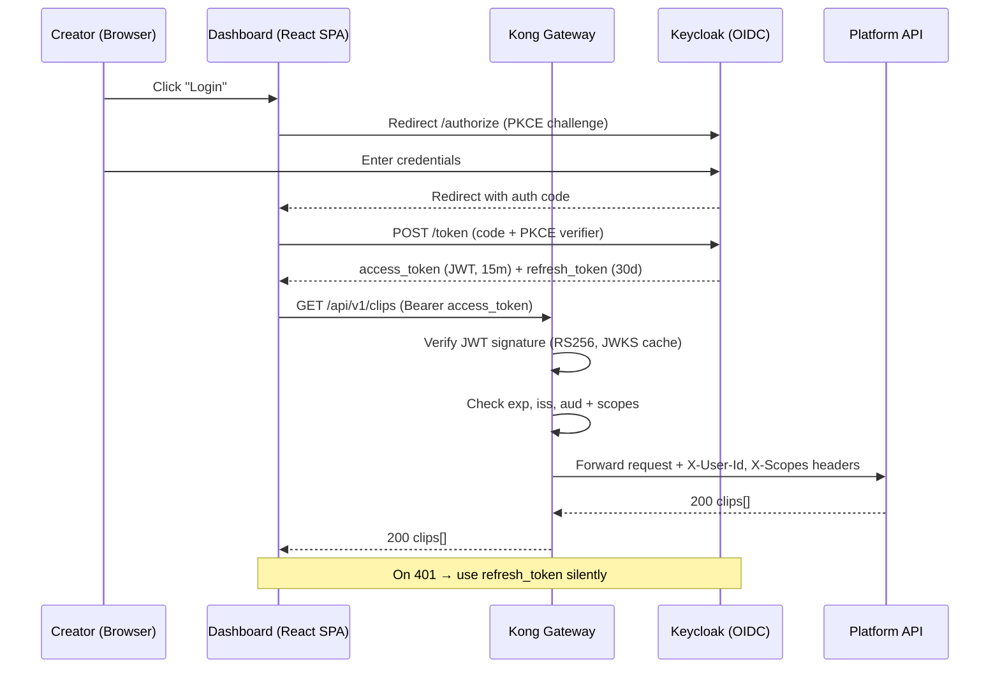

# INTELLIGENCE PLATFORM — PART 6
# Platform Engineering & Production Operations

**Topics:** API Gateway · Authentication & Authorization · Observability · Distributed Tracing · Monitoring & Alerting · Feature Flags · A/B Testing · Chaos Engineering · Auto Scaling · Kubernetes · GitOps · CI/CD · Production Deployment

---

# 32. API GATEWAY

## 32.1 Why an API Gateway?

API Gateway, tüm dış trafiğin girdiği **tek kapıdır** (single point of entry). Mikroservis mimarisinde her servis kendi kimlik doğrulaması, rate limiting ve güvenlik kontrolünü yapmak zorunda kalmamalı — bu sorumluluklar gateway katmanına toplanır (cross-cutting concerns).

```
WITHOUT GATEWAY                          WITH GATEWAY (Kong/Traefik)
════════════════════════════            ═══════════════════════════════
Client → Service A (auth + rate limit)   Client → Gateway → Service A
Client → Service B (auth + rate limit)              (auth + rate      → Service B
Client → Service C (auth + rate limit)               limit + WAF)     → Service C

- Auth code duplicated 30x                - Auth once, at the edge
- Rate limit per-service (inconsistent)   - Global + per-route rate limit
- No central observability                - All traffic observable
- CORS handled everywhere                 - CORS handled once
- Each service exposed publicly           - Only gateway is public
```

## 32.2 Kong vs Traefik vs Envoy

```
┌────────────────────────────────────────────────────────────────────────┐
│                     API GATEWAY COMPARISON                              │
│  ┌─────────────┬──────────────┬──────────────┬───────────────────────┐ │
│  │ Feature     │ Kong         │ Traefik      │ Envoy                 │ │
│  ├─────────────┼──────────────┼──────────────┼───────────────────────┤ │
│  │ Config      │ DB / declar. │ Labels/CRD   │ xDS / YAML            │ │
│  │ Plugins     │ 100+ (Lua)   │ Middlewares  │ Filters (C++/WASM)    │ │
│  │ K8s native  │ Yes (Ingress)│ Excellent    │ Yes (Istio)           │ │
│  │ Perf        │ High         │ High         │ Very High             │ │
│  │ Learning    │ Medium       │ Low          │ High                  │ │
│  │ Service mesh│ Kong Mesh    │ No           │ Istio/Consul          │ │
│  │ Rate limit  │ Built-in     │ Middleware   │ Filter                │ │
│  │ Auth        │ 10+ plugins  │ ForwardAuth  │ ext_authz             │ │
│  └─────────────┴──────────────┴──────────────┴───────────────────────┘ │
│                                                                         │
│  OUR CHOICE: KONG (declarative + K8s Ingress Controller)               │
│  Reasons:                                                              │
│  1. Rich plugin ecosystem (JWT, OAuth2, rate-limit, CORS, WAF)         │
│  2. Declarative config (GitOps friendly — decK)                       │
│  3. Native K8s Ingress Controller + CRDs                              │
│  4. Fine-grained per-consumer / per-route policies                    │
│  5. Prometheus plugin for out-of-the-box metrics                      │
└────────────────────────────────────────────────────────────────────────┘
```

## 32.3 Gateway Responsibilities

```
                    ┌─────────────────────────────────────────┐
   Client Request → │              KONG GATEWAY               │
                    │                                         │
                    │  1. TLS Termination (HTTPS)             │
                    │  2. WAF / Bot detection                 │
                    │  3. Authentication (JWT verify)         │
                    │  4. Authorization (scope/role check)    │
                    │  5. Rate Limiting (per consumer)        │
                    │  6. Request Transformation              │
                    │  7. Routing (path → upstream service)   │
                    │  8. Load Balancing (round-robin/hash)   │
                    │  9. Circuit Breaking (unhealthy upstr.) │
                    │ 10. Metrics + Tracing injection         │
                    └────────────────────┬────────────────────┘
                                         │
              ┌──────────────────────────┼──────────────────────────┐
              ▼                          ▼                          ▼
       platform-api             analytics-service          webhook-consumer
```

## 32.4 Declarative Kong Configuration

```yaml
# gateway/kong.yaml — managed via decK (GitOps)
_format_version: "3.0"

services:
  - name: platform-api
    url: http://platform-api.default.svc.cluster.local:8000
    retries: 3
    connect_timeout: 5000
    read_timeout: 60000
    routes:
      - name: platform-api-route
        paths: ["/api/v1"]
        strip_path: false
        protocols: ["https"]
    plugins:
      - name: jwt
        config:
          claims_to_verify: ["exp"]
          key_claim_name: "iss"
      - name: rate-limiting
        config:
          minute: 120
          policy: redis
          redis_host: redis.default.svc.cluster.local
          fault_tolerant: true          # if Redis down, fail open
      - name: cors
        config:
          origins: ["https://app.intelligence-platform.io"]
          methods: ["GET", "POST", "PUT", "DELETE"]
          credentials: true
      - name: prometheus
        config:
          status_code_metrics: true
          latency_metrics: true

  - name: analytics-service
    url: http://analytics-service.default.svc.cluster.local:8010
    routes:
      - name: analytics-route
        paths: ["/api/v1/analytics"]
    plugins:
      - name: rate-limiting
        config:
          minute: 30                     # analytics is heavier — lower limit
          policy: redis

consumers:
  - username: creator-dashboard
    jwt_secrets:
      - key: "https://auth.intelligence-platform.io"
        algorithm: RS256
        rsa_public_key: |
          -----BEGIN PUBLIC KEY-----
          MIIBIjANBgkqhkiG9w0BAQEFAAOCAQ8A...
          -----END PUBLIC KEY-----
```

## 32.5 Circuit Breaking & Health Checks

Gateway, sağlıksız (unhealthy) upstream servisleri otomatik olarak trafik havuzundan çıkarır. Böylece bir servis çökse bile gateway istekleri sağlıklı replikalara yönlendirir.

```yaml
upstreams:
  - name: platform-api-upstream
    healthchecks:
      active:
        http_path: /health
        healthy:
          interval: 5           # her 5 sn'de bir sağlık kontrolü
          successes: 2
        unhealthy:
          interval: 5
          http_failures: 3      # 3 hata → target'ı devre dışı bırak
          timeouts: 3
      passive:                  # gerçek trafiğe göre pasif izleme
        unhealthy:
          http_failures: 5
          tcp_failures: 3
    targets:
      - target: platform-api-0:8000
      - target: platform-api-1:8000
      - target: platform-api-2:8000
```

---

# 33. AUTHENTICATION & AUTHORIZATION

## 33.1 Identity Model

```
┌──────────────────────────────────────────────────────────────────┐
│                       IDENTITY LAYERS                             │
│                                                                   │
│  HUMAN USERS                          MACHINE CLIENTS             │
│  ═══════════                          ══════════════             │
│  Creators (dashboard)                 Webhook consumers          │
│    → OAuth2 / OIDC login                → API Keys / mTLS         │
│    → JWT access token (15 min)        Internal services          │
│    → Refresh token (30 days)            → Service Account JWT     │
│    → RBAC: creator / admin              → mTLS (SPIFFE/SPIRE)     │
│                                                                   │
│  AUTH PROVIDER: Keycloak (self-hosted OIDC) or Auth0             │
└──────────────────────────────────────────────────────────────────┘
```

## 33.2 Token Flow (OAuth2 Authorization Code + PKCE)



## 33.3 JWT Structure & Validation

```python
# platform/auth/jwt_validator.py
import jwt
from jwt import PyJWKClient
from fastapi import HTTPException, Security
from fastapi.security import HTTPBearer, HTTPAuthorizationCredentials

JWKS_URL = "https://auth.intelligence-platform.io/realms/ip/protocol/openid-connect/certs"
_jwks_client = PyJWKClient(JWKS_URL, cache_keys=True, lifespan=3600)

bearer = HTTPBearer()

def verify_token(creds: HTTPAuthorizationCredentials = Security(bearer)) -> dict:
    """Gateway zaten doğruladı; servis içinde defense-in-depth için tekrar doğrula."""
    token = creds.credentials
    try:
        signing_key = _jwks_client.get_signing_key_from_jwt(token)
        payload = jwt.decode(
            token,
            signing_key.key,
            algorithms=["RS256"],
            audience="platform-api",
            issuer="https://auth.intelligence-platform.io/realms/ip",
            options={"require": ["exp", "iss", "aud", "sub"]},
        )
    except jwt.ExpiredSignatureError:
        raise HTTPException(401, "token expired")
    except jwt.InvalidTokenError as e:
        raise HTTPException(401, f"invalid token: {e}")
    return payload


def require_scope(required: str):
    """Route-level scope guard."""
    def _guard(payload: dict = Security(verify_token)) -> dict:
        scopes = set(payload.get("scope", "").split())
        if required not in scopes:
            raise HTTPException(403, f"missing scope: {required}")
        return payload
    return _guard
```

## 33.4 RBAC Model

```
┌────────────────────────────────────────────────────────────────┐
│                    ROLE / SCOPE MATRIX                          │
│  ┌──────────────────┬─────────┬─────────┬─────────┬──────────┐ │
│  │ Resource         │ creator │ editor  │ admin   │ service  │ │
│  ├──────────────────┼─────────┼─────────┼─────────┼──────────┤ │
│  │ clips:read       │   ✓     │   ✓     │   ✓     │    ✓     │ │
│  │ clips:write      │   ✓     │   ✓     │   ✓     │    ✓     │ │
│  │ clips:delete     │   —     │   ✓     │   ✓     │    —     │ │
│  │ streams:manage   │   ✓     │   —     │   ✓     │    —     │ │
│  │ analytics:read   │   ✓     │   ✓     │   ✓     │    —     │ │
│  │ feature-flags    │   —     │   —     │   ✓     │    —     │ │
│  │ billing:manage   │   —     │   —     │   ✓     │    —     │ │
│  │ internal:events  │   —     │   —     │   —     │    ✓     │ │
│  └──────────────────┴─────────┴─────────┴─────────┴──────────┘ │
└────────────────────────────────────────────────────────────────┘
```

## 33.5 Service-to-Service Auth (mTLS + SPIFFE)

Dahili servisler birbirleriyle konuşurken **mutual TLS** kullanır. Her servis, kısa ömürlü bir sertifika (SPIFFE ID) taşır. Böylece "network içindeyse güvenilir" (perimeter trust) yerine **zero-trust** modeli uygulanır.

```
spiffe://intelligence-platform.io/ns/default/sa/decision-engine
spiffe://intelligence-platform.io/ns/default/sa/clip-generator

- SPIRE Server → identity issuance (SVID, 1h TTL, auto-rotate)
- SPIRE Agent  → per-node attestation
- Istio mTLS   → transparent encryption (STRICT mode)
```

## 33.6 API Key Management (Machine Clients)

```python
# platform/auth/api_keys.py
import secrets, hashlib
from datetime import datetime, timezone

def generate_api_key() -> tuple[str, str]:
    """Returns (plaintext_key, sha256_hash). Only the hash is stored."""
    raw = "ip_" + secrets.token_urlsafe(32)
    digest = hashlib.sha256(raw.encode()).hexdigest()
    return raw, digest            # plaintext shown ONCE to the user

def verify_api_key(presented: str, stored_hash: str) -> bool:
    digest = hashlib.sha256(presented.encode()).hexdigest()
    return secrets.compare_digest(digest, stored_hash)   # timing-safe
```

```
API KEY LIFECYCLE
─────────────────
create → active → (rotate: new key + grace period) → revoke → deleted
  - Never store plaintext (only SHA-256 hash)
  - Show plaintext exactly once at creation
  - Support 2 active keys per client (zero-downtime rotation)
  - Auto-expire after 90 days, warn at 75 days
```

---

# 34. OBSERVABILITY — THE THREE PILLARS

## 34.1 Metrics, Logs, Traces

Observability, "sistemin içinde ne olduğunu dışarıdan çıkardığı sinyallerle anlayabilme" yeteneğidir. Üç temel sinyal (three pillars) vardır ve birbirlerini tamamlar:

```
┌──────────────────────────────────────────────────────────────────────┐
│                      THREE PILLARS OF OBSERVABILITY                   │
│                                                                       │
│  ┌────────────────┬────────────────┬────────────────────────────┐   │
│  │ METRICS         │ LOGS            │ TRACES                     │   │
│  ├────────────────┼────────────────┼────────────────────────────┤   │
│  │ "How much?"     │ "What happened?"│ "Where is the latency?"    │   │
│  │ Aggregated      │ Discrete events │ Request journey            │   │
│  │ Numeric,        │ Structured JSON │ Spans across services      │   │
│  │  time-series    │                 │                            │   │
│  │ Prometheus      │ Loki / ELK      │ Jaeger / Tempo             │   │
│  │ Cheap to store  │ Medium cost     │ Sampled (1-10%)            │   │
│  │ Alert source    │ Debug source    │ Root-cause source          │   │
│  └────────────────┴────────────────┴────────────────────────────┘   │
│                                                                       │
│  CORRELATION: trace_id links all three                                │
│    metric spike → find logs with trace_id → open trace → root cause   │
└──────────────────────────────────────────────────────────────────────┘
```

## 34.2 Structured Logging

Tüm servisler **yapılandırılmış JSON log** üretir. Her log satırı `trace_id`, `service`, `level` gibi alanlar taşır — böylece Loki/ELK üzerinde filtrelenebilir ve trace'lerle ilişkilendirilebilir.

```python
# platform/observability/logging.py
import logging, json, sys
from datetime import datetime, timezone
from opentelemetry import trace

class JsonFormatter(logging.Formatter):
    def format(self, record: logging.LogRecord) -> str:
        span = trace.get_current_span()
        ctx = span.get_span_context() if span else None
        payload = {
            "ts": datetime.now(timezone.utc).isoformat(),
            "level": record.levelname,
            "service": record.name,
            "msg": record.getMessage(),
            "trace_id": format(ctx.trace_id, "032x") if ctx and ctx.trace_id else None,
            "span_id": format(ctx.span_id, "016x") if ctx and ctx.span_id else None,
        }
        if record.exc_info:
            payload["exc"] = self.formatException(record.exc_info)
        for k, v in getattr(record, "extra_fields", {}).items():
            payload[k] = v
        return json.dumps(payload, ensure_ascii=False)

def configure_logging(service_name: str, level: str = "INFO") -> None:
    handler = logging.StreamHandler(sys.stdout)
    handler.setFormatter(JsonFormatter())
    root = logging.getLogger()
    root.handlers = [handler]
    root.setLevel(level)
```

## 34.3 The RED & USE Methods

```
RED METHOD (for request-driven services)      USE METHOD (for resources)
════════════════════════════════════════      ════════════════════════════
R — Rate     (requests / sec)                  U — Utilization  (% busy)
E — Errors   (failed requests / sec)           S — Saturation   (queue depth)
D — Duration (latency p50/p95/p99)             E — Errors       (error count)

Apply RED to: API endpoints, event consumers
Apply USE to: GPU, CPU, memory, disk, DB pool, queues
```

## 34.4 Golden Signals per Layer

```
┌───────────────────────────────────────────────────────────────────┐
│  LAYER              KEY SIGNALS                    SLO TARGET       │
│  ─────────────────  ──────────────────────────     ─────────────    │
│  API Gateway        p95 latency, 5xx rate          < 300ms, < 0.1%  │
│  Platform API       p95 latency, error rate        < 500ms, < 0.5%  │
│  Event Bus (Kafka)  consumer lag, throughput       lag < 1000 msgs  │
│  Decision Engine    decision latency, queue depth  < 2s p95         │
│  Clip Generator     job duration, failure rate     < 90s, < 2%      │
│  GPU Inference      utilization, VRAM, queue       > 70%, < 90% VRAM│
│  Databases          query p99, connection pool     < 100ms, < 80%   │
└───────────────────────────────────────────────────────────────────┘
```

---

# 35. DISTRIBUTED TRACING

## 35.1 Why Distributed Tracing?

Bir istek 8 mikroservisten geçtiğinde "yavaşlık nerede?" sorusunu tek bir log kümesiyle yanıtlamak imkânsızdır. Distributed tracing, isteğin tüm yolculuğunu **span**'lere böler ve tek bir `trace_id` altında birleştirir.

```
TRACE: clip_generation (trace_id: 4bf92f...)
├─ span: gateway.route                          [  12ms]
├─ span: platform-api.create_clip_request       [  45ms]
│   ├─ span: db.insert_clip_request              [   8ms]
│   └─ span: kafka.publish(clip.requested)       [   3ms]
├─ span: decision-engine.evaluate               [ 210ms]
│   ├─ span: feature-store.fetch                 [  40ms]
│   └─ span: llm.decide                          [ 150ms]  ← BOTTLENECK
├─ span: clip-generator.extract (FFmpeg)         [8200ms]
├─ span: subtitle.transcribe (Whisper)           [3100ms]
└─ span: uploader.publish                        [1400ms]
                                     TOTAL: ~13s
```

## 35.2 OpenTelemetry Instrumentation

```python
# platform/observability/tracing.py
from opentelemetry import trace
from opentelemetry.sdk.trace import TracerProvider
from opentelemetry.sdk.trace.export import BatchSpanProcessor
from opentelemetry.sdk.resources import Resource
from opentelemetry.exporter.otlp.proto.grpc.trace_exporter import OTLPSpanExporter
from opentelemetry.sdk.trace.sampling import ParentBasedTraceIdRatio

def init_tracing(service_name: str, otlp_endpoint: str, sample_ratio: float = 0.1):
    resource = Resource.create({
        "service.name": service_name,
        "service.version": "3.0.0",
        "deployment.environment": "production",
    })
    provider = TracerProvider(
        resource=resource,
        sampler=ParentBasedTraceIdRatio(sample_ratio),   # 10% head sampling
    )
    provider.add_span_processor(
        BatchSpanProcessor(OTLPSpanExporter(endpoint=otlp_endpoint))
    )
    trace.set_tracer_provider(provider)
    return trace.get_tracer(service_name)


tracer = init_tracing("clip-generator", "http://otel-collector:4317")

def extract_clip(request_id: str, start: float, end: float):
    with tracer.start_as_current_span("clip.extract") as span:
        span.set_attribute("clip.request_id", request_id)
        span.set_attribute("clip.duration_s", end - start)
        try:
            result = _run_ffmpeg(start, end)
            span.set_attribute("clip.output_bytes", result.size)
            return result
        except Exception as e:
            span.record_exception(e)
            span.set_status(trace.Status(trace.StatusCode.ERROR, str(e)))
            raise
```

## 35.3 Context Propagation Across Kafka

Trace, sadece HTTP değil **event bus** üzerinden de yayılmalı. Üretici trace context'i Kafka header'larına enjekte eder; tüketici onu çıkarır.

```python
from opentelemetry.propagate import inject, extract
from opentelemetry import context

# Producer side
def publish_event(topic: str, payload: dict):
    headers: dict[str, str] = {}
    inject(headers)                                  # trace context → headers
    kafka_headers = [(k, v.encode()) for k, v in headers.items()]
    producer.produce(topic, value=json.dumps(payload), headers=kafka_headers)

# Consumer side
def consume_event(msg):
    carrier = {k: v.decode() for k, v in (msg.headers() or [])}
    ctx = extract(carrier)                           # restore parent context
    token = context.attach(ctx)
    try:
        with tracer.start_as_current_span("consume." + msg.topic()):
            handle(json.loads(msg.value()))
    finally:
        context.detach(token)
```

## 35.4 Sampling Strategy

```
┌──────────────────────────────────────────────────────────────────┐
│  SAMPLING TRADE-OFF                                               │
│  100% sampling → complete data, but HUGE cost + storage           │
│  0% sampling   → cheap, but blind                                 │
│                                                                   │
│  OUR STRATEGY: Tail-based sampling (OTel Collector)               │
│  ┌────────────────────────────────────────────────────────────┐ │
│  │ ALWAYS keep:  traces with errors (status != OK)             │ │
│  │ ALWAYS keep:  traces with latency > p99 threshold           │ │
│  │ ALWAYS keep:  traces touching billing / auth                │ │
│  │ SAMPLE 5%:    normal successful traces                      │ │
│  └────────────────────────────────────────────────────────────┘ │
│  → Keep the interesting traces, drop the boring ones              │
└──────────────────────────────────────────────────────────────────┘
```

---

# 36. MONITORING & ALERTING

## 36.1 Monitoring Stack

```
                  ┌──────────────────────────────────────────┐
   Services  ─────▶│ /metrics (Prometheus exposition format)  │
   (RED/USE)       └──────────────────┬───────────────────────┘
                                      │ scrape (15s)
                            ┌─────────▼──────────┐
                            │    PROMETHEUS      │  ← recording + alert rules
                            │  (short-term TSDB) │
                            └────┬──────────┬────┘
                remote_write     │          │  alerts
                        ┌────────▼───┐  ┌───▼──────────┐
                        │   THANOS   │  │ ALERTMANAGER │
                        │ (long-term │  │ (dedup, route│
                        │  + global) │  │  → PagerDuty)│
                        └────────────┘  └──────────────┘
                              │
                        ┌─────▼──────┐
                        │  GRAFANA   │  ← dashboards + unified query
                        └────────────┘
```

## 36.2 Prometheus Metrics in Code

```python
# platform/observability/metrics.py
from prometheus_client import Counter, Histogram, Gauge

REQUESTS = Counter(
    "ip_requests_total", "Total requests",
    ["service", "method", "route", "status"],
)
LATENCY = Histogram(
    "ip_request_duration_seconds", "Request latency",
    ["service", "route"],
    buckets=(0.05, 0.1, 0.25, 0.5, 1, 2.5, 5, 10),
)
GPU_UTIL = Gauge("ip_gpu_utilization_ratio", "GPU utilization", ["gpu_id"])
KAFKA_LAG = Gauge("ip_kafka_consumer_lag", "Consumer lag", ["topic", "group"])
CLIP_JOBS = Counter("ip_clip_jobs_total", "Clip jobs", ["result"])   # ok|failed
```

## 36.3 Recording & Alert Rules

```yaml
# monitoring/rules/platform.yaml
groups:
  - name: platform-slo
    interval: 30s
    rules:
      - record: job:ip_request_latency:p95
        expr: |
          histogram_quantile(0.95,
            sum(rate(ip_request_duration_seconds_bucket[5m])) by (le, service))

      - alert: HighErrorRate
        expr: |
          sum(rate(ip_requests_total{status=~"5.."}[5m])) by (service)
          / sum(rate(ip_requests_total[5m])) by (service) > 0.02
        for: 5m
        labels: { severity: critical }
        annotations:
          summary: "{{ $labels.service }} error rate > 2%"
          runbook: "https://runbooks.ip.io/high-error-rate"

      - alert: KafkaConsumerLagHigh
        expr: ip_kafka_consumer_lag > 5000
        for: 10m
        labels: { severity: warning }
        annotations:
          summary: "Consumer lag high on {{ $labels.topic }}"

      - alert: GPUSaturated
        expr: ip_gpu_utilization_ratio > 0.95
        for: 15m
        labels: { severity: warning }
        annotations:
          summary: "GPU {{ $labels.gpu_id }} saturated — consider scale-up"
```

## 36.4 SLO / SLI / Error Budget

```
┌────────────────────────────────────────────────────────────────┐
│  SLO FRAMEWORK                                                  │
│  SLI (Indicator):  successful_requests / total_requests         │
│  SLO (Objective):  99.9% availability over 30 days              │
│  Error Budget:     0.1% = ~43 minutes downtime / month          │
│                                                                 │
│  BURN RATE ALERTING (multi-window)                              │
│  ┌──────────────┬────────────┬────────────┬──────────────────┐ │
│  │ Burn rate    │ Long window│ Short win. │ Action           │ │
│  ├──────────────┼────────────┼────────────┼──────────────────┤ │
│  │ 14.4x (fast) │ 1h         │ 5m         │ Page immediately │ │
│  │ 6x           │ 6h         │ 30m        │ Page             │ │
│  │ 1x (slow)    │ 3d         │ 6h         │ Ticket           │ │
│  └──────────────┴────────────┴────────────┴──────────────────┘ │
│  → Budget exhausted → freeze feature releases, focus on         │
│     reliability until budget recovers                           │
└────────────────────────────────────────────────────────────────┘
```

## 36.5 Alert Routing (Alertmanager)

```yaml
# monitoring/alertmanager.yaml
route:
  receiver: default
  group_by: ["alertname", "service"]
  group_wait: 30s
  group_interval: 5m
  repeat_interval: 4h
  routes:
    - matchers: ['severity="critical"']
      receiver: pagerduty
      continue: true
    - matchers: ['severity="warning"']
      receiver: slack
receivers:
  - name: pagerduty
    pagerduty_configs:
      - service_key: "${PD_KEY}"
  - name: slack
    slack_configs:
      - api_url: "${SLACK_WEBHOOK}"
        channel: "#ip-alerts"
  - name: default
    slack_configs:
      - api_url: "${SLACK_WEBHOOK}"
        channel: "#ip-noise"
inhibit_rules:
  - source_matchers: ['severity="critical"']
    target_matchers: ['severity="warning"']
    equal: ["service"]      # suppress warnings when a critical is firing
```

---

# 37. FEATURE FLAGS & A/B TESTING

## 37.1 Why Feature Flags?

Feature flag (feature toggle), kodu **deploy etmekle** onu **release etmeyi** birbirinden ayırır. Yeni bir AI modeli veya karar stratejisi, kod production'da olsa bile, flag kapalıyken kullanıcılara görünmez. Bu, "dark launch", kademeli açılım (progressive rollout) ve anında geri alma (kill switch) sağlar.

```
DEPLOY ≠ RELEASE
────────────────
git merge → CI/CD → deploy to prod  (code is present, but OFF)
                          │
                          ▼
   feature flag: new_viral_model = { enabled: 5% of creators }
                          │
       gradual rollout:   5% → 25% → 50% → 100%
                          │
       if metrics degrade: flip flag OFF instantly (no redeploy)
```

## 37.2 Flag Types

```
┌─────────────────────────────────────────────────────────────────┐
│  FLAG TYPE          PURPOSE                     LIFETIME          │
│  ─────────────────  ───────────────────────     ──────────────    │
│  Release toggle     Hide unfinished features     Short (weeks)     │
│  Experiment flag    A/B testing (variant split)  Medium (weeks)    │
│  Ops toggle         Kill switch / circuit break   Long (permanent) │
│  Permission flag    Beta / premium gating         Long             │
└─────────────────────────────────────────────────────────────────┘
```

## 37.3 Flag Evaluation (Unleash / OpenFeature)

```python
# platform/flags/client.py
from openfeature import api
from openfeature.contrib.provider.unleash import UnleashProvider

api.set_provider(UnleashProvider(url="http://unleash:4242", app_name="platform"))
client = api.get_client()

def decide_clip(stream_ctx: dict) -> dict:
    ctx = {
        "targetingKey": stream_ctx["creator_id"],
        "plan": stream_ctx.get("plan", "free"),
        "region": stream_ctx.get("region", "eu"),
    }
    # gradual-rollout gated model selection
    if client.get_boolean_value("new_viral_model", False, ctx):
        return viral_model_v2.predict(stream_ctx)
    return viral_model_v1.predict(stream_ctx)
```

## 37.4 A/B Test Design

```
┌────────────────────────────────────────────────────────────────┐
│                     A/B EXPERIMENT LIFECYCLE                    │
│                                                                 │
│  1. HYPOTHESIS   "viral_model_v2 increases clip CTR by ≥ 3%"    │
│  2. METRIC       primary: clip_click_through_rate               │
│                  guardrail: upload_failure_rate must not rise   │
│  3. SPLIT        control (A) 50%  |  treatment (B) 50%          │
│                  deterministic hash(creator_id) → stable bucket  │
│  4. SAMPLE SIZE  power=0.8, α=0.05 → N ≈ 12,000 clips/arm       │
│  5. RUN          min 2 weeks (avoid weekday/weekend bias)        │
│  6. ANALYZE      two-proportion z-test, check significance      │
│  7. DECISION     ship B / rollback / iterate                    │
└────────────────────────────────────────────────────────────────┘
```

## 37.5 Deterministic Bucketing

Kullanıcının hangi varyanta düştüğü **deterministik** olmalı — aynı creator her istekte aynı kovaya düşmeli, yoksa deneyim tutarsız olur ve istatistik bozulur.

```python
import hashlib

def assign_variant(experiment: str, unit_id: str, weights: dict[str, int]) -> str:
    """Stable, deterministic bucketing via hashing."""
    h = hashlib.sha256(f"{experiment}:{unit_id}".encode()).hexdigest()
    bucket = int(h[:8], 16) % 100                # 0..99
    cumulative = 0
    for variant, weight in weights.items():
        cumulative += weight
        if bucket < cumulative:
            return variant
    return "control"

# assign_variant("viral_v2", "creator_123", {"control": 50, "treatment": 50})
```

## 37.6 Statistical Significance

```python
from scipy import stats
import numpy as np

def evaluate_ab(conv_a: int, n_a: int, conv_b: int, n_b: int, alpha=0.05):
    p_a, p_b = conv_a / n_a, conv_b / n_b
    p_pool = (conv_a + conv_b) / (n_a + n_b)
    se = np.sqrt(p_pool * (1 - p_pool) * (1/n_a + 1/n_b))
    z = (p_b - p_a) / se
    p_value = 2 * (1 - stats.norm.cdf(abs(z)))
    return {
        "lift": (p_b - p_a) / p_a,
        "p_value": p_value,
        "significant": p_value < alpha,
        "winner": "treatment" if (p_value < alpha and p_b > p_a) else "no_change",
    }
```

---

# 38. CHAOS ENGINEERING

## 38.1 Principle

Chaos Engineering, "sistemin türbülansa dayanıklılığına dair güveni artırmak için production'da kontrollü deneyler yapma" disiplinidir. Amaç bir şeyi kırmak değil, **zayıflıkları felaket olmadan önce keşfetmektir**.

```
STEADY STATE → HYPOTHESIS → INJECT FAULT → OBSERVE → LEARN
     │              │              │            │        │
"p95 < 500ms"  "Killing 1     "kill pod"    "did p95   "fix or
 & error<1%"    replica won't               stay OK?"   accept"
                break SLO"
```

## 38.2 Experiment Catalog

```
┌──────────────────────────────────────────────────────────────────┐
│  FAULT DOMAIN       EXPERIMENT                  EXPECTED BEHAVIOR   │
│  ─────────────────  ──────────────────────────  ────────────────   │
│  Pod failure        Kill random service pod      HPA/RS reschedules │
│  Node failure       Drain a K8s node             Pods migrate       │
│  Network latency    +300ms to DB calls           Timeouts + retry   │
│  Network partition  Isolate Kafka broker         Consumer failover  │
│  Dependency down    Block Redis                   Fail-open cache    │
│  GPU failure        Kill a Triton pod             Model reroutes     │
│  Resource exhaust   CPU/mem stress on node        Throttle, no crash │
│  Clock skew         Shift pod clock ±5m           Token still valid  │
└──────────────────────────────────────────────────────────────────┘
```

## 38.3 Chaos Experiment (Chaos Mesh)

```yaml
# chaos/experiments/kill-decision-engine.yaml
apiVersion: chaos-mesh.org/v1alpha1
kind: PodChaos
metadata:
  name: kill-decision-engine
spec:
  action: pod-kill
  mode: one                       # kill exactly one pod
  selector:
    namespaces: ["default"]
    labelSelectors:
      app: decision-engine
  scheduler:
    cron: "@every 30m"            # only in staging / game-days
---
apiVersion: chaos-mesh.org/v1alpha1
kind: NetworkChaos
metadata:
  name: db-latency
spec:
  action: delay
  mode: all
  selector:
    labelSelectors:
      app: platform-api
  delay:
    latency: "300ms"
    jitter: "50ms"
  duration: "5m"
  direction: to
  target:
    selector:
      labelSelectors:
        app: postgres
```

## 38.4 Blast Radius Control

```
┌────────────────────────────────────────────────────────────────┐
│  SAFETY GUARDRAILS FOR CHAOS                                    │
│                                                                 │
│  1. Start in STAGING, then production "game days" only          │
│  2. Limit blast radius: 1 pod, then 1 AZ, never whole cluster   │
│  3. Automatic ABORT: if SLO breached → halt experiment          │
│  4. Business hours only + on-call engineer present              │
│  5. Announce in #ops before running                             │
│  6. Always have a documented rollback                           │
└────────────────────────────────────────────────────────────────┘
```

## 38.5 Game Day Runbook

```
GAME DAY — "Kafka broker failure"
─────────────────────────────────
Prep:   announce, confirm dashboards green, on-call ready
Inject: kill 1 of 3 Kafka brokers
Watch:  - consumer lag (should stay bounded)
        - producer retries (should succeed to remaining brokers)
        - clip pipeline end-to-end latency (should degrade gracefully)
Verify: no data loss (min.insync.replicas=2 honored)
Restore: bring broker back, confirm rebalance completes
Learn:  document findings → create tickets for gaps
```

---

# 39. AUTO SCALING & KUBERNETES

## 39.1 Scaling Dimensions

```
┌──────────────────────────────────────────────────────────────────┐
│                     KUBERNETES SCALING LAYERS                     │
│                                                                   │
│  HPA (Horizontal Pod Autoscaler)                                  │
│    → add/remove pod replicas based on CPU / custom metrics        │
│                                                                   │
│  VPA (Vertical Pod Autoscaler)                                    │
│    → right-size pod CPU/memory requests over time                 │
│                                                                   │
│  Cluster Autoscaler / Karpenter                                   │
│    → add/remove NODES when pods can't be scheduled                │
│                                                                   │
│  KEDA (event-driven autoscaling)                                  │
│    → scale on Kafka lag, queue depth, cron (scale-to-zero)        │
└──────────────────────────────────────────────────────────────────┘
```

## 39.2 HPA on Custom Metrics

CPU tek başına AI iş yükleri için kötü bir sinyaldir. Bunun yerine **Kafka consumer lag** veya **kuyruk derinliği** gibi iş metriklerine göre ölçekleriz.

```yaml
# k8s/decision-engine-hpa.yaml
apiVersion: autoscaling/v2
kind: HorizontalPodAutoscaler
metadata:
  name: decision-engine
spec:
  scaleTargetRef:
    apiVersion: apps/v1
    kind: Deployment
    name: decision-engine
  minReplicas: 3
  maxReplicas: 30
  metrics:
    - type: Pods
      pods:
        metric: { name: ip_decision_queue_depth }
        target: { type: AverageValue, averageValue: "20" }
  behavior:
    scaleUp:
      stabilizationWindowSeconds: 30
      policies:
        - type: Percent
          value: 100          # can double pods
          periodSeconds: 30
    scaleDown:
      stabilizationWindowSeconds: 300   # scale down slowly (avoid flapping)
      policies:
        - type: Pods
          value: 1
          periodSeconds: 60
```

## 39.3 KEDA — Event-Driven Scaling

```yaml
# k8s/clip-generator-keda.yaml
apiVersion: keda.sh/v1alpha1
kind: ScaledObject
metadata:
  name: clip-generator
spec:
  scaleTargetRef:
    name: clip-generator
  minReplicaCount: 0          # scale to ZERO when no work (cost saving)
  maxReplicaCount: 50
  cooldownPeriod: 120
  triggers:
    - type: kafka
      metadata:
        bootstrapServers: kafka:9092
        consumerGroup: clip-generator
        topic: clip.requested
        lagThreshold: "10"    # 1 replica per 10 pending messages
```

## 39.4 GPU Node Pool & Scheduling

```yaml
# k8s/triton-inference.yaml (excerpt)
spec:
  template:
    spec:
      nodeSelector:
        cloud.google.com/gke-accelerator: nvidia-tesla-t4
      tolerations:
        - key: nvidia.com/gpu
          operator: Exists
          effect: NoSchedule
      containers:
        - name: triton
          image: nvcr.io/nvidia/tritonserver:24.01-py3
          resources:
            limits:
              nvidia.com/gpu: 1        # request 1 GPU
              memory: 16Gi
            requests:
              cpu: "4"
              memory: 12Gi
          readinessProbe:
            httpGet: { path: /v2/health/ready, port: 8000 }
            initialDelaySeconds: 20
          livenessProbe:
            httpGet: { path: /v2/health/live, port: 8000 }
```

## 39.5 Resilience Primitives (PDB, Anti-Affinity)

```yaml
# Keep at least 2 replicas during voluntary disruptions (node drains)
apiVersion: policy/v1
kind: PodDisruptionBudget
metadata:
  name: platform-api-pdb
spec:
  minAvailable: 2
  selector:
    matchLabels: { app: platform-api }
---
# Spread replicas across zones (survive AZ failure)
spec:
  template:
    spec:
      topologySpreadConstraints:
        - maxSkew: 1
          topologyKey: topology.kubernetes.io/zone
          whenUnsatisfiable: ScheduleAnyway
          labelSelector:
            matchLabels: { app: platform-api }
```

## 39.6 Scaling Scenario — Viral Stream Spike

```
1. A top creator goes live → chat + event volume 10x normal
2. Kafka lag on `analysis.events` climbs (KEDA sees lagThreshold breach)
3. KEDA scales video-analysis 4 → 20 replicas
4. New pods can't schedule (nodes full) → Karpenter provisions 3 GPU nodes
5. HPA scales decision-engine on queue depth 3 → 12
6. Clip-generator (scale-to-zero) wakes up: 0 → 15 replicas
7. Pipeline keeps p95 < SLO throughout the spike
8. Stream ends → lag drains → replicas scale down (300s stabilization)
9. Karpenter deprovisions idle GPU nodes after cooldown → cost normalizes
```

---

# 40. GITOPS & CI/CD

## 40.1 GitOps Principle

GitOps'ta **Git, tek doğru kaynaktır (single source of truth)**. Cluster'ın istenen durumu (desired state) Git'te tanımlıdır; bir agent (ArgoCD/Flux) gerçek durumu sürekli Git'e doğru **uzlaştırır (reconcile)**. Manuel `kubectl apply` yoktur — her değişiklik bir PR'dır.

```
┌────────────────────────────────────────────────────────────────┐
│                        GITOPS FLOW                              │
│                                                                 │
│  Developer → PR → review → merge to `main`                      │
│                                    │                             │
│        ┌───────────────────────────┼─────────────────────────┐  │
│        ▼                           ▼                         ▼  │
│   App Repo                   Config Repo (Helm/Kustomize)       │
│   (source code)              (desired K8s state)                │
│        │                           ▲                             │
│   CI builds image                  │ image tag bump (automated)  │
│        │                           │                             │
│        ▼                     ┌─────┴──────┐                      │
│   Registry ─────────────────▶│  ARGOCD    │ reconcile loop       │
│                              │  (in K8s)  │───▶ Kubernetes API    │
│                              └────────────┘                      │
│   Drift detected? → ArgoCD auto-syncs back to Git state          │
└────────────────────────────────────────────────────────────────┘
```

## 40.2 CI Pipeline (GitHub Actions)

```yaml
# .github/workflows/ci.yaml
name: ci
on:
  pull_request:
  push: { branches: [main] }

jobs:
  test:
    runs-on: ubuntu-latest
    steps:
      - uses: actions/checkout@v4
      - uses: actions/setup-python@v5
        with: { python-version: "3.11" }
      - run: pip install -r requirements.txt
      - run: ruff check .                 # lint
      - run: pytest -q --cov=. --cov-fail-under=80
      - name: Security scan
        run: |
          pip install bandit
          bandit -r services microservices -ll

  build-and-push:
    needs: test
    if: github.ref == 'refs/heads/main'
    runs-on: ubuntu-latest
    permissions: { contents: read, packages: write, id-token: write }
    steps:
      - uses: actions/checkout@v4
      - uses: docker/build-push-action@v5
        with:
          push: true
          tags: ghcr.io/ip/platform-api:${{ github.sha }}
      - name: Sign image (cosign / keyless)
        run: cosign sign --yes ghcr.io/ip/platform-api:${{ github.sha }}
      - name: Scan image (Trivy)
        uses: aquasecurity/trivy-action@master
        with:
          image-ref: ghcr.io/ip/platform-api:${{ github.sha }}
          severity: CRITICAL,HIGH
          exit-code: "1"
```

## 40.3 CD — Automated Image Bump

```yaml
# config-repo/apps/platform-api/values.yaml  (edited by CI bot via PR)
image:
  repository: ghcr.io/ip/platform-api
  tag: "a1b2c3d"          # ← updated automatically after build-and-push
```

```yaml
# ArgoCD Application — auto-sync with self-heal
apiVersion: argoproj.io/v1alpha1
kind: Application
metadata:
  name: platform-api
spec:
  project: intelligence-platform
  source:
    repoURL: https://github.com/ip/config-repo
    path: apps/platform-api
    targetRevision: main
  destination:
    server: https://kubernetes.default.svc
    namespace: default
  syncPolicy:
    automated:
      prune: true          # remove resources deleted from Git
      selfHeal: true       # revert manual drift
    syncOptions: ["CreateNamespace=true"]
    retry:
      limit: 5
      backoff: { duration: 10s, factor: 2, maxDuration: 3m }
```

## 40.4 Progressive Delivery (Argo Rollouts — Canary)

```yaml
# canary rollout with automated analysis + rollback
apiVersion: argoproj.io/v1alpha1
kind: Rollout
metadata:
  name: decision-engine
spec:
  strategy:
    canary:
      steps:
        - setWeight: 10
        - pause: { duration: 5m }
        - analysis:                     # query Prometheus for error rate
            templates: [{ templateName: error-rate }]
        - setWeight: 50
        - pause: { duration: 10m }
        - setWeight: 100
      analysis:
        # if error-rate template fails → automatic rollback
        templates: [{ templateName: error-rate }]
```

## 40.5 Environment Promotion

```
┌────────────────────────────────────────────────────────────────┐
│  PROMOTION PIPELINE                                             │
│                                                                 │
│   dev  ──(auto on merge)──▶  staging  ──(manual approve)──▶ prod │
│    │                           │                            │    │
│  ephemeral                 full replica                canary +  │
│  PR previews               of prod, chaos              progressive│
│                            game-days                    rollout   │
│                                                                 │
│  Secrets: External Secrets Operator ← Vault (per environment)   │
│  Config drift between envs is a bug → keep parity via overlays  │
└────────────────────────────────────────────────────────────────┘
```

---

# 41. PRODUCTION DEPLOYMENT & OPERATIONS

## 41.1 Deployment Strategies

```
┌──────────────────────────────────────────────────────────────────┐
│  STRATEGY        HOW                       WHEN                     │
│  ─────────────   ────────────────────────  ─────────────────────   │
│  Rolling         Replace pods gradually     Default, stateless      │
│  Blue/Green      Full parallel env, switch  Zero-downtime, fast     │
│                  traffic instantly           rollback needed         │
│  Canary          Small % first, ramp up     Risky changes, models   │
│  Shadow          Mirror traffic, no serve   Validate new model safe │
│  Feature-flagged Deploy dark, flip flag     Decouple deploy/release │
└──────────────────────────────────────────────────────────────────┘
```

## 41.2 Zero-Downtime Deployment Checklist

```
PRE-DEPLOY
  □ DB migrations are backward-compatible (expand/contract pattern)
  □ New code reads BOTH old and new schema
  □ Feature flags default OFF
  □ readiness/liveness probes configured
  □ resource requests/limits set
  □ PodDisruptionBudget in place

DEPLOY
  □ Canary 10% → analyze → ramp
  □ Watch golden signals (RED) live
  □ Watch consumer lag (event consumers)

POST-DEPLOY
  □ Smoke tests green
  □ Error budget not burning
  □ Remove old schema columns in a LATER release (contract phase)
```

## 41.3 Expand/Contract DB Migration

Sıfır kesintili şema değişikliği için **genişlet/daralt (expand/contract)** deseni kullanılır. Şema ve kod asla aynı anda kırılmaz.

```
EXPAND    →   MIGRATE     →   CONTRACT
──────         ───────          ────────
Add new col   Backfill data     Drop old col
(nullable)    Dual-write        Remove dual-write
Code reads    old+new           Code reads new only
old, writes
old+new
   │              │                  │
 release N     release N+1        release N+2
(never drop a column in the same release that stops writing it)
```

## 41.4 Incident Response

```
┌────────────────────────────────────────────────────────────────┐
│                      INCIDENT SEVERITY                          │
│  SEV1  Full outage / data loss        → page, war room, comms    │
│  SEV2  Major degradation, SLO breach  → page on-call             │
│  SEV3  Minor, workaround exists       → ticket, next business day│
│                                                                 │
│  ROLES:  Incident Commander · Comms Lead · Ops/Fixers            │
│  FLOW:   Detect → Triage → Mitigate → Resolve → Postmortem       │
│  RULE:   Mitigate FIRST (rollback/flag off), root-cause LATER    │
└────────────────────────────────────────────────────────────────┘
```

## 41.5 Runbook — High Error Rate

```
ALERT: HighErrorRate — platform-api 5xx > 2%
────────────────────────────────────────────
1. ACK alert in PagerDuty
2. Open Grafana "Platform Overview" dashboard
3. Identify scope:
   - one service or many?  → Grafana per-service panel
   - recent deploy?        → check ArgoCD sync history
4. Correlate:
   - errors spiked right after a rollout? → ROLLBACK (Argo Rollouts abort)
   - a dependency down?  → check Redis/Postgres/Kafka health
   - traffic spike?      → check HPA, is scaling keeping up?
5. Mitigate:
   - deploy-related → `kubectl argo rollouts abort decision-engine`
   - dependency     → failover / restart, enable degraded mode flag
6. Verify error rate returns < 0.5%
7. Write postmortem within 48h (blameless)
```

## 41.6 Runbook — Kafka Consumer Lag

```
ALERT: KafkaConsumerLagHigh
───────────────────────────
1. Which consumer group?  → alert label `group`
2. Is it processing (throughput > 0) or stuck (throughput = 0)?
   - STUCK → check pod logs for poison message / exception loop
             → if poison msg: skip offset (DLQ) after confirming
   - SLOW  → KEDA should be scaling; check HPA/KEDA events
3. Under-provisioned partitions?  → lag can't parallelize beyond
   partition count → consider increasing partitions
4. Downstream slow (DB/GPU)? → fix bottleneck, lag drains after
5. Verify lag trending down to < 1000
```

## 41.7 Backup, DR & RTO/RPO

```
┌────────────────────────────────────────────────────────────────┐
│  DISASTER RECOVERY TARGETS                                      │
│  ┌───────────────┬──────────┬──────────┬─────────────────────┐ │
│  │ Data store    │ Backup   │ RPO      │ RTO                 │ │
│  ├───────────────┼──────────┼──────────┼─────────────────────┤ │
│  │ PostgreSQL    │ WAL+daily│ < 5 min  │ < 30 min (PITR)     │ │
│  │ ClickHouse    │ daily    │ < 24h    │ < 2h (rebuild OK)   │ │
│  │ Qdrant        │ snapshot │ < 6h     │ < 1h (re-embed)     │ │
│  │ Kafka         │ replicat.│ 0 (RF=3) │ < 15 min            │ │
│  │ Object store  │ versioned│ 0        │ < 15 min            │ │
│  └───────────────┴──────────┴──────────┴─────────────────────┘ │
│                                                                 │
│  RPO = max acceptable data loss   RTO = max acceptable downtime │
│  Test restores QUARTERLY — a backup you never restored is a     │
│  hope, not a backup.                                            │
└────────────────────────────────────────────────────────────────┘
```

## 41.8 Cost & Capacity Management

```
FINOPS FOR AN AI PLATFORM
─────────────────────────
- GPU is the #1 cost → maximize utilization (batching, scale-to-zero)
- Tag every resource (team/env/service) → cost attribution
- Spot/preemptible nodes for batch (clip render, re-embedding)
- On-demand/reserved for latency-critical (gateway, API, real-time GPU)
- Right-size via VPA recommendations (avoid over-provisioning)
- Alert on cost anomalies (sudden 2x daily spend)
- Tiered storage: hot (SSD) → warm (S3) → cold (Glacier) for old clips
```

## 41.9 Security & Compliance Baseline

```
┌────────────────────────────────────────────────────────────────┐
│  PRODUCTION SECURITY CHECKLIST                                  │
│  □ Secrets in Vault (never in Git/env images)                   │
│  □ Signed + scanned images only (cosign + Trivy admission)      │
│  □ NetworkPolicies: default-deny, explicit allow                │
│  □ Pod Security Standards: restricted (no root, no privileged)  │
│  □ mTLS between services (zero-trust, STRICT)                   │
│  □ Audit logging enabled (K8s API + app-level)                  │
│  □ PII encrypted at rest + in transit; data retention policy    │
│  □ Regular pentest + dependency CVE monitoring (Dependabot)     │
└────────────────────────────────────────────────────────────────┘
```

---

## Part 6 Summary

| Component | Technology | Role | Key Metric |
|---|---|---|---|
| API Gateway | Kong | Edge auth, rate limit, routing, WAF | p95 < 300ms, 5xx < 0.1% |
| Authentication | Keycloak / OIDC + mTLS | Human + machine identity, RBAC | token TTL 15m, mTLS STRICT |
| Observability | Prometheus + Loki + Tempo | Metrics, logs, traces (correlated) | trace_id across all signals |
| Distributed Tracing | OpenTelemetry + Jaeger | Cross-service latency root-cause | tail-sample errors + p99 |
| Monitoring | Prometheus + Grafana + Alertmanager | SLO tracking, alert routing | 99.9% SLO, burn-rate alerts |
| Feature Flags | Unleash / OpenFeature | Decouple deploy from release | instant kill-switch |
| A/B Testing | Deterministic bucketing | Data-driven model rollout | z-test, α=0.05 |
| Chaos Engineering | Chaos Mesh | Resilience validation | bounded blast radius |
| Auto Scaling | HPA + KEDA + Karpenter | Elastic capacity on demand | scale-to-zero, lag-based |
| GitOps / CD | ArgoCD + Argo Rollouts | Declarative, self-healing deploys | canary + auto-rollback |
| CI | GitHub Actions | Test, scan, sign, build | coverage ≥ 80%, signed images |
| DR | WAL/snapshots + multi-AZ | Backup & recovery | PostgreSQL RPO < 5m, RTO < 30m |

---

## Intelligence Platform — Document Set Complete

Bu doküman seti (`INTELLIGENCE_PLATFORM.md` + `IP_PART1`…`IP_PART6`), "klip seçen AI"dan **uçtan uca AI Content Intelligence Platform**'una geçişin tam mühendislik referansını oluşturur:

- **PART 1** — Event-Driven Architecture, Multi-Agent brain, AI Orchestrator, Model Router
- **PART 2** — Video Understanding, VLM, Multimodal AI, Memory, Knowledge Graph, LLM decisions
- **PART 3** — Stream Intelligence, Viral Prediction, Content Scoring, Trend Detection, RLCF
- **PART 4** — Event Store, Time Series DB, Kafka/Redis Streams, PostgreSQL + ClickHouse + Qdrant
- **PART 5** — Workflow Orchestration (Temporal), GPU Scheduling, TensorRT/ONNX, Triton
- **PART 6** — API Gateway, Auth, Observability, Chaos, Auto-scaling, GitOps, Production Ops

*End of the Intelligence Platform System Architecture Document.*

