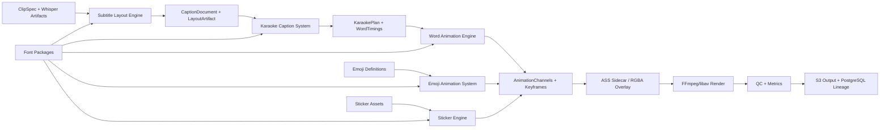
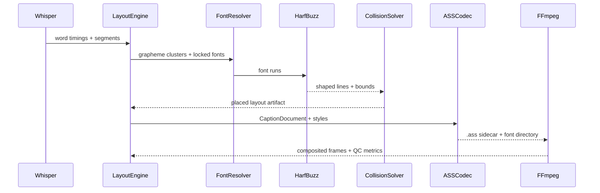
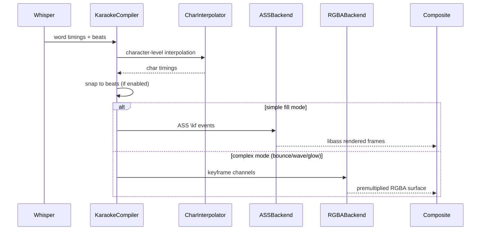
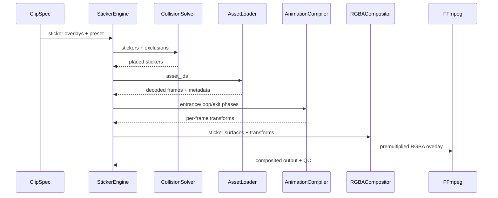

# Media Infrastructure SDD 04: Tipografi, Grafik ve Altyazı Sistemleri

**Durum:** Tasarım onayına hazır
**Kapsam:** Subtitle Layout Engine, Karaoke Caption System, Word Animation Engine, Emoji Animation System, Sticker Engine
**Normatif dil:** "MUST/ZORUNLU", "SHOULD/ÖNERİLİR" ve "MAY/OPSİYONEL" ifadeleri bağlayıcı karar seviyesini belirtir.
**Temel sözleşme:** `ClipSpec v1 -> şema doğrulama -> normalizasyon/compiler -> subtitle layout/karaoke/animation planı -> ASS/RGBA overlay burn-in -> FFmpeg/libav render`.

---

## 1. Amaç ve Sınırlar

Bu belge, sosyal medya klip üretim hattında profesyonel tipografi, karaoke vurgulama, kelime animasyonu, emoji animasyonu ve sticker overlay sistemlerinin mimarisini tanımlar. Tüm bileşenler Kick stream içeriğinden üretilen dikey/ yatay sosyal medya kliplerinde yüksek kaliteli, okunabilir ve zamanlamalı görsel metin katmanları üretir.

Tasarımın hedefleri:

- Kick stream’den elde edilen konuşmanın her kelimesi için karakter bazlı zaman damgasıyla senkronize karaoke vurgulama üretmek.
- ASS/SSA formatının alt kümesini kullanarak deterministik, yeniden üretilebilir altyazı yerleşimi ve stili oluşturmak.
- Emoji ve sticker overlay’lerini altyazı ve yüz takibi ile çakışmadan, safe area sınırları içinde yerleştirmek.
- Tüm tipografi ve grafik bileşenlerini FFmpeg libass, HarfBuzz ve FreeType ile render edilebilir ASS sidecar veya RGBA overlay olarak derlemek.
- Kubernetes üzerinde yatay ölçeklenebilir, Temporal ile tekrar çalıştırılabilir, PostgreSQL ve S3 ile izlenebilir bir tipografi üretim hattı sağlamak.

Kapsam dışı:

- Gerçek zamanlı (sub-frame gecikmeli) canlı yayın tipografi compositing’i; bu belge batch ve near-real-time render’ı kapsar.
- Genel amaçlı NLE kullanıcı arayüzü; belge backend sözleşmelerini tanımlar.
- DRM korumalı font çözme veya lisans yönetimi; font policy engine dış kaynaktır.
- ASR modelinin eğitimi; sistem yalnız sürümlenmiş ASR/forced-alignment modellerini çalıştırır.
- Video edit, kesim veya renk düzeltme; bunlar ayrı modüllerin sorumluluğundadır.

## 2. Ortak Mimari Kararları

### 2.1 Bileşenler

| Katman | Teknoloji | Sorumluluk |
|---|---|---|
| Public API | Python, FastAPI/Pydantic | `ClipSpec v1` kabulü, subtitle request, font policy, animation preset seçimi |
| Control plane | Python | subtitle layout compilation, karaoke timing alignment, animation keyframe compile, emoji/sticker placement solve |
| Text stack | libass, HarfBuzz, FreeType, ICU | metin şekillendirme (shaping), bidirectional, line break, glyph rasterization, emoji rendering |
| Font manager | fonttools, system font cache | font discovery, fallback zinciri, lisans policy, face index resolution |
| Animation engine | Python (compile), C/Rust (render) | keyframe evaluation, Bezier easing, spring physics, per-word motion |
| Overlay compositing | FFmpeg/libav, Pillow, Cairo | RGBA overlay production, sticker/emoji burn-in, premultiplied alpha compositing |
| Render plane | FFmpeg/libav | subtitle burn-in (libass), sticker overlay, final encode |
| Metadata | PostgreSQL | subtitle job, font manifest, animation preset, layout artifact |
| Object store | S3 | font packages, ASS sidecar, RGBA overlays, sticker assets, animation presets |
| Compute | Kubernetes | CPU worker (layout/compiler), GPU worker (render), font cache pods |

### 2.2 Ortak Veri Akışı



1. ClipSpec ve Whisper word-timing artifact’ları Subtitle Layout Engine’e girer.
2. Layout Engine, ASS formatında stil, safe area ve font çözmesi yaparak `CaptionDocument` ve `LayoutArtifact` üretir.
3. Karaoke Caption System, word-level timing ile her kelimenin zaman aralığını, renk geçişini ve vurgulama stilini belirler.
4. Word Animation Engine, kelime bazlı giriş/çıkış animasyonlarını keyframe olarak derler.
5. Emoji Animation System, emoji tanım ve timing’lerini animasyon kanallarına dönüştürür.
6. Sticker Engine, sticker yerleştirme kurallarını ve animasyon planlarını üretir.
7. Tüm katmanlar ASS sidecar veya RGBA overlay olarak FFmpeg render zincirine bağlanır.

### 2.3 Ortak Zaman ve Koordinat Sözleşmeleri

```python
@dataclass(frozen=True, slots=True)
class RationalTime:
    numerator: int       # signed int64
    denominator: int     # positive int32, never zero

@dataclass(frozen=True, slots=True)
class TimeRange:
    start: RationalTime  # inclusive
    duration: RationalTime
    # end = start + duration, exclusive

@dataclass(frozen=True, slots=True)
class Point:
    x: Decimal
    y: Decimal

@dataclass(frozen=True, slots=True)
class Rect:
    x: Decimal
    y: Decimal
    width: Decimal
    height: Decimal
```

Zaman ve koordinat invariantları:

- Wire format `{ "num": 1001, "den": 30000 }` biçimindedir; JSON number olarak saniye kabul edilmez.
- `denominator > 0`, kesir `gcd(abs(num), den) = 1` olacak şekilde normalize edilir.
- Koordinat sistemi top-left origin, `+x` sağa, `+y` aşağı; ASS alignment numpad referansı kullanılır (1-9).
- Safe area varsayılanı yatayda `%5`, üstte `%5`, altta `%10`; platform profile bu değerleri override eder.
- Tüm intermediate hesaplamalar `Decimal` hassasiyetinde yapılır; IEEE-754 dönüşümü yalnız backend boundary’de yapılır.
- NFC Unicode normalization tüm metin girdilerine uygulanır; grapheme cluster sınırları byte veya code point’e bölünmez.

### 2.4 Font Yönetim Mimarisi

```python
@dataclass(frozen=True, slots=True)
class FontFace:
    family_name: str
    style_name: str
    weight: int           # 100-900
    width: int            # 1-9 (ultra-condensed ... ultra-expanded)
    italic: bool
    file_path: str
    face_index: int
    content_hash: str     # SHA-256 of font bytes
    license_policy: Literal["embeddable", "render_only", "restricted"]

@dataclass(frozen=True, slots=True)
class FontFallbackChain:
    primary: FontFace
    fallbacks: tuple[FontFace, ...]
    emoji_font: FontFace | None
```

Font yönetimi kuralları:

- Font dosyası family adına göre sistemden aranmaz. Dependency lock içindeki exact font bytes, face index ve FreeType/HarfBuzz sürümü kullanılır.
- Font fallback run bazında değil eksik cluster bazında seçilir; bir grapheme’in tüm code point’lerini karşılayan ilk font kullanılır.
- `restricted` lisanslı font compile’ı bloklar; `render_only` font output’a embed edilmez.
- Font paketi content hash ile S3’te tutulur; worker node’larda read-only cache kullanılır.
- Color emoji (Noto Color Emoji, Twemoji) ayrı bir font olarak zincire dahil edilir; emoji cluster’ları yalnız emoji fontu tarafından render edilir.
- Font boyutu output pixel uzayında tanımlanır; preview ölçeği aynı layout’u oranlı taşır, bağımsız reflow yalnız preview profilinde açıkça seçilebilir.

---

## 3. Subtitle Layout Engine

### 3.1 Amaç, Mekanizma ve Invariants

Subtitle Layout Engine, ASR token’larını, Whisper word-timing çıktılarını ve kullanıcı düzenlemelerini clipSpec formatında belirtilmiş sosyal medya videoları için okunabilir, zamanlamalı ve estetik altyazı cue’larına dönüştürür. Motor, ASS/SSA formatını temel altyazı formatı olarak kullanır, ancak iç model olarak bağımsız `CaptionDocument` yapısını tutar.

```python
@dataclass(frozen=True, slots=True)
class SubtitleEntry:
    entry_id: str
    range: TimeRange
    text: str
    words: tuple["WordTiming", ...]
    confidence: Decimal
    style_ref: str
    placement: Literal["top", "center", "bottom", "dynamic"]
    layer: int = 0

@dataclass(frozen=True, slots=True)
class WordTiming:
    word: str
    start: RationalTime
    end: RationalTime
    confidence: Decimal
    grapheme_spans: tuple["GraphemeSpan", ...] = ()
    source: Literal["whisper", "forced", "interpolated", "manual"] = "whisper"

@dataclass(frozen=True, slots=True)
class GraphemeSpan:
    grapheme: str
    start: RationalTime
    end: RationalTime
    estimated: bool = True

@dataclass(frozen=True, slots=True)
class SubtitleStyle:
    name: str
    font_stack: tuple[str, ...]
    font_size_px: Decimal
    line_height: Decimal
    primary_color: str       # &HBBGGRR& ASS format
    secondary_color: str
    outline_color: str
    back_color: str
    bold: bool
    italic: bool
    outline_px: Decimal
    shadow_px: Decimal
    shadow_offset_x: Decimal
    shadow_offset_y: Decimal
    alignment: int           # 1-9 numpad
    margin_l: int
    margin_r: int
    margin_v: int
    spacing: Decimal = Decimal("0")
    angle: Decimal = Decimal("0")
    scale_x: int = 100
    scale_y: int = 100
    border_style: int = 1
    encoding: int = 1

@dataclass(frozen=True, slots=True)
class LayoutRegion:
    region_id: str
    bounds: Rect
    anchor: Literal["top_left", "top_center", "top_right",
                     "center_left", "center", "center_right",
                     "bottom_left", "bottom_center", "bottom_right"]
    priority: int
    exclusion_zones: tuple[Rect, ...] = ()

@dataclass(frozen=True, slots=True)
class SubtitleTrack:
    track_id: str
    locale: str
    entries: tuple[SubtitleEntry, ...]
    style: SubtitleStyle
    layout_region: LayoutRegion
    safe_area: Rect
    content_hash: str

@dataclass(frozen=True, slots=True)
class CaptionDocument:
    version: Literal["1"]
    tracks: tuple[SubtitleTrack, ...]
    play_res_x: int
    play_res_y: int
    content_hash: str
```

Temel invariantlar:

- Subtitle entry’ları `[start, end)` yarı açık aralığıyla tanımlanır ve aynı track içinde overlap etmez.
- Her entry en fazla `max_lines` (varsayılan 2) satır içerir; satır başına maksimum grapheme sayısı `max_chars_per_line` ile sınırlıdır.
- Varsayılan cue süresi `800 ms..7000 ms`, satır başına en fazla 42 Latin grapheme veya safe area genişliğinin `%90`ı.
- Kelime zamanlaması Whisper `word_timestamps=True` çıktısından gelir; forced alignment mevcutsa tercih edilir.
- Point-based timing (kelime bazlı) ile segment bazlı timing arasında belirgin fark vardır: point-based kelimenin kesin başlangıç/bitiş zamanını taşır, segment bazlı tahmini dağılım yapar.
- Metin NFC normalize edilir; ZWJ emoji ve combining mark’lar bölünmez.
- Font fallback cluster bazında seçilir; bir grapheme’in tüm code point’lerini karşılayan ilk font kullanılır.
- Çakışma çözümü: preferred anchor’da vertical shift (`<= output height %15`), alternate anchor, font küçültme (`en fazla %12`), sonra policy’ye göre fail.
- Caption kutuları reserved UI regions, face exclusion zones ve birbirleriyle çakışmamalıdır; çakışma alanı kutu alanının `%2` sini aşarsa solver devreye girer.

### 3.2 Neden ve Alternatifler

ASR segmentlerini doğrudan SRT olarak göstermek hızlıdır fakat segmentler dilbilgisel sınır, okuma hızı, safe area ve estetik için üretilmez. WebVTT daha zengin cue ayarları sunar; ancak final burn-in için libass uyumluluğu ve mevcut ekosistem nedeniyle ASS formatı tercih edilmiştir. Ham ASS’i doğrudan FFmpeg’e vermek güvenlik, font ve determinism denetimini atladığından yasaktır; her zaman iç modelden derleme yapılır. drawtext ile altyazı oluşturmak basittir; fakat complex shaping, fallback, cluster-aware karaoke ve collision için yetersizdir.

### 3.3 Veri Akışı, API ve Dosya Yeri

Veri akışı: `Whisper segments + word timings -> text normalization -> editorial patch -> forced alignment -> cue segmentation -> font resolution -> HarfBuzz shaping -> line breaking -> collision solve -> LayoutArtifact -> ASS sidecar`.

Public API:

```json
{
  "subtitle_layout": {
    "track_id": "tr-karaoke-main",
    "locale": "tr-TR",
    "style": {
      "font_stack": ["Inter Variable", "Noto Sans", "Noto Color Emoji"],
      "font_size_px": 52,
      "line_height": 1.12,
      "primary_color": "&H00FFFFFF",
      "outline_color": "&H00000000",
      "outline_px": 3.0,
      "shadow_px": 2.0,
      "alignment": 2,
      "margin_v": 40
    },
    "segmentation": {
      "max_lines": 2,
      "max_chars_per_line": 30,
      "min_duration_ms": 800,
      "max_duration_ms": 7000,
      "target_graphemes_per_second": 17
    },
    "safe_area": {
      "left": 54,
      "right": 54,
      "top": 96,
      "bottom": 192
    },
    "collision_policy": "alternate_anchor"
  }
}
```

Internal API:

```python
layout = subtitle_layout_engine.compile(
    entries=subtitle_entries,
    word_timings=whisper_artifact.word_timings,
    style=resolved_style,
    safe_area=safe_area,
    viewport=Viewport(1080, 1920),
    exclusion_zones=face_zones + template_regions,
    policy=LayoutPolicy(max_lines=2, confidence_floor=Decimal("0.55")),
)
sidecar = ass_codec.export(layout.document, play_res=(1080, 1920))
```

Dosyalar: `services/advanced_subtitle.py`, `services/subtitle_service.py`; SDD karşılığı `video_engine/captions/`, `video_engine/captions/layout.py`, `video_engine/captions/ass_codec.py`, `video_engine/captions/fonts.py`.

### 3.4 Algoritma Detayları

#### 3.4.1 Çoklu Satır Yerleşim Algoritması

Kelime bazlı zamanlamadan çoklu satırlı altyazı üretimi şu adımları izler:

1. **Kelime Gruplama:** Kelimeler, `max_chars_per_line` sınırına göre satırlara bölünür. Satır kırılma kararı saf karakter sayısına dayanmaz; gerçek shaped width maliyetiyle yapılır.
2. **Satır Optimizasyonu:** Her aday satır, font stack ve boyut kullanılarak HarfBuzz ile şekillendirilir. Shaped genişlik safe area genişliğinin `%90`ını aşarsa satır bölünür.
3. **Yerleşim Çözümü:** Satırlar, tercih edilen anchor noktasına göre yerleştirilir. Çakışma varsa collision solver devreye girer.
4. **Zamanlama Uyumu:** Her satırın başlangıç/bitiş zamanı, o satırdaki ilk/son kelimenin zamanına eşitlenir; satır içi kelimeler arası gap varsa genişletilir.

```python
def split_words_to_lines(
    words: list[WordTiming],
    max_chars: int,
    shaped_width_fn: Callable[[str, str, int], int],
    safe_width: int,
) -> list[tuple[list[WordTiming], RationalTime, RationalTime]]:
    lines = []
    current_line: list[WordTiming] = []
    current_text_parts: list[str] = []
    current_chars = 0
    line_start: RationalTime | None = None

    for w in words:
        test_text = " ".join(current_text_parts + [w.word])
        shaped_w = shaped_width_fn(test_text, "Inter Variable", 52)

        if (current_chars + len(w.word) + 1 > max_chars
                or shaped_w > safe_width * 0.9) and current_line:
            lines.append((
                list(current_line),
                line_start,
                current_line[-1].end,
            ))
            current_line = []
            current_text_parts = []
            current_chars = 0

        if not current_line:
            line_start = w.start

        current_line.append(w)
        current_text_parts.append(w.word)
        current_chars += len(w.word) + 1

    if current_line:
        lines.append((
            current_line,
            line_start,
            current_line[-1].end,
        ))

    return lines
```

#### 3.4.2 Safe Area Uyumu

```python
def compute_safe_area(
    viewport_width: int,
    viewport_height: int,
    platform_profile: str = "tiktok",
) -> Rect:
    profiles = {
        "tiktok": {"left": 0.05, "right": 0.05, "top": 0.05, "bottom": 0.10},
        "youtube_shorts": {"left": 0.05, "right": 0.05, "top": 0.05, "bottom": 0.08},
        "instagram_reels": {"left": 0.04, "right": 0.04, "top": 0.05, "bottom": 0.10},
        "kick": {"left": 0.03, "right": 0.03, "top": 0.03, "bottom": 0.05},
    }
    p = profiles.get(platform_profile, profiles["tiktok"])
    import math
    return Rect(
        x=Decimal(str(math.ceil(viewport_width * p["left"]))),
        y=Decimal(str(math.ceil(viewport_height * p["top"]))),
        width=Decimal(str(math.floor(viewport_width * (1 - p["left"] - p["right"])))),
        height=Decimal(str(math.floor(viewport_height * (1 - p["top"] - p["bottom"])))),
    )
```

#### 3.4.3 Çözümleme Sırası ve Çarpışma Çözümü

```python
def solve_collision(
    caption_boxes: list[Rect],
    exclusion_zones: list[Rect],
    safe_area: Rect,
    max_shift_ratio: float = 0.15,
    max_font_reduction: float = 0.12,
    policy: str = "alternate_anchor",
) -> list[Rect]:
    solved = []
    for box in caption_boxes:
        candidate = box
        shifted = 0

        for _ in range(12):
            collision = False
            for exc in exclusion_zones + solved:
                if rects_overlap(candidate, exc):
                    collision = True
                    break
            if not collision:
                break

            if shifted < max_shift_ratio * safe_area.height:
                candidate = translate_y(candidate, -Decimal("8"))
                shifted += 8
            elif policy == "alternate_anchor":
                candidate = flip_anchor(candidate, safe_area)
            else:
                break

        solved.append(candidate)
    return solved
```

### 3.5 ASS Üretim Algoritması

```python
def generate_ass(
    document: CaptionDocument,
    styles: dict[str, SubtitleStyle],
) -> str:
    lines = []
    lines.append("[Script Info]")
    lines.append("Title: Auto-Generated Social Clip Subtitles")
    lines.append("ScriptType: v4.00+")
    lines.append(f"PlayResX: {document.play_res_x}")
    lines.append(f"PlayResY: {document.play_res_y}")
    lines.append("WrapStyle: 0")
    lines.append("ScaledBorderAndShadow: yes")
    lines.append("YCbCr Matrix: TV.709")
    lines.append("")

    lines.append("[V4+ Styles]")
    lines.append(
        "Format: Name, Fontname, Fontsize, PrimaryColour, "
        "SecondaryColour, OutlineColour, BackColour, "
        "Bold, Italic, Underline, StrikeOut, "
        "ScaleX, ScaleY, Spacing, Angle, "
        "BorderStyle, Outline, Shadow, "
        "Alignment, MarginL, MarginR, MarginV, Encoding"
    )
    for name, style in styles.items():
        lines.append(style_to_ass_line(style))

    lines.append("")
    lines.append("[Events]")
    lines.append(
        "Format: Layer, Start, End, Style, Name, "
        "MarginL, MarginR, MarginV, Effect, Text"
    )

    for track in document.tracks:
        for entry in track.entries:
            start_str = rational_to_ass_time(entry.range.start)
            end_str = rational_to_ass_time(entry.range.end)
            text = entry.text.replace("\n", "\\N")
            lines.append(
                f"Dialogue: {entry.layer},{start_str},{end_str},"
                f"{track.style.name},,"
                f"{track.style.margin_l},{track.style.margin_r},"
                f"{track.style.margin_v},,{text}"
            )

    return "\n".join(lines)


def style_to_ass_line(style: SubtitleStyle) -> str:
    return (
        f"Style: {style.name},"
        f"{style.font_stack[0]},{style.font_size_px},"
        f"{style.primary_color},{style.secondary_color},"
        f"{style.outline_color},{style.back_color},"
        f"{int(style.bold)},{int(style.italic)},{0},{0},"
        f"{style.scale_x},{style.scale_y},"
        f"{style.spacing},{style.angle},"
        f"{style.border_style},{style.outline_px},{style.shadow_px},"
        f"{style.alignment},{style.margin_l},{style.margin_r},"
        f"{style.margin_v},{style.encoding}"
    )


def rational_to_ass_time(t: RationalTime) -> str:
    total_seconds = t.numerator / t.denominator
    hours = int(total_seconds // 3600)
    minutes = int((total_seconds % 3600) // 60)
    seconds = int(total_seconds % 60)
    centiseconds = int((total_seconds % 1) * 100)
    return f"{hours}:{minutes:02d}:{seconds:02d}.{centiseconds:02d}"
```

### 3.6 Render Pipeline Entegrasyonu

Compiler önce layout’u sabitler, sonra ASS sidecar veya RGBA overlay render node’una bağlar. libass backend ASS dosyasını, fonts directory’yi ve font manifest’ini alarak frame başına glyph rasterization yapar. Native backend HarfBuzz/FreeType ile premultiplied RGBA caption surface üretip ana video composite zincirine ekler.



### 3.7 Üretim Sorunları ve Recovery

- Eksik word timing: segment bazlı tahmini dağılıma düşülür; kelime süresi segment süresinin kelime sayısına bölümüyle hesaplanır.
- Eksik glyph: code point ve denenen font ID’leri metrics artefact’ına yazılır; caption metni PII loguna yazılmaz. Strict policy’de render fail, permissive’de tofu + metric üretilir.
- Font paketi eksik/bozuk: checksum uyuşmazlığı retry edilmez; dependency lock yeniden çözülmeden sistem fontuna düşülmez.
- Layout oscillation: hareketli exclusion zone için hysteresis 4 px ve minimum placement hold 150 ms uygulanır.
- Caption crop: QC, alpha bounds’un safe-area dışına taşmasını kontrol eder; taşma varsa publish bloklanır.
- Overlay bomb: event başına 256 tag, document başına 100.000 tag, text 1 MB hard limit.

### 3.8 Performans, Benchmark ve Kabul Kriterleri

Benchmark dataset: 10 dakikalık Türkçe konuşmalı 1080p30 klip, ortalama 300 kelime/dakika, 800 kelime toplam, 400 cue, 2 satır, karmaşık emoji/ZWJ sequence’ları.

Kabul kriterleri:

- 1.000 entry layout p95 `< 500 ms` (font resolve + shaping + collision dahil).
- Sıcak shape cache hit ratio `> %98`.
- Safe-area taşması ve grapheme split `0`.
- ASS export parse-export-parse round-trip metin eşitliği `%100`.
- Peak RSS 10.000 entry için `< 512 MB`.
- Aynı input ile content_hash 20/20 aynı.

### 3.9 Gerçek Dünya, Ölçeklenme, Ownership ve Test

Uygulama: 60 saniyelik dikey Kick klibinde Türkçe konuşmacının her kelimesi sarı outline ile beyaz olarak altta gösterilir; webcam yüzü sağ alt köşede olduğunda altyazı üst orta alana taşınır. Arapça isim içeren cümlede ICU bidi izin verilen karakterleri doğru görsel sırada tutar.

Ölçeklenme: layout compiler CPU stateless pod’larda çalışır; font pack’ler read-only node cache ile dağıtılır. Caption document küçük ve immutable olduğu için PostgreSQL metadata, S3’te zstd JSON olarak tutulur. Aynı font hash ve style ile farklı video resolution’ları aynı layout artefact’ını paylaşabilir.

Ownership: **Speech & Captions / Typography Platform**. Testler Unicode conformance, bidi, line break, font fallback, collision property, screenshot golden, ASS round-trip, memory pressure ve worker-image compatibility testlerini kapsar.

---

## 4. Karaoke Caption System

### 4.1 Amaç, Mekanizma ve Invariants

Karaoke Caption System, Whisper word-level timing çıktısını kullanarak her kelimenin zaman aralığında karakter bazlı vurgulama (wipe/fill) animasyonu üretir. Sistem, altyazı satırları içinde kelimelerin konuşma zamanıyla senkron olarak renk değiştirme, bounce, wave ve typewriter efektleri oluşturur.

```python
@dataclass(frozen=True, slots=True)
class KaraokeEntry:
    entry_id: str
    words: tuple["KaraokeWord", ...]
    line_text: str
    line_start: RationalTime
    line_end: RationalTime
    style_ref: str
    placement: Literal["top", "center", "bottom"]

@dataclass(frozen=True, slots=True)
class KaraokeWord:
    word: str
    start: RationalTime
    end: RationalTime
    chars: tuple["CharTiming", ...]
    highlight_color: str
    default_color: str
    confidence: Decimal

@dataclass(frozen=True, slots=True)
class CharTiming:
    char: str
    start: RationalTime
    end: RationalTime
    grapheme_index: int

@dataclass(frozen=True, slots=True)
class KaraokeStyle:
    name: str
    mode: Literal["fill", "bounce", "wave", "typewriter", "pop", "glow"]
    highlight_color: str          # &HBBGGRR& ASS format
    default_color: str
    outline_color: str
    glow_color: str
    bounce_amplitude: Decimal     # pixels, bounce modu için
    wave_height: Decimal          # pixels, wave modu için
    wave_speed: Decimal           # Hz, wave modu için
    fill_direction: Literal["left_to_right", "right_to_left", "center_out"]
    glow_radius: Decimal          # outline genişliği artışı
    scale_on_highlight: Decimal   # vurgulanan kelime ölçeği (1.0 = sabit)
    reduced_motion_fallback: KaraokeStyle | None = None
```

Temel invariantlar:

- Word timing Whisper `word_timestamps=True` çıktısından veya forced alignment’dan gelir.
- Karaoke progress her kelimenin `[start, end)` aralığında `0..1` değerini alır.
- Sıfır süreli kelime (noktalama) kabul edilir ve önceki lexical kelime progress’ine bağlanır.
- Character-level timing interpolate edilir: kelime süresi karakter sayısına eşit bölünür; gerçek phoneme timing mevcutsa tercih edilir.
- Highlight bir Unicode grapheme veya shaped cluster’ı ortadan bölemez; ligature içindeki kelime sınırı için HarfBuzz cluster bilgisi kullanılır.
- ASS `\kf` tag’i centisecond hassasiyetindedir; internal rational -> ASS conversion `floor/ceil` ile yapılır.
- Multiple karaoke stili同一 anda tek satırda karıştırılmaz; her satır tek bir KaraokeStyle kullanır.
- Reduced-motion profilinde bounce ve wave kapatılır; fill veya fade fallback kullanılır.
- Beat-synced karaoke timing mevcutsa, beat timestampleri kelime başlangıç/bitiş zamanlarına snap edilir.

### 4.2 Neden ve Alternatifler

ASS `\k` ve `\kf` tag’leri temel karaoke için yeterlidir; ancak bounce, wave, typewriter ve glow efektleri ASS override semantiğiyle tam olarak ifade edilemez. Bu nedenle basit fill modu ASS backend’e, kompleks modlar RGBA overlay’ye derlenir. FFmpeg drawtext ile kelime bazlı renk değişimi basittir; fakat character-level wipe, glow ve bounce için yetersizdir.

### 4.3 Veri Akışı, API ve Dosya Yeri

Veri akışı: `WordTiming[] + KaraokeStyle -> character interpolation -> per-char timing -> ASS karaoke tags veya keyframe channels -> ASS sidecar veya RGBA overlay node`.

Public API:

```json
{
  "karaoke": {
    "mode": "fill",
    "timing_source": "whisper_word",
    "highlight_color": "&H0000FFFF",
    "default_color": "&H00FFFFFF",
    "fill_direction": "left_to_right",
    "scale_on_highlight": 1.08,
    "reduced_motion_fallback": "word_highlight"
  }
}
```

Internal API:

```python
karaoke_plan = karaoke_system.compile(
    word_timings=whisper_artifact.word_timings,
    segments=subtitle_document.segments,
    style=resolved_karaoke_style,
    output_clock=OutputClock(fps=Fraction(30000, 1001)),
    accessibility=profile.accessibility,
)
```

### 4.4 Karaoke Timing Algoritması

#### 4.4.1 Character-Level Timing Interpolasyonu

```python
def interpolate_char_timings(
    word: KaraokeWord,
    interpolation_mode: str = "uniform",
) -> tuple[CharTiming, ...]:
    chars = list(word.chars)
    if not chars:
        return ()

    word_duration = word.end - word.start
    total_graphemes = len(chars)

    if interpolation_mode == "uniform":
        char_duration = RationalTime(
            word_duration.numerator,
            word_duration.denominator * total_graphemes,
        )
        timings = []
        current_start = word.start
        for i, c in enumerate(chars):
            current_end = RationalTime(
                current_start.numerator + char_duration.numerator,
                char_duration.denominator,
            )
            timings.append(CharTiming(
                char=c.char,
                start=current_start,
                end=current_end,
                grapheme_index=i,
            ))
            current_start = current_end
        return tuple(timings)

    elif interpolation_mode == "weighted_by_length":
        total_len = sum(len(c.char) for c in chars)
        timings = []
        current_start = word.start
        for i, c in enumerate(chars):
            weight = len(c.char) / max(total_len, 1)
            char_dur = RationalTime(
                word_duration.numerator * weight,
                word_duration.denominator,
            )
            current_end = RationalTime(
                current_start.numerator + char_dur.numerator * word_duration.denominator,
                word_duration.denominator,
            )
            timings.append(CharTiming(
                char=c.char,
                start=current_start,
                end=current_end,
                grapheme_index=i,
            ))
            current_start = current_end
        return tuple(timings)

    return word.chars
```

#### 4.4.2 ASS Karaoke Tag Üretimi

```python
def build_karaoke_ass_line(
    entry: KaraokeEntry,
    style: KaraokeStyle,
) -> str:
    parts = []
    for word in entry.words:
        duration_cs = max(1, rational_to_centiseconds(word.end - word.start))

        if style.mode == "fill":
            parts.append(f"{{\\kf{duration_cs}}}{{\\c{word.highlight_color}}}{word.word}{{\\c{word.default_color}}} ")
        elif style.mode == "bounce":
            amp = int(style.bounce_amplitude)
            parts.append(
                f"{{\\kf{duration_cs}}}"
                f"{{\\move(0,0,0,-{amp})}}"
                f"{{\\fscx{int(style.scale_on_highlight * 100)}\\fscy{int(style.scale_on_highlight * 100)}}}"
                f"{word.word}"
                f"{{\\fscx100\\fscy100}}"
                f"{{\\move(0,-{amp},0,0)}} "
            )
        elif style.mode == "wave":
            wave_parts = []
            for char in word.chars:
                wave_amp = int(style.wave_height)
                wave_parts.append(
                    f"{{\\move(0,0,0,-{wave_amp})}}"
                    f"{char.char}"
                    f"{{\\move(0,-{wave_amp},0,0)}}"
                )
            parts.append(f"{{\\kf{duration_cs}}}{''.join(wave_parts)} ")
        elif style.mode == "typewriter":
            parts.append(f"{{\\kf{duration_cs}}}{word.word} ")
        elif style.mode == "pop":
            parts.append(
                f"{{\\kf{duration_cs}}}"
                f"{{\\fscx{int(style.scale_on_highlight * 100)}\\fscy{int(style.scale_on_highlight * 100)}}}"
                f"{word.word}{{\\fscx100\\fscy100}} "
            )
        elif style.mode == "glow":
            radius = int(style.glow_radius)
            parts.append(
                f"{{\\kf{duration_cs}}}"
                f"{{\\3c{style.glow_color}\\bord{radius}}}"
                f"{word.word}"
                f"{{\\3c{style.outline_color}\\bord{int(style.outline_px)}}} "
            )
        else:
            parts.append(f"{{\\kf{duration_cs}}}{word.word} ")

    return "".join(parts).strip()


def rational_to_centiseconds(duration: RationalTime) -> int:
    total_ms = duration.numerator * 1000 // duration.denominator
    return max(1, total_ms // 10)
```

#### 4.4.3 Beat-Synced Karaoke Timing

```python
def snap_karaoke_to_beats(
    words: list[KaraokeWord],
    beats: list[RationalTime],
    tolerance_cs: int = 3,
) -> list[KaraokeWord]:
    snapped = []
    for word in words:
        nearest_beat_start = find_nearest_beat(word.start, beats, tolerance_cs)
        nearest_beat_end = find_nearest_beat(word.end, beats, tolerance_cs)

        if nearest_beat_start is not None:
            word = replace_field(word, "start", nearest_beat_start)
        if nearest_beat_end is not None and nearest_beat_end > word.start:
            word = replace_field(word, "end", nearest_beat_end)

        snapped.append(word)
    return snapped


def find_nearest_beat(
    target: RationalTime,
    beats: list[RationalTime],
    tolerance_cs: int,
) -> RationalTime | None:
    tolerance = RationalTime(tolerance_cs, 100)
    best = None
    best_dist = tolerance
    for beat in beats:
        dist = abs(beat - target)
        if dist < best_dist:
            best_dist = dist
            best = beat
    return best
```

### 4.5 Karaoke Stilleri Detaylı

| Stile | ASS Backend | RGBA Backend | Örnek Kullanım |
|---|---|---|---|
| `fill` | `\kf` ile renk wipe | soladan sağa renk maskesi | Standart karaoke |
| `bounce` | `\move` + `\fscx/y` | spring physics ile yukarı zıplama | Heyecanlı anlar |
| `wave` | harf harf `\move` | sinüzoidal y-ofset | Müzik segmentleri |
| `typewriter` | `\kf` ile kademeli | karakter karakter reveal | Dramatik anlar |
| `pop` | `\fscx/y` scale | elastic easing ile scale | Komedi momentleri |
| `glow` | `\3c` + `\bord` | gaussian blur + additive blend | Vurgu anları |

### 4.6 Renk Paletleri

```python
KARAOKE_PALETTES = {
    "neon": {
        "highlight": "&H0000FFFF",    # Sarı (BGR)
        "default": "&H00FFFFFF",      # Beyaz
        "outline": "&H00FF00FF",      # Pembe outline
        "glow": "&H000080FF",         # Turuncu glow
    },
    "fire": {
        "highlight": "&H000080FF",    # Turuncu
        "default": "&H00FFFFFF",
        "outline": "&H000000FF",      # Kırmızı
        "glow": "&H000040FF",
    },
    "ice": {
        "highlight": "&H00FFFF00",    # Cyan
        "default": "&H00E0E0E0",      # Açık gri
        "outline": "&H00808080",
        "glow": "&H00FFD000",
    },
    "green": {
        "highlight": "&H0000FF00",    # Yeşil
        "default": "&H00FFFFFF",
        "outline": "&H00008000",
        "glow": "&H0000C000",
    },
    "purple": {
        "highlight": "&H00FF00FF",    # Mor
        "default": "&H00FFFFFF",
        "outline": "&H00800080",
        "glow": "&H00CC00CC",
    },
    "classic": {
        "highlight": "&H0000FFFF",    # Sarı
        "default": "&H00FFFFFF",
        "outline": "&H00000000",
        "glow": "&H0000B4FF",
    },
    "gradient": {
        "highlight": "&H0000B4FF",    # Altın
        "default": "&H00808080",      # Gri
        "outline": "&H00000000",
        "glow": "&H000060C0",
    },
}
```

### 4.7 Glow ve Shadow Efektleri

Okunabilirlik için glow ve shadow efektleri kritik öneme sahiptir. Parlak renkler (sarı, cyan) koyu arka planlarda iyi okunurken açık arka planlarda kaybolabilir; bu nedenle outline ve shadow her zaman uygulanır.

Glow efekti iki yolla üretilir:

1. **ASS backend:** `\3c` (üçüncü rengi) glow rengine ayarla, `\bord` değerini artırarak geniş outline oluştur.
2. **RGBA backend:** Metin glyph’larını iki kez render et; birincisi glow rengiyle kalın outline, ikincisi normal outline ile üst üste bindir.

```python
def build_glow_effect(
    word_text: str,
    glow_color: str,
    glow_radius: int,
    normal_outline: int,
    normal_color: str,
) -> str:
    return (
        f"{{\\3c{glow_color}\\bord{glow_radius}}}"
        f"{word_text}"
        f"{{\\3c{normal_color}\\bord{normal_outline}}}"
    )


def build_shadow_for_readability(
    shadow_offset_x: int,
    shadow_offset_y: int,
    shadow_alpha: str,
) -> str:
    return f"{{\\4c{shadow_alpha}\\shad{shadow_offset_y}}}"
```

### 4.8 Render Pipeline Entegrasyonu

Basit karaoke (fill modu) ASS backend üzerinden libass ile render edilir; bounce, wave, typewriter ve glow modları RGBA overlay olarak ayrı surface’da render edilip premultiplied alpha ile video üstüne bindirilir.



### 4.9 Üretim Sorunları ve Recovery

- Eksik word timing: preset `fallback=cue` ise cue-level fade’e deterministik düşülür; strict karaoke policy compile’ı bloklar.
- Ligature/cluster uyuşmazlığı: ilgili run `liga=0` ile yeniden shape edilir; hâlâ mapping yoksa token tüm run olarak highlight edilir ve QC warning üretilir.
- Centisecond quantization: ASS backend ile native backend arasındaki hassasiyet farkı QC’de raporlanır; tolerans aşıldıysa native backend seçilir.
- Çok kısa cue flicker: iki frame’den kısa cue animasyonsuz statik gösterilir.
- Beat-snapping çelişkisi: beat zamanı kelime başlangıcından 50 ms fazla sapıyorsa snap yapılmaz, original timing korunur.

### 4.10 Performans, Benchmark ve Kabul Kriterleri

Benchmark: 1080x1920@30; 5 dakikalık Türkçe klip, 150 kelime/dakika, 750 kelime, tüm karaoke modları ayrı ayrı.

Kabul kriterleri:

- Tek caption lane karaoke overlay p95 render overhead 1080p30’da `< 1.5 ms/frame`.
- Character-level timing interpolation determinism testi: aynı input 20/20 aynı char start/end üretmeli.
- Word highlight başlangıç/bitiş hatası `<= 1 output frame`.
- Glow effect golden testinde kenar pixel farkı `<= 1/255` lineer kanal.
- Reduced-motion profili bounce/wave channel sayısını `0` yapmalı.

### 4.11 Gerçek Dünya, Ölçeklenme, Ownership ve Test

Uygulama: Kick stream’den üretilen 60 saniyelik dikey klipte her kelime sarı renkle soldan sağa dolar, aktif kelime `%108` scale ile 120 ms yukarı zıplar; beat-eşzamanlı modda kelimeler beat zamanına snap edilir.

Ölçeklenme: karaoke compiler CPU-bound’tır ve stateless olarak yatay ölçeklenir. Character interpolation cache (font/size/text hash) ile anahtarlanır. Beat timing S3’te content-addressed artifact olarak tutulur.

Ownership: **Speech & Captions**. Testler timing interpolation, ASS round-trip, character boundary, short cue, beat snap, glow/shadow golden, backend parity, 4K60 performance ve accessibility fallback testlerini kapsar.

---

## 5. Word Animation Engine

### 5.1 Amaç, Mekanizma ve Invariants

Word Animation Engine, her kelimeye (veya karaktere) bağımsız animasyon uygular. Giriş animasyonları (pop, slide, fade, scale, rotate), hareket yolları (motion paths), elastik/yay fiziği ve expression tabanlı animasyonları destekler. Motor, keyframe tabanlı bir animasyon modeli kullanır ve çıktısını ASS override tag’leri veya RGBA overlay keyframe kanalları olarak derler.

```python
@dataclass(frozen=True, slots=True)
class TextAnimation:
    animation_id: str
    target: Literal["word", "char", "line", "cue"]
    timing: Literal["sequential", "simultaneous", "staggered"]
    stagger_delay: RationalTime
    channel: "AnimationChannel"

@dataclass(frozen=True, slots=True)
class AnimationChannel:
    channel_id: str
    property: Literal["position_x", "position_y", "scale_x", "scale_y",
                       "rotation", "opacity", "color", "outline_width"]
    keyframes: tuple["AnimationKey", ...]
    easing_default: str = "ease_out"
    motion_path: "MotionPath | None" = None

@dataclass(frozen=True, slots=True)
class AnimationKey:
    time: RationalTime
    value: "AnimValue"
    easing: str = "linear"
    ease_in: tuple[Decimal, Decimal] | None = None
    ease_out: tuple[Decimal, Decimal] | None = None
    hold: bool = False

@dataclass(frozen=True, slots=True)
class AnimationCurve:
    type: Literal["linear", "bezier", "spring", "elastic", "bounce", "expression"]
    params: Mapping[str, JsonValue]
    reference_fps: Fraction

@dataclass(frozen=True, slots=True)
class MotionPath:
    path_id: str
    points: tuple[Point, ...]
    tangents_in: tuple[Point, ...] | None
    tangents_out: tuple[Point, ...] | None
    closed: bool = False
    arc_length_table: tuple[tuple[Decimal, Decimal], ...] | None = None

@dataclass(frozen=True, slots=True)
class SpringPhysics:
    mass: Decimal
    stiffness: Decimal
    damping: Decimal
    initial_velocity: Decimal = Decimal("0")
    rest_threshold: Decimal = Decimal("0.001")
```

Temel invariantlar:

- Animasyon local cue zamanında tanımlanır; timeline’a dönüşüm compiler tarafından bir kez yapılır.
- Enter ve exit toplamı cue süresini aşarsa önce hold süresi sıfıra iner, sonra iki süre aynı oranla küçülür.
- Hareket transform order’ı sabittir: `anchor translate -> scale -> rotate -> layout translate`.
- Opacity premultiplied alpha üzerinde uygulanır.
- Reduced-motion profilinde spatial hareket ve bounce kapatılır; opacity transition `<= 150 ms` ile korunur.
- Bir cue’daki eşzamanlı animated glyph sayısı varsayılan 256, hard limit 1024’tür.
- Motion path arc-length tablosu keyframe zamanına göre normalize edilir; path üzerindeki hız temporal curve tarafından belirlenir.
- Spring physics solver dt parametresi olarak output frame süresini kullanır; frame rate değişse bile fizik davranışı aynı kalır.

### 5.2 Neden ve Alternatifler

ASS `\t` ve `\move` tag’leri basit enter/exit animasyonlarını ifade edebilir; ancak spring physics, elastic easing ve expression tabanlı animasyonları desteklemez. CSS/JS Web animasyonları zengindir; fakat font/layout determinism, high-volume frame production ve native render compatibility için uygun değildir. Bu nedenle keyframe tabanlı dahili model kullanılır ve mümkün olan basit preset ASS’e, diğerleri RGBA overlay node’una derlenir.

### 5.3 Veri Akışı, API ve Dosya Yeri

Veri akışı: `SubtitleEntry + AnimationPreset -> per-word/per-char keyframe generation -> easing evaluation -> shaped cluster mapping -> ASS tags veya RGBA overlay keyframe nodes`.

Public API:

```json
{
  "word_animation": {
    "preset": "pop_enter@1.0.0",
    "target": "word",
    "timing": "staggered",
    "stagger_delay_ms": 40,
    "channels": {
      "scale_x": {"from": 0.5, "to": 1.0, "easing": "elastic_out"},
      "scale_y": {"from": 0.5, "to": 1.0, "easing": "elastic_out"},
      "opacity": {"from": 0.0, "to": 1.0, "easing": "ease_out"}
    }
  }
}
```

Internal API:

```python
animation_plan = word_animation.compile(
    entries=subtitle_entries,
    preset=locked_preset,
    output_clock=clock,
    accessibility=profile.accessibility,
)
```

### 5.4 Animasyon Eğrileri Algoritması

#### 5.4.1 Bezier Easing

```python
def bezier_ease(
    t: Decimal,
    p1: tuple[Decimal, Decimal] = (Decimal("0.25"), Decimal("0.1")),
    p2: tuple[Decimal, Decimal] = (Decimal("0.25"), Decimal("1.0")),
    iterations: int = 8,
) -> Decimal:
    x1, y1 = p1
    x2, y2 = p2

    u = t
    for _ in range(iterations):
        bx = 3 * x1 * u * (1 - u)**2 + 3 * x2 * u**2 * (1 - u) + u**3 - t
        dx = 3 * x1 * (1 - u)**2 + 6 * x1 * u * (1 - u) + 6 * x2 * u * (1 - u) + 3 * x2 * u**2 + 3 * (1 - u)**2
        if abs(dx) < Decimal("1e-12"):
            break
        u = u - bx / dx

    by = 3 * y1 * u * (1 - u)**2 + 3 * y2 * u**2 * (1 - u) + u**3
    return max(Decimal("0"), min(Decimal("1"), by))
```

#### 5.4.2 Spring Physics Solver

```python
def spring_ease(
    t: Decimal,
    mass: Decimal = Decimal("1"),
    stiffness: Decimal = Decimal("180"),
    damping: Decimal = Decimal("12"),
    initial_velocity: Decimal = Decimal("0"),
    rest_threshold: Decimal = Decimal("0.001"),
    dt: Decimal = Decimal("0.01667"),
) -> Decimal:
    x = Decimal("0")
    v = initial_velocity
    time = Decimal("0")

    while time < t:
        spring_force = -stiffness * x
        damping_force = -damping * v
        acceleration = (spring_force + damping_force) / mass
        v = v + acceleration * dt
        x = x + v * dt
        time = time + dt

        if abs(x - Decimal("1")) < rest_threshold and abs(v) < rest_threshold:
            return Decimal("1")

    return max(Decimal("0"), min(Decimal("1"), x))
```

#### 5.4.3 Elastic Easing

```python
def elastic_ease_out(
    t: Decimal,
    amplitude: Decimal = Decimal("1"),
    period: Decimal = Decimal("0.3"),
) -> Decimal:
    if t <= Decimal("0"):
        return Decimal("0")
    if t >= Decimal("1"):
        return Decimal("1")

    p = period
    a = amplitude
    s = p / 4
    u = t - 1

    return a * 2**(-10 * u) * math.sin((u - s) * 2 * math.pi / p) + Decimal("1")
```

#### 5.4.4 Motion Path Değerlendirmesi

```python
def evaluate_motion_path(
    path: MotionPath,
    progress: Decimal,
    arc_length_normalized: bool = True,
) -> Point:
    if len(path.points) < 2:
        return path.points[0] if path.points else Point(Decimal("0"), Decimal("0"))

    if arc_length_normalized and path.arc_length_table:
        t = interpolate_arc_length(path.arc_length_table, progress)
    else:
        t = progress

    total_segments = len(path.points) - 1
    segment = min(int(t * total_segments), total_segments - 1)
    local_t = (t * total_segments) - segment

    p0 = path.points[segment]
    p1 = path.points[segment + 1]
    t0_in = path.tangents_in[segment + 1] if path.tangents_in else p0
    t1_out = path.tangents_out[segment] if path.tangents_out else p1

    return cubic_bezier_point(p0, t1_out, t0_in, p1, local_t)


def cubic_bezier_point(
    p0: Point,
    p1: Point,
    p2: Point,
    p3: Point,
    t: Decimal,
) -> Point:
    u = Decimal("1") - t
    x = u**3 * p0.x + 3 * u**2 * t * p1.x + 3 * u * t**2 * p2.x + t**3 * p3.x
    y = u**3 * p0.y + 3 * u**2 * t * p1.y + 3 * u * t**2 * p2.y + t**3 * p3.y
    return Point(x, y)
```

### 5.5 Preset Kütüphanesi

| Preset | Animasyonlar | Easing | Kullanım |
|---|---|---|---|
| `pop_enter` | scale 0→1, opacity 0→1 | elastic_out | Kelime belirme |
| `slide_from_bottom` | y+100→0, opacity 0→1 | ease_out | Alt satır girişi |
| `fade_in` | opacity 0→1 | linear | Yumuşak giriş |
| `scale_rotate` | scale 0→1, rotation -15→0 | bezier(0.34,1.56,0.64,1) | Heyecanlı an |
| `typewriter_reveal` | char-by-char opacity 0→1 | linear | Daktilo efekti |
| `bounce_emphasis` | scale 1→1.15→1 | spring(1,200,10) | Vurgu |
| `wave_undulate` | y offset sinüzoidal | sine | Müzik |
| `shake_intensity` | x oscillation | sine(high_freq) | Şok anı |

### 5.6 Hızlı Preset → ASS Dönüşümü

```python
def compile_pop_enter_to_ass(
    words: list[WordTiming],
    scale_from: Decimal = Decimal("0.5"),
    scale_to: Decimal = Decimal("1.2"),
) -> str:
    parts = []
    for w in words:
        sc_from = int(scale_from * 100)
        sc_to = int(scale_to * 100)
        parts.append(
            f"{{\\fscx{sc_from}\\fscy{sc_from}\\alpha&HFF&}}"
            f"{w.word}"
            f"{{\\fscx{sc_to}\\fscy{sc_to}\\alpha&H00&}}"
            f"{{\\fscx100\\fscy100}}"
        )
    return " ".join(parts)


def compile_fade_enter_to_ass(
    words: list[WordTiming],
    fade_in_ms: int = 150,
) -> str:
    parts = []
    for w in words:
        fade_tag = f"{{\\fad({fade_in_ms},0)}}"
        parts.append(f"{fade_tag}{w.word}")
    return " ".join(parts)
```

### 5.7 Real-Time Animasyon Önizleme

Önizleme, final render ile aynı `RenderPlan` semantiğini kullanır; yalnız kalite profili ve proxy asset seçimi değişebilir. Önizleme için düşük çözünürlüklü proxy kullanılır ve animation sampling output frame clock’unda yapılır.

```python
def preview_animation_frame(
    animation_plan: TextAnimation,
    current_time: RationalTime,
    cue_start: RationalTime,
) -> dict[str, JsonValue]:
    local_time = current_time - cue_start
    result = {}
    for channel in animation_plan.channel:
        value = sample_channel(channel, local_time)
        result[channel.property] = value
    return result


def sample_channel(
    channel: AnimationChannel,
    local_time: RationalTime,
) -> Decimal:
    keyframes = channel.keyframes
    if not keyframes:
        return Decimal("0")

    if local_time <= keyframes[0].time:
        return keyframes[0].value

    if local_time >= keyframes[-1].time:
        return keyframes[-1].value

    for i in range(len(keyframes) - 1):
        k0 = keyframes[i]
        k1 = keyframes[i + 1]
        if k0.time <= local_time < k1.time:
            duration = k1.time - k0.time
            progress = RationalTime(
                (local_time - k0.time).numerator * duration.denominator,
                duration.numerator * duration.denominator,
            )
            t = Decimal(progress.numerator) / Decimal(progress.denominator)
            eased_t = apply_easing(t, k0.easing, k0.ease_in, k0.ease_out)
            return lerp(k0.value, k1.value, eased_t)

    return keyframes[-1].value


def apply_easing(
    t: Decimal,
    easing: str,
    ease_in: tuple[Decimal, Decimal] | None = None,
    ease_out: tuple[Decimal, Decimal] | None = None,
) -> Decimal:
    if easing == "linear":
        return t
    elif easing == "ease_in":
        return t * t
    elif easing == "ease_out":
        return t * (2 - t)
    elif easing == "ease_in_out":
        if t < Decimal("0.5"):
            return 2 * t * t
        return -1 + (4 - 2 * t) * t
    elif easing == "elastic_out":
        return elastic_ease_out(t)
    elif easing == "spring":
        return spring_ease(t)
    elif easing == "bezier" and ease_in and ease_out:
        return bezier_ease(t, ease_in, ease_out)
    else:
        return t


def lerp(a: Decimal, b: Decimal, t: Decimal) -> Decimal:
    return a + (b - a) * t
```

### 5.8 Üretim Sorunları ve Recovery

- Spring solver divergency: maximum iteration limiti ve rest threshold ile korunur; divergent durumda linear fallback kullanılır.
- Keyframe sayısı aşımı: property başına 100.000, cue toplam 1.000.000 hard limit; daha yüksek veri simplification gerektirir.
- Backend mismatch: ASS backend sadece `\fscx/y`, `\fad`, `\move` ve `\kf` destekler; daha complex animasyonlar RGBA backend’e fallback eder.
- Short cue: iki frame’den kısa cue animasyonsuz statik gösterilir.
- Rotation jump: `shortest` ile `continuous` farkı explicit; migration eski template’in intended mode’unu lock’lar.

### 5.9 Performans, Benchmark ve Kabul Kriterleri

Benchmark: 1080x1920@30; 30 kelime/satır, 10 satır, tüm preset’ler; spring physics 1000 keyframe track.

Kabul kriterleri:

- 100.000 property sample/frame native batch hedefinde `< 4 ms`.
- Spring solver同一个 input ile determinism: 20/20 aynı output.
- Linear interpolation mutlak hata scalar için `< 1e-6`, position `< 0.01 px`.
- Same curve/output clock ile sample artefact hash 20/20 aynı.

### 5.10 Gerçek Dünya, Ölçeklenme, Ownership ve Test

Uygulama: Oyuncunun “GG” dediği anda kelime 0→120%→100% scale ile elastic bounce ile girer; arkasından “WP” kelimesi 40 ms stagger ile slide-from-bottom ile gelir; her iki kelime de 150 ms fade-out ile çıkar.

Ölçeklenme: animation compile CPU-bound’tır; compile chunk’ları property track bazında paralelleşebilir. Sample artefact’ları output clock hash ile cache’lenir.

Ownership: **Motion Platform / Typography Platform**. Testler interpolation boundary, spring convergence, motion path arc-length, easing golden, large-keyframe performance, backend capability ve accessibility fallback testlerini kapsar.

---

## 6. Emoji Animation System

### 6.1 Amaç, Mekanizma ve Invariants

Emoji Animation System, Unicode emoji’lerini sosyal medya kliplerinde render eder ve animasyonlu efektler uygular. Statik emoji rendering (Noto Emoji, Twemoji) ile animated emoji (GIF, APNG, Lottie) support sağlar. Pop-in animasyonu, emoji yağmuru/confetti, reaksiyon stream’leri ve metin yanında emoji yerleşimi desteklenir.

```python
@dataclass(frozen=True, slots=True)
class EmojiEntry:
    emoji_id: str
    emoji_char: str                  # Unicode code point sequence
    source: Literal["text_inline", "reaction", "stream", "decoration"]
    range: TimeRange
    position: Point
    scale: Decimal
    opacity: Decimal
    layer: int

@dataclass(frozen=True, slots=True)
class EmojiStyle:
    font_name: str                   # "Noto Color Emoji", "Twemoji", vs.
    font_size_px: Decimal
    renderer: Literal["color_bitmap", "svg", "lottie", "gif", "apng"]
    fallback_to_monochrome: bool
    max_scale: Decimal
    shadow: bool
    outline: bool

@dataclass(frozen=True, slots=True)
class EmojiAnimation:
    animation_id: str
    mode: Literal["pop_in", "float", "spin", "bounce", "shake",
                   "rain", "confetti", "stream", "pulse", "wobble"]
    duration: RationalTime
    easing: str
    amplitude: Decimal
    frequency: Decimal
    start_delay: RationalTime = RationalTime(0, 1)

@dataclass(frozen=True, slots=True)
class EmojiStream:
    stream_id: str
    emoji: str
    spawn_rate: Decimal              # emoji/saniye
    spawn_area: Rect
    lifetime: RationalTime
    velocity_range: tuple[Point, Point]
    scale_range: tuple[Decimal, Decimal]
    opacity_decay: bool
    collision_enabled: bool
    max_concurrent: int = 50
```

Temel invariantlar:

- Emoji rendering font tabanlıdır; Noto Color Emoji veya Twemoji fontu kullanılır.
- Emoji Unicode code point sequence’i ZWJ (Zero-Width Joiner) ile birleşik olabilir; sequnce bölünmez.
- Animated emoji (GIF/APNG/Lottie) frame-rate bağımsızdır; output clock’a göre adaptif örnekleme yapılır.
- Emoji pop-in animasyonu 150-300 ms sürer; scale 0→120%→100% ve opacity 0→1 ile easing uygulanır.
- Emoji rain/confetti max_concurrent ile sınırlıdır; spawn area viewport safe area içinde olmalıdır.
- Emoji reaction stream’leri chat tetiklemeli olabilir; rate limit spawn_rate ile uygulanır.
- Emoji placement relative to text: emoji, ilgili kelimenin üstünde, altında veya yanında yerleştirilir; safe area taşması engellenir.
- Reduced-motion profilinde float, bounce, wobble kapatılır; static veya fade-only kalır.
- Emoji glyph cache: font/size/renderer hash ile anahtarlanır; LRU eviction 256 MB.

### 6.2 Neden ve Alternatifler

FFmpeg drawtext ile Unicode emoji render edilebilir; fakat color emoji, animated emoji ve complex positioning için yetersizdir. Pillow tabanlı emoji render daha esnektir; fakat font shaping, fallback ve harf-based positioning HarfBuzz gerektirir. Bu nedenle hybrid yaklaşım seçilir: statik emoji font ile render edilir, animated emoji bağımsız asset olarak处理 edilir.

### 6.3 Veri Akışı, API ve Dosya Yeri

Veri akışı: `EmojiEntry/EmojiStream -> font resolution -> glyph rendering -> placement solve -> animation keyframe -> ASS sidecar drawtext veya RGBA overlay -> FFmpeg composite`.

Public API:

```json
{
  "emoji_overlays": [
    {
      "emoji": "🔥",
      "source": "reaction",
      "time": {"num": 5, "den": 1},
      "position": [540, 300],
      "scale": 1.5,
      "animation": {
        "mode": "pop_in",
        "duration_ms": 250,
        "easing": "elastic_out"
      }
    },
    {
      "stream": {
        "emoji": "😂",
        "spawn_rate": 8,
        "lifetime_ms": 2000,
        "spawn_area": {"x": 0.1, "y": 0.0, "w": 0.8, "h": 0.3},
        "max_concurrent": 30
      }
    }
  ]
}
```

Internal API:

```python
emoji_plan = emoji_animation.compile(
    entries=emoji_entries,
    streams=emoji_streams,
    style=resolved_emoji_style,
    output_clock=clock,
    viewport=Viewport(1080, 1920),
)
```

### 6.4 Emoji Pop-In Animasyonu

```python
def compile_emoji_pop_in(
    entry: EmojiEntry,
    pop_duration_ms: int = 250,
    overshoot: Decimal = Decimal("1.2"),
) -> list[AnimationChannel]:
    pop_frames = pop_duration_ms // 33

    scale_channel = AnimationChannel(
        channel_id=f"emoji_{entry.emoji_id}_scale",
        property="scale_x",
        keyframes=(
            AnimationKey(time=RationalTime(0, 1), value=Decimal("0"), easing="linear"),
            AnimationKey(
                time=RationalTime(pop_frames * 2, 30),
                value=overshoot * entry.scale,
                easing="elastic_out",
            ),
            AnimationKey(
                time=RationalTime(pop_frames * 3, 30),
                value=entry.scale,
                easing="ease_out",
            ),
        ),
    )

    opacity_channel = AnimationChannel(
        channel_id=f"emoji_{entry.emoji_id}_opacity",
        property="opacity",
        keyframes=(
            AnimationKey(time=RationalTime(0, 1), value=Decimal("0"), easing="linear"),
            AnimationKey(
                time=RationalTime(max(1, pop_frames // 2), 30),
                value=entry.opacity,
                easing="ease_out",
            ),
        ),
    )

    return [scale_channel, opacity_channel]
```

### 6.5 Emoji Rain/Confetti Algoritması

```python
def generate_emoji_rain_plan(
    stream: EmojiStream,
    viewport: Viewport,
) -> list[EmojiEntry]:
    entries = []
    spawn_interval = RationalTime(1, int(stream.spawn_rate))
    current_time = stream.range.start
    counter = 0

    while current_time < stream.range.end:
        if counter >= stream.max_concurrent:
            break

        import random
        rng = random.Random(hash((stream.stream_id, counter)))

        x = Decimal(str(
            stream.spawn_area.x
            + rng.random() * stream.spawn_area.width
        ))
        y = Decimal(str(stream.spawn_area.y))

        scale = stream.scale_range[0] + Decimal(str(
            rng.random()
        )) * (stream.scale_range[1] - stream.scale_range[0])

        vx = Decimal(str(
            stream.velocity_range[0].x
            + rng.random() * (stream.velocity_range[1].x - stream.velocity_range[0].x)
        ))
        vy = Decimal(str(
            stream.velocity_range[0].y
            + rng.random() * (stream.velocity_range[1].y - stream.velocity_range[0].y)
        ))

        entry = EmojiEntry(
            emoji_id=f"rain_{stream.stream_id}_{counter}",
            emoji_char=stream.emoji,
            source="stream",
            range=TimeRange(
                start=current_time,
                duration=stream.lifetime,
            ),
            position=Point(x, y),
            scale=scale,
            opacity=Decimal("1"),
            layer=5,
        )
        entries.append(entry)

        float_channel = AnimationChannel(
            channel_id=f"rain_{counter}_float",
            property="position_y",
            keyframes=(
                AnimationKey(time=RationalTime(0, 1), value=y, easing="linear"),
                AnimationKey(
                    time=stream.lifetime,
                    value=y + vy * Decimal(str(stream.lifetime.numerator / stream.lifetime.denominator)),
                    easing="linear",
                ),
            ),
        )
        entry._float_channel = float_channel

        current_time = current_time + spawn_interval
        counter += 1

    return entries
```

### 6.6 Emoji Yerleşim Kuralları

Emoji, metin ile ilişkili olarak yerleştirilirken şu kurallar uygulanır:

1. **Inline:** Emoji, ilgili kelimenin hemen sağında (Latin) veya solunda (RTL) yer alır; kelime advance genişliği kadar offset uygulanır.
2. **Above word:** Emoji, kelimenin üstünde, kelime genişliğinin ortasında yer alır; margin_v kadar yukarıda.
3. **Reaction popup:** Emoji, ekranda belirli bir konumda (genellikle orta-üst veya orta-alt) belirir ve float ile yukarı doğru hareket eder.
4. **Stream:** Emoji, spawn area içinde rastgele konumda belirir ve velocity ile hareket eder.

```python
def place_emoji_relative_to_text(
    emoji: EmojiEntry,
    target_word: WordTiming,
    layout: LayoutRegion,
    placement: str = "above",
    offset_y: Decimal = Decimal("-40"),
) -> Point:
    word_center_x = (target_word.start_px_x + target_word.end_px_x) / 2
    word_top_y = target_word.top_px_y

    if placement == "above":
        return Point(word_center_x, word_top_y + offset_y)
    elif placement == "inline_right":
        return Point(target_word.end_px_x + Decimal("4"), word_top_y)
    elif placement == "inline_left":
        emoji_width = emoji.scale * Decimal("32")
        return Point(target_word.start_px_x - emoji_width - Decimal("4"), word_top_y)
    elif placement == "below":
        word_bottom_y = target_word.bottom_px_y
        return Point(word_center_x, word_bottom_y - offset_y)
    else:
        return emoji.position
```

### 6.7 Üretim Sorunları ve Recovery

- Eksik emoji font: fallback_to_monochrome policy’sine göre monochrome tofu veya skip.
- Animated emoji decode failure: GIF/APNG decode hatasında statik ilk frame kullanılır ve QC warning üretilir.
- Stream spawn aşımı: max_concurrent hard limit ile engellenir; spawn_rate throttle uygulanır.
- ZWJ sequence render:HarfBuzz cluster mapping ile bölünmez; split varsa QC error.
- GPU texture limit: emoji atlas texture’ı tile edilir veya batch sayısı düşürülür.

### 6.8 Performans, Benchmark ve Kabul Kriterleri

Benchmark: 100 eşzamanlı emoji, pop-in + float animasyonlu, 1080p30; emoji rain 50 spawn, 3 saniye.

Kabul kriterleri:

- Emoji glyph cache hit ratio warm `> %95`.
- 100 eşzamanlı emoji 1080p30 render overhead `< 2 ms/frame`.
- Pop-in animasyonu golden frame testinde pixel error `< %0.1`.
- Same emoji/font/renderer ile glyph bitmap hash deterministik.

### 6.9 Gerçek Dünya, Ölçeklenme, Ownership ve Test

Uygulama: Kick stream’de “POG” anında “🔥” emoji’si pop-in ile ortada belirir, “😂” emoji rain’i üst alandan düşmeye başlar; her emoji fade-out ile 2 saniye sonra kaybolur.

Ölçeklenme: emoji glyph cache node-local ve read-only; animated emoji assets S3 content-addressed. Emoji stream spawn computation CPU-bound ve stateless.

Ownership: **Typography Platform / Creative Tools**. Testler font fallback, ZWJ integrity, animated decode, stream rate, placement golden, memory pressure ve accessibility testlerini kapsar.

---

## 7. Sticker Engine

### 7.1 Amaç, Mekanizma ve Invariants

Sticker Engine, statik (PNG alpha) ve animasyonlu (GIF, animated WebP, Lottie) sticker overlay’lerini sosyal medya kliplerinde yerleştirir. Engine, sticker placement (position, anchor, transform), entrance/loop/exit animasyonları, çakışma önleme (collision avoidance) ve içerik türüne göre sticker preset’leri sağlar.

```python
@dataclass(frozen=True, slots=True)
class StickerOverlay:
    overlay_id: str
    asset_id: str                     # S3 content-addressed sticker asset
    asset_type: Literal["png", "gif", "webp_animated", "lottie"]
    range: TimeRange
    position: Point
    anchor: Literal["center", "top_left", "top_center", "top_right",
                     "bottom_left", "bottom_center", "bottom_right"]
    scale: Decimal
    rotation: Decimal
    opacity: Decimal
    z_order: int
    blend_mode: Literal["normal", "add", "multiply", "screen"]
    animation: "StickerAnimation"
    collision_group: str = "default"

@dataclass(frozen=True, slots=True)
class StickerAnimation:
    entrance: "StickerAnimPhase | None"
    loop: "StickerAnimPhase | None"
    exit: "StickerAnimPhase | None"

@dataclass(frozen=True, slots=True)
class StickerAnimPhase:
    mode: Literal["pop", "fade", "slide", "bounce", "spin",
                   "wobble", "pulse", "shake", "float", "none"]
    duration: RationalTime
    easing: str
    amplitude: Decimal = Decimal("0")
    frequency: Decimal = Decimal("0")

@dataclass(frozen=True, slots=True)
class StickerPreset:
    preset_id: str
    content_type: Literal["reaction", "celebration", "fail", "hype",
                          "drama", "comedy", "info", "warning"]
    stickers: tuple[StickerOverlay, ...]
    stagger_delay: RationalTime = RationalTime(0, 1)
    total_duration: RationalTime | None = None

@dataclass(frozen=True, slots=True)
class PlacementRule:
    rule_id: str
    anchor_zone: Rect
    exclusion_zones: tuple[Rect, ...]
    preferred_positions: tuple[Point, ...]
    collision_policy: Literal["shift", "hide", "stack", "redirect"]
    max_stickers_in_zone: int = 3
    min_spacing: Decimal = Decimal("20")

@dataclass(frozen=True, slots=True)
class StickerAsset:
    asset_id: str
    file_path: str
    width: int
    height: int
    frame_count: int
    frame_rate: Fraction | None
    has_alpha: bool
    content_hash: str
    license: str
```

Temel invariantlar:

- Sticker overlay’leri premultiplied alpha ile compositing yapılır.
- Entrance animasyonu sticker süresinin ilk `%20`’sini, exit son `%20`’sini, loop ise aradaki süreyi kapsar.
- Sticker placement safe area içinde olmalıdır; taşma QC’de engellenir.
- Collision avoidance: sticker’lar birbirinin `%5`’inden fazla overlap etmemelidir; aksi halde solver devreye girer.
- Animated sticker (GIF/WebP/Lottie) frame-rate independent; output clock’a göre adaptif örnekleme yapılır.
- Sticker preset’leri içerik türüne göre otomatik seçilebilir (reaction → fire/stars, celebration → confetti/crown, fail → cross/warning).
- Dynamic sticker generation: text overlay sticker olarak üretilir (ör. username sticker); bu durumda sticker asset yerine RGBA text surface üretilir.
- Z-order sticker ile emoji ve altyazı arasında açıkça tanımlı olmalıdır.
- Reduced-motion profilinde bounce, wobble, spin, shake kapatılır; fade-only korunur.

### 7.2 Neden ve Alternatifler

FFmpeg overlay filter ile statik PNG sticker yerleştirmek basittir; ancak animasyonlu sticker, entrance/loop/exit phase separation ve collision avoidance için yetersizdir. Pillow ile frame-by-frame sticker compositing esnektir; fakat yüksek hacimli frame üretiminde CPU maliyeti yüksektir. Lottieottie import adaptive approach ile sınırlı subset desteklenir; After Effects motion graphics ana motor değildir.

### 7.3 Veri Akışı, API ve Dosya Yeri

Veri akışı: `StickerOverlay[] + PlacementRule[] -> collision solve -> asset resolve -> animation phase compile -> RGBA overlay per-frame -> premultiplied composite -> FFmpeg`.

Public API:

```json
{
  "stickers": [
    {
      "asset_id": "asset:fire-sticker-01",
      "type": "gif",
      "time": {"start": {"num": 5, "den": 1}, "duration": {"num": 3, "den": 1}},
      "position": [540, 400],
      "anchor": "center",
      "scale": 1.0,
      "animation": {
        "entrance": {"mode": "pop", "duration_ms": 200},
        "loop": {"mode": "bounce", "amplitude": 10, "frequency": 3.0},
        "exit": {"mode": "fade", "duration_ms": 150}
      }
    }
  ],
  "preset": "celebration@1.0.0"
}
```

Internal API:

```python
sticker_plan = sticker_engine.compile(
    overlays=sticker_overlays,
    rules=placement_rules,
    assets=asset_index,
    viewport=Viewport(1080, 1920),
    exclusion_zones=face_zones + subtitle_zones,
    output_clock=clock,
)
```

### 7.4 Sticker Yerleştirme Algoritması

```python
def solve_sticker_placement(
    stickers: list[StickerOverlay],
    rules: list[PlacementRule],
    exclusion_zones: list[Rect],
    viewport: Viewport,
) -> list[StickerOverlay]:
    sorted_stickers = sorted(stickers, key=lambda s: s.z_order)
    placed: list[Rect] = []

    result = []
    for sticker in sorted_stickers:
        bounds = compute_sticker_bounds(sticker, viewport)
        best_position = sticker.position
        collision_free = False

        for rule in rules:
            if not point_in_rect(sticker.position, rule.anchor_zone):
                continue

            candidates = [sticker.position] + list(rule.preferred_positions)
            for candidate in candidates:
                candidate_bounds = translate_rect(bounds, candidate - sticker.position)

                has_collision = False
                for exc in exclusion_zones + placed:
                    overlap_area = rect_intersection_area(candidate_bounds, exc)
                    total_area = rect_area(candidate_bounds)
                    if total_area > 0 and overlap_area / total_area > Decimal("0.05"):
                        has_collision = True
                        break

                current_count = sum(
                    1 for p in placed
                    if rects_overlap(
                        translate_rect(bounds, candidate - sticker.position),
                        translate_rect(bounds, p - sticker.position)
                    )
                )

                if not has_collision and current_count < rule.max_stickers_in_zone:
                    best_position = candidate
                    collision_free = True
                    break

            if collision_free:
                break

        placed.append(translate_rect(bounds, best_position - sticker.position))
        result.append(replace_field(sticker, "position", best_position))

    return result


def compute_sticker_bounds(
    sticker: StickerOverlay,
    viewport: Viewport,
) -> Rect:
    w = Decimal(str(sticker.asset_width)) * sticker.scale
    h = Decimal(str(sticker.asset_height)) * sticker.scale
    ax, ay = anchor_offsets(sticker.anchor, w, h)
    return Rect(
        x=sticker.position.x - ax,
        y=sticker.position.y - ay,
        width=w,
        height=h,
    )


def anchor_offsets(anchor: str, w: Decimal, h: Decimal) -> tuple[Decimal, Decimal]:
    offsets = {
        "center": (w / 2, h / 2),
        "top_left": (Decimal("0"), Decimal("0")),
        "top_center": (w / 2, Decimal("0")),
        "top_right": (w, Decimal("0")),
        "bottom_left": (Decimal("0"), h),
        "bottom_center": (w / 2, h),
        "bottom_right": (w, h),
    }
    return offsets.get(anchor, (w / 2, h / 2))
```

### 7.5 Hazır Sticker Presetleri

```python
STICKER_PRESETS = {
    "celebration": StickerPreset(
        preset_id="celebration",
        content_type="celebration",
        stickers=(
            StickerOverlay(
                overlay_id="crown",
                asset_id="asset:crown-sticker",
                asset_type="png",
                range=TimeRange(start=RationalTime(0, 1), duration=RationalTime(3, 1)),
                position=Point(Decimal("540"), Decimal("300")),
                anchor="center",
                scale=Decimal("1.3"),
                rotation=Decimal("0"),
                opacity=Decimal("1"),
                z_order=10,
                blend_mode="normal",
                animation=StickerAnimation(
                    entrance=StickerAnimPhase("pop", RationalTime(200, 1000), "elastic_out"),
                    loop=StickerAnimPhase("float", RationalTime(2, 1), "sine", amplitude=Decimal("5")),
                    exit=StickerAnimPhase("fade", RationalTime(150, 1000), "ease_out"),
                ),
            ),
            StickerOverlay(
                overlay_id="sparkles_l",
                asset_id="asset:sparkles-sticker",
                asset_type="gif",
                range=TimeRange(start=RationalTime(300, 1000), duration=RationalTime(2500, 1000)),
                position=Point(Decimal("300"), Decimal("400")),
                anchor="center",
                scale=Decimal("0.8"),
                rotation=Decimal("0"),
                opacity=Decimal("1"),
                z_order=9,
                blend_mode="add",
                animation=StickerAnimation(
                    entrance=StickerAnimPhase("fade", RationalTime(100, 1000), "ease_out"),
                    loop=StickerAnimPhase("pulse", RationalTime(1, 1), "sine", amplitude=Decimal("0.15")),
                    exit=StickerAnimPhase("fade", RationalTime(100, 1000), "ease_out"),
                ),
            ),
            StickerOverlay(
                overlay_id="sparkles_r",
                asset_id="asset:sparkles-sticker",
                asset_type="gif",
                range=TimeRange(start=RationalTime(400, 1000), duration=RationalTime(2500, 1000)),
                position=Point(Decimal("780"), Decimal("400")),
                anchor="center",
                scale=Decimal("0.8"),
                rotation=Decimal("0"),
                opacity=Decimal("1"),
                z_order=9,
                blend_mode="add",
                animation=StickerAnimation(
                    entrance=StickerAnimPhase("fade", RationalTime(100, 1000), "ease_out"),
                    loop=StickerAnimPhase("pulse", RationalTime(1, 1), "sine", amplitude=Decimal("0.15")),
                    exit=StickerAnimPhase("fade", RationalTime(100, 1000), "ease_out"),
                ),
            ),
        ),
        stagger_delay=RationalTime(200, 1000),
    ),
    "reaction": StickerPreset(
        preset_id="reaction",
        content_type="reaction",
        stickers=(
            StickerOverlay(
                overlay_id="fire_1",
                asset_id="asset:fire-sticker",
                asset_type="gif",
                range=TimeRange(start=RationalTime(0, 1), duration=RationalTime(2, 1)),
                position=Point(Decimal("300"), Decimal("500")),
                anchor="center",
                scale=Decimal("1.0"),
                rotation=Decimal("0"),
                opacity=Decimal("1"),
                z_order=10,
                blend_mode="add",
                animation=StickerAnimation(
                    entrance=StickerAnimPhase("pop", RationalTime(200, 1000), "elastic_out"),
                    loop=StickerAnimPhase("wobble", RationalTime(1, 1), "sine", amplitude=Decimal("5")),
                    exit=StickerAnimPhase("fade", RationalTime(100, 1000), "ease_out"),
                ),
            ),
        ),
    ),
    "fail": StickerPreset(
        preset_id="fail",
        content_type="fail",
        stickers=(
            StickerOverlay(
                overlay_id="cross",
                asset_id="asset:cross-sticker",
                asset_type="png",
                range=TimeRange(start=RationalTime(0, 1), duration=RationalTime(2, 1)),
                position=Point(Decimal("540"), Decimal("800")),
                anchor="center",
                scale=Decimal("1.5"),
                rotation=Decimal("0"),
                opacity=Decimal("1"),
                z_order=10,
                blend_mode="normal",
                animation=StickerAnimation(
                    entrance=StickerAnimPhase("pop", RationalTime(250, 1000), "elastic_out"),
                    loop=None,
                    exit=StickerAnimPhase("fade", RationalTime(200, 1000), "ease_out"),
                ),
            ),
            StickerOverlay(
                overlay_id="warning",
                asset_id="asset:warning-sticker",
                asset_type="png",
                range=TimeRange(start=RationalTime(500, 1000), duration=RationalTime(1500, 1000)),
                position=Point(Decimal("540"), Decimal("600")),
                anchor="center",
                scale=Decimal("1.0"),
                rotation=Decimal("0"),
                opacity=Decimal("1"),
                z_order=9,
                blend_mode="normal",
                animation=StickerAnimation(
                    entrance=StickerAnimPhase("shake", RationalTime(300, 1000), "sine", amplitude=Decimal("8")),
                    loop=None,
                    exit=StickerAnimPhase("fade", RationalTime(150, 1000), "ease_out"),
                ),
            ),
        ),
        stagger_delay=RationalTime(300, 1000),
    ),
    "hype": StickerPreset(
        preset_id="hype",
        content_type="hype",
        stickers=(
            StickerOverlay(
                overlay_id="rocket",
                asset_id="asset:rocket-sticker",
                asset_type="gif",
                range=TimeRange(start=RationalTime(0, 1), duration=RationalTime(3, 1)),
                position=Point(Decimal("540"), Decimal("400")),
                anchor="center",
                scale=Decimal("1.2"),
                rotation=Decimal("0"),
                opacity=Decimal("1"),
                z_order=10,
                blend_mode="add",
                animation=StickerAnimation(
                    entrance=StickerAnimPhase("slide", RationalTime(300, 1000), "ease_out"),
                    loop=StickerAnimPhase("float", RationalTime(1.5, 1), "sine", amplitude=Decimal("8")),
                    exit=StickerAnimPhase("fade", RationalTime(150, 1000), "ease_out"),
                ),
            ),
            StickerOverlay(
                overlay_id="stars_hype",
                asset_id="asset:stars-sticker",
                asset_type="gif",
                range=TimeRange(start=RationalTime(200, 1000), duration=RationalTime(2800, 1000)),
                position=Point(Decimal("350"), Decimal("600")),
                anchor="center",
                scale=Decimal("0.8"),
                rotation=Decimal("0"),
                opacity=Decimal("1"),
                z_order=9,
                blend_mode="add",
                animation=StickerAnimation(
                    entrance=StickerAnimPhase("pop", RationalTime(150, 1000), "elastic_out"),
                    loop=StickerAnimPhase("pulse", RationalTime(1, 1), "sine", amplitude=Decimal("0.1")),
                    exit=StickerAnimPhase("fade", RationalTime(100, 1000), "ease_out"),
                ),
            ),
        ),
        stagger_delay=RationalTime(200, 1000),
    ),
}
```

### 7.6 Sticker Animasyon Fazları

Her sticker üç animasyon fazından oluşur:

1. **Entrance (0-20%):** Sticker ekrana girer. Pop, slide, fade veya combination.
2. **Loop (20-80%):** Sticker ekrandayken sürekli animasyon. Float, bounce, wobble, pulse.
3. **Exit (80-100%):** Sticker ekrandan çıkar. Fade, slide-out veya scale-down.

```python
def compute_sticker_phase_times(
    sticker: StickerOverlay,
) -> tuple[RationalTime | None, RationalTime | None, RationalTime | None]:
    total = sticker.range.duration
    anim = sticker.animation

    enter_start = sticker.range.start
    enter_end = (
        enter_start + anim.entrance.duration
        if anim.entrance else None
    )

    exit_end = sticker.range.end
    exit_start = (
        exit_end - anim.exit.duration
        if anim.exit else None
    )

    loop_start = enter_end
    loop_end = exit_start

    return (
        (enter_start, enter_end) if anim.entrance else None,
        (loop_start, loop_end) if anim.loop and loop_start and loop_end else None,
        (exit_start, exit_end) if anim.exit else None,
    )
```

### 7.7 Dinamik Sticker Üretimi

Bazı durumlarda statik asset yerine dinamik sticker üretilir:

```python
def generate_dynamic_text_sticker(
    text: str,
    font_name: str,
    font_size: int,
    text_color: str,
    bg_color: str | None,
    border_radius: int,
    padding: int,
) -> "PIL.Image":
    from PIL import Image, ImageDraw, ImageFont

    font = ImageFont.truetype(font_name, font_size)
    bbox = font.getbbox(text)
    text_width = bbox[2] - bbox[0]
    text_height = bbox[3] - bbox[1]

    img_width = text_width + 2 * padding
    img_height = text_height + 2 * padding

    img = Image.new("RGBA", (img_width, img_height), (0, 0, 0, 0))
    draw = ImageDraw.Draw(img)

    if bg_color:
        draw.rounded_rectangle(
            [(0, 0), (img_width, img_height)],
            radius=border_radius,
            fill=bg_color,
        )

    draw.text(
        (padding, padding),
        text,
        font=font,
        fill=text_color,
    )

    return img
```

### 7.8 Sticker Çakışma Önleme Algoritması

```python
def avoid_sticker_collision(
    stickers: list[StickerOverlay],
    subtitle_bounds: list[Rect],
    face_zones: list[Rect],
    safe_area: Rect,
    min_spacing: Decimal = Decimal("20"),
) -> list[StickerOverlay]:
    all_exclusions = subtitle_bounds + face_zones
    placed_bounds: list[Rect] = []

    result = []
    for sticker in sorted(stickers, key=lambda s: (s.range.start, s.z_order)):
        bounds = compute_sticker_bounds(sticker, safe_area)

        attempts = 0
        max_attempts = 12
        current_pos = sticker.position

        while attempts < max_attempts:
            candidate_bounds = translate_rect(bounds, current_pos - sticker.position)
            collision = False

            for exc in all_exclusions + placed_bounds:
                if rects_overlap(candidate_bounds, expanded_rect(exc, min_spacing)):
                    collision = True
                    shift = compute_shift_vector(candidate_bounds, exc)
                    current_pos = Point(current_pos.x + shift.x, current_pos.y + shift.y)
                    break

            if not collision:
                break
            attempts += 1

        placed_bounds.append(translate_rect(bounds, current_pos - sticker.position))
        result.append(replace_field(sticker, "position", current_pos))

    return result


def expanded_rect(rect: Rect, margin: Decimal) -> Rect:
    return Rect(
        x=rect.x - margin,
        y=rect.y - margin,
        width=rect.width + 2 * margin,
        height=rect.height + 2 * margin,
    )
```

### 7.9 Render Pipeline Entegrasyonu

Sticker Engine, her sticker için asset decode, resize, animasyon phase evaluation ve premultiplied RGBA overlay üretir. Animated sticker (GIF/WebP) frame buffer’da tutulur ve output clock’ta decode edilir.



### 7.10 Üretim Sorunları ve Recovery

- Sticker asset eksik: compile-time hatası; downstream fallback policy sticker’ı atlar ve QC warning üretir.
- Animated sticker decode timeout: frame buffer cache’ten son başarılı frame kullanılır; timeout 500 ms.
- Collision solver oscillation: hysteresis 4 px ve minimum placement hold 150 ms; solver bir anchor arasında her frame atlamaz.
- GPU texture limit: sticker atlas texture tile edilir veya batch sayısı düşürülür.
- Sticker overlapping subtitle: subtitle zone her zaman sticker’dan üstün z_order’a sahiptir; çakışma varsa sticker taşınır.

### 7.11 Performans, Benchmark ve Kabul Kriterleri

Benchmark: 10 eşzamanlı statik PNG, 5 animated GIF sticker, 1080p30; collision avoidance 3 subtitle zone, 2 face zone.

Kabul kriterleri:

- 15 sticker collision-free placement p95 `< 50 ms`.
- Animated sticker decode/cache hit warm `> %95`.
- Sticker composite overhead 1080p30 `< 3 ms/frame`.
- Golden frame test pixel error `< 1/255` premultiplied alpha.
- Collision avoidance boundary test: overlap area ratio `%0` sticker-subtitle.
- Same asset/position/animation ile render hash determinism testi 20/20.

### 7.12 Gerçek Dünya, Ölçeklenme, Ownership ve Test

Uygulama: Kick stream’de “GG WP” anında celebration preset devreye girer: crown sticker ortada pop-in ile belirir, iki tarafta sparkles gif pulse ile parlar, 3 saniye sonra fade-out ile kaybolur; alttaki altyazı safe area’da kalır ve sticker ile çakışmaz.

Ölçeklenme: sticker assets S3 content-addressed; node-local cache LRU eviction. Collision solver CPU-bound ve stateless; different video jobs parallel çalışabilir.

Ownership: **Creative Tools / Typography Platform**. Testler asset decode, animation phase, collision avoidance property, golden frame, memory soak (animated sticker buffer leak), accessibility reduced-motion, license compliance ve worker-image compatibility testlerini kapsar.

---

## 8. Bileşenler Arası Entegrasyon Sözleşmeleri

### 8.1 Üst Üste Bindirme Sırası (Z-Order)

Tüm tipografi ve grafik katmanları tek bir compositing DAG’ine bağlanır. Z-order sırası:

| Z-Order Aralığı | Katman | Örnek |
|---|---|---|
| 0-9 | Video arka plan | Ana klip videosu |
| 10-19 | Blur/gradient overlay | Arka plan efektleri |
| 20-29 | Sticker (arka) | Kutu, arka plan sticker |
| 30-39 | Lower third / info graphics | İsim, skor |
| 40-49 | Altyazı (primary) | Karaoke, kelime highlight |
| 50-59 | Sticker (öne) | Reaction sticker, emoji pop |
| 60-69 | Emoji stream | Emoji yağmuru |
| 70-79 | Altyazı (secondary) | Chat message overlay |
| 80-89 | Highlight / emphasis sticker | Büyük vurgu sticker |
| 90-99 | UI overlay | Watermark, logo |

### 8.2 Font Paylaşımı

Tüm bileşenler (Subtitle Layout, Karaoke, Word Animation, Emoji, Sticker) aynı `FontFallbackChain`’i paylaşıyor. Font pack dependency lock’ta tek bir kez çözülür ve tüm subsystem’lere verilir.

```python
@dataclass(frozen=True, slots=True)
class SharedFontContext:
    font_pack_hash: str
    fallback_chain: FontFallbackChain
    emoji_font: FontFace | None
    dpi: int
    scale_factor: Decimal
```

### 8.3 Timing Koordinasyonu

Tüm zaman damgalı bileşenler aynı `OutputClock`’u kullanır:

```python
@dataclass(frozen=True, slots=True)
class OutputClock:
    fps: Fraction               # e.g. Fraction(30000, 1001)
    sample_rate: int            # e.g. 48000
    time_base: RationalTime     # e.g. RationalTime(1, 30000)
```

Frame rate değişse bile tüm keyframe’ler rasyonel zamanda kalır; sampling output clock’unda yapılır.

### 8.4 Cache Stratejisi

| Cache Türü | Anahtar | Boyut Limit | Eviction |
|---|---|---|---|
| Glyph atlas | font+size+style+text_hash | 256 MB/node | LRU |
| Shape result | font+size+direction+language+features+text_hash | 128 MB | LRU |
| Emoji glyph | font+renderer+codepoint | 64 MB | LRU |
| Sticker frame buffer | asset_id+frame_number | 512 MB | LRU |
| Layout artifact | document_hash+viewport | unlimited (immutable) | never |
| ASS sidecar | document_hash | unlimited (immutable) | never |

---

## 9. Gözlemlenebilirlik ve Metrikler

Her log/trace alanı `tenant_id`, `job_id`, `track_id`, `entry_id` içerebilir; caption metni ve sticker bitmap loglanmaz. Metrikler:

- `subtitle_layout_duration_seconds` (p50/p95/p99)
- `karaoke_compile_duration_seconds`
- `word_animation_compile_duration_seconds`
- `emoji_render_total`, `emoji_cache_hit_ratio`
- `sticker_placement_solve_duration_seconds`
- `sticker_collision_resolution_total`
- `font_resolve_duration_seconds`
- `ass_export_duration_seconds`
- `caption_overflow_total`, `caption_collision_total`
- `missing_glyph_total{font,script}`
- `safe_area_violation_total`
- `reduced_motion_fallback_total`

---

## 10. Güvenlik ve Politika

- Font lisansı `restricted` ise compile bloklanır; `render_only` font output’a embed edilmez.
- Emoji stream spawn_rate rate-limited; abuse koruması tenant bazında.
- Sticker asset lisansı Creative Commons veya altında olmalıdır;-rights-managed asset compile’da reddedilir.
- Caption metni PII olarak loglanmaz; hanya entry_id ve token count raporlanır.
- ASS override tag whitelist ile sınırlıdır; bilinmeyen tag strict modda reddedilir.
- Font bytes worker ephemeral disk’ine decrypt edilir; pod ölümünde silinir.

---

## 11. Test Stratejisi

### 11.1 Unit Testler

- Unicode conformance: grapheme cluster splitting, ZWJ sequence integrity, combining mark ordering.
- ASS codec: parse-export-parse round-trip, tag validation, time quantization error bounds.
- Timing interpolation: uniform, weighted, beat-snap correctness.
- Bezier/spring solver: boundary conditions, convergence, determinism.
- Collision avoidance: property-based test (random sticker positions, no overlap invariant).
- Font fallback: cluster-to-font mapping, emoji exclusion, license policy.
- Safe area: viewport/platform combinations, taşma=0 invariant.

### 11.2 Golden Testler

- Referans frame’leri lossless RGBA formatında saklanır.
- Karaoke fill, bounce, wave, typewriter her biri için golden frame set.
- Emoji pop-in, float, confetti golden frame.
- Sticker entrance/loop/exit golden frame.
- Backend parity (libass vs native) golden frame comparison.
- Multilingual: Türkçe, Arapça (RTL), Japonca, emoji-heavy golden sets.

### 11.3 Performance Testleri

- 1000 cue layout benchmark.
- 500 kelime karaoke compile benchmark.
- 100 eşzamanlı emoji render benchmark.
- 20 sticker collision-free placement benchmark.
- Glyph atlas cache soak (1 saat continuous rendering).
- OOM chaos test (font pack unload, sticker asset partial load).

### 11.4 Security Testleri

- Font file fuzzing (AFL/libFuzzer).
- ASS override injection.
- Emoji stream rate limit bypass.
- Sticker asset path traversal.
- Font license policy enforcement.

---

## 12. Ownership ve Review

| Modül | Owner | Reviewer |
|---|---|---|
| Subtitle Layout Engine | Speech & Captions | Typography Platform |
| Karaoke Caption System | Speech & Captions | Motion Platform |
| Word Animation Engine | Motion Platform | Typography Platform |
| Emoji Animation System | Typography Platform | Creative Tools |
| Sticker Engine | Creative Tools | Typography Platform |
| Font Management | Typography Platform | Speech & Captions |
| ASS Codec | Text Rendering Platform | Speech & Captions |

Owner onayı olmadan time rounding, half-open range semantiği, font fallback zinciri sırası veya safe area default değeri değiştirilemez.
