# 00 - Sistem Mimarisi: Video Processing Engine

> **Durum:** Taslak v1.0
> **Son Güncelleme:** 2026-07-15
> **Yazar:** Mimari Ekip
> **Kapsam:** Tuncay Klip Video Processing Engine — Production-Grade Mimariye Geçiş

---

## İçindekiler

1. [Amaç ve Kapsam](#1-amaç-ve-kapsam)
2. [Sistem Aktörleri](#2-sistem-aktörleri)
3. [Fonksiyonel Gereksinimler](#3-fonksiyonel-gereksinimler)
4. [Non-Fonksiyonel Gereksinimler ve SLO'lar](#4-non-fonksiyonel-gereksinimler-ve-slo-lar)
5. [Mimari İlkeler](#5-mimari-i̇lkeler)
6. [Control Plane Bileşenleri](#6-control-plane-bileşenleri)
7. [Data Plane Bileşenleri](#7-data-plane-bileşenleri)
8. [End-to-End Data Flow](#8-end-to-end-data-flow)
9. [ClipSpec → RenderPlan Sözleşmesi](#9-clipspec--renderplan-sözleşmesi)
10. [Zaman Tabanı](#10-zaman-tabanı)
11. [Renk ve Piksel Modeli](#11-renk-ve-piksel-modeli)
12. [Ses Modeli](#12-ses-modeli)
13. [Güvenlik ve Multi-Tenancy](#13-güvenlik-ve-multi-tenancy)
14. [Dosya ve Klasör Organizasyonu](#14-dosya-ve-klasör-organizasyonu)
15. [Kod Organizasyonu](#15-kod-organizasyonu)
16. [Migration Planı](#16-migration-planı)
17. [Kapasite Varsayımları](#17-kapasite-varsayımları)
18. [Failure Domains ve Backpressure](#18-failure-domains-ve-backpressure)
19. [Definition of Done](#19-definition-of-done)

---

## 1. Amaç ve Kapsam

### 1.1 Amaç

Bu belge, Tuncay Klip platformunun video processing engine'inin production-grade mimarisini tanımlar. Mevcut FastAPI + Celery + Redis + SQLite tabanlı prototip yapıdan, high-throughput, fault-tolerant, multi-tenant bir video işleme platformuna geçişin mimari omurgasını oluşturur.

Belge aşağıdaki sorulara cevap verir:
- Sistem kimler tarafından, hangi senaryolarda kullanılır?
- Bileşenler arası sözleşme ve veri akışı nasıldır?
- Ölçeklenebilirlik, güvenilirlik ve performans hedefleri nelerdir?
- Migration nasıl planlanmıştır?

### 1.2 Kapsam

Kapsam dahilindeki alanlar:

| Alan | Kapsam |
|------|--------|
| Video clip oluşturma | Metin/ses/görsel girdilerden video üretimi |
| Subtitle rendering | ASS/SRT formatında subtitle burn-in |
| Transcoding | Çoklu codec/mesafe/ladder desteği |
| Thumbnail/poster | Otomatik görsel üretimi |
| Workflow orchestration | Temporal ile stateful workflow yönetimi |
| Storage | Content-adresli S3 tabanlı object storage |
| Monitoring | OpenTelemetry, Prometheus, Loki entegrasyonu |
| Multi-tenant | Tenant bazlı izolasyon ve kota yönetimi |

### 1.3 Kapsam Dışı

Aşağıdaki alanlar bu belgenin kapsamı dışındadır:

- Front-end web/mobile uygulamaları (UI katmanı)
- CDN edge caching stratejisi (sadece origin tarafı)
- Canlı yayın (live streaming) iş akışları
- DRM/DRM licensing (Widevine, FairPlay)
- Video editing için real-time preview
- Yapay zeka model training pipeline'ları
- Faturalandırma ve payment gateway entegrasyonu
- Sosyal medya paylaşım entegrasyonları
- Kullanıcı autentikasyonu detayları (OAuth/SAML impl.)

### 1.4 Referanslar

| Belge | Açıklama |
|-------|----------|
| `01-clip-spec.md` | ClipSpec veri modeli ve sözleşme tanımı |
| `02-render-plan.md` | RenderPlan oluşturma kuralları |
| `03-workflow-definition.md` | Temporal workflow/activity tanımları |
| `04-subtitle-engine.md` | Subtitle rendering pipeline'ı |
| `05-codec-matrix.md` | Codec/mesafe/ladder uyumluluk matrisi |

---

## 2. Sistem Aktörleri

### 2.1 Aktör Tipleri

#### 2.1.1 İnsan Aktörler

| Aktör | Rol | Etkileşim |
|-------|-----|-----------|
| **End User** | Clip oluşturan son kullanıcı | Web/Mobil UI üzerinden ClipSpec parametrelerini girer |
| **Content Creator** | Profesyonel içerik üreticisi | Gelişmiş parametrelerle toplu clip oluşturur |
| **Platform Admin** | Sistem yöneticisi | Tenant, kota, worker konfigürasyonlarını yönetir |
| **DevOps/SRE** | Altyapı operatörü | Monitoring, alerting, capacity planning |
| **Developer** | Yazılım geliştirici | Workflow, activity, engine geliştirir |

#### 2.1.2 Sistem Aktörleri (Non-Human)

| Aktör | Rol | Protokol |
|-------|-----|----------|
| **API Gateway** | İstek yönlendirme, rate limiting | HTTPS/REST |
| **Celery Beat** | Periyodik görev zamanlama | Internal |
| **Temporal Server** | Workflow orchestration | gRPC |
| **Object Storage (S3)** | Persistent veri saklama | HTTPS/S3 API |
| **Redis** | Hot cache, queue management | Redis Protocol |
| **PostgreSQL** | Persistent state storage | PostgreSQL Wire |
| **Observability Stack** | Telemetry toplama | OTLP/HTTP |

### 2.2 Sistem Bileşenleri (Container View)

```mermaid
graph TB
    subgraph "Kullanıcı Katmanı"
        EU[End User]
        CC[Content Creator]
        PA[Platform Admin]
    end

    subgraph "API Katmanı"
        GW[API Gateway<br/>Rate Limit / Auth]
        FA[FastAPI Application<br/>Pydantic v2 Validation]
    end

    subgraph "Orchestration Katmanı"
        TS[Temporal Server<br/>Workflow Engine]
        TR[Temporal Worker<br/>Activity Runner]
        CB[Celery Beat<br/>Periodic Tasks]
    end

    subgraph "State Katmanı"
        PG[(PostgreSQL 16<br/>Primary State Store)]
        RD[(Redis 7<br/>Hot Cache + Queue)]
        VLT[Vault / KMS<br/>Secret Management]
    end

    subgraph "Processing Katmanı"
        CW_CPU[CPU Workers<br/>FFmpeg 7.x]
        CW_NVIDIA[NVIDIA Workers<br/>NVENC/NVDEC]
        CW_VAAPI[VAAPI Workers<br/>Intel Quick Sync]
        CW_DXVA[DXVA Workers<br/>DirectX Video Accel]
    end

    subgraph "Storage Katmanı"
        S3[(S3 Object Store<br/>Content-Addressed)]
        NVME[NVMe Scratch<br/>Local Temp Storage)]
    end

    subgraph "Observability"
        OT[OpenTelemetry Collector]
        PR[Prometheus<br/>Metrics]
        LK[Loki<br/>Logs]
    end

    EU --> GW
    CC --> GW
    PA --> GW
    GW --> FA
    FA --> TS
    FA --> PG
    FA --> RD
    TS --> TR
    TR --> CW_CPU
    TR --> CW_NVIDIA
    TR --> CW_VAAPI
    TR --> CW_DXVA
    CW_CPU --> NVME
    CW_NVIDIA --> NVME
    CW_VAAPI --> NVME
    CW_DXVA --> NVME
    NVME --> S3
    CW_CPU --> S3
    CW_NVIDIA --> S3
    CW_CPU -.-> OT
    CW_NVIDIA -.-> OT
    TS -.-> OT
    FA -.-> OT
    OT --> PR
    OT --> LK
    TR --> VLT
    CW_CPU --> RD
    CW_NVIDIA --> RD
```

### 2.3 Sistem Context Diyagramı

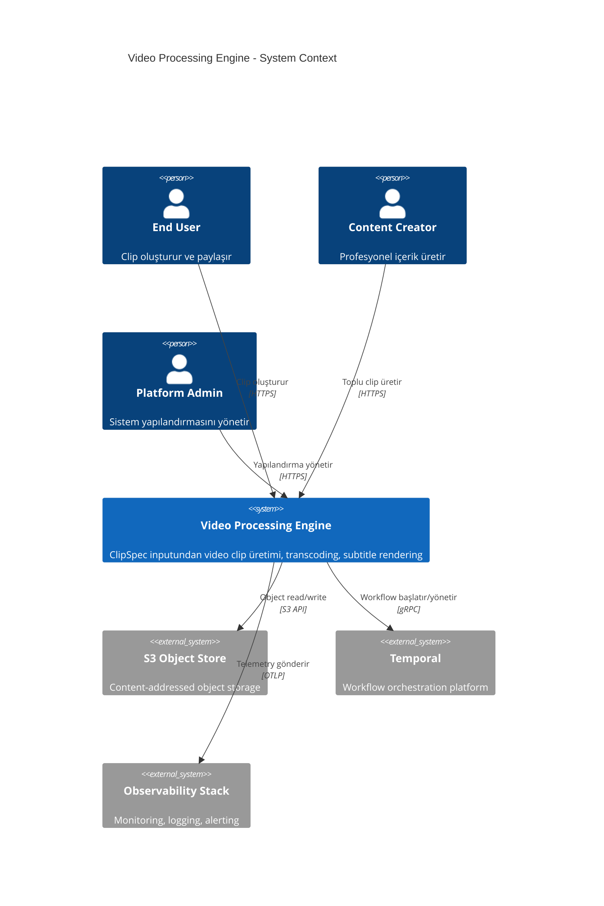

---

## 3. Fonksiyonel Gereksinimler

### 3.1 Clip Oluşturma

| ID | Gereksinim | Öncelik |
|----|------------|---------|
| FR-001 | Sistem, ClipSpec JSON inputu ile video clip oluşturabilmelidir | P0 |
| FR-002 | ClipSpec geçerliliği Pydantic v2 ile API request zamanında doğrulanmalıdır | P0 |
| FR-003 | Tek bir clip oluşturma isteği 10 saniye içinde kabul edilmeli (202 Accepted) | P0 |
| FR-004 | Clip oluşturma workflow'u Temporal ile orchestrate edilmelidir | P0 |
| FR-005 | Her clip job'ı benzersiz bir `job_id` (UUID v7) ile izlenebilmelidir | P0 |
| FR-006 | Job durumu real-time olarak API üzerinden sorgulanabilmelidir | P0 |
| FR-007 | Job durumu WebSocket/SSE ile push olarak bildirilebilmelidir | P1 |
| FR-008 | Toplu clip oluşturma (batch) desteği sağlanmalıdır | P1 |
| FR-009 | Clip oluşturma iptal edilebilmelidir (cancel request) | P1 |
| FR-010 | Clip oluşturma retry edilebilmelidir (idempotent retry) | P0 |

### 3.2 Video Rendering

| ID | Gereksinim | Öncelik |
|----|------------|---------|
| FR-011 | FFmpeg 7.x tabanlı rendering yapılmalıdır | P0 |
| FR-012 | H.264, H.265, VP9, AV1 codec desteği sağlanmalıdır | P0 |
| FR-013 | Hardware-accelerated encoding (NVENC, VAAPI, DXVA) desteklenmelidir | P1 |
| FR-014 | Aşağıdaki resolution/mesafe ladder desteklenmelidir: 360p, 480p, 720p, 1080p, 1440p, 4K | P0 |
| FR-015 | Variable Bitrate (VBR) ve Constant Bitrate (CBR) encoding modu desteklenmelidir | P0 |
| FR-016 | Two-pass encoding desteği sağlanmalıdır | P1 |
| FR-017 | HDR-to-SDR tone mapping desteklenmelidir | P2 |
| FR-018 | Crop, pad, scale, rotate, overlay transformları desteklenmelidir | P0 |

### 3.3 Subtitle Rendering

| ID | Gereksinim | Öncelik |
|----|------------|---------|
| FR-019 | ASS ve SRT formatlarında subtitle burn-in desteklenmelidir | P0 |
| FR-020 | Custom font desteği (TTF/OTF) sağlanmalıdır | P0 |
| FR-021 | HarfBuzz shaping ile Unicode/multilingual text desteği olmalıdır | P0 |
| FR-022 | Subtitle animasyonları (fade, karaoke, scroll) desteklenmelidir | P1 |
| FR-023 | RTL (right-to-left) script desteği olmalıdır | P1 |
| FR-024 | Subtitle positioning (margin, alignment, overrides) desteklenmelidir | P0 |

### 3.4 Ses İşleme

| ID | Gereksinim | Öncelik |
|----|------------|---------|
| FR-025 | 48kHz float32 ses formatında işleme yapılmalıdır | P0 |
| FR-026 | AAC, Opus, FLAC, PCM codec desteği olmalıdır | P0 |
| FR-027 | Multi-channel surround (5.1, 7.1) desteklenmelidir | P2 |
| FR-028 | Audio normalization (loudness) desteği olmalıdır | P1 |
| FR-029 | Ses-video senkronizasyonu sample-accurate olmalıdır | P0 |
| FR-030 | Silence detection ve insertion desteklenmelidir | P2 |

### 3.5 Thumbnail / Poster

| ID | Gereksinim | Öncelik |
|----|------------|---------|
| FR-031 | Video duration'a göre otomatik poster üretimi olmalıdır | P1 |
| FR-032 | Custom timestamp ile poster extraction desteklenmelidir | P1 |
| FR-033 | Output formatları: JPEG, WebP, PNG desteklenmelidir | P1 |
| FR-034 | Multi-resolution poster ladder oluşturulabilmelidir | P2 |

### 3.6 Storage ve Content Addressing

| ID | Gereksinim | Öncelik |
|----|------------|---------|
| FR-035 | Tüm output'lar content-addressed (SHA-256) olarak saklanmalıdır | P0 |
| FR-036 | Duplicate content otomatik olarak deduplicate edilmelidir | P0 |
| FR-037 | Pre-signed URL ile time-limited erişim sağlanmalıdır | P0 |
| FR-038 | S3 lifecycle policy ile tiered storage desteklenmelidir | P1 |
| FR-039 | Local NVMe scratch disk temporary processing için kullanılmalıdır | P0 |

### 3.7 Workflow ve Durum Yönetimi

| ID | Gereksinim | Öncelik |
|----|------------|---------|
| FR-040 | Temporal workflow ile stateful orchestration yapılmalıdır | P0 |
| FR-041 | Workflow state machine: PENDING → VALIDATING → PLANNING → RENDERING → COMPOSITING → COMPLETE/FAILED | P0 |
| FR-042 | Her activity retry policy ile tanımlanmalıdır (max_attempts, backoff) | P0 |
| FR-043 | Workflow cancellation ve heartbeat desteği olmalıdır | P0 |
| FR-044 | Workflow versioning ve migration desteği olmalıdır | P1 |
| FR-045 | Workflow search attribute ile filtereleme desteklenmelidir | P1 |

---

## 4. Non-Fonksiyonel Gereksinimler ve SLO'lar

### 4.1 SLO Tablosu

| Metrik | Hedef | Ölçüm Metodu | Tolere Edilen Hata |
|--------|-------|-------------|-------------------|
| **API Availability** | %99.9 (8.76h/yıl downtime) | Health check probe | Monthly error budget: 43.2 dk |
| **Clip Creation Latency (P50)** | ≤ 30 saniye (1080p, 60sn clip) | End-to-end trace | — |
| **Clip Creation Latency (P99)** | ≤ 120 saniye | End-to-end trace | — |
| **API Response Time (P50)** | ≤ 50 ms | HTTP request duration | — |
| **API Response Time (P99)** | ≤ 200 ms | HTTP request duration | — |
| **Throughput** | ≥ 500 concurrent render jobs | Temporal task queue depth | — |
| **Data Durability** | 99.999999999% (11 nines) | S3 + PostgreSQL replication | — |
| **Recovery Time (RTO)** | ≤ 5 dakika | Failover drill | — |
| **Recovery Point (RPO)** | ≤ 1 dakika | WAL replication lag | — |
| **Render Error Rate** | ≤ 0.1% | Failed jobs / total jobs | — |
| **Cold Start (Worker)** | ≤ 10 saniye | Pod ready time | — |
| **Queue Wait Time** | ≤ 5 saniye (P95) | Temporal schedule-to-start | — |

### 4.2 Performance Gereksinimleri

| Gereksinim | Detay |
|------------|-------|
| **Concurrent Renders** | Minimum 500, hedef 2000 parallel render job |
| **Encoding Throughput** | H.264: ≥ 4x real-time (1080p), H.265: ≥ 2x real-time |
| **Memory per Worker** | ≤ 4GB RAM per concurrent render (CPU), ≤ 8GB (GPU) |
| **Storage I/O** | Scratch NVMe: ≥ 2GB/s read, ≥ 1GB/s write |
| **Network I/O** | S3 transfer: ≥ 1Gbps per worker |

### 4.3 Ölçeklenebilirlik Gereksinimleri

| Metrik | Mevcut | Hedef |
|--------|--------|-------|
| Worker Instances | 3-5 | Auto-scale: 10-200 |
| API Instances | 1 | Auto-scale: 3-20 |
| Database Connections | 20 | 200 (connection pooling) |
| Redis Memory | 1GB | 16GB (cluster mode) |
| S3 Bucket Count | 1 | Multi-bucket (per-region) |

### 4.4 Güvenlik Gereksinimleri

| Gereksinim | Standart |
|------------|----------|
| Encryption at rest | AES-256 (S3 SSE-KMS) |
| Encryption in transit | TLS 1.3 |
| Secret rotation | 90 gün otomatik rotasyon |
| Access control | RBAC + tenant isolation |
| Audit logging | Tüm write operasyonları loglanır |
| Compliance | KVKK (Turkish DPA) uyumluluğu |

### 4.5 Observability Gereksinimleri

| Gereksinim | Hedef |
|------------|-------|
| Trace sampling | 100% hatalı istekler, %10 başarılı istekler |
| Metric cardinality | ≤ 10,000 time series |
| Log retention | 30 gün hot, 1 yıl cold |
| Alert response time | ≤ 5 dakika (P1), ≤ 15 dakika (P2) |
| Dashboard refresh | ≤ 15 saniye |

---

## 5. Mimari İlkeler

### 5.1 Temel İlkeler

#### 5.1.1 Determinism (Belirlenilik)

Aynı ClipSpec, aynı kod versiyonu, aynı kaynak dosyalar ile her çalıştırma aynı output'u üretmelidir.

- FFmpeg parametreleri tam olarak belirlenmelidir (seed-based randomness hariç)
- Timestamp'ler rational time ile ifade edilmelidir (framerate bağımlılığı yok)
- Font rendering deterministic olmalıdır (font hash, layout cache)

#### 5.1.2 Idempotency (Eşdeğerlik)

Her operasyon birden fazla kez çalıştırılabilir ve aynı sonucu üretmelidir.

- Job submission idempotent olmalıdır (`idempotency_key` field)
- S3 write operations content-addressed olduğundan natural idempotency sağlar
- Temporal workflow replay mekanizması built-in idempotency sağlar

#### 5.1.3 Content Addressing (İçerik Adresleme)

Tüm persistent object'lar içeriğinin hash'i ile adreslenmelidir.

```
s3://content/{tenant_id}/blobs/{sha256_hex[:2]}/{sha256_hex}.{ext}
```

- Identical content tek bir physical object olarak saklanır (deduplication)
- Object integrity hash ile verify edilir
- Cache keys content hash-based olur (cache invalidation problem'i ortadan kalkar)

#### 5.1.4 Explicit Contracts (Açık Sözleşmeler)

Bileşenler arası iletişim tam olarak belgelenmiş JSON Schema / Pydantic model ile tanımlanmalıdır.

- ClipSpec → RenderPlan: Pydantic v2 model ile contract
- RenderPlan → FFmpeg args: Deterministic template rendering
- API request/response: OpenAPI 3.1 specification
- Temporal workflow/activity input/output: Type-hint based contract

### 5.2 Ek İlkeler

| İlke | Açıklama |
|------|----------|
| **Defense in Depth** | Her katmanda validasyon: API → Workflow → Activity → FFmpeg |
| **Fail-Fast** | Invalid input mümkün olan en erken noktada reddedilmelidir |
| **Observable by Default** | Tüm bileşenler structured logging ve tracing output'u üretmelidir |
| **Zero-Downtime Deploy** | Blue-green / canary deployment, workflow versioning |
| **Least Privilege** | Her bileşen sadece ihtiyacı olan kaynaklara erişebilmelidir |
| **Stateless Services** | API ve Worker instance'ları stateless olmalıdır; state PostgreSQL/Redis/S3'te |

### 5.3 Mimari Karar Kayıtları

| Karar | Seçim | Alternatifler | Gerekçe |
|-------|-------|--------------|---------|
| Runtime | Python 3.12 | Go, Rust, Node.js | Ekosistem, FFmpeg bindings, fast development |
| Web Framework | FastAPI | Django, Flask, Starlette | Async support, Pydantic v2 native, OpenAPI |
| Validation | Pydantic v2 | Marshmallow, attrs, jsonschema | Performance, type safety, JSON Schema export |
| Workflow Engine | Temporal | Celery, Airflow, Prefect | Stateful orchestration, replay, versioning |
| Primary DB | PostgreSQL 16 | MySQL, CockroachDB | ACID, JSONB, full-text search, mature ecosystem |
| Cache/Queue | Redis 7 | RabbitMQ, Kafka | Sub-ms latency, pub/sub, data structures |
| Object Storage | S3 | MinIO, GCS, Azure Blob | De facto standard, lifecycle policies, durability |
| Subtitle Engine | libass + HarfBuzz + FreeType | Pango, Cairo | ASS spec compliance, performance, ICU integration |
| Video Processing | FFmpeg 7.x | GStreamer, AVFoundation | Codec breadth, hardware accel, community |
| Observability | OTel + Prometheus + Loki | Datadog, New Relic | Vendor-agnostic, cost, self-hosted |

---

## 6. Control Plane Bileşenleri

### 6.1 FastAPI Application

#### 6.1.1 Sorumluluklar

- HTTP/REST API endpoint'leri sunma
- Request validation (Pydantic v2)
- Authentication ve authorization
- Rate limiting (tenant bazlı)
- Job submission ve status query
- WebSocket/SSE push notifications

#### 6.1.2 Teknik Özellikler

```python
# FastAPI application configuration
# Python 3.12, Pydantic v2, async/await

from fastapi import FastAPI
from pydantic import BaseModel, Field

class ClipSpec(BaseModel):
    """Clip specification input model."""
    clip_id: str = Field(..., description="Benzersiz clip tanımlayıcı")
    title: str = Field(..., max_length=256)
    duration: float = Field(..., gt=0, le=3600)  # max 1 saat
    width: int = Field(..., ge=320, le=3840)
    height: int = Field(..., ge=240, le=2160)
    fps: str = Field(..., pattern=r"^\d+/\d+$")  # rational time
    codec: str = Field(..., pattern=r"^(h264|h265|vp9|av1)$")
    layers: list[LayerSpec]
    audio: AudioSpec
    subtitle: SubtitleSpec | None = None
    output: OutputSpec

class RenderPlan(BaseModel):
    """Internal render plan generated from ClipSpec."""
    plan_id: str
    clip_spec_hash: str  # SHA-256 of normalized ClipSpec
    ffprobe_reports: list[FFprobeReport]
    filter_graph: str
    encode_params: EncodeParams
    estimated_duration: float
    estimated_storage_bytes: int
    worker_constraints: WorkerConstraints
```

#### 6.1.3 Endpoint Yapısı

| Endpoint | Method | Açıklama |
|----------|--------|----------|
| `/api/v1/clips` | POST | Yeni clip job oluştur |
| `/api/v1/clips/{job_id}` | GET | Job durumu sorgula |
| `/api/v1/clips/{job_id}` | DELETE | Job iptal et |
| `/api/v1/clips/{job_id}/events` | GET (SSE) | Real-time durum akışı |
| `/api/v1/clips/{job_id}/render-plan` | GET | Render plan detayı |
| `/api/v1/clips/batch` | POST | Toplu clip oluşturma |
| `/api/v1/health` | GET | Health check |
| `/api/v1/metrics` | GET | Prometheus metrics |

### 6.2 Temporal

#### 6.2.1 Neden Temporal?

Mevcut Celery yapısının sınırlamaları:

| Problem | Celery Davranışı | Temporal Çözümü |
|---------|------------------|-----------------|
| Workflow state tracking | External DB required | Built-in state machine |
| Long-running operations | Heartbeat hack | Native heartbeat + timeout |
| Multi-step orchestration | Chain/Chord (fragile) | Deterministic replay |
| Versioning | Manual, error-prone | Versioned workflows |
| Failure recovery | Manual retry logic | Automatic replay |
| Observability | Third-party tools | Built-in history |

#### 6.2.2 Workflow Tanımı

```
ClipProcessingWorkflow:
  State: PENDING → VALIDATING → PLANNING → RENDERING → COMPOSITING → COMPLETE
                                              ↓
                                            FAILED (retryable)

  Activities:
    1. ValidateClipSpec       - Input validasyonu, ffprobe analizi
    2. GenerateRenderPlan     - ClipSpec → Plan dönüşümü
    3. ResolveAssets          - Asset'leri S3'ten resolve et, scratch'e kopyala
    4. RenderVideo            - FFmpeg ile video rendering
    5. RenderAudio            - FFmpeg ile ses rendering
    6. RenderSubtitle         - libass ile subtitle burn-in
    7. MuxStreams             - Video + Audio + Subtitle mux
    8. TranscodeOutput       - Hedef codec/mesafe ladder encode
    9. GenerateThumbnail      - Poster/thumbnail üretimi
    10. UploadToStorage       - S3'e content-adresli upload
    11. CleanupScratch        - NVMe scratch temizliği
    12. NotifyCompletion      - Completion callback/WebSocket
```

#### 6.2.3 Temporal Task Queue'ları

| Queue | Worker Type | Concurrent | Öncelik |
|-------|------------|------------|---------|
| `clip-validation` | CPU | 100 | High |
| `clip-rendering-cpu` | CPU | 200 | Normal |
| `clip-rendering-nvidia` | NVIDIA GPU | 50 | Normal |
| `clip-rendering-vaapi` | Intel VAAPI | 50 | Normal |
| `clip-rendering-dxva` | DirectX | 30 | Normal |
| `clip-compositing` | CPU | 100 | Normal |
| `clip-upload` | CPU | 100 | Low |
| `clip-cleanup` | CPU | 50 | Low |

### 6.3 PostgreSQL

#### 6.3.1 Şema Tasarımı

```sql
-- Tenant tablosu
CREATE TABLE tenants (
    tenant_id UUID PRIMARY KEY DEFAULT gen_random_uuid(),
    name VARCHAR(255) NOT NULL,
    plan VARCHAR(50) NOT NULL DEFAULT 'free',
    max_concurrent_jobs INTEGER NOT NULL DEFAULT 10,
    max_storage_bytes BIGINT NOT NULL DEFAULT 10737418240,  -- 10GB
    created_at TIMESTAMPTZ NOT NULL DEFAULT NOW(),
    updated_at TIMESTAMPTZ NOT NULL DEFAULT NOW()
);

-- Clip job tablosu
CREATE TABLE clip_jobs (
    job_id UUID PRIMARY KEY DEFAULT gen_random_uuid(),
    tenant_id UUID NOT NULL REFERENCES tenants(tenant_id),
    clip_spec JSONB NOT NULL,
    clip_spec_hash VARCHAR(64) NOT NULL,  -- SHA-256
    render_plan JSONB,
    status VARCHAR(50) NOT NULL DEFAULT 'pending',
    progress NUMERIC(5,2) DEFAULT 0,
    worker_id VARCHAR(255),
    temporal_workflow_id VARCHAR(255),
    temporal_run_id VARCHAR(255),
    idempotency_key VARCHAR(255) UNIQUE,
    error_message TEXT,
    retry_count INTEGER DEFAULT 0,
    created_at TIMESTAMPTZ NOT NULL DEFAULT NOW(),
    started_at TIMESTAMPTZ,
    completed_at TIMESTAMPTZ,
    metadata JSONB DEFAULT '{}'
);

-- Render output tablosu
CREATE TABLE render_outputs (
    output_id UUID PRIMARY KEY DEFAULT gen_random_uuid(),
    job_id UUID NOT NULL REFERENCES clip_jobs(job_id),
    tenant_id UUID NOT NULL REFERENCES tenants(tenant_id),
    codec VARCHAR(50) NOT NULL,
    width INTEGER NOT NULL,
    height INTEGER NOT NULL,
    bitrate_kbps INTEGER NOT NULL,
    file_size_bytes BIGINT NOT NULL,
    content_hash VARCHAR(64) NOT NULL,  -- SHA-256
    s3_key VARCHAR(1024) NOT NULL,
    duration_seconds NUMERIC(10,3) NOT NULL,
    created_at TIMESTAMPTZ NOT NULL DEFAULT NOW()
);

-- İndeksler
CREATE INDEX idx_clip_jobs_tenant_status ON clip_jobs(tenant_id, status);
CREATE INDEX idx_clip_jobs_created ON clip_jobs(created_at DESC);
CREATE INDEX idx_clip_jobs_idempotency ON clip_jobs(idempotency_key);
CREATE INDEX idx_render_outputs_job ON render_outputs(job_id);
CREATE INDEX idx_render_outputs_hash ON render_outputs(content_hash);
```

#### 6.3.2 Replikasyon

- Primary → Hot Standby (async replication, lag ≤ 1s)
- Read replicas for analytics queries
- Connection pooling: PgBouncer (transaction mode, max 200 connections)

### 6.4 Redis

#### 6.4.1 Kullanım Alanları

| Kullanım | Key Pattern | TTL | Purpose |
|----------|-------------|-----|---------|
| Job status cache | `job:{job_id}:status` | 5 dk | Hot status reads |
| Render plan cache | `plan:{plan_hash}` | 1 saat | Dedup render plans |
| Rate limiting | `ratelimit:{tenant_id}:{endpoint}` | 1 dk sliding window | API rate limit |
| Worker heartbeat | `worker:{worker_id}:heartbeat` | 30 saniye | Worker health tracking |
| S3 presigned URL cache | `presign:{object_hash}` | 15 dk | Avoid regenerating URLs |
| Lock (distributed) | `lock:{resource_id}` | 30 saniye | Distributed locking |
| Pub/Sub events | `events:job:{job_id}` | — | Real-time push notifications |

#### 6.4.2 Konfigürasyon

```
Redis Cluster: 6 node (3 primary + 3 replica)
Memory: 16GB total (8GB per shard)
Eviction: allkeys-lru
Persistence: RDB + AOF (everysec)
```

---

## 7. Data Plane Bileşenleri

### 7.1 FFmpeg Workers

#### 7.1.1 Worker Tipleri

| Worker Type | Hardware | Codec Capabilities | Queue | Scale Range |
|-------------|----------|-------------------|-------|-------------|
| **CPU Worker** | 8+ cores, 16GB RAM | All codecs (software) | `clip-rendering-cpu` | 10-200 |
| **NVIDIA Worker** | NVIDIA GPU (Turing+) | H.264 NVENC, H.265 NVENC, AV1 NVENC | `clip-rendering-nvidia` | 2-50 |
| **VAAPI Worker** | Intel GPU (Gen 9+) | H.264 VAAPI, H.265 VAAPI | `clip-rendering-vaapi` | 2-50 |
| **DXVA Worker** | DirectX 12 GPU | H.264 DXVA, H.265 DXVA | `clip-rendering-dxva` | 2-30 |

#### 7.1.2 FFmpeg Konfigürasyonu

```
FFmpeg version: 7.x (latest stable)
Build flags:
  --enable-libass         # ASS subtitle rendering
  --enable-libfreetype    # Font rendering
  --enable-libharfbuzz    # Text shaping
  --enable-libfdk-aac     # AAC encoding
  --enable-libopus        # Opus encoding
  --enable-libvpx         # VP8/VP9
  --enable-libsvtav1      # SVT-AV1 encoder
  --enable-nvenc          # NVIDIA encoding
  --enable-vaapi          # Intel VAAPI
  --enable-lcms2          # Color management
  --enable-libzimg        # zscale resampling
```

#### 7.1.3 Worker Lifecycle

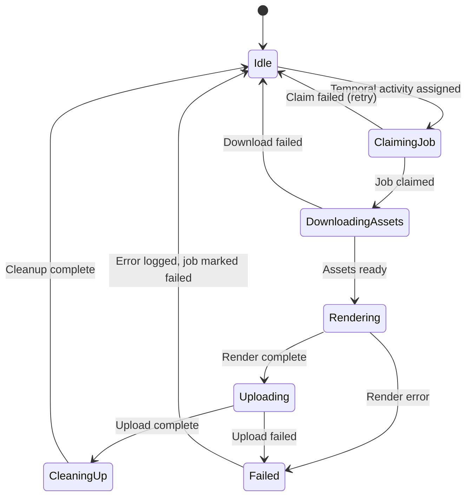

### 7.2 GPU Queues

#### 7.2.1 Queue Priority

| Priority | Queue | Kullanım |
|----------|-------|----------|
| Critical | `clip-validation` | Input validasyon, ffprobe |
| High | `clip-rendering-nvidia` | GPU-accelerated rendering |
| Normal | `clip-rendering-cpu` | CPU rendering (default) |
| Normal | `clip-rendering-vaapi` | Intel GPU rendering |
| Low | `clip-rendering-dxva` | DirectX rendering |
| Low | `clip-compositing` | Post-processing, overlay |
| Lowest | `clip-cleanup` | Scratch disk temizliği |

#### 7.2.2 Backpressure Mekanizması

```
Queue depth threshold'ları:
  - Normal: queue_depth ≤ 100 (devam et)
  - Warning: queue_depth 100-500 (yeni worker scale up tetikle)
  - Critical: queue_depth > 500 (reject incoming, alert tetikle)
  - Emergency: queue_depth > 1000 (circuit breaker open)
```

### 7.3 S3 Object Store

#### 7.3.1 Bucket Organization

```
s3://
├── {tenant_id}/
│   ├── inputs/                    # Kullanıcı yüklediği dosyalar
│   │   └── {sha256_hex[:2]}/
│   │       └── {sha256_hex}.{ext}
│   ├── outputs/                   # Üretilen clip'ler
│   │   └── {sha256_hex[:2]}/
│   │       └── {sha256_hex}.mp4
│   ├── thumbnails/                # Thumbnail/poster dosyaları
│   │   └── {sha256_hex[:2]}/
│   │       └── {sha256_hex}.webp
│   └── temp/                      # Geçici dosyalar (lifecycle: 24h)
│       └── {job_id}/
│           └── ...
└── shared/                        # Tenant-agnostic paylaşılan kaynaklar
    ├── fonts/                     # Custom font dosyaları
    │   └── {font_hash}.ttf
    ├── luts/                      # Color lookup tables
    │   └── {lut_hash}.cube
    └── templates/                 # Subtitle/overlay şablonları
        └── {template_hash}.ass
```

#### 7.3.2 Lifecycle Policies

| Tier | Storage Class | Transition | Expiration |
|------|--------------|------------|------------|
| Hot | STANDARD | — | — |
| Warm | STANDARD_IA | 30 gün | 90 gün |
| Cold | GLACIER | 90 gün | 365 gün |
| Deleted | — | — | Immediate (soft delete 7 gün) |

### 7.4 NVMe Scratch Disk

#### 7.4.1 Özellikler

- **Boyut:** 500GB - 2TB per worker pod
- **Perf:** ≥ 2GB/s sequential read, ≥ 1GB/s sequential write
- **Kullanım:** Intermediate render dosyaları, frame buffers
- **Lifecycle:** Job başında mount, job sonunda cleanup
- **Isolation:** Per-job temp directory (`/scratch/{job_id}/`)

#### 7.4.2 Scratch Disk Layout

```
/scratch/
└── {job_id}/
    ├── input/                    # Resolve edilmiş input dosyaları
    │   ├── video/
    │   ├── audio/
    │   └── subtitle/
    ├── intermediate/             # Ara render dosyaları
    │   ├── video_raw.h264
    │   ├── audio_raw.aac
    │   └── subtitle.ass.png
    ├── output/                   # Final output dosyaları
    │   ├── {codec}_{height}p.mp4
    │   └── poster.webp
    └── manifest.json             # Job metadata
```

---

## 8. End-to-End Data Flow

### 8.1 Ana Akış (Happy Path)

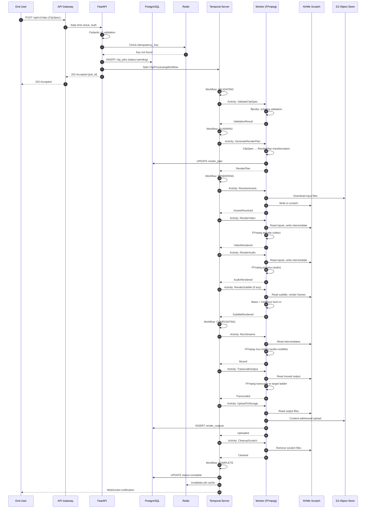

### 8.2 Hata Akışı (Error Path)

```mermaid
sequenceDiagram
    autonumber
    participant TS as Temporal Server
    participant W as Worker
    participant PG as PostgreSQL
    participant RD as Redis
    participant ALT as Alertmanager

    TS->>W: Activity: RenderVideo
    W->>W: FFmpeg error (codec not supported)
    W-->>TS: ActivityFailure(error)

    TS->>TS: Retry? (max_attempts: 3)
    alt Retry possible
        TS->>TS: Exponential backoff (1s, 4s, 16s)
        TS->>W: Activity: RenderVideo (attempt 2)
        W-->>TS: ActivitySuccess
    else Max retries exceeded
        TS->>PG: UPDATE status=failed, error_message
        TS->>RD: Publish job:failed event
        TS->>ALT: Fire alert (render_failure)
        TS-->>TS: Workflow: FAILED
    end
```

### 8.3 Veri Akış Özeti

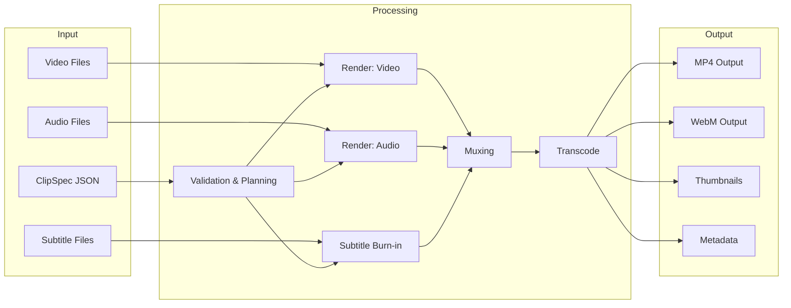

---

## 9. ClipSpec → RenderPlan Sözleşmesi

### 9.1 Neden İki Ayrı Model?

ClipSpec ve RenderPlan farklı amaçlara hizmet eder:

| Özellik | ClipSpec | RenderPlan |
|---------|----------|------------|
| **Oluşturan** | Kullanıcı (dış API) | Sistem (internal) |
| **Amaç** | Kullanıcı niyetini tanımlama | Teknik uygulama planı |
| **Seviye** | Abstract (what) | Concrete (how) |
| **Değişim sıklığı** | API değişimi ile | Engine değişimi ile |
| **Validation** | Pydantic v2 (API katmanında) | Internal validation (workflow katmanında) |
| **Example** | `"codec": "h265"` | `"ffmpeg_args": ["-c:v", "libx265", "-preset", "medium", ...]` |

### 9.2 ClipSpec (Dış Sözleşme)

```python
class ClipSpec(BaseModel):
    """Kullanıcının tanımladığı clip spesifikasyonu."""
    model_config = ConfigDict(frozen=True)  # immutable

    clip_id: str
    title: str = Field(max_length=256)
    duration: float = Field(gt=0, le=3600)
    width: int = Field(ge=320, le=3840)
    height: int = Field(ge=240, le=2160)
    fps: str = Field(pattern=r"^\d+/\d+$")
    pixel_format: str = Field(default="yuv420p")
    codec: str = Field(pattern=r"^(h264|h265|vp9|av1)$")
    layers: list[LayerSpec]
    audio: AudioSpec
    subtitle: SubtitleSpec | None = None
    output: OutputSpec
    metadata: dict[str, str] = Field(default_factory=dict)

class LayerSpec(BaseModel):
    """Tek bir katman (görsel, metin, overlay)."""
    type: str = Field(pattern=r"^(image|video|text|solid)$")
    source: str | None = None
    start_time: str | None = None
    end_time: str | None = None
    position: PositionSpec | None = None
    transform: TransformSpec | None = None
    style: StyleSpec | None = None

class AudioSpec(BaseModel):
    """Ses spesifikasyonu."""
    codec: str = Field(pattern=r"^(aac|opus|flac|pcm)$")
    sample_rate: int = Field(default=48000)
    channels: int = Field(ge=1, le=8)
    bitrate: int | None = None
    normalization: NormalizationSpec | None = None

class SubtitleSpec(BaseModel):
    """Subtitle spesifikasyonu."""
    format: str = Field(pattern=r"^(ass|srt)$")
    source: str | None = None
    text: str | None = None
    style: SubtitleStyleSpec | None = None

class OutputSpec(BaseModel):
    """Çıktı spesifikasyonu."""
    formats: list[OutputFormat]
    thumbnails: list[ThumbnailSpec] | None = None
```

### 9.3 RenderPlan (İç Sözleşme)

```python
class RenderPlan(BaseModel):
    """Internal render plan — ClipSpec'in teknik karşılığı."""
    model_config = ConfigDict(frozen=True)

    plan_id: str
    clip_spec_hash: str  # SHA-256 of normalized ClipSpec
    version: str  # Plan versiyonu (engine değişimi ile)

    # FFmpeg probe results
    ffprobe_reports: list[FFprobeReport]

    # Render configuration
    filter_graph: str  # FFmpeg filter graph string
    video_encode_args: list[str]  # FFmpeg video encode arguments
    audio_encode_args: list[str]  # FFmpeg audio encode arguments
    subtitle_encode_args: list[str] | None  # Subtitle args (if burn-in)

    # Worker requirements
    worker_constraints: WorkerConstraints
    # - required_hardware: cpu | nvidia | vaapi | dxva
    # - min_cpu_cores: int
    # - min_memory_gb: float
    # - required_gpu_model: str | None
    # - required_codecs: list[str]

    # Estimated resource usage
    estimated_duration: float  # seconds
    estimated_storage_bytes: int
    estimated_peak_memory_bytes: int

    # Content addressing
    input_content_hashes: dict[str, str]  # filename -> SHA-256
    output_content_hash_seeds: dict[str, str]  # output_name -> seed

    # Ladder (multiple outputs)
    output_ladder: list[OutputLadderEntry]

class WorkerConstraints(BaseModel):
    """Worker resource requirements."""
    required_hardware: Literal["cpu", "nvidia", "vaapi", "dxva"]
    min_cpu_cores: int = Field(ge=1)
    min_memory_gb: float = Field(gt=0)
    required_gpu_model: str | None = None
    required_codecs: list[str] = Field(default_factory=list)
    preferred_queue: str | None = None

class OutputLadderEntry(BaseModel):
    """Single entry in the encoding ladder."""
    name: str
    codec: str
    profile: str
    level: str
    width: int
    height: int
    fps: str
    bitrate_kbps: int
    max_bitrate_kbps: int
    buffer_size_kbps: int
    pixel_format: str
    encoder_settings: dict[str, str | int | float]
```

### 9.4 Dönüşüm Kuralları

```
ClipSpec → RenderPlan dönüşümü:

1. ClipSpec normalize (canonical JSON ordering, whitespace removal)
2. SHA-256 hash hesapla (clip_spec_hash)
3. Mevcut RenderPlan cache'de ara (RD: plan:{hash})
4. Cache miss ise:
   a. ffprobe ile input analizi
   b. Codec/mesafe/ladder matrix lookup
   c. Filter graph construction
   d. FFmpeg args generation
   e. Worker constraint determination
   f. Resource estimation
   g. Output content hash seed generation
5. RenderPlan'ı cache'e yaz
6. RenderPlan'ı PostgreSQL'e kaydet
```

### 9.5 Invariants (Değişmezler)

| Invariant | Açıklama |
|-----------|----------|
| **INV-01** | ClipSpec değişmezliği: Frozen Pydantic model, hash ile doğrulanır |
| **INV-02** | RenderPlan determinism: Aynı ClipSpec → her zaman aynı RenderPlan |
| **INV-03** | Content hash seed'leri clip_spec_hash'ten türetilir |
| **INV-04** | Output ladder'daki her entry独立 bir encode işlemi temsil eder |
| **INV-05** | Worker constraint'ler minimum gereksinimleri tanımlar (over-provisioning serbest) |
| **INV-06** | Filter graph valid FFmpeg syntax olmalıdır (build-time validation) |
| **INV-07** | RenderPlan version bump, engine compatibility change ile yapılır |

---

## 10. Zaman Tabanı

### 10.1 Temel Kavramlar

#### 10.1.1 PTS (Presentation Time Stamp)

- Frame'in ekranda görüntülenme zamanı
- Rendering sırasında sıralama referansı
- Rational time format: `pts = num / den` (örn. `1/30` saniye @ 30fps)

#### 10.1.2 DTS (Decode Time Stamp)

- Frame'in decode edilme zamanı
- B-frame kullanımı durumunda PTS'ten farklı olabilir
- FFmpeg encoding sırasında otomatik hesaplanır

#### 10.1.3 Rational Time

```
Tüm zaman değerleri rational time (rasyonel sayı) olarak ifade edilir:
  time_seconds = numerator / denominator

Örnek:
  30fps frame interval: 1/30 = 0.0333... saniye
  24000/1001 fps: 1001/24000 = 0.0417... saniye

ClipSpec fps alanı: "30/1" veya "24000/1001" formatında
```

#### 10.1.4 VFR (Variable Frame Rate) vs CFR (Constant Frame Rate)

| Özellik | VFR | CFR |
|---------|-----|-----|
| Frame interval | Değişken | Sabit |
| Kullanım alanları | Screen recording, phone video | Broadcast, streaming |
| Encoding zorluğu | Yüksek (timestamp mapping) | Düşük |
| File size | Daha küçük | Daha büyük |
| Engine tercihi | Desteklenir (girdi) | Tercih edilen (çıkış) |

### 10.2 A/V Senkronizasyon

#### 10.2.1 Senkronizasyon Kuralları

| Kural | Açıklama |
|-------|----------|
| **Master clock** | Audio stream master clock olarak kullanılır |
| **Video offset** | Video PTS, audio master clock'a göre adjust edilir |
| **Max drift** | ±45ms tolerans (broadcast standardı) |
| **Lip sync** | ±20ms tolerans (konuşma senkronu) |
| **Resync threshold** | Drift > 100ms ise otomatik resync |

#### 10.2.2 FFmpeg A/V Sync Parametreleri

```bash
# Video encoding with audio-sync
ffmpeg \
  -i input.mp4 \
  -video_track_timescale 90000 \        # 90kHz timebase
  -af "aresample=async=1:first_pts=0" \  # Audio resampling sync
  -fflags +genpts \                      # Generate PTS if missing
  -vsync cfr \                           # Constant frame rate output
  -enc_timebase_pkt \                    # Packet-level timebase
  -c:v libx265 \
  -c:a aac \
  output.mp4
```

### 10.3 Timebase Hesaplama

```
Input timebase detection:
  1. ffprobe ile time_base oku
  2. Rational time olarak parse et
  3. Frame PTS'leri bu timebase'e göre normalize et

Output timebase seçimi:
  Video: 90000 (MPEG standard) veya fps * 1000
  Audio: 48000 (sample rate)

PTS mapping (input → output):
  output_pts = input_pts * (output_timebase / input_timebase)
```

---

## 11. Renk ve Piksel Modeli

### 11.1 Renk Pipeline Mimarisi

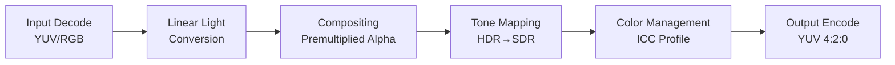

### 11.2 Linear Light Processing

#### 11.2.1 Neden Linear Light?

- Compositing (alpha blending, overlay, color adjustment) doğru sonuç vermek için linear light空间da yapılmalıdır
- sRGB gamma correction doğrusal olmayan bir transfer fonksiyonudur
- Gamma space'de yapılan blending = renk hatası

#### 11.2.2 Conversion Pipeline

```
Input (sRGB/Rec.709):
  1. Decode to linear light: pixel = srgb_to_linear(pixel)
  2. Process in linear space (compositing, color grading)
  3. Encode to output: output = linear_to_srgb(pixel)

FFmpeg implementation:
  -vf "zscale=t=linear,format=gbrpf32le,zscale=t=srgb"
  veya
  -vf "colorspace=all=linear"
```

### 11.3 Premultiplied Alpha

#### 11.3.1 Alpha Handling Modes

| Mod | Formül | Kullanım |
|-----|--------|----------|
| **Straight Alpha** | `rgba = (r, g, b, a)` | PNG input, Photoshop |
| **Premultiplied Alpha** | `rgba = (r*a, g*a, b*a, a)` | Compositing, After Effects |

#### 11.3.2 FFmpeg Alpha Handling

```bash
# Premultiplied alpha compositing
ffmpeg \
  -i background.mp4 \
  -i overlay.png \
  -filter_complex " \
    [1:v]format=rgba,unpremultiply[fg]; \
    [0:v][fg]overlay=0:0:format=auto" \
  output.mp4

# Straight alpha to premultiplied
-vf "format=rgba,premultiply"
```

### 11.4 Color Management

#### 11.4.1 Desteklenen Renk Uzayları

| Renk Uzayı | Transfer | Matrix | Primaries | Kullanım |
|------------|----------|--------|-----------|----------|
| **Rec.709** | bt709 | bt709 | bt709 | SDR video (default) |
| **Rec.2020** | pq | bt2020nc | bt2020 | HDR video |
| **Rec.2020** | hlg | bt2020nc | bt2020 | HLG HDR |
| **DCI-P3** | smpte2084 | smpte2086 | smpte431 | Cinema |
| **Display P3** | srgb | smpte2086 | smpte432 | Apple displays |
| **sRGB** | srgb | bt709 | bt709 | Web standard |

#### 11.4.2 ICC Profile Desteği

```
ICC Profile workflow:
  1. Input profile detection (media header, ICC tag)
  2. Conversion to working colorspace (linear Rec.709)
  3. Processing in working space
  4. Output profile application
  5. Profile embedding (if supported by container/codec)

FFmpeg flags:
  -color_primaries bt709
  -color_trc bt709
  -colorspace bt709
```

### 11.5 HDR/SDR Tone Mapping

#### 11.5.1 Tone Mapping Algorithms

| Algoritma | Özellik | Kullanım |
|-----------|---------|----------|
| **Hable** | Fast, good general purpose | Default SDR conversion |
| **Reinhard** | Simple, good for LDR | Low-complexity |
| **Mobius** | Better highlight rolloff | Broadcast |
| **BT.2390** | EETF standardı | HDR mastering |
| **Gaming** | Perceptual quantizer | Game content |

#### 11.5.2 FFmpeg Tone Mapping

```bash
# HDR to SDR tone mapping
ffmpeg \
  -i hdr_input.mp4 \
  -vf "zscale=t=linear:npl=100,format=gbrpf32le,\
zscale=p=709:t=709:m=709,\
tonemap=hable:desat=0,\
zscale=t=709" \
  -color_primaries bt709 \
  -color_trc bt709 \
  -colorspace bt709 \
  sdr_output.mp4
```

### 11.6 Piksel Format Matrisi

| Input Format | Working Format | Output Format | Not |
|-------------|---------------|---------------|-----|
| yuv420p | gbrpf32le (linear) | yuv420p | Default pipeline |
| yuv422p | gbrpf32le (linear) | yuv422p/420p | Broadcast input |
| yuv444p | gbrpf32le (linear) | yuv420p/444p | High quality input |
| rgb24 | gbrpf32le (linear) | yuv420p | PNG/RGB input |
| rgba | gbrpf32le (linear) | yuv420p+alpha | Alpha compositing |
| nv12 | gbrpf32le (linear) | yuv420p | Hardware decoded |

---

## 12. Ses Modeli

### 12.1 Temel Parametreler

| Parametre | Değer | Açıklama |
|-----------|-------|----------|
| **Sample Rate** | 48000 Hz | Broadcast standardı (44.1kHz dönüştürme zorunlu) |
| **Bit Depth** | 32-bit float (internal) | Intermediate processing |
| **Output Bit Depth** | 16-bit int / 24-bit int / 32-bit float | Codec-dependent |
| **Sample Format** | flt (float32) / s16 (int16) / s32 (int32) | FFmpeg sample_fmt |
| **Channel Layout** | Stereo (default), 5.1, 7.1 | Channel enum ile |

### 12.2 Channel Layout'ları

| Layout | FFmpeg Flag | Kanal Sayısı | Kullanım |
|--------|-------------|-------------|----------|
| **Mono** | `mono` | 1 | Voice-only |
| **Stereo** | `stereo` | 2 | Default |
| **Surround 5.1** | `5.1` | 6 | Cinema content |
| **Surround 7.1** | `7.1` | 8 | Premium content |

### 12.3 Sample-Accurate Processing

#### 12.3.1 Sample-Accurate Neden Önemli?

- Subtitle burn-in Timing: Audio position'a göre frame selection
- Audio editing: Cut, fade, splice operations
- Loudness normalization: Per-sample gain calculation

#### 12.3.2 FFmpeg Sample-Accurate Flags

```bash
# Sample-accurate audio processing
ffmpeg \
  -i input.mp4 \
  -af "aresample=async=1:first_pts=0,\
loudnorm=I=-16:TP=-1.5:LRA=11:print_format=json" \
  -c:a pcm_f32le \        # Float32 intermediate
  -ar 48000 \             # 48kHz
  -ac 2 \                 # Stereo
  audio_output.wav

# Sample-accurate cut
ffmpeg \
  -i input.mp4 \
  -ss 00:01:30.123456 \   # Precise seek (sample-level)
  -t 00:00:10.000000 \    # Precise duration
  -c:a copy \             # Stream copy (no re-encode)
  output.mp4
```

### 12.4 Ses Codec Matrisi

| Codec | Bitrate | Latency | Kullanım | FFmpeg Encoder |
|-------|---------|---------|----------|---------------|
| **AAC-LC** | 128-320 kbps | Medium | Default | libfdk_aac |
| **AAC-HE** | 64-128 kbps | Medium | Low bitrate | libfdk_aac -profile aac_he |
| **Opus** | 32-512 kbps | Ultra-low | WebRTC, low latency | libopus |
| **FLAC** | Lossless | High | Archival | flac |
| **PCM** | Uncompressed | None | Intermediate | pcm_s16le/pcm_f32le |

### 12.5 Audio Normalization (Loudness)

#### 12.5.1 Target Loudness Standards

| Standard | Target | True Peak | Kullanım |
|----------|--------|-----------|----------|
| **EBU R128** | -23 LUFS | -1 dBTP | Broadcast (EU) |
| **ITU-R BS.1770** | -24 LUFS | -2 dBTP | Broadcast (Global) |
| **AES Streaming** | -14 LUFS | -1 dBTP | Streaming platforms |
| **Podcast** | -16 LUFS | -1 dBTP | Podcast content |

#### 12.5.2 FFmpeg Loudness Normalization

```bash
# EBU R128 two-pass loudness normalization
# Pass 1: Measure
ffmpeg -i input.mp4 -af loudnorm=I=-23:TP=-1:LRA=7:print_format=json -f null - 2>&1

# Pass 2: Normalize (using measured values)
ffmpeg -i input.mp4 \
  -af "loudnorm=I=-23:TP=-1:LRA=7:\
measured_I=-18.5:measured_TP=-0.3:measured_LRA=11.2:measured_thresh=-28.7" \
  -c:a aac -b:a 192k \
  output.mp4
```

---

## 13. Güvenlik ve Multi-Tenancy

### 13.1 Secret Management

#### 13.1.1 Vault/KMS Entegrasyonu

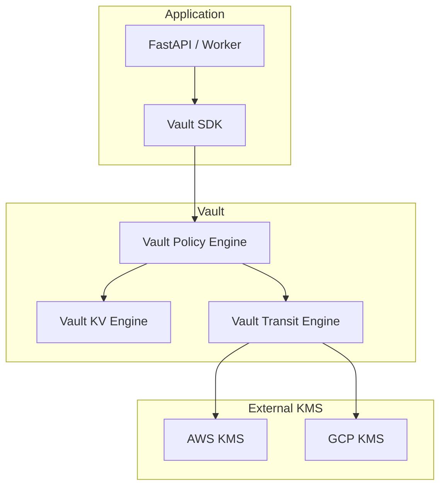

#### 13.1.2 Secret Kategorileri

| Kategori | Secret Type | Rotation | Erişim |
|----------|------------|----------|--------|
| **Database** | Username/Password | 30 gün | Vault KV |
| **S3 Access** | Access Key/Secret Key | 90 gün | Vault AWS |
| **API Keys** | Third-party API tokens | 90 gün | Vault KV |
| **Encryption Keys** | Data encryption keys | 365 gün | Vault Transit |
| **TLS Certificates** | X.509 certificates | 90 gün | Vault PKI |
| **Temporal** | Temporal auth tokens | 30 gün | Vault KV |

#### 13.1.3 Secret Access Pattern

```python
# Worker secret access pattern
class SecretManager:
    def get_database_credentials(self, tenant_id: str) -> DatabaseCredentials:
        """Vault path: secret/data/db/{tenant_id}"""
        ...

    def get_s3_credentials(self, tenant_id: str) -> S3Credentials:
        """Vault path: secret/data/s3/{tenant_id}"""
        ...

    def encrypt_data_key(self, plaintext: bytes) -> bytes:
        """Vault Transit: encrypt data encryption key"""
        ...

    def decrypt_data_key(self, ciphertext: bytes) -> bytes:
        """Vault Transit: decrypt data encryption key"""
        ...
```

### 13.2 Tenant Isolation

#### 13.2.1 İzolasyon Seviyeleri

| Seviye | Mekanizma | Açıklama |
|--------|-----------|----------|
| **Network** | Kubernetes NetworkPolicy | Tenant'lar arası network izolasyonu |
| **Compute** | ResourceQuota, LimitRange | CPU/memory limit per tenant |
| **Storage** | S3 prefix isolation | `{tenant_id}/` prefix ile physical separation |
| **Database** | Row-level security (RLS) | PostgreSQL RLS policies |
| **Queue** | Tenant-scoped routing | Worker'lar sadece kendi tenant'ının job'larını işler |
| **Cache** | Key prefix isolation | `tenant:{id}:job:{job_id}` pattern |

#### 13.2.2 PostgreSQL Row-Level Security

```sql
-- Tenant context setting
SET app.current_tenant = 'tenant_123';

-- RLS Policy
CREATE POLICY tenant_isolation ON clip_jobs
    USING (tenant_id = current_setting('app.current_tenant')::uuid);

ALTER TABLE clip_jobs ENABLE ROW LEVEL SECURITY;
ALTER TABLE render_outputs ENABLE ROW LEVEL SECURITY;
```

#### 13.2.3 Worker Tenant Routing

```python
class WorkerRouter:
    """Tenant-scoped job routing."""

    def claim_job(self, worker_id: str, tenant_id: str) -> RenderJob:
        """
        Worker sadece kendi yetkili olduğu tenant'ın job'larını claim eder.
        Temporal activity input'unda tenant_id validation yapılır.
        """
        ...
```

### 13.3 PII (Personally Identifiable Information) Yönetimi

#### 13.3.1 PII Kategorileri

| Kategori | Veri | Saklama | Silme |
|----------|------|---------|-------|
| **User Identity** | email, name | PostgreSQL (encrypted column) | Right to erasure |
| **Content** | Uploaded video/audio | S3 (tenant prefix) | Manual deletion |
| **Job Metadata** | Job parameters | PostgreSQL | 90 gün retention |
| **Logs** | Request logs | Loki | 30 gün retention |
| **Metrics** | Usage metrics | Prometheus | 1 yıl retention |

#### 13.3.2 Data Encryption

```
Encryption at rest:
  - S3: SSE-KMS (AES-256, per-tenant CMK)
  - PostgreSQL: Transparent Data Encryption (TDE)
  - Redis: Redis Cluster encryption

Encryption in transit:
  - API: TLS 1.3 enforced
  - Inter-service: mTLS (Istio service mesh)
  - Database: SSL/TLS required
```

### 13.4 API Authentication & Authorization

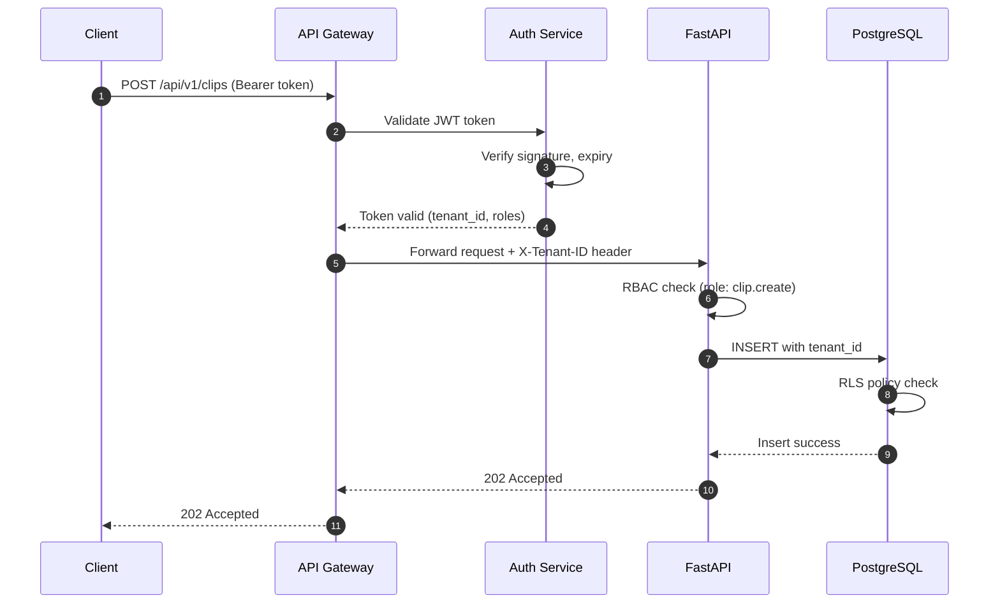

---

## 14. Dosya ve Klasör Organizasyonu

### 14.1 Proje Kök Dizin Yapısı

```
tuncay-klip/
├── apps/
│   ├── api/                         # FastAPI application
│   │   ├── app/
│   │   │   ├── __init__.py
│   │   │   ├── main.py              # FastAPI app factory
│   │   │   ├── config.py            # Settings (pydantic-settings)
│   │   │   ├── dependencies.py      # Dependency injection
│   │   │   ├── api/                 # Route handlers
│   │   │   │   ├── __init__.py
│   │   │   │   ├── v1/
│   │   │   │   │   ├── clips.py
│   │   │   │   │   ├── health.py
│   │   │   │   │   └── batch.py
│   │   │   │   └── router.py
│   │   │   ├── models/              # Pydantic models (request/response)
│   │   │   │   ├── __init__.py
│   │   │   │   ├── clip_spec.py
│   │   │   │   ├── render_plan.py
│   │   │   │   ├── job_status.py
│   │   │   │   └── common.py
│   │   │   ├── services/            # Business logic
│   │   │   │   ├── __init__.py
│   │   │   │   ├── clip_service.py
│   │   │   │   ├── render_service.py
│   │   │   │   └── storage_service.py
│   │   │   ├── repositories/        # Data access
│   │   │   │   ├── __init__.py
│   │   │   │   ├── clip_job_repo.py
│   │   │   │   └── tenant_repo.py
│   │   │   ├── middleware/           # Middleware
│   │   │   │   ├── __init__.py
│   │   │   │   ├── auth.py
│   │   │   │   ├── rate_limit.py
│   │   │   │   └── request_id.py
│   │   │   └── observability/        # Telemetry
│   │   │       ├── __init__.py
│   │   │       ├── tracing.py
│   │   │       └── metrics.py
│   │   ├── tests/
│   │   │   ├── unit/
│   │   │   ├── integration/
│   │   │   └── conftest.py
│   │   ├── Dockerfile
│   │   ├── pyproject.toml
│   │   └── alembic/                 # Database migrations
│   │       ├── env.py
│   │       └── versions/
│   │
│   └── worker/                      # Temporal Worker application
│       ├── app/
│       │   ├── __init__.py
│       │   ├── main.py              # Worker entrypoint
│       │   ├── config.py
│       │   ├── workflows/           # Temporal workflows
│       │   │   ├── __init__.py
│       │   │   ├── clip_processing.py
│       │   │   └── batch_processing.py
│       │   ├── activities/          # Temporal activities
│       │   │   ├── __init__.py
│       │   │   ├── validation.py
│       │   │   ├── planning.py
│       │   │   ├── rendering.py
│       │   │   ├── compositing.py
│       │   │   ├── upload.py
│       │   │   └── cleanup.py
│       │   ├── engines/             # Processing engines
│       │   │   ├── __init__.py
│       │   │   ├── ffmpeg_engine.py
│       │   │   ├── subtitle_engine.py
│       │   │   ├── audio_engine.py
│       │   │   └── thumbnail_engine.py
│       │   ├── models/              # Shared models
│       │   │   └── ... (shared with api)
│       │   └── observability/
│       │       ├── __init__.py
│       │       ├── tracing.py
│       │       └── metrics.py
│       ├── tests/
│       ├── Dockerfile
│       └── pyproject.toml
│
├── libs/                            # Shared libraries
│   ├── clip-spec/                   # ClipSpec Pydantic models
│   │   ├── pyproject.toml
│   │   └── src/
│   │       └── clip_spec/
│   │           ├── __init__.py
│   │           ├── spec.py
│   │           ├── validation.py
│   │           └── normalization.py
│   ├── render-plan/                 # RenderPlan models + generator
│   │   ├── pyproject.toml
│   │   └── src/
│   │       └── render_plan/
│   │           ├── __init__.py
│   │           ├── plan.py
│   │           ├── generator.py
│   │           └── codec_matrix.py
│   ├── ffmpeg-utils/                # FFmpeg helper functions
│   │   ├── pyproject.toml
│   │   └── src/
│   │       └── ffmpeg_utils/
│   │           ├── __init__.py
│   │           ├── probe.py
│   │           ├── filter_graph.py
│   │           ├── encoder.py
│   │           └── hw_accel.py
│   ├── subtitle-utils/              # Subtitle processing
│   │   ├── pyproject.toml
│   │   └── src/
│   │       └── subtitle_utils/
│   │           ├── __init__.py
│   │           ├── ass_parser.py
│   │           ├── srt_parser.py
│   │           ├── font_resolver.py
│   │           └── shaping.py
│   └── storage/                     # S3 storage client
│       ├── pyproject.toml
│       └── src/
│           └── storage/
│               ├── __init__.py
│               ├── s3_client.py
│               ├── content_hash.py
│               └── presigned_url.py
│
├── deploy/                          # Deployment configurations
│   ├── kubernetes/
│   │   ├── base/
│   │   │   ├── api-deployment.yaml
│   │   │   ├── worker-deployment.yaml
│   │   │   ├── hpa.yaml
│   │   │   └── service.yaml
│   │   └── overlays/
│   │       ├── staging/
│   │       └── production/
│   ├── helm/
│   │   └── video-engine/
│   │       ├── Chart.yaml
│   │       ├── values.yaml
│   │       └── templates/
│   └── terraform/
│       ├── modules/
│       │   ├── s3/
│       │   ├── rds/
│       │   ├── elasticache/
│       │   └── eks/
│       └── environments/
│           ├── staging/
│           └── production/
│
├── docs/                            # Dokümantasyon
│   └── video-engine-sdd/
│       ├── 00-system-architecture.md
│       ├── 01-clip-spec.md
│       ├── 02-render-plan.md
│       ├── 03-workflow-definition.md
│       ├── 04-subtitle-engine.md
│       └── 05-codec-matrix.md
│
├── scripts/                         # Development scripts
│   ├── setup-dev.sh
│   ├── run-local.sh
│   ├── seed-data.py
│   └── migrate-celery-to-temporal.py
│
├── docker-compose.yaml              # Local development stack
├── pyproject.toml                   # Root workspace config
├── Makefile
└── README.md
```

### 14.2 Build Output Dizinleri

```
dist/                               # Python package distributions
.venv/                              # Virtual environment
.mypy_cache/                        # MyPy cache
.pytest_cache/                      # Pytest cache
htmlcov/                            # Coverage reports
build/                              # Cython/build artifacts
```

### 14.3 Log ve Temp Dizinleri

```
/tmp/tuncay-klip/                   # Local development temp
├── logs/
│   ├── api/
│   └── worker/
├── scratch/                        # Local scratch (dev only)
│   └── {job_id}/
└── cache/                          # Local cache (dev only)
```

---

## 15. Kod Organizasyonu

### 15.1 Module Dependency Graph

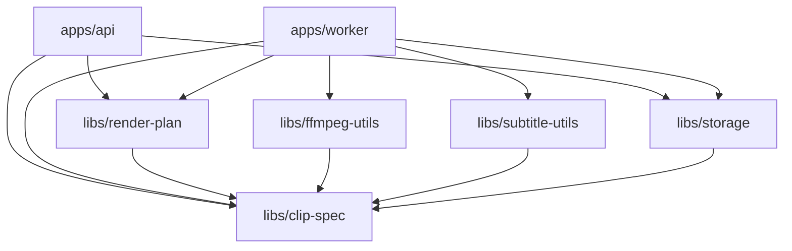

### 15.2 Ownership Model

| Modül | Sahip | Sorumluluk |
|-------|-------|------------|
| `apps/api` | Platform Team | API endpoint, authentication, rate limiting |
| `apps/worker` | Platform Team | Workflow execution, activity implementation |
| `libs/clip-spec` | Core Team | ClipSpec model, validation, normalization |
| `libs/render-plan` | Core Team | RenderPlan generation, codec matrix |
| `libs/ffmpeg-utils` | Media Team | FFmpeg wrapper, probe, filter graph |
| `libs/subtitle-utils` | Media Team | ASS/SRT parsing, font resolution, shaping |
| `libs/storage` | Platform Team | S3 client, content addressing, presigned URLs |
| `deploy/` | SRE Team | Kubernetes, Terraform, Helm |
| `docs/` | All Teams | Documentation ownership |

### 15.3 Kod Kalite Standartları

| Araç | Amaç | Konfigürasyon |
|------|------|--------------|
| **Ruff** | Linting + Formatting | `pyproject.toml` |
| **MyPy** | Type checking (strict mode) | `pyproject.toml` |
| **Pytest** | Unit + integration testing | `conftest.py` |
| **pre-commit** | Git hooks | `.pre-commit-config.yaml` |
| **coverage.py** | Code coverage | Minimum %80 line coverage |

### 15.4 Python Package Structure

```toml
# pyproject.toml (root workspace)
[tool.ruff]
target-version = "py312"
line-length = 88
select = ["E", "F", "W", "I", "N", "UP", "B", "A", "C4", "SIM", "TCH"]

[tool.ruff.isort]
known-first-party = ["clip_spec", "render_plan", "ffmpeg_utils", "subtitle_utils", "storage"]

[tool.mypy]
python_version = "3.12"
strict = true
plugins = ["pydantic.mypy"]

[tool.pytest.ini_options]
testpaths = ["tests"]
asyncio_mode = "auto"
markers = [
    "unit: Unit tests",
    "integration: Integration tests",
    "slow: Slow tests"
]
```

### 15.5 API/Worker Communication

```
API ↔ Worker iletişimkanalları:

1. PostgreSQL (primary)
   - clip_jobs tablosu (job state)
   - render_outputs tablosu (results)

2. Temporal (orchestration)
   - API: Workflow start, query, signal
   - Worker: Activity execution

3. Redis (cache + events)
   - Job status cache
   - Pub/Sub events (real-time notifications)

4. S3 (storage)
   - Input/output files
   - Content-addressed blobs
```

---

## 16. Migration Planı

### 16.1 Mevcut Durum Analizi

#### 16.1.1 Mevcut Mimari (AS-IS)

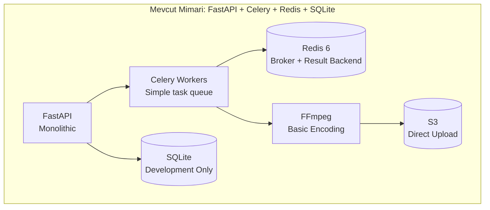

#### 16.1.2 Mevcut Sorunlar

| Problem | Etki | Öncelik |
|---------|------|---------|
| SQLite = single writer | Production'da unusable | P0 |
| Celery task state tracking | Workflow visibility yok | P0 |
| No hardware accel support | Slow encoding | P0 |
| Single worker instance | Scale-out imkansız | P0 |
| No content addressing | Duplicate storage | P1 |
| No subtitle engine | Subtitle burn-in yok | P1 |
| No A/V sync validation | Audio drift | P1 |
| No tenant isolation | Multi-tenant support yok | P1 |
| No observability | Production monitoring yok | P1 |

### 16.2 Hedef Mimari (TO-BE)

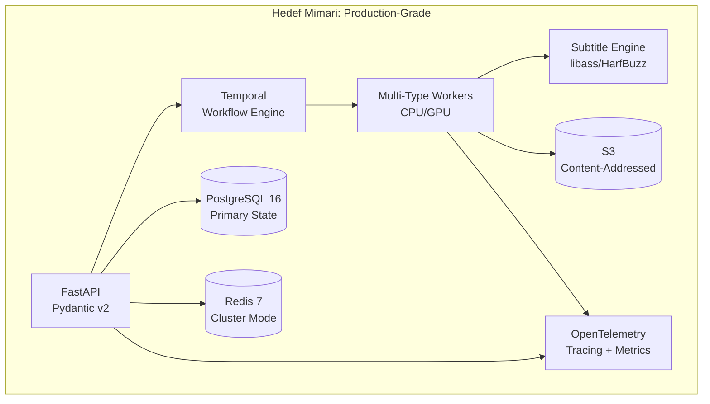

### 16.3 Migration Phases

#### Phase 0: Foundation (Hafta 1-2)

| Görev | Detay | Çıktı |
|-------|-------|-------|
| PostgreSQL setup | Production PostgreSQL kurulumu | Running cluster |
| Redis cluster | Redis 7 cluster setup | Running cluster |
| S3 bucket | Content-addressed bucket creation | Bucket ready |
| Code restructuring | Monorepo → modular structure | libs/ extracted |
| CI/CD pipeline | GitHub Actions setup | Automated testing |

#### Phase 1: Core Engine (Hafta 3-4)

| Görev | Detay | Çıktı |
|-------|-------|-------|
| ClipSpec model | Pydantic v2 ClipSpec extraction | libs/clip-spec |
| RenderPlan model | RenderPlan + generator | libs/render-plan |
| FFmpeg engine | FFmpeg wrapper library | libs/ffmpeg-utils |
| Temporal setup | Temporal server + worker bootstrap | Running Temporal |

#### Phase 2: Workflow Migration (Hafta 5-6)

| Görev | Detay | Çıktı |
|-------|-------|-------|
| Celery → Temporal | Workflow/activity migration | Temporal workflows |
| Dual-write mode | Celery + Temporal parallel run | Zero-downtime |
| Data migration | SQLite → PostgreSQL migration | Production data |
| API migration | FastAPI endpoint updates | New API |

#### Phase 3: Enhanced Features (Hafta 7-8)

| Görev | Detay | Çıktı |
|-------|-------|-------|
| Subtitle engine | libass/HarfBuzz integration | Subtitle burn-in |
| GPU support | NVENC/VAAPI/DXVA workers | Hardware accel |
| Content addressing | S3 content-hash storage | Dedup storage |
| A/V sync | Sample-accurate sync | Sync validation |

#### Phase 4: Production Readiness (Hafta 9-10)

| Görev | Detay | Çıktı |
|-------|-------|-------|
| Multi-tenancy | Tenant isolation (all layers) | Production multi-tenant |
| Observability | OTel + Prometheus + Loki | Full monitoring |
| Security hardening | Vault, mTLS, RLS | Security audit |
| Load testing | Performance benchmarks | SLO validation |

#### Phase 5: Cutover (Hafta 11-12)

| Görev | Detay | Çıktı |
|-------|-------|-------|
| Blue-green deploy | Canary traffic shift | Production cutover |
| Celery shutdown | Legacy worker decommission | Clean decommission |
| Documentation | Runbooks, playbooks | Operational docs |
| Post-mortem | Migration retrospective | Lessons learned |

### 16.4 Risk Matrix

| Risk | Olasılık | Etki | Mitigation |
|------|----------|------|------------|
| Data loss during migration | Düşük | Yüksek | Backup + dry-run migration |
| Downtime during cutover | Orta | Yüksek | Blue-green, dual-write |
| Performance regression | Orta | Orta | Load testing, benchmark gates |
| Feature parity gap | Düşük | Orta | Feature checklist, manual testing |
| Team knowledge gap | Orta | Orta | Training sessions, pair programming |

---

## 17. Kapasite Varsayımları

### 17.1 Throughput Hedefleri

| Metrik | Mevcut | 6 Ay | 12 Ay | 24 Ay |
|--------|--------|------|-------|-------|
| Concurrent render jobs | 5 | 200 | 500 | 2000 |
| Daily clip creation | 500 | 10,000 | 50,000 | 200,000 |
| Average render time (1080p, 60s) | 120s | 30s | 20s | 15s |
| Storage (total) | 10GB | 1TB | 10TB | 50TB |
| API requests/second | 10 | 100 | 500 | 2000 |

### 17.2 Latency Budget (1080p, 60s Clip)

| Aşama | Hedef Latency | Percentage |
|-------|--------------|------------|
| API validation | ≤ 50ms | 0.17% |
| Render plan generation | ≤ 200ms | 0.67% |
| Asset download (S3 → NVMe) | ≤ 2s | 6.67% |
| Video rendering (H.264, 1080p) | ≤ 10s | 33.3% |
| Audio processing | ≤ 2s | 6.67% |
| Subtitle burn-in | ≤ 3s | 10% |
| Muxing | ≤ 1s | 3.33% |
| Transcoding (ladder) | ≤ 5s | 16.67% |
| S3 upload | ≤ 2s | 6.67% |
| **Toplam (P50)** | **≤ 26s** | **100%** |

### 17.3 Storage Varsayımları

| Kaynak | Hesaplama | Sonuç |
|--------|-----------|-------|
| Input (avg) | 50MB × 50K clips/gün | 2.5TB/gün |
| Output (avg) | 100MB × 50K clips/gün | 5TB/gün |
| Intermediate (scratch) | 200MB × 500 concurrent | 100GB peak |
| Thumbnails (avg) | 200KB × 3 × 50K | 30GB/gün |
| **Aylık storage growth** | — | **~225TB/month** |

### 17.4 Compute Varsayımları

| Resource | Per Worker | Total (200 workers) |
|----------|------------|---------------------|
| CPU cores | 8 | 1600 |
| RAM | 16GB | 3.2TB |
| GPU (NVIDIA T4) | 1 | 50 |
| NVMe scratch | 500GB | 100TB |
| Network (per worker) | 1Gbps | 200Gbps |

### 17.5 Database Varsayımları

| Metrik | Hedef |
|--------|-------|
| Table size (clip_jobs) | 500K rows/gün, 180M rows/yıl |
| Table size (render_outputs) | 150K rows/gün, 54M rows/yıl |
| Write QPS | 500 |
| Read QPS | 2000 |
| Connection pool | 200 connections (PgBouncer) |
| Storage (1 yıl) | ~50GB (compressed JSONB) |

---

## 18. Failure Domains ve Backpressure

### 18.1 Failure Domain Haritası

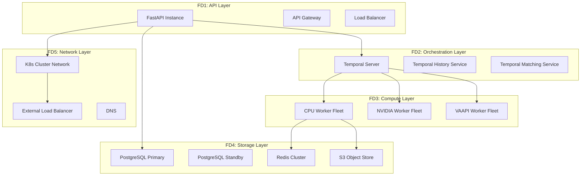

### 18.2 Failure Senaryoları

| Failure Domain | Failure Type | Etki | Otomatik Mitigation | Manual Mitigation |
|---------------|-------------|------|---------------------|-------------------|
| **FD1** | API instance crash | Request loss | K8s restart, LB reroute | Rolling restart |
| **FD1** | API overload | Slow responses | HPA scale-up, rate limit | Capacity increase |
| **FD2** | Temporal server crash | Workflow pause | K8s restart, history replay | Failover |
| **FD2** | Task queue backlog | Delayed starts | Worker scale-up | Queue migration |
| **FD3** | Worker crash | Job failure | Activity retry (3x) | Manual job restart |
| **FD3** | GPU failure | GPU job failure | CPU fallback (auto) | GPU replacement |
| **FD3** | NVMe failure | Job failure | Activity retry | Disk replacement |
| **FD4** | PostgreSQL crash | Write failure | Standby promotion | Data recovery |
| **FD4** | Redis crash | Cache miss | DB fallback, cache rebuild | Cluster recovery |
| **FD4** | S3 outage | Storage failure | Retry with backoff | Multi-region failover |
| **FD5** | Network partition | Partial outage | Retry, circuit breaker | Network repair |

### 18.3 Backpressure Mechanizması

#### 18.3.1 Katman Bazlı Backpressure

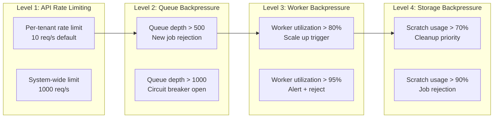

#### 18.3.2 Circuit Breaker Patterns

```python
# Circuit breaker configuration per failure domain
CIRCUIT_BREAKER_CONFIG = {
    "s3_upload": {
        "failure_threshold": 5,
        "recovery_timeout": 30,  # seconds
        "half_open_max": 3,
    },
    "temporal_workflow": {
        "failure_threshold": 10,
        "recovery_timeout": 60,
        "half_open_max": 5,
    },
    "gpu_rendering": {
        "failure_threshold": 3,
        "recovery_timeout": 120,
        "half_open_max": 2,
        "fallback": "cpu_rendering",
    },
    "database_write": {
        "failure_threshold": 3,
        "recovery_timeout": 30,
        "half_open_max": 2,
    },
}
```

#### 18.3.3 Retry Policy

| Operation | Max Attempts | Backoff | Jitter | Timeout |
|-----------|-------------|---------|--------|---------|
| S3 download | 3 | Exponential (1s, 4s, 16s) | ±500ms | 30s |
| S3 upload | 3 | Exponential (1s, 4s, 16s) | ±500ms | 60s |
| FFmpeg render | 2 | Linear (10s) | ±2s | 300s |
| DB write | 3 | Exponential (100ms, 400ms, 1.6s) | ±50ms | 5s |
| Temporal activity | 3 | Exponential (1s, 4s, 16s) | ±1s | 120s |
| Redis operation | 3 | Linear (50ms) | ±10ms | 1s |

### 18.4 Disaster Recovery

#### 18.4.1 RTO/RPO Hedefleri

| Scenario | RTO | RPO | Strategy |
|----------|-----|-----|----------|
| Single worker failure | ≤ 30s | 0 | Activity retry |
| Database failure | ≤ 2 min | ≤ 1s | Hot standby promotion |
| Redis failure | ≤ 1 min | ≤ 5s | Cluster failover + DB fallback |
| S3 region outage | ≤ 30 min | 0 | Cross-region replication |
| Complete cluster failure | ≤ 5 min | ≤ 1 min | Multi-AZ deployment |

#### 18.4.2 Backup Strategy

| Component | Backup Method | Frequency | Retention |
|-----------|--------------|-----------|-----------|
| PostgreSQL | WAL archiving + base backup | Continuous | 30 days |
| Redis | RDB snapshots + AOF | Every 5 min | 7 days |
| S3 | Cross-region replication | Real-time | Same as primary |
| Temporal | History service backup | Every hour | 7 days |
| Kubernetes | etcd snapshots | Every hour | 7 days |

---

## 19. Definition of Done

### 19.1 Mimari Done Kriterleri

| # | Kriter | Doğrulama |
|---|--------|-----------|
| 1 | Tüm functional gereksinimler (FR-001 - FR-045) implemente edilmiş | Test coverage %80+ |
| 2 | Tüm SLO'lar load test ile doğrulanmış | Benchmark report |
| 3 | Temporal workflow state machine tüm geçişleri destekliyor | State diagram test |
| 4 | Content addressing SHA-256 ile working | Dedup test |
| 5 | Tenant isolation tüm katmanlarda aktif | Security audit |
| 6 | Hardware acceleration (NVENC, VAAPI) working | Encoding benchmark |
| 7 | Subtitle engine (libass/HarfBuzz) Unicode test geçiyor | i18n test suite |
| 8 | A/V sync ≤ 20ms tolerans ile working | Lip-sync test |
| 9 | OpenTelemetry tracing tüm servislerde aktif | Trace verification |
| 10 | Prometheus metrics tüm servislerde exposed | Metric verification |
| 11 | Loki structured logging tüm servislerde aktif | Log query test |
| 12 | Circuit breaker patterns tüm external dependency'lerde aktif | Chaos test |
| 13 | Backpressure mekanizması test edilmiş | Load test (overload) |
| 14 | PostgreSQL RLS tenant isolation test edilmiş | Penetration test |
| 15 | Vault secret rotation automated working | Rotation test |
| 16 | Zero-downtime deploy doğrulanmış | Rolling update test |
| 17 | Disaster recovery drill yapılmış | DR runbook test |
| 18 | Documentation (runbooks, playbooks) tamamlanmış | Peer review |
| 19 | Celery → Temporal migration tamamlanmış | Dual-write comparison |
| 20 | Kubernetes HPA auto-scaling working | Scale test |

### 19.2 Kod Done Kriterleri

| Kriter | Hedef |
|--------|-------|
| MyPy strict mode | 0 errors |
| Ruff linting | 0 warnings |
| Unit test coverage | ≥ 80% |
| Integration test coverage | ≥ 60% |
| Security scan (bandit) | 0 high/critical |
| Dependency audit (pip-audit) | 0 vulnerabilities |
| Documentation coverage | ≥ 90% public API |

### 19.3 Deployment Done Kriterleri

| Kriter | Hedef |
|--------|-------|
| Helm chart versioned | Semantic versioning |
| Terraform state | Remote state (S3 + DynamoDB lock) |
| CI/CD pipeline | Green build on main |
| Canary deployment | ≤ 5% error rate increase |
| Rollback tested | ≤ 5 minute rollback |
| Monitoring dashboards | All SLO metrics visible |
| Alert rules | All P1/P2 alerts configured |
| Runbooks | All operational procedures documented |

---

## Ek A: Mimari Karar Özeti Tablosu

| # | Karar | Seçim | Tarih | Durum |
|---|-------|-------|-------|-------|
| ADR-001 | Runtime | Python 3.12 | 2026-07 | Onaylı |
| ADR-002 | Web Framework | FastAPI + Pydantic v2 | 2026-07 | Onaylı |
| ADR-003 | Workflow Engine | Temporal | 2026-07 | Onaylı |
| ADR-004 | Primary Database | PostgreSQL 16 | 2026-07 | Onaylı |
| ADR-005 | Cache/Queue | Redis 7 Cluster | 2026-07 | Onaylı |
| ADR-006 | Object Storage | S3 (content-addressed) | 2026-07 | Onaylı |
| ADR-007 | Video Processing | FFmpeg 7.x | 2026-07 | Onaylı |
| ADR-008 | Subtitle Engine | libass + HarfBuzz + FreeType | 2026-07 | Onaylı |
| ADR-009 | Time Model | Rational time (num/den) | 2026-07 | Onaylı |
| ADR-010 | Audio Model | 48kHz float32 | 2026-07 | Onaylı |
| ADR-011 | Color Pipeline | Linear light compositing | 2026-07 | Onaylı |
| ADR-012 | Secret Management | Vault + KMS | 2026-07 | Onaylı |
| ADR-013 | Observability | OTel + Prometheus + Loki | 2026-07 | Onaylı |
| ADR-014 | Orchestration Platform | Kubernetes | 2026-07 | Onaylı |
| ADR-015 | GPU Support | NVENC, VAAPI, DXVA | 2026-07 | Onaylı |

---

## Ek B: Terimler Sözlüğü

| Terim | Tanım |
|-------|-------|
| **ClipSpec** | Kullanıcının tanımladığı clip spesifikasyonu (dış sözleşme) |
| **RenderPlan** | ClipSpec'in teknik karşılığı (iç sözleşme) |
| **Content Addressing** | Dosyaların SHA-256 hash'i ile adreslenmesi |
| **PTS** | Presentation Time Stamp — frame'in görüntülenme zamanı |
| **DTS** | Decode Time Stamp — frame'in decode edilme zamanı |
| **Rational Time** | numerator/denominator ile temsil edilen zaman |
| **VFR** | Variable Frame Rate — değişken kare hızı |
| **CFR** | Constant Frame Rate — sabit kare hızı |
| **Linear Light** | Doğrusal ışık uzayı (gamma correction öncesi) |
| **Premultiplied Alpha** | Alpha channel'ın RGB değerlerine çarpılmış hali |
| **Tone Mapping** | HDR'den SDR'ye renk dönüşümü |
| **Loudness Normalization** | Ses seviyesi normalizasyonu (EBU R128) |
| **NVMe Scratch** | Geçici işleme için yerel高速 disk |
| **Ladder** | Çoklu resolution/bitrate çıkış konfigürasyonu |
| **Backpressure** | Sistem yükü arttığında akış kontrolü |
| **Circuit Breaker** | Başarısızlık zincirini kesme deseni |

---

> **Son Not:** Bu belge canlı bir dokümandır. Mimari kararlar ve uygulama detayları proje ilerledikçe güncellenir. Tüm değişiklikler ADR (Architecture Decision Record) formatında dokümante edilmelidir.
