# Video Engine SDD 01: Medya Temelleri

## Ortak Giriş

Her video processing görevi üç temel yapıtaşı üzerine inşa edilir:

1. **Clip Spec** -- Ham medya dosyasının metadata tanımı (resolution, fps, codec, duration,
   track layout). Bu spec render planının girdisidir.
2. **Render Plan** -- Clip spec'den türetilen işlem listesi. Hangi filtreler uygulanacak,
   hangi codec ile encode edilecek, çıkış formatı ne olacak.
3. **FFmpeg Pipeline** -- Render planın somut karşılığı. `filter_complex` grafiği,
   `map` yönlendirmeleri ve encoder ayarları.

### Ortak Klasör Ağacı

```
project-root/
  clips/                  # Ham kaynak dosyalar (.mp4, .mov, .mkv)
  cache/                  # Ara çözünürlükte kareler, proxy dosyalar
  intermediates/           # Filter_complex çıktıları, yarım işler
  output/                 # Nihai encode edilmiş dosyalar
  render-plans/           # JSON render plan tanımları
  logs/                   # FFmpeg progress pipe çıktıları
  test-assets/            # Test için kullanılan küçük klip örnekleri
```

### Ortak Zaman Modeli (Rational Time)

Video ve ses akışları rational time (rasyonel zaman) kullanır:

```
PTS (Presentation Time Stamp) = timestamp_num / timebase_den
DTS (Decode Time Stamp)       = dts_num / timebase_den
Duration                      = duration_num / timebase_den
```

Her stream kendi timebase değerine sahiptir. Birleştirmelerde timebase
normalizasyonu zorunludur. FFmpeg varsayılan olarak `1/90000` (MPEG timebase)
kullanır ama filtre grafiklerinde `AV_TIME_BASE` (1/1000000) tercih edilir.

---

## 1. Video Processing Pipeline

### Çalışma mekanizması ve invariantlar

Video processing pipeline, bir kaynak dosyadan başlayıp nihai çıktıya ulaşana kadar
geçen tüm dönüşüm adımlarını tanımlar. Pipeline'ın üç invariant'ı vardır:

- **Determinism**: Aynı girdi + aynı plan = aynı çıktı (bitwise olmasa da
  perceptual olarak birebir).
- **Atomiklik**: Her adımda ya tamamen başarılı olur ya da temizlenir.
  Yarım output üretmek yasaktır.
- **Kaynak Sınırlaması**: Pipeline'ın bellek kullanımı üst limiti aşamaz.

Pipeline iki aşamalı çalışır:
1. **Analysis**: Kaynak dosya probe edilir, codec profilleri çıkarılır,
   keyframe indeksleri oluşturulur.
2. **Execution**: Filter grafik oluşturulur, encoder ayarları uygulanır,
   çıktı dosyası yazılır.

### Neden ve alternatifler

| Yaklaşım | Avantaj | Dezavantaj |
|-----------|---------|------------|
| Tek geçiş (single-pass) | Basit, hızlı | Kalite kontrolü sınırlı |
| İki geçiş (two-pass) | Better rate control | Daha yavaş, intermediate dosya |
| İsteğe bağlı processing | Esnek | Karmaşık hata yönetimi |
| Pipeline parallelization | Yüksek Throughput | Bellek baskısı, senkronizasyon |

### Veri akışı

```
Source File
    |
    v
[Probe / Metadata Extract]
    |
    v
[Decode] -> Raw Frames (YUV/RGB)
    |
    v
[Filter Graph] -> Transformed Frames
    |
    v
[Encode] -> Compressed Bitstream
    |
    v
[Mux] -> Container File
    |
    v
[Output]
```

### API/interface/model

```typescript
interface PipelineConfig {
  sourcePath: string;
  outputPath: string;
  filters: FilterDefinition[];
  encoder: EncoderConfig;
  demuxOptions: DemuxOptions;
  hardwareAccel?: HWAccelConfig;
}

interface FilterDefinition {
  name: string;
  params: Record<string, string | number>;
  inputs: string[];
  outputs: string[];
}

interface EncoderConfig {
  codec: 'h264' | 'h265' | 'av1' | 'vp9';
  preset: string;
  crf: number;
  maxBitrate?: string;
  profile?: string;
  level?: string;
  pixelFormat: string;
}

interface RenderResult {
  exitCode: number;
  outputPath: string;
  stats: PipelineStats;
  warnings: string[];
}

interface PipelineStats {
  totalFrames: number;
  encodedFrames: number;
  droppedFrames: number;
  encodeFps: number;
  totalDurationMs: number;
  outputSizeBytes: number;
}
```

### Dosya ve klasör yeri

Pipeline tanımı `render-plans/` altında JSON olarak saklanır. Her plan bir UUID
ile adlandırılır. Ara dosyalar `intermediates/` altına UUID-adesen-numarası
formatında yazılır.

### Render pipeline entegrasyonu

Render plan, FFmpeg CLI argümanlarına dönüştürülür. Dönüştürme süreci:
1. Filter tanımları `filter_complex` stringine çevrilir.
2. Encoder config FFmpeg encoder option'larına map edilir.
3. `map` argümanları çıkış stream'leri belirler.
4. `progress pipe` stdout'a bağlanarak real-time izleme sağlanır.

### Mermaid sequence

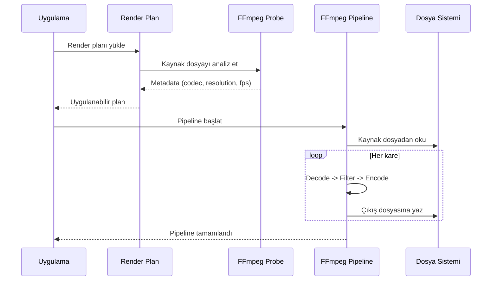
```mermaid
sequenceDiagram
    participant App as Uygulama
    participant Plan as Render Plan
    participant Probe as FFmpeg Probe
    participant Pipe as FFmpeg Pipeline
    participant Disk as Dosya Sistemi

    App->>Plan: Render planı yükle
    Plan->>Probe: Kaynak dosyayı analiz et
    Probe-->>Plan: Metadata (codec, resolution, fps)
    Plan-->>App: Uygulanabilir plan
    App->>Pipe: Pipeline başlat
    Pipe->>Disk: Kaynak dosyadan oku
    loop Her kare
        Pipe->>Pipe: Decode -> Filter -> Encode
        Pipe->>Disk: Çıkış dosyasına yaz
    end
    Pipe-->>App: Pipeline tamamlandı
```

### Mermaid class

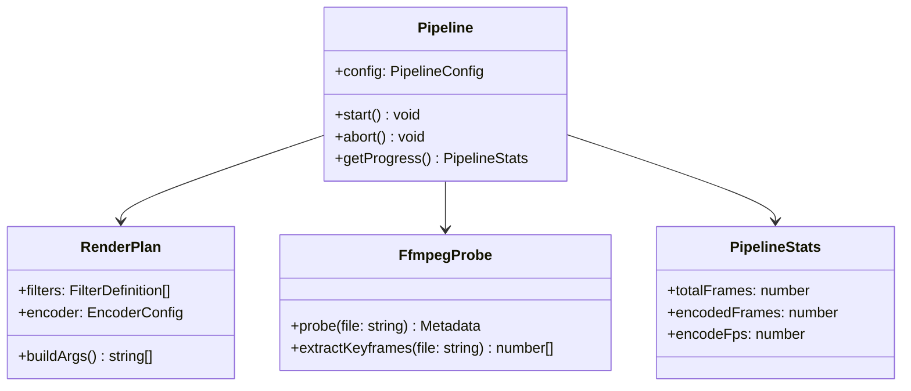
```mermaid
classDiagram
    class Pipeline {
        +config: PipelineConfig
        +start() void
        +abort() void
        +getProgress() PipelineStats
    }
    class RenderPlan {
        +filters: FilterDefinition[]
        +encoder: EncoderConfig
        +buildArgs() string[]
    }
    class FfmpegProbe {
        +probe(file: string) Metadata
        +extractKeyframes(file: string) number[]
    }
    class PipelineStats {
        +totalFrames: number
        +encodedFrames: number
        +encodeFps: number
    }
    Pipeline --> RenderPlan
    Pipeline --> FfmpegProbe
    Pipeline --> PipelineStats
```

### Mermaid state

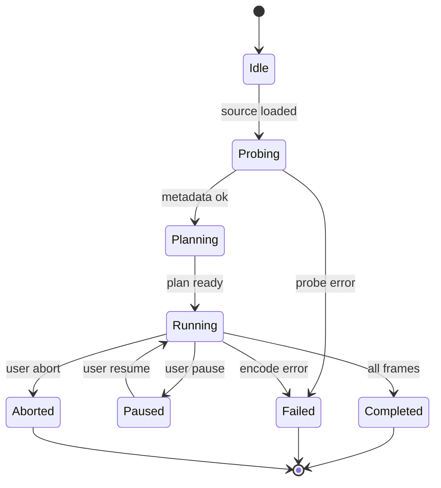
```mermaid
stateDiagram-v2
    [*] --> Idle
    Idle --> Probing : source loaded
    Probing --> Planning : metadata ok
    Probing --> Failed : probe error
    Planning --> Running : plan ready
    Running --> Paused : user pause
    Paused --> Running : user resume
    Running --> Completed : all frames
    Running --> Failed : encode error
    Running --> Aborted : user abort
    Completed --> [*]
    Failed --> [*]
    Aborted --> [*]
```

### Production sorunları ve recovery

- **FFmpeg crash**: Child process respawn ile kalan karelerden devam. GOP sınırları
  nedeniyle tam GOP başından restart gerekebilir.
- **Disk dolu**: Output dosyası handle'ı açık kalır, temiz cleanup ile kalan partial
  dosya silinir. Plan `disk_space_required` alanı ile ön kontrol yapar.
- **Bozuk kaynak**: Decoder error tolerance ilehasarlı kareler atlanır. `err_detect`
  flag'i `ignore_err` olarak ayarlanabilir.

### Performans, benchmark

Tek geçiş pipeline referans değerleri (1080p H.264):
- Decode: ~500 fps (CPU), ~1200 fps (NVDEC)
- Encode: ~120 fps (CPU x264 medium), ~600 fps (NVENC)
- Filter (scale): ~300 fps (CPU), ~2000 fps (NVENC scale)

### Gerçek dünya uygulaması

YouTube, Netflix benzeri platformlarda pipeline'lar DAG (Directed Acyclic Graph)
şeklinde modellenir. Her node bir FFmpeg instance'ı temsil eder. Topluluk encoding
pipeline'ları genellikle 10-20 paralel FFmpeg instance çalıştırır.

### Ölçeklenebilirlik

Pipeline'lar yatay ölçeklenebilir: her kaynak dosya bağımsız olarak işlenir.
Dikey ölçeklendirme için filter grafikleri parçalanabilir (segment-based processing).

### Ownership ve test

- **Sahip**: Video processing team
- **Unit test**: Pipeline config validation, filter string generation
- **Integration test**: Küçük test dosyaları ile tam pipeline çalıştırma
- **E2E test**: Farklı codec/resolution kombinasyonlarında çıktı karşılaştırma

---

## 2. Frame Extraction

### Çalışma mekanizması ve invariantlar

Frame extraction, video dosyasından belirli zaman damgalarında kareler çıkarma
işlemidir. Temel invariant: **İstenen PTS'deki kare, belirli bir tolerans
dahilinde doğru zamanda çıkarılmalıdır.**

İki strateji vardır:

1. **Keyframe seeking**: En yakın keyframe'e (I-frame) atlar. Hızlı ama hassas değil.
2. **Exact PTS decoding**: Doğru kareye kadar decode eder. Yavaş ama hassas.

Seeking davranışı FFmpeg'in `-ss` argümanının konumuna bağlıdır:
- `-ss` input'tan önce: Quick seek (keyframe tabanlı)
- `-ss` input'tan sonra: Exact seek (decode tabanlı)

### Neden ve alternatifler

| Strateji | Hız | Hassasiyet | Kullanım |
|----------|-----|------------|----------|
| Keyframe seek | Çok hızlı | ±1 GOP | Thumbnail, preview |
| Exact PTS | Yavaş | ±1 frame | Screenshot, QC |
| Scene cut detection | Orta | Sahne bazlı | Video editing |

### Veri akışı

```
Source File
    |
    v
[Seek to target PTS]
    |
    v
[Decode frames around target]
    |
    v
[Filter: select='eq(n,N)' or thumbnail]
    |
    v
[Encode single frame as PNG/JPEG]
    |
    v
[Output Image]
```

### API/interface/model

```typescript
interface FrameExtractionConfig {
  sourcePath: string;
  outputDir: string;
  timestamps: RationalTime[];
  format: 'png' | 'jpeg' | 'bmp';
  quality: number; // JPEG için 1-100
  seekMode: 'keyframe' | 'exact';
  pixelFormat: string; // 'rgb24', 'yuva444p' vb.
}

interface RationalTime {
  numerator: number;
  denominator: number;
}

function toSeconds(rt: RationalTime): number {
  return rt.numerator / rt.denominator;
}

interface ExtractedFrame {
  timestamp: RationalTime;
  outputPath: string;
  width: number;
  height: number;
  format: string;
}
```

FFmpeg komut argümanları:

Keyframe extraction:
```
ffmpeg -ss 10.5 -i input.mp4 -frames:v 1 -q:v 2 output.jpg
```

Exact PTS extraction:
```
ffmpeg -i input.mp4 -ss 10.5 -frames:v 1 -q:v 1 output.png
```

Scene cut extraction:
```
ffmpeg -i input.mp4 -vf "select='gt(scene,0.4)',showinfo" -vsync vfr output_%03d.png
```

### Dosya ve klasör yeri

Çıkarılan kareler `cache/frames/{clip-id}/` altında saklanır. Dosya adı
`{timestamp_ms}.{format}` formatındadır. Keyframe indeksi `cache/keyframes/{clip-id}.index`
dosyasında tutulur.

### Render pipeline entegrasyonu

Frame extraction genellikle pipeline'ın analysis aşamasında kullanılır.
Özellikle thumbnail oluşturma ve proxy generation için zorunludur.
Ayrıca video editing workflow'larında `trim` operasyonu için frame accurate
seeking gerektirir.

### Mermaid sequence

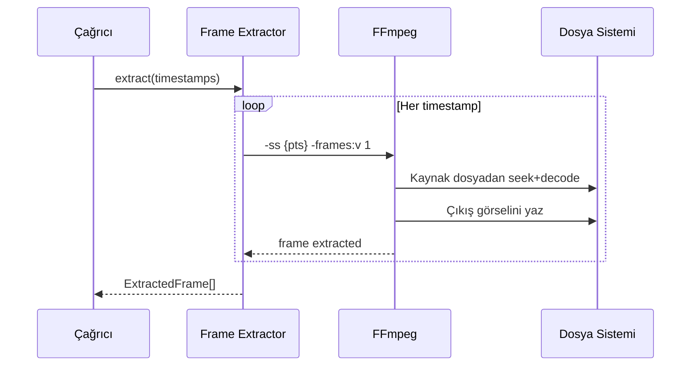
```mermaid
sequenceDiagram
    participant Caller as Çağrıcı
    participant Extractor as Frame Extractor
    participant FFmpeg as FFmpeg
    participant Disk as Dosya Sistemi

    Caller->>Extractor: extract(timestamps)
    loop Her timestamp
        Extractor->>FFmpeg: -ss {pts} -frames:v 1
        FFmpeg->>Disk: Kaynak dosyadan seek+decode
        FFmpeg->>Disk: Çıkış görselini yaz
        FFmpeg-->>Extractor: frame extracted
    end
    Extractor-->>Caller: ExtractedFrame[]
```

### Mermaid class

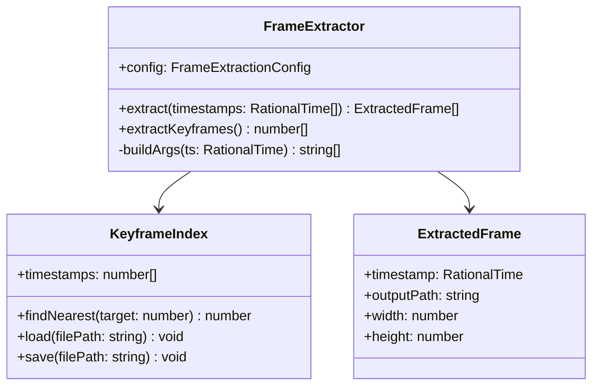
```mermaid
classDiagram
    class FrameExtractor {
        +config: FrameExtractionConfig
        +extract(timestamps: RationalTime[]) ExtractedFrame[]
        +extractKeyframes() number[]
        -buildArgs(ts: RationalTime) string[]
    }
    class KeyframeIndex {
        +timestamps: number[]
        +findNearest(target: number) number
        +load(filePath: string) void
        +save(filePath: string) void
    }
    class ExtractedFrame {
        +timestamp: RationalTime
        +outputPath: string
        +width: number
        +height: number
    }
    FrameExtractor --> KeyframeIndex
    FrameExtractor --> ExtractedFrame
```

### Mermaid state

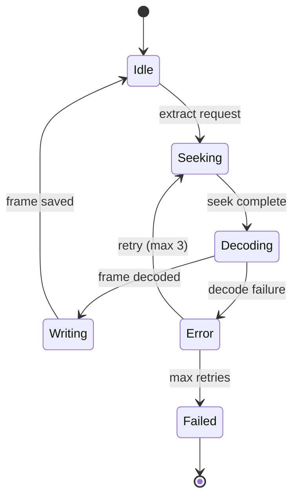
```mermaid
stateDiagram-v2
    [*] --> Idle
    Idle --> Seeking : extract request
    Seeking --> Decoding : seek complete
    Decoding --> Writing : frame decoded
    Writing --> Idle : frame saved
    Decoding --> Error : decode failure
    Error --> Seeking : retry (max 3)
    Error --> Failed : max retries
    Failed --> [*]
```

### Production sorunları ve recovery

- **Seek past EOF**: Timestamp dosya süresinden büyükse FFmpeg hata verir.
  Çözüm: timestamp'i `min(ts, duration - 1frame)` ile sınırlamak.
- **B-frame reorder**: B-frame içeren GOP'larda exact seeking zorlaşır.
  Çözüm: `-skip_frame nokey` ile sadece keyframe'leri decode etmek.
- **Variable frame rate**: VFR dosyalarda timestamp hesaplaması hatalı olabilir.
  Çözüm: `-vsync cfr` ile CFR'ye zorlamak veya `showinfo` filter ile gerçek
  PTS'leri okumak.

### Performans, benchmark

- Keyframe seek: <50ms (SSD), <200ms (HDD)
- Exact seek (1080p): ~100ms per frame (CPU decode)
- Scene cut detection: ~30fps processing speed

### Gerçek dünya uygulaması

Video editing uygulamaları (Premiere, DaVinci) proxy oluştururken keyframe
extraction kullanır. Streaming platformları adaptive bitrate ladder oluştururken
her segment için keyframe extraction yapar.

### Ölçeklenebilirlik

Çoklu timestamp extraction paralelleştirilebilir. Her FFmpeg instance bağımsız
çalıştığı için process-level parallelism uygulanabilir. Bellek sınırı: her instance
~200MB decode buffer kullanır.

### Ownership ve test

- **Sahip**: Media extraction team
- **Unit test**: Timestamp hesaplama, keyframe indeks oluşturma
- **Integration test**: Farklı codec'lerde (H.264, H.265, AV1) frame extraction
- **Edge test**: Bozuk dosyalar, 0-süreli dosyalar, çok yüksek resolution

---

## 3. Encoding

### Çalışma mekanizması ve invariantlar

Encoding, ham kareleri (YUV/RGB) sıkıştırılmış bitstream'e dönüştürme işlemidir.
Temel invariant: **Çıkış bitstream'i, belirtilen kalite hedefini (CRF/CQP) veya
bitrate hedefini (CBR/VBR) karşılamalıdır.**

Rate control modları:
- **CRF (Constant Rate Factor)**: Sabit kalite, değişken bitrate. En yaygın
  kullanım. `crf=0` kayıpsız, `crf=51` en kötü kalite.
- **CQP (Constant QP)**: Sabit quantization parametresi. Daha öngörülebilir
  bitrate ama CRF'den daha kötü kalite/bitrate oranı.
- **CBR (Constant Bitrate)**: Sabit bitrate. Streaming için ideal.
- **VBR (Variable Bitrate)**: Hedef bitrate etrafında değişken. Kalite/bitrate
  dengesi iyi.

Two-pass encoding: İlk geçişte bitrate dağılımı analiz edilir, ikinci geçişte
optimize edilmiş bitrate ataması yapılır.

### Neden ve alternatifler

| Codec | Hız | Kalite/Bitrate | Donanım desteği |
|-------|-----|----------------|-----------------|
| H.264 (libx264) | Orta | İyi | Geniş |
| H.265 (libx265) | Yavaş | Çok iyi | Orta |
| AV1 (libaom-av1) | Çok yavaş | Mükemmel | artan |
| VP9 (libvpx-vp9) | Yavaş | Çok iyi | Chrome |

### Veri akışı

```
Raw Frames (YUV)
    |
    v
[Rate Control Decision]
    |
    v
[Transform (DCT/DST)]
    |
    v
[Quantization]
    |
    v
[Entropy Coding (CABAC/CAVLC)]
    |
    v
[Bitstream (NAL units)]
    |
    v
[Mux to Container]
```

### API/interface/model

```typescript
interface EncoderConfig {
  codec: 'h264' | 'h265' | 'av1' | 'vp9';
  preset: 'ultrafast' | 'superfast' | 'veryfast' | 'faster' | 'fast' |
          'medium' | 'slow' | 'slower' | 'veryslow';
  rateControl: RateControl;
  profile?: 'baseline' | 'main' | 'high' | 'high10' | 'high444';
  level?: string; // '3.1', '4.0', '5.1' vb.
  pixelFormat: 'yuv420p' | 'yuv420p10le' | 'yuv444p' | 'rgb24';
  bFrames: number; // 0-16
  gopSize: number; // keyframe interval (帧)
  tileColumns?: number; // AV1 için
  tileRows?: number; // AV1 için
  threads: number;
}

type RateControl =
  | { type: 'crf'; value: number }
  | { type: 'cqp'; value: number }
  | { type: 'cbr'; bitrate: string; passes: 1 | 2 }
  | { type: 'vbr'; targetBitrate: string; maxBitrate: string; passes: 1 | 2 };
```

FFmpeg komut argümanları:

CRF encoding:
```
ffmpeg -i input.mp4 -c:v libx264 -crf 23 -preset medium -c:a copy output.mp4
```

Two-pass VBR:
```
ffmpeg -i input.mp4 -c:v libx264 -b:v 5M -pass 1 -an -f null /dev/null
ffmpeg -i input.mp4 -c:v libx264 -b:v 5M -pass 2 -c:a copy output.mp4
```

H.265 with specific profile:
```
ffmpeg -i input.mp4 -c:v libx265 -crf 28 -preset slow -profile:v main10 -pix_fmt yuv420p10le output.mp4
```

AV1 with tiles:
```
ffmpeg -i input.mp4 -c:v libaom-av1 -crf 30 -tile-columns 2 -tile-rows 1 -threads 8 output.mkv
```

### Dosya ve klasör yeri

Two-pass encoding geçici dosyaları `intermediates/ffmpeg2pass-0.log*` konumuna
yazılır. Çıkış dosyaları `output/` altında `{clip-id}_{codec}_{crf}.{ext}`
formatında saklanır.

### Render pipeline entegrasyonu

Encoder config, render planın encoder bölümünden türetilir. Pipeline,
encoder'ı `filter_complex` çıktısına bağlar. `map` argümanları ile
doğru stream hedeflenir.

### Mermaid sequence

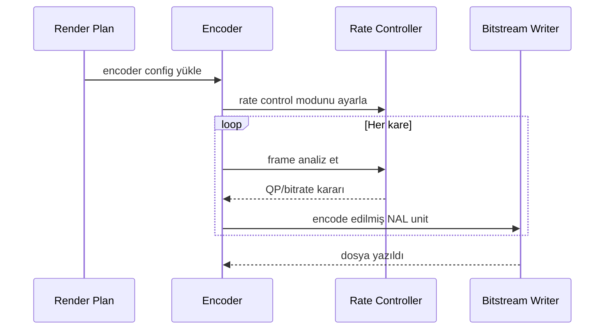
```mermaid
sequenceDiagram
    participant Plan as Render Plan
    participant Encoder as Encoder
    participant RateCtrl as Rate Controller
    participant Bitstream as Bitstream Writer

    Plan->>Encoder: encoder config yükle
    Encoder->>RateCtrl: rate control modunu ayarla
    loop Her kare
        Encoder->>RateCtrl: frame analiz et
        RateCtrl-->>Encoder: QP/bitrate kararı
        Encoder->>Bitstream: encode edilmiş NAL unit
    end
    Bitstream-->>Encoder: dosya yazıldı
```

### Mermaid class

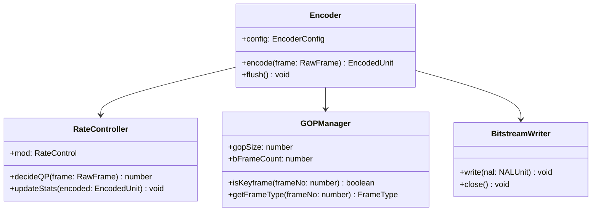
```mermaid
classDiagram
    class Encoder {
        +config: EncoderConfig
        +encode(frame: RawFrame) EncodedUnit
        +flush() void
    }
    class RateController {
        +mod: RateControl
        +decideQP(frame: RawFrame) number
        +updateStats(encoded: EncodedUnit) void
    }
    class GOPManager {
        +gopSize: number
        +bFrameCount: number
        +isKeyframe(frameNo: number) boolean
        +getFrameType(frameNo: number) FrameType
    }
    class BitstreamWriter {
        +write(nal: NALUnit) void
        +close() void
    }
    Encoder --> RateController
    Encoder --> GOPManager
    Encoder --> BitstreamWriter
```

### Mermaid state

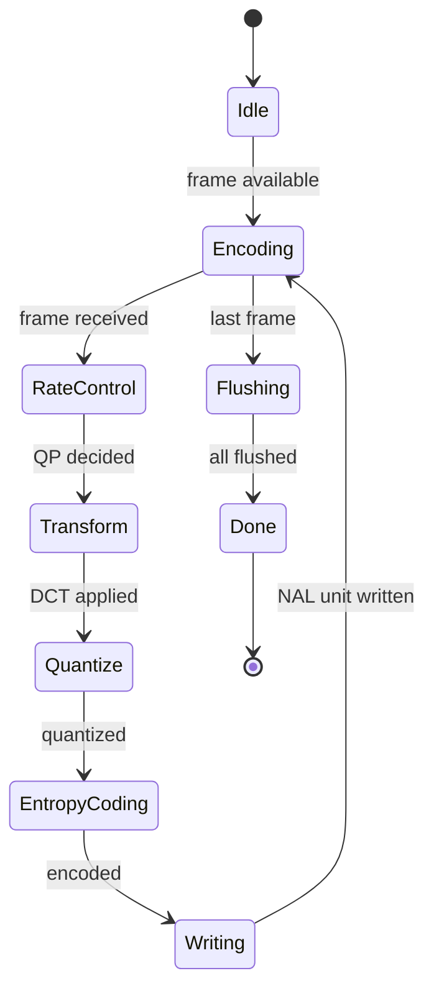
```mermaid
stateDiagram-v2
    [*] --> Idle
    Idle --> Encoding : frame available
    Encoding --> RateControl : frame received
    RateControl --> Transform : QP decided
    Transform --> Quantize : DCT applied
    Quantize --> EntropyCoding : quantized
    EntropyCoding --> Writing : encoded
    Writing --> Encoding : NAL unit written
    Encoding --> Flushing : last frame
    Flushing --> Done : all flushed
    Done --> [*]
```

### Production sorunları ve recovery

- **Bitrate overrun**: CBR/VBR modunda bitrate hedefi aşılırsa, rate controller
  aggressive quantization uygular. CRF modunda bu sorun yoktur.
- **B-frame reordering**: B-frame sayısı fazlaysa decode gecikmesi artar.
  Streaming için `bFrames=0` veya `bFrames=1` tercih edilir.
- **GOP hizalama**: Keyframe'ler segment başlarıyla hizalı olmalıdır.
  `force_key_frames="expr:gte(t,n_forced*2)"` ile zorlanabilir.

### Performans, benchmark

H.264 encoding hızları (1080p, medium preset):
- libx264: ~120 fps (CPU)
- NVENC: ~600 fps (GPU)
- VAAPI: ~400 fps (Intel iGPU)

### Gerçek dünya uygulaması

Streaming platformları ladder encoding kullanır: aynı kaynaktan 5-8 farklı
resolution/bitrate kombinasyonu encode edilir. Her katman farklı CRF/bitrate
hedefi kullanır.

### Ölçeklenebilirlik

CPU encoding thread-level parallelism destekler (`-threads`). GPU encoding
device-level parallelism ile birden fazla stream'i aynı anda encode edebilir.
NVENC session limiti donanıma bağlıdır (genellikle 3-16).

### Ownership ve test

- **Sahip**: Encoding pipeline team
- **Unit test**: Rate control kararları, GOP yapısı, profile/level uyumluluğu
- **Integration test**: Farklı codec/preset kombinasyonlarında bitrate kalite doğrulama
- **Regression test**: PSNR/SSIM karşılaştırmaları

---

## 4. Decoding

### Çalışma mekanizması ve invariantlar

Decoding, sıkıştırılmış bitstream'i ham kareler (YUV/RGB) dönüştürme işlemidir.
Temel invariant: **Decode edilmiş kare, kaynak bitstream ile birebir eşleşmelidir
(perceptual fidelity).**

İki decoding yolu vardır:
1. **Software decoding**: CPU üzerinde çalışır. Her codec için özel decoder.
2. **Hardware decoding**: GPU'da çalışır. Daha hızlı, düşük CPU kullanımı.

Pixel format negotiation: Decoder ile renderer arasında pixel format uyumu
sağlanmalıdır. FFmpeg otomatik olarak en uygun pixel format'ı seçer
ama bazı durumlarda manuel müdahale gerekir.

Timestamp repair: Bozuk dosyalarda PTS'ler tutarsız olabilir. Decoder
bu durumda timestamp interpolasyonu yapar.

### Neden ve alternatifler

| Decoder | Hız | Uyumluluk | Kullanım |
|---------|-----|-----------|----------|
| libavcodec (CPU) | Orta | Çok geniş | Varsayılan |
| NVDEC (NVIDIA) | Hızlı | Sınırlı codec | NVIDIA GPU'lar |
| VAAPI (Intel/AMD) | Hızlı | Geniş | Linux |
| D3D11VA (Windows) | Hızlı | Geniş | Windows |

### Veri akışı

```
Compressed Bitstream
    |
    v
[Container Demux]
    |
    v
[Codec Parser]
    |
    v
[Hardware/Software Decoder]
    |
    v
[Pixel Format Conversion (opsiyonel)]
    |
    v
[Direct Rendering / Upload to GPU]
    |
    v
Raw Frames (YUV/RGB)
```

### API/interface/model

```typescript
interface DecoderConfig {
  codec: string;
  hardwareAccel?: 'auto' | 'cuda' | 'vaapi' | 'dxva2' | 'd3d11va' | 'none';
  pixelFormat?: string; // Çıkış pixel format'ı
  threads: number;
  errorTolerance: number; // 0-100, hata tolerans yüzdesi
  directRendering: boolean; // DRM kullanılıp kullanılmayacağı
}

interface DecodedFrame {
  data: Buffer;
  width: number;
  height: number;
  pixelFormat: string;
  pts: RationalTime;
  dts: RationalTime;
  isKeyframe: boolean;
  frameType: 'I' | 'P' | 'B';
}

interface DecoderStats {
  framesDecoded: number;
  framesDropped: number;
  decodeErrors: number;
  avgDecodeTimeMs: number;
  hwAccelUsed: boolean;
}
```

FFmpeg komut argümanları:

Software decoding:
```
ffmpeg -i input.mp4 -c:v libavcodec -pix_fmt yuv420p -f rawvideo output.yuv
```

Hardware decoding (NVDEC):
```
ffmpeg -hwaccel cuda -hwaccel_output_format cuda -i input.mp4 -c:v h264_cuvid -f null -
```

Hardware decoding (VAAPI):
```
ffmpeg -hwaccel vaapi -hwaccel_device /dev/dri/renderD128 -i input.mp4 -c:v h264_vaapi -f null -
```

### Dosya ve klasör yeri

Decode edilmiş raw frame'ler genellikle dosyaya yazılmaz, memory'de tutulur.
Gerekirse `cache/raw/{clip-id}/` altına yazılabilir. Hardware decoding
durumunda frame'ler GPU memory'de kalır.

### Render pipeline entegrasyonu

Decoder, pipeline'ın ilk aşamasıdır. Çıktısı doğrudan filter graph'a
bağlanır. Hardware decoding durumunda `hwupload` filter'ı ile GPU'ya
yüklenir veya `hwdownload` ile CPU'ya indirilir.

### Mermaid sequence

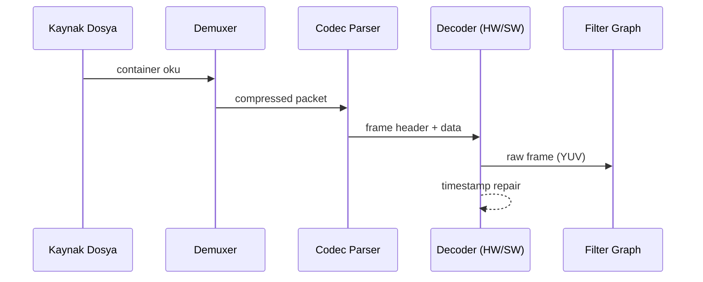
```mermaid
sequenceDiagram
    participant Source as Kaynak Dosya
    participant Demux as Demuxer
    participant Parser as Codec Parser
    participant Decoder as Decoder (HW/SW)
    participant Filter as Filter Graph

    Source->>Demux: container oku
    Demux->>Parser: compressed packet
    Parser->>Decoder: frame header + data
    Decoder->>Filter: raw frame (YUV)
    Decoder-->>Decoder: timestamp repair
```

### Mermaid class

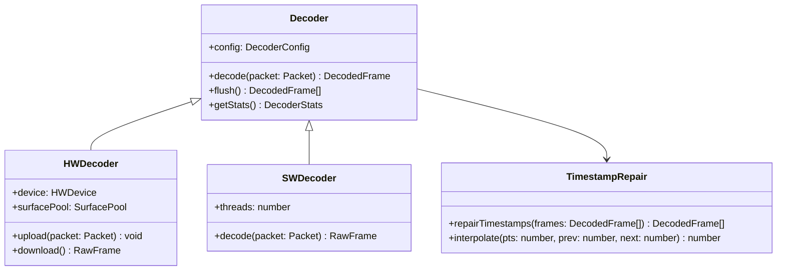
```mermaid
classDiagram
    class Decoder {
        +config: DecoderConfig
        +decode(packet: Packet) DecodedFrame
        +flush() DecodedFrame[]
        +getStats() DecoderStats
    }
    class HWDecoder {
        +device: HWDevice
        +surfacePool: SurfacePool
        +upload(packet: Packet) void
        +download() RawFrame
    }
    class SWDecoder {
        +threads: number
        +decode(packet: Packet) RawFrame
    }
    class TimestampRepair {
        +repairTimestamps(frames: DecodedFrame[]) DecodedFrame[]
        +interpolate(pts: number, prev: number, next: number) number
    }
    Decoder <|-- HWDecoder
    Decoder <|-- SWDecoder
    Decoder --> TimestampRepair
```

### Mermaid state

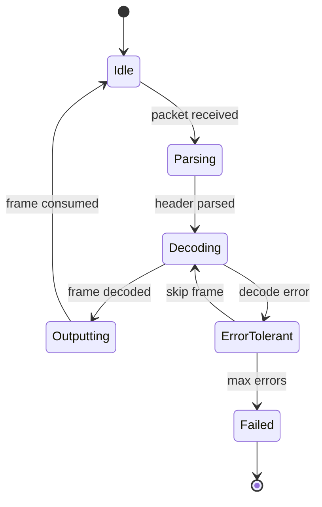
```mermaid
stateDiagram-v2
    [*] --> Idle
    Idle --> Parsing : packet received
    Parsing --> Decoding : header parsed
    Decoding --> Outputting : frame decoded
    Outputting --> Idle : frame consumed
    Decoding --> ErrorTolerant : decode error
    ErrorTolerant --> Decoding : skip frame
    ErrorTolerant --> Failed : max errors
    Failed --> [*]
```

### Production sorunları ve recovery

- **Hardware decoder fallback**: Donanım decoder başarısız olursa otomatik
  olarak software decoder'a geçiş. `hwaccel auto` bu davranışı sağlar.
- **Pixel format uyumsuzluğu**: Decoder çıkış formatı filter graph giriş
  formatı ile uyuşmazsa otomatik dönüşüm eklenir.
- **Timestamp atlamaları**: Bozuk dosyalarda timestamp'ler sıralı olmayabilir.
  `TimestampRepair` interpolasyon ve extrapolasyon yapar.

### Performans, benchmark

Decode hızları (1080p H.264):
- libavcodec: ~500 fps (CPU, 8 thread)
- NVDEC: ~1200 fps (GPU)
- VAAPI: ~800 fps (Intel iGPU)
- D3D11VA: ~900 fps (Windows)

### Gerçek dünya uygulaması

Video player uygulamaları (VLC, mpv) donanım decoding'i varsayılan olarak
kullanır. Web tarayıcıları MediaSource Extensions (MSE) ile donanım
decoding'i otomatik seçer.

### Ölçeklenebilirlik

Hardware decoding tek seferde bir stream decode eder. Birden fazla stream
için birden fazla decoder instance gerekir. NVDEC session limiti
donanıma bağlıdır.

### Ownership ve test

- **Sahip**: Decoder abstraction team
- **Unit test**: Timestamp repair algoritması, pixel format dönüşümü
- **Integration test**: Farklı donanımlarda decode correctness
- **Stress test**: Uzun süreli decode, bellek sızıntısı kontrolü

---

## 5. Mux

### Çalışma mekanizması ve invariantlar

Mux (multiplexing), encode edilmiş stream'leri container formatında birleştirme
işlemidir. Temel invariant: **Container yapısı, seçilen format spec'ine uygun
olmalı ve tüm stream'ler düzgün zaman hizalamasına sahip olmalıdır.**

Container formatları:
- **MP4 (ISOBMFF)**: Atom/Box yapısı. `moov`, `mdat` atomları.
- **MKV**: Esnek, çoklu stream desteği. Chapter markers.
- **WebM**: VP8/VP9 + Opus/Vorbis için optimize.
- **FLV**: Flash tabanlı, eski format.

Faststart: MP4 dosyasında `moov` atomunun dosya başına taşınması.
Bu sayede streaming için dosyanın tamamı indirilmeden oynatma başlayabilir.

### Neden ve alternatifler

| Container | Esneklik | Streaming | Metadata | Boyut |
|-----------|----------|-----------|---------|-------|
| MP4 | Orta | İyi (faststart) | Orta | Orta |
| MKV | Çok yüksek | Orta | Çok yüksek | Büyük |
| WebM | Düşük | İyi | Düşük | Küçük |
| MPEG-TS | Düşük | Çok iyi | Düşük | Büyük |

### Veri akışı

```
Encoded Stream 1 (video)
Encoded Stream 2 (audio)
Metadata (chapters, tags)
    |
    v
[Container Format Engine]
    |
    v
[Atom/Box Writer]
    |
    v
[Container File]
    |
    v
[Optional: faststart moov relocation]
```

### API/interface/model

```typescript
interface MuxConfig {
  format: 'mp4' | 'mkv' | 'webm' | 'avi' | 'mpegts';
  faststart: boolean;
  movflags?: string[]; // 'empty_moov', 'default_base_moof' vb.
  tracks: TrackConfig[];
  chapters?: Chapter[];
  metadata?: Record<string, string>;
  maxMuxingQueueSize: number;
}

interface TrackConfig {
  streamIndex: number;
  codec: string;
  timebase: RationalTime;
  language?: string;
  disposition?: string; // 'default', 'dub', 'visual_impaired'
}

interface Chapter {
  title: string;
  startTime: RationalTime;
  endTime: RationalTime;
}
```

FFmpeg komut argümanları:

Basic MP4 mux:
```
ffmpeg -i video.h264 -i audio.aac -c copy -movflags +faststart output.mp4
```

MKV with chapters:
```
ffmpeg -i video.mkv -i audio.mkv -c copy -metadata title="Video Title" output.mkv
```

MP4 with empty moov:
```
ffmpeg -i video.mp4 -c copy -movflags +faststart+empty_moov output.mp4
```

### Dosya ve klasör yeri

Mux edilmiş dosyalar `output/` altında saklanır. Intermediate stream dosyaları
(decoded veya encode edilmiş ama henüz mux edilmemiş) `intermediates/`
altında tutulur.

### Render pipeline entegrasyonu

Mux, pipeline'ın son adımıdır. Encoder çıkışları ve metadata birleştirilerek
nihai dosya oluşturulur. `map` argümanları ile hangi stream'erin hangi
track'e geleceği belirlenir.

### Mermaid sequence

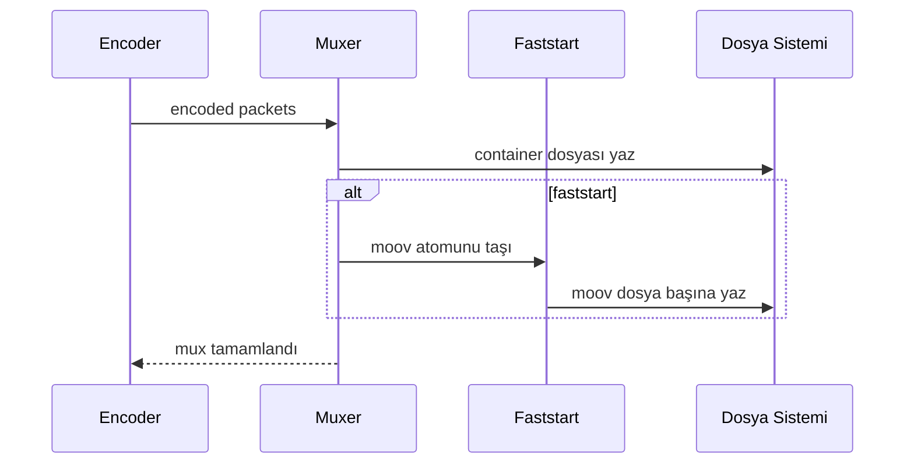
```mermaid
sequenceDiagram
    participant Enc as Encoder
    participant Mux as Muxer
    participant Fast as Faststart
    participant Disk as Dosya Sistemi

    Enc->>Mux: encoded packets
    Mux->>Disk: container dosyası yaz
    alt faststart
        Mux->>Fast: moov atomunu taşı
        Fast->>Disk: moov dosya başına yaz
    end
    Mux-->>Enc: mux tamamlandı
```

### Mermaid class

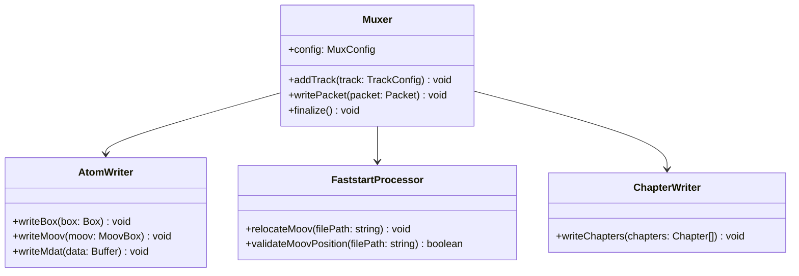
```mermaid
classDiagram
    class Muxer {
        +config: MuxConfig
        +addTrack(track: TrackConfig) void
        +writePacket(packet: Packet) void
        +finalize() void
    }
    class AtomWriter {
        +writeBox(box: Box) void
        +writeMoov(moov: MoovBox) void
        +writeMdat(data: Buffer) void
    }
    class FaststartProcessor {
        +relocateMoov(filePath: string) void
        +validateMoovPosition(filePath: string) boolean
    }
    class ChapterWriter {
        +writeChapters(chapters: Chapter[]) void
    }
    Muxer --> AtomWriter
    Muxer --> FaststartProcessor
    Muxer --> ChapterWriter
```

### Mermaid state

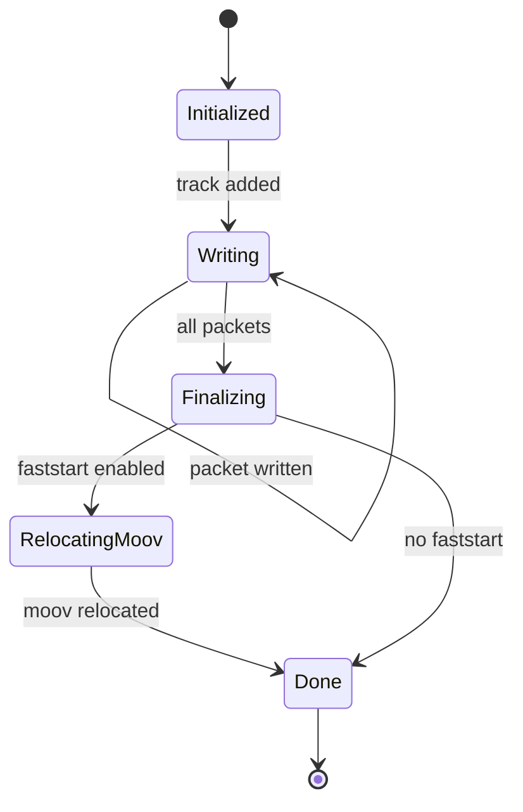
```mermaid
stateDiagram-v2
    [*] --> Initialized
    Initialized --> Writing : track added
    Writing --> Writing : packet written
    Writing --> Finalizing : all packets
    Finalizing --> RelocatingMoov : faststart enabled
    RelocatingMoov --> Done : moov relocated
    Finalizing --> Done : no faststart
    Done --> [*]
```

### Production sorunları ve recovery

- **moov atomu sonda**: Faststart uygulanmazsa streaming başlatılamaz.
  Dosya tamamen indirilmeli. Çözüm: encoding sırasında faststart flag'i.
- **Timestamp overflow**: 32-bit timestamp MP4 için ~26 saat sınırı.
  64-bit atom desteği gerekir.
- **Track count limiti**: Bazı eski player'lar 8+ track'i desteklemez.

### Performans, benchmark

- Mux hızı: ~5000 fps (packet bazlı, CPU-bound değil)
- Faststart: ~2x dosya boyutu kadar disk I/O (kopyalama)

### Gerçek dünya uygulaması

Tüm streaming platformları faststart kullanır. YouTube, Vimeo gibi platformlar
upload sonrası faststart uygulaması yapar.

### Ölçeklenebilirlik

Mux işlemi CPU-bound değildir, I/O-bound'dur. Disk hızı darboğazdır.
SSD'de faststart ~1GB/s hızla çalışır.

### Ownership ve test

- **Sahip**: Container format team
- **Unit test**: Atom yapısı doğrulama, faststart konum kontrolü
- **Integration test**: Farklı player'larda oynatma testi
- **Validation test**: MediaConch ile spec uyumluluk

---

## 6. Demux

### Çalışma mekanizması ve invariantlar

Demux (demultiplexing), container dosyasından ayrı stream'leri çıkarma
işlemidir. Temel invariant: **Demux edilen her stream, orijinal container'daki
zaman hizalamasını korumalıdır.**

Stream selection: Hangi stream'lerin decode edileceğini belirler.
Program/segment detection: MPEG-TS dosyalarında program yapısını algılama.
Encrypted content: DRM ile korumalı içeriklerde key ID ve license management.

### Neden ve alternatifler

| Yaklaşım | Hız | Esneklik | Kullanım |
|----------|-----|----------|----------|
| Full demux | Yavaş | Yüksek | Editing |
| Selective demux | Hızlı | Orta | Player |
| Keyframe index | Çok hızlı | Düşük | Seeking |

### Veri akışı

```
Container File
    |
    v
[Container Parser (MP4/MKV/TS)]
    |
    v
[Stream Index Builder]
    |
    v
[Packet Reader (selected streams)]
    |
    v
[Packet Buffer]
    |
    v
Packets (video, audio, subtitle)
```

### API/interface/model

```typescript
interface DemuxConfig {
  sourcePath: string;
  streamSelection: StreamSelection;
  enableKeyframeIndex: boolean;
  decryptConfig?: DecryptConfig;
}

type StreamSelection =
  | { type: 'all' }
  | { type: 'program'; programId: number }
  | { type: 'streams'; streamIndexes: number[] }
  | { type: 'language'; language: string };

interface StreamInfo {
  index: number;
  codec: string;
  type: 'video' | 'audio' | 'subtitle' | 'data';
  language?: string;
  resolution?: { width: number; height: number };
  duration: RationalTime;
  bitrate: number;
}

interface KeyframeIndex {
  timestamps: number[];
  filePositions: number[];
  gopCount: number;
}
```

FFmpeg komut argümanları:

List streams:
```
ffmpeg -i input.mp4 -show_streams -show_format
```

Selective demux:
```
ffmpeg -i input.mp4 -map 0:v:0 -map 0:a:0 -c copy output.mp4
```

Program selection (MPEG-TS):
```
ffmpeg -i input.ts -map 0:p:1 -c copy output.ts
```

### Dosya ve klasör yeri

Demux config'i `render-plans/{plan-id}.json` içinde saklanır. Keyframe indeksi
`cache/keyframes/{clip-id}.index` formatında tutulur.

### Render pipeline entegrasyonu

Demux, pipeline'ın ilk adımıdır. Doğru stream seçimi,后面 filter graph ve
encoder'ın doğru çalışmasını sağlar. Yanlış stream selection yanlış çıktı üretir.

### Mermaid sequence

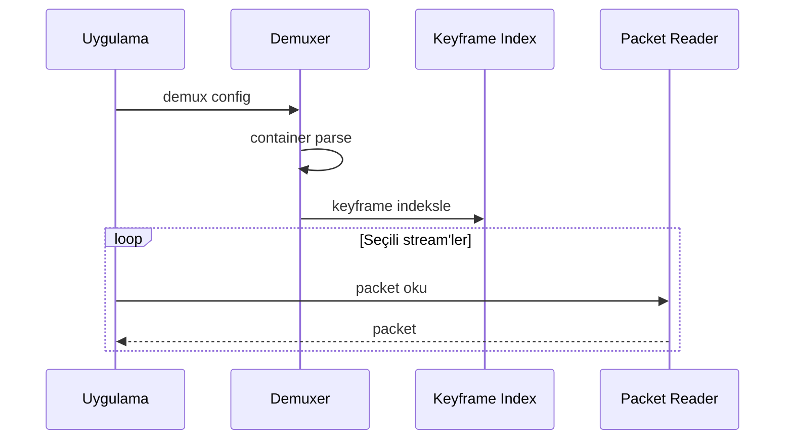
```mermaid
sequenceDiagram
    participant App as Uygulama
    participant Demux as Demuxer
    participant Index as Keyframe Index
    participant Reader as Packet Reader

    App->>Demux: demux config
    Demux->>Demux: container parse
    Demux->>Index: keyframe indeksle
    loop Seçili stream'ler
        App->>Reader: packet oku
        Reader-->>App: packet
    end
```

### Mermaid class

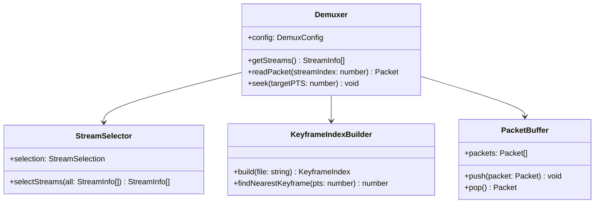
```mermaid
classDiagram
    class Demuxer {
        +config: DemuxConfig
        +getStreams() StreamInfo[]
        +readPacket(streamIndex: number) Packet
        +seek(targetPTS: number) void
    }
    class StreamSelector {
        +selection: StreamSelection
        +selectStreams(all: StreamInfo[]) StreamInfo[]
    }
    class KeyframeIndexBuilder {
        +build(file: string) KeyframeIndex
        +findNearestKeyframe(pts: number) number
    }
    class PacketBuffer {
        +packets: Packet[]
        +push(packet: Packet) void
        +pop() Packet
    }
    Demuxer --> StreamSelector
    Demuxer --> KeyframeIndexBuilder
    Demuxer --> PacketBuffer
```

### Mermaid state

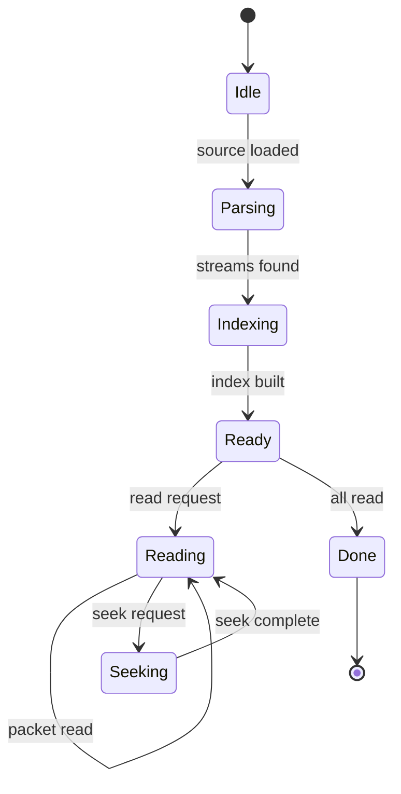
```mermaid
stateDiagram-v2
    [*] --> Idle
    Idle --> Parsing : source loaded
    Parsing --> Indexing : streams found
    Indexing --> Ready : index built
    Ready --> Reading : read request
    Reading --> Reading : packet read
    Reading --> Seeking : seek request
    Seeking --> Reading : seek complete
    Ready --> Done : all read
    Done --> [*]
```

### Production sorunları ve recovery

- **Stream ID değişimi**: Bazı container'larda stream ID'ler dosya içi tutarsız
  olabilir. Çözüm: codec tabanlı stream identification.
- **Encrypted content**: DRM korumalı içeriklerde önce key ID tespit edilmeli,
  ardından license ile decryption key sağlanmalıdır.
- **Seek accuracy**: Keyframe-based seeking'de actual seek noktası ile
  istenen nokta arasında fark olabilir.

### Performans, benchmark

- Demux hızı: ~10000 fps (packet bazlı, sequential read)
- Keyframe index oluşturma: ~100fps (tüm dosya tarama)
- Seek: <10ms (SSD, keyframe index ile)

### Gerçek dünya uygulaması

Video player'lar demux ile stream seçimi yapar. Adaptif streaming'de
aynı anda birden fazla bitrate demux edilir.

### Ölçeklenebilirlik

Demux tek dosya ile sınırlıdır. Birden fazla dosya için paralel demux
uygulanabilir. Large file (>100GB) için chunk-based demux tercih edilir.

### Ownership ve test

- **Sahip**: Container format team
- **Unit test**: Stream selection, keyframe index accuracy
- **Integration test**: Farklı container formatlarında demux correctness
- **Edge test**: Corrupted headers, partial files

---

## 7. FFmpeg

### Çalışma mekanizması ve invariantlar

FFmpeg, video processing'in omurgasıdır. Temel invariant: **FFmpeg CLI çağrısı
deterministic olmalıdır -- aynı argümanlar her zaman aynı davranışı üretmelidir.**

CLI safety: Shell injection riskini önlemek için argümanlar array olarak
geçilmelidir, string olarak değil. `-` prefix'li dosya adları engellenmelidir.

Progress pipe: FFmpeg'in `progress pipe` çıktısı ile real-time izleme yapılabilir.
Bu pipestdout'a bağlanır ve `out_time_us`, `speed`, `drop_frames` gibi
metrikler okunur.

filter_complex: FFmpeg'in filter graph dili. Grafiğin doğru bağlanması
kritiktir -- yanlış bağlama sessiz output veya hata üretir.

map: Hangi input stream'lerinin hangi output stream'lere bağlanacağını belirler.

### Neden ve alternatifler

| Yaklaşım | Avantaj | Dezavantaj |
|-----------|---------|------------|
| FFmpeg CLI | Her yerde çalışır | CLI overhead |
| libav* API | Doğrudan kontrol | Karmaşık, version dependency |
| GStreamer | Plugin tabanlı | Eğri öğrenme, bağımlılık |
| Custom pipeline | Tam kontrol | Sıfırdan yazma |

### Veri akışı

```
CLI Arguments Array
    |
    v
[Argument Parser]
    |
    v
[Input Format Detection]
    |
    v
[Demux -> Decode -> Filter -> Encode -> Mux]
    |
    v
[Progress Pipe Output]
    |
    v
[Exit Code]
```

### API/interface/model

```typescript
interface FfmpegArgs {
  global: string[];      // -y, -hide_banner, -stats vb.
  inputs: InputArg[];    // -i, -ss, -t vb.
  filters: string;       // -filter_complex string
  maps: string[];        // -map 0:v:0 vb.
  outputCodecs: string[];// -c:v, -c:a vb.
  outputOptions: string[];// -preset, -crf vb.
  outputFile: string;
}

interface InputArg {
  path: string;
  seekTo?: string;
  duration?: string;
  hwaccel?: string;
  extraOptions?: string[];
}

function buildCommandArgs(config: FfmpegArgs): string[] {
  const args: string[] = [];
  args.push(...config.global);
  for (const input of config.inputs) {
    if (input.seekTo) args.push('-ss', input.seekTo);
    if (input.duration) args.push('-t', input.duration);
    if (input.hwaccel) args.push('-hwaccel', input.hwaccel);
    args.push('-i', input.path);
    if (input.extraOptions) args.push(...input.extraOptions);
  }
  if (config.filters) args.push('-filter_complex', config.filters);
  args.push(...config.maps);
  args.push(...config.outputCodecs);
  args.push(...config.outputOptions);
  args.push(config.outputFile);
  return args;
}

interface ProgressData {
  frame: number;
  fps: number;
  bitrate: string;
  speed: string;
  outTimeUs: number;
  dropFrames: number;
  totalSize: number;
}
```

FFmpeg komut argümanları (argv array):

Filter complex örneği:
```
[
  "-y", "-hide_banner", "-stats",
  "-hwaccel", "cuda",
  "-i", "input.mp4",
  "-filter_complex",
  "[0:v]scale=1920:1080,fps=30[vout];[0:a]aresample=44100[aout]",
  "-map", "[vout]", "-map", "[aout]",
  "-c:v", "libx264", "-crf", "23", "-preset", "medium",
  "-c:a", "aac", "-b:a", "128k",
  "-movflags", "+faststart",
  "output.mp4"
]
```

Two-pass örneği (pass 1):
```
[
  "-y", "-hide_banner",
  "-i", "input.mp4",
  "-c:v", "libx264", "-b:v", "5M",
  "-pass", "1", "-an", "-f", "null",
  "NUL"
]
```

### Dosya ve klasör yeri

FFmpeg binary'si sistem PATH'inde veya `tools/ffmpeg/` altında olabilir.
Two-pass log dosyaları `intermediates/ffmpeg2pass-0.log` konumuna yazılır.
Progress pipe çıktısı `logs/{session-id}.progress` dosyasına yönlendirilir.

### Render pipeline entegrasyonu

FFmpeg args array, render planın FFmpeg argümanlarına dönüşümü ile oluşturulur.
Her filter, her encoder seçimi, her map yönlendirmesi bu array'de somutlaşır.

### Mermaid sequence

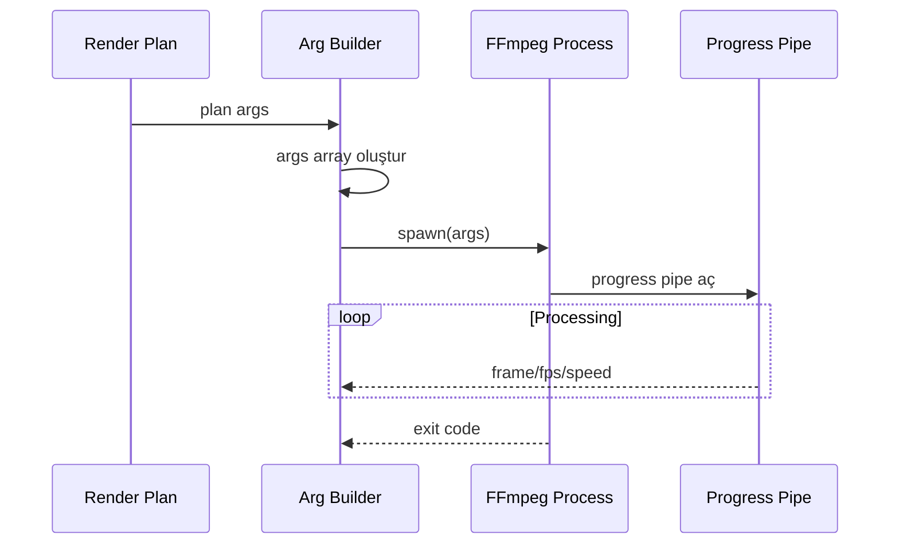
```mermaid
sequenceDiagram
    participant Plan as Render Plan
    participant Builder as Arg Builder
    participant FF as FFmpeg Process
    participant Progress as Progress Pipe

    Plan->>Builder: plan args
    Builder->>Builder: args array oluştur
    Builder->>FF: spawn(args)
    FF->>Progress: progress pipe aç
    loop Processing
        Progress-->>Builder: frame/fps/speed
    end
    FF-->>Builder: exit code
```

### Mermaid class

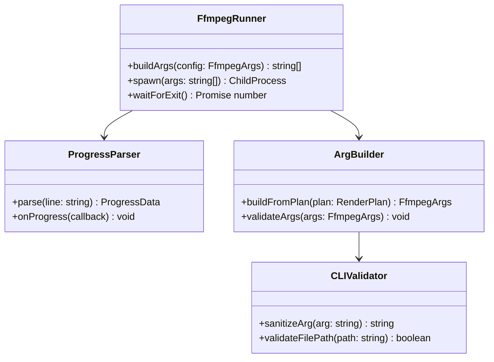
```mermaid
classDiagram
    class FfmpegRunner {
        +buildArgs(config: FfmpegArgs) string[]
        +spawn(args: string[]) ChildProcess
        +waitForExit() Promise number
    }
    class ProgressParser {
        +parse(line: string) ProgressData
        +onProgress(callback) void
    }
    class ArgBuilder {
        +buildFromPlan(plan: RenderPlan) FfmpegArgs
        +validateArgs(args: FfmpegArgs) void
    }
    class CLIValidator {
        +sanitizeArg(arg: string) string
        +validateFilePath(path: string) boolean
    }
    FfmpegRunner --> ArgBuilder
    FfmpegRunner --> ProgressParser
    ArgBuilder --> CLIValidator
```

### Mermaid state

```mermaid
stateDiagram-v2
    [*] --> Built
    Built --> Spawning : spawn
    Spawning --> Running : process started
    Running --> Running : processing
    Running --> Completed : exit 0
    Running --> Failed : exit non-zero
    Running --> Killed : signal received
    Failed --> Retrying : retry enabled
    Retrying --> Spawning
    Completed --> [*]
    Failed --> [*]
    Killed --> [*]
```

### Production sorunları ve recovery

- **Argüman injection**: Shell injection riski. Çözüm: tüm argümanlar array
  olarak geçirilmeli, shell string oluşturulmamalı.
- **FFmpeg version farkları**: Farklı versiyonlarda argüman davranışı değişebilir.
  Çözüm: minimum version kontrolü ve feature detection.
- **Progress pipe deadlock**: Pipe buffer dolduğunda FFmpeg bloke olabilir.
  Çözüm: pipe buffer boyutunun artırılması veya non-okuma.

### Performans, benchmark

FFmpeg spawn overhead: ~5ms (Windows), ~2ms (Linux)
Argüman parse: ~0.1ms
Progress parse: ~0.01ms per line

### Gerçek dünya uygulaması

Tüm video processing pipeline'ları FFmpeg'i veya libav* kütüphanelerini
kullanır. FFmpeg, endüstri standardı araçtır.

### Ölçeklenebilirlik

Her FFmpeg instance bağımsızdır. Parallel encoding için birden fazla
instance başlatılabilir. Instance başına ~200MB bellek kullanımı.

### Ownership ve test

- **Sahip**: FFmpeg integration team
- **Unit test**: Argüman oluşturma, validation, progress parsing
- **Integration test**: Farklı FFmpeg versiyonlarında compat test
- **Security test**: Injection attack testleri

---

## 8. Hardware Acceleration

### Çalışma mekanizması ve invariantlar

Hardware acceleration, encode/decode işlemlerini CPU'dan GPU'ya taşıyarak
performansı artırır. Temel invariant: **Hardware acceleration kullanıldığında,
çıktı kalitesi software processing ile karşılaştırılabilir olmalıdır.**

Abstraction layer: Farklı donanım platformlarını (NVIDIA, Intel, AMD) tek
arayüz altında birleştiren soyutlama katmanı.

hwupload/hwdownload: Kareleri CPU memory'den GPU'ya veya GPU'dan CPU'ya
transfer eden mekanizma.

Device selection: Birden fazla GPU varsa hangisinin kullanılacağını belirleme.

Fallback: Donanım acceleration başarısız olursa otomatik software processing'e
geçiş.

### Neden ve alternatifler

| Platform | Decode | Encode | Filtre | CPU Usage |
|----------|--------|--------|--------|-----------|
| NVIDIA NVDEC/NVENC | Evet | Evet | Sınırlı | Düşük |
| Intel VAAPI | Evet | Evet | Evet | Düşük |
| AMD VAAPI | Evet | Evet | Kısmen | Düşük |
| DXVA2/D3D11VA | Evet | Hayır | Hayır | Düşük |
| VideoToolbox | Evet | Evet | Hayır | Düşük |

### Veri akışı

```
CPU Memory (RAM)
    |
    v
[hwupload] -> GPU Memory (VRAM)
    |
    v
[GPU Processing (decode/encode/filter)]
    |
    v
[hwdownload] -> CPU Memory (RAM)
    |
    v
[Dosya Yazma]
```

### API/interface/model

```typescript
interface HWAccelConfig {
  backend: 'cuda' | 'vaapi' | 'dxva2' | 'd3d11va' | 'videotoolbox' | 'auto';
  device?: string;        // Device path veya index
  fallback: boolean;      // Hata durumunda software'e geç
  uploadMethod: 'auto' | 'explicit';
}

interface HWDevice {
  type: string;
  name: string;
  capabilities: HWCapabilities;
  memory: number; // bytes
}

interface HWCapabilities {
  decodeCodecs: string[];
  encodeCodecs: string[];
  maxResolution: { width: number; height: number };
  pixelFormats: string[];
}
```

FFmpeg komut argümanları:

Auto hardware acceleration:
```
ffmpeg -hwaccel auto -i input.mp4 -c:v h264_cuvid -f null -
```

Explicit device selection:
```
ffmpeg -hwaccel cuda -hwaccel_device 0 -i input.mp4 -c:v h264_nvenc output.mp4
```

VAAPI pipeline:
```
ffmpeg -hwaccel vaapi -hwaccel_device /dev/dri/renderD128 -i input.mp4 -vf 'format=nv12,hwupload' -c:v h264_vaapi output.mp4
```

### Dosya ve klasör yeri

HW device bilgileri runtime'da sorgulanır. Kalıcı depolama gerekmez.
Fallback log'ları `logs/hwaccel-{session}.log` dosyasına yazılır.

### Render pipeline entegrasyonu

HW acceleration, pipeline'ın decode ve encode aşamalarında kullanılır.
Filter grafikleri arasında kare transferi (hwupload/hwdownload) gerekir.
Her transfer bandwidth cost'u vardır.

### Mermaid sequence

```mermaid
sequenceDiagram
    participant App as Uygulama
    participant HAL as HW Abstraction Layer
    participant HW as Donanım (GPU)
    participant Fallback as Software Fallback

    App->>HAL: HW accel config
    HAL->>HW: device sorgula
    HW-->>HAL: capabilities
    alt HW available
        HAL->>HW: processing başlat
        HW-->>HAL: sonuç
    else HW unavailable
        HAL->>Fallback: software processing
        Fallback-->>HAL: sonuç
    end
    HAL-->>App: sonuç
```

### Mermaid class

```mermaid
classDiagram
    class HWAccelManager {
        +backends: HWBackend[]
        +detect() HWDevice[]
        +createSession(device: HWDevice) HWSession
    }
    class HWBackend {
        +name: string
        +isAvailable() boolean
        +getDevices() HWDevice[]
    }
    class HWSession {
        +device: HWDevice
        +upload(frame: RawFrame) HWFrame
        +download(hwFrame: HWFrame) RawFrame
        +close() void
    }
    class HWFallback {
        +isEnabled: boolean
        +fallback(session: HWSession) SWSession
    }
    HWAccelManager --> HWBackend
    HWAccelManager --> HWSession
    HWSession --> HWFallback
```

### Mermaid state

```mermaid
stateDiagram-v2
    [*] --> Detecting
    Detecting --> Available : device found
    Detecting --> Unavailable : no device
    Available --> Uploading : hwupload
    Uploading --> Processing : frame on GPU
    Processing --> Downloading : hwdownload
    Downloading --> Uploading : next frame
    Unavailable --> SoftwareFallback
    SoftwareFallback --> Processing
    Available --> Error : device error
    Error --> SoftwareFallback : fallback enabled
    Error --> Failed : fallback disabled
    Failed --> [*]
```

### Production sorunları ve recovery

- **GPU memory exhaustion**: Yeterli VRAM yoksa hwupload başarısız olur.
  Çözüm: batch processing veya proxy resolution'a düşürme.
- **Driver uyumsuzluğu**: Eski driver'lar yeni codec'leri desteklemez.
  Çözüm: minimum driver version kontrolü.
- **Multi-GPU routing**: Birden fazla GPU varsa load balancing gerekir.
  Çözüm: device affinity ayarlama.

### Performans, benchmark

HW vs SW decode (1080p H.264):
- CPU decode: ~500 fps, ~80% CPU
- NVDEC decode: ~1200 fps, ~5% CPU
- VAAPI decode: ~800 fps, ~10% CPU

HW vs SW encode (1080p H.264):
- CPU encode: ~120 fps, ~100% CPU
- NVENC encode: ~600 fps, ~10% CPU
- VAAPI encode: ~400 fps, ~15% CPU

### Gerçek dünya uygulaması

Tüm büyük video platformları hardware acceleration kullanır.
Netflix, YouTube encoding pipeline'ları %90+ GPU tabanlıdır.

### Ölçeklenebilirlik

Her GPU device paralel olarak çalışabilir. Multi-GPU sistemlerde
device assignment ile ölçeklendirme yapılabilir. NVENC session limiti
donanıma bağlıdır.

### Ownership ve test

- **Sahip**: Hardware acceleration team
- **Unit test**: Device detection, capability matching
- **Integration test**: Farklı GPU modellerinde test
- **Regression test**: Driver upgrade sonrası compat test

---

## 9. NVENC

### Çalışma mekanizması ve invariantlar

NVENC, NVIDIA GPU'larında bulunan donanım video encoder'dır.
Temel invariant: **NVENC session limiti aşılmamalıdır. Her session bir encoder
context oluşturur ve VRAM harcar.**

Session limits: Consumer GPU'larda genellikle 3-5 concurrent session,
professional GPU'larda 16+ session desteği.

Surface pool: Encode için GPU memory'de framebuffer havuzu. Yeterli surface
olmazsa encoding bloke olur.

Lookahead: NVENC'in gelecek kareleri analiz ederek daha iyi rate control
yapmasını sağlayan özellik.

Temporal AQ: Zamansal olarak adaptive quantization uygulayan NVENC özelliği.

### Neden ve alternatifler

| NVENC Feature | Avantaj | Dezavantaj |
|---------------|---------|------------|
| High speed | ~600 fps | Kalite libx264'ten düşük |
| Low CPU usage | ~10% CPU | GPU resource tüketir |
| Lookahead | Better quality | Increased latency |
| Multi-pass | Better rate control | Daha yavaş |

### Veri akışı

```
CPU Frames
    |
    v
[hwupload to GPU]
    |
    v
[Surface Pool (NVENC)]
    |
    v
[Lookahead Buffer (opsiyonel)]
    |
    v
[NVENC Hardware Encoder]
    |
    v
[Encoded Bitstream (CPU)]
    |
    v
[Mux/Output]
```

### API/interface/model

```typescript
interface NVENCConfig {
  preset: 'p1' | 'p2' | 'p3' | 'p4' | 'p5' | 'p6' | 'p7' |
          'slow' | 'medium' | 'fast' | 'hp' | 'hq' | 'll' | 'llhq' | 'llhp';
  tune: 'hq' | 'll' | 'ull';
  profile: 'baseline' | 'main' | 'high' | 'high444p';
  bFrames: number; // 0-4
  lookahead: number; // 0-32 frames
  temporalAQ: boolean;
  multipass: 'none' | 'quarter_res' | 'full_res';
  rateControl: 'constqp' | 'cbr' | 'vbr' | 'cbr_llhp';
  gpuIndex: number;
  maxSurfacePoolSize: number;
}
```

FFmpeg komut argümanları:

Basic NVENC:
```
ffmpeg -hwaccel cuda -i input.mp4 -c:v h264_nvenc -preset medium -rc constqp -qp 23 output.mp4
```

NVENC with lookahead and temporal AQ:
```
ffmpeg -hwaccel cuda -i input.mp4 -c:v h264_nvenc -preset p5 -rc vbr -b:v 5M -lookahead 32 -temporal-aq 1 output.mp4
```

Multi-pass NVENC:
```
ffmpeg -hwaccel cuda -i input.mp4 -c:v h264_nvenc -preset p4 -multipass fullres -rc vbr -b:v 8M output.mp4
```

### Dosya ve klasör yeri

NVENC session bilgileri runtime'da yönetilir. Session log'ları
`logs/nvenc-{session}.log` dosyasına yazılır. Surface pool bellek
içinde yönetilir, disk depolaması gerektirmez.

### Render pipeline entegrasyonu

NVENC, pipeline'ın encode aşamasında kullanılır. hwupload ile kareler
GPU'ya yüklenir, NVENC encode eder, bitstream CPU'ya indirilir.
Multi-stream encoding için her stream ayrı NVENC session kullanır.

### Mermaid sequence

```mermaid
sequenceDiagram
    participant App as Uygulama
    participant Pool as Surface Pool
    participant Look as Lookahead Buffer
    participant Enc as NVENC Encoder

    App->>Pool: surface ata
    Pool->>Look: frame yükle
    Look->>Enc: lookahead analizi
    Enc->>Pool: encoded bitstream
    Pool-->>App: output
```

### Mermaid class

```mermaid
classDiagram
    class NVENCEncoder {
        +config: NVENCConfig
        +session: NVENCSession
        +encode(frame: HWFrame) EncodedUnit
        +getStats() NVENCStats
    }
    class NVENCSession {
        +encoder: any
        +surfacePool: SurfacePool
        +create() void
        +destroy() void
    }
    class SurfacePool {
        +surfaces: HWFrame[]
        +acquire() HWFrame
        +release(surface: HWFrame) void
    }
    class LookaheadBuffer {
        +frames: HWFrame[]
        +analyze() RateDecision
    }
    NVENCEncoder --> NVENCSession
    NVENCSession --> SurfacePool
    NVENCSession --> LookaheadBuffer
```

### Mermaid state

```mermaid
stateDiagram-v2
    [*] --> Idle
    Idle --> AcquiringSurface : frame ready
    AcquiringSurface --> Encoding : surface acquired
    Encoding --> Lookahead : lookahead enabled
    Lookahead --> Encoding : decision made
    Encoding --> ReleasingSurface : encoded
    ReleasingSurface --> Idle : surface released
    Encoding --> Error : encode failure
    Error --> Idle : surface released
```

### Production sorunları ve recovery

- **Session limiti aşıldı**: Yeni session oluşturulamaz.
  Çözüm: mevcut session'ları yeniden kullan veya software fallback.
- **Surface pool starvation**: Yeterli surface yoksa encoding bloke olur.
  Çözüm: pool boyutunu artır veya pipeline'ı yavaşlat.
- **GPU thermal throttling**: GPU sıcaklığı düşünce performans düşer.
  Çözüm: thermal monitoring ve adaptive quality.

### Performans, benchmark

NVENC encoding hızları (1080p H.264):
- P1 preset: ~800 fps
- P4 preset: ~600 fps
- P7 preset: ~300 fps
- With lookahead: ~250 fps (P5)
- Multi-pass: ~150 fps (P4, fullres)

### Gerçek dünya uygulaması

Twitch, YouTube Live streaming NVENC kullanır. Real-time encoding
gerektiren uygulamalarda NVENC tercih edilir.

### Ölçeklenebilirlik

Consumer GPU: 3-5 concurrent NVENC session
Professional GPU (Quadro): 16+ concurrent session
Data center GPU (A100): Sınırsız session

### Ownership ve test

- **Sahip**: NVIDIA encoding team
- **Unit test**: Session management, surface pool allocation
- **Integration test**: Farklı GPU modellerinde encoding correctness
- **Performance test**: Throughput ve latency ölçümü

---

## 10. CUDA

### Çalışma mekanizması ve invariantlar

CUDA, NVIDIA GPU'larında genel amaçlı hesaplama platformudur.
Video processing'de CUDA, zero-copy transfer ve NVENC interop için kullanılır.

Zero-copy: CPU ve GPU arasında veri kopyalamadan doğrudan erişim.
`cudaHostAlloc` ile pinned memory kullanılır.

NVENC interop: CUDA stream'leri doğrudan NVENC'e bağlanarak veri transferi
minimuma indirilir.

Compute vs encode: CUDA compute kernels video processing filtreleri için
kullanılırken, NVENC encode için ayrı bir birimdir.

Stream management: CUDA streams ile paralel işlemler yönetilir.

### Neden ve alternatifler

| Yaklaşım | Hız | Esneklik | Kullanım |
|----------|-----|----------|----------|
| CUDA compute | Yüksek | Yüksek | Filtre processing |
| NVENC interop | Çok yüksek | Düşük | Encode pipeline |
| OpenCL | Orta | Yüksek | Cross-platform |
| CPU processing | Düşük | Yüksek | Fallback |

### Veri akışı

```
CPU Memory (Pinned)
    |
    v
[CUDA Stream] -> GPU Memory
    |
    v
[CUDA Compute Kernel] (opsiyonel filtre)
    |
    v
[NVENC Interop]
    |
    v
[Encoded Output]
```

### API/interface/model

```typescript
interface CUDAConfig {
  deviceIndex: number;
  streamCount: number;
  pinnedMemory: boolean;
  zeroCopy: boolean;
  interopMode: 'nvenc' | 'compute' | 'auto';
}

interface CUDAStream {
  id: number;
  memory: CUDAMemory;
  synchronize(): Promise<void>;
}

interface CUDAMemory {
  allocate(size: number): void;
  upload(data: Buffer): void;
  download(): Buffer;
  free(): void;
  zeroCopy: boolean;
}
```

FFmpeg komut argümanları:

CUDA with NVENC:
```
ffmpeg -hwaccel cuda -hwaccel_output_format cuda -i input.mp4 -c:v h264_nvenc -c:a copy output.mp4
```

CUDA scale filter:
```
ffmpeg -hwaccel cuda -i input.mp4 -vf "scale_cuda=1920:1080" -c:v h264_nvenc output.mp4
```

CUDA resize and format:
```
ffmpeg -hwaccel cuda -i input.mp4 -vf "scale_cuda=1280:720,format=nv12" -c:v h264_nvenc output.mp4
```

### Dosya ve klasör yeri

CUDA bellek yönetimi tamamen runtime'da gerçekleşir. Kalıcı depolama gerekmez.
CUDA log'ları `logs/cuda-{session}.log` dosyasına yazılabilir.

### Render pipeline entegrasyonu

CUDA, pipeline'ın decode-filter-encode zincirini GPU'da tutar.
hwupload ile CPU memory'den GPU'ya transfer, CUDA ile GPU processing,
bitstream out ile CPU'ya dönüş.

### Mermaid sequence

```mermaid
sequenceDiagram
    participant CPU as CPU (Pinned Memory)
    participant CUDA as CUDA Stream
    participant Compute as CUDA Kernel
    participant NVENC as NVENC

    CPU->>CUDA: zero-copy transfer
    alt compute needed
        CUDA->>Compute: kernel execute
        Compute->>CUDA: result
    end
    CUDA->>NVENC: interop
    NVENC-->>CPU: encoded bitstream
```

### Mermaid class

```mermaid
classDiagram
    class CUDAContext {
        +device: number
        +streams: CUDAStream[]
        +memory: CUDAMemory
        +init() void
        +cleanup() void
    }
    class CUDAStream {
        +id: number
        +sync() Promise
        +memcpyAsync(src, dst) void
    }
    class CUDAMemory {
        +pinned: boolean
        +zeroCopy: boolean
        +alloc(size) void
        +upload(buf) void
        +download() Buffer
    }
    class NVENCInterop {
        +bindStream(stream: CUDAStream) void
        +getSurface() NVENCSurface
    }
    CUDAContext --> CUDAStream
    CUDAContext --> CUDAMemory
    CUDAStream --> NVENCInterop
```

### Mermaid state

```mermaid
stateDiagram-v2
    [*] --> Initialized
    Initialized --> Allocating : memory request
    Allocating --> Ready : memory allocated
    Ready --> Uploading : data ready
    Uploading --> Computing : compute needed
    Computing --> Encoding : kernel done
    Encoding --> Downloading : encode done
    Downloading --> Ready : data available
    Ready --> Freeing : cleanup
    Freeing --> [*]
```

### Production sorunları ve recovery

- **Pinned memory exhaustion**: Fazla pinned memory system performansını
  düşürür. Çözüm: pinned memory pool ile sınırlama.
- **CUDA context corruption**: Hatalı kernel çağrısı context'i bozabilir.
  Çözüm: context per-session isolation.
- **Stream synchronization**: Yetersiz sync veri yarış koşullarına yol açar.
  Çözüm: her pipeline stage arasında explicit sync.

### Performans, benchmark

CUDA zero-copy transfer: ~12 GB/s (PCIe 3.0 x16)
CUDA kernel execution: filter-dependent
NVENC interop latency: <1ms per frame

### Gerçek dünya uygulaması

NVIDIA video processing SDK, CUDA + NVENC entegrasyonu için resmi
kütüphane sağlar. Video analytics pipeline'ları CUDA compute kullanır.

### Ölçeklenebilirlik

CUDA streams paralel çalışır. Multi-GPU için ayrı CUDA context'ler
gerekir. Stream sayısı donanıma bağlıdır (genellikle 32-128).

### Ownership ve test

- **Sahip**: GPU computing team
- **Unit test**: Memory allocation, stream sync, kernel correctness
- **Integration test**: NVENC interop, zero-copy validation
- **Stress test**: Uzun süreli GPU processing, bellek sızıntısı

---

## 11. VAAPI

### Çalışma mekanizması ve invariantlar

VAAPI (Video Acceleration API), Linux'ta Intel ve AMD GPU'ları için
donanım video processing API'sidir.

DRM device: Linux Direct Rendering Manager cihazı. VAAPI için gerekli.
Genellikle `/dev/dri/renderD128` yolunda bulunur.

vaapi encode/decode: VAAPI'nin encode ve decode yetenekleri.
Intel GPU'larda çok geniş codec desteği, AMD'de daha sınırlı.

Filter integration: VAAPI filtreleri GPU memory'de çalışır, CPU'ya
transfer gerekmez.

Intel/AMD support: Intel'de çok geniş destek, AMD'de temel destek.

### Neden ve alternatifler

| Özellik | Intel VAAPI | AMD VAAPI | NVIDIA |
|---------|-------------|-----------|--------|
| Decode | Geniş | Temel | NVDEC |
| Encode | Geniş | Temel | NVENC |
| Filtre | Evet | Kısmen | Hayır |
| DRM integration | Evet | Evet | Hayır |

### Veri akışı

```
DRM Device
    |
    v
[vaapi init (Intel/AMD driver)]
    |
    v
[Surface allocation]
    |
    v
[vaapi decode/encode]
    |
    v
[vaapi filter (opsiyonel)]
    |
    v
[DRM output]
```

### API/interface/model

```typescript
interface VAAPIConfig {
  device: string; // DRM device path
  driver: 'iHD' | 'i965' | 'radeonsi';
  renderNode: string;
  kernelDRM: string;
}

interface VAAPIProfile {
  profile: string;
  entrypoints: string[];
  maxResolution: { width: number; height: number };
  maxFrames: number;
}

interface VAAPISurface {
  id: number;
  width: number;
  height: number;
  format: string;
}
```

FFmpeg komut argümanları:

VAAPI decode:
```
ffmpeg -hwaccel vaapi -hwaccel_device /dev/dri/renderD128 -i input.mp4 -c:v h264_vaapi -vf 'format=nv12,hwdownload' output.mp4
```

VAAPI encode:
```
ffmpeg -i input.mp4 -vf 'format=nv12,hwupload' -vaapi_device /dev/dri/renderD128 -c:v h264_vaapi -qp 23 output.mp4
```

VAAPI full pipeline:
```
ffmpeg -hwaccel vaapi -hwaccel_device /dev/dri/renderD128 -i input.mp4 -vf 'format=nv12,hwupload,vaapi_h264' -c:v h264_vaapi -qp 23 -c:a copy output.mp4
```

### Dosya ve klasör yeri

DRM device bilgileri `/sys/class/drm/` altında sorgulanabilir.
VAAPI driver config dosyaları `/etc/libva/` konumunda bulunur.
VAAPI log'ları `LIBVA_DEBUG_LOG` environment variable ile ayarlanır.

### Render pipeline entegrasyonu

VAAPI, pipeline'ın decode ve encode aşamalarında kullanılır.
hwupload ile CPU memory'den GPU'ya transfer, VAAPI processing,
hwdownload ile CPU'ya dönüş. VAAPI filtreleri GPU'da kalır.

### Mermaid sequence

```mermaid
sequenceDiagram
    participant App as Uygulama
    participant DRM as DRM Device
    participant VA as VAAPI Driver
    participant Surface as VA Surface

    App->>DRM: device open
    DRM->>VA: vaInitialize
    VA->>Surface: surface allocate
    loop Processing
        App->>Surface: hwupload
        Surface->>VA: vaapi process
        VA-->>Surface: result
    end
    Surface-->>App: hwdownload
```

### Mermaid class

```mermaid
classDiagram
    class VAAPIManager {
        +device: DRMDevice
        +driver: VAAPIDriver
        +init(devicePath: string) void
        +getProfiles() VAAPIProfile[]
    }
    class DRMDevice {
        +path: string
        +fd: number
        +open() void
        +close() void
    }
    class VAAPIDriver {
        +name: string
        +version: string
        +isAvailable() boolean
    }
    class VAAPISurfacePool {
        +surfaces: VAAPISurface[]
        +allocate() VAAPISurface
        +release(surface: VAAPISurface) void
    }
    VAAPIManager --> DRMDevice
    VAAPIManager --> VAAPIDriver
    VAAPIManager --> VAAPISurfacePool
```

### Mermaid state

```mermaid
stateDiagram-v2
    [*] --> Initializing
    Initializing --> Ready : vaInitialize ok
    Initializing --> Failed : driver error
    Ready --> Uploading : hwupload
    Uploading --> Processing : vaapi process
    Processing --> Downloading : process done
    Downloading --> Ready : data available
    Ready --> Cleanup : close
    Cleanup --> [*]
    Failed --> [*]
```

### Production sorunları ve recovery

- **DRM device permission**: `/dev/dri/renderD128` erişim izni gerekir.
  Çözüm: `video` grubuna ekleme veya udev rules.
- **Driver uyumsuzluğu**: Eski driver'lar yeni codec'leri desteklemez.
  Çözüm: minimum driver version kontrolü (libva >= 2.10).
- **Intel/AMD davranış farkları**: Aynı VAAPI API, farklı sürücülerde
  farklı davranabilir. Çözüm: driver-specific workarounds.

### Performans, benchmark

VAAPI vs Software (1080p H.264):
- Software decode: ~500 fps
- VAAPI decode: ~800 fps
- Software encode: ~120 fps
- VAAPI encode: ~400 fps

### Gerçek dünya uygulaması

Linux tabanlı media server'lar (Jellyfin, Plex) VAAPI kullanır.
Chrome ve Firefox tarayıcıları VAAPI ile donanım decoding destekler.

### Ölçeklenebilirlik

VAAPI tek device ile sınırlıdır. Multi-device için ayrı init gerekir.
Intel iGPU tek stream, AMD dGPU birden fazla stream destekler.

### Ownership ve test

- **Sahip**: Linux video acceleration team
- **Unit test**: DRM device detection, profile matching
- **Integration test**: Intel/AMD GPU'larında encoding/decoding correctness
- **Compliance test**: VA-API spec uyumluluk

---

## 12. DirectX Video Acceleration

### Çalışma mekanizması ve invariantlar

DirectX Video Acceleration (DXVA), Windows platformunda donanım video
processing API'sidir.

D3D11VA: DirectX 11 tabanlı video acceleration. Modern Windows'ta tercih edilen.
DXVA2: Eski DirectX 9 tabanlı video acceleration. Legacy support için.

Windows-specific: Bu API'lar sadece Windows'ta çalışır.

Hardware adapter enum: Sisteme bağlı tüm GPU'ları listeleme ve seçim.

### Neden ve alternatifler

| Özellik | D3D11VA | DXVA2 | VAAPI |
|---------|---------|-------|-------|
| Platform | Windows | Windows | Linux |
| Decode | Geniş | Orta | Geniş |
| Encode | Hayır | Hayır | Evet |
| Filtre | Kısmen | Hayır | Evet |
| Modern API | Evet | Hayır | Evet |

### Veri akışı

```
Windows Graphics Stack
    |
    v
[DXGI Adapter Enum]
    |
    v
[D3D11 Device]
    |
    v
[Video Decoder]
    |
    v
[D3D11 Texture]
    |
    v
[Renderer or hwdownload]
```

### API/interface/model

```typescript
interface DXVAConfig {
  api: 'd3d11va' | 'dxva2';
  adapterIndex: number;
  deviceType: 'hardware' | 'warp' | 'reference';
  threaded: boolean;
}

interface D3D11Adapter {
  index: number;
  name: string;
  vendorId: number;
  deviceId: number;
  dedicatedVideoMemory: number;
  sharedVideoMemory: number;
  featureLevel: string;
}

interface D3D11Device {
  adapter: D3D11Adapter;
  context: any;
  videoDevice: any;
  createDecoder(config: VideoDecoderConfig): D3D11Decoder;
}

interface D3D11Decoder {
  decode(packet: Packet): D3D11Texture;
  getOutputTexture(): D3D11Texture;
  releaseTexture(texture: D3D11Texture): void;
}
```

FFmpeg komut argümanları:

D3D11VA decode:
```
ffmpeg -hwaccel d3d11va -i input.mp4 -c:v h264_d3d11va -f null -
```

DXVA2 decode:
```
ffmpeg -hwaccel dxva2 -i input.mp4 -c:v h264_dxva2 -f null -
```

D3D11VA with output:
```
ffmpeg -hwaccel d3d11va -hwaccel_output_format d3d11 -i input.mp4 -c:v h264_d3d11va -f null -
```

### Dosya ve klasör yeri

D3D11 adapter bilgileri Windows API ile runtime'da sorgulanır.
DXVA config registry altında saklanabilir: `HKLM\SOFTWARE\Microsoft\DXVA`.
Log'lar `logs/dxva-{session}.log` dosyasına yazılır.

### Render pipeline entegrasyonu

D3D11VA, pipeline'ın decode aşamasında kullanılır. Çıktı texture
olarak D3D11 device'ta kalır. Encode için NVIDIA kullanılıyorsa
D3D11-NVENC interop mümkündür.

### Mermaid sequence

```mermaid
sequenceDiagram
    participant App as Uygulama
    participant DXGI as DXGI Adapter Enum
    participant D3D11 as D3D11 Device
    participant Decoder as Video Decoder
    participant Texture as D3D11 Texture

    App->>DXGI: adapter listesi
    DXGI-->>App: adapters
    App->>D3D11: device oluştur
    D3D11->>Decoder: decoder başlat
    loop Processing
        Decoder->>Texture: decode
        Texture-->>App: texture
    end
```

### Mermaid class

```mermaid
classDiagram
    class DXVAManager {
        +adapters: D3D11Adapter[]
        +enumAdapters() D3D11Adapter[]
        +createDevice(adapter: D3D11Adapter) D3D11Device
    }
    class D3D11Adapter {
        +index: number
        +name: string
        +dedicatedVideoMemory: number
        +featureLevel: string
    }
    class D3D11Device {
        +adapter: D3D11Adapter
        +createDecoder(config) D3D11Decoder
        +getImmediateContext() void
    }
    class D3D11Decoder {
        +decode(packet: Packet) D3D11Texture
        +releaseTexture(texture) void
    }
    DXVAManager --> D3D11Adapter
    DXVAManager --> D3D11Device
    D3D11Device --> D3D11Decoder
```

### Mermaid state

```mermaid
stateDiagram-v2
    [*] --> Enumerating
    Enumerating --> DeviceCreated : adapter selected
    Enumerating --> NoDevice : no adapter
    DeviceCreated --> Decoding : decoder created
    Decoding --> Decoding : frame decoded
    Decoding --> Flush : last frame
    Flush --> Done : all flushed
    NoDevice --> SoftwareFallback
    SoftwareFallback --> Done
    Done --> [*]
```

### Production sorunları ve recovery

- **No hardware adapter**: Bazı sistemlerde dedicated GPU yok.
  Çözüm: WARP (software) adapter veya CPU fallback.
- **Feature level yetersiz**: Eski GPU'lar D3D11 feature level 11.0
  desteklemez. Çözüm: feature level kontrolü.
- **Multi-monitor conflict**: Birden fazla monitor farklı adapter
  kullanabilir. Çözüm: adapter affinity ayarlama.

### Performans, benchmark

D3D11VA vs Software (1080p H.264):
- Software decode: ~500 fps
- D3D11VA decode: ~900 fps
- CPU usage: %80 (SW) vs %10 (D3D11VA)

### Gerçek dünya uygulaması

Windows Media Player, Edge, Chrome tarayıcıları D3D11VA kullanır.
Oyun stream servisleri (GeForce Now, Stadia) video decoding için
D3D11VA entegrasyonu sağlar.

### Ölçeklenebilirlik

Her D3D11 device tek decode session destekler. Multi-GPU Windows
 sistemlerinde adapter selection ile parallel decode mümkün.

### Ownership ve test

- **Sahip**: Windows video acceleration team
- **Unit test**: Adapter enumeration, device creation, feature level check
- **Integration test**: Farklı GPU modellerinde decode correctness
- **Compliance test**: DXVA2/D3D11VA spec uyumluluk

---

## Ek: Ortak Veri Yapıları ve Toleranslar

### Ortak veri yapıları

```typescript
interface RationalTime {
  numerator: number;
  denominator: number;
}

interface Resolution {
  width: number;
  height: number;
}

interface BitstreamPacket {
  data: Buffer;
  pts: number;
  dts: number;
  duration: number;
  isKeyframe: boolean;
  streamIndex: number;
  flags: string[];
}

interface PipelineContext {
  sessionId: string;
  startTime: number;
  sourceFile: string;
  tempDir: string;
  maxMemoryBytes: number;
  timeoutMs: number;
}
```

### Tolerans değerleri

| Parametre | Tolerans | Açıklama |
|-----------|----------|----------|
| PTS hizalama | ±1 frame | Ses-video senkronizasyonu |
| Bitrate hedef | ±10% | Rate control toleransı |
| CRF kalite | ±0.5 | Perceptual kalite |
| Seek accuracy | ±1 GOP | Keyframe-based seeking |
| Resolution | ±0 pixel | Kesin eşleşme |
| Frame rate | ±0.001 fps | Zaman bazlı processing |

### Karar matrisi

| Durum | Karar | Gerekçe |
|-------|-------|---------|
| HW decode mevcut, SW decode gerekli | HW tercih | Performans |
| CRF vs CBR | CRF tercih | Genel kullanım |
| Single-pass vs Two-pass | Single-pass tercih | Hız |
| H.264 vs H.265 | H.264 tercih | Uyumluluk |
| MP4 vs MKV | MP4 tercih | Streaming |
| D3D11VA vs DXVA2 | D3D11VA tercih | Modern API |
