# Video Engine SDD 02: Timeline, Altyazı ve Motion Graphics

**Durum:** Tasarım onayına hazır  
**Kapsam:** 13 Timeline Engine, 14 Subtitle Engine, 15 Subtitle Animation, 16 Word Level Timing, 17 Caption Rendering, 18 ASS Subtitle, 19 SRT, 20 Template Engine, 21 Motion Graphics, 22 Keyframe Animation, 23 Bezier Curves, 24 Face Tracking  
**Normatif dil:** “MUST/ZORUNLU”, “SHOULD/ÖNERİLİR” ve “MAY/OPSİYONEL” ifadeleri bağlayıcı karar seviyesini belirtir.  
**Temel sözleşme:** `ClipSpec v1 -> şema doğrulama -> normalizasyon/compiler -> immutable ve deterministik RenderPlan DAG -> FFmpeg/libav render`.

---

## 1. Amaç ve Sınırlar

Bu belge, bir klibin zamansal kurgusunu, altyazı üretimini, hareketli grafiklerini ve yüz takibine bağlı yerleşimini aynı deterministik render planında birleştiren üretim mimarisini tanımlar. Python kontrol düzlemi iş kabulü, doğrulama, derleme, analiz ve orkestrasyondan; FFmpeg/libav veri düzlemi decode, filtreleme, compositing, subtitle burn-in, audio mix ve encode işlemlerinden sorumludur.

Tasarımın hedefleri:

- Aynı `ClipSpec`, asset byte içeriği, font paketi, model sürümü ve engine sürümü için byte düzeyinde olmasa bile frame/pixel toleransları içinde aynı çıktıyı üretmek.
- Zamanı hiçbir aşamada IEEE-754 kayan noktalı sayı ile kanonik olarak saklamamak.
- Timeline, caption, animation ve tracking sonuçlarını mutable çalışma durumundan ayırıp içerik adresli immutable artefact olarak saklamak.
- Önizleme ve final render arasında aynı `RenderPlan` semantiğini kullanmak; yalnız kalite profili ve proxy asset seçimi değişebilir.
- Kubernetes üzerinde yatay ölçeklenebilir, Temporal ile tekrar çalıştırılabilir, PostgreSQL ve S3 ile izlenebilir bir üretim hattı sağlamak.

Kapsam dışı:

- ASR modelinin eğitimi; sistem yalnız sürümlenmiş ASR/forced-alignment modellerini çalıştırır.
- Genel amaçlı NLE kullanıcı arayüzü; bu belge backend sözleşmelerini tanımlar.
- DRM korumalı font veya medya çözme.
- Canlı yayın için sub-frame gecikmeli gerçek zamanlı compositing; tanımlanan önizleme profili near-real-time olabilir, final render batch çalışır.

## 2. Ortak Mimari Kararları

### 2.1 Bileşenler

| Katman | Teknoloji | Sorumluluk |
|---|---|---|
| Public API | Python, FastAPI/Pydantic | `ClipSpec v1` kabulü, auth, quota, idempotency key |
| Control plane | Python | doğrulama, normalizasyon, compiler, cache anahtarı, RenderPlan üretimi |
| Workflow | Temporal | retry, timeout, heartbeat, fan-out/fan-in, compensation |
| Metadata | PostgreSQL | job, spec, plan, artefact, model/font/template sürümü, lineage |
| Object store | S3 | kaynak medya, proxy, analiz çıktısı, font paketi, plan, render |
| Render plane | FFmpeg/libav | decode, filtergraph, libass burn-in, composite, encode |
| Text stack | libass, HarfBuzz, FreeType, ICU | shaping, bidi, line break, glyph rasterization |
| Analysis | OpenCV, MediaPipe, ONNX Runtime, TensorRT | shot boundary, face detection/tracking, landmark ve feature çıkarımı |
| Compute | Kubernetes | CPU/GPU worker havuzları, izolasyon, autoscaling |

### 2.2 Ortak Veri Akışı


```mermaid
flowchart LR
    A[Client ClipSpec v1] --> B[API + Idempotency]
    B --> C[JSON Schema Validation]
    C --> D[Semantic Validation]
    D --> E[Normalizer]
    E --> F[Analysis Planner]
    F --> G{Analysis cache hit?}
    G -- no --> H[ASR / Alignment / Face / Shot Workers]
    G -- yes --> I[Analysis Artifacts]
    H --> I
    I --> J[Compiler]
    J --> K[Immutable RenderPlan DAG]
    K --> L{Render cache hit?}
    L -- no --> M[FFmpeg/libav Renderer]
    L -- yes --> N[Existing Rendition]
    M --> O[QC + Metrics]
    O --> P[S3 Output + PostgreSQL Lineage]
    N --> P
```

1. API, `ClipSpec v1` gövdesini ve `Idempotency-Key` başlığını kabul eder.
2. JSON Schema yalnız biçim/tip kontrolü yapar; asset süresi, transition handle yeterliliği, font lisansı ve DAG döngüsü gibi kontroller semantic validator tarafından yapılır.
3. Normalizer varsayılanları açık değerlere çevirir, zamanları sadeleştirir, Unicode metni NFC yapar, renkleri lineer çalışma uzayına dönüştürür ve sırasız map alanlarını kanonik sıralar.
4. Analysis planner yalnız compiler’ın ihtiyaç duyduğu ASR, alignment, shot veya face artefact işlerini çıkarır. Her artefact içerik hash’i ve model/config sürümü ile cache’lenir.
5. Compiler dış kaynağa erişmeyen saf fonksiyon gibi davranır: normalize spec + probe metadata + analysis artefacts + dependency lock -> `RenderPlan`.
6. Renderer yalnız `RenderPlan` ve hash ile sabitlenmiş S3 nesnelerini okur. Render sırasında template çözümleme, font keşfi veya ağdan model indirme yapılmaz.
7. QC çıktıyı süre, frame sayısı, A/V drift, black/frozen frame, subtitle bounds ve örneklenmiş perceptual hash açısından denetler.

### 2.3 Önerilen Klasör Ağacı

```text
video_engine/
├── api/
│   ├── clipspec_routes.py
│   └── render_routes.py
├── domain/
│   ├── rational_time.py
│   ├── ranges.py
│   ├── clipspec_v1.py
│   ├── render_plan.py
│   └── errors.py
├── schema/
│   ├── clipspec-v1.schema.json
│   ├── template-v1.schema.json
│   └── render-plan-v1.schema.json
├── compiler/
│   ├── validate.py
│   ├── normalize.py
│   ├── compile.py
│   ├── dependency_lock.py
│   └── passes/
│       ├── timeline.py
│       ├── subtitles.py
│       ├── templates.py
│       ├── motion.py
│       └── tracking.py
├── timeline/
│   ├── model.py
│   ├── evaluator.py
│   ├── speed_map.py
│   └── transitions.py
├── captions/
│   ├── model.py
│   ├── engine.py
│   ├── alignment.py
│   ├── segmentation.py
│   ├── layout.py
│   ├── animation.py
│   ├── render.py
│   ├── ass_codec.py
│   ├── srt_codec.py
│   └── fonts.py
├── templates/
│   ├── registry.py
│   ├── resolver.py
│   ├── constraints.py
│   └── migrations/
├── motion/
│   ├── scene.py
│   ├── transforms.py
│   ├── keyframes.py
│   ├── bezier.py
│   └── composite.py
├── analysis/
│   ├── shot_boundary.py
│   └── face/
│       ├── detector.py
│       ├── tracker.py
│       ├── smoothing.py
│       └── coordinates.py
├── render/
│   ├── ffmpeg_graph.py
│   ├── libav_executor.py
│   ├── subtitle_filter.py
│   ├── qc.py
│   └── profiles.py
├── workflows/
│   ├── render_workflow.py
│   └── activities.py
├── persistence/
│   ├── postgres.py
│   └── object_store.py
└── tests/
    ├── unit/
    ├── contract/
    ├── golden/
    ├── integration/
    ├── determinism/
    ├── performance/
    └── fixtures/
```

Bu ağaç hedef modülerliği gösterir; mevcut depo kademeli geçiş yapabilir. Sınır değişmez: domain/compiler kodu FFmpeg process yönetimini, renderer ise mutable edit semantiğini bilmez.

### 2.4 Rasyonel Zaman Sözleşmesi

```python
@dataclass(frozen=True, slots=True)
class RationalTime:
    numerator: int       # signed int64 wire format
    denominator: int     # positive int32, never zero

@dataclass(frozen=True, slots=True)
class TimeRange:
    start: RationalTime  # inclusive
    duration: RationalTime
    # end = start + duration, exclusive
```

Kararlar ve invariants:

- Wire format `{ "num": 1001, "den": 30000 }` biçimindedir; JSON number olarak saniye kabul edilmez.
- `denominator > 0`, kesir `gcd(abs(num), den) = 1` olacak şekilde normalize edilir ve sıfır yalnız `0/1` olarak saklanır.
- Süreler negatif olamaz. Noktasal timestamp negatif olabilir; public `ClipSpec` timeline başlangıcı için negatif değer kabul etmez, internal preroll düğümleri edebilir.
- Aralıklar yarı açıktır: `[start, end)`. Bu karar bitiş frame’inin iki klipte birden görünmesini engeller.
- Karşılaştırma Python’da arbitrary precision, C++/Rust renderer sınırında signed 128-bit ara çarpım ile yapılır. Taşma ihtimali compile-time hata `TIME_OVERFLOW` üretir.
- Video frame zamanı `frame_index * fps.den / fps.num`, audio sample zamanı `sample_index / sample_rate` olarak değerlendirilir. Frame’e snap yalnız açıkça `snap_policy` istendiğinde yapılır.
- NTSC oranları `30000/1001`, `60000/1001` olarak korunur. `29.97` girişi şema tarafından reddedilir veya açık migration ile `30000/1001` yapılır; sessiz tahmin yapılmaz.
- Compiler içindeki tüm sıralamalar `(time, z_order, stable_id)` tuple’ı ile yapılır. UUID üretimi yerine spec içi path’den türetilmiş SHA-256 stable ID kullanılır.
- Rounding modları yalnız boundary’de `floor`, `ceil`, `nearest_ties_even` olabilir. Decode seek başlangıcı `floor`, çıktı süresi `ceil`, nearest-frame UI dönüşümü `nearest_ties_even` kullanır.
- Kabul edilen maksimum proje süresi 24 saat, payda `<= 1_000_000_000`, mutlak numerator signed int64 sınırındadır.

### 2.5 ClipSpec v1 ve Immutable RenderPlan

Basitleştirilmiş public örnek:

```json
{
  "version": "1.0",
  "output": {
    "width": 1080,
    "height": 1920,
    "fps": {"num": 30000, "den": 1001},
    "audio_sample_rate": 48000,
    "pixel_format": "yuv420p"
  },
  "timeline": {
    "duration": {"num": 30, "den": 1},
    "tracks": []
  },
  "captions": [],
  "graphics": [],
  "dependencies": {
    "template": "social-card@3.2.1",
    "font_pack": "brand-fonts@sha256:...",
    "face_model": "scrfd-10g@sha256:..."
  }
}
```

Render plan çekirdeği:

```python
@dataclass(frozen=True, slots=True)
class RenderNode:
    node_id: str
    kind: Literal[
        "asset", "trim", "time_map", "transform", "caption",
        "transition", "composite", "audio_mix", "encode"
    ]
    inputs: tuple[str, ...]
    params: Mapping[str, JsonValue]
    output_contract: Mapping[str, JsonValue]

@dataclass(frozen=True, slots=True)
class RenderPlan:
    version: Literal["1"]
    plan_id: str
    nodes: tuple[RenderNode, ...]       # topological order
    roots: tuple[str, ...]
    dependency_lock: Mapping[str, str]
    compiler_fingerprint: str
```

`plan_id`, RFC 8785 uyumlu kanonik JSON’un SHA-256 hash’idir. Plan oluşturulduktan sonra güncellenmez; değişiklik yeni plan üretir. DAG’de her node’un girdileri kendisinden önce gelmek ZORUNDADIR, döngü yasaktır, parametre map’leri kanonik anahtar sırasına alınır. S3 URI yerine `asset_id + sha256 + byte_range` saklanır; geçici signed URL execution sırasında çözülür ve plan hash’ine girmez.

### 2.6 Doğrulama, Normalizasyon ve Compiler Pass’leri

| Aşama | Girdi | Çıktı | Hata sınıfı |
|---|---|---|---|
| Schema | ham JSON | typed `ClipSpecV1` | `SPEC_SCHEMA_*` |
| Semantic validate | typed spec + probed metadata | validated spec | `SPEC_SEMANTIC_*` |
| Normalize | validated spec | canonical spec | `NORMALIZE_*` |
| Analysis plan | canonical spec | analysis requests | `ANALYSIS_PLAN_*` |
| Compile passes | spec + artefacts + lock | node fragments | `COMPILE_*` |
| DAG finalize | fragments | topological immutable plan | `PLAN_*` |
| Render preflight | plan + worker capability | executable graph | `PREFLIGHT_*` |

Compiler pass sırası sabittir:

1. Asset probe ve source range doğrulama.
2. Timeline flattening ve time-map üretimi.
3. Template variable çözümleme ve constraint doğrulama.
4. Subtitle token/alignment/segmentation/layout planı.
5. Face analysis referanslarının çözülmesi.
6. Motion/keyframe/Bezier örnekleme planı.
7. Layer composite ve transition node’ları.
8. Audio mix, caption burn-in ve output encode.
9. Dead-node elimination, ortak immutable node deduplication ve topolojik sıralama.

Pass’ler sıralı ve deterministic çalışır. Paralel analiz sonuçları artefact ID’ye göre sıralanmadan compiler’a verilmez. Locale, timezone, process hash seed veya worker GPU’su plan semantiğini değiştiremez.

### 2.7 Kalıcılık, İdempotency ve Recovery

PostgreSQL temel tabloları:

- `render_job(job_id, tenant_id, idempotency_key, spec_hash, state, plan_id, output_id, created_at)`; `(tenant_id, idempotency_key)` unique.
- `render_plan(plan_id, spec_hash, compiler_fingerprint, lock_hash, s3_key, created_at)`; immutable.
- `analysis_artifact(artifact_id, kind, source_hash, config_hash, model_hash, status, s3_key)`.
- `dependency_version(name, version, content_hash, license_policy, revoked_at)`.
- `render_attempt(attempt_id, job_id, worker_class, started_at, heartbeat_at, error_code, metrics_json)`.

Temporal activity kuralları:

- Activity girişleri S3 key değil content ID taşır; resolver güncel signed URL üretir.
- Analyze ve render activity’leri idempotenttir. Geçici çıktı `tmp/{job_id}/{attempt_id}` altında yazılır, checksum doğrulandıktan sonra atomik metadata commit’i yapılır.
- Retry edilebilir: network timeout, worker eviction, S3 5xx, GPU OOM sonrası daha büyük worker sınıfına yükseltme. Retry edilemez: invalid spec, eksik glyph strict policy, lisans ihlali, DAG cycle.
- Render heartbeat aralığı 15 saniye, heartbeat timeout 60 saniye; 4K final render start-to-close timeout proje süresinin `max(20x, 30 dakika)` karşılığıdır ve profil bazında sınırlandırılır.
- Aynı `plan_id + render_profile_hash + renderer_fingerprint` için tamamlanmış çıktı varsa yeniden encode yapılmaz.

### 2.8 Ortak Gözlemlenebilirlik ve Güvenlik

Her log/trace alanı `tenant_id`, `job_id`, `plan_id`, `attempt_id`, `node_id`, `asset_id` içerebilir; caption metni ve yüz crop’u varsayılan olarak loglanmaz. Metrikler:

- `compile_duration_seconds`, `render_speed_ratio`, `frames_rendered_total`, `frame_retry_total`.
- `caption_missing_glyph_total`, `caption_overflow_total`, `alignment_low_confidence_ratio`.
- `tracking_lost_frames_total`, `tracking_reid_total`, `analysis_gpu_seconds`.
- `cache_hit_ratio{kind=analysis|plan|render}`, `temporal_activity_retry_total{code}`.

S3 nesneleri tenant-scoped KMS anahtarıyla şifrelenir. Worker IAM yalnız atandığı job prefix’ini okuyabilir. Font lisansı `embeddable`, `render_only`, `restricted` olarak policy engine tarafından denetlenir. Yüz embedding’i kişisel veri kabul edilir; varsayılan TTL 24 saat, debug crop üretimi kapalı, silme isteği lineage üzerinden tüm türev artefact’lara yayılır.

---

## 13. Timeline Engine

### 13.1 Amaç, Mekanizma ve Invariants

Timeline Engine, track/layer tabanlı kullanıcı niyetini her çıktı zamanı için tek anlamlı source örneklerine ve composite sırasına dönüştürür. Track düzenleme organizasyonudur; gerçek görsel öncelik her item’ın `(layer, z_order, stable_id)` anahtarından gelir. Video, image, audio, caption-control ve composition track türleri vardır.

```python
@dataclass(frozen=True)
class TimelineItem:
    item_id: str
    asset_id: str | None
    source_range: TimeRange
    clip_range: TimeRange
    layer: int
    z_order: int
    blend_mode: str = "normal"
    opacity: float = 1.0
    time_map: tuple["SpeedSegment", ...] = ()
    transition_in: "TransitionRef | None" = None
    transition_out: "TransitionRef | None" = None

@dataclass(frozen=True)
class SpeedSegment:
    timeline_range: TimeRange
    source_start: RationalTime
    speed_start: Fraction
    speed_end: Fraction
    interpolation: Literal["hold", "linear"]
```

Zorunlu invariants:

- `source_range`, decode edilebilen kaynak aralığıdır; `clip_range`, item’ın parent timeline üzerindeki görünür aralığıdır. İkisi birbirine karıştırılmaz.
- Item aktifliği `clip_range.start <= t < clip_range.end` koşuludur. Aynı layer/z-order değerinde tie-break `stable_id` lexical sırasıdır.
- `layer` signed 16-bit, `z_order` signed 32-bit aralığındadır. Daha yüksek değer üstte render edilir. Audio için z-order ses önceliği oluşturmaz; mix bus ve gain kullanılır.
- Transition, komşu iki item’ın görünür sürelerine ek kaynak handle ister. `duration=d` için outgoing source sonrasında ve incoming source öncesinde en az transition’ın örnekleme çekirdeğine göre handle bulunmalıdır. Dissolve için her tarafta `d`; optical-flow transition için ek iki frame guard gerekir.
- Handle yetersizse varsayılan politika `reject`tir. `shorten` yalnız spec’te açıkça seçilirse süre iki tarafın minimum handle’ına indirilir; freeze-padding sessizce uygulanmaz.
- Nested composition bir asset gibi referanslanır, fakat composition dependency graph döngüsüz olmalıdır. Maksimum nesting derinliği 16, toplam flattened item sayısı 100.000’dir.
- Time map, timeline zamanından source zamanına saf fonksiyondur. Linear speed ramp için source ilerlemesi hız eğrisinin kesin integralidir; frame-frame float toplama yapılmaz.
- `speed = 0` freeze, `speed < 0` reverse anlamına gelir. Sıfırdan işaret değiştiren ramp yasaktır; freeze sınırıyla ayrı segmentlere bölünür. Böylece inverse arama ve decode penceresi tek anlamlı kalır.
- Reverse segment için `source_start`, segmentin ilk görüntülenen source zamanıdır; değerlendirme sağdan sola ilerler. Audio reverse desteklenir, fakat pitch-preserving reverse yoktur.
- Her çıktı frame’i bağımsız `evaluate(t)` ile hesaplanabilmelidir. Önceki frame’den mutable state taşımak yalnız decoder cache optimizasyonudur, semantik değildir.

### 13.2 Neden ve Alternatifler

Track-only öncelik modeli basittir ancak nested overlay, template slot ve bağımsız caption katmanlarında belirsizleşir. Bu nedenle track gruplama, layer kaba katman, z-order ise aynı katmandaki kesin sıra olarak tutulur. OpenTimelineIO interchange için değerlidir fakat render semantiği, speed ramp integral politikası ve template bağımlılık kilidini tek başına tanımlamaz; import/export adapter olarak kullanılır. Frame numarası tabanlı zaman daha basit görünür, ancak VFR source, 44.1/48 kHz audio ve NTSC fps arasında drift üretir; rasyonel zaman seçimi bu nedenle zorunludur.

### 13.3 Veri Akışı, API ve Dosya Yeri

Veri akışı: `ClipSpec.timeline -> range validation -> composition cycle check -> transition handle check -> speed-map integral compilation -> flatten -> active-span index -> RenderPlan trim/time_map/composite nodes`.

Public API örneği:

```json
{
  "timeline": {
    "tracks": [{
      "id": "video-main",
      "kind": "video",
      "items": [{
        "id": "intro-reverse",
        "asset_id": "asset:stream-42",
        "source_range": {"start": {"num": 20, "den": 1}, "duration": {"num": 8, "den": 1}},
        "clip_range": {"start": {"num": 0, "den": 1}, "duration": {"num": 5, "den": 1}},
        "layer": 0,
        "z_order": 10,
        "speed": [{"at": {"num": 0, "den": 1}, "value": {"num": -1, "den": 1}}]
      }]
    }]
  }
}
```

Internal API:

```python
plan_fragment = timeline_compiler.compile(
    timeline=normalized.timeline,
    assets=probe_index,
    output_clock=OutputClock(fps=Fraction(30000, 1001), sample_rate=48000),
)
sample = timeline_evaluator.evaluate(plan_fragment, RationalTime(1001, 30000))
```

Dosyalar: `video_engine/timeline/model.py`, `evaluator.py`, `speed_map.py`, `transitions.py`; compiler bağlantısı `video_engine/compiler/passes/timeline.py`; golden testler `video_engine/tests/golden/timeline/`.

### 13.4 Render Pipeline Entegrasyonu

Compiler her item için `asset -> trim -> time_map -> transform` zinciri üretir. Aynı zaman aralığında aktif görsel düğümler z-order ile `composite` node’una bağlanır. Transition, iki item output’unu alan ayrı node’dur ve normal composite’ten önce çalışır. VFR kaynak decode timestamp’leri korunur; output frame clock’unda `t` için en yakın önceki/sonraki sample filtre politikasına göre seçilir. Audio time map, FFmpeg `atempo` sınırlarına parçalanır; hassas ramp için libav tabanlı resampler veya rubberband backend kullanılır.

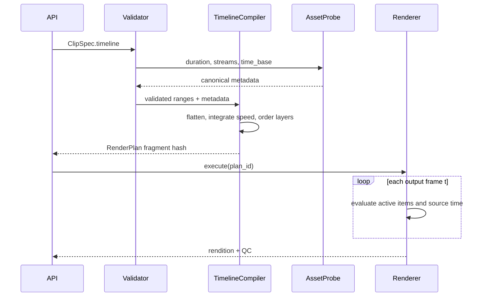
```mermaid
sequenceDiagram
    participant API
    participant Validator
    participant TimelineCompiler
    participant AssetProbe
    participant Renderer
    API->>Validator: ClipSpec.timeline
    Validator->>AssetProbe: duration, streams, time_base
    AssetProbe-->>Validator: canonical metadata
    Validator->>TimelineCompiler: validated ranges + metadata
    TimelineCompiler->>TimelineCompiler: flatten, integrate speed, order layers
    TimelineCompiler-->>API: RenderPlan fragment hash
    API->>Renderer: execute(plan_id)
    loop each output frame t
        Renderer->>Renderer: evaluate active items and source time
    end
    Renderer-->>API: rendition + QC
```

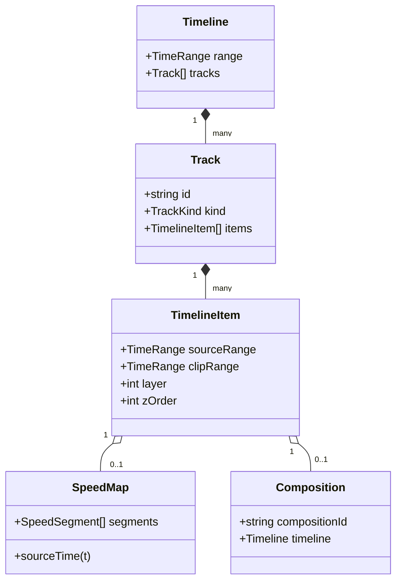
```mermaid
classDiagram
    class Timeline {
        +TimeRange range
        +Track[] tracks
    }
    class Track {
        +string id
        +TrackKind kind
        +TimelineItem[] items
    }
    class TimelineItem {
        +TimeRange sourceRange
        +TimeRange clipRange
        +int layer
        +int zOrder
    }
    class SpeedMap {
        +SpeedSegment[] segments
        +sourceTime(t)
    }
    class Composition {
        +string compositionId
        +Timeline timeline
    }
    Timeline "1" *-- "many" Track
    Track "1" *-- "many" TimelineItem
    TimelineItem "1" o-- "0..1" SpeedMap
    TimelineItem "1" o-- "0..1" Composition
```

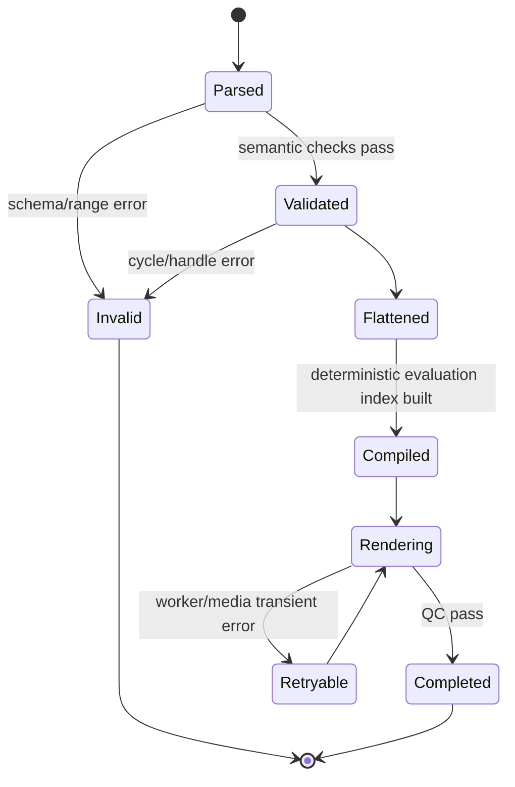
```mermaid
stateDiagram-v2
    [*] --> Parsed
    Parsed --> Invalid: schema/range error
    Parsed --> Validated: semantic checks pass
    Validated --> Invalid: cycle/handle error
    Validated --> Flattened
    Flattened --> Compiled: deterministic evaluation index built
    Compiled --> Rendering
    Rendering --> Completed: QC pass
    Rendering --> Retryable: worker/media transient error
    Retryable --> Rendering
    Invalid --> [*]
    Completed --> [*]
```

### 13.5 Üretim Sorunları ve Recovery

- Bozuk PTS/DTS: probe artefact `timestamp_repair_required` işaretler; deterministic `genpts` remux ayrı artefact olarak üretilir. Render içinde koşullu timestamp düzeltme yapılmaz.
- Eksik transition handle: compile non-retryable hata verir ve item/required/available sürelerini raporlar.
- Reverse decode maliyeti: source GOP indekslenir, segmentler keyframe-aligned chunk’lara bölünür ve ters frame cache’i kullanılır. Cache aşımı worker yükseltme veya segment fan-out ile çözülür.
- Nested composition patlaması: flatten öncesi node ve span tahmini yapılır; limit aşımı `TIMELINE_COMPLEXITY_LIMIT` ile reddedilir.
- A/V drift: QC sonunda beklenen ve ölçülen son timestamp farkı `max(1 video frame, 20 ms)` değerini aşarsa çıktı publish edilmez.
- Worker ölümü: plan immutable olduğu için activity yeni worker’da aynı node/chunk sınırından yeniden başlar; tamamlanmış chunk checksum’ları tekrar kullanılabilir.

### 13.6 Performans, Benchmark ve Kabul Kriterleri

Aktif item sorgusu interval tree ile `O(log n + k)`, flatten/cycle kontrolü `O(V+E)`, topological node sıralaması `O(V+E)` olmalıdır. Compiler 100.000 item için tüm frame’leri enumerate etmez; span tabanlı plan üretir.

Benchmark metodu: sabit CPU modeli, 32 GB RAM, local NVMe cache ve sıcak/soğuk cache ayrı ölçülür. Dataset; 10 dakikalık 1080p30, 8 video + 4 audio track, 2.000 item, 200 transition, 20 nested composition, freeze/reverse ve 12 segmentli speed ramp içerir. Determinizm testi aynı spec’i farklı `PYTHONHASHSEED`, pod ve iki çalışma sırasıyla 20 kez compile eder.

Kabul kriterleri:

- 2.000 item compile p95 `< 750 ms`, 100.000 item stres compile `< 15 s`, peak compiler RSS `< 2 GB`.
- Aynı girdide `plan_id` 20/20 aynı olmalı.
- 30 dakikalık NTSC output sonunda video süre hatası `< 1 output frame`, audio drift `< 10 ms`.
- Speed-map source time hatası analitik referansa göre `< 1/48000 s`.
- Z-order ve boundary golden testlerinde pixel mismatch yalnız codec kapalı lossless profilde `0` olmalı.

### 13.7 Gerçek Dünya, Ölçeklenme, Ownership ve Test

Uygulama: 60 saniyelik dikey sosyal klipte ana gameplay, üstte webcam composition, altta blur background, ilk 800 ms freeze, ortada `1.0x -> 1.8x` hız rampası, son 300 ms cross-dissolve aynı timeline semantiğiyle üretilir.

Ölçeklenme: compiler CPU pod’ları stateless ölçeklenir; render planları content-addressed olduğu için farklı rendition’lar aynı trim/proxy artefact’larını paylaşır. Uzun timeline, bağımsız GOP güvenli chunk’lara ayrılabilir; transition ve temporal filter guard aralıkları chunk’a eklenir, final concat yalnız timestamp doğrulamasından sonra yapılır.

Ownership: **Media Core/Timeline**. Unit testler rational arithmetic, range ve speed integrali; property testler rastgele time-map monotonicliği; contract testler ClipSpec->RenderPlan; golden testler layer/transition; integration testler FFmpeg output; determinism testleri hash eşitliği; performance testleri yukarıdaki dataset’i kapsar. Timeline owner onayı olmadan time rounding veya half-open range semantiği değiştirilemez.

---

## 14. Subtitle Engine

### 14.1 Amaç, Mekanizma ve Invariants

Subtitle Engine, ASR token’larını, kullanıcı düzeltmelerini ve forced-alignment sonuçlarını locale-aware caption cue’larına dönüştürür. Motorun çıktısı render edilmiş bitmap değil, metin semantiği ile zamanlamayı ayıran `CaptionDocument` artefact’ıdır.

```python
@dataclass(frozen=True)
class AsrToken:
    token_id: str
    text: str
    start: RationalTime | None
    end: RationalTime | None
    confidence: Decimal       # 0..1, four decimal places
    speaker_id: str | None
    language: str

@dataclass(frozen=True)
class CaptionCue:
    cue_id: str
    range: TimeRange
    text: str
    token_ids: tuple[str, ...]
    confidence: Decimal
    placement: str
    style_ref: str
```

Invariants ve kararlar:

- Ham ASR token, normalize token ve display text ayrı tutulur. Forced alignment normalize metin üzerinde, render display text üzerinde çalışır.
- Token confidence geometrik değil ağırlıklı aritmetik ortalamadır; ağırlık Unicode grapheme cluster sayısıdır. Cue confidence ayrıca alignment coverage ile çarpılır.
- `confidence < 0.55` token düşük güven, cue coverage `< 0.90` ise review-required kabul edilir. Eşik tenant policy ile yükseltilebilir, düşürülemez.
- Noktalama restorasyonu token zamanını değiştirmez; noktalama önceki/sonraki lexical token’a attachment metadata ile bağlanır.
- Metin NFC normalize edilir; kullanıcı tarafından anlamlı variation selector ve ZWJ korunur. Index’ler byte veya code point değil Unicode grapheme cluster sınırındadır.
- ICU bidi algoritması paragraph base direction’ı `locale + first-strong` ile belirler. RTL satırda token’ın mantıksal sırası saklanır, HarfBuzz görsel shaping yapar. Zaman vurgusu mantıksal token ID’ye bağlı kalır.
- Cue aralıkları `[start,end)` ve aynı caption lane içinde overlap etmez. Konuşma overlap’i ayrı speaker lane’lerinde tutulabilir.
- Varsayılan cue süresi `800 ms..7000 ms`, satır başına en fazla 42 Latin grapheme veya layout ölçümünde safe width’ün `%90`ı; CJK için karakter sayısı değil gerçek glyph advance kullanılır.
- Segmentasyon hedef okuma hızı Latin için `<= 17 grapheme/s`, CJK için `<= 10 glyph/s`; zorunlu konuşma yoğunluğunda `hard_max=22 grapheme/s` aşılırsa cue birleştirilmez, `READING_RATE_EXCEEDED` QC uyarısı üretilir.
- Caption text, render sırasında shell/filtergraph string’ine doğrudan interpolate edilmez; ASS sidecar veya libav data structure kullanılır.

### 14.2 Neden ve Alternatifler

ASR segmentlerini doğrudan göstermek hızlıdır fakat segmentler dilbilgisel sınır, okuma hızı ve ekran alanı için üretilmez. Subtitle Engine bu nedenle ASR’den ayrı bir domain katmanıdır. WebVTT daha zengin cue ayarları sunar; ancak final burn-in için libass uyumluluğu ve mevcut ekosistem nedeniyle kanonik iç modelden ASS türetilir. CaptionDocument’ı ASS olarak kanonik saklamak override tag’leri semantik modelle karıştıracağı için reddedilmiştir.

### 14.3 Veri Akışı, API ve Dosya Yeri

Veri akışı: `audio -> ASR tokens -> text normalization -> optional editorial patch -> forced alignment -> punctuation/casing -> cue segmentation -> bidi/layout hints -> CaptionDocument -> animation/layout/render`.

Public API:

```json
{
  "captions": [{
    "id": "tr-main",
    "source": {"kind": "asr", "audio_track": "dialog", "language": "tr-TR"},
    "alignment": {"mode": "forced", "model": "wav2vec2-tr@sha256:..."},
    "segmentation": {
      "max_lines": 2,
      "min_duration": {"num": 4, "den": 5},
      "max_duration": {"num": 7, "den": 1},
      "target_graphemes_per_second": 17
    },
    "style_ref": "caption.primary"
  }]
}
```

Internal API:

```python
document = subtitle_engine.build(
    tokens=asr_artifact.tokens,
    editorial_patch=patch,
    alignment=alignment_artifact,
    locale="tr-TR",
    policy=CaptionPolicy(max_lines=2, confidence_floor=Decimal("0.55")),
)
```

Dosyalar: `video_engine/captions/model.py`, `engine.py`, `segmentation.py`; schema `video_engine/schema/clipspec-v1.schema.json`; compiler pass `video_engine/compiler/passes/subtitles.py`.

### 14.4 Render Pipeline Entegrasyonu

Subtitle Engine render node’u üretmez; `CaptionDocument` üretip Caption Rendering ve Subtitle Animation’a girdi verir. Document hash; audio hash, ASR model/config hash, alignment hash, editorial patch hash, locale ve segmentation policy’den oluşur. Aynı document hem sidecar export hem burn-in için kullanılabilir. Timeline trim/speed map uygulanmış konuşmada token zamanları source domain’den composition domain’e compiler tarafından taşınır; reverse konuşmada varsayılan caption policy `disabled`, açık seçimde token sırası ve audio semantiği editör onayı gerektirir.

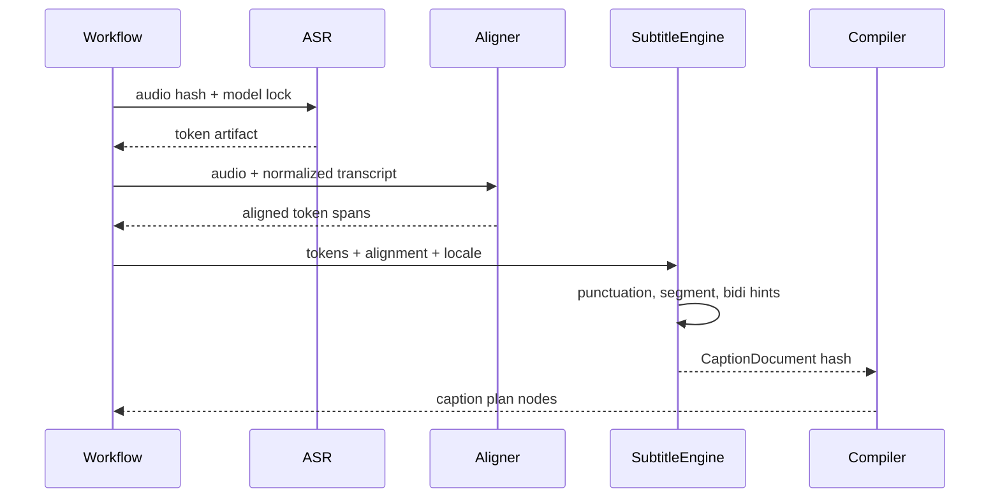
```mermaid
sequenceDiagram
    participant Workflow
    participant ASR
    participant Aligner
    participant SubtitleEngine
    participant Compiler
    Workflow->>ASR: audio hash + model lock
    ASR-->>Workflow: token artifact
    Workflow->>Aligner: audio + normalized transcript
    Aligner-->>Workflow: aligned token spans
    Workflow->>SubtitleEngine: tokens + alignment + locale
    SubtitleEngine->>SubtitleEngine: punctuation, segment, bidi hints
    SubtitleEngine-->>Compiler: CaptionDocument hash
    Compiler-->>Workflow: caption plan nodes
```

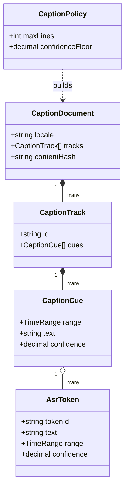
```mermaid
classDiagram
    class CaptionDocument {
        +string locale
        +CaptionTrack[] tracks
        +string contentHash
    }
    class CaptionTrack {
        +string id
        +CaptionCue[] cues
    }
    class CaptionCue {
        +TimeRange range
        +string text
        +decimal confidence
    }
    class AsrToken {
        +string tokenId
        +string text
        +TimeRange range
        +decimal confidence
    }
    class CaptionPolicy {
        +int maxLines
        +decimal confidenceFloor
    }
    CaptionDocument "1" *-- "many" CaptionTrack
    CaptionTrack "1" *-- "many" CaptionCue
    CaptionCue "1" o-- "many" AsrToken
    CaptionPolicy ..> CaptionDocument: builds
```

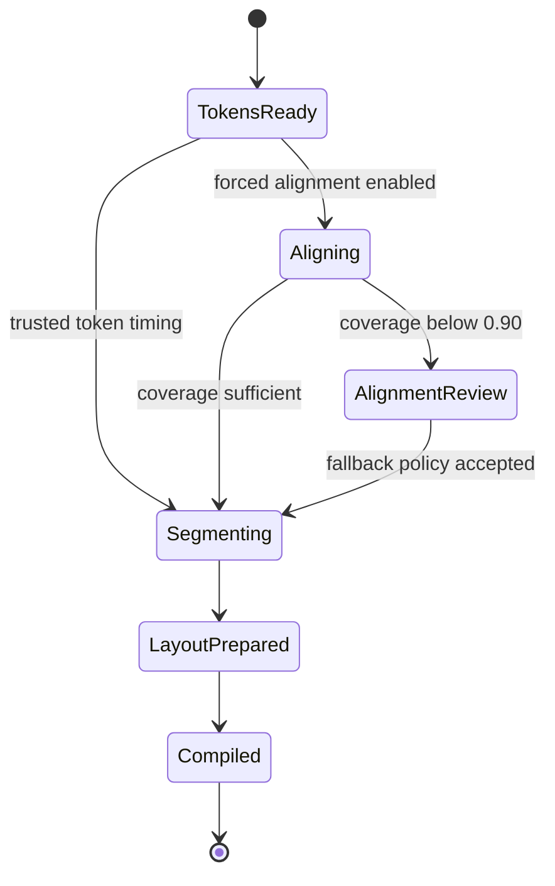
```mermaid
stateDiagram-v2
    [*] --> TokensReady
    TokensReady --> Aligning: forced alignment enabled
    TokensReady --> Segmenting: trusted token timing
    Aligning --> AlignmentReview: coverage below 0.90
    Aligning --> Segmenting: coverage sufficient
    AlignmentReview --> Segmenting: fallback policy accepted
    Segmenting --> LayoutPrepared
    LayoutPrepared --> Compiled
    Compiled --> [*]
```

### 14.5 Üretim Sorunları ve Recovery

- ASR provider timeout: Temporal retry sonrası tenant’ın kilitli fallback modeli varsa local inference yapılır; model değişimi artefact hash’ini değiştirir ve görünür audit kaydı oluşturur.
- Dil yanlış tespiti: confidence `< 0.80` ise otomatik dil seçilmez; spec dili veya review gerekir.
- Alignment coverage düşük: eksik token aralıkları komşular arasında bounded interpolation ile doldurulabilir; toplam interpolated süre cue’nun `%20` sini aşarsa final publish bloklanır.
- Bozuk Unicode/yalıtılmamış bidi kontrol karakteri: izinli kontrol listesi dışındaki karakterler non-retryable validation hatasıdır; görünmez karakterler audit çıktısında code point olarak raporlanır.
- Caption overlap: lane allocator ayrı speaker lane’i tanımlayamıyorsa düşük öncelikli cue gizlenmez; compile collision hatası verir.
- Editorial patch eski transcript’e uygulanmışsa base hash uyuşmaz ve üç yönlü sessiz merge yapılmaz; `PATCH_BASE_MISMATCH` ile kullanıcıya döner.

### 14.6 Performans, Benchmark ve Kabul Kriterleri

Segmentation dinamik programlama ile aday break sayısına göre worst-case `O(n*w)` çalışır; `w` en fazla 40 token pencereyle sınırlandırılır. ICU/HarfBuzz ölçümleri `(font_stack, size, locale, text_hash)` anahtarıyla cache’lenir.

Benchmark: Türkçe, İngilizce, Arapça, İbranice, Japonca ve emoji/ZWJ içeren toplam 10 saatlik, 120.000 token corpus; soğuk ve sıcak shape cache; 1, 2 ve 4 speaker overlap setleri. Ground truth cue ve alignment corpus sürümlenir.

Kabul kriterleri:

- CaptionDocument üretimi 10.000 token için p95 `< 500 ms` (ASR/alignment hariç), peak RSS `< 512 MB`.
- Grapheme sınırında bölünmüş cue sayısı `0`; bidi golden screenshot mismatch `0` (lossless RGBA).
- Forced-alignment median absolute boundary error `<= 40 ms`, p95 `<= 100 ms` desteklenen dillerde.
- Review dışı cue’ların `%99.9`u safe duration ve max-lines kuralını sağlamalı.
- Aynı artefact girdileriyle document hash 20/20 aynı olmalı.

### 14.7 Gerçek Dünya, Ölçeklenme, Ownership ve Test

Uygulama: Türkçe konuşmalı Twitch klibi ASR ile çıkarılır, marka yazım düzeltmeleri editorial patch olarak uygulanır, forced alignment kelimeleri yeniden zamanlar ve iki satırlık dikey video cue’ları üretir. Arapça kullanıcı adı içeren Latin cümlede ICU bidi izolasyonu kullanıcı adını doğru görsel sırada tutar.

Ölçeklenme: audio 15 dakikalık overlap’li pencerelere bölünür; ASR token merge deterministik overlap skoru ve lexical eşleşme ile yapılır. Alignment worker’ları dil/model bazında GPU queue’larına ayrılır. CaptionDocument küçük ve immutable olduğu için PostgreSQL’de metadata, S3’te zstd JSON olarak tutulur.

Ownership: **Speech & Captions**. Unit testler Unicode, confidence ve segmentation; corpus testleri WER’den bağımsız boundary accuracy; contract testler ASR artefact şeması; golden testler bidi/punctuation; chaos testleri provider timeout; privacy testleri log redaction içerir.

---

## 15. Subtitle Animation

### 15.1 Amaç, Mekanizma ve Invariants

Subtitle Animation, cue ve token durumlarını görsel animasyon kanallarına dönüştürür. Desteklenen temel preset’ler `none`, `fade`, `pop`, `slide`, `word_highlight`, `karaoke_fill` ve `bounce_emphasis`tir. Preset adı render semantiği değildir; compiler preset’i sürümlenmiş keyframe/paint graph’ına genişletir.

```python
@dataclass(frozen=True)
class CaptionAnimation:
    preset_id: str
    preset_version: str
    enter: TimeRange
    exit: TimeRange
    timing_basis: Literal["cue", "word", "grapheme"]
    channels: tuple["AnimationChannel", ...]
```

Invariants:

- Animasyon local cue zamanında tanımlanır; timeline’a dönüşüm compiler tarafından bir kez yapılır.
- Enter ve exit toplamı cue süresini aşarsa önce hold süresi sıfıra iner, sonra iki süre aynı oranla küçülür. Minimum görünür ölçek plateau’su pop için 2 output frame’dir.
- Karaoke progress token’ın `[start,end)` aralığında `0..1` olur. Sıfır süreli token noktalama kabul edilir ve önceki lexical token progress’ine bağlanır.
- Highlight bir Unicode grapheme veya shaped cluster’ı ortadan bölemez. Ligature içindeki kelime sınırı için HarfBuzz cluster bilgisi kullanılır; gerekirse ligature ilgili caption run’ında kapatılır.
- Hareket transform order’ı `anchor translate -> scale -> rotate -> layout translate` olarak sabittir. Animasyon safe-area layout sonucunu değiştirmez; yalnız çizim transform’u uygular.
- Animasyon opacity’si premultiplied alpha üzerinde uygulanır. Renk kanalları lineer ışıkta interpolate edilir, encode öncesi output transfer function’a döner.
- Reduced-motion profilinde spatial hareket ve bounce kapatılır; opacity transition `<= 150 ms` ile korunabilir.
- Bir cue’daki eşzamanlı animated glyph sayısı varsayılan 256, hard limit 1024’tür.

### 15.2 Neden ve Alternatifler

ASS `\k`, `\t`, `\move` tag’leri birçok preset’i ifade edebilir, ancak cluster-aware ligature handling, premultiplied alpha ve face-aware layout ile tutarlı değildir. Bu nedenle kanonik animasyon iç modelde tutulur; mümkün olan düşük maliyetli preset ASS’e, diğerleri RGBA overlay node’una derlenir. Frame başına Python’da glyph bitmap üretmek kolay fakat pahalı ve nondeterministic cache davranışına açık olduğundan render worker’daki native text/motion backend tercih edilir.

### 15.3 Veri Akışı, API ve Dosya Yeri

Veri akışı: `CaptionCue + WordTiming + AnimationPreset lock -> local animation channels -> keyframe compile -> shaped cluster mapping -> ASS tags veya RGBA overlay RenderNode`.

Public API:

```json
{
  "animation": {
    "preset": "karaoke_fill@2.1.0",
    "timing_basis": "word",
    "enter": {"duration": {"num": 3, "den": 20}},
    "exit": {"duration": {"num": 3, "den": 20}},
    "active_color": "#FFD400FF",
    "inactive_color": "#FFFFFFFF",
    "reduced_motion_fallback": "word_highlight@1.0.0"
  }
}
```

Internal API:

```python
animation_plan = caption_animation.compile(
    cue=cue,
    shaped_runs=layout.shaped_runs,
    preset=locked_preset,
    output_clock=clock,
    accessibility=profile.accessibility,
)
```

Dosyalar: `video_engine/captions/animation.py`, `video_engine/motion/keyframes.py`, preset kayıtları `video_engine/templates/` altında content-hash ile; testler `video_engine/tests/golden/caption_animation/`.

### 15.4 Render Pipeline Entegrasyonu

Compiler önce layout’u sabitler, sonra animasyon kanallarını shaped glyph/cluster ID’lerine bağlar. Basit karaoke ASS event/style ile libass’e gider. Per-word scale, bounce veya mask reveal gereken preset, transparent RGBA caption surface üretip ana video composite zincirine premultiplied olarak katılır. Output fps değişse de keyframe’ler rasyonel zamanda kalır; sampling render frame clock’unda yapılır.

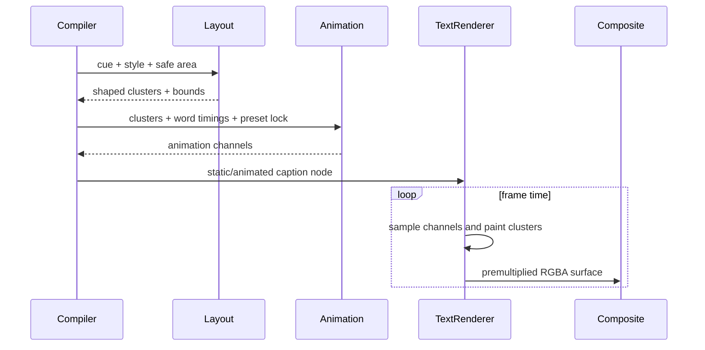
```mermaid
sequenceDiagram
    participant Compiler
    participant Layout
    participant Animation
    participant TextRenderer
    participant Composite
    Compiler->>Layout: cue + style + safe area
    Layout-->>Compiler: shaped clusters + bounds
    Compiler->>Animation: clusters + word timings + preset lock
    Animation-->>Compiler: animation channels
    Compiler->>TextRenderer: static/animated caption node
    loop frame time
        TextRenderer->>TextRenderer: sample channels and paint clusters
        TextRenderer->>Composite: premultiplied RGBA surface
    end
```

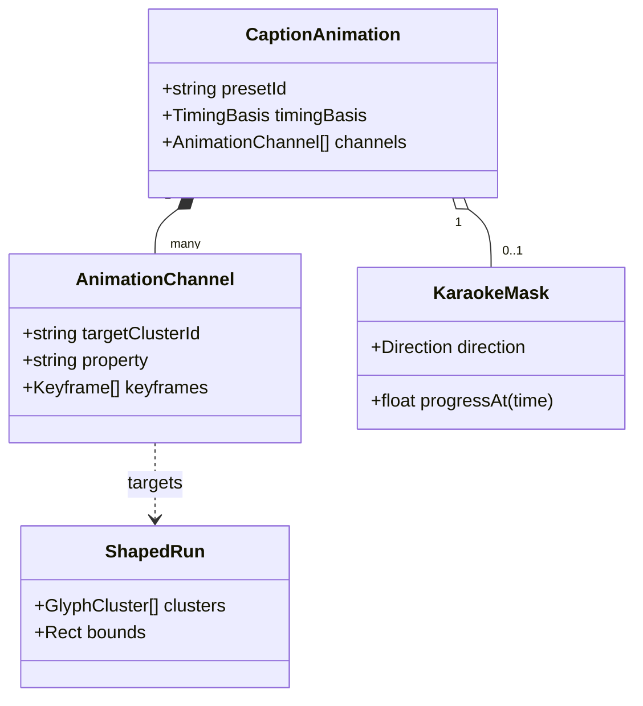
```mermaid
classDiagram
    class CaptionAnimation {
        +string presetId
        +TimingBasis timingBasis
        +AnimationChannel[] channels
    }
    class AnimationChannel {
        +string targetClusterId
        +string property
        +Keyframe[] keyframes
    }
    class KaraokeMask {
        +float progressAt(time)
        +Direction direction
    }
    class ShapedRun {
        +GlyphCluster[] clusters
        +Rect bounds
    }
    CaptionAnimation "1" *-- "many" AnimationChannel
    CaptionAnimation "1" o-- "0..1" KaraokeMask
    AnimationChannel ..> ShapedRun: targets
```

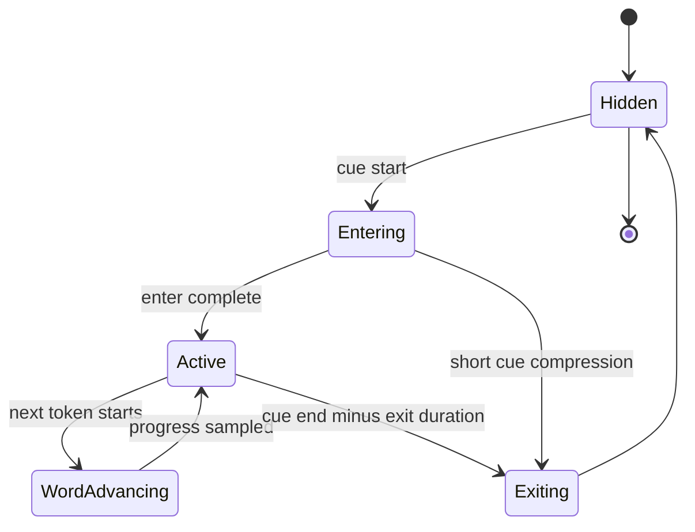
```mermaid
stateDiagram-v2
    [*] --> Hidden
    Hidden --> Entering: cue start
    Entering --> Active: enter complete
    Active --> WordAdvancing: next token starts
    WordAdvancing --> Active: progress sampled
    Active --> Exiting: cue end minus exit duration
    Entering --> Exiting: short cue compression
    Exiting --> Hidden
    Hidden --> [*]
```

### 15.5 Üretim Sorunları ve Recovery

- Eksik word timing: preset `fallback=cue` ise cue-level fade’e deterministik düşülür; strict karaoke policy compile’ı bloklar.
- Ligature/cluster uyuşmazlığı: ilgili run `liga=0` ile yeniden shape edilir; hâlâ token-cluster mapping yoksa token tüm run olarak highlight edilir ve QC warning üretilir.
- GPU caption renderer OOM: cue surface tile edilir veya CPU native backend’e retry edilir. Backend değişimi renderer fingerprint’ine girer.
- Çok kısa cue flicker: iki frame’den kısa cue animasyonsuz statik gösterilir; cue kendisi bir frame’den kısaysa output clock’a `ceil` snap edilir ve warning yazılır.
- ASS backend ile RGBA backend farkı: preset capability matrisi compile-time seçilir; runtime sessiz backend geçişi yapılmaz.

### 15.6 Performans, Benchmark ve Kabul Kriterleri

Glyph atlas font/size/outline/stroke tuple’ı ile cache’lenir. Statik glyph bitmap tekrar kullanılmalı, frame başına yalnız transform, color ve mask hesaplanmalıdır. Channel sampling binary search yerine monoton frame yürüyüşünde cursor kullanabilir; random access semantiği referans evaluator ile aynı kalır.

Benchmark: 1080x1920@30 ve 2160x3840@60; ekranda 2 satır, 30 token, Latin/Arapça/Devanagari/emoji; `fade`, `pop`, `karaoke_fill`, 100 eşzamanlı cue stres sahnesi. Lossless RGBA referans frame’leri kullanılır.

Kabul kriterleri:

- Tek caption lane karaoke overlay p95 render overhead 1080p30’da `< 1.5 ms/frame`, 4K60’ta GPU ile `< 4 ms/frame`.
- Sıcak glyph atlas hit ratio `> %98`; steady-state yeni bitmap allocation `< 1/frame`.
- Word highlight başlangıç/bitiş hatası `<= 1 output frame`.
- Premultiplied alpha halo golden testinde kenar pixel farkı `<= 1/255` lineer kanal eşdeğeri.
- Reduced-motion profili spatial transform channel sayısını `0` yapmalı.

### 15.7 Gerçek Dünya, Ölçeklenme, Ownership ve Test

Uygulama: dikey kısa videoda her konuşulan kelime sarı dolgu ile soldan sağa ilerler, aktif kelime `%108` scale ile 120 ms yükselir; Arapça cue’da dolgu yönü visual run yönüne göre sağdan sola olur, token zamanı mantıksal sırada kalır.

Ölçeklenme: caption animation CPU/GPU worker içinde frame-localdır ve dağıtık state gerektirmez. Preset ve glyph atlasları node-local read-only cache’tir; tenant font izolasyonu cache anahtarına dahil edilir. Çok dilli batch’ler font pack’e göre aynı node pool’a gruplanabilir.

Ownership: **Speech & Captions**, keyframe çekirdeğinde **Motion Platform** ortak owner. Unit testler short-cue ve timing; shaping contract testleri; golden frame testleri; backend parity testleri; 4K60 performance ve OOM chaos testleri zorunludur.

---

## 16. Word Level Timing

### 16.1 Amaç, Mekanizma ve Invariants

Word Level Timing, ASR’nin kaba veya güvenilmez token timestamp’lerini gerçek audio ile zorlanmış hizalama üzerinden lexical word, punctuation ve grapheme seviyesinde güvenilir zaman aralıklarına dönüştürür. Kanonik çıktı `AlignmentArtifact`tır; model logits veya vendor formatı kanonik değildir.

```python
@dataclass(frozen=True)
class AlignedWord:
    word_id: str
    display_text: str
    normalized_text: str
    range: TimeRange | None
    confidence: Decimal
    source: Literal["asr", "forced", "interpolated", "manual"]
    grapheme_spans: tuple["GraphemeSpan", ...]
```

Invariants:

- Lexical word aralıkları aynı speaker lane’inde monotondur ve overlap `<= 20 ms` olabilir; daha büyük overlap çözülmeden publish edilmez.
- Forced alignment penceresi cue/utterance çevresinde `500 ms` guard içerir; komşu utterance sınırını aşamaz.
- Manual timing her otomatik kaynağa üstün gelir ve ayrı provenance taşır.
- Noktalama token’ı sıfır süreli olup önceki kelime bitişine veya açılış noktalamasında sonraki kelime başlangıcına bağlanır.
- Grapheme timing gerçek phoneme iddiası taşımaz. Karaoke grapheme modu seçilirse kelime süresi shaped grapheme advance ağırlığıyla bölünür; bu değer `estimated=true` olarak işaretlenir.
- Alignment confidence `acoustic_score`, lexical coverage ve boundary stability’den kalibre edilir. Farklı model confidence’ları doğrudan karşılaştırılmaz; model sürümüne ait calibration table uygulanır.
- Sessizlikte uydurma word timing üretilmez. Unaligned token’ın `range=None` kalmasına izin verilir; downstream fallback policy karar verir.
- Model input audio 16 kHz mono float32’ye deterministic polyphase resampling ile çevrilir; resampler fingerprint artefact hash’ine girer.

### 16.2 Neden ve Alternatifler

Vendor ASR word timestamp’leri düşük maliyetlidir fakat model/locale arasında sistematik 100–300 ms sapma gösterebilir. Forced alignment karaoke ve hızlı caption için daha doğru, ancak transcript hatasına hassastır ve ek GPU maliyeti getirir. CTC segmentation geniş dil desteği için varsayılan; phoneme sözlüklü MFA benzeri backend, sözlüğü güçlü dillerde opsiyoneldir. Dynamic Time Warping yalnız fallback analiz aracıdır; kanonik çözüm değildir.

### 16.3 Veri Akışı, API ve Dosya Yeri

Veri akışı: `audio span + normalized transcript -> deterministic resample -> model emissions -> token/phoneme graph -> Viterbi/CTC alignment -> boundary refinement -> confidence calibration -> overlap repair -> AlignmentArtifact`.

Public API:

```json
{
  "alignment": {
    "mode": "forced",
    "granularity": "word",
    "language": "tr-TR",
    "model": "wav2vec2-tr@sha256:abc...",
    "max_boundary_shift": {"num": 2, "den": 5},
    "low_confidence_policy": "review"
  }
}
```

Internal API:

```python
artifact = aligner.align(
    audio=AudioSlice(asset_id, source_range),
    transcript=normalized_words,
    model=dependency_lock.require("alignment_model"),
    config=AlignmentConfig(window_guard=Fraction(1, 2), max_shift=Fraction(2, 5)),
)
```

Dosyalar: `video_engine/captions/alignment.py`, model adapter’ları `video_engine/analysis/`; artefact schema `video_engine/schema/alignment-artifact-v1.schema.json`; corpus `video_engine/tests/fixtures/alignment/`.

### 16.4 Render Pipeline Entegrasyonu

Alignment render’dan önce analysis activity olarak çalışır. Compiler artefact ID’yi caption document node’una bağlar; renderer alignment modeli yüklemez. Timeline speed map varsa source-domain word boundary’leri composition-domain’e `time_map` ile dönüştürülür. Freeze bölgesine düşen kelime tek noktaya yığılmaz; caption policy source konuşmanın gerçekten duyulduğu audio map’e göre görünürlüğü belirler.

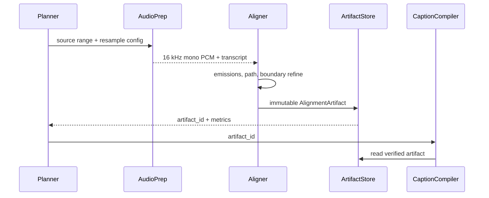
```mermaid
sequenceDiagram
    participant Planner
    participant AudioPrep
    participant Aligner
    participant ArtifactStore
    participant CaptionCompiler
    Planner->>AudioPrep: source range + resample config
    AudioPrep-->>Aligner: 16 kHz mono PCM + transcript
    Aligner->>Aligner: emissions, path, boundary refine
    Aligner->>ArtifactStore: immutable AlignmentArtifact
    ArtifactStore-->>Planner: artifact_id + metrics
    Planner->>CaptionCompiler: artifact_id
    CaptionCompiler->>ArtifactStore: read verified artifact
```

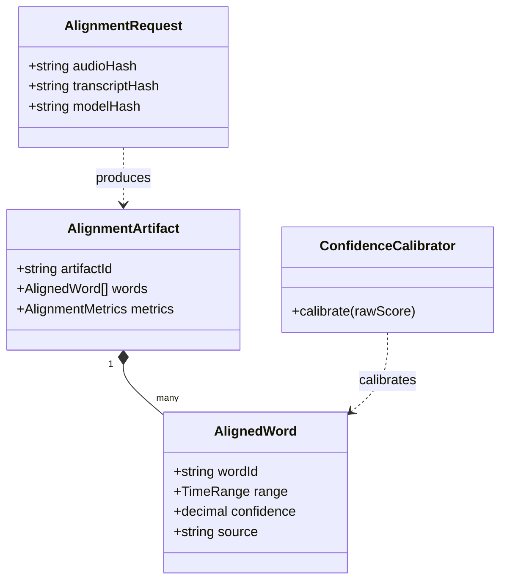
```mermaid
classDiagram
    class AlignmentRequest {
        +string audioHash
        +string transcriptHash
        +string modelHash
    }
    class AlignmentArtifact {
        +string artifactId
        +AlignedWord[] words
        +AlignmentMetrics metrics
    }
    class AlignedWord {
        +string wordId
        +TimeRange range
        +decimal confidence
        +string source
    }
    class ConfidenceCalibrator {
        +calibrate(rawScore)
    }
    AlignmentRequest ..> AlignmentArtifact: produces
    AlignmentArtifact "1" *-- "many" AlignedWord
    ConfidenceCalibrator ..> AlignedWord: calibrates
```

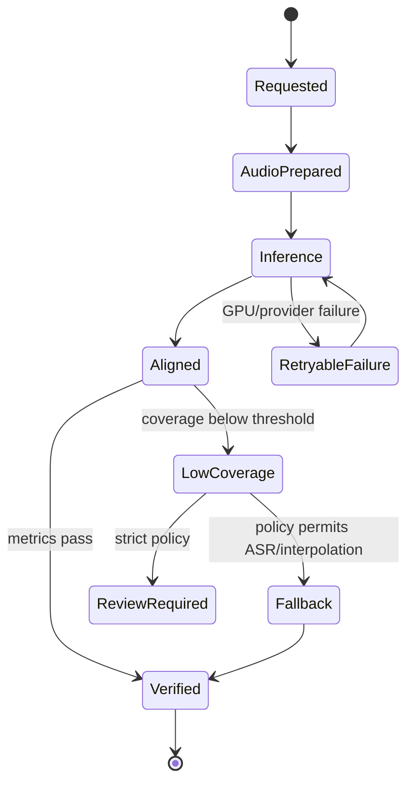
```mermaid
stateDiagram-v2
    [*] --> Requested
    Requested --> AudioPrepared
    AudioPrepared --> Inference
    Inference --> Aligned
    Inference --> RetryableFailure: GPU/provider failure
    RetryableFailure --> Inference
    Aligned --> LowCoverage: coverage below threshold
    Aligned --> Verified: metrics pass
    LowCoverage --> Fallback: policy permits ASR/interpolation
    LowCoverage --> ReviewRequired: strict policy
    Fallback --> Verified
    Verified --> [*]
```

### 16.5 Üretim Sorunları ve Recovery

- Transcript/audio uyuşmazlığı: lexical coverage `< %85` olduğunda alignment zorlanmaz; ASR rerun veya review workflow tetiklenir.
- Çok uzun utterance GPU OOM: VAD sessizliklerinde deterministik pencerelere bölünür; 30 saniye hard window, 2 saniye overlap kullanılır.
- Model nondeterminism: inference eval mode, fixed kernels ve pinned model/runtime fingerprint ile çalışır. TensorRT engine GPU compute capability’ye göre lock’lanır.
- Boundary outlier: ASR timestamp’inden `> 400 ms` sapma ve düşük acoustic confidence varsa boundary ASR’ye geri dönmez; `conflict` olarak işaretlenir.
- Eksik locale modeli: dependency resolution compile öncesi fail eder; otomatik başka dil modeli kullanılmaz.
- Interrupted inference: tamamlanan window artefact’ları cache’lenir; fan-in aynı config hash’iyle yeniden kurulur.

### 16.6 Performans, Benchmark ve Kabul Kriterleri

Benchmark corpus’u en az 50 saat temiz/stüdyo, oyun yayını, müzik altı konuşma, code-switch ve overlap konuşma içermelidir. Ground truth boundaries uzman anotasyonu ile 10 ms çözünürlükte tutulur. RTF, median/p95 boundary error, coverage ve calibration ECE raporlanır.

Kabul kriterleri:

- GPU alignment real-time factor p95 `< 0.20`, CPU fallback `< 1.5`.
- Desteklenen ana dillerde median boundary error `<= 40 ms`, p95 `<= 100 ms`; gürültülü yayın alt kümesinde p95 `<= 160 ms`.
- Lexical coverage temiz corpus’ta `>= %98`, yayın corpus’unda `>= %94`.
- Confidence expected calibration error `< 0.05`.
- Aynı GPU/runtime fingerprint’inde boundary farkı `<= 10 ms`; artefact hash aynı olmalı.

### 16.7 Gerçek Dünya, Ölçeklenme, Ownership ve Test

Uygulama: hızlı Türkçe konuşmada ASR segmenti 4 saniyelik tek parça döndürür; forced alignment 13 kelimeyi ayrı boundary’lere ayırır ve karaoke vurgusunu konuşmayla senkronlar. Müzik baskın olduğunda düşük güvenli üç kelime review olarak işaretlenir.

Ölçeklenme: utterance/window bazında GPU fan-out yapılır; model sıcak worker pool’ları cold-start’ı azaltır. Artefact cache anahtarı audio byte hash + exact range + transcript hash + model/runtime/config hash’tir. Tenantlar arası audio artefact paylaşımı privacy policy nedeniyle varsayılan kapalıdır.

Ownership: **Speech ML Platform**; Caption contract için **Speech & Captions** reviewer. Testler model adapter contract, resampler golden, multilingual boundary corpus, confidence calibration, GPU determinism, OOM/retry ve stale-model revocation senaryolarını kapsar.

---

## 17. Caption Rendering

### 17.1 Amaç, Mekanizma ve Invariants

Caption Rendering; `CaptionDocument`, stil, font paketi, safe-area ve animation planını shaped glyph’lere, satırlara ve premultiplied RGBA katmanına dönüştürür. Text stack sırası `ICU normalization/bidi/line-break -> HarfBuzz shaping -> FreeType rasterization -> libass veya native compositor`dur.

```python
@dataclass(frozen=True)
class CaptionStyle:
    font_stack: tuple[str, ...]
    font_size_px: Decimal
    line_height: Decimal
    fill_rgba: str
    outline_px: Decimal
    shadow: tuple[Decimal, Decimal, Decimal, str]
    max_lines: int
    safe_area: "Insets"
    collision_policy: Literal["shift", "alternate_anchor", "fail"]
```

Invariants ve kararlar:

- Font boyutu output pixel uzayında tanımlanır; preview ölçeği aynı layout’u oranlı taşır, bağımsız reflow yalnız preview profilinde açıkça seçilebilir.
- Safe area varsayılanı yatayda `%5`, üstte `%5`, altta `%10`; platform profile bu değerleri override eder. Pixel’e dönüşüm `ceil` ile içe doğru yapılır.
- Line breaking ICU UAX #14 adayları üzerinde gerçek shaped width maliyetiyle yapılır. Kelimenin ortasında break yalnız locale hyphenation dictionary açık ve display text’e soft hyphen provenance eklenmişse mümkündür.
- Unicode grapheme cluster, ZWJ emoji ve combining mark bölünmez. HarfBuzz cluster monotonicity bilgisi korunur.
- Font fallback run bazında değil eksik cluster bazında seçilir; bir grapheme’in tüm code point’lerini karşılayan ilk font kullanılır. Eksik glyph strict policy’de render fail, permissive policy’de tofu + metric üretir.
- Font dosyası family adına göre sistemden aranmaz. Dependency lock içindeki exact font bytes, face index, variation axes ve FreeType/HarfBuzz sürümü kullanılır.
- Font lisans policy `render_only` ise font output’a embed edilmez ve dışarı verilmez; yalnız worker ephemeral disk’ine decrypt edilir. `restricted` font compile’ı bloklar.
- Caption kutuları reserved UI regions, face exclusion zones ve birbirleriyle çakışmamalıdır. Çakışma alanı kutu alanının `%2` sini aşarsa solver devreye girer.
- Collision çözüm sırası: preferred anchor’da vertical shift (`<= output height %15`), alternate anchor, font küçültme (`en fazla %12`, minimum style limit), sonra policy’ye göre fail. Cue gizlemek yasaktır.
- Renk ve outline compositing premultiplied alpha ile lineer ışıkta yapılır. Chroma-subsampled output’a geçiş son composite sonrasındadır.

### 17.2 Neden ve Alternatifler

Yalnız FFmpeg `drawtext` kullanımı kolaydır, ancak complex shaping, fallback, ASS semantiği ve cluster-aware karaoke için yetersiz/tutarsızdır. libass olgun ve hızlıdır; temel burn-in için varsayılandır. Native HarfBuzz/FreeType compositor, ileri animation, collision ve exact RGBA kontrolü gereken durumlarda kullanılır. Browser/Chromium render, CSS zenginliği sunsa da font/layout sürüm determinismi ve yüksek hacimli frame üretimi nedeniyle ana backend değildir.

### 17.3 Veri Akışı, API ve Dosya Yeri

Veri akışı: `cue text -> Unicode/bidi runs -> fallback font selection -> shaping -> break candidate scoring -> line placement -> collision solve -> glyph atlas -> RGBA/ASS render node -> composite`.

Public API:

```json
{
  "style": {
    "font_stack": ["Inter Variable", "Noto Sans Arabic", "Noto Color Emoji"],
    "font_size_px": 64,
    "line_height": 1.12,
    "fill": "#FFFFFFFF",
    "outline": {"width_px": 5, "color": "#000000E6"},
    "max_lines": 2,
    "anchor": "bottom_center",
    "safe_area": {"left": 54, "right": 54, "top": 96, "bottom": 192},
    "collision_policy": "alternate_anchor"
  }
}
```

Internal API:

```python
layout = caption_renderer.layout(
    cue=cue,
    style=resolved_style,
    fonts=locked_font_pack,
    viewport=Viewport(1080, 1920),
    exclusions=face_zones + template_reserved_regions,
)
node = caption_renderer.compile_node(layout, animation_plan, backend="auto")
```

Dosyalar: `video_engine/captions/layout.py`, `render.py`, `fonts.py`; FFmpeg entegrasyonu `video_engine/render/subtitle_filter.py`; font paket manifest’i `video_engine/schema/font-pack-v1.schema.json`.

### 17.4 Render Pipeline Entegrasyonu

Layout compiler aşamasında final output çözünürlüğünde hesaplanır ve `LayoutArtifact` olarak plan içine hash ile bağlanır. Exclusion zone zamana bağlıysa layout keyframe segmentleri üretilir; frame başına tam constraint solve yerine zone değişimi `> 4 px` veya cue boundary olduğunda yeniden çözülür, arada pozisyon interpolate edilir. libass backend sidecar `.ass` ve fonts directory alır; native backend RGBA surface üretip `overlay`/libav composite node’una bağlanır.

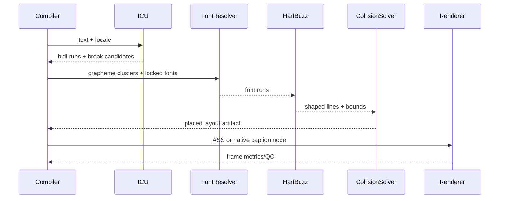
```mermaid
sequenceDiagram
    participant Compiler
    participant ICU
    participant FontResolver
    participant HarfBuzz
    participant CollisionSolver
    participant Renderer
    Compiler->>ICU: text + locale
    ICU-->>Compiler: bidi runs + break candidates
    Compiler->>FontResolver: grapheme clusters + locked fonts
    FontResolver-->>HarfBuzz: font runs
    HarfBuzz-->>CollisionSolver: shaped lines + bounds
    CollisionSolver-->>Compiler: placed layout artifact
    Compiler->>Renderer: ASS or native caption node
    Renderer-->>Compiler: frame metrics/QC
```

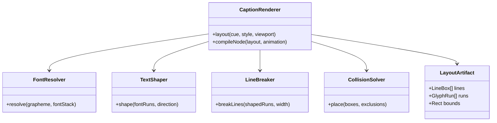
```mermaid
classDiagram
    class CaptionRenderer {
        +layout(cue, style, viewport)
        +compileNode(layout, animation)
    }
    class FontResolver {
        +resolve(grapheme, fontStack)
    }
    class TextShaper {
        +shape(fontRuns, direction)
    }
    class LineBreaker {
        +breakLines(shapedRuns, width)
    }
    class CollisionSolver {
        +place(boxes, exclusions)
    }
    class LayoutArtifact {
        +LineBox[] lines
        +GlyphRun[] runs
        +Rect bounds
    }
    CaptionRenderer --> FontResolver
    CaptionRenderer --> TextShaper
    CaptionRenderer --> LineBreaker
    CaptionRenderer --> CollisionSolver
    CaptionRenderer --> LayoutArtifact
```

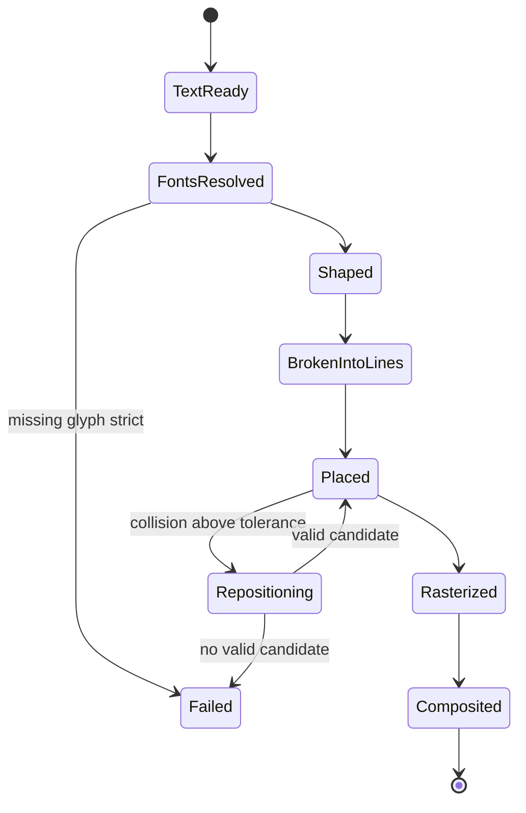
```mermaid
stateDiagram-v2
    [*] --> TextReady
    TextReady --> FontsResolved
    FontsResolved --> Failed: missing glyph strict
    FontsResolved --> Shaped
    Shaped --> BrokenIntoLines
    BrokenIntoLines --> Placed
    Placed --> Repositioning: collision above tolerance
    Repositioning --> Placed: valid candidate
    Repositioning --> Failed: no valid candidate
    Placed --> Rasterized
    Rasterized --> Composited
    Composited --> [*]
```

### 17.5 Üretim Sorunları ve Recovery

- Font paketi eksik/bozuk: checksum uyuşmazlığı retry edilmez; dependency lock yeniden çözülmeden sistem fontuna düşmez.
- FreeType/HarfBuzz sürüm farkı: renderer capability compiler fingerprint ile uyuşmazsa preflight job’ı reddeder ve doğru image digest’li pod’a requeue eder.
- Missing glyph: code point, grapheme ve denenen font ID’leri metrics artefact’ına yazılır; caption metni PII loguna yazılmaz.
- Layout oscillation: hareketli exclusion zone için hysteresis 4 px ve minimum placement hold 150 ms uygulanır; solver iki anchor arasında her frame atlamaz.
- Caption crop: QC, alpha bounds’un viewport/safe-area dışına taşmasını frame örneklemesiyle kontrol eder; taşma varsa publish bloklanır.
- Color emoji backend farkı: COLR/CPAL ve bitmap emoji capability lock’ta belirtilir; destek yoksa compile aşamasında monochrome fallback yalnız policy izin verirse seçilir.

### 17.6 Performans, Benchmark ve Kabul Kriterleri

Shape cache immutable font bytes hash + axes + size + direction + language + feature set + text hash ile anahtarlanır. Glyph atlas LRU tenant sınırı 256 MB, worker sınırı 2 GB’dır. Collision solver cue başına en fazla 12 candidate değerlendirir.

Benchmark: 1.000 cue’luk multilingual corpus; Latin, Arabic RTL, Hebrew, Devanagari, Thai, CJK, combining mark, ZWJ emoji; 1080p ve 4K; 0/1/3 hareketli exclusion zone. Native ve libass backend ayrı ölçülür.

Kabul kriterleri:

- Layout p95 `< 4 ms/cue`, p99 `< 10 ms/cue` sıcak cache; 1.000 cue compile `< 2 s`.
- Statik iki satır caption raster/composite overhead 1080p30’da `< 1 ms/frame`, 4K60 GPU’da `< 3 ms/frame`.
- Safe-area taşması ve grapheme split `0`.
- Desteklenen script golden setinde missing glyph `0`.
- Aynı image/font lock ile glyph bounds farkı `0 px`; backend parity’de perceptual pixel error `< %0.1`.

### 17.7 Gerçek Dünya, Ölçeklenme, Ownership ve Test

Uygulama: webcam yüzü alt orta bölgede olduğunda caption solver cue’yu üst ortaya taşır; yüz bölgesi kaybolduktan sonra 150 ms hysteresis sonrası tercih edilen alt anchor’a döner. Türkçe metindeki emoji Noto Color Emoji’ye, Arapça isim Noto Sans Arabic’e cluster bütünlüğüyle düşer.

Ölçeklenme: layout CPU compiler pod’larında batch yapılır; font pack’ler read-only node cache ile dağıtılır. Native raster GPU worker’da, libass CPU render worker’da çalışabilir. Content-addressed layout artefact’ları farklı bitrate rendition’larında çözünürlük aynıysa paylaşılır.

Ownership: **Text Rendering Platform**; caption semantics için **Speech & Captions**. Testler Unicode conformance, bidi, UAX #14, font fallback/license, collision property testleri, screenshot golden, backend parity, memory pressure ve worker-image compatibility testlerini kapsar.

---

## 18. ASS Subtitle

### 18.1 Amaç, Mekanizma ve Invariants

ASS modülü, Advanced SubStation Alpha dosyalarını kontrollü bir alt kümede parse/export eder ve internal caption modelini libass’e güvenli şekilde taşır. ASS kanonik domain model değildir; interchange ve optimize render backend formatıdır.

Desteklenen bölümler: `[Script Info]`, `[V4+ Styles]`, `[Events]`, `[Fonts]` dış referans manifest’i. Event tiplerinden `Dialogue` ve `Comment` parse edilir; render’a yalnız `Dialogue` girer. Style alanları explicit schema ile tutulur.

```python
@dataclass(frozen=True)
class AssEvent:
    layer: int
    start: RationalTime
    end: RationalTime
    style: str
    name: str
    margins: tuple[int, int, int]
    effect: str
    text: str
    overrides: tuple["AssOverride", ...]
```

Invariants ve tag politikası:

- ASS zaman çözünürlüğü centisecond’dur. Internal rational -> ASS export `start=floor(100*t)/100`, `end=ceil(100*t)/100`; geri import tam hassasiyeti geri getiremez ve loss report üretir.
- Event `end > start`; aynı başlangıçta sıra `(layer, source_order, event_id)` ile deterministiktir.
- Style adı case-sensitive canonical ID’ye map edilir; duplicate style sonuncu kazanmaz, parse hatasıdır.
- İzinli override tag’leri: `\b`, `\i`, `\u`, `\s`, `\fn`, `\fs`, `\c`, `\alpha`, `\bord`, `\shad`, `\pos`, `\an`, `\k`, `\kf`, `\ko`, sınırlı `\t`. `\clip`, `\iclip`, `\move`, `\org`, drawing mode `\p` capability/policy gerektirir.
- `\t` iç içe olamaz; acceleration `0.1..10`, transform aralığı event süresi içinde olmalıdır.
- Override parser regex ile text replace yapmaz; brace/token lexer ve typed AST kullanır. Bilinmeyen tag strict modda hata, preserve modda opaque node olur fakat render güvenlik policy’si ayrıca karar verir.
- `PlayResX/Y` zorunludur; yoksa import profile açık bir default vermedikçe tahmin edilmez.
- ASS font attachment kabul edilirse byte hash, lisans ve boyut (`<= 25 MB/font`, `<= 100 MB/document`) doğrulanır.

### 18.2 Neden ve Alternatifler

ASS; style, layer, karaoke ve libass desteği nedeniyle burn-in için güçlüdür. Dezavantajları centisecond zaman, renderer’a özgü layout davranışı ve override tag’lerinde semantik karmaşıklıktır. WebVTT/TTML erişilebilir sidecar için daha uygun olabilir; bu belge final burn-in yolunda ASS’i adapter olarak seçer. Raw ASS’i doğrudan FFmpeg’e vermek güvenlik, font ve determinism denetimini atladığından yasaktır.

### 18.3 Veri Akışı, API ve Dosya Yeri

Import akışı: `ASS bytes -> encoding detect(policy) -> section parser -> typed style/event AST -> override validation -> font resolution -> internal CaptionDocument + LossReport`. Export akışı bunun tersidir ve unsupported internal özelliği bitmap/native backend’e yönlendirir.

Public API:

```json
{
  "source": {
    "kind": "ass",
    "asset_id": "asset:captions-ass",
    "mode": "strict",
    "allowed_override_profile": "social-safe-v1"
  },
  "render_backend": "libass"
}
```

Internal API:

```python
document, report = ass_codec.parse(
    data=ass_bytes,
    policy=AssPolicy.strict("social-safe-v1"),
    font_pack=locked_fonts,
)
sidecar = ass_codec.export(document, play_res=(1080, 1920), capability=libass_caps)
```

Dosyalar: `video_engine/captions/ass_codec.py`, typed AST `video_engine/captions/model.py`, sanitizer policy `video_engine/captions/ass_policy.py`, libass bridge `video_engine/render/subtitle_filter.py`.

### 18.4 Render Pipeline Entegrasyonu

Validated ASS, S3’te content-addressed sidecar ve font directory manifest’i olarak saklanır. FFmpeg filtergraph’a metin gömülmez; `subtitles=filename=...:fontsdir=...` argümanları process API üzerinden güvenli argv olarak verilir. Worker image exact libass commit, HarfBuzz ve FreeType sürümlerini capability fingerprint’te taşır.

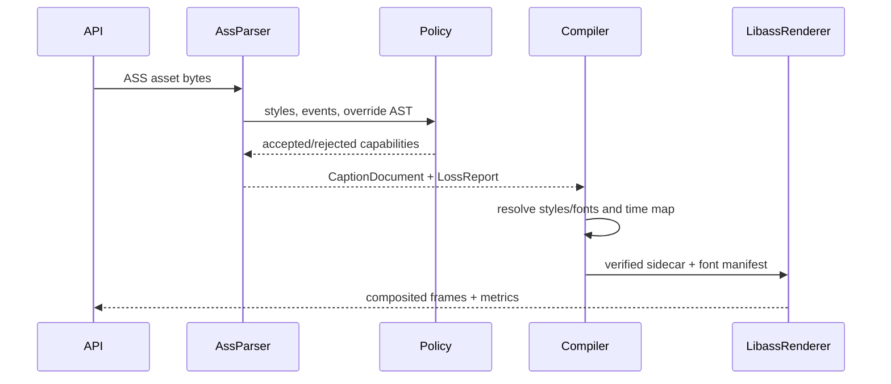
```mermaid
sequenceDiagram
    participant API
    participant AssParser
    participant Policy
    participant Compiler
    participant LibassRenderer
    API->>AssParser: ASS asset bytes
    AssParser->>Policy: styles, events, override AST
    Policy-->>AssParser: accepted/rejected capabilities
    AssParser-->>Compiler: CaptionDocument + LossReport
    Compiler->>Compiler: resolve styles/fonts and time map
    Compiler->>LibassRenderer: verified sidecar + font manifest
    LibassRenderer-->>API: composited frames + metrics
```

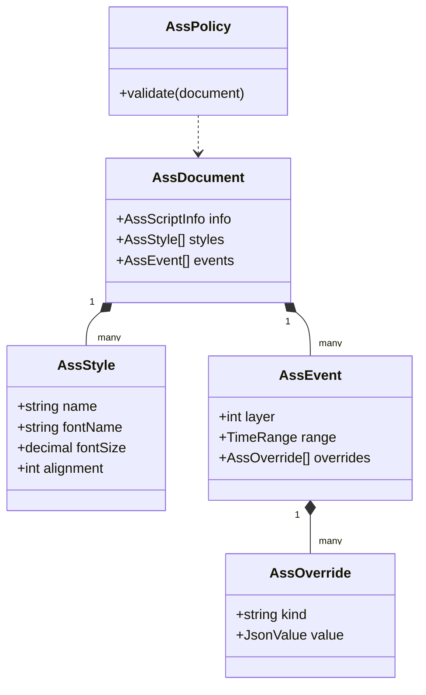
```mermaid
classDiagram
    class AssDocument {
        +AssScriptInfo info
        +AssStyle[] styles
        +AssEvent[] events
    }
    class AssStyle {
        +string name
        +string fontName
        +decimal fontSize
        +int alignment
    }
    class AssEvent {
        +int layer
        +TimeRange range
        +AssOverride[] overrides
    }
    class AssOverride {
        +string kind
        +JsonValue value
    }
    class AssPolicy {
        +validate(document)
    }
    AssDocument "1" *-- "many" AssStyle
    AssDocument "1" *-- "many" AssEvent
    AssEvent "1" *-- "many" AssOverride
    AssPolicy ..> AssDocument
```

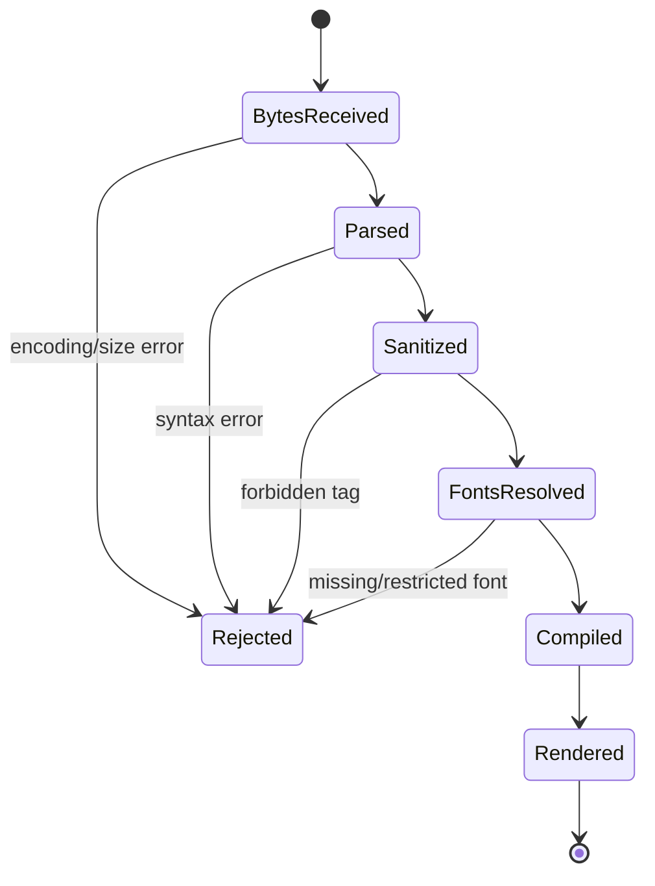
```mermaid
stateDiagram-v2
    [*] --> BytesReceived
    BytesReceived --> Parsed
    BytesReceived --> Rejected: encoding/size error
    Parsed --> Sanitized
    Parsed --> Rejected: syntax error
    Sanitized --> FontsResolved
    Sanitized --> Rejected: forbidden tag
    FontsResolved --> Compiled
    FontsResolved --> Rejected: missing/restricted font
    Compiled --> Rendered
    Rendered --> [*]
```

### 18.5 Üretim Sorunları ve Recovery

- Malformed ASS: parser line/column ve event ID ile non-retryable hata verir; libass crash’ine bırakılmaz.
- Encoding: UTF-8 BOM/UTF-8 kabul edilir; legacy codepage yalnız explicit `source_encoding` ile. Replacement character sessizce eklenmez.
- Override bomb: event başına 256 tag, document başına 100.000 tag, nesting 1 ve text 1 MB hard limit.
- libass crash/hang: render subprocess seccomp/cgroup limitinde çalışır; timeout sonrası aynı dosya tekrar denenmez, native sanitized fallback yalnız capability planında önceden seçilmişse kullanılır.
- Font family collision: family adı yerine manifest’te font bytes + face index eşlemesi kullanılır; aynı family iki byte setine map edemez.
- Centisecond quantization: report’ta cue başına start/end delta verilir; karaoke toleransını aşarsa ASS backend yerine native backend seçilir.

### 18.6 Performans, Benchmark ve Kabul Kriterleri

Parser tek geçişte `O(bytes + tags)` çalışmalı, document boyutu hard limit 50 MB olmalıdır. Benchmark corpus: 10.000 event, 100 style, yoğun `\k/\t`, RTL, malformed/fuzz dosyaları ve bilinen libass regression seti.

Kabul kriterleri:

- 10.000 event/20 MB ASS parse p95 `< 300 ms`, peak RSS `< 256 MB`.
- Sanitizer forbidden tag kaçırma oranı fuzz/property corpus’unda `0`.
- Desteklenen tag alt kümesinde parse-export-parse semantik eşitliği `%100`.
- Internal -> ASS zaman quantization mutlak hatası start için `< 10 ms`, end için `< 10 ms`; daha yüksek precision talebi native backend’e yönlenmeli.
- Golden görüntüler aynı libass fingerprint’inde pixel-exact olmalı.

### 18.7 Gerçek Dünya, Ölçeklenme, Ownership ve Test

Uygulama: dışarıdan gelen fansub ASS dosyası style ve karaoke tag’leriyle import edilir, yasak drawing tag’i policy tarafından reddedilir, lisanslı font paketiyle libass üzerinden dikey videoya burn-in yapılır.

Ölçeklenme: parse/compiler CPU stateless pod’larda; font/ASS artefact’ları S3 ve node cache’te. Aynı ASS ve font hash’i farklı video rendition’larında paylaşılır. libass context’i render process başına izole edilir; tenantlar arasında mutable font provider paylaşılmaz.

Ownership: **Text Rendering Platform**. Testler parser unit, round-trip contract, libass compatibility matrix, AFL/libFuzzer corpus, security limits, font license ve screenshot golden testlerini kapsar.

---

## 19. SRT

### 19.1 Amaç, Mekanizma ve Invariants

SRT modülü, SubRip dosyalarını güvenli biçimde import/export eder. SRT yalnız sıra, millisecond timestamp ve düz/çok sınırlı işaretli metin taşır; style, z-order, font, karaoke, speaker lane, word timing, bidi isolation metadata ve animation semantiğini güvenilir biçimde taşımaz.

```python
@dataclass(frozen=True)
class SrtCue:
    source_index: int
    range: TimeRange
    text: str
    source_order: int
```

Invariants:

- Timestamp biçimi `HH:MM:SS,mmm`; parse edilen değer exact `milliseconds/1000` rasyonelidir.
- Cue ID olarak SRT sıra numarasına güvenilmez; canonical `cue_id = sha256(file_hash, source_order, start, end, text_hash)` üretilir.
- Out-of-order cue strict modda hata, normalize modunda `(start,end,source_order)` ile sıralanır ve loss/warning raporuna yazılır.
- Overlap korunur; aynı caption lane’e compile edilirken collision policy çözmelidir. Import aşamasında süre sessizce kesilmez.
- HTML-benzeri yalnız `<b>`, `<i>`, `<u>`, `<font color>` policy ile parse edilebilir; diğer tag’ler escape edilir veya strict modda reddedilir. Script/HTML çalıştırılmaz.
- Metin NFC normalize edilir, newline korunur, grapheme bölünmez. Boş cue reddedilir.
- Encoding varsayılan UTF-8’dir. BOM desteklenir; legacy encoding explicit olmalıdır.
- Export start `nearest_ties_even` millisecond, end ise cue’nun pozitif kalmasını garanti edecek `max(nearest, start+1ms)` ile yazılır.

### 19.2 Kayıp Semantiği, Neden ve Alternatifler

SRT export her zaman `LossReport` üretir. Aşağıdaki alanlar kaybolur veya düzleştirilir:

| Internal özellik | SRT sonucu | Severity |
|---|---|---|
| Font/style/layout | metin korunur, stil kaybolur | warning |
| Word/grapheme timing | cue timing kalır | warning; karaoke için error olabilir |
| Animation/keyframe | kaybolur | warning/error policy |
| Multiple speaker lanes | cue’lar overlap eder veya speaker prefix eklenir | explicit policy |
| z-order/layer | kaybolur | warning |
| Bidi isolation metadata | Unicode isolate karakterleri metne materialize edilir | warning |
| Sub-millisecond timing | millisecond’e quantize | info |
| ASS override/drawing | düz metin veya export reject | error |

SRT geniş uyumluluk için gereklidir, ancak master format olarak seçilmemiştir. WebVTT placement ve metadata için, TTML/IMSC yayın iş akışları için daha uygun alternatiflerdir; adapter olarak ileride eklenebilir.

### 19.3 Veri Akışı, API ve Dosya Yeri

Import: `bytes -> encoding validation -> cue block parser -> timestamp validation -> markup sanitizer -> Unicode normalization -> CaptionDocument + ImportReport`. Export: `CaptionDocument -> feature audit -> flatten policy -> ms quantization -> SRT bytes + LossReport`.

Public API:

```json
{
  "source": {
    "kind": "srt",
    "asset_id": "asset:tr-srt",
    "encoding": "utf-8",
    "ordering_policy": "normalize",
    "markup_policy": "safe-basic"
  },
  "export": {
    "format": "srt",
    "loss_policy": "report",
    "speaker_policy": "prefix"
  }
}
```

Internal API:

```python
document, import_report = srt_codec.parse(srt_bytes, policy=SrtPolicy.safe())
payload, loss_report = srt_codec.export(
    document,
    policy=SrtExportPolicy(loss="report", speakers="prefix"),
)
```

Dosyalar: `video_engine/captions/srt_codec.py`, loss modeli `video_engine/captions/model.py`, test corpus `video_engine/tests/fixtures/srt/`.

### 19.4 Render Pipeline Entegrasyonu

SRT hiçbir zaman doğrudan FFmpeg’e verilmez. Önce CaptionDocument’a parse edilir, font/layout policy uygulanır, ardından ASS veya native caption render node’una derlenir. Böylece SRT parser davranışı ile FFmpeg build davranışı ayrışmaz. Sidecar export render’dan bağımsız artefact olabilir ve output manifest’e loss report hash’iyle eklenir.

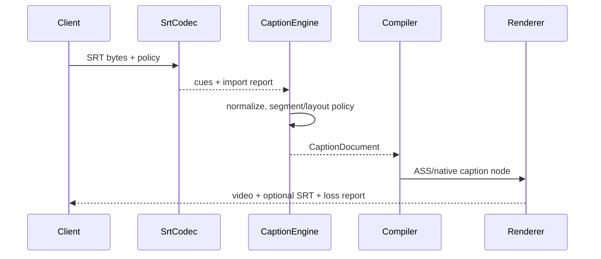
```mermaid
sequenceDiagram
    participant Client
    participant SrtCodec
    participant CaptionEngine
    participant Compiler
    participant Renderer
    Client->>SrtCodec: SRT bytes + policy
    SrtCodec-->>CaptionEngine: cues + import report
    CaptionEngine->>CaptionEngine: normalize, segment/layout policy
    CaptionEngine-->>Compiler: CaptionDocument
    Compiler->>Renderer: ASS/native caption node
    Renderer-->>Client: video + optional SRT + loss report
```

```mermaid
classDiagram
    class SrtCodec {
        +parse(bytes, policy)
        +export(document, policy)
    }
    class SrtCue {
        +int sourceIndex
        +TimeRange range
        +string text
    }
    class ImportReport {
        +Issue[] issues
    }
    class LossReport {
        +Loss[] losses
        +bool isAcceptable
    }
    class CaptionDocument {
        +CaptionCue[] cues
    }
    SrtCodec --> SrtCue
    SrtCodec --> ImportReport
    SrtCodec --> LossReport
    SrtCodec --> CaptionDocument
```

```mermaid
stateDiagram-v2
    [*] --> Received
    Received --> Parsed
    Received --> Rejected: encoding/syntax error
    Parsed --> Normalized
    Parsed --> Rejected: invalid time/empty cue
    Normalized --> Imported
    Imported --> ExportAudit: SRT export requested
    ExportAudit --> Exported: loss policy accepts
    ExportAudit --> Rejected: prohibited semantic loss
    Imported --> Compiled: burn-in requested
    Exported --> [*]
    Compiled --> [*]
```

### 19.5 Üretim Sorunları ve Recovery

- `.` yerine `,` veya malformed arrow: tolerant mode yalnız belgelenmiş varyantları kabul eder ve warning verir; belirsiz zaman parse edilmez.
- Duplicate index: source order korunur, canonical ID yeniden üretilir; duplicate index semantic kimlik değildir.
- Çok uzun satır/cue: cue başına 16 KB, dosya 50 MB hard limit; aşım non-retryable.
- Overlap yoğunluğu: caption lane allocator limitini aşarsa render fail eder; SRT import başarılı olsa bile compile issue açıkça raporlanır.
- Kayıplı export: `loss_policy=error` ise herhangi bir warning severity loss export’u durdurur; video render bundan bağımsız devam edebilir.
- Encoding mojibake: otomatik charset tahmini yapılmaz; kullanıcı explicit encoding vermeli veya UTF-8 düzeltmelidir.

### 19.6 Performans, Benchmark ve Kabul Kriterleri

Streaming parser `O(bytes)` ve bounded memory çalışır. Benchmark; 100.000 cue/50 MB valid dosya, CRLF/LF, bidi, markup, malformed timestamp ve fuzz corpus içerir.

Kabul kriterleri:

- 100.000 cue parse p95 `< 1 s`, peak RSS `< 300 MB`.
- Valid UTF-8 plain SRT parse-export-parse metin ve millisecond timing eşitliği `%100`.
- Semantic loss report fixture’larında false negative `0`.
- Parser fuzz testinde crash/hang `0`, input başına timeout `< 100 ms` küçük fixture için.
- SRT’den burn-in golden setinde cue görünürlük boundary farkı `<= 1 ms` internal modelde ve `<= 1 frame` output’ta.

### 19.7 Gerçek Dünya, Ölçeklenme, Ownership ve Test

Uygulama: editörden gelen Türkçe SRT import edilir, overlap korunur, marka caption style’ı uygulanarak video üzerine basılır; ayrıca platform upload için normalize SRT export edilir. Karaoke animation SRT’ye aktarılamadığı için loss report warning taşır.

Ölçeklenme: codec stateless CPU service olarak yatay ölçeklenir; büyük dosya streaming parse edilir ve sonuç zstd CaptionDocument artefact’ına yazılır. Aynı SRT hash’i tenant policy izin veriyorsa tenant içinde cache’lenir.

Ownership: **Speech & Captions**. Testler parser unit, encoding, markup sanitizer security, loss matrix contract, property/fuzz, large-file performance ve burn-in integration testlerini kapsar.

---

## 20. Template Engine

### 20.1 Amaç, Mekanizma ve Invariants

Template Engine; tekrar kullanılabilir timeline, caption ve motion kompozisyonlarını sürümlü değişkenler ve constraint’lerle `ClipSpec` içine genişletir. Template çalıştırılabilir genel amaçlı kod değildir; declarative, şemalı ve kaynak sınırları belirli bir belgedir.

```python
@dataclass(frozen=True)
class TemplateManifest:
    template_id: str
    version: str              # SemVer
    schema_version: str
    variables: tuple["VariableDef", ...]
    constraints: tuple["Constraint", ...]
    dependencies: Mapping[str, str]
    migrations: tuple["MigrationRef", ...]
    content_hash: str
```

Invariants ve kararlar:

- Public referans exact version veya immutable content hash’e resolve edilir. Floating `latest`, caret veya wildcard production render planına giremez.
- Variable tipleri `string`, `rich_text`, `number`, `boolean`, `color`, `enum`, `asset`, `duration`, `locale`, `object`, `list` ile sınırlıdır. Her değişken default, required, min/max/regex/enum ve sensitivity metadata taşıyabilir.
- String interpolation yalnız typed AST node’larında yapılır; JSON/FFmpeg/ASS metnine template string concat yapılmaz.
- Constraint’ler saf ve deterministic olmalıdır: örneğin `title.graphemes <= 60`, `logo.aspect_ratio in [0.5, 4]`, `duration <= 60s`. Ağ erişimi, saat, random veya filesystem kullanamaz.
- Template dependency lock; template, font pack, child template, image asset, animation preset, model ve migration hash’lerini içerir.
- Child template graph döngüsüz, depth `<= 8`, expanded node `<= 50.000` olmalıdır.
- SemVer major schema/meaning kırılması, minor backward-compatible variable/feature, patch görsel bug fix anlamına gelir; exact version nedeniyle patch de otomatik uygulanmaz.
- Migration her zaman `from_version -> to_version`, input hash ve migration code hash ile audit edilir; inplace mutation yoktur, yeni TemplateInstance üretilir.
- Secret/sensitive variable render planında plaintext loglanmaz; ancak video üzerine basılacak değer doğal olarak output’a girebilir ve API bunu açıkça işaretler.

### 20.2 Neden ve Alternatifler

Jinja/Liquid hızlıdır ancak typed media graph, asset provenance ve constraint güvenliği için yetersizdir. Genel Python/JavaScript template kodu güçlü fakat sandbox, determinism ve uzun dönem replay riskleri taşır. Bu nedenle JSON/YAML declarative AST ve sınırlı expression language seçilir. After Effects proje template’leri dış üretim adapter’ı olabilir; ana render graph’ın deterministik dependency lock gereksinimini karşılamaz.

### 20.3 Veri Akışı, API ve Dosya Yeri

Veri akışı: `template ref -> registry resolve -> signature/hash verify -> variable schema validate -> constraints -> dependency resolve/lock -> migrations if explicit -> AST expansion -> generated ClipSpec fragment -> normal compiler`.

Public API:

```json
{
  "template": {
    "ref": "social/highlight-card@3.2.1",
    "variables": {
      "title": "Gecenin en iyi anı",
      "accent": "#FFD400FF",
      "presenter_video": {"asset_id": "asset:clip-42"},
      "show_captions": true
    }
  }
}
```

Internal API:

```python
instance = template_resolver.resolve(
    ref=TemplateRef("social/highlight-card", "3.2.1"),
    variables=request.variables,
    registry_snapshot=registry_snapshot,
)
fragment, lock = template_compiler.expand(instance)
```

Dosyalar: `video_engine/templates/registry.py`, `resolver.py`, `constraints.py`, `migrations/`; schema `video_engine/schema/template-v1.schema.json`; registry metadata PostgreSQL, immutable package S3’te tutulur.

### 20.4 Render Pipeline Entegrasyonu

Template expansion normalizasyonun ardından fakat timeline/caption/motion compiler pass’lerinden önce tamamlanır. Renderer template bilmez; yalnız genişletilmiş ve dependency-locked RenderPlan görür. Template package içindeki asset’ler content hash ile RenderPlan’a girer. Preview ve final aynı template lock’u kullanır.

```mermaid
sequenceDiagram
    participant API
    participant Registry
    participant Resolver
    participant ConstraintEngine
    participant Compiler
    API->>Registry: template id + exact version
    Registry-->>Resolver: signed package + metadata
    Resolver->>Resolver: verify hash and dependency graph
    Resolver->>ConstraintEngine: typed variables
    ConstraintEngine-->>Resolver: validated bindings
    Resolver-->>Compiler: expanded ClipSpec fragment + lock
    Compiler-->>API: immutable RenderPlan
```

```mermaid
classDiagram
    class TemplateManifest {
        +string templateId
        +string version
        +VariableDef[] variables
        +Constraint[] constraints
    }
    class TemplatePackage {
        +TemplateManifest manifest
        +TemplateNode[] nodes
        +AssetRef[] assets
    }
    class TemplateInstance {
        +string instanceId
        +Binding[] bindings
        +DependencyLock lock
    }
    class Migration {
        +string fromVersion
        +string toVersion
        +apply(instance)
    }
    TemplatePackage "1" *-- "1" TemplateManifest
    TemplateManifest "1" *-- "many" Constraint
    TemplatePackage ..> TemplateInstance: instantiates
    Migration ..> TemplateInstance: transforms
```

```mermaid
stateDiagram-v2
    [*] --> Referenced
    Referenced --> Resolved
    Referenced --> Rejected: version/hash missing
    Resolved --> VariablesValidated
    VariablesValidated --> Rejected: type/constraint error
    VariablesValidated --> Migrating: explicit migration requested
    Migrating --> VariablesValidated: new immutable instance
    VariablesValidated --> Locked
    Locked --> Expanded
    Expanded --> Compiled
    Compiled --> [*]
```

### 20.5 Üretim Sorunları ve Recovery

- Registry erişilemiyor: exact package S3/cache’te ve signature geçerliyse compile devam eder; floating ref çözümü yoksa retry edilir.
- Dependency yanked/revoked: yeni job bloklanır; mevcut RenderPlan replay policy ve güvenlik severity’sine göre devam edebilir. Kritik güvenlik revocation tüm render’ı bloklar.
- Migration failure: original instance değişmez, migration activity retry edilebilir yalnız transient store hatasında; deterministic constraint failure non-retryable.
- Variable asset yanlış aspect ratio: compiler otomatik crop yapmaz; template explicit `fit_policy` içeriyorsa crop/contain uygulanır.
- Expansion bomb/cycle: depth/node/byte limitleri expansion öncesi ve sırasında kontrol edilir.
- Görsel regression: template patch sürümü otomatik ilerlemediğinden eski job tekrar üretilebilir; yeni sürüm golden approval olmadan publish kanalına alınmaz.

### 20.6 Performans, Benchmark ve Kabul Kriterleri

Constraint AST parse package publish zamanında yapılır; runtime yalnız typed evaluation yapar. Registry snapshot ve package cache content hash ile tutulur.

Benchmark: 1.000 variable, 10.000 generated node, 8 depth child graph, 500 constraint ve 200 asset dependency içeren sentetik template; ayrıca 100 gerçek sosyal/video template seti.

Kabul kriterleri:

- Normal template resolve + expand p95 `< 100 ms` sıcak cache, `< 500 ms` soğuk object-store erişimi hariç ağ gecikmesi.
- 10.000 node expansion `< 1 s`, peak RSS `< 512 MB`.
- Aynı registry snapshot/binding ile expanded fragment hash `20/20` aynı.
- Constraint suite mutation testinde yasak invalid binding’lerin `%100`ü reddedilmeli.
- Dependency lock eksik veya floating entry sayısı `0`.

### 20.7 Gerçek Dünya, Ölçeklenme, Ownership ve Test

Uygulama: marka ekibi `highlight-card@3.2.1` şablonunda başlık, accent, logo ve presenter video değişkenlerini verir; şablon 9:16 timeline, safe-area, caption stili ve giriş motion preset’ini üretir. Başlık 60 grapheme’i aşarsa render yerine açık constraint hatası döner.

Ölçeklenme: registry read-heavy olduğundan PostgreSQL metadata read replica + S3 package + pod local content cache kullanılır. Resolve statelesstir. Template publish ayrı workflow’da schema, security, golden ve dependency license kontrollerinden geçer.

Ownership: **Creative Platform/Templates**; domain node değişikliklerinde Timeline, Captions veya Motion owner review gerekir. Testler schema/constraint unit, migration golden, dependency lock contract, cycle/complexity property, package signature security, visual regression ve rollback/revocation senaryolarını kapsar.

---

## 21. Motion Graphics

### 21.1 Amaç, Mekanizma ve Invariants

Motion Graphics motoru; text, image, video, solid, mask ve composition layer’larını zamanla değişen property’lerle bir scene graph içinde değerlendirir ve timeline composite zincirine bağlar.

```python
@dataclass(frozen=True)
class MotionLayer:
    layer_id: str
    kind: Literal["text", "image", "video", "solid", "mask", "composition"]
    range: TimeRange
    parent_id: str | None
    transform: "Transform2D"
    opacity: "AnimatedScalar"
    blend_mode: str
    matte_ref: str | None
```

Invariants ve kararlar:

- Scene graph parent ilişkisi döngüsüzdür; depth `<= 32`, layer `<= 10.000`.
- Koordinat sistemi top-left origin, `+x` sağa, `+y` aşağı; angle derece ve saat yönüdür. Internal matrix 64-bit float hesaplanabilir, wire değerleri decimal/rational olarak kanoniktir.
- Transform order: `T(position) * T(anchor) * R(rotation) * Skew * S(scale) * T(-anchor)`. Parent world matrix soldan çarpılır. Bu sıra sürüm sözleşmesidir.
- Anchor local layer pixel uzayındadır; normalized anchor yalnız API convenience olup normalization’da pixel’e çevrilir.
- Scale `0` olabilir fakat inverse gereken mask/hit-test işleminde compile error; negatif scale mirror olarak desteklenir.
- Opacity `0..1`, renkler linear-light scRGB çalışma uzayında; input sRGB decode edilir. HDR profile çalışma uzayını açıkça belirtir.
- Tüm intermediate surface’ler premultiplied alpha’dır. Straight-alpha asset decode sonrası hemen premultiply edilir; unpremultiply yalnız zorunlu effect boundary’de epsilon korumasıyla yapılır.
- Blend mode capability seti `normal`, `multiply`, `screen`, `overlay`, `add`, `darken`, `lighten`; backend parity olmayan mode compile’da reddedilir.
- Motion blur varsayılan kapalıdır; açık olduğunda shutter angle `0..360`, sample count `2..32` ve chunk guard maliyetine girer.
- Random davranış yasaktır; particle/noise özelliği eklenirse explicit 64-bit seed ve sürümlü algoritma zorunlu olacaktır.

### 21.2 Neden ve Alternatifler

FFmpeg filtergraph basit transform/composite için verimlidir, fakat derin scene graph, parent transform, matte ve property animation compiler gerektirir. Lottie kullanım kolaylığı sağlar ancak text/font ve renderer parity sorunları vardır; import adapter olarak sınırlı alt kümeye dönüştürülebilir. After Effects render farm yüksek görsel kapsam sunar fakat replay, lisans ve Kubernetes ölçeklenmesi için ana motor değildir. Scene graph’ın RenderPlan node’larına derlenmesi seçilmiştir.

### 21.3 Veri Akışı, API ve Dosya Yeri

Veri akışı: `graphic/template layers -> asset/style resolve -> parent DAG validation -> property/keyframe compile -> world transform schedule -> bounds/culling -> surface/effect nodes -> premultiplied composite`.

Public API:

```json
{
  "graphics": [{
    "id": "lower-third",
    "kind": "composition",
    "range": {"start": {"num": 2, "den": 1}, "duration": {"num": 5, "den": 1}},
    "layers": [{
      "id": "name-bg",
      "kind": "solid",
      "size": [720, 120],
      "color": "#111111E6",
      "transform": {"position": [80, 1580], "anchor": [0, 60]}
    }]
  }]
}
```

Internal API:

```python
scene = motion_compiler.build_scene(graphic, assets=asset_index)
fragment = motion_compiler.compile(
    scene,
    clock=output_clock,
    color_pipeline=color_pipeline,
    backend_caps=worker_caps,
)
```

Dosyalar: `video_engine/motion/scene.py`, `transforms.py`, `composite.py`; compiler pass `video_engine/compiler/passes/motion.py`; FFmpeg graph adapter `video_engine/render/ffmpeg_graph.py`.

### 21.4 Render Pipeline Entegrasyonu

Compiler statik layer’ları cache edilebilir surface node’una, animated layer’ları frame-evaluated transform/effect node’una çevirir. Bounds tamamen viewport dışındaysa layer cull edilir; blur/shadow/motion blur kernel radius kadar bounds genişletilir. Caption ve face-aware graphic aynı composite DAG’de explicit z-order ile birleşir. Pixel format alpha gerektiren ara düğümlerde `gbrapf32le` veya GPU eşdeğeri, finalde hedef YUV kullanılır.

```mermaid
sequenceDiagram
    participant Compiler
    participant SceneValidator
    participant KeyframeEngine
    participant RenderBackend
    participant Composite
    Compiler->>SceneValidator: layers + parent/matte refs
    SceneValidator-->>Compiler: valid scene DAG
    Compiler->>KeyframeEngine: animated properties
    KeyframeEngine-->>Compiler: evaluation schedules
    Compiler->>RenderBackend: surface/effect nodes
    loop output frame
        RenderBackend->>Composite: premultiplied layer surfaces
        Composite->>Composite: blend in z-order
    end
```

```mermaid
classDiagram
    class MotionScene {
        +MotionLayer[] layers
        +Size canvas
    }
    class MotionLayer {
        +string layerId
        +LayerKind kind
        +string parentId
        +Transform2D transform
    }
    class Transform2D {
        +Point position
        +Point anchor
        +Point scale
        +decimal rotation
        +matrixAt(time)
    }
    class SurfaceNode {
        +PixelFormat format
        +Rect bounds
    }
    class CompositeNode {
        +BlendMode blendMode
        +composite(surfaces)
    }
    MotionScene "1" *-- "many" MotionLayer
    MotionLayer "1" *-- "1" Transform2D
    MotionLayer ..> SurfaceNode
    CompositeNode o-- SurfaceNode
```

```mermaid
stateDiagram-v2
    [*] --> Declared
    Declared --> Validated
    Declared --> Rejected: cycle/ref/capability error
    Validated --> Scheduled
    Scheduled --> Active: layer range starts
    Active --> Culled: bounds outside viewport
    Culled --> Active: bounds return
    Active --> Completed: layer range ends
    Completed --> [*]
```

### 21.5 Üretim Sorunları ve Recovery

- Alpha fringe/halo: asset alpha mode metadata zorunludur; bilinmiyorsa probe heuristic yalnız warning üretir, auto düzeltme policy ile açık seçilir.
- Backend blend mismatch: capability preflight render başlamadan fail eder; CPU/GPU arasında runtime geçiş yapılmaz.
- Dev surface: bounds + kernel hesabı maksimum texture sınırını aşarsa tile render veya daha büyük GPU worker retry; semantik aynı kalır.
- Parent/matte missing: compile non-retryable ve reference path raporlanır.
- Asset decode failure: content hash bozuksa retry yok; transient S3/read hatası retry edilir.
- GPU eviction: frame chunk checkpoint checksum ile tekrar kullanılır; temporal motion blur guard dahil aynı chunk yeniden render edilir.

### 21.6 Performans, Benchmark ve Kabul Kriterleri

Static subtree hash-consing ile tek kez rasterize edilir. Bounds culling ve surface pooling zorunludur. Frame başına matrix evaluation allocation yapmamalıdır.

Benchmark: 1080p30/4K60; 100, 1.000 ve 10.000 layer; `%80` statik, `%20` animated; 10 blend/matte chain, text/image/video karışımı, motion blur açık/kapalı. GPU ve CPU profilleri ayrı raporlanır.

Kabul kriterleri:

- 1.000 layer scene compile p95 `< 500 ms`; 10.000 layer `< 5 s`.
- 100 görünür 2D layer 1080p30 GPU render overhead `< 8 ms/frame`; 4K60 hedef profil `< 16 ms/frame`.
- Tamamen culled layer render maliyeti steady-state `< 0.02 ms/layer/frame`.
- Premultiplied compositing golden setinde maksimum kanal farkı `<= 1/255`.
- Render boyunca surface pool büyümesi ilk 120 frame sonrası stabil olmalı; unbounded allocation `0`.

### 21.7 Gerçek Dünya, Ölçeklenme, Ownership ve Test

Uygulama: oyuncu adını, skorunu ve marka logosunu taşıyan lower-third parent-child transform’larla soldan girer; matte altında reveal olur, 5 saniye sonra çıkar. Caption katmanı explicit z-order ile lower-third’ün üzerinde, yüz exclusion zone’u nedeniyle çakışmasızdır.

Ölçeklenme: scene compile CPU stateless; render resolution/backend bazlı GPU havuzlarına yönlenir. Frame chunking yalnız temporal effect guard’ları hesaplandıktan sonra yapılır. Static subtree artefact’ı aynı template/version/variables için rendition’lar arasında cache’lenebilir.

Ownership: **Motion Platform**. Testler matrix/transform unit, scene DAG property, alpha/blend golden, CPU-GPU parity, surface pool soak, texture OOM chaos, 4K60 performance ve template integration testlerini kapsar.

---

## 22. Keyframe Animation

### 22.1 Amaç, Mekanizma ve Invariants

Keyframe Engine, scalar, vector, color, angle, boolean ve transform property’lerini rasyonel zamanda örnekler. Keyframe’ler absolute timeline veya layer-local domain’de olabilir; normalization hepsini layer-local kanonik forma dönüştürür.

```python
@dataclass(frozen=True)
class Keyframe:
    time: RationalTime
    value: "AnimValue"
    interpolation: Literal["hold", "linear", "bezier"]
    temporal_easing: "BezierEasing | None"
    spatial_tangent_out: tuple[Decimal, Decimal] | None
    spatial_tangent_in: tuple[Decimal, Decimal] | None
```

Invariants ve kararlar:

- Bir property track’inde zamanlar strictly increasing’dir. Duplicate time normalize sırasında yalnız değer ve interpolation tamamen aynıysa dedupe edilir; aksi halde hata.
- İlk keyframe öncesi ilk değer, son keyframe sonrası son değer hold edilir. Extrapolation varsayılan yoktur.
- `hold` segmentinde sol keyframe değeri `[t0,t1)` boyunca geçerlidir; `t1` anında sağ değer alınır.
- Linear vector interpolation component-wise; color interpolation linear-light ve premultiplied alpha; angle interpolation varsayılan shortest-path, `rotation_mode=continuous` ise ham derece farkıdır.
- Temporal easing normalize progress `u=(t-t0)/(t1-t0)` üzerinde çalışır ve değer interpolasyonuna `e(u)` verir.
- Spatial curve yalnız position/path gibi vektör property için geometrik konumu belirler; temporal curve bu yol üzerinde ne hızla ilerlendiğini belirler. İki kavram birleştirilmez.
- Transform component’leri ayrı animate edilir, sonra Bölüm 21’deki sabit transform order ile matrix oluşturulur. Matrix elemanlarını doğrudan interpolate etmek yasaktır.
- Numeric wire değerleri decimal string veya rational’dır. Compiler float’a dönüşümü backend boundary’de IEEE-754 round-to-nearest-even ile yapar.
- Keyframe başına stable ID spec path’inden türetilir; sıralama input map iteration’a bağlı değildir.

### 22.2 Neden ve Alternatifler

Frame başına değer listesi basit ancak fps’e kilitli, büyük ve yeniden zamanlamaya elverişsizdir. Expression engine esnek ama determinism ve sandbox maliyeti taşır. Sürüm 1’de keyframe + sınırlı interpolation seçilir. Spring/noise gibi procedural easing ileride explicit parametre, seed ve solver sürümüyle eklenebilir.

### 22.3 Veri Akışı, API ve Dosya Yeri

Veri akışı: `property keyframes -> type/range validation -> time sort/dedupe -> segment construction -> easing validation -> optional spatial arc-length table -> evaluation schedule -> motion RenderNode params`.

Public API:

```json
{
  "position": {
    "keyframes": [
      {"time": {"num": 0, "den": 1}, "value": [80, 1580], "interpolation": "bezier", "ease_out": [0.16, 1.0]},
      {"time": {"num": 3, "den": 10}, "value": [540, 1580], "ease_in": [0.3, 1.0]}
    ]
  },
  "opacity": {
    "keyframes": [
      {"time": {"num": 0, "den": 1}, "value": 0, "interpolation": "linear"},
      {"time": {"num": 3, "den": 20}, "value": 1}
    ]
  }
}
```

Internal API:

```python
track = keyframe_compiler.compile(property_spec, value_type=Vec2, domain=layer.range)
value = keyframe_evaluator.sample(track, local_time, numeric_mode=renderer.numeric_mode)
```

Dosyalar: `video_engine/motion/keyframes.py`, type/model `video_engine/motion/scene.py`, compiler bağlantısı `video_engine/compiler/passes/motion.py`, referans evaluator testleri `video_engine/tests/unit/motion/`.

### 22.4 Render Pipeline Entegrasyonu

Compiler az keyframe’li property’leri backend-native expression/curve olarak, capability yoksa output frame clock’unda sample table olarak planlar. Sample table değerleri zstd binary artefact olabilir; fps/profile hash anahtara girer. Preview ve final farklı fps kullanırsa aynı continuous curve’den yeniden sample edilir, preview table finalde kullanılmaz.

```mermaid
sequenceDiagram
    participant MotionCompiler
    participant KeyframeCompiler
    participant BezierEngine
    participant Renderer
    MotionCompiler->>KeyframeCompiler: typed property track
    KeyframeCompiler->>KeyframeCompiler: validate and build segments
    KeyframeCompiler->>BezierEngine: temporal/spatial curve data
    BezierEngine-->>KeyframeCompiler: evaluators or sample tables
    KeyframeCompiler-->>MotionCompiler: immutable animation track
    loop frame t
        Renderer->>Renderer: sample track at rational t
    end
```

```mermaid
classDiagram
    class AnimationTrack {
        +ValueType valueType
        +Keyframe[] keyframes
        +sample(time)
    }
    class Keyframe {
        +RationalTime time
        +AnimValue value
        +Interpolation interpolation
    }
    class Segment {
        +RationalTime start
        +RationalTime end
        +evaluate(time)
    }
    class TemporalEasing {
        +progress(u)
    }
    class SpatialPath {
        +point(s)
    }
    AnimationTrack "1" *-- "many" Keyframe
    AnimationTrack "1" *-- "many" Segment
    Segment o-- TemporalEasing
    Segment o-- SpatialPath
```

```mermaid
stateDiagram-v2
    [*] --> BeforeFirst
    BeforeFirst --> AtKeyframe: t reaches first keyframe
    AtKeyframe --> Holding: hold segment
    AtKeyframe --> Interpolating: linear/bezier segment
    Holding --> AtKeyframe: next keyframe
    Interpolating --> AtKeyframe: next keyframe
    AtKeyframe --> AfterLast: final keyframe
    AfterLast --> [*]
```

### 22.5 Üretim Sorunları ve Recovery

- NaN/Infinity: schema/normalizer non-retryable reddeder.
- Duplicate/conflicting time: compile error property path ve iki keyframe ID’sini verir.
- Backend numeric divergence: reference evaluator sample hash’i capability testinde kontrol edilir; toleransı aşan worker pool’dan çıkarılır.
- Aşırı keyframe: property başına 100.000, scene toplam 1.000.000 hard limit. Daha yüksek veri önce simplification/offline bake gerektirir.
- Sample table eksik/bozuk: checksum fail activity retry; curve spec hâlâ mevcutsa deterministic regenerate edilir.
- Rotation jump: `shortest` ile `continuous` farkı explicit; migration eski template’in intended mode’unu lock’lar.

### 22.6 Performans, Benchmark ve Kabul Kriterleri

Random sample binary search ile `O(log n)`, sequential frame sample cursor ile amortized `O(1)`dir. Static property track sıfır segmentli constant node’a fold edilir. Curve table yalnız hata toleransı gerektiriyorsa adaptif üretilir.

Benchmark: 10.000 layer x 10 property, property başına 2/20/1.000 keyframe; random seek ve sequential 4K60 sampling; scalar/vector/color/rotation. Decimal referans evaluator ile hata ölçülür.

Kabul kriterleri:

- 100.000 property sample/frame GPU/CPU native batch hedefinde `< 4 ms`; Python reference production hot path değildir.
- 1.000 keyframe track random sample p95 `< 5 µs` native evaluator.
- Linear interpolation mutlak hata scalar için `< 1e-6`; position `< 0.01 px`; color linear kanal `< 1/4096`.
- Boundary’de hold/linear değeri exact golden ile eşleşmeli.
- Aynı curve ve output clock için sample artefact hash 20/20 aynı olmalı.

### 22.7 Gerçek Dünya, Ölçeklenme, Ownership ve Test

Uygulama: lower-third 300 ms ease-out ile x=80’den x=540’a gelir, opacity 150 ms linear artar, 4.7 saniyede hold sonrası continuous rotation kullanmadan ters easing ile çıkar.

Ölçeklenme: compile track bazında paralelleşebilir, ancak final sıralama stable property ID ile yapılır. Sample artefact’ları scene/fps/backend fingerprint’e göre cache’lenir. Renderer property’leri SoA buffer’larda batch sample eder.

Ownership: **Motion Platform**. Testler interpolation boundary unit, rational time property, decimal reference differential, random seek/sequential parity, large-keyframe performance, backend capability ve template migration regression testlerini kapsar.

---

## 23. Bezier Curves

### 23.1 Amaç, Mekanizma ve Invariants

Bezier motoru temporal easing için unit cubic Bezier, spatial motion için 2D/opsiyonel 3D cubic Bezier ve mask/path için piecewise cubic segmentleri değerlendirir.

Temporal curve:

```text
P0=(0,0), P1=(x1,y1), P2=(x2,y2), P3=(1,1)
```

Spatial curve:

```text
B(u)=(1-u)^3 P0 + 3(1-u)^2u P1 + 3(1-u)u^2 P2 + u^3 P3
```

Invariants ve kararlar:

- Temporal easing’de `0 <= x1 <= 1`, `0 <= x2 <= 1`; y handle’ları overshoot için `-4..4` olabilir. Monoton x, `u` çözümünün tek anlamlı olmasını sağlar.
- Temporal evaluator verilen zaman progress `x` için önce `Bx(u)=x` kökünü bulur, sonra `By(u)` döndürür. `u=x` varsayımı yalnız linear curve’de doğrudur.
- Kök çözümü 8 Newton-Raphson iterasyonu, derivative `< 1e-7` veya bracket dışı adımda bisection fallback kullanır. Sonlandırma `|Bx(u)-x| <= 1e-7` veya 24 bisection iterasyonudur.
- `x=0/1` exact `y=0/1` döndürür. Sonuç y overshoot nedeniyle clamp edilmez; property constraint gerekiyorsa downstream clamp explicit olmalıdır.
- Spatial tangent’lar absolute control point değil keyframe’e göre delta olarak wire formatta tutulur; normalization control point’e çevirir.
- Spatial curve hızını temporal easing belirler. Sabit geometric speed istendiğinde arc-length lookup table üretilir ve temporal progress path length’e map edilir.
- Arc-length adaptif Gauss-Legendre veya recursive subdivision ile hesaplanır; positional error tolerance final output için `0.05 px`, preview için `0.25 px`, maksimum subdivision depth 20.
- Degenerate curve point/line olarak güvenle çalışır. Cusp yakınında derivative sıfırsa tangent yönü komşu non-zero derivative’den alınır.
- Curve serialization decimal string ile ve en fazla 9 fractional digit kanonikleştirilir; `-0` değeri `0` olur.

### 23.2 Neden ve Alternatifler

Cubic Bezier tasarım araçları ve CSS/AE benzeri sistemlerle uyumlu, kompakt ve yeterince güçlüdür. Hermite spline tangent semantiği daha doğrudan olabilir; Catmull-Rom otomatik yol üretir fakat uç/overshoot davranışı daha az kontrollüdür. Temporal curve için LUT çok hızlıdır ancak precision/fps bağımlılığı taşır; referans çözüm analytic root + opsiyonel hata kontrollü LUT’tur.

### 23.3 Veri Akışı, API ve Dosya Yeri

Veri akışı: `Bezier spec -> range/finite validation -> canonical decimal -> temporal monotonicity check veya spatial segment build -> optional arc-length table -> evaluator/sample artefact -> keyframe engine`.

Public API:

```json
{
  "temporal_easing": {
    "type": "cubic_bezier",
    "control_points": [0.16, 1.0, 0.3, 1.0]
  },
  "spatial_path": {
    "out_tangent": [180, -120],
    "in_tangent": [-220, 80],
    "speed_mode": "constant_arc_length"
  }
}
```

Internal API:

```python
easing = CubicBezierEasing.from_decimal("0.16", "1.0", "0.3", "1.0")
progress = easing.solve(Fraction(frame_index, frame_count))
path = CubicBezierPath(p0, p1, p2, p3, tolerance_px=Decimal("0.05"))
point = path.at_arc_fraction(progress)
```

Dosyalar: `video_engine/motion/bezier.py`; keyframe entegrasyonu `video_engine/motion/keyframes.py`; numerical golden/reference testler `video_engine/tests/unit/motion/test_bezier.py`.

### 23.4 Render Pipeline Entegrasyonu

Temporal Bezier küçük channel sayısında backend evaluator parametresi, yüksek channel sayısında capability’ye bağlı vectorized LUT olarak taşınır. Spatial path bounds compiler’da hesaplanıp culling’e verilir. Motion blur sample zamanları aynı continuous curve’den değerlendirilir; frame-center transform’u kopyalanmaz.

```mermaid
sequenceDiagram
    participant KeyframeCompiler
    participant BezierValidator
    participant ArcLengthBuilder
    participant Renderer
    KeyframeCompiler->>BezierValidator: temporal/spatial control points
    BezierValidator-->>KeyframeCompiler: canonical valid curve
    opt constant spatial speed
        KeyframeCompiler->>ArcLengthBuilder: curve + pixel tolerance
        ArcLengthBuilder-->>KeyframeCompiler: monotonic length table
    end
    KeyframeCompiler->>Renderer: evaluator params/table hash
    Renderer->>Renderer: solve progress and sample property
```

```mermaid
classDiagram
    class CubicBezier {
        +Point p0
        +Point p1
        +Point p2
        +Point p3
        +point(u)
        +derivative(u)
    }
    class TemporalBezier {
        +solve(x)
    }
    class SpatialBezier {
        +bounds()
        +arcLength()
    }
    class ArcLengthTable {
        +decimal[] u
        +decimal[] lengths
        +uAtFraction(s)
    }
    CubicBezier <|-- TemporalBezier
    CubicBezier <|-- SpatialBezier
    SpatialBezier o-- ArcLengthTable
```

```mermaid
stateDiagram-v2
    [*] --> Declared
    Declared --> Validated
    Declared --> Rejected: non-finite/out-of-range x
    Validated --> AnalyticReady: temporal/default spatial
    Validated --> TableBuilding: constant arc length
    TableBuilding --> TableReady: tolerance reached
    TableBuilding --> Rejected: subdivision limit
    AnalyticReady --> Sampling
    TableReady --> Sampling
    Sampling --> [*]
```

### 23.5 Üretim Sorunları ve Recovery

- Newton convergence sorunu: bracketed bisection deterministic fallback’tir; render fail etmez.
- Arc-length subdivision limiti: strict final profile compile error; preview daha gevşek toleransla explicit fallback yapabilir.
- Overshoot ile opacity/scale invalid: curve y clamp edilmez; property adapter `clamp_policy` uygular ve QC metric üretir.
- CPU/GPU math farkı: LUT veya fixed evaluator capability kullanılır; worker fingerprint ve tolerance testinden geçmeyen kernel devre dışı bırakılır.
- Path bounds yanlış culling: analytic extrema roots `dB/du=0` ile dahil edilir; yalnız control-point bounding box’a güvenilmez.
- Corrupt table artefact: checksum sonrası regenerate; source control points plan içinde bulunduğu için recovery mümkündür.

### 23.6 Performans, Benchmark ve Kabul Kriterleri

Benchmark 1 milyon temporal sample, 100.000 spatial curve, near-flat derivative, cusp, degenerate line, extreme overshoot ve random valid control point corpus içerir. High-precision decimal/mpmath offline oracle ile karşılaştırılır; production test oracle bağımlılığı taşımaz.

Kabul kriterleri:

- Vectorized temporal solve 1 milyon sample CPU’da `< 50 ms`, GPU’da `< 5 ms`; scalar reference p95 `< 1 µs/sample` hedeflenir.
- `|Bx(u)-x| <= 1e-7`; output y oracle farkı `<= 1e-6`.
- Spatial point error final profilde `<= 0.05 px`, arc-length fraction error `<= 1e-4`.
- Analytic bounds gerçek sampled path’i her fixture’da kapsamalı; false cull `0`.
- Aynı curve/config için LUT hash 20/20 aynı.

### 23.7 Gerçek Dünya, Ölçeklenme, Ownership ve Test

Uygulama: lower-third düz çizgide değil yukarı doğru kavisle gelir; spatial Bezier yolu geometrik şekli, temporal `[0.16,1,0.3,1]` eğrisi hızlı giriş/yumuşak duruşu belirler. Sabit arc-length modu görsel hız dalgalanmasını engeller.

Ölçeklenme: curve compile embarrassingly parallel, fakat çıktı stable property ID ile sıralanır. Aynı control point/tolerance için arc-length table global content cache’te paylaşılabilir; küçük curve parametreleri plan içinde inline tutulur.

Ownership: **Motion Platform/Numerics**. Testler endpoint/derivative unit, randomized oracle differential, degenerate/cusp regression, CPU-GPU parity, bounds property, performance ve deterministic serialization testlerini kapsar.

---

## 24. Face Tracking

### 24.1 Amaç, Mekanizma ve Invariants

Face Tracking, kişiyi tanımlamak için değil, video içindeki yüz kutusunu/landmark’larını zamansal olarak izleyip crop, caption collision ve motion attachment’a güvenli sinyal sağlamak için kullanılır. Detection ve tracking ayrı aşamalardır: detector bağımsız frame’de aday üretir; tracker önceki track state’iyle ara frame’leri ve kimlik sürekliliğini tahmin eder.

```python
@dataclass(frozen=True)
class FaceObservation:
    frame_time: RationalTime
    bbox_norm: tuple[Decimal, Decimal, Decimal, Decimal]  # x,y,w,h in oriented display frame
    landmarks_norm: tuple[tuple[Decimal, Decimal], ...]
    detection_confidence: Decimal
    track_confidence: Decimal
    track_id: str
    state: Literal["detected", "tracked", "predicted", "lost"]
```

Mekanizma:

1. Shot boundary detector histogram/embedding farkı ile cut üretir; hard cut’ta tüm track state sıfırlanır.
2. İlk frame ve periyodik aralıkta MediaPipe veya ONNX/TensorRT detector çalışır.
3. Detection’lar mevcut track’lere IoU + landmark distance + opsiyonel kısa ömürlü appearance embedding maliyetiyle Hungarian assignment üzerinden bağlanır.
4. Arada pyramidal Lucas-Kanade optical flow landmark’ları taşır; Kalman filter center, scale ve velocity’yi tahmin eder.
5. Re-ID yalnız aynı shot içinde ve maksimum 2 saniyelik kayıp penceresinde yapılır. Cross-shot re-ID varsayılan kapalıdır.
6. RTS/One-Euro benzeri smoothing offline artefact üzerinde uygulanır; canlı causal ve final acausal profiller ayrı config hash’i taşır.

Invariants ve kararlar:

- Koordinatlar EXIF/display rotation uygulanmış source display frame’de normalize `[0,1]` tutulur. Crop/scale/pad/timeline transform için explicit homogeneous matrix chain kullanılır.
- Bounding box half-open pixel bölgesine dönüşür: left/top `floor`, right/bottom `ceil`, sonra frame’e clamp. Normalized değer artefact’ta clamp edilmez; detector taşması QC için korunabilir.
- Detector confidence `>= 0.70` yeni track açar; mevcut track update `>= 0.50`; predicted state en fazla 12 frame veya 400 ms, hangisi önceyse. Sonra `lost`.
- Lost policy tüketici bazındadır: crop için son güvenli framing’i en fazla 300 ms hold sonra default crop’a 200 ms ease; caption exclusion için predicted zone 200 ms büyütülmüş tutulur sonra kaldırılır; graphic attachment görünmez olabilir.
- Shot boundary’de track ID devam etmez. Dissolve transition’da iki shot ayrı source-domain track seti olarak değerlendirilir.
- Smoothing center jitter’ını azaltır fakat box hiçbir frame’de yüz landmark hull’unu belirtilen padding (`%15`) altında kesemez. Smoothing max lag final profilde `<= 2 frame` eşdeğeri.
- Birincil yüz seçim skoru `0.5*area + 0.3*center_proximity + 0.2*track_confidence` varsayılanıdır; identity recognition kullanılmaz. Kullanıcı explicit track seçebilir.
- Appearance embedding disk’e varsayılan yazılmaz; gerekiyorsa şifreli artefact TTL `<= 24 saat`, cross-tenant reuse yoktur.
- Analiz modeli, preprocessing, TensorRT engine, CUDA/cuDNN ve detector thresholds dependency lock’a girer.

### 24.2 Neden ve Alternatifler

Her frame detection basit ve paraleldir fakat pahalı ve jitter’lıdır. Yalnız optical flow ucuz fakat occlusion ve cut sonrası drift eder. Detection + Kalman/flow + sınırlı re-ID dengeli varsayılandır. MediaPipe kolay CPU/GPU dağıtımı, ONNX Runtime geniş provider desteği, TensorRT ise NVIDIA throughput sağlar. Backend seçimi capability ve model lock ile compile/analysis planında sabitlenir. Biometrik face recognition, kullanım amacı ve privacy riski nedeniyle kapsam dışıdır.

### 24.3 Veri Akışı, API ve Dosya Yeri

Veri akışı: `source asset -> orientation/probe -> proxy decode -> shot boundaries -> batched face detections -> assignment + flow + Kalman -> lost/re-ID policy -> smoothing -> coordinate transform metadata -> FaceTrackArtifact -> crop/collision/motion compiler`.

Public API:

```json
{
  "analysis": {
    "face_tracking": {
      "enabled": true,
      "model": "scrfd-10g@sha256:abc...",
      "detect_every_frames": 5,
      "new_track_threshold": 0.70,
      "lost_after": {"num": 2, "den": 5},
      "cross_shot_reid": false,
      "privacy": {"store_embeddings": false, "store_debug_crops": false}
    }
  },
  "reframe": {
    "target_aspect": "9:16",
    "subject": "primary_face",
    "lost_policy": "ease_to_default"
  }
}
```

Internal API:

```python
request = FaceAnalysisRequest(
    asset_id=asset.id,
    source_range=source_range,
    model_lock=dependencies.face_model,
    config=FaceTrackingConfig(detect_every_frames=5, max_lost=Fraction(2, 5)),
)
artifact = face_pipeline.analyze(request)
box = coordinate_mapper.to_output(artifact.primary_track.sample(t), transform_chain)
```

Dosyalar: `video_engine/analysis/shot_boundary.py`, `analysis/face/detector.py`, `tracker.py`, `smoothing.py`, `coordinates.py`; compiler pass `video_engine/compiler/passes/tracking.py`; privacy policy `video_engine/domain/privacy.py`.

### 24.4 Render Pipeline Entegrasyonu

Face analysis source-domain’de, timeline speed/reverse’den bağımsız bir immutable artefact üretir. Compiler her timeline item için source-time map ile track sample’ını output time’a bağlar. Koordinat zinciri sırasıyla `coded frame -> display orientation -> source crop -> pixel aspect correction -> item transform -> composition -> output viewport` matrislerinden oluşur. Crop node, smoothed face box + framing padding’den keyframe track üretir; caption layout aynı track’ten exclusion zone alır. Renderer model çalıştırmaz.

```mermaid
sequenceDiagram
    participant Workflow
    participant ShotDetector
    participant FaceDetector
    participant Tracker
    participant Smoother
    participant Compiler
    Workflow->>ShotDetector: oriented proxy frames
    ShotDetector-->>Tracker: shot boundaries
    loop detection frames
        Workflow->>FaceDetector: frame batch
        FaceDetector-->>Tracker: boxes, landmarks, confidence
        Tracker->>Tracker: assign, flow, Kalman, lost/re-ID
    end
    Tracker->>Smoother: raw tracks
    Smoother-->>Workflow: FaceTrackArtifact
    Workflow->>Compiler: artifact_id + coordinate metadata
    Compiler-->>Workflow: crop/exclusion/motion nodes
```

```mermaid
classDiagram
    class FaceDetector {
        +detect(frames)
    }
    class MultiFaceTracker {
        +update(detections, flow)
        +resetOnShot()
    }
    class KalmanState {
        +Point center
        +Point velocity
        +Size scale
        +predict()
        +correct()
    }
    class FaceTrack {
        +string trackId
        +FaceObservation[] observations
    }
    class TrackSmoother {
        +smooth(track, policy)
    }
    class CoordinateMapper {
        +toOutput(observation, matrices)
    }
    FaceDetector --> MultiFaceTracker
    MultiFaceTracker "1" *-- "many" KalmanState
    MultiFaceTracker --> FaceTrack
    TrackSmoother ..> FaceTrack
    CoordinateMapper ..> FaceTrack
```

```mermaid
stateDiagram-v2
    [*] --> Candidate: detection above 0.70
    Candidate --> Confirmed: matched on 2 of 3 frames
    Candidate --> Discarded: not confirmed
    Confirmed --> Tracked: detector/flow update
    Tracked --> Predicted: observation missing
    Predicted --> Tracked: matched within same shot
    Predicted --> Lost: 12 frames or 400 ms elapsed
    Lost --> Tracked: re-ID within 2 s and same shot
    Lost --> Ended: re-ID window elapsed
    Confirmed --> Ended: shot boundary reset
    Discarded --> [*]
    Ended --> [*]
```

### 24.5 Üretim Sorunları ve Recovery

- Shot detector false negative: detector periyodik çalışması drift’i sınırlar; ani IoU/appearance kopuşu local reset tetikler ve metric üretir.
- Occlusion: predicted state bounded hold uygular; 400 ms sonrası yüz varmış gibi crop takip edilmez.
- ID switch: assignment gate IoU `>= 0.20` veya normalized landmark distance `<= 0.15`; ambiguous cost farkı `< 0.05` ise re-ID yerine yeni track açılır.
- Optical-flow drift: forward-backward error `> 1.5 px` olan landmark elenir; geçerli landmark sayısı `< 5` ise flow update kullanılmaz.
- GPU OOM/provider crash: batch yarıya indirilerek retry, sonra ONNX CPU fallback yalnız plan policy izin veriyorsa. Backend/runtime fingerprint artefact ID’yi değiştirir.
- Yanlış orientation/SAR: probe metadata ve coordinate round-trip fixture ile preflight edilir; corner transform hatası `> 0.5 px` ise compile bloklanır.
- Privacy ihlali riski: logs yalnız track ID ve normalized metrics taşır; debug crop ayrı yetki, audit ve TTL gerektirir. Silme workflow’u S3 object version/tag ve PostgreSQL lineage üzerinden çalışır.
- Model revocation: yeni analiz bloklanır; yüksek severity security revocation mevcut artefact kullanımını da engeller ve re-analysis ister.

### 24.6 Performans, Benchmark ve Kabul Kriterleri

Benchmark dataset’i farklı ten rengi, yaş, gözlük/maske, profil yüz, hızlı hareket, düşük ışık, yayın overlay’i, 1/5/20 yüz, cut/dissolve ve occlusion içerir. Etiketler frame-level box, landmark, track ID ve shot boundary’dir. Privacy/onaylı kurumsal dataset ve lisans kaydı zorunludur.

Metrikler: detection AP50/AP75, MOTA/HOTA/IDF1, ID switch, center jitter, box coverage, lost recovery, real-time factor ve GPU memory. Crop kalitesi ayrıca yüz landmark hull’unun crop içinde kalma oranıyla ölçülür.

Kabul kriterleri:

- 1080p proxy’de TensorRT tek yüz p95 inference `< 6 ms/frame` batch 16 eşdeğeri; tüm pipeline RTF `< 0.25` detect-every-5.
- Ana dataset AP50 `>= 0.95`, IDF1 `>= 0.90`, shot başına ID switch p95 `<= 1`.
- Statik yüz center jitter smoothing sonrası `< 1.5 px RMS` 1080p; hızlı harekette smoothing lag `<= 2 frame`.
- Primary-face crop’ta landmark hull + `%15` padding kapsama `>= %99.5` değerlendirilmiş frame’lerde.
- Shot boundary sonrası eski track ID devamı `0`.
- Coordinate transform corner round-trip maksimum hata `< 0.5 px`.

### 24.7 Gerçek Dünya, Ölçeklenme, Ownership ve Test

Uygulama: 16:9 webcam/gameplay videosu 9:16’ya çevrilirken primary face crop merkezi olarak izlenir. Yüz 250 ms kapandığında Kalman tahmini crop’u korur; 400 ms kayıpta crop 200 ms easing ile center default’a döner. Caption kutusu yüz exclusion zone’undan kaçar. Sahne kesildiğinde eski track anında sonlanır.

Ölçeklenme: videolar shot bazında fan-out edilebilir; her shot bağımsız track namespace alır. Detection GPU worker’ları model/backend bazında sıcak tutulur, tracking CPU worker’da çalışabilir. Proxy decode artefact’ı shot ve face analysis arasında paylaşılır. Fan-in stable `(shot_start, local_track_id)` sırasıyla global artefact üretir.

Ownership: **Vision ML Platform**; coordinate/render integration için **Media Core**, privacy için **Security & Privacy** zorunlu reviewer. Testler detector adapter contract, synthetic motion/Kalman unit, shot reset, re-ID/lost policy, coordinate round-trip property, demographic slice model evaluation, GPU/CPU parity tolerance, OOM/eviction chaos, TTL/deletion privacy ve end-to-end reframe golden testlerini kapsar.

---

## 25. Uçtan Uca Render Pipeline Sözleşmesi

```mermaid
sequenceDiagram
    participant Client
    participant API
    participant Temporal
    participant Analysis
    participant Compiler
    participant Renderer
    participant QC
    participant Stores as PostgreSQL/S3
    Client->>API: ClipSpec v1 + Idempotency-Key
    API->>Stores: create/find render_job
    API->>Temporal: start RenderWorkflow
    Temporal->>Analysis: ASR/alignment/face/shot activities
    Analysis->>Stores: immutable artifacts
    Temporal->>Compiler: normalized spec + artifact IDs + dependency lock
    Compiler->>Stores: immutable RenderPlan DAG
    Temporal->>Renderer: plan_id + render profile
    Renderer->>Stores: verified assets/artifacts
    Renderer->>QC: rendition + node/frame metrics
    QC->>Stores: publish output or failure report
    Stores-->>Client: job state + signed output URL
```

Pipeline’ın kesin render sırası:

1. Source asset timestamp repair/proxy seçimi.
2. Timeline trim, reverse/freeze ve speed map.
3. Source-bound face track zaman/koordinat dönüşümü.
4. Per-item transform, crop ve effect.
5. Nested composition ve transition.
6. Motion graphics scene evaluation.
7. Caption layout; face/template exclusion zone’ları bu aşamada hazırdır.
8. Caption raster/animation ve premultiplied composite.
9. Audio time map/mix/loudness.
10. Working color space’ten output color/pixel format’a dönüşüm.
11. Encode, mux, sidecar export.
12. QC ve atomik publish.

RenderPlan node’u kendinden sonra gelen semantiğe geri çağrı yapamaz. Örneğin renderer caption layout’u değiştiremez veya face detector çalıştıramaz. Böyle bir ihtiyaç compiler/analysis artefact’ının eksik olduğunu gösterir ve preflight fail etmelidir.

## 26. Ortak Benchmark ve Sürüm Geçiş Politikası

### 26.1 Benchmark Disiplini

- Benchmark image digest, CPU/GPU modeli, driver, CUDA, FFmpeg/libav, libass, HarfBuzz, FreeType, ICU, ONNX Runtime/TensorRT sürümü raporda zorunludur.
- En az 3 warm-up ve 10 ölçüm; p50/p95/p99, peak RSS/VRAM, CPU/GPU seconds, output fps ve cache hit oranı kaydedilir.
- Soğuk S3 indirme, sıcak node cache ve tamamen sıcak process cache ayrı senaryodur.
- Quality benchmark lossless veya intra-only referans profile ile yapılır; codec kaynaklı fark domain doğruluğuna karıştırılmaz.
- Golden artefact’lar lisanslı, privacy onaylı ve content hash ile sabittir. Görsel golden güncellemesi owner approval ve açıklanmış semantic diff gerektirir.
- Regresyon eşiği: p95 latency/RTF’de `%10` kötüleşme veya kalite kabul kriterinde ihlal merge’i bloklar. `%5–10` arası owner waiver gerektirir.

### 26.2 Compatibility ve Migration

- `ClipSpec v1` alan semantiği inplace değiştirilmez. Yeni optional alan backward-compatible; anlam kırılması `ClipSpec v2` veya explicit migration gerektirir.
- `RenderPlan v1` yalnız aynı major plan reader tarafından çalıştırılır. Worker capability preflight exact required feature set’i doğrular.
- Compiler fingerprint; source commit/image digest, schema, normalization rules ve pass sürümlerini içerir.
- Font/model/template revocation hariç eski plan dependency lock ile replay edilebilir olmalıdır.
- PostgreSQL migration’ları expand/contract uygulanır; immutable S3 artefact schema migration inplace yapılmaz, yeni artefact üretilir.

## 27. Ortak Definition of Done

Bir özelliğin production-ready sayılması için:

- Public schema, semantic validator, normalizer ve immutable RenderPlan mapping’i tamamlanmış olmalı.
- Tüm zaman alanları rational ve boundary rounding politikası belgelenmiş/test edilmiş olmalı.
- Dependency lock ve capability preflight özelliği kapsamalı.
- Retryable/non-retryable hata kodları, Temporal retry/timeout ve partial artefact cleanup tanımlı olmalı.
- Unit, contract, golden, integration, determinism ve performans testleri ilgili bölüm kabul kriterlerini geçmeli.
- PII/font license/security değerlendirmesi yapılmalı; log redaction doğrulanmalı.
- Dashboard metric’leri ve alert eşikleri bulunmalı. Başlangıç eşikleri: render failure `%1`, caption missing glyph `>0`, tracking analysis failure `%2`, cache corruption `>0` için alarm.
- Runbook; dependency outage, worker OOM, corrupt artefact, model/font revocation ve rollback adımlarını içermeli.
- Ownership CODEOWNERS ve on-call servis kataloğunda tanımlı olmalı.
