# Video Engine SDD 03: Gorsel Zeka ve Efektler

## Ortak Giris

### Analysis Pass vs Render Pass Ayrimi

Video motoru iki temel calisma donusu uzerine insa edilmistir:

**Analysis Pass** (sadece okuma, yazi yok):
- Kaynak karelerin piksel analizini yapar
- Saliency haritalari, kenar algilama, optik akis uretir
- Sonuclari `FrameAnalysisResult` olarak depolar
- GPU readback gerektirebilir, asenkron calisir
- Analiz sonuclari cache'lenir, ayni kare tekrar islendiginde yeniden hesaplanmaz

**Render Pass** (yazi islemi):
- Analiz sonuclarini giris olarak kullanir
- Cikti piksellerini yazar
- Fragment shader'lar calisir
- Blender, glow, CA gibi efektler bu donuste uygulanir
- Write-after-read bağımlılıklarini yonetir

### Coordinate Spaces

Uc koordinat sistemi tanimlidir:

| Space | Aralik | Ornek |
|-------|--------|-------|
| `source` | [0, 0] - [W_s, H_s] | Orijinal video cozunurlugu |
| `normalized` | [0, 0] - [1, 1] | Evrensel oran, boyut bagimsiz |
| `output` | [0, 0] - [W_o, H_o] | Hedef canvas cozunurlugu |

Donusum zinciri:
```
source -> normalized -> output
```

Formul:
```
x_norm = x_source / W_s
y_norm = y_source / H_s

x_out = x_norm * W_o
y_out = y_norm * H_o
```

### Linear Light ve Premultiplied Alpha Invariantlari

**Linear Light**: Tum renk hesaplamalari gamma-duzeltmis (linear) uzayda yapilmalidir. sRGB girisler gamma acilmalidir:
```
C_linear = C_sRGB ^ 2.2   (yaklasik)
C_sRGB  = C_linear ^ (1/2.2)
```

**Premultiplied Alpha**: Efekt katmanlama oncesi alpha ile carpilmis renk kullanilir:
```
R_premul = R * A
G_premul = G * A
B_premul = B * A
A_premul = A          (degismez)
```

Avantaji: kenar karismasi (edge bleeding) onlenir, alpha-blend dogru sonuc verir.

### Ortak Klasor Agaci

```
src/
  effects/
    shared/
      coordinate-space.ts
      color-space.ts
      render-target-cache.ts
      analysis-cache.ts
    reframing/
    cropping/
    camera/
    zoom/
    pan/
    shake/
    motion-blur/
    glow/
    bloom/
    chromatic-aberration/
    transitions/
    shaders/
      common/
        fullscreen-quad.vert
        sample-bilinear.glsl
        color-convert.glsl
```

---

## 25. Auto Reframe

### Calisma Mekanizmasi ve Invariantlari

Auto reframe, kaynak videonun onemli gobeklerini (yuzler, nesneler, metin, saliency bolgeleri) tespit edip hedef en-boy oranina gore otomatik kadrimalama yapar.

**Saliency Detection Pipeline**:
1. Yuz tespiti (face detection cascade)
2. Nesne tespiti (object detection, MobileNet-based)
3. Saliency haritasi uretimi (spectral residual)
4. Metin algilama (edge density analysis)
5. Tum katmanlarin agirligiyla birlestirme

**Agirlikli Saliency Formulu**:
```
S(x,y) = w_f * F(x,y) + w_o * O(x,y) + w_s * Sal(x,y) + w_t * T(x,y)

w_f + w_o + w_s + w_t = 1.0
Varsayilan: w_f=0.4, w_o=0.25, w_s=0.25, w_t=0.1
```

**Optimizasyon Amaci** (cost function):
```
J(crop) = lambda_s * SaliencyLoss + lambda_v * VelocityPenalty + lambda_b * BoundaryPenalty

SaliencyLoss = sum(S(x,y) * outside_crop(x,y))
VelocityPenalty = ||v||^2 + alpha * ||a||^2 + beta * ||j||^2
BoundaryPenalty = softmin(dist(crop_edge, frame_edge))
```

Burada `v` hiz, `a` ivme, `j` jerk vektorleridir.

**Kinematik Kısıtlamalar**:
- Max velocity: `v_max` (piksel/saniye, varsayilan: cozunurluge gore ayarlanir)
- Max acceleration: `a_max`
- Max jerk: `j_max` (jerk siniri yumusak gecis saglar)
- Look-ahead: `N` kare (gelecek kare analizi, varsayilan: 15 kare)

**Safe Area**: Icerigin sinirinda onemli bilgi kaybini onlemek icin ic padding:
```
safe_margin = 0.05 * min(W_o, H_o)
crop_rect = grow(ideal_crop, safe_margin)
```

**Shot Boundary Detection**: Kesim noktalarinda reframing sifirlanir:
- Sahne degisim skoru: `SCD = 1 - cor(H_histo[t], H_histo[t-1])`
- Esik degeri: `SCD > 0.7` ise kesim kabul edilir
- Kesimden onceki son 5 kareden itibaren ease-out

**Coklu Konu Split Layout Fallback**: Birden fazla onemli konu varsa:
```
if num_subjects > 1 AND subject_distance > threshold:
    use_split_layout(subjects)
else:
    use_single_crop(primary_subject)
```

### Neden ve Alternatifler

| Yaklasim | Artisi | Eksisi |
|----------|--------|--------|
| Merkez sabit crop | Basit, stabil | Konuyu kacirabilir |
| Yuz takibi | Dogru odak | Yuz yoksa calismaz |
| Saliency bazli | Evrensel | Agir hesaplama |
| Optik akis | Hareket takibi | Yanlis alarm cok |

Sebep: Optik akis tabanli yaklasim tek basina yeterli cunku sahne icindeki hareket her zaman onemli icerigi gostermeyebilir. Hibrit yaklasim en iyi sonucu verir.

### Veri Akisi

```
[Frame N] -> [Analysis: saliency + face + object]
         -> [ShotBoundary check]
         -> [Cost function optimize] -> [crop_rect N]
         -> [Kinematic filter: velocity/accel/jerk clamp]
         -> [Safe area expand]
         -> [Render: bicubic sample from source]
         -> [Output Frame N]
```

### API/Interface/Model

```typescript
interface AutoReframeConfig {
  targetAspectRatio: number;        // 16/9, 9/16, 1, 4/5 vb.
  saliencyWeights: SaliencyWeights;
  kinematics: {
    maxVelocity: number;            // piksel/sn
    maxAcceleration: number;        // piksel/sn^2
    maxJerk: number;               // piksel/sn^3
  };
  lookAheadFrames: number;
  safeAreaMargin: number;           // normalized [0, 1]
  shotBoundaryThreshold: number;    // [0, 1]
  splitLayout: SplitLayoutConfig;
}

interface SaliencyWeights {
  face: number;
  object: number;
  saliency: number;
  text: number;
}

interface FrameAnalysisResult {
  faces: BBox[];
  objects: DetectedObject[];
  saliencyMap: Float32Array;       // W x H, [0,1]
  textRegions: BBox[];
  histogram: Float32Array;         // 64-bin RGB
}

interface CropRect {
  x: number;
  y: number;
  width: number;
  height: number;
  confidence: number;
}

interface AutoReframeState {
  currentCrop: CropRect;
  velocity: Vec2;
  acceleration: Vec2;
  shotHistory: number[];
  subjectTracker: SubjectTracker;
}
```

### Dosya ve Klasor Yeri

```
src/effects/reframing/
  auto-reframe.ts               // Ana orchestration
  saliency-detector.ts          // Saliency harita uretimi
  face-tracker.ts               // Yuz tespiti ve takibi
  object-tracker.ts             // Nesne tespiti ve takibi
  shot-boundary.ts              // Kesim noktasi algilama
  cost-function.ts              // Optimizasyon fonksiyonu
  kinematic-filter.ts           // Hiz/ivme/jerk filtresi
  split-layout.ts               // Coklu konu duzeni
  auto-reframe.test.ts
  shaders/
    saliency-compute.glsl       // GPU saliency hesaplama
    bicubic-sample.glsl         // Bicubic ornekleme
```

### Render Pipeline Entegrasyonu

```
Pre-analysis phase (onceki 30 kare):
  -> Saliency haritalari hesapla
  -> Yuz/nesne tespitlerini calistir
  -> Analiz cache'ine yaz

Per-frame phase:
  -> Cache'den analiz sonuclarini oku
  -> Cost function optimizasyonu (CPU)
  -> Kinematik filtreleme
  -> Render pass: bicubic sampling ile crop

Post-frame phase:
  -> Velocity/acceleration guncelle
  -> Look-ahead buffer'ini besle
```

### Mermaid Sequence

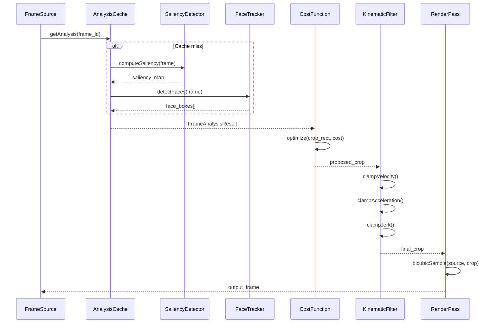

### Mermaid Class

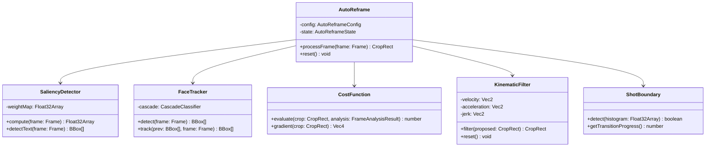

### Mermaid State

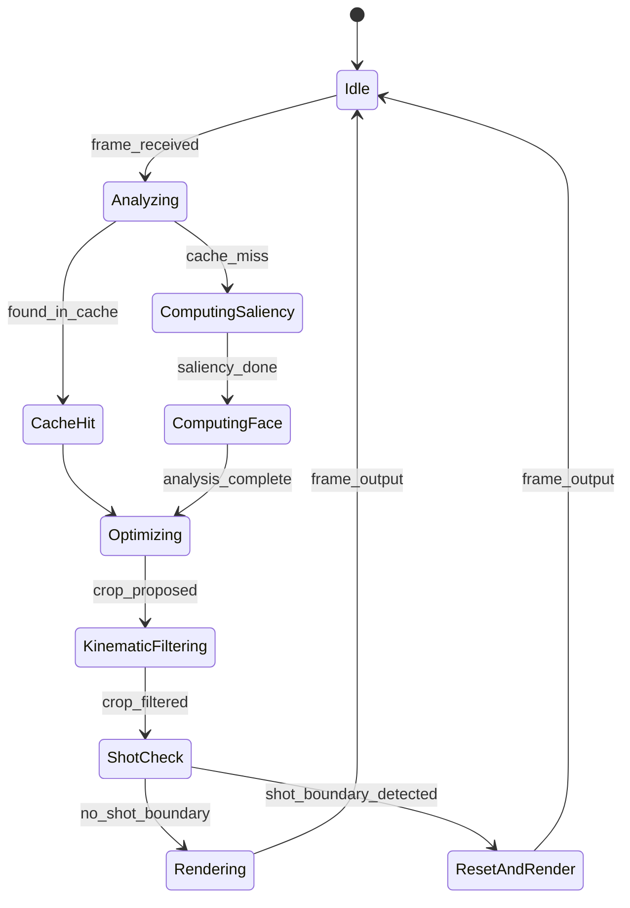

### Production Sorunlari ve Recovery

| Sorun | Belirti | Cozum |
|-------|---------|-------|
| Yuz tespit false positive | Olmayan yuze odaklanma | Min face boyut siniri,Confidence esigi > 0.5 |
| Hizli sahne degisimi | Takip atlamasi | Shot boundary ile reset, crossfade transition |
| Dusuk kontrast sahne | Saliency bos cikisi | Fallback: merkez crop |
| GPU readback gecikmesi | Frame drop | Async pipeline, buffer depth 3 |
| Coklu yuz caprazlasmasi | Tikanma | Hungarian algorithm ile atama |

### Performans, Benchmark

| Metrik | Deger |
|--------|-------|
| Analiz suresi (1080p) | < 8ms/frame (GPU) |
| Optimizasyon suresi | < 2ms/frame (CPU) |
| Toplam pipeline | < 15ms/frame |
| Bellek (analiz cache) | ~50MB (30 kare) |
| Hata payi (crop dogruluk) | < 2 piksel standart sapma |

### Gercek Dunya Uygulamasi

- YouTube Shorts otomatik yeniden cerceveleme
- Instagram Reels portre/gezi modu
- Video konferans kayitlari otomatik odaklama
- Spor yayinlari top/oyuncu takibi

### Olceklenebilirlik

- 4K kaynak icin: analiz cozunurlugu 1/4 olceklendirilir (270p)
- Coklu kamera: her kamera icin bagimsiz analysis pass
- Batch isleme: kare aralikli analiz (her 2. veya 3. kare)
- GPU compute shader ile paralel saliency hesaplama

### Ownership ve Test

- **Sahip**: Goruntuisleme takimi
- **Testler**: Unit test (cost function, kinematic), integration test (pipeline), visual regression test (referans kare karsilastirma)
- **CI**: Her PR'da 10 sn referans video ile test calistirma
- **Metrik**: PSNR > 35dB (bicubic yeniden olusturma), crop dogruluk > %95

---

## 26. Smart Crop

### Calisma Mekanizmasi ve Invariantlari

Smart Crop, farkli stratejilerle kaynak goruntuyu hedef en-boy oranina keser.

**Stratejiler**:
1. **Center Crop**: Merkeze sabit, basit
2. **Face-Aware Crop**: Yuz konumuna gore offset
3. **Content-Aware Crop**: Saliency haritasina gore optimal bolge

**En-Boy Orani Donusumu**:
```
source_ratio = W_s / H_s
target_ratio = W_o / H_o

if source_ratio > target_ratio:
    // Yatay genis, dikey kisaltma
    crop_width = H_s * target_ratio
    crop_height = H_s
    crop_x = (W_s - crop_width) / 2
    crop_y = 0
else:
    // Dikey uzun, yatay kisaltma
    crop_width = W_s
    crop_height = W_s / target_ratio
    crop_x = 0
    crop_y = (H_s - crop_height) / 2
```

**Face-Aware Offset**:
```
face_center_x = mean(face_centers_x)
face_center_y = mean(face_centers_y)

// Merkezden kayma
offset_x = clamp(face_center_x - W_s/2, -max_offset_x, max_offset_x)
offset_y = clamp(face_center_y - H_s/2, -max_offset_y, max_offset_y)

crop_x += offset_x
crop_y += offset_y
```

**Content-Aware Saliency Agirlikli Merkez**:
```
total_weight = sum(saliency_map)
cx = sum(x * saliency(x,y)) / total_weight
cy = sum(y * saliency(x,y)) / total_weight

// Agirlikli merkeze dogru kay
weight_factor = 0.6  // [0, 1]
crop_x += (cx - W_s/2) * weight_factor
crop_y += (cy - H_s/2) * weight_factor
```

**Overscan**: Kenar bilgisini kacirmamak icin hafif genisletme:
```
overscan_ratio = 1.05  // %5 fazla
crop_width *= overscan_ratio
crop_height *= overscan_ratio
// Sonra output boyutuna olceklendir
```

### Neden ve Alternatifler

| Strateji | Kalite | Hiz | Kullanim |
|----------|--------|-----|----------|
| Center crop | Dusuk | Cok hizli | Belgesel, genel |
| Face-aware | Orta | Hizli | Konusma, rpotre |
| Content-aware | Yuksek | Yavas | Reklam, sinema |

Sebep: Content-aware crop en iyi gorsel sonucu verir ancak GPU kaynagi gerektirir. Face-aware orta yol olarak genellikle yeterlidir.

### Veri Akisi

```
[Frame] -> [Config: target_ratio, strategy]
        -> [Face detect / saliency] (eger gerekliyse)
        -> [Aspect ratio hesapla]
        -> [Offset hesapla (face/saliency)]
        -> [Boundary clamp]
        -> [Overscan uygula]
        -> [Render: sample from crop rect]
        -> [Output frame]
```

### API/Interface/Model

```typescript
type CropStrategy = 'center' | 'face-aware' | 'content-aware';

interface SmartCropConfig {
  targetAspectRatio: number;
  strategy: CropStrategy;
  overscan: number;              // [1.0, 1.2]
  maxOffsetRatio: number;        // [0, 0.5]
  faceWeight: number;            // coklu yuz agirligi
  saliencyWeight: number;
}

interface CropResult {
  rect: CropRect;
  strategy: CropStrategy;
  facesUsed: BBox[];
  confidence: number;
}

interface SmartCropState {
  previousCrop: CropRect | null;
  smoothedOffset: Vec2;
  faceHistory: BBox[][];
}
```

### Dosya ve Klasor Yeri

```
src/effects/cropping/
  smart-crop.ts
  center-crop.ts
  face-aware-crop.ts
  content-aware-crop.ts
  overscan.ts
  smart-crop.test.ts
```

### Render Pipeline Entegrasyonu

```
Analysis phase:
  -> Yuz tespiti (face-aware icin)
  -> Saliency hesaplama (content-aware icin)

Render phase:
  -> Crop rect hesapla
  -> Bicubic/bilinear sampling ile piksel oku
  -> Output boyutuna olceklendir
  -> Kenar yumusatma (antialiasing)
```

### Mermaid Sequence

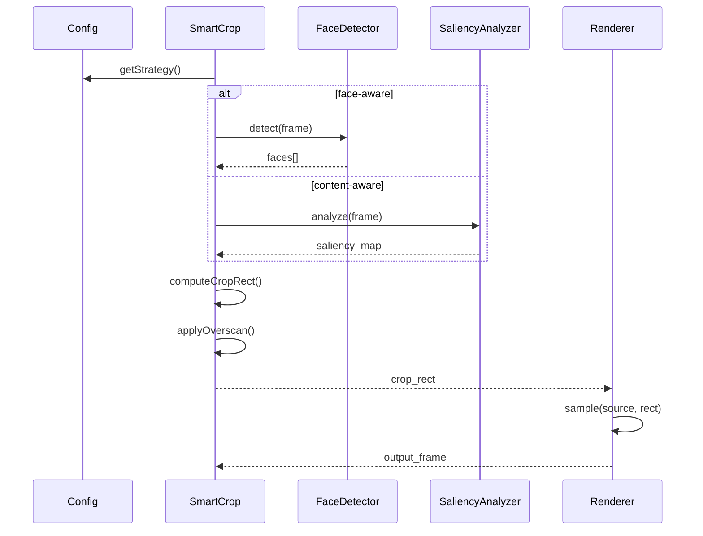

### Mermaid Class

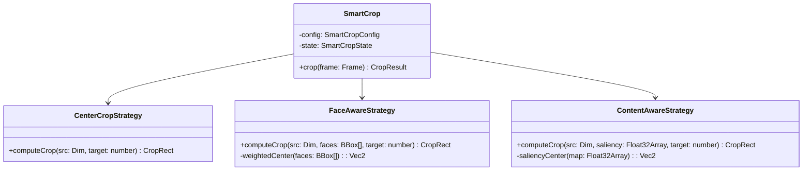

### Mermaid State

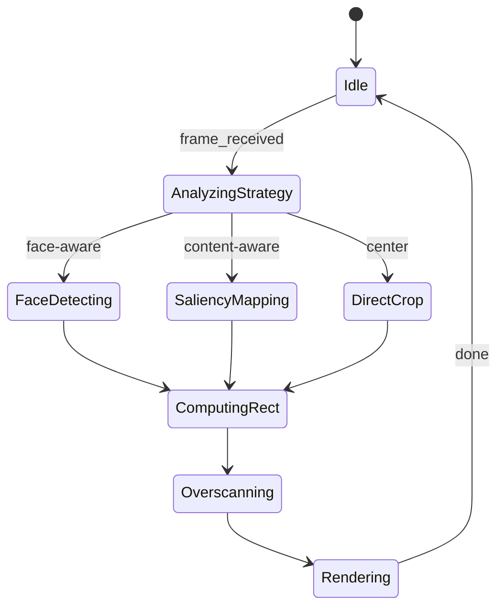

### Production Sorunlari ve Recovery

| Sorun | Belirti | Cozum |
|-------|---------|-------|
| Yuz tam gorunmuyor | Crop yuzu kesiyor | Face margin %20 artir |
| Coklu yuz, farkli boyut | Haksiz odak | Agirlikli merkez, buyuk yuze oncelik |
| Kenar pikseller | Siyah cerceve | Overscan + edge extend |
| Hizli sahne degisimi | Crop ziplamasi | Temporal smoothing (EMA) |

### Performans, Benchmark

| Metrik | Deger |
|--------|-------|
| Center crop | < 0.1ms |
| Face-aware | < 2ms (GPU face detect) |
| Content-aware | < 5ms (GPU saliency) |
| Bellek | < 10MB ekstra |

### Gercek Dunya Uygulamasi

- Sosyal medya video donusturme (16:9 -> 9:16)
- Haber kanallari otomatik cerceveleme
- Egitim videolari slayt takibi
- E-ticaret urun video kirsilastirmasi

### Olceklenebilirlik

- 4K: analiz 1080p'de, render 4K'da
- Coklu dil: metin bolgesi algilama ile
- Real-time: her karede degil, her 2. karede analiz

### Ownership ve Test

- **Sahip**: Goruntuisleme takimi
- **Testler**: Gorsel regression (50+ ornek), en-boy oran dogrulugu, yuz korunma testleri
- **CI**: Automated crop dogruluk olcumu

---

## 27. Camera Movement

### Calisma Mekanizmasi ve Invariantlari

Durgun bir kaynaktan hareketli kamera efekti uretir. Smooth pan, dolly, tracking shot emulasyonu.

**Pan Transform** (yatay/dikey kayma):
```
P_out(t) = P_in(t) + V_pan * t

V_pan = (vx, vy)  // piksel/sn
```

**Dolly Transform** (yaklasak/uzaklas):
```
scale(t) = s_0 + (s_1 - s_0) * ease(t/duration)

P_out = (P_in - center) * scale(t) + center
```

**Tracking Shot Emulasyonu**:
```
// Etkili kaynak genisletilir (overscan)
overscan_factor = 1.3
expanded_W = W_s * overscan_factor
expanded_H = H_s * overscan_factor

// Tracking yolu boyunca kayma
track_position(t) = interpolate(keyframes, t, cubic)
crop_rect = centered_crop(track_position(t), W_o, H_o)
```

**Perspektif Bozulma (Dolly)**:
```
// Basit dolly: olcekleme
// Ileri dolly: merkez genisler, kenarlar daralir (barrel distortion simulasyonu)
distortion_k = dolly_strength * scale(t)
r = distance(p, center) / max_radius
P_out = P_in * (1 + k * r^2)
```

**Easing Fonksiyonlari**:
```
ease_in(t)    = t^2
ease_out(t)   = 1 - (1-t)^2
ease_in_out(t) = t < 0.5 ? 2*t^2 : 1 - (-2*t+2)^2 / 2
smooth_step(t) = t * t * (3 - 2*t)
```

### Neden ve Alternatifler

| Efekt | Kaynak Gereksinimi | Gercekcilik |
|-------|-------------------|-------------|
| Pan | Overscan gerekli | Dusuk-Orta |
| Dolly | Derinlik haritasi yoksa basit | Orta |
| Tracking | Genisletilmis kaynak | Yuksek |

Sebep: Statik kaynaktan kamera hareketi emulasyonu, gercek kamera hareketi kaydedilemediginde veya uygun olmadiginda kullanilir. Overscan faktoru kaliteyi belirler.

### Veri Akisi

```
[Frame] -> [Config: movement_type, keyframes, easing]
        -> [Overscan hesapla]
        -> [Transform matrisi hesapla]
        -> [Perspektif bozulma (opsiyonel)]
        -> [Render: warp sample]
        -> [Output frame]
```

### API/Interface/Model

```typescript
type CameraMovementType = 'pan' | 'dolly-in' | 'dolly-out' | 'tracking';

interface CameraMovementConfig {
  type: CameraMovementType;
  duration: number;
  easing: EasingFunction;
  overshoot: number;             // [1.0, 2.0]
  panSpeed?: Vec2;
  dollyCenter?: Vec2;
  dollyRange?: [number, number];
  trackingKeyframes?: Vec2[];
}

interface TransformMatrix {
  m: [number, number, number, number, number, number, number, number, number];
}

interface CameraMovementState {
  progress: number;
  currentTransform: TransformMatrix;
  overscanBuffer: ImageBuffer;
}
```

### Dosya ve Klasor Yeri

```
src/effects/camera/
  camera-movement.ts
  pan-emulator.ts
  dolly-emulator.ts
  tracking-emulator.ts
  easing.ts
  perspective-warp.ts
  camera-movement.test.ts
  shaders/
    warp.vert
    perspective-distort.glsl
```

### Render Pipeline Entegrasyonu

```
Pre-process:
  -> Kaynagi overscan ile genislet
  -> Genisletilmis kareden hedef boyuta ornek

Per-frame:
  -> Transform matrisi hesapla (easing ile)
  -> Vertex shader'da warp uygula
  -> Fragment shader'da bicubic sample
```

### Mermaid Sequence

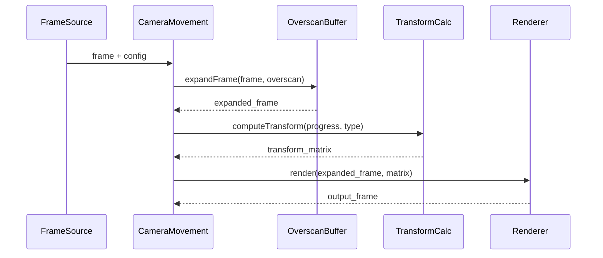

### Mermaid Class

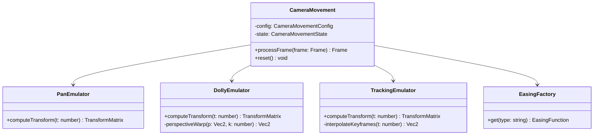

### Mermaid State

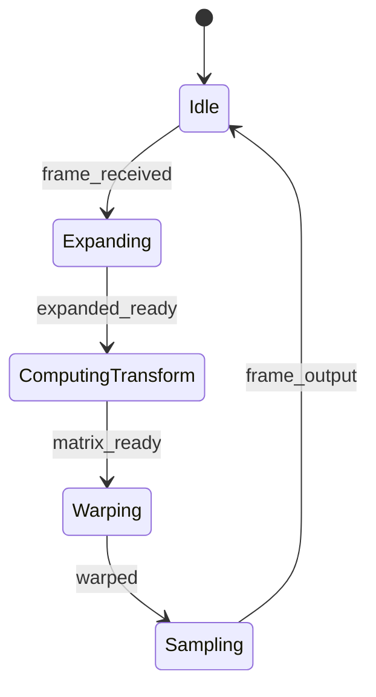

### Production Sorunlari ve Recovery

| Sorun | Belirti | Cozum |
|-------|---------|-------|
| Yetersiz overscan | Siyah kenarlar | Overscan minimum 1.2 |
| Hizli pan | Motion sickness | Max pan speed siniri |
| Dolly bozulma | Balik gozu efekti | Distortion k siniri |
| Tracking keyframe titresmesi | Titreşim | Catmull-Rom interpolation |

### Performans, Benchmark

| Metrik | Deger |
|--------|-------|
| Pan | < 1ms/frame |
| Dolly + warp | < 3ms/frame |
| Tracking | < 4ms/frame |
| Overscan bellek | ~2x kaynak (1.3x genisletme) |

### Gercek Dunya Uygulamasi

- Fotoğraf slayt gosterilerine canlilik katma
- Belgesel sahneleri
- Emlak tanitim videolari
- Dugun/fotograf montaj

### Olceklenebilirlik

- 4K: overscan buffer 1/2 cozunurlukte hesaplanir, upscale edilir
- Coklu kamera: her biri bagimsiz transform
- Batch: keyframe'ler toplu hesaplanir, onceki sonuclar cache'lenir

### Ownership ve Test

- **Sahip**: Goruntuisleme takimi
- **Testler**: Kenar bosluk testi, transform dogrulugu, easing grafik dogrulugu
- **CI**: Her PR'da 3 sn test video

---

## 28. Zoom Engine

### Calisma Mekanizmasi ve Invariantlari

Keyframe tabanli zoom efekti uretir. Ken Burns efekti dahil.

**Temel Zoom Transform**:
```
scale(t) = lerp(zoom_in, zoom_out, ease(t / duration))

P_out = (P_in - center) / scale(t) + center
```

**Ken Burns Efekti**:
```
// Zoom + pan kombinasyonu
scale(t) = s_start + (s_end - s_start) * ease(t/d)
offset(t) = pan_start + (pan_end - pan_start) * ease(t/d)

P_out = (P_in - offset(t)) / scale(t) + output_center
```

**Zoom Merkezi Noktasi**:
```
center = (cx, cy)  // normalized [0,1]
// Ekrannin istediginde odaklanir
// Ornek: yuz konumu, metin konumu, nesne konumu
```

**Min/Max Zoom Sinirlari**:
```
zoom_min = 1.0   // orijinal boyut
zoom_max = 5.0   // max buyutme
// Bu sinirlarin disinda piksel karisir (kaynak disi)
```

**Smooth Zoom** (keyframe'siz, surekli):
```
// Logaritmik interpolasyon daha dogal hissettirir
log_scale(t) = lerp(log(s_current), log(s_target), alpha)
scale(t) = exp(log_scale(t))
alpha = 1 - exp(-speed * dt)
```

**Jitter-Free Keyframe Zoom**:
```
// Keyframe'ler arasinda Catmull-Rom spline
// Turevi surekli, yani zoom hizi ani degismez
s(t) = catmull_rom(s_0, s_1, s_2, s_3, t)
```

**Optik Zoom Simulasyonu** (border efekti):
```
// Buyutulen bolgede hafif loşluk (vignette)
vignette_strength = (scale - zoom_min) / (zoom_max - zoom_min)
vignette = 1.0 - vignette_strength * distance_from_center * 0.3
P_out = P_out * vignette
```

### Neden ve Alternatifler

| Yaklasim | Dogal Gorunum | Kontrol |
|----------|--------------|---------|
| Linear zoom | Dusuk | Basit |
| Ease-in/out | Orta | Orta |
| Ken Burns | Yuksek | Yuksek |
| Smooth zoom | Yuksek | Dusuk (parametrik) |

Sebep: Ken Burns efekti statik goruntuyu canlandirmak icin endustri standardidir. Logaritmik interpolasyon insanoğlunun algisina daha yakindir.

### Veri Akisi

```
[Frame] -> [Config: zoom type, keyframes, center, limits]
        -> [Scale hesapla (easing/spline)]
        -> [Offset hesapla (Ken Burns)]
        -> [Boundary check]
        -> [Vignette uygula]
        -> [Render: sample from source]
        -> [Output frame]
```

### API/Interface/Model

```typescript
type ZoomType = 'zoom-in' | 'zoom-out' | 'ken-burns' | 'smooth';

interface ZoomConfig {
  type: ZoomType;
  duration: number;
  easing: EasingFunction;
  zoomCenter: Vec2;              // normalized
  zoomRange: [number, number];   // [min, max]
  keyframes?: ZoomKeyframe[];
  smoothSpeed: number;
  vignetteStrength: number;
}

interface ZoomKeyframe {
  time: number;                  // [0, 1]
  scale: number;
  center: Vec2;
}

interface ZoomState {
  currentScale: number;
  currentCenter: Vec2;
  splineCache: SplineInterpolated;
  outputBuffer: ImageBuffer;
}
```

### Dosya ve Klasor Yeri

```
src/effects/zoom/
  zoom-engine.ts
  ken-burns.ts
  smooth-zoom.ts
  zoom-keyframes.ts
  vignette.ts
  zoom-engine.test.ts
  shaders/
    zoom-sample.glsl
    vignette.glsl
```

### Render Pipeline Entegrasyonu

```
Per-frame:
  -> Scale degeri hesapla (spline veya easing)
  -> Zoom merkezini belirle
  -> Kaynaktan olcekli ornek al
  -> Vignette efekti uygula
  -> Bicubic interpolation ile kaliteyi koru
```

### Mermaid Sequence

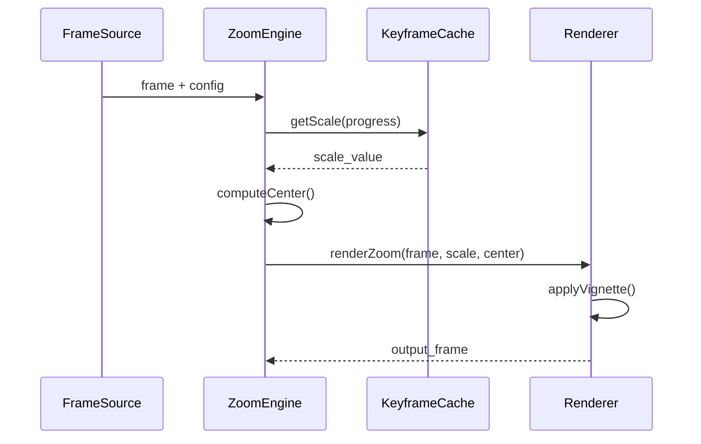

### Mermaid Class

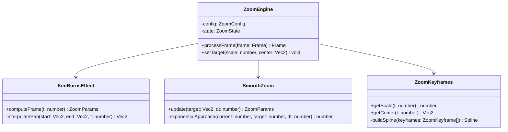

### Mermaid State

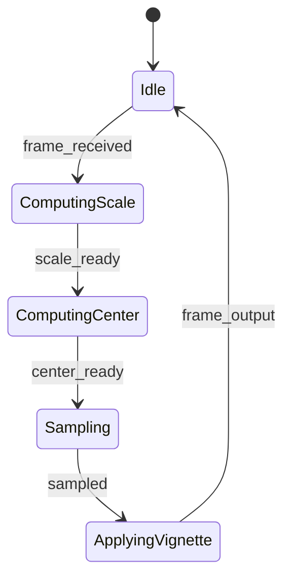

### Production Sorunlari ve Recovery

| Sorun | Belirti | Cozum |
|-------|---------|-------|
| Kaynak pikselleşme | Bulanik gorunum | Bicubic sampling, max zoom siniri |
| Zoom merkezi kaymasi | Titreşme | Smooth follow, EMA filtering |
| Ken Burns dogrusal | Monoton gorunum | Cubic easing, S-curve |
| Border pikseller | Siyah cerceve | Edge extend (clamp to edge) |

### Performans, Benchmark

| Metrik | Deger |
|--------|-------|
| Zoom hesaplama | < 0.5ms/frame |
| Bicubic sample | < 2ms/frame |
| Ken Burns + vignette | < 3ms/frame |
| Max zoom | 5x (1080p kaynakta) |

### Gercek Dunya Uygulamasi

- Fotoğraf video montaj (Ken Burns standart)
- Haber bultenleri goruntulu haber gecisleri
- Reklam urun detay gosterimi
- Dugun video efektleri

### Olceklenebilirlik

- 4K: bicubic sample icin 4x4 piksel cekme, L2 cache optimized
- Coklu zoom: ayni kare uzerinde katmanli zoom (picture-in-picture)
- Batch: spline onceden hesaplanir, sadece deger okunur

### Ownership ve Test

- **Sahip**: Goruntuisleme takimi
- **Testler**: Scale dogrulugu, zoom merkez kararliligi, vignette gorsel test
- **CI**: Keyframe-based referans kare karsilastirma

---

## 29. Pan Engine

### Calisma Mekanizmasi ve Invariantlari

Yatay ve dikey kayma (pan) efekti uretir. Paralaks efekti destegi vardir.

**Temel Pan Transform**:
```
offset(t) = speed * t

P_out(x,y) = P_in(x + offset_x(t), y + offset_y(t))
```

**Paralaks Etkisi** (coklu katman):
```
// On plan daha hizli, arka plan daha yavas kayar
layer_offset[i] = base_speed * parallax_factor[i]

parallax_factor:
  foreground = 1.5
  midground  = 1.0
  background = 0.5
```

**Paralaks Derinlik Haritasi**:
```
// Her piksel icin derinlik degeri [0,1]
depth_map(x,y) -> [0=uzak, 1=yakin]

layer_offset(x,y) = base_speed * depth_map(x,y) * max_parallax
```

**Pan Hiz Sinirlari**:
```
v_max_horizontal = 0.3 * W_s  // saniyede kaynak genisliginin %30'u
v_max_vertical   = 0.3 * H_s
```

**Pan Boundary**:
```
// Pan kaynak sinirlarini asamaz
offset_x_clamped = clamp(offset_x, -(W_s - W_o)/2, (W_s - W_o)/2)
offset_y_clamped = clamp(offset_y, -(H_s - H_o)/2, (H_s - H_o)/2)
```

**Bounce Pan** (sinirda geri donus):
```
if |offset| >= max_offset:
    direction = -direction
    offset = max_offset * sign(offset)
```

### Neden ve Alternatifler

| Pan Turu | Basitlik | Gercekcilik |
|----------|----------|-------------|
| Sabit hiz | Basit | Dusuk |
| Eased pan | Orta | Orta |
| Parallax pan | Karmaşık | Yuksek |
| Derinlik haritali pan | Cok karmaşık | Cok yuksek |

Sebep: Paralaks, 2D goruntulerde 3 boyut hissi yaratir. Derinlik haritasi mevcutsa kullanilmalidir.

### Veri Akisi

```
[Frame] -> [Config: direction, speed, parallax, bounds]
        -> [Parallax factor hesapla (depth map varsa)]
        -> [Offset hesapla]
        -> [Boundary clamp / bounce]
        -> [Render: translate sample]
        -> [Output frame]
```

### API/Interface/Model

```typescript
type PanDirection = 'left' | 'right' | 'up' | 'down' | 'custom';

interface PanConfig {
  direction: PanDirection;
  customDirection?: Vec2;
  speed: number;                 // piksel/sn
  easing: EasingFunction;
  duration: number;
  bounce: boolean;
  parallax: boolean;
  depthMap?: Float32Array;
  maxParallaxFactor: number;
}

interface PanState {
  currentOffset: Vec2;
  velocity: Vec2;
  direction: number;
  bounds: Rect;
}

interface ParallaxLayer {
  depth: number;                 // [0,1]
  offset: Vec2;
}
```

### Dosya ve Klasor Yeri

```
src/effects/pan/
  pan-engine.ts
  parallax.ts
  depth-analyzer.ts
  pan-boundary.ts
  pan-engine.test.ts
  shaders/
    parallax-sample.glsl
    depth-read.glsl
```

### Render Pipeline Entegrasyonu

```
Pre-process:
  -> Derinlik haritasi varsa analiz et
  -> Katmanlari ayir (eger segmentasyon mevcutsa)

Per-frame:
  -> Her katman icin offset hesapla
  -> Derinlik bazli paralaks uygula
  -> Birlesik goruntu olustur
  -> Boundary kontrolu
```

### Mermaid Sequence

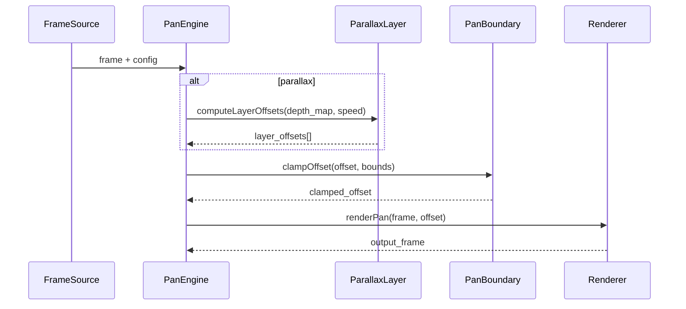

### Mermaid Class

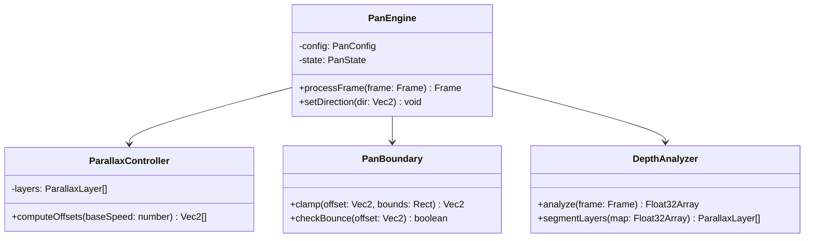

### Mermaid State

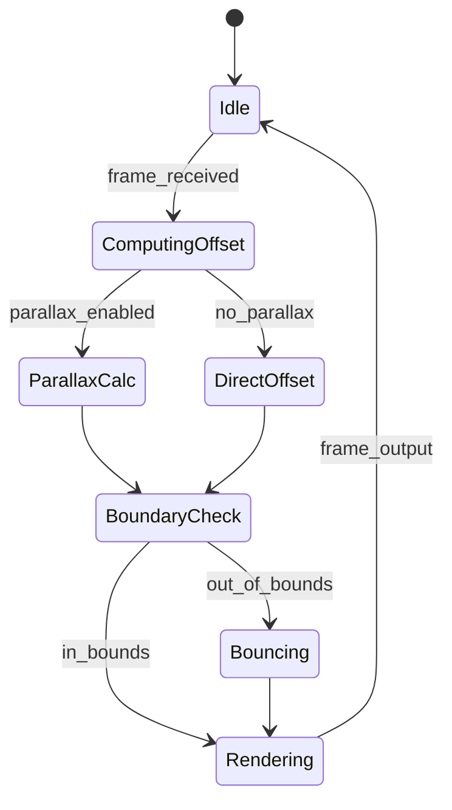

### Production Sorunlari ve Recovery

| Sorun | Belirti | Cozum |
|-------|---------|-------|
| Hizli pan bulaniklik | Motion blur istenmeyen | Temporal stabilization |
| Paralaks titresmesi | Derinlik haritasi gurultusu | Depth map gaussian blur |
| Sinir asimi | Siyah kenar | Edge extend + boundary clamp |
| Coklu katman cakismasi | Ghosting | Katman oncelik sirasi |

### Performans, Benchmark

| Metrik | Deger |
|--------|-------|
| Basit pan | < 0.5ms |
| Paralaks pan | < 4ms (GPU depth read) |
| Derinlik analizi | < 10ms (onceki analysis pass) |
| Bellek | Depth map: W*H*4 byte |

### Gercek Dunya Uygulamasi

- 2.5D belgesel sahneleri (fotoğraf pan)
- Tarihi harita gosterimleri
- Mimari gorsellestirme
- Oyun tanitim videolari

### Olceklenebilirlik

- 4K: depth map 1/4 olcekte hesaplanir
- Coklu katman: her katman GPU'da paralel islenir
- Real-time: depth map per-frame degil, sahne basinda bir kez

### Ownership ve Test

- **Sahip**: Goruntuisleme takimi
- **Testler**: Boundary dogrulugu, paralaks oran testi, hiz siniri testi
- **CI**: Automated offset dogruluk olcumu

---

## 30. Shake Engine

### Calisma Mekanizmasi ve Invariantlari

Titresim/hareket efekti uretir. El titremesi, deprem, vibrasyon modlari.

**Temel Shake Transform**:
```
shake_x(t) = A_x * sin(2 * pi * f_x * t + phi_x) * damping(t)
shake_y(t) = A_y * sin(2 * pi * f_y * t + phi_y) * damping(t)
shake_r(t) = A_r * sin(2 * pi * f_r * t + phi_r) * damping(t)  // rotasyon

P_out = rotate(P_in + (shake_x, shake_y), shake_r)
```

**El Titremesi Simulasyonu** (Brown motion):
```
// Ornstein-Uhlenbeck process
dx = theta * (mu - x) * dt + sigma * dW

x: position, theta: mean reversion, mu: mean, sigma: volatilite
dW: Wiener process increment (random normal)
```

**Deprem Efekti**:
```
// Dusuk frekans, yuksek genlik
f_low = 2-5 Hz
A_high = 5-20 piksel
// Perlin noise ile dogal dalga
shake = perlin_noise(t * frequency) * amplitude
```

**Vibrasyon**:
```
// Yuksek frekans, dusuk genlik
f_high = 30-60 Hz
A_low = 1-3 piksel
```

**Damping (Azalma)**:
```
damping(t) = exp(-lambda * t)

lambda = damping_rate (ornek: 2.0 = 3 saniyede %95 azalma)
// Titresim zamanla azalir
```

**Frekans/Amplitud Kontrol**:
```
// Frekans araliği: [0.5, 100] Hz
// Amplitud araliği: [0.1, 50] piksel
// Phase rastgele veya sabit

// Coklu frekans katmani (gercekci)
shake(t) = sum(A_i * sin(2*pi*f_i*t + phi_i), i=1..N)
// N=3-5 genellikle yeterli
```

**Rotasyon Shake**:
```
// Kucuk acilar icin (sin(theta) ≈ theta)
rotation_shake(t) = A_rot * sin(2*pi*f_rot*t) * damping(t)
// A_rot genellikle [-2, 2] derece
```

### Neden ve Alternatifler

| Mod | Dogal Gorunum | Kontrol Zorlugu |
|-----|--------------|-----------------|
| Sin-based | Dusuk | Kolay |
| Brown motion | Yuksek | Orta |
| Perlin noise | Yuksek | Orta |
| Rastgele | Dusuk | Kolay |

Sebep: Brown motion en dogal el titresimini simule eder ancak parametre ayari zordur. Sin-based basit ama yapay gorunebilir.

### Veri Akisi

```
[Frame] -> [Config: mode, frequency, amplitude, damping, duration]
        -> [Shake degeri hesapla (sin/noise/brown)]
        -> [Damping uygula]
        -> [Transform: translate + rotate]
        -> [Edge handling]
        -> [Render: warp sample]
        -> [Output frame]
```

### API/Interface/Model

```typescript
type ShakeMode = 'handheld' | 'earthquake' | 'vibration' | 'custom';

interface ShakeConfig {
  mode: ShakeMode;
  frequency: Vec3;              // [f1, f2, f3] Hz
  amplitude: Vec3;              // [a1, a2, a3] piksel
  rotationAmplitude: number;    // derece
  dampingRate: number;          // [0.1, 10]
  seed: number;
  layers: number;               // [1, 5]
}

interface ShakeState {
  time: number;
  brownState: Vec2;
  phaseOffsets: Vec3[];
  edgeHandler: EdgeHandler;
}

interface EdgeHandler {
  type: 'clamp' | 'mirror' | 'extend' | 'black';
  padding: number;
}
```

### Dosya ve Klasor Yeri

```
src/effects/shake/
  shake-engine.ts
  brown-motion.ts
  perlin-noise.ts
  damping.ts
  edge-handler.ts
  shake-engine.test.ts
  shaders/
    shake-warp.glsl
    rotation-sample.glsl
```

### Render Pipeline Entegrasyonu

```
Pre-process:
  -> Ken uzatma buffer hazirla (edge handling icin)

Per-frame:
  -> Shake degeri hesapla
  -> Translate + rotate matrisi olustur
  -> Vertex shader'da warp
  -> Fragment shader'da ornekleme
  -> Edge handling uygula
```

### Mermaid Sequence

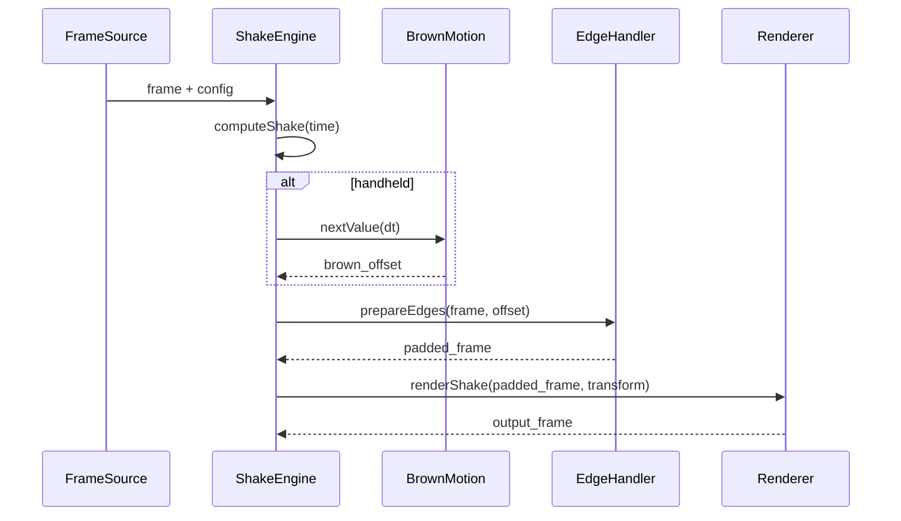

### Mermaid Class

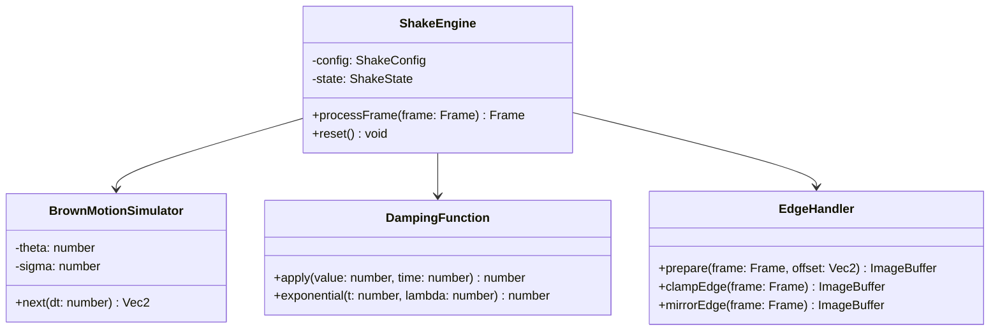

### Mermaid State

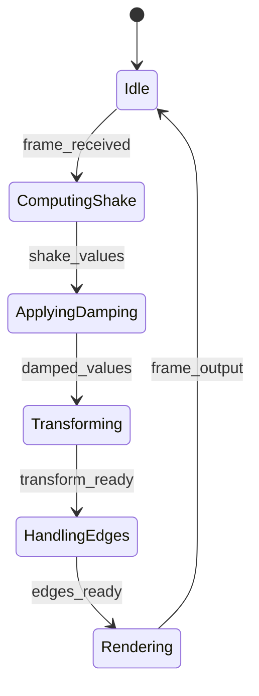

### Production Sorunlari ve Recovery

| Sorun | Belirti | Cozum |
|-------|---------|-------|
| Ken siyahligi | Shake genligi buyuk | Edge extend + padding |
| Fazla titresim | Hasta edici | Max amplitude siniri |
| Periyodik gorunum | Yapaylik | Phase randomizasyonu |
| Damping cok hizli | Titresim aninda durma | Min damping suresi |

### Performans, Benchmark

| Metrik | Deger |
|--------|-------|
| Shake hesaplama | < 0.2ms/frame |
| Edge padding | < 1ms/frame |
| Warp + sample | < 2ms/frame |
| Toplam | < 3ms/frame |

### Gercek Dunya Uygulamasi

- Aksiyon sahnelerine gerilik katma
- Korku filmi efektleri
- Muzik klip dinamizm
- Spor yayini "replay" efekti

### Olceklenebilirlik

- 4K: edge padding orani ayni, pixel sayisi artar
- Coklu katman: her katman bagimsiz shake
- GPU: per-pixel noise uretimi ile paralel

### Ownership ve Test

- **Sahip**: Goruntuisleme takimi
- **Testler**: Sinir deger testi, damping dogrulugu, edge handling gorsel test
- **CI**: Amplitude spectrum analizi (FFT test)

---

## 31. Motion Blur

### Calisma Mekanizmasi ve Invariantlari

Hareketli nesnelerde veya kamerada bulaniklik efekti uretir.

**Shutter Angle Modeli**:
```
// Kamera deklanşör acisi (derece)
shutter_angle = 360  // tam acik (en bulanik)
shutter_angle = 180  // standart sinematografik
shutter_angle = 0    // keskin

blur_amount = shutter_angle / 360 * frame_duration
// frame_duration = 1/fps (ornek: 1/24 = 41.67ms)
```

**Motion Vector Bazli Blur**:
```
// Her piksel icin hareket vektoru
MV(x,y) = (mv_x, mv_y)  // piksel/kare

// Blur kerneli
blur_length = |MV(x,y)| * shutter_factor
blur_direction = normalize(MV(x,y))

// Ornek noktalari
for i in range(num_samples):
    t = (i / num_samples - 0.5) * blur_length
    sample_pos = (x, y) + t * blur_direction
    color += sample(source, sample_pos)
color /= num_samples
```

**Yonei Bulaniklik (Directional Blur)**:
```
// Tum pikseller ayni yonde bulaniklasir
direction = normalize((dx, dy))
blur_length = L

for i in range(num_samples):
    t = (i / num_samples - 0.5) * L
    sample_pos = pixel + t * direction
    color += sample(source, sample_pos)
```

**Nesne Bazli Blur**:
```
// Her nesne icin ayri motion vector
// Foreground: agir blur
// Background: hafif blur (veya hic)
blur_strength = object_depth * global_blur_factor

// Nesne segmentasyonu ile
foreground_blur = blur_length * 1.0
background_blur = blur_length * 0.3
```

**Temporal Ornekleme**:
```
// Kalite icin coklu temporal ornek
num_temporal_samples = 8  // [4, 16]

// Her temporal ornek icin kaynak kare
for t in temporal_samples:
    source_frame = getFrame(frame_id + t)
    accumulated += blend(source_frame, weight[t])

output = accumulated / sum(weights)
```

**Gather vs Scatter**:
```
// Gather: her cikti pikseline kac kaynak piksel gider
// Scatter: her kaynak piksel kac cikti pikseline yayilir
// GPU'da gather daha verimli

// Gather yaklasimi
for each output pixel (x, y):
    color = 0
    for s in range(num_samples):
        t = (s / num_samples - 0.5)
        src_x = x - mv_x(x,y) * t * shutter
        src_y = y - mv_y(x,y) * t * shutter
        color += sample(source, src_x, src_y)
    output(x, y) = color / num_samples
```

### Neden ve Alternatifler

| Teknik | Kalite | Performans | Gereksinim |
|--------|--------|------------|------------|
| Box blur | Dusuk | Cok hizli | Yok |
| Directional blur | Orta | Hizli | Yon bilgisi |
| Motion vector blur | Yuksek | Yavas | MV haritasi |
| Temporal blur | Cok yuksek | Cok yavas | Coklu kare |

Sebep: Motion vector blur sinematografik kalite saglar. MV haritasi mevcut degilse directional blur fallback olarak kullanilir.

### Veri Akisi

```
[Frame] + [Motion Vectors] -> [Config: shutter_angle, samples, mode]
        -> [MV haritasini olcekle]
        -> [Per-pixel blur kernel hesapla]
        -> [Gather ornekleri topla]
        -> [Gamma-aware blend]
        -> [Output frame]
```

### API/Interface/Model

```typescript
type MotionBlurMode = 'directional' | 'per-pixel' | 'per-object';

interface MotionBlurConfig {
  mode: MotionBlurMode;
  shutterAngle: number;          // [0, 360]
  numSamples: number;            // [2, 16]
  temporalSamples: number;       // [1, 8]
  directionalAngle?: number;     // derece
  directionalLength?: number;    // piksel
  depthBased: boolean;
  depthFactor: number;
}

interface MotionVector {
  x: number;
  y: number;
  confidence: number;
}

interface MotionBlurState {
  mvBuffer: Float32Array;
  temporalBuffer: ImageBuffer[];
  accumulatedBuffer: ImageBuffer;
}
```

### Dosya ve Klasor Yeri

```
src/effects/motion-blur/
  motion-blur-engine.ts
  directional-blur.ts
  per-pixel-blur.ts
  temporal-blur.ts
  mv-processor.ts
  motion-blur-engine.test.ts
  shaders/
    motion-vector-sample.glsl
    gather-blur.glsl
    scatter-blur.glsl
```

### Render Pipeline Entegrasyonu

```
Analysis phase:
  -> Optik akis veya MV haritasi uretimi
  -> Derinlik haritasi (varsa)

Per-frame:
  -> MV haritasini shutter_angle ile olcekle
  -> GPU compute: gather blur kernel
  -> Temporal blend (eger multi-sample)
  -> Gamma-correct accumulation
```

### Mermaid Sequence

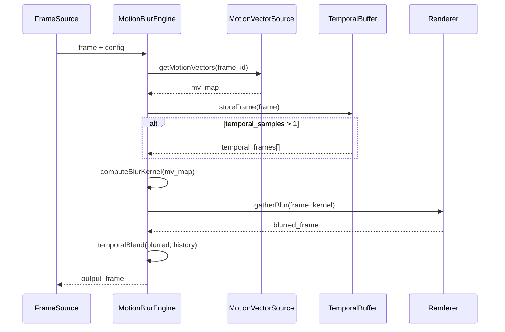

### Mermaid Class

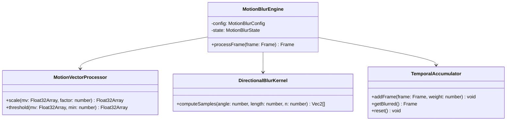

### Mermaid State

```mermaid
stateDiagram-v2
    [*] --> Idle
    Idle --> GettingMV : frame_received
    GettingMV --> ComputingKernel : mv_ready
    ComputingKernel --> Gathering : kernel_ready
    Gathering --> TemporalBlend : blurred
    TemporalBlend --> Idle : frame_output
    Gathering --> Idle : no_temporal
```

### Production Sorunlari ve Recovery

| Sorun | Belirti | Cozum |
|-------|---------|-------|
| MV gurultusu | Yanlis bulaniklik | MV gaussian blur filtresi |
| Fazla sample | Yavas render | Adaptive sample: buyuk MV'de daha cok |
| Color bleeding | Renk sicramasi | Bicubic sample, alpha clamp |
| Temporal ghosting | Gecmis kare izi | Ağırlık azaltma, buffer reset |

### Performans, Benchmark

| Metrik | Deger |
|--------|-------|
| Directional blur (4 sample) | < 3ms |
| Per-pixel blur (8 sample) | < 8ms |
| Temporal (4 kare) | < 12ms |
| GPU gather | < 2ms (shader) |

### Gercek Dunya Uygulamasi

- Sinematografik hareket bulanikligi
- Hizli aksiyon sahneleri
- Ucus sahneleri
- Spor golleri

### Olceklenebilirlik

- 4K: adaptive sample (daha az sample, daha buyuk kernel)
- Coklu nesne: nesne bazli MV segmentasyon
- GPU: compute shader ile paralel gather

### Ownership ve Test

- **Sahip**: Goruntuisleme takimi
- **Testler**: Blur dogrulugu, MV dogrulugu, temporal kararlilik
- **CI**: PSNR testi (blur-free ground truth karsilastirma)

---

## 32. Glow

### Calisma Mekanizmasi ve Invariantlari

Parlak bolgeler etrafinda yumusak isik yayilimi efekti.

**Threshold (Esik)**:
```
// HDR threshold ile parlak pikselleri ayikla
brightness = dot(color, vec3(0.2126, 0.7152, 0.0722))
glow_mask = max(0, (brightness - threshold) / (1 - threshold))

// threshold [0, 1] araliginda
// 0.0 = tum pikseller glow yapar
// 0.8 = sadece cok parlak pikseller
```

**Gaussian Blur Piramit**:
```
// Coklu olcekli blur (pyramid blur)
level_0 = original
level_1 = gaussian_blur(level_0, sigma_1)
level_2 = gaussian_blur(level_1, sigma_2)
level_3 = gaussian_blur(level_2, sigma_3)

// Her seviye daha genis yayilim saglar
// sigma degerleri: 4, 8, 16, 32 piksel
```

**Additive Blend**:
```
// Glow katmanini orijinale ekle
result = original + glow_mask * intensity * glow_layer

// intensity [0, 5] araliginda
// >1.0 overexposure etkisi verir
```

**HDR Threshold**:
```
// HDR kaynaklarda (float texture)
hdr_threshold = 2.0  // orijinal deger > 2.0 ise glow
hdr_scale = (hdr_value - hdr_threshold) / hdr_max

// LDR kaynaklarda
ldr_threshold = 0.7  // [0,1] normalized
```

**Glow Intensity Kontrolu**:
```
final_glow = glow_layer * intensity
// intensity = 1.0: dogal
// intensity = 2.0: dramatik
// intensity = 0.5: ince, zarif
```

**Bloom Farki**:
```
// Glow: tek katmanli, basit
// Bloom: cok katmanli piramit, daha zengin
// Glow genellikle tek sigma ile yapilir
// Bloom'un bright pass'i daha agresif
```

### Neden ve Alternatifler

| Teknik | Kalite | Hiz | Bellek |
|--------|--------|-----|--------|
| Tek sigma glow | Orta | Cok hizli | Dusuk |
| Piramit glow | Yuksek | Hizli | Orta |
| HDR glow | Cok yuksek | Orta | Yuksek |
| Multi-pass bloom | Cok yuksek | Yavas | Yuksek |

Sebep: Basit glow tek pass ile yapilabilir ama kalitesi dusuktur. Piramit yaklasim hem hizli hem kalitelidir.

### Veri Akisi

```
[Frame] -> [Config: threshold, intensity, radius]
        -> [Brightness hesapla]
        -> [Threshold uygula -> glow_mask]
        -> [Gaussian blur (piramit)]
        -> [Additive blend with original]
        -> [Output frame]
```

### API/Interface/Model

```typescript
interface GlowConfig {
  threshold: number;             // [0, 1]
  intensity: number;             // [0, 5]
  radius: number;                // piksel
  levels: number;                // [1, 5]
  sigma: number[];               // her seviye icin
  hdrThreshold: number;
  blendMode: 'additive' | 'screen' | 'soft-light';
}

interface GlowState {
  thresholdBuffer: ImageBuffer;
  blurPyramid: ImageBuffer[];
  compositeBuffer: ImageBuffer;
}

type BlendMode = 'additive' | 'screen' | 'soft-light';
```

### Dosya ve Klasor Yeri

```
src/effects/glow/
  glow-engine.ts
  threshold.ts
  gaussian-blur.ts
  blend.ts
  glow-engine.test.ts
  shaders/
    threshold.glsl
    gaussian-blur.glsl
    additive-blend.glsl
```

### Render Pipeline Entegrasyonu

```
Analysis phase: yok

Render phase:
  -> Threshold pass (GPU)
  -> Blur pass (GPU, coklu seviye)
  -> Blend pass (GPU)
  -> Tone mapping (eger HDR)
```

### Mermaid Sequence

```mermaid
sequenceDiagram
    participant F as FrameSource
    participant GE as GlowEngine
    participant TH as ThresholdPass
    participant GB as GaussianBlur
    participant BL as BlendPass
    participant R as Renderer

    F->>GE: frame + config
    GE->>TH: applyThreshold(frame, threshold)
    TH-->>GE: glow_mask
    GE->>GB: blurPyramid(glow_mask, levels)
    GB-->>GE: blurred_glow
    GE->>BL: additiveBlend(frame, blurred_glow, intensity)
    BL-->>GE: glow_result
    GE-->>R: output_frame
```

### Mermaid Class

```mermaid
classDiagram
    class GlowEngine {
        -config: GlowConfig
        -state: GlowState
        +processFrame(frame: Frame) Frame
    }
    class ThresholdPass {
        +apply(frame: Frame, threshold: number) ImageBuffer
        +applyHDR(frame: Frame, threshold: number) ImageBuffer
    }
    class GaussianBlurPyramid {
        +build(mask: ImageBuffer, levels: number, sigma: number[]) ImageBuffer[]
        +blurLevel(input: ImageBuffer, sigma: number) ImageBuffer
    }
    class BlendPass {
        +additive(base: Frame, glow: ImageBuffer, intensity: number) Frame
        +screen(base: Frame, glow: ImageBuffer, intensity: number) Frame
    }
    GlowEngine --> ThresholdPass
    GlowEngine --> GaussianBlurPyramid
    GlowEngine --> BlendPass
```

### Mermaid State

```mermaid
stateDiagram-v2
    [*] --> Idle
    Idle --> Thresholding : frame_received
    Thresholding --> Blurring : mask_ready
    Blurring --> Blending : blurred_ready
    Blending --> Idle : frame_output
```

### Production Sorunlari ve Recovery

| Sorun | Belirti | Cozum |
|-------|---------|-------|
| Cok parlak glow | Overexposure | Intensity max siniri, tone mapping |
| Renk kayması | Renkli glow | Luminance threshold, chroma preserve |
| Ken parlakligi | Border artifact | Edge padding oncesi |
| Dusuk threshold gurultusu | Istenmeyen glow | Min brightness esigi |

### Performans, Benchmark

| Metrik | Deger |
|--------|-------|
| Threshold | < 0.5ms |
| Tek seviye blur | < 1ms |
| 4 seviye piramit | < 3ms |
| Blend | < 0.5ms |
| Toplam | < 5ms |

### Gercek Dunya Uygulamasi

- Gece sahneleri atmosfer
- Neon isik efektleri
- Fantastik/bilim kurgu efektleri
- Muzik klip parilti efektleri

### Olceklenebilirlik

- 4K: blur piramit ayni kalir, sadece olcekleme degisir
- Coklu glow: farkli threshold'larla katmanlama
- GPU: her seviye ayri render pass

### Ownership ve Test

- **Sahip**: Goruntuisleme takimi
- **Testler**: Threshold dogrulugu, blend kalitesi, overexposure test
- **CI**: Histogram analizi (glow intensity distribution)

---

## 33. Bloom

### Calisma Mekanizmasi ve Invariantlari

Glow'un gelistirilmis versiyonu, coklu piramit yapisi ile daha zengin parlaklik yayilimi.

**Bright Pass Extract**:
```
// Parlak pikselleri ayikla
luminance = dot(color, vec3(0.2126, 0.7152, 0.0722))
bright_mask = smoothstep(bright_threshold, bright_threshold + softness, luminance)

// softness: yumusak gecis [0.01, 0.3]
// bright_threshold: [0.5, 2.0] (HDR icin > 1.0)
```

**Multi-Pass Pyramid**:
```
// Her seviye: downsample + blur
level[0] = bright_pass_extract(frame)
level[1] = downsample(level[0]) -> blur(sigma=4)
level[2] = downsample(level[1]) -> blur(sigma=8)
level[3] = downsample(level[2]) -> blur(sigma=16)
level[4] = downsample(level[3]) -> blur(sigma=32)

// Downsample: box filter veya tent filter
// Blur: dual kawase veya gaussian
```

**Dual Kawase Blur** (optimize):
```
// Upsample: 13-tap filter
upsample(x,y) = 0.5 * center + 0.125 * (tl + tr + bl + br) + 0.0625 * (t2l + t2r + b2l + b2r)

// Downsample: 4-tap filter
downsample(x,y) = 0.25 * (tl + tr + bl + br)

// 2x daha az texture sample ile gaussian'a yakin sonuc
```

**Piramit Toplama**:
```
// Tum seviyeleri birlestir
bloom = level[0] * weight[0]
      + level[1] * weight[1]
      + level[2] * weight[2]
      + level[3] * weight[3]
      + level[4] * weight[4]

// Agirliklar: [0.25, 0.25, 0.2, 0.15, 0.15] (toplam = 1.0)
```

**Composite**:
```
// Bloom'u orijinale ekle
result = frame + bloom * intensity

// HDR icin tone mapping gerekli
result = tone_map(result, exposure, gamma)
```

**Threshold ve Radius Ileriski**:
```
// Threshold arttirma: daha az parlak piksel glow yapar
// Radius arttirma: daha genis yayilim
// Intensity: genel parlaklik carpani

// Ornegin: sinematografik bloom
threshold = 0.8
radius = 32 piksel
intensity = 0.6
```

### Neden ve Alternatifler

| Teknik | Kalite | Hiz | Esneklik |
|--------|--------|-----|----------|
| Basit glow | Orta | Cok hizli | Dusuk |
| Bloom (gaussian pyramid) | Yuksek | Orta | Orta |
| Dual Kawase bloom | Yuksek | Hizli | Orta |
| Filament bloom (Frostbite) | Cok yuksek | Yavas | Yuksek |

Sebep: Bloom, glow'dan daha zengin cunku her seviye bagimsiz kontrol edilebilir. Dual Kawase hizli ve yeterince kalitelidir.

### Veri Akisi

```
[Frame] -> [Bright pass extract]
        -> [Downsample + blur pyramid]
        -> [Level aggregation]
        -> [Composite with original]
        -> [Tone mapping]
        -> [Output frame]
```

### API/Interface/Model

```typescript
interface BloomConfig {
  brightThreshold: number;       // [0, 2]
  softness: number;              // [0.01, 0.3]
  levels: number;                // [3, 6]
  radius: number;                // piksel (toplam)
  intensity: number;             // [0, 5]
  levelWeights: number[];        // her seviye agirligi
  blurType: 'gaussian' | 'dual-kawase';
  toneMapping: ToneMappingConfig;
}

interface BloomState {
  brightPassBuffer: ImageBuffer;
  pyramid: ImageBuffer[];
  compositeBuffer: ImageBuffer;
  toneMapBuffer: ImageBuffer;
}

interface ToneMappingConfig {
  exposure: number;
  gamma: number;
  mode: 'reinhard' | 'aces' | 'filmic';
}
```

### Dosya ve Klasor Yeri

```
src/effects/bloom/
  bloom-engine.ts
  bright-pass.ts
  pyramid-builder.ts
  dual-kawase.ts
  composite.ts
  tone-mapper.ts
  bloom-engine.test.ts
  shaders/
    bright-pass.glsl
    downsample.glsl
    upsample.glsl
    dual-kawase-down.glsl
    dual-kawase-up.glsl
    tone-map.glsl
```

### Render Pipeline Entegrasyonu

```
Render phase (GPU-bound):
  -> Bright pass (fullscreen quad)
  -> Her seviye icin: downsample + blur
  -> Upsample + accumulation
  -> Composite
  -> Tone mapping
```

### Mermaid Sequence

```mermaid
sequenceDiagram
    participant F as FrameSource
    participant BE as BloomEngine
    participant BP as BrightPass
    participant PB as PyramidBuilder
    participant C as Composite
    participant TM as ToneMapper

    F->>BE: frame + config
    BE->>BP: extractBright(frame, threshold)
    BP-->>BE: bright_mask
    BE->>PB: buildPyramid(bright_mask, levels)
    PB-->>BE: pyramid_levels[]
    BE->>C: aggregate(pyramid, weights)
    C-->>BE: bloom_layer
    BE->>C: composite(frame, bloom, intensity)
    C-->>BE: composited
    BE->>TM: toneMap(composited, exposure)
    TM-->>BE: final_frame
    BE-->>F: output
```

### Mermaid Class

```mermaid
classDiagram
    class BloomEngine {
        -config: BloomConfig
        -state: BloomState
        +processFrame(frame: Frame) Frame
    }
    class BrightPassExtractor {
        +extract(frame: Frame, threshold: number) ImageBuffer
    }
    class PyramidBuilder {
        +build(input: ImageBuffer, levels: number) ImageBuffer[]
        +downsample(level: ImageBuffer) ImageBuffer
        +upsample(level: ImageBuffer) ImageBuffer
    }
    class DualKawaseBlur {
        +downsample(input: ImageBuffer) ImageBuffer
        +upsample(input: ImageBuffer) ImageBuffer
    }
    class BloomComposite {
        +aggregate(levels: ImageBuffer[], weights: number[]) ImageBuffer
        +blend(base: Frame, bloom: ImageBuffer, intensity: number) Frame
    }
    class ToneMapper {
        +reinhard(color: Vec3) Vec3
        +aces(color: Vec3) Vec3
        +filmic(color: Vec3) Vec3
    }
    BloomEngine --> BrightPassExtractor
    BloomEngine --> PyramidBuilder
    BloomEngine --> BloomComposite
    BloomEngine --> ToneMapper
    PyramidBuilder --> DualKawaseBlur
```

### Mermaid State

```mermaid
stateDiagram-v2
    [*] --> Idle
    Idle --> ExtractingBright : frame_received
    ExtractingBright --> BuildingPyramid : bright_ready
    BuildingPyramid --> Aggregating : pyramid_ready
    Aggregating --> Compositing : bloom_ready
    Compositing --> ToneMapping : composited
    ToneMapping --> Idle : frame_output
```

### Production Sorunlari ve Recovery

| Sorun | Belirti | Cozum |
|-------|---------|-------|
| Fazla parlak bloom | Over-exposure | ACES tone mapping, intensity azaltma |
| Banding artifacts | Renk bantlari | Dither ekle, 10-bit framebuffer |
| CPU bottleneck | Yavas isleme | Tam GPU pipeline |
| Renk kayması | Renkli bloom | Luminance extraction once |
| Seviye agirlik hatali | Dengesiz yayilim | Ağırlık normalizasyonu |

### Performans, Benchmark

| Metrik | Deger |
|--------|-------|
| Bright pass | < 0.3ms |
| Pyramid (5 seviye) | < 2ms (dual kawase) |
| Composite | < 0.5ms |
| Tone mapping | < 0.3ms |
| Toplam | < 3.5ms |

### Gercek Dunya Uygulamasi

- AAA oyun efektleri
- Sinematografik gorunum
- Gece/gunduz efektleri
- Uzay sahneleri

### Olceklenebilirlik

- 4K: pyramid seviyeleri ayni kalir, her seviye 2x kucuk
- HDR: 16-bit float framebuffer gerekli
- Coklu render: her bloom seviyesi bagimsiz GPU queue

### Ownership ve Test

- **Sahip**: Goruntuisleme takimi
- **Testler**: Bright pass dogrulugu, pyramid simetrisi, banding test
- **CI**: Histogram analizi, PSNR referans karsilastirma

---

## 34. Chromatic Aberration

### Calisma Mekanizmasi ve Invariantlari

Lense kirisim sonucu renk kanallarinin ayrilmasi efekti.

**Per-Channel Offset**:
```
// Her renk kanali farkli ofsetle orneklenir
R_sample = sample(source, uv + vec2(offset_r, 0))
G_sample = sample(source, uv + vec2(0, 0))       // merkez
B_sample = sample(source, uv + vec2(-offset_b, 0))

// offset [0, 10] piksel genellikle
```

**Radial CA**:
```
// Merkezden uzaklastikca artan kayma
vec2 center = vec2(0.5, 0.5);
vec2 delta = uv - center;
float dist = length(delta);

R_sample = sample(source, uv + delta * ca_strength * dist * vec2(1, 0));
G_sample = sample(source, uv);
B_sample = sample(source, uv - delta * ca_strength * dist * vec2(1, 0));

// ca_strength: [0, 0.1] genellikle
```

**Edge-Aware CA**:
```
// Kenar algilama ile sadece kenarlarda CA uygula
edge = sobel_magnitude(source, uv)
ca_amount = smoothstep(edge_min, edge_max, edge) * ca_strength

R_sample = sample(source, uv + delta * ca_amount * vec2(1, 0));
B_sample = sample(source, uv - delta * ca_amount * vec2(1, 0));
```

**Yonel CA (Directional)**:
```
// Belirli bir yonde kayma
direction = normalize(vec2(dx, dy))
R_sample = sample(source, uv + direction * offset_r);
B_sample = sample(source, uv - direction * offset_b);
```

**Intensite Kontrolu**:
```
final_color = vec4(
    mix(original.r, r_sample, intensity),
    original.g,
    mix(original.b, b_sample, intensity),
    original.a
);

// intensity [0, 1]: 0=CA yok, 1=full CA
```

**RGB Split Efekti** (CA benzeri):
```
// Sadece yatay/veya dikey split
R = sample(source, uv + vec2(offset, 0)).r
G = sample(source, uv).g
B = sample(source, uv + vec2(-offset, 0)).b
```

### Neden ve Alternatifler

| CA Turu | Dogal Gorunum | Hesaplama |
|---------|--------------|-----------|
| Per-channel offset | Basit | Cok hizli |
| Radial CA | Dogal lens | Hizli |
| Edge-aware CA | En dogal | Orta |
| Parametrik CA | Esnek | Hizli |

Sebep: Radial CA en yaygin lens hatasini simule eder. Edge-aware CA sadece goruntunun kenar bolumlerinde etkili olur, merkezi temiz tutar.

### Veri Akisi

```
[Frame] -> [Config: type, strength, direction]
        -> [UV koordinat hesapla]
        -> [CA ofset hesapla (tipa gore)]
        -> [Edge algilama (edge-aware icin)]
        -> [Per-kanal ornek]
        -> [Birlestir]
        -> [Output frame]
```

### API/Interface/Model

```typescript
type CAType = 'per-channel' | 'radial' | 'edge-aware' | 'directional';

interface ChromaticAberrationConfig {
  type: CAType;
  intensity: number;             // [0, 1]
  offset: Vec2;                  // per-channel offset
  radialStrength: number;        // [0, 0.1]
  edgeThreshold: [number, number]; // [min, max] edge-aware icin
  direction: Vec2;               // directional icin
  channelOffsets: Vec3;          // R, G, B ayri offset
}

interface ChromaticAberrationState {
  edgeBuffer: Float32Array;
  uvBuffer: Float32Array;
}
```

### Dosya ve Klasor Yeri

```
src/effects/chromatic-aberration/
  chromatic-aberration-engine.ts
  per-channel-ca.ts
  radial-ca.ts
  edge-aware-ca.ts
  directional-ca.ts
  chromatic-aberration-engine.test.ts
  shaders/
    radial-ca.glsl
    edge-ca.glsl
    split-ca.glsl
```

### Render Pipeline Entegrasyonu

```
Render phase:
  -> UV koordinat buffer olustur
  -> Edge haritasi hesapla (edge-aware icin)
  -> Her kanal icin ayri sample
  -> Kanallari birlestir
```

### Mermaid Sequence

```mermaid
sequenceDiagram
    participant F as FrameSource
    participant CA as CAEngine
    participant EA as EdgeAnalyzer
    participant S as Sampler
    participant R as Renderer

    F->>CA: frame + config
    alt edge-aware
        CA->>EA: computeEdges(frame)
        EA-->>CA: edge_map
    end
    CA->>CA: computeUVOffsets(type, params)
    CA->>S: sampleChannels(frame, offsets)
    S-->>CA: r, g, b
    CA->>R: mergeChannels(r, g, b)
    R-->>CA: output_frame
```

### Mermaid Class

```mermaid
classDiagram
    class ChromaticAberrationEngine {
        -config: ChromaticAberrationConfig
        -state: ChromaticAberrationState
        +processFrame(frame: Frame) Frame
    }
    class RadialCA {
        +computeOffset(uv: Vec2, center: Vec2, strength: number) Vec2
    }
    class EdgeAwareCA {
        +computeOffset(uv: Vec2, edge: number, strength: number) Vec2
        +detectEdges(frame: Frame) Float32Array
    }
    class PerChannelCA {
        +apply(frame: Frame, offsets: Vec3) Frame
    }
    ChromaticAberrationEngine --> RadialCA
    ChromaticAberrationEngine --> EdgeAwareCA
    ChromaticAberrationEngine --> PerChannelCA
```

### Mermaid State

```mermaid
stateDiagram-v2
    [*] --> Idle
    Idle --> ComputingUV : frame_received
    ComputingUV --> EdgeDetecting : edge-aware
    ComputingUV --> DirectOffset : non-edge
    EdgeDetecting --> SamplingChannels
    DirectOffset --> SamplingChannels
    SamplingChannels --> Merging : channels_ready
    Merging --> Idle : frame_output
```

### Production Sorunlari ve Recovery

| Sorun | Belirti | Cozum |
|-------|---------|-------|
| Cok fazla CA | Yapay gorunum | Intensity max siniri |
| Ken renk bantlari | Chroma banding | Smoothstep ile yumusatma |
| Performans cok dusuk | Yavas render | Sadece belirli piksellerde hesapla |
| Renk tutarsizlilgi | Farkli kanal parlakliklari | Luminance koruma |

### Performans, Benchmark

| Metrik | Deger |
|--------|-------|
| Per-channel | < 1ms |
| Radial | < 1.5ms |
| Edge-aware | < 3ms (edge detect dahil) |
| Toplam | < 3.5ms |

### Gercek Dunya Uygulamasi

- Retro/film gorunum efekti
- Korku/gerilim atmosferi
- Lens simulate efektleri
- Muzik klip distort efektleri

### Olceklenebilirlik

- 4K: UV buffer buyuk,ama GPU parallel
- Coklu CA: farkli turler katmanlama
- Real-time: edge-aware yerine radial kullanma

### Ownership ve Test

- **Sahip**: Goruntuisleme takimi
- **Testler**: Offset dogrulugu, kanal ayrim testi, edge-aware dogruluk
- **CI**: Color histogram karsilastirma

---

## 35. Transition Engine

### Calisma Mekanizmasi ve Invariantlari

Video klipler arasi gecis efektleri yonetir.

**Xfade (Cross-Fade) Turleri**:
```
1. dissolve: basit karistirma
   result = mix(clip_a, clip_b, t)

2. fade-to-black: koyu arac ile gecis
   result = mix(clip_a, black, t) -> mix(black, clip_b, t-0.5)

3. wipe-left: soldan saga supurme
   mask = step(uv.x, t)
   result = mix(clip_a, clip_b, mask)

4. slide: kaydirarak gecis
   offset = t * width
   result = t < 0.5 ? clip_a(offset) : clip_b(offset - width)

5. zoom: zoom-in/out gecis
   scale = mix(1.0, max_zoom, t)
   result = zoom_transition(clip_a, clip_b, scale, t)
```

**Duration ve Timing**:
```
transition_duration = 1.0  // saniye
overlap_duration = transition_duration

// Timeline'da:
clip_a_end = clip_a_start + clip_a_duration - overlap_duration/2
clip_b_start = clip_b_end - clip_b_duration + overlap_duration/2

// Gecis suresi icin t degeri [0, 1]
t = (current_time - transition_start) / transition_duration
t = clamp(t, 0, 1)
```

**Handles (Giris/Cikis noktalari)**:
```
// Her clip icin gecis noktalari
clip_a_handle_out = clip_a_duration - transition_duration
clip_b_handle_in = transition_duration

// Bu noktalarda clip A azalir, clip B artar
```

**Audio Crossfade**:
```
audio_a_volume = 1.0 - t  // azalir
audio_b_volume = t        // artar

// Equal-power crossfade (dogal gecis)
audio_a_volume = cos(t * PI/2)
audio_b_volume = sin(t * PI/2)

// Normalizasyon: toplam ses sabit kalir
total = audio_a_volume^2 + audio_b_volume^2  // = 1.0 (equal-power)
```

**Coklu Clip Offset**:
```
// 3+ clip gecisi
for i in range(num_clips - 1):
    transition_start[i] = clip_end[i] - transition_duration
    transition_end[i] = transition_start[i] + transition_duration

// Ustuste gecisler
clip[0]: [0, 10]
clip[1]: [8, 18]     // 8-10 arasi transition[0]
clip[2]: [16, 26]    // 16-18 arasi transition[1]
```

**Alpha Transition**:
```
// Opaklik ile gecis
alpha_a = 1.0 - t
alpha_b = t

// Premultiplied alpha blend
result.rgb = clip_a.rgb * alpha_a + clip_b.rgb * alpha_b
result.a = alpha_a + alpha_b

// Opak arka plan icin
result = result.rgb / result.a  // divide by alpha
```

**Easing Fonksiyonlari (Gecis)**:
```
// Linear: sabit hiz
t_linear = t

// Ease-in: yavas basla, hizlan
t_ease_in = t * t

// Ease-out: hizla basla, yavasla
t_ease_out = 1 - (1-t)^2

// Smooth: S-curve
t_smooth = t * t * (3 - 2*t)
```

### Neden ve Alternatifler

| Gecis Turu | Basitlik | Gorsellik | Uygunluk |
|------------|----------|-----------|----------|
| Dissolve | Basit | Orta | Evrensel |
| Wipe | Orta | Orta | Haber, spor |
| Slide | Orta | Yuksek | Sosyal medya |
| Zoom | Karmaşık | Cok yuksek | Sinema |
| Fade black | Basit | Orta | Dramatik |

Sebep: Dissolve en yaygin gecistir ama digerleri farkli duygu durumlarina hizmet eder. Engine tumunu desteklemelidir.

### Veri Akisi

```
[Timeline] -> [Transition config: type, duration, handles]
           -> [Clip A ve Clip B zaman araliklarini hesapla]
           -> [t degerini hesapla]
           -> [Easing uygula]
           -> [Gecis efektini hesapla (type'a gore)]
           -> [Audio crossfade]
           -> [Output frame]
```

### API/Interface/Model

```typescript
type TransitionType = 'dissolve' | 'fade-black' | 'wipe-left' | 'wipe-right'
  | 'wipe-up' | 'wipe-down' | 'slide-left' | 'slide-right'
  | 'zoom-in' | 'zoom-out' | 'push' | 'alpha';

interface TransitionConfig {
  type: TransitionType;
  duration: number;              // saniye
  easing: EasingFunction;
  audioCrossfade: AudioCrossfadeConfig;
  clipAHandles: [number, number];
  clipBHandles: [number, number];
}

interface AudioCrossfadeConfig {
  enabled: boolean;
  curve: 'linear' | 'equal-power' | 'exponential';
  normalize: boolean;
}

interface TransitionState {
  currentT: number;
  clipAFrame: Frame | null;
  clipBFrame: Frame | null;
  audioBuffer: AudioBuffer;
}

interface TimelineTransition {
  id: string;
  type: TransitionType;
  startTime: number;
  duration: number;
  clipAId: string;
  clipBId: string;
  config: TransitionConfig;
}
```

### Dosya ve Klasor Yeri

```
src/effects/transitions/
  transition-engine.ts
  dissolve.ts
  wipe.ts
  slide.ts
  zoom-transition.ts
  alpha-transition.ts
  audio-crossfade.ts
  timeline-manager.ts
  transition-engine.test.ts
  shaders/
    dissolve.glsl
    wipe.glsl
    slide.glsl
    zoom-transition.glsl
```

### Render Pipeline Entegrasyonu

```
Timeline phase:
  -> Gecis noktalarini belirle
  -> Clip A ve B frame'leri eslesme

Per-frame (gecis suresince):
  -> t degeri hesapla
  -> Her iki clip'ten frame oku
  -> Easing uygula
  -> Gecis efektini uygula (GPU shader)
  -> Audio crossfade (ayni anda)
```

### Mermaid Sequence

```mermaid
sequenceDiagram
    participant T as Timeline
    participant TE as TransitionEngine
    participant CA as ClipA
    participant CB as ClipB
    participant FX as EffectProcessor
    participant AU as AudioCrossfade
    participant R as Renderer

    T->>TE: getTransition(time)
    TE->>CA: getFrame(clip_a_time)
    CA-->>TE: frame_a
    TE->>CB: getFrame(clip_b_time)
    CB-->>TE: frame_b
    TE->>TE: computeT(time, duration)
    TE->>TE: applyEasing(t)
    TE->>FX: applyTransition(frame_a, frame_b, t, type)
    FX-->>TE: blended_frame
    TE->>AU: crossfade(audio_a, audio_b, t)
    AU-->>TE: blended_audio
    TE->>R: output(blended_frame, blended_audio)
    R-->>TE: done
```

### Mermaid Class

```mermaid
classDiagram
    class TransitionEngine {
        -transitions: TimelineTransition[]
        -state: TransitionState
        +processFrame(time: number) Frame
        +addTransition(config: TransitionConfig) string
        +removeTransition(id: string) void
    }
    class DissolveEffect {
        +blend(a: Frame, b: Frame, t: number) Frame
    }
    class WipeEffect {
        +blend(a: Frame, b: Frame, t: number, direction: Vec2) Frame
    }
    class SlideEffect {
        +blend(a: Frame, b: Frame, t: number, direction: Vec2) Frame
    }
    class ZoomTransitionEffect {
        +blend(a: Frame, b: Frame, t: number, zoom: number) Frame
    }
    class AudioCrossfader {
        +blend(audioA: AudioBuffer, audioB: AudioBuffer, t: number) AudioBuffer
        +equalPower(t: number) [number, number]
    }
    TransitionEngine --> DissolveEffect
    TransitionEngine --> WipeEffect
    TransitionEngine --> SlideEffect
    TransitionEngine --> ZoomTransitionEffect
    TransitionEngine --> AudioCrossfader
```

### Mermaid State

```mermaid
stateDiagram-v2
    [*] --> Idle
    Idle --> CheckingTransition : time_update
    CheckingTransition --> NoTransition : outside_range
    CheckingTransition --> InTransition : inside_range
    NoTransition --> Idle : clip_a_frame
    InTransition --> ComputingT : frames_loaded
    ComputingT --> ApplyingEffect : t_ready
    ApplyingEffect --> CrossfadingAudio : frame_blended
    CrossfadingAudio --> Idle : output_ready
```

### Production Sorunlari ve Recovery

| Sorun | Belirti | Cozum |
|-------|---------|-------|
| Clip hizlama | Gecis kopuklugu | Frame buffer ile esitleme |
| Audio pop | Ses tikirtisi | Fade-in/out, zero-crossing |
| Coklu gecis cakismasi | Zaman catismasi | Timeline validation |
| Wine artifacts | Kenar bozulma | Edge padding, clamp mode |
| Dusuk FPS'de keskinlik | Frame skip | Temporal interpolation |

### Performans, Benchmark

| Metrik | Deger |
|--------|-------|
| Dissolve | < 1ms/frame |
| Wipe/slide | < 1.5ms/frame |
| Zoom transition | < 3ms/frame |
| Audio crossfade | < 0.5ms/frame |
| Coklu clip (5+) | < 5ms/frame |

### Gercek Dunya Uygulamasi

- Video duzenleme yazilimlari (Premiere, DaVinci)
- Sosyal medya video olusturucu
- Haber bulteni gecisleri
- Sunum/slideshow yazilimlari
- Canli yayin sahne gecisleri

### Olceklenebilirlik

- Coklu clip: her gecis bagimsiz GPU queue
- Uzun timeline: sadece aktif gecisleri bellekte tut
- Batch: gecis shader'lari onceden derlenmis
- Real-time: frame ahead buffer (2-3 kare)

### Ownership ve Test

- **Sahip**: Goruntuisleme takimi
- **Testler**: Gecis sure dogrulugu, audio sync, coklu gecis test, goruntul regression
- **CI**: Timeline integration test, her gecis turu icin referans kare
- **Metrik**: Gecis kalite skoru (user study), frame drop rate < %0.1
