# Video Engine SDD 04: Ses, Türetilmiş Medya, Varlıklar, Eklentiler, Presetler ve Önbellek

| Alan | Değer |
|---|---|
| Durum | Tasarım onayına hazır |
| Kapsam | 36-45 numaralı video motoru yetenekleri |
| Ana veri akışı | `ClipSpec -> RenderPlan -> RenderGraph -> Artifact` |
| İç ses biçimi | 48 kHz, planar `float32`, açık kanal yerleşimi |
| Medya çalışma zamanı | FFmpeg/libav filtreleri ve kurum içi deterministik düğümler |
| Kalıcı veri | S3 content-addressed blob, PostgreSQL metadata |
| Sıcak veri | Redis metadata, lease, kısa ömürlü sonuç ve koordinasyon |
| Orkestrasyon | Temporal workflow/activity |
| Çalıştırma | Kubernetes, yerel NVMe scratch/cache |

## 1. Amaç ve sınırlar

Bu belge; ses miksleme ve mastering zincirini, thumbnail/preview üretimini, varlık yaşam döngüsünü, eklenti ve preset genişleme noktalarını ve video render önbelleğini tek bir yürütme modeli altında tanımlar. API kabul katmanındaki kullanıcı niyeti `ClipSpec` ile ifade edilir. Derleyici; varlık sürümlerini, presetleri, eklenti sürümlerini, zaman tabanlarını ve platform politikalarını çözerek değişmez bir `RenderPlan` üretir. Çalışanlar yalnız `RenderPlan` yürütür; iş sırasında güncel preset, hareketli etiket veya "latest" eklenti çözmez.

Kapsam dışı konular canlı yayın ingest protokolü, kullanıcı arayüzü, konuşmadan metne model seçimi ve nihai CDN ürün tasarımıdır. Bu sistemler burada tanımlanan varlık, zaman çizelgesi ve artifact sözleşmelerini kullanabilir.

### 1.1 Sistem çapında değişmezler

1. Tüm zamanlar planda indirgenmiş rasyonel sayı olarak tutulur. Ses düğümlerinde sınırlar `sample_index = round_half_even(time * 48000)` ile bir kez dönüştürülür; ara düğümler kayan noktalı saniye ile tekrar hesap yapmaz.
2. İç ses tamponu 48.000 Hz, little-endian planar `float32` ve açık `channel_layout` bilgisidir. Encoder sınırında gerekiyorsa interleaved veya integer formata çevrilir.
3. Her giriş blob'u SHA-256 içerik adresiyle değişmezdir. Kullanıcı adı, S3 anahtarı ya da URL kimlik değildir.
4. `RenderPlan`, preset ve eklenti sürümlerini, codec build kimliğini, font dosyalarını ve tüm politika değerlerini pinler.
5. Her render düğümü bildirdiği bağımlılıklardan kanonik bir `node_fingerprint` üretir. Aynı fingerprint'in başarı artifact'i bit düzeyinde aynı olmalı veya düğüm açıkça `determinism=bounded` ilan edilmelidir.
6. PostgreSQL doğruluk kaynağıdır. Redis kaybı yeniden hesaplamaya yol açabilir fakat kalıcı metadata veya lisans kanıtı kaybına yol açamaz.
7. Temporal yeniden denemeleri idempotent aktivite anahtarları kullanır. S3 publish işlemi geçici anahtara yazma, checksum doğrulama ve atomik metadata commit sırasını izler.
8. Kullanıcı girdisi, eklenti ve medya parser'ı güvenilmeyen girdidir. Ağ, dosya sistemi, CPU, bellek ve süre yetenek bazlı sınırlandırılır.
9. Başarıya ulaşmış preset sürümü, plugin paketi, `RenderPlan` ve artifact değiştirilemez. Düzeltme yeni sürüm veya yeni artifact üretir.
10. Log, trace ve metriklerde `tenant_id`, `render_id`, `plan_hash`, `node_id`, `asset_hash` ve `attempt` bulunur; hassas URL ve lisans belgesi içeriği bulunmaz.

## 2. Ortak audio/render graph

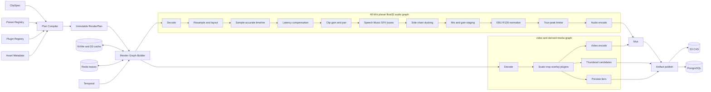
```mermaid
flowchart LR
    CS[ClipSpec] --> PC[Plan Compiler]
    PR[Preset Registry] --> PC
    PG[Plugin Registry] --> PC
    AM[Asset Metadata] --> PC
    PC --> RP[Immutable RenderPlan]
    RP --> RG[Render Graph Builder]

    subgraph AudioGraph[48 kHz planar float32 audio graph]
        AD[Decode] --> RS[Resample and layout]
        RS --> TL[Sample-accurate timeline]
        TL --> LC[Latency compensation]
        LC --> GB[Clip gain and pan]
        GB --> BUS[Speech Music SFX buses]
        BUS --> DUCK[Side-chain ducking]
        DUCK --> MIX[Mix and gain staging]
        MIX --> LN[EBU R128 normalize]
        LN --> LIM[True-peak limiter]
        LIM --> AE[Audio encode]
    end

    subgraph VideoGraph[video and derived-media graph]
        VD[Decode] --> VF[Scale crop overlay plugins]
        VF --> VE[Video encode]
        VF --> TH[Thumbnail candidates]
        VF --> PV[Preview tiers]
    end

    RG --> AD
    RG --> VD
    AE --> MX[Mux]
    VE --> MX
    MX --> ART[Artifact publish]
    TH --> ART
    PV --> ART
    VC[(NVMe and S3 cache)] <--> RG
    ART --> S3[(S3 CAS)]
    ART --> PGDB[(PostgreSQL)]
    RD[(Redis leases)] <--> RG
    TP[Temporal] --> RG
```

### 2.1 Ses grafiği ayrıntısı

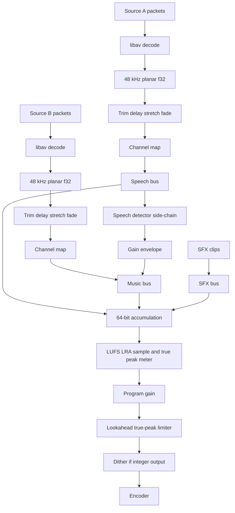
```mermaid
flowchart TB
    A1[Source A packets] --> D1[libav decode]
    A2[Source B packets] --> D2[libav decode]
    D1 --> R1[48 kHz planar f32]
    D2 --> R2[48 kHz planar f32]
    R1 --> T1[Trim delay stretch fade]
    R2 --> T2[Trim delay stretch fade]
    T1 --> C1[Channel map]
    T2 --> C2[Channel map]
    C1 --> S[Speech bus]
    C2 --> M[Music bus]
    FX[SFX clips] --> F[SFX bus]
    S --> SC[Speech detector side-chain]
    SC --> ENV[Gain envelope]
    ENV --> M
    S --> SUM[64-bit accumulation]
    M --> SUM
    F --> SUM
    SUM --> MTR[LUFS LRA sample and true peak meter]
    MTR --> NORM[Program gain]
    NORM --> TPL[Lookahead true-peak limiter]
    TPL --> DTH[Dither if integer output]
    DTH --> ENC[Encoder]
```

Gain staging için kaynak kazancı, clip otomasyonu, bus kazancı, ducking kazancı, program normalizasyon kazancı ve limiter gain reduction ayrı değerlerdir. Birleştirilmiş tek gain alanı kullanılmaz; böylece ölçüm, hata ayıklama ve preset kompozisyonu gözlenebilir kalır. Toplama düğümü iç girişleri `float32` tutar, çok sayıda eşzamanlı kaynakta birikim hatasını azaltmak için SIMD destekli `float64` akümülatör veya pairwise summation kullanır ve çıkışı tekrar `float32` yapar.

### 2.2 Zaman ve gecikme modeli

- Video master zaman tabanı planda kaynak FPS'inden bağımsız rasyoneldir; ses master saati 48 kHz örnek indeksidir.
- Kaynak başlangıcı, codec priming, decoder delay, resampler group delay, time-stretch, VAD, plugin ve limiter lookahead değerleri düğüm metadata'sında örnek cinsinden raporlanır.
- Graph builder her yolun toplam gecikmesini hesaplar ve kısa yolların başına gecikme ekler. Encoder priming metadata'sı mux aşamasında taşınır veya trimlenir.
- Seeking sırasında decoder en yakın güvenli packet/keyframe noktasından başlar, warm-up örnekleri üretir ve tam hedef örnekten önceki çıktıyı atar.
- Segmentli render'da stateful ses düğümleri için sol/sağ bağlam penceresi plana eklenir; artifact'e yalnız istenen merkez aralık yazılır.

## 3. Önerilen dosya ve klasör ağacı

Bu ağaç hedef video-engine paket sınırlarını gösterir; dil bağımsız sözleşmeler `proto` ve JSON Schema ile paylaşılır.

```text
video-engine/
  api/
    proto/render/v1/{clip_spec,render_plan,artifacts}.proto
    proto/assets/v1/assets.proto
    proto/plugins/v1/plugins.proto
    schemas/{clip-spec,preset,plugin-manifest}.schema.json
  cmd/
    plan-compiler/
    render-worker/
    asset-worker/
    plugin-runner/
  internal/
    plan/{compiler,canonicalize,validate}/
    graph/{builder,scheduler,fingerprint}/
    audio/
      buffer/
      timeline/
      resample/
      layout/
      mixer/
      ducking/
      sfx/
      loudness/
      limiter/
      meter/
    thumbnail/{candidates,features,scoring,extract,overlay}/
    preview/{planner,proxy,hls,partial,watermark}/
    assets/{ingest,probe,sniff,scanner,provenance,licensing,lifecycle}/
    plugins/{registry,verify,capabilities,runtime,host_api}/
    presets/{registry,compose,validate,migrate}/
    cache/{fingerprint,index,lease,local,s3,eviction}/
    media/{ffmpeg,codec_build,mux}/
    storage/{postgres,redis,s3}/
    workflow/temporal/{render,asset_ingest,gc}/
    observability/{metrics,tracing,audit}/
  migrations/postgres/
  deploy/kubernetes/{workers,plugin-runner,network-policies}/
  test/
    golden/{audio,thumbnail,preview}/
    conformance/{plugins,presets,cache}/
    load/
```

## 4. Ortak veri ve yürütme sözleşmeleri

`ClipSpec` kullanıcı niyetini ve düzenlenebilir referansları taşır. Derleme sırasında aşağıdaki çözümlemeler yapılır:

```text
ClipSpec
  -> şema doğrulama
  -> asset_ref -> immutable asset_version + blob hash
  -> preset_ref -> immutable preset version + composed values
  -> plugin_ref -> signed package hash + pinned version
  -> platform profile -> dimensions/codec/loudness policy
  -> rational time -> sample/frame boundaries
  -> graph validation and latency calculation
  -> canonical serialization
  -> RenderPlan(plan_hash)
```

Temel kimlikler:

| Kimlik | Üretim | Amaç |
|---|---|---|
| `asset_id` | UUIDv7 | Kullanıcının mantıksal varlığı |
| `asset_version_id` | UUIDv7 | Metadata ve lisans anlık görüntüsü |
| `blob_hash` | SHA-256 | Değişmez byte içeriği ve S3 CAS anahtarı |
| `plan_hash` | SHA-256 | Kanonik `RenderPlan` |
| `node_fingerprint` | SHA-256 | Düğüm tipi, girdiler, parametreler ve runtime kimliği |
| `artifact_id` | UUIDv7 | Yayınlanmış çıktı kaydı |
| `plugin_package_hash` | SHA-256 | İmzalı paket byte'ları |
| `preset_version_id` | UUIDv7 | Değişmez preset sürümü |

Ortak düğüm sonucu `SUCCESS`, `RETRYABLE_FAILURE`, `PERMANENT_FAILURE` veya `CANCELLED` olur. Başarı ancak blob checksum'ı doğrulanıp S3'e yayınlandıktan ve PostgreSQL artifact/cache kaydı commit edildikten sonra raporlanır. Worker kaybında Temporal aktiviteyi tekrarlar; aynı fingerprint'e ait mevcut ve doğrulanmış artifact tekrar kullanılır.

---

## 36. Audio Mixing

### 36.1 Mekanizma ve değişmezler

Audio mixer, bütün kaynakları 48 kHz planar `float32` çalışma biçimine getirir ve örnek-duyarlı zaman çizelgesinde işler. `AudioClip` başlangıç/bitişi örnek indekslerine derleme anında sabitlenir. Kaynak trim, playback rate, fade ve otomasyon işlemleri klip yolunda; ducking ve bus efektleri bus yolunda; normalizasyon ve limiter master yolunda uygulanır.

- Resample için libswresample veya kalite eşdeğeri bir polyphase resampler kullanılır. Matris ve dither parametreleri planda pinlenir.
- Kanal yerleşimi yalnız kanal sayısıyla belirtilmez. `mono`, `stereo`, `5.1(side)` gibi libav kanal maskesi ve kanal sırası zorunludur.
- Downmix/upmix matrisi platform profilinden gelir. Bilinmeyen yerleşim otomatik tahmin edilmez; doğrulama hatasıdır.
- Stereo pan varsayılanı constant-power pan law, merkezde `-3 dB` olur. Mono çıkışta pan uygulanmaz; stereo width ve balance ayrı işlemlerdir.
- Clip pre-gain, otomasyon ve bus gain sonlu sayı olmalı; değerler politika gereği `[-96, +24] dB` aralığında sınırlandırılır.
- Toplama öncesi önerilen nominal konuşma bus seviyesi `-23 LUFS short-term` çevresidir; master headroom hedefi limiter öncesi en az 6 dB'dir.
- NaN/Inf örnek tespitinde render sessizce devam etmez. Düğüm, kaynak ve ilk örnek indeksiyle kalıcı hata üretir.
- Hard clipping yasaktır. Master çıkış true-peak limiter'dan geçer; integer encode öncesi gerekiyorsa TPDF dither uygulanır.
- Gecikme telafisi tüm paralel yolları en yavaş yola hizalar. Bir plugin gecikmesini yanlış raporlarsa conformance testini geçemez.

### 36.2 Neden ve alternatifler

48 kHz video ekosisteminin standart hızıdır ve AAC/Opus üretiminde gereksiz hız dönüşümünü azaltır. Planar float32, FFmpeg/libav filtreleriyle uyumludur; SIMD işlemeyi kolaylaştırır ve ara clipping'i integer pipeline'a göre önler. Örnek-duyarlı çizelge, art arda kesitlerde click, drift ve dudak senkronu hatalarını engeller.

Değerlendirilen alternatifler:

| Alternatif | Karar | Gerekçe |
|---|---|---|
| 44.1 kHz iç format | Reddedildi | Video/stream kaynaklarının çoğu 48 kHz; tekrar resample ve drift riski |
| Interleaved `int16` | Reddedildi | Ara headroom yok, efekt zincirinde kuantizasyon birikir |
| Tüm grafikte `float64` | Reddedildi | Bellek bant genişliği maliyeti; yalnız akümülatör ve ölçümlerde gerekli |
| FFmpeg CLI filtre string'i | Sınırlı | Prototip için uygun, tipli plan, hata sınıflama ve düğüm cache'i için libav daha güvenli |
| Video frame tabanlı audio kesimi | Reddedildi | 29.97 fps gibi hızlarda örnek sınırları sürüklenir |

### 36.3 Veri akışı

1. Plan compiler her kaynak stream'i `ffprobe` metadata'sı ve gerçek decoder bilgisiyle doğrular.
2. Decoder packet timestamp, codec delay ve priming bilgisini normalize eder.
3. Resampler kaynak hızını 48 kHz'e çevirir ve gecikmesini raporlar.
4. Timeline düğümü trim, delay, loop, rate ve fade işlemlerini mutlak örnek aralığına yerleştirir.
5. Channel mapper açık matrisle hedef bus layout'una dönüştürür.
6. Clip gain/pan/otomasyon örnek veya kontrol bloğu düzeyinde yumuşatılarak uygulanır.
7. Speech, music ve SFX bus'ları ayrı toplanır; her bus meter üretir.
8. Ducking sonrası master sum, loudness normalizasyon ve true-peak limiter işlenir.
9. Encoder ve mux audio timestamp'lerini video master zamanına bağlar.
10. Ölçüm özeti artifact metadata'sına yazılır.

### 36.4 API, arayüz ve model

```proto
message AudioMixSpec {
  uint32 sample_rate = 1;              // ClipSpec'te opsiyonel, RenderPlan'da 48000
  string channel_layout = 2;           // ör. "stereo"
  repeated AudioTrack tracks = 3;
  repeated AudioBus buses = 4;
  LoudnessPolicy loudness = 5;
  LimiterPolicy limiter = 6;
}

message AudioClip {
  string asset_version_id = 1;
  Rational source_in = 2;
  Rational source_out = 3;
  Rational timeline_start = 4;
  double playback_rate = 5;
  double gain_db = 6;
  double pan = 7;                       // -1.0 sol, +1.0 sağ
  repeated GainPoint automation = 8;
  uint64 start_sample = 20;             // yalnız RenderPlan'da
  uint64 end_sample = 21;               // yalnız RenderPlan'da
}

message AudioNodeRuntime {
  string implementation_id = 1;
  string implementation_version = 2;
  uint32 latency_samples = 3;
  string determinism = 4;
}
```

İç arayüzler:

```text
AudioNode.prepare(format, block_size) -> NodeCapabilities
AudioNode.process(input_planes, output_planes, sample_range, context) -> ProcessResult
AudioNode.flush() -> AudioBlocks
AudioNode.latency_samples() -> uint32
AudioNode.reset(seek_sample) -> void
AudioMeter.snapshot() -> LoudnessMeasurement
```

Kontrol düzlemi `POST /v1/render-plans:compile` ile `ClipSpec` alır; `GET /v1/renders/{id}/audio-report` integrated LUFS, LRA, sample peak, true peak, limiter reduction ve kanal bazlı istatistik döndürür. Ham PCM API üzerinden taşınmaz.

### 36.5 Dosya ve klasör yeri

- `internal/audio/buffer/`: planar tampon, havuz ve hizalama.
- `internal/audio/timeline/`: rasyonel zaman, örnek indeksleme, seek ve segment bağlamı.
- `internal/audio/resample/` ve `layout/`: libswresample adaptörü ve kanal matrisleri.
- `internal/audio/mixer/`: clip, bus, pan law, otomasyon ve summing.
- `internal/audio/limiter/` ve `meter/`: master koruma ve telemetri.
- `test/golden/audio/mixing/`: impulse, sine sweep, multichannel ve senkron golden'ları.

### 36.6 Render pipeline entegrasyonu

Audio graph video graph ile birlikte oluşturulur fakat blok bazında bağımsız yürür. Varsayılan blok 1024 örnektir; clip/fade sınırında scheduler bloğu böler. Stateful düğümler segment cache'inde gereken preroll/postroll değerini bildirir. Mux, video başlangıcından önceki ses örneklerini politika uyarınca trimler veya edit list ile ifade eder. İptal kontrolü her blokta yapılır.

### 36.7 Sequence diyagramı

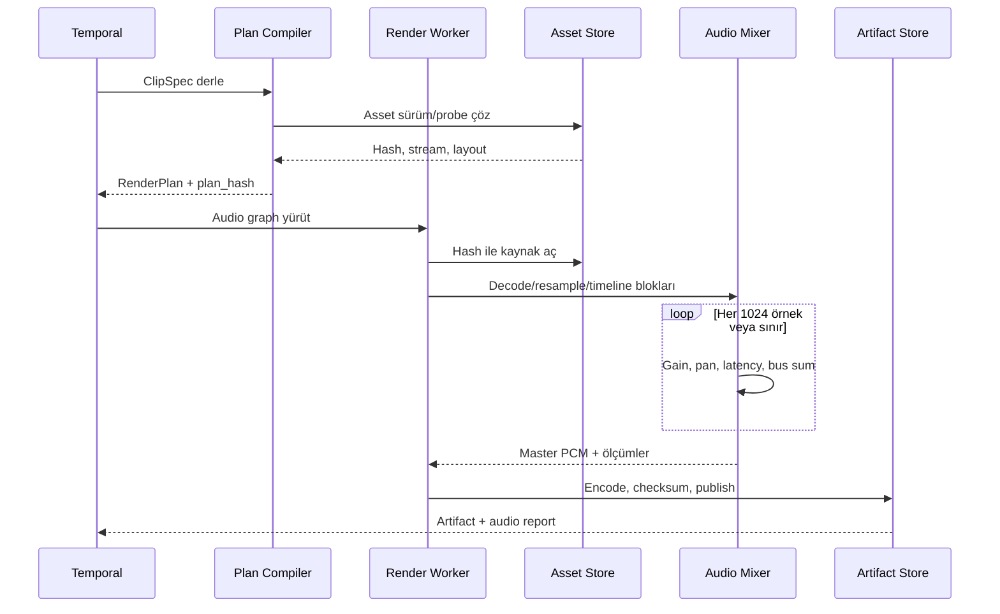
```mermaid
sequenceDiagram
    participant T as Temporal
    participant C as Plan Compiler
    participant W as Render Worker
    participant A as Asset Store
    participant M as Audio Mixer
    participant O as Artifact Store
    T->>C: ClipSpec derle
    C->>A: Asset sürüm/probe çöz
    A-->>C: Hash, stream, layout
    C-->>T: RenderPlan + plan_hash
    T->>W: Audio graph yürüt
    W->>A: Hash ile kaynak aç
    W->>M: Decode/resample/timeline blokları
    loop Her 1024 örnek veya sınır
        M->>M: Gain, pan, latency, bus sum
    end
    M-->>W: Master PCM + ölçümler
    W->>O: Encode, checksum, publish
    O-->>T: Artifact + audio report
```

### 36.8 Class diyagramı

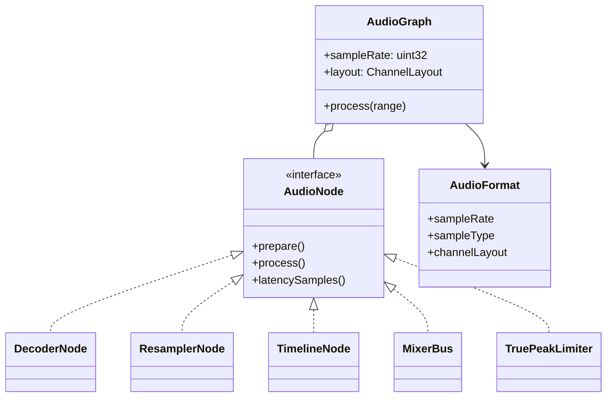
```mermaid
classDiagram
    class AudioGraph {
      +sampleRate: uint32
      +layout: ChannelLayout
      +process(range)
    }
    class AudioNode {
      <<interface>>
      +prepare()
      +process()
      +latencySamples()
    }
    class DecoderNode
    class ResamplerNode
    class TimelineNode
    class MixerBus
    class TruePeakLimiter
    class AudioFormat {
      +sampleRate
      +sampleType
      +channelLayout
    }
    AudioGraph o-- AudioNode
    AudioNode <|.. DecoderNode
    AudioNode <|.. ResamplerNode
    AudioNode <|.. TimelineNode
    AudioNode <|.. MixerBus
    AudioNode <|.. TruePeakLimiter
    AudioGraph --> AudioFormat
```

### 36.9 State diyagramı

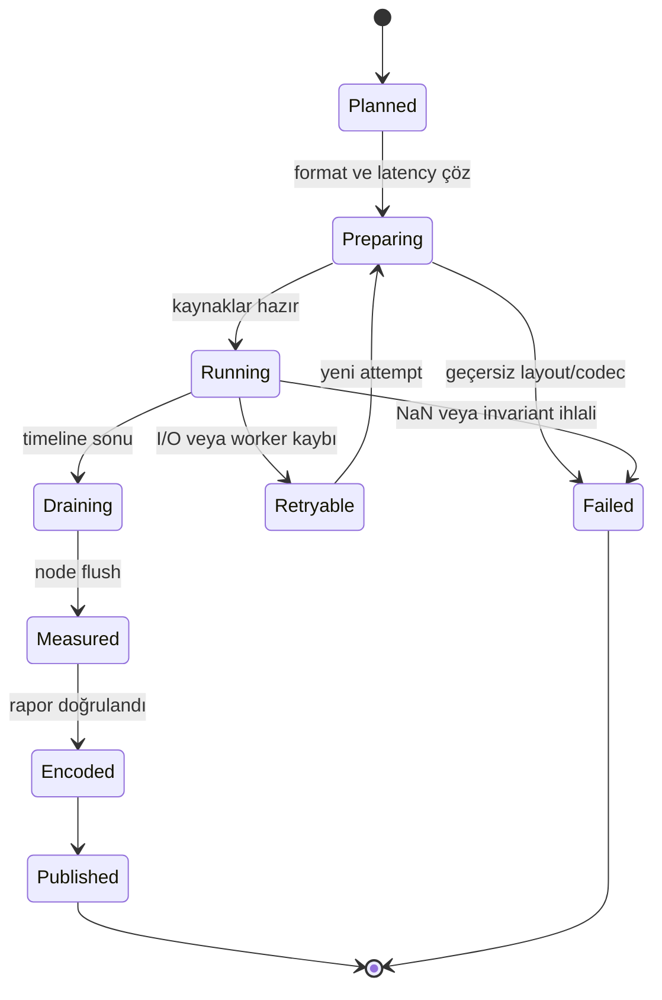
```mermaid
stateDiagram-v2
    [*] --> Planned
    Planned --> Preparing: format ve latency çöz
    Preparing --> Running: kaynaklar hazır
    Running --> Draining: timeline sonu
    Draining --> Measured: node flush
    Measured --> Encoded: rapor doğrulandı
    Encoded --> Published
    Running --> Retryable: I/O veya worker kaybı
    Retryable --> Preparing: yeni attempt
    Preparing --> Failed: geçersiz layout/codec
    Running --> Failed: NaN veya invariant ihlali
    Published --> [*]
    Failed --> [*]
```

### 36.10 Production sorunları ve recovery

| Sorun | Tespit | Recovery |
|---|---|---|
| Kaynak timestamp sıçraması | PTS monotonluk metriği | Decoder reorder; tolerans üstünde asset'i `INVALID_MEDIA` yap |
| Kanal metadata'sı yanlış | Probe-decode karşılaştırması | Otomatik tahmin yok; operatör override ile yeni asset version |
| Drift | Son örnek ve beklenen süre farkı | Tek resample clock; planı yeniden derle |
| Click/pop | Sınır peak ve golden test | 5-10 ms varsayılan de-click fade; explicit hard cut istisnası |
| OOM | Buffer pool/working set alarmı | Bounded bloklar; pod'u daha büyük sınıfa yeniden zamanla |
| Worker ölümü | Temporal heartbeat timeout | Aynı fingerprint ile son checkpoint/segmentten retry |
| Bozuk cache PCM | Checksum ve frame count | Cache kaydını karantinaya al, kaynaktan yeniden üret |
| A/V sync kayması | Mux sonrası senkron probe | Artifact yayınlama; render'ı farklı worker'da tekrar et |

### 36.11 Performans, benchmark ve kabul eşikleri

- 2 kanallı 48 kHz, 10 dakikalık, 8 girişli miks için 4 vCPU worker'da p95 işlem süresi gerçek zamanın `0.35x`'inden düşük olmalıdır; decode hariç mixer CPU süresi `0.12x` altında olmalıdır.
- Stereo 1024 örnek blok için mixer p99 süresi 2 ms altında, tahsis sayısı steady-state'te blok başına sıfır olmalıdır.
- 60 dakikalık çıktıda beklenen örnek sayısından sapma 0 örnek; A/V başlangıç farkı 1 ms'den küçük olmalıdır.
- Pan law merkez kazancı `-3.01 dB +/- 0.05 dB`; resampler alias bastırması 20 kHz altı passband senaryosunda en az 90 dB olmalıdır.
- Master'da NaN/Inf ve hard-clipped örnek sayısı sıfır; limiter sonrası true peak politika eşiğini en fazla 0.1 dB aşabilir.
- 64 eşzamanlı mono SFX ile 10 dakikalık stres testinde RSS 512 MiB altında ve deadline miss oranı yüzde 0.01 altında olmalıdır.

Benchmark veri seti impulse, logarithmic sweep, faz ters stereo, 5.1 kanal kimlik tonları, değişken timestamp ve 1/1001 FPS video içerir. Sonuçlar codec build ve CPU mimarisi etiketiyle saklanır.

### 36.12 Gerçek kullanım, ölçek, ownership ve testler

Gerçek kullanımda röportaj konuşması, arka plan müziği, intro/outro, bildirim SFX'i ve oyun sesi ayrı bus'lara bağlanır. Bir saatlik podcast videosunda binlerce otomasyon noktası blok sınırlarında örnek-duyarlı uygulanır. Ölçek hedefi küme genelinde 2.000 eşzamanlı stereo audio graph ve günde 100.000 render'dır; CPU talepleri süre, kanal ve aktif node maliyetinden türetilir.

Owner: Media Audio ekibi. Plan sözleşmesi için Render Platform, codec build için Media Runtime ortak owner'dır. Unit testler pan, fade, matris ve zaman dönüşümünü; property testler parçalı/tam render eşdeğerliğini; golden testler PCM hash veya toleranslı spektral farkı; entegrasyon testleri gerçek FFmpeg codec'lerini; chaos testleri pod kaybı ve cache bozulmasını kapsar.

---

## 37. Music Ducking

### 37.1 Mekanizma ve değişmezler

Music ducking, konuşma bus'ını side-chain kontrol sinyali olarak kullanıp music bus'a zamanla değişen gain envelope uygular. Kontrol sinyali öncelikle temiz speech stem'den gelir; stem yoksa konuşma olasılığı VAD ile çıkarılır. Envelope, timeline örnek indekslerine sabitlenir ve render segmentlerinden bağımsız aynı sonucu üretir.

- Side-chain speech sinyali 80 Hz high-pass ve ölçüm band sınırlaması sonrası mono kontrol sinyaline indirilir.
- VAD 10 veya 20 ms frame üretse de envelope noktaları 48 kHz örnek zamanına dönüştürülür.
- Başlatma eşiği ve bırakma eşiği ayrıdır; hysteresis konuşma sınırında gain titreşimini önler.
- Attack, release, hold, lookahead, maximum attenuation ve knee preset ile pinlenir.
- Varsayılan: attack 80 ms, release 450 ms, hold 120 ms, lookahead 40 ms, attenuation `-12 dB`.
- Lookahead kadar music yolu geciktirilir; speech ve diğer yollar latency compensation ile hizalanır.
- Ardışık segment render'ları VAD/envelope için preroll taşır; segment başında envelope sıfırlanmaz.
- Ducking master'a değil yalnız hedef bus'a uygulanır. SFX ve acil uyarılar varsayılan olarak etkilenmez.
- Sessizlikte veya VAD belirsizliğinde politika belirleyicidir; varsayılan fail-open, yani müzik duck edilmez.

### 37.2 Neden ve alternatifler

Side-chain envelope, müziğin anlaşılabilirliği bozmadan korunmasını ve kullanıcı tarafından açıklanabilir parametreler sunulmasını sağlar. Yalnız RMS threshold konuşma ile oyun patlamalarını ayıramaz. Yalnız transkript zamanları ise kelime sınırlarında sert ve hatalı çalışabilir. Hibrit yaklaşım, varsa speech stem/VAD ve transkript ipucunu birleştirir.

Alternatif olarak compressor side-chain değerlendirildi; yayıncılıkta uygundur ancak segmentler arası state, threshold kalibrasyonu ve kullanıcı önizlemesinde açıklanabilirlik daha zayıftır. Sabit müzik azaltımı basittir fakat konuşma olmayan bölümlerde enerji kaybettirir. Manuel keyframe en yüksek kontrolü verir; sistem manuel envelope varsa otomatiğin üzerine explicit override olarak uygular.

### 37.3 Veri akışı

1. Plan compiler speech source, music bus ve ducking profilini bağlar.
2. Speech stem varsa doğrudan, yoksa mixed dialogue adayı VAD'a verilir.
3. VAD olasılığı smoothing, hysteresis ve isteğe bağlı transkript genişletmesiyle speech activity'ye çevrilir.
4. Activity aralıkları lookahead, attack, hold ve release ile sample-domain envelope'a çevrilir.
5. Manuel keyframe/disable aralıkları envelope ile birleştirilir.
6. Music bus lineer gain ile çarpılır; gain değişimi de-zipper filtresinden geçer.
7. Ducking metriği toplam duck süresi, ortalama/maksimum azaltım ve VAD güvenini raporlar.

### 37.4 API, arayüz ve model

```proto
message DuckingPolicy {
  bool enabled = 1;
  string speech_bus_id = 2;
  string target_music_bus_id = 3;
  double activation_probability = 4;
  double release_probability = 5;
  Duration attack = 6;
  Duration release = 7;
  Duration hold = 8;
  Duration lookahead = 9;
  double attenuation_db = 10;
  double knee_db = 11;
  repeated DuckingOverride overrides = 12;
  string vad_model_version = 20;
}

message DuckingEnvelope {
  repeated EnvelopePoint points = 1; // sample_index + linear_gain
  string detector_fingerprint = 2;
  uint32 latency_samples = 3;
}
```

`DuckingDetector.analyze(speech_pcm, transcript_hints) -> DuckingEnvelope` saf ve içerik hash'iyle cache'lenebilir bir aktivitedir. `DuckingNode.process(music_pcm, envelope)` model çalıştırmaz. Bu ayrım kısmi render ve deterministik tekrar için zorunludur.

### 37.5 Dosya ve klasör yeri

- `internal/audio/ducking/detector/`: VAD adaptörü ve speech activity.
- `internal/audio/ducking/envelope/`: attack/release/lookahead ve override birleştirme.
- `internal/audio/ducking/node/`: gerçek zamanlı gain uygulama.
- `test/golden/audio/ducking/`: speech/music stem, envelope ve ölçüm fixture'ları.

### 37.6 Render pipeline entegrasyonu

VAD analizi, graph yürütmeden önce Temporal aktivitesi olarak hesaplanabilir ve node cache'e yazılır. Envelope fingerprint'i speech blob hash'i, trim/rate, VAD sürümü ve ducking parametrelerini içerir. Render sırasında music bus lookahead latency'si graph latency hesabına katılır. Partial render, hedef aralıktan en az `vad_context + lookahead + release` kadar önce analiz başlatır.

### 37.7 Sequence diyagramı

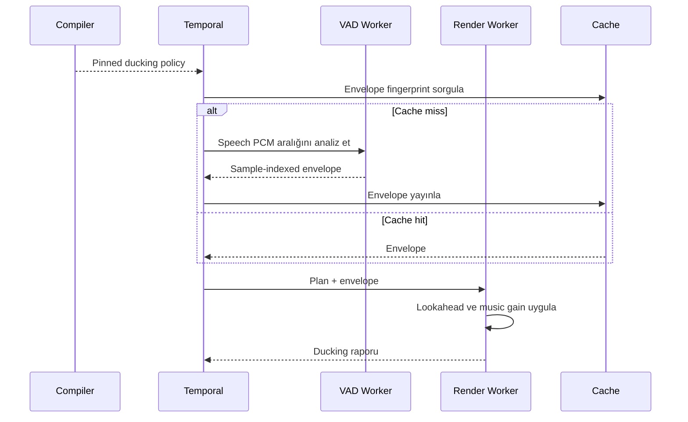
```mermaid
sequenceDiagram
    participant C as Compiler
    participant T as Temporal
    participant V as VAD Worker
    participant R as Render Worker
    participant K as Cache
    C-->>T: Pinned ducking policy
    T->>K: Envelope fingerprint sorgula
    alt Cache miss
        T->>V: Speech PCM aralığını analiz et
        V-->>T: Sample-indexed envelope
        T->>K: Envelope yayınla
    else Cache hit
        K-->>T: Envelope
    end
    T->>R: Plan + envelope
    R->>R: Lookahead ve music gain uygula
    R-->>T: Ducking raporu
```

### 37.8 Class diyagramı

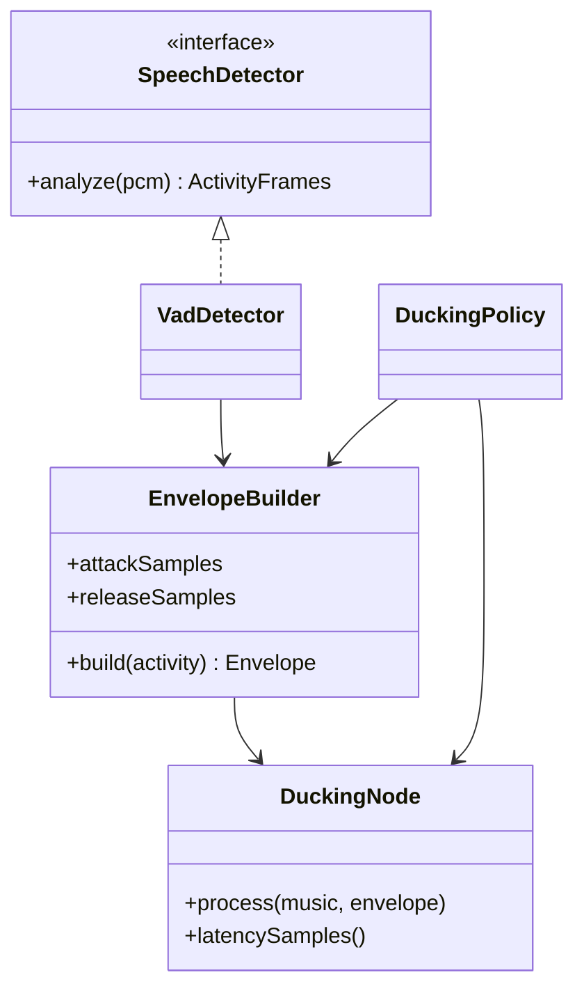
```mermaid
classDiagram
    class SpeechDetector {
      <<interface>>
      +analyze(pcm) ActivityFrames
    }
    class VadDetector
    class EnvelopeBuilder {
      +attackSamples
      +releaseSamples
      +build(activity) Envelope
    }
    class DuckingNode {
      +process(music, envelope)
      +latencySamples()
    }
    class DuckingPolicy
    SpeechDetector <|.. VadDetector
    VadDetector --> EnvelopeBuilder
    EnvelopeBuilder --> DuckingNode
    DuckingPolicy --> EnvelopeBuilder
    DuckingPolicy --> DuckingNode
```

### 37.9 State diyagramı

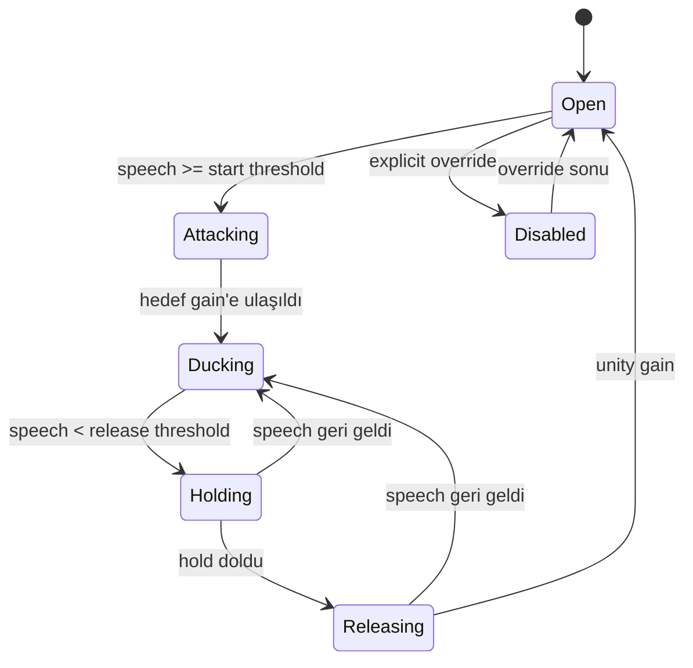
```mermaid
stateDiagram-v2
    [*] --> Open
    Open --> Attacking: speech >= start threshold
    Attacking --> Ducking: hedef gain'e ulaşıldı
    Ducking --> Holding: speech < release threshold
    Holding --> Ducking: speech geri geldi
    Holding --> Releasing: hold doldu
    Releasing --> Ducking: speech geri geldi
    Releasing --> Open: unity gain
    Open --> Disabled: explicit override
    Disabled --> Open: override sonu
```

### 37.10 Production sorunları ve recovery

Yanlış pozitif VAD müziği gereksiz bastırır; konuşmasız müzik veri setiyle oran izlenir ve tenant bazlı manuel kapatma sunulur. Yanlış negatifte transcript kelime aralıkları activity'yi genişletebilir. GPU/ML worker yoksa pinlenmiş CPU modeli denenir; o da başarısızsa profil `required=false` ise fail-open uyarısı, `required=true` ise render hatası üretilir. Segment sınırı pompalaması context penceresi ve envelope cache ile engellenir. Model sürümü değişince eski plan değişmez; yeni derlemeler yeni fingerprint üretir.

### 37.11 Performans, benchmark ve kabul eşikleri

- VAD dahil 30 dakikalık mono speech analizi 1 vCPU'da p95 `0.20x` gerçek zamandan hızlı; sadece envelope uygulama p95 `0.01x` altında olmalıdır.
- Envelope noktaları sıkıştırılmış biçimde saat başına 2 MiB altında; gain interpolasyon hatası 0.05 dB altında olmalıdır.
- Segmentli ve tek parça render gain envelope farkı sınırdan 2 saniye uzakta 0, sınır bağlamında en fazla 0.1 dB olmalıdır.
- Referans veri setinde speech recall en az yüzde 97, music-only false duck süresi yüzde 2'nin altında olmalıdır.
- Konuşma başlangıcında hedef azaltımın yüzde 90'ına `attack + 10 ms` içinde ulaşılmalı; true-peak overshoot limiter öncesinde 1 dB'yi aşmamalıdır.

### 37.12 Gerçek kullanım, ölçek, ownership ve testler

Oyun klibinde yayıncı konuşurken oyun müziği düşer, kill SFX bus'ı korunur; eğitim videosunda anlatıcı durduğunda müzik doğal biçimde geri gelir. Ölçek hedefi günde 50.000 saat VAD analizidir; aynı speech stem ve model sürümü tenant sınırları içinde cache ile paylaşılır. Owner Media Audio, VAD model kalitesi için Applied ML'dir. Unit testler envelope matematiğini, golden testler beklenen gain eğrisini, model eval testleri dil/gürültü kümelerini, property testler farklı chunk boylarının aynı envelope'u vermesini kapsar.

---

## 38. Sound Effects

### 38.1 Mekanizma ve değişmezler

SFX sistemi kısa ses varlıklarını timeline olayı, marker, transcript kelimesi, video frame'i veya başka bir klibin sample sınırına bağlar. Plan compiler tüm bağları mutlak 48 kHz sample indeksine çözer. Her event bağımsız gain, pan, pitch/rate, trim, fade, bus ve öncelik taşır.

- Alignment kaynağı planda saklanır; `resolved_start_sample` tek yürütme değeridir.
- Frame'e bağlı olayda frame PTS rasyoneli önce zamana, sonra örneğe round-half-even ile çevrilir.
- SFX decode/resample sonucu kısa PCM clip olarak cache'lenebilir; otomasyon ve pan render anında uygulanır.
- Varsayılan maksimum polyphony bus başına 32, tenant planına göre üst sınır 128'dir.
- Limit aşımında politika `reject`, `drop_lowest_priority`, `drop_oldest` veya `voice_steal_quietest` olarak açıkça seçilir. Varsayılan `drop_lowest_priority`dir.
- Aynı SFX'in sık tekrarı click oluşturmaması için 2 ms de-click ramp uygulanır; sample-perfect impulse kullanımında kapatılabilir.
- Random varyasyon istenirse PRNG seed'i `plan_hash + event_id` üzerinden belirlenir. Sistem saatinden random kullanılmaz.
- Lisans durumu render başlangıcında geçerli olmalı ve planın provenance snapshot'ında bulunmalıdır.

### 38.2 Neden ve alternatifler

SFX'i genel audio clip olarak modellemek temel yürütmeyi sade tutar; ayrı event sözleşmesi ise alignment, polyphony, varyasyon ve toplu düzenleme semantiğini açıklar. Frame tabanlı saklama video kesimleri değişince belirsizleştiği için yalnız authoring referansıdır. RenderPlan'da sample'a çözülür. Runtime ses bankası seçimi deterministik olmadığı ve lisans denetimini zorlaştırdığı için reddedilmiştir; bütün varyantlar derlemede pinlenir.

### 38.3 Veri akışı

1. `SfxEventSpec` marker/transcript/frame referansını plan compiler'a verir.
2. Compiler referansı mevcut edit timeline'ına göre mutlak sample indeksine çözer.
3. Asset manager lisans, MIME, probe ve blob hash'ini doğrular.
4. Scheduler decode edilmiş PCM fingerprint'ini cache'te arar.
5. Event başlangıcında voice allocation yapılır; polyphony politikası uygulanır.
6. Rate/pitch, gain, pan ve fade işlenip SFX bus'a toplanır.
7. Dropped/played event sayıları ve peak katkısı raporlanır.

### 38.4 API, arayüz ve model

```proto
message SfxEventSpec {
  string event_id = 1;
  string asset_ref = 2;
  Alignment alignment = 3;
  Rational offset = 4;
  double gain_db = 5;
  double pan = 6;
  double playback_rate = 7;
  int32 priority = 8;
  string bus_id = 9;
  string variation_group = 10;
}

message ResolvedSfxEvent {
  string event_id = 1;
  string asset_version_id = 2;
  string blob_hash = 3;
  uint64 start_sample = 4;
  uint64 duration_samples = 5;
  uint64 deterministic_seed = 6;
  SfxProcessing processing = 7;
}

message SfxBusPolicy {
  uint32 max_polyphony = 1;
  string overflow_policy = 2;
  double bus_gain_db = 3;
  optional double limiter_ceiling_dbtp = 4;
}
```

### 38.5 Dosya ve klasör yeri

- `internal/audio/sfx/alignment/`: marker, word, frame ve sample çözümleme.
- `internal/audio/sfx/voice/`: voice pool ve polyphony politikaları.
- `internal/audio/sfx/processing/`: rate/pitch, de-click, gain ve pan.
- `api/proto/render/v1/sfx.proto`: authoring ve resolved modeller.
- `test/golden/audio/sfx/`: alignment impulse ve polyphony fixture'ları.

### 38.6 Render pipeline entegrasyonu

Graph builder event'leri başlangıç sample'ına göre sıralı bir event queue olarak SFX node'una verir. Her blokta başlayan/biten voice'lar güncellenir. Partial render yalnız hedef aralığı kesen event'leri alır; event'in başlangıcı aralıktan önceyse decoder seek preroll ile doğru state'e getirilir. SFX bus, music ducking'den bağımsızdır ancak master loudness ve limiter'a dahildir.

### 38.7 Sequence diyagramı

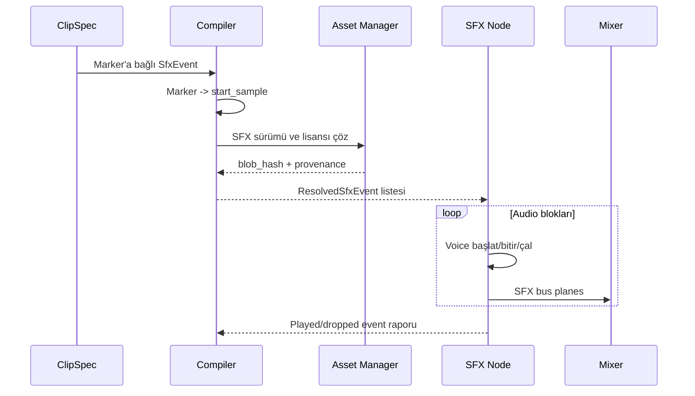
```mermaid
sequenceDiagram
    participant U as ClipSpec
    participant C as Compiler
    participant A as Asset Manager
    participant R as SFX Node
    participant M as Mixer
    U->>C: Marker'a bağlı SfxEvent
    C->>C: Marker -> start_sample
    C->>A: SFX sürümü ve lisansı çöz
    A-->>C: blob_hash + provenance
    C-->>R: ResolvedSfxEvent listesi
    loop Audio blokları
        R->>R: Voice başlat/bitir/çal
        R->>M: SFX bus planes
    end
    R-->>C: Played/dropped event raporu
```

### 38.8 Class diyagramı

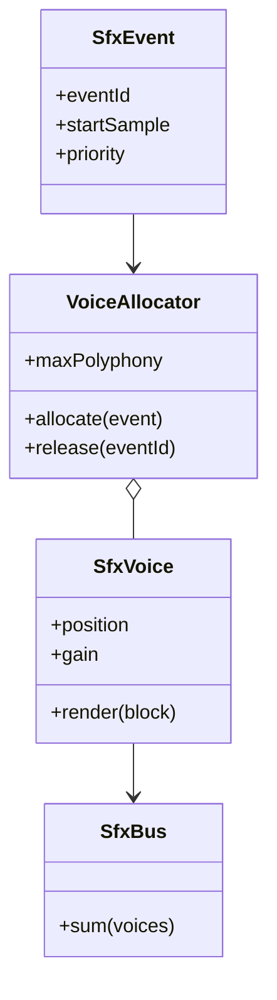
```mermaid
classDiagram
    class SfxEvent {
      +eventId
      +startSample
      +priority
    }
    class VoiceAllocator {
      +maxPolyphony
      +allocate(event)
      +release(eventId)
    }
    class SfxVoice {
      +position
      +gain
      +render(block)
    }
    class SfxBus {
      +sum(voices)
    }
    SfxEvent --> VoiceAllocator
    VoiceAllocator o-- SfxVoice
    SfxVoice --> SfxBus
```

### 38.9 State diyagramı

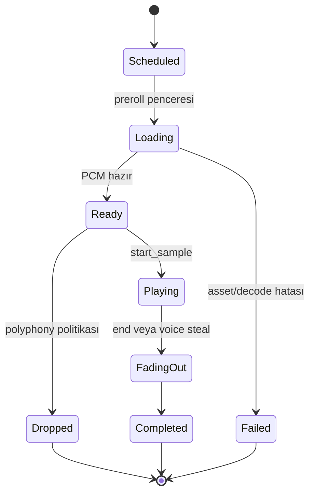
```mermaid
stateDiagram-v2
    [*] --> Scheduled
    Scheduled --> Loading: preroll penceresi
    Loading --> Ready: PCM hazır
    Ready --> Playing: start_sample
    Ready --> Dropped: polyphony politikası
    Playing --> FadingOut: end veya voice steal
    FadingOut --> Completed
    Loading --> Failed: asset/decode hatası
    Dropped --> [*]
    Completed --> [*]
    Failed --> [*]
```

### 38.10 Production sorunları ve recovery

Eksik marker derleme hatasıdır; en yakın zamana sessizce bağlanmaz. Transcript revizyonu referansı bozarsa plan yeniden derlenir. Çok sayıda aynı anda event, voice limiti ve bus limiter ile kontrol edilir; drop kararı deterministik sıra `(priority, start_sample, event_id)` ile alınır. Kısa asset cache bozuksa checksum doğrulaması sonrası yeniden decode edilir. Lisans süresi render kuyruğunda dolarsa lisans politikası `render_started_at` veya `publish_at` semantiğine göre yeniden doğrulanır ve audit olayı yazılır.

### 38.11 Performans, benchmark ve kabul eşikleri

- 32 eşzamanlı stereo voice için 1024 örnek blok p99 1.5 ms altında; 128 voice stresinde p99 5 ms altında olmalıdır.
- Alignment hatası sample referansında 0 örnek, frame referansında doğru frame PTS'inden 0.5 örnek yuvarlama sınırını aşmamalıdır.
- Voice allocation steady-state'te heap allocation yapmamalı; 10.000 event planlama süresi 50 ms altında olmalıdır.
- Aynı plan/seed çıktısı bit düzeyinde aynı olmalıdır.
- Polyphony drop telemetrisi yüzde 0.1'i aşarsa kalite alarmı; hiçbir olayda hard clipping kabul edilmez.

### 38.12 Gerçek kullanım, ölçek, ownership ve testler

Kullanım örnekleri altyazı pop sesi, skor değişimi, meme stinger, geçiş whoosh'u ve oyun highlight işaretidir. Tek bir kısa videoda tipik 5-20, yoğun şablonda 1.000 event desteklenir. Küme hedefi saniyede 100.000 event scheduling'dir. Owner Media Audio; marker sözleşmesi Editing Timeline, lisans kuralları Trust & Rights ile ortaktır. Unit testler alignment ve voice stealing'i, golden testler impulse konumunu, fuzz testler bozuk kısa dosyaları, load testler yüksek polyphony'yi kapsar.

---

## 39. Loudness Normalization

### 39.1 Mekanizma ve değişmezler

Mastering zinciri EBU R128 / ITU-R BS.1770 uyumlu integrated loudness, loudness range, momentary/short-term loudness, sample peak ve 4x oversampled true peak ölçer. Nihai teslimatta varsayılan yöntem two-pass loudness normalization'dır.

- Pass 1, ducking dahil nihai miksin limiter öncesi programını analiz eder ve `measured_I`, `measured_LRA`, `measured_TP`, `measured_threshold` üretir.
- Pass 2, pinlenmiş ölçümleri ve hedefi kullanarak program gain uygular; dinamik loudnorm gerekiyorsa algoritma/build kimliği planda bulunur.
- Hedef platform profilindedir. Örnek varsayılanlar: sosyal video `-14 LUFS`, true peak `-1.0 dBTP`; broadcast profil `-23 LUFS`, true peak `-1.0 dBTP`.
- Integrated LUFS hesaplaması mutlak ve göreli gating uygular. Çok kısa/sessiz içerik için `UNMEASURABLE` durumu açıkça işlenir.
- LRA hedef değildir; raporlanır ve opsiyonel dinamik işleme politikasıyla sınırlandırılır. Sırf hedef LUFS için aşırı compression uygulanmaz.
- True-peak limiter normalizasyon gain'inden sonra çalışır. Ceiling oversampling domain'inde uygulanır.
- Pozitif gain teorik headroom'u aşıyorsa limiter beklenen reduction hesaplanır; politika limitinden yüksekse render uyarı veya hata verir.
- Ölçüm ve render aynı kanal layout, örnek aralığı ve mix revision'ını kullanır.

### 39.2 Neden ve alternatifler

Peak normalization algılanan ses yüksekliğini eşitlemez. ReplayGain müzik kütüphanesi için yararlı olsa da video teslim profilleri ve true peak gereksinimi için EBU R128 kadar uygun değildir. FFmpeg `loudnorm` tek geçiş canlı kullanımda kullanılabilir fakat kısa içerikte ve değişken programda tekrarlanabilir hedef doğruluğu düşer. Bu nedenle final artifact two-pass, düşük gecikmeli preview ise açıkça etiketlenmiş approximate single-pass kullanabilir.

### 39.3 Veri akışı

1. Nihai mix graph fingerprint'i oluşturulur.
2. Pass 1 worker PCM'i EBU R128 meter'dan geçirir; ölçüm JSON'u checksum ile cache'lenir.
3. Policy evaluator hedef gain, beklenen true peak ve limiter yükünü hesaplar.
4. Ölçülemeyen sessizlik/kısa klip politikası uygulanır.
5. Pass 2 aynı mix graph'ı yürütür veya güvenli ara master cache'ini okur.
6. Program gain ve true-peak limiter uygulanır.
7. Encode sonrası decoded-output doğrulama örneklemi veya tam ölçümü çalışır.
8. Loudness raporu artifact metadata'sı ve audit'e yazılır.

### 39.4 API, arayüz ve model

```proto
message LoudnessPolicy {
  double target_lufs = 1;
  double true_peak_ceiling_dbtp = 2;
  optional double max_lra_lu = 3;
  double max_limiter_reduction_db = 4;
  string standard = 5;                 // EBU_R128_BS1770_4
  string short_content_policy = 6;
  bool verify_encoded_output = 7;
}

message LoudnessMeasurement {
  double integrated_lufs = 1;
  double loudness_range_lu = 2;
  double true_peak_dbtp = 3;
  double sample_peak_dbfs = 4;
  double relative_threshold_lufs = 5;
  uint64 measured_samples = 6;
  string meter_build_id = 7;
  string status = 8;
}

message LoudnessDecision {
  double linear_gain = 1;
  double gain_db = 2;
  LoudnessMeasurement pass1 = 3;
  double expected_limiter_reduction_db = 4;
}
```

### 39.5 Dosya ve klasör yeri

- `internal/audio/loudness/ebu_r128/`: meter adaptörü ve gating.
- `internal/audio/loudness/planner/`: two-pass kararları ve kısa içerik politikası.
- `internal/audio/limiter/true_peak/`: oversampling limiter.
- `internal/workflow/temporal/loudness.go`: pass 1/pass 2 aktiviteleri.
- `test/golden/audio/loudness/`: EBU referans sinyalleri ve platform profilleri.

### 39.6 Render pipeline entegrasyonu

Pass 1 düğümü nihai miks bağımlılıklarına sahiptir fakat encode/mux'a sahip değildir. Uzun işler için ara master PCM'ini S3'e yazmak maliyetlidir; scheduler CPU/I/O maliyetine göre grafiği ikinci kez yürütme ile kayıpsız FLAC/PCM ara artifact arasında karar verir, bu karar fingerprint'e girer. Pass 2 ölçüm hash'ini giriş kabul eder. Preview pipeline final loudness sonucunu biliyorsa aynı gain'i uygular; bilmiyorsa `approximate_loudness=true` metadata'sı taşır.

### 39.7 Sequence diyagramı

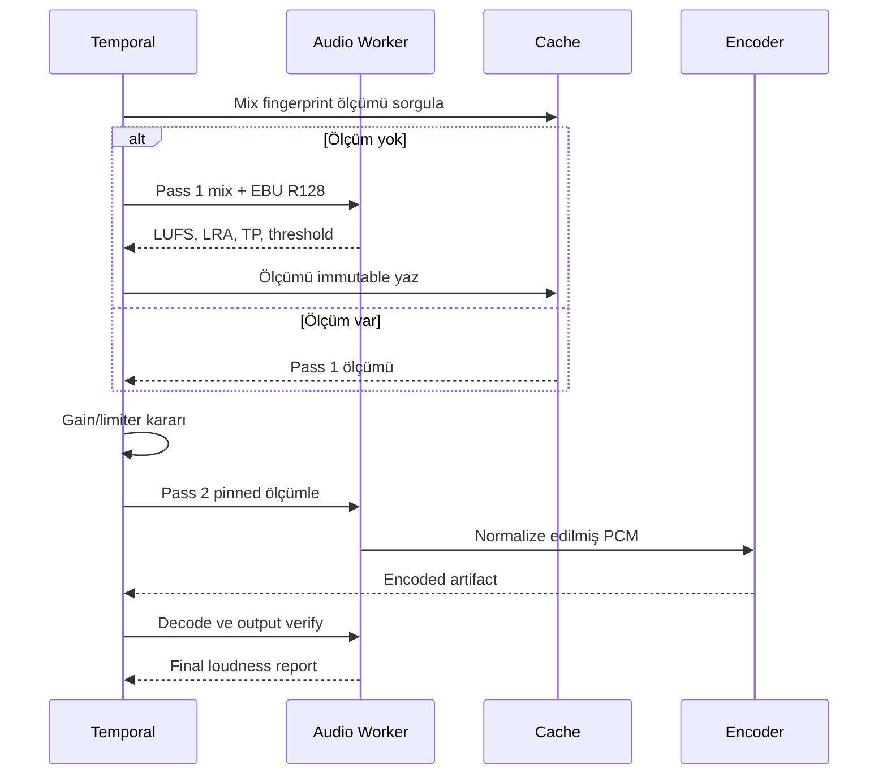
```mermaid
sequenceDiagram
    participant T as Temporal
    participant W as Audio Worker
    participant C as Cache
    participant E as Encoder
    T->>C: Mix fingerprint ölçümü sorgula
    alt Ölçüm yok
        T->>W: Pass 1 mix + EBU R128
        W-->>T: LUFS, LRA, TP, threshold
        T->>C: Ölçümü immutable yaz
    else Ölçüm var
        C-->>T: Pass 1 ölçümü
    end
    T->>T: Gain/limiter kararı
    T->>W: Pass 2 pinned ölçümle
    W->>E: Normalize edilmiş PCM
    E-->>T: Encoded artifact
    T->>W: Decode ve output verify
    W-->>T: Final loudness report
```

### 39.8 Class diyagramı

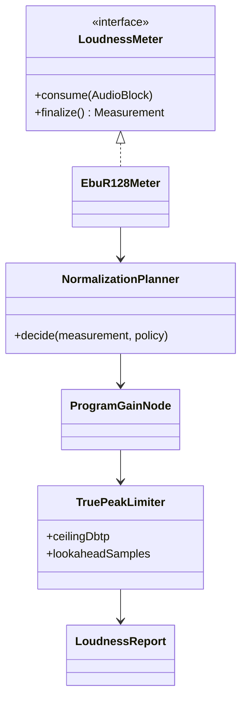
```mermaid
classDiagram
    class LoudnessMeter {
      <<interface>>
      +consume(AudioBlock)
      +finalize() Measurement
    }
    class EbuR128Meter
    class NormalizationPlanner {
      +decide(measurement, policy)
    }
    class ProgramGainNode
    class TruePeakLimiter {
      +ceilingDbtp
      +lookaheadSamples
    }
    class LoudnessReport
    LoudnessMeter <|.. EbuR128Meter
    EbuR128Meter --> NormalizationPlanner
    NormalizationPlanner --> ProgramGainNode
    ProgramGainNode --> TruePeakLimiter
    TruePeakLimiter --> LoudnessReport
```

### 39.9 State diyagramı

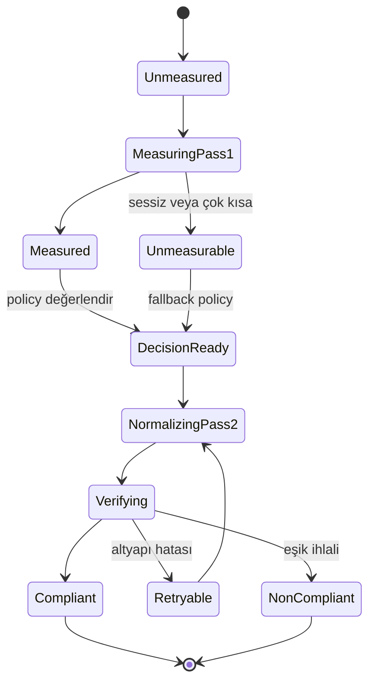
```mermaid
stateDiagram-v2
    [*] --> Unmeasured
    Unmeasured --> MeasuringPass1
    MeasuringPass1 --> Measured
    MeasuringPass1 --> Unmeasurable: sessiz veya çok kısa
    Measured --> DecisionReady: policy değerlendir
    Unmeasurable --> DecisionReady: fallback policy
    DecisionReady --> NormalizingPass2
    NormalizingPass2 --> Verifying
    Verifying --> Compliant
    Verifying --> Retryable: altyapı hatası
    Verifying --> NonCompliant: eşik ihlali
    Retryable --> NormalizingPass2
    Compliant --> [*]
    NonCompliant --> [*]
```

### 39.10 Production sorunları ve recovery

Sessiz içerikte meter `-inf` döndürebilir; NaN'e çevrilmez, `UNMEASURABLE_SILENCE` raporlanır ve gain 0 dB kalır. FFmpeg/libebur128 build farkı sonucu değiştirirse meter build kimliği cache fingerprint'ini ayırır. Pass 1 ile pass 2 arasında asset/preset değişemez çünkü plan hash sabittir. Aşırı limiter reduction kalite politikası ihlalidir; otomatik olarak hedefi düşürmek yalnız profilde izinliyse yapılır ve karar rapora yazılır. Encode sonrası true peak kayması codec'e bağlıdır; doğrulama başarısızsa daha düşük ceiling ile sınırlı bir retry yapılabilir, sonra kalıcı hata verilir.

### 39.11 Performans, benchmark ve kabul eşikleri

- Stereo EBU ölçümü 1 vCPU'da p95 `0.08x` gerçek zaman; 4x true-peak ölçüm dahil `0.18x` altında olmalıdır.
- Final integrated loudness hedef farkı 10 saniyeden uzun ölçülebilir içerikte `+/-0.3 LU`, 3-10 saniye içerikte `+/-0.7 LU` olmalıdır.
- Encoded artifact true peak ceiling'i 0.1 dB'den fazla aşmamalıdır.
- Referans EBU test vektörlerinde integrated loudness farkı `+/-0.1 LU`, LRA farkı `+/-0.5 LU` altında olmalıdır.
- Varsayılan profilde limiter gain reduction p95 3 dB altında; tek artifact için 6 dB üstü kalite hatasıdır.
- Pass 1 ölçüm cache hit oranı tekrar render işlerinde yüzde 90 üstü hedeflenir.

### 39.12 Gerçek kullanım, ölçek, ownership ve testler

Sosyal platform için farklı kaynaklardan birleştirilmiş klipler aynı algılanan seviyeye getirilir; broadcast teslimi ayrı profil kullanır. Bir içerik farklı görüntü oranlarında yeniden render edildiğinde audio graph aynıysa pass 1 ölçümü paylaşılır. Günde 100.000 saat ölçüm ve iki milyon artifact doğrulaması hedeflenir. Owner Media Audio; platform eşikleri Delivery ekibiyle ortaktır. EBU conformance, codec round-trip, sessizlik/kısa içerik, stereo/5.1, segment eşdeğerliği ve build-upgrade canary testleri zorunludur.

---

## 40. Thumbnail Generator

### 40.1 Mekanizma ve değişmezler

Thumbnail generator, kaynak veya tamamlanmış composited timeline'dan aday zamanlar çıkarır, her aday için kalite/ilgi özellikleri hesaplar, kısıtları uygular ve platform başına tam frame'i yeniden çıkarıp overlay/render işlemlerini yapar.

Candidate scoring bileşenleri:

- Blur: Laplacian variance ve motion-aware blur skoru; bulanık kare cezalandırılır.
- Face: yüz sayısı, güven, görünür alan, göz açıklığı ve crop güvenliği; tek başına kimlik tanıma yapılmaz.
- Text: OCR/text-region yoğunluğu ve safe-area çakışması; mevcut okunabilir metin ile yeni overlay çakışması cezalandırılır.
- Saliency: görsel odak, konu konumu ve rule-of-thirds yakınlığı.
- Exposure/color: aşırı karanlık, patlak highlight, düşük kontrast ve tek renk kare cezası.
- Temporal diversity: aynı shot içindeki benzer adayların fazlalığı azaltılır; shot boundary yakınındaki bozuk geçiş kareleri dışlanır.
- Editorial hints: marker, konuşmacı, highlight confidence ve kullanıcı pin'i en yüksek önceliktedir.

Skor formülü ve model sürümü RenderPlan'da pinlenir. Aday analizi düşük çözünürlüklü proxy'de yapılabilir; nihai frame her zaman orijinal/composited graph'tan exact PTS ile çıkarılır. Yakın keyframe'e sessizce yuvarlama yapılmaz. Variable frame rate içerikte frame index değil PTS kimliktir.

### 40.2 Neden ve alternatifler

İlk, orta veya en yüksek hareketli kareyi seçmek ucuzdur fakat geçiş, blur ve kötü yüz ifadesi üretir. Yalnız ML estetik modeli açıklanabilirliği ve sürüm deterministikliğini azaltır. Hibrit özellik + pinlenmiş model, editoryal kısıtları korurken kaliteyi artırır. Final videodan çıkarım overlay ve renk düzenini garanti eder; kaynak videodan çıkarım daha erken üretilebilir. Sistem ihtiyaca göre `SOURCE_TIMELINE` ve `FINAL_COMPOSITE` modlarını açıkça ayırır.

### 40.3 Veri akışı

1. Shot boundary ve editorial marker'lardan aday pencereler üretilir.
2. Her pencereden sınırlı sayıda proxy frame decode edilir.
3. Blur, face, text, saliency, exposure ve diversity özellikleri batch olarak hesaplanır.
4. Hard constraint ihlalleri elenir, kalanlar pinlenmiş ağırlıklarla puanlanır.
5. Platform ve dil başına ilk N aday seçilir.
6. Exact frame extraction, en yakın önceki keyframe'den decode ederek hedef PTS'i bulur.
7. Crop/resize, overlay, font, logo, renk profili ve safe-area uygulanır.
8. JPEG/WebP/PNG artifact'leri checksum ve feature explanation ile yayınlanır.

### 40.4 API, arayüz ve model

```proto
message ThumbnailRequest {
  string render_plan_id = 1;
  repeated ThumbnailProfile profiles = 2;
  uint32 candidates_per_profile = 3;
  repeated Rational preferred_times = 4;
  string extraction_mode = 5;
}

message ThumbnailProfile {
  string profile_id = 1;
  uint32 width = 2;
  uint32 height = 3;
  string fit = 4;                       // crop, contain
  string format = 5;
  uint32 quality = 6;
  SafeArea safe_area = 7;
  repeated Overlay overlays = 8;
}

message ThumbnailCandidate {
  Rational pts = 1;
  double total_score = 2;
  map<string, double> features = 3;
  BoundingBox primary_subject = 4;
  repeated string rejection_reasons = 5;
  string scorer_version = 6;
}
```

Platform boyutları presetle pinlenir; örnek profiller YouTube `1280x720`, dikey kapak `1080x1920`, kare `1080x1080` olabilir. Bunlar kod sabiti değildir. `POST /v1/renders/{id}/thumbnails:generate` idempotency key kabul eder; yanıt job kimliği, sonuç candidate listesi ve artifact URL'leri döndürür.

### 40.5 Dosya ve klasör yeri

- `internal/thumbnail/candidates/`: shot sampling ve temporal diversity.
- `internal/thumbnail/features/{blur,face,text,saliency}/`: pinlenmiş feature extractor'lar.
- `internal/thumbnail/scoring/`: kural/model skoru ve açıklama.
- `internal/thumbnail/extract/`: exact PTS frame decode.
- `internal/thumbnail/overlay/`: crop, safe-area, font ve platform çıktı.
- `test/golden/thumbnail/`: VFR, yüz, OCR, overlay ve renk fixture'ları.

### 40.6 Render pipeline entegrasyonu

Thumbnail analizi video decode proxy düğümünü preview ile paylaşabilir. `FINAL_COMPOSITE` modu overlay/plugin graph'ının fingerprint'ine bağımlıdır. Exact extraction düğümü final encode'a bağımlı olmak zorunda değildir; composited raw frame graph'tan beslenebilir. Çoklu platform profilleri aynı exact frame'i paylaşır, crop/overlay sonrası ayrılır. Font asset hash'i ve text shaping runtime sürümü fingerprint'e dahildir.

### 40.7 Sequence diyagramı

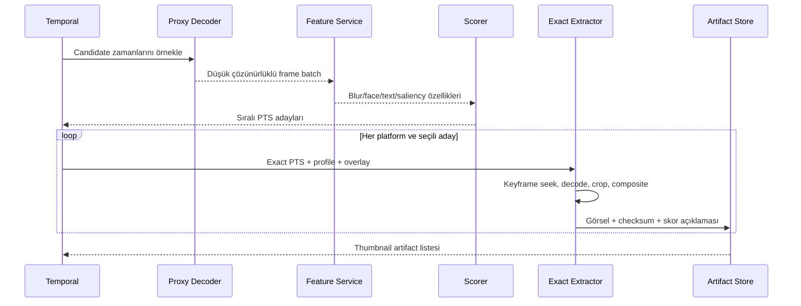
```mermaid
sequenceDiagram
    participant T as Temporal
    participant P as Proxy Decoder
    participant F as Feature Service
    participant S as Scorer
    participant E as Exact Extractor
    participant A as Artifact Store
    T->>P: Candidate zamanlarını örnekle
    P-->>F: Düşük çözünürlüklü frame batch
    F-->>S: Blur/face/text/saliency özellikleri
    S-->>T: Sıralı PTS adayları
    loop Her platform ve seçili aday
        T->>E: Exact PTS + profile + overlay
        E->>E: Keyframe seek, decode, crop, composite
        E->>A: Görsel + checksum + skor açıklaması
    end
    A-->>T: Thumbnail artifact listesi
```

### 40.8 Class diyagramı

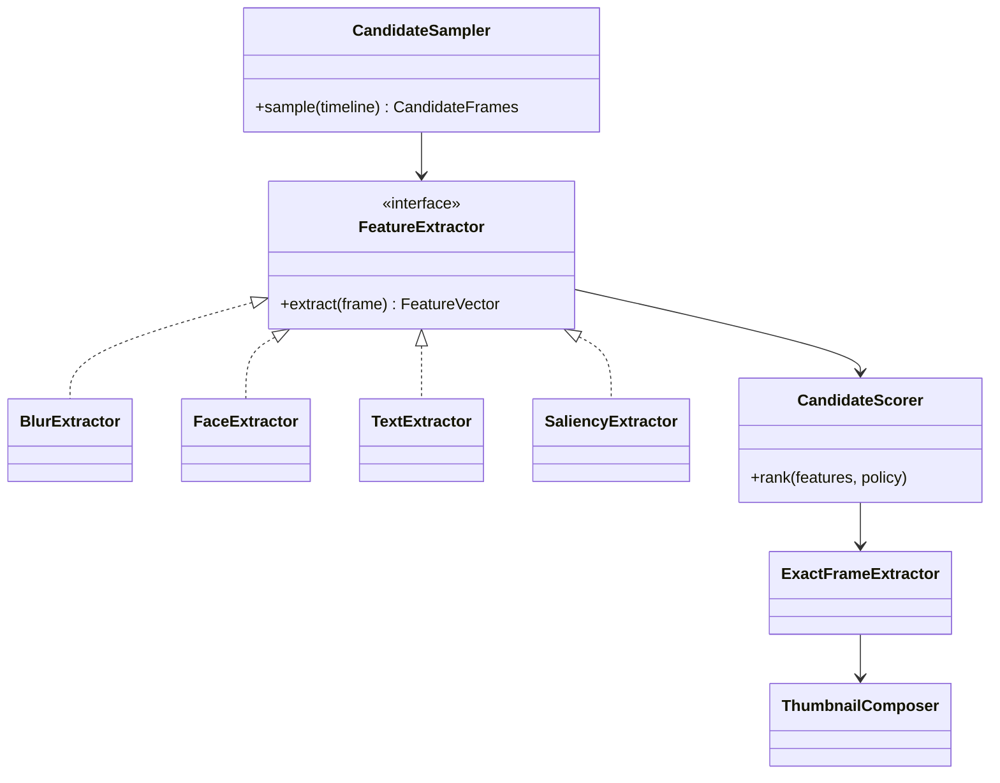
```mermaid
classDiagram
    class CandidateSampler {
      +sample(timeline) CandidateFrames
    }
    class FeatureExtractor {
      <<interface>>
      +extract(frame) FeatureVector
    }
    class BlurExtractor
    class FaceExtractor
    class TextExtractor
    class SaliencyExtractor
    class CandidateScorer {
      +rank(features, policy)
    }
    class ExactFrameExtractor
    class ThumbnailComposer
    CandidateSampler --> FeatureExtractor
    FeatureExtractor <|.. BlurExtractor
    FeatureExtractor <|.. FaceExtractor
    FeatureExtractor <|.. TextExtractor
    FeatureExtractor <|.. SaliencyExtractor
    FeatureExtractor --> CandidateScorer
    CandidateScorer --> ExactFrameExtractor
    ExactFrameExtractor --> ThumbnailComposer
```

### 40.9 State diyagramı

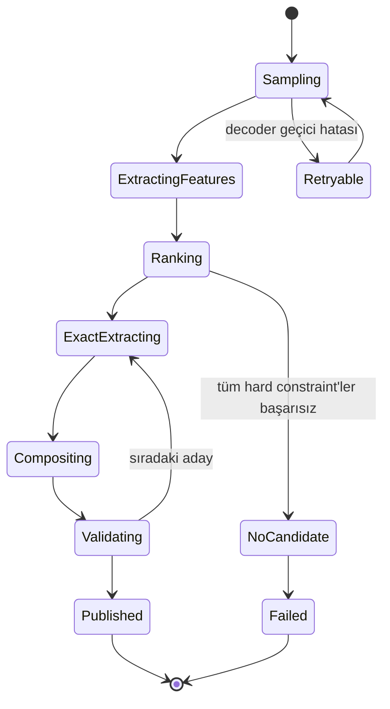
```mermaid
stateDiagram-v2
    [*] --> Sampling
    Sampling --> ExtractingFeatures
    ExtractingFeatures --> Ranking
    Ranking --> NoCandidate: tüm hard constraint'ler başarısız
    Ranking --> ExactExtracting
    ExactExtracting --> Compositing
    Compositing --> Validating
    Validating --> Published
    Validating --> ExactExtracting: sıradaki aday
    Sampling --> Retryable: decoder geçici hatası
    Retryable --> Sampling
    NoCandidate --> Failed
    Published --> [*]
    Failed --> [*]
```

### 40.10 Production sorunları ve recovery

Model servisi yoksa pinlenmiş CPU extractor veya yalnız kural tabanlı fallback ancak profilde izinliyse kullanılır; metadata fallback'i gösterir. Yüz bulunmaması hata değildir. Bütün adaylar blur ise hard blur eşiği kontrollü gevşetilir ve uyarı eklenir. VFR exact extraction hedef PTS'e ulaşamazsa decoder'ın sunduğu en yakın sonraki frame yalnız tolerans içindeyse seçilir; gerçek PTS raporlanır. Font/lisans eksikliği overlay'i atlatmaz, kalıcı plan hatasıdır. Bozuk görsel artifact checksum doğrulamasında silinir ve aynı adaydan tekrar üretilir.

### 40.11 Performans, benchmark ve kabul eşikleri

- 10 dakikalık 1080p video için 120 adayın proxy analizi 4 vCPU ve opsiyonel GPU ile p95 8 saniye altında olmalıdır.
- Exact frame extraction warm cache p95 500 ms, cold S3 p95 2 saniye altında olmalıdır.
- Feature batch GPU kullanımında en az yüzde 60 doluluk; aday başına geçici bellek 16 MiB altında olmalıdır.
- Exact PTS farkı VFR dahil yarım frame süresinden küçük, CFR'de hedef frame ile aynı olmalıdır.
- Çıktı boyutu profil ölçüsüyle bire bir; yanlış orientation ve renk profili oranı sıfırdır.
- İnsan değerlendirme setinde otomatik ilk 3 adaydan en az biri yüzde 90 içerik için "yayınlanabilir" olmalıdır; bulanık ilk aday oranı yüzde 1'in altında olmalıdır.

### 40.12 Gerçek kullanım, ölçek, ownership ve testler

Bir yayın highlight'ında yüzü görünür, skor overlay'iyle çakışmayan ve aksiyon anını temsil eden üç seçenek üretilir. Aynı exact frame YouTube, dikey mobil ve kare sosyal profil için farklı crop'a girer. Ölçek hedefi saniyede 500 video için candidate analizi ve günde 10 milyon thumbnail'dır. Owner Derived Media; yüz/saliency modelleri Applied ML, overlay/font sistemi Creative Runtime ile ortaktır. Golden image perceptual hash, pixel-diff toleransı, VFR exact-frame, OCR dil, adversarial medya, model canary ve insan kalite değerlendirmesi zorunludur.

---

## 41. Preview Generator

### 41.1 Mekanizma ve değişmezler

Preview sistemi hızlı geri bildirim için tiered proxy üretir:

| Tier | Amaç | Tipik çıktı |
|---|---|---|
| T0 | Anlık scrubbing | JPEG/WebP storyboard + zaman indeksi |
| T1 | Hızlı düzenleme önizlemesi | 360p/540p düşük bitrate fMP4/HLS, yaklaşık ses |
| T2 | Kalite onayı | 720p/1080p, final graph, final veya doğrulanmış ses |
| T3 | Final | Teslim profili, kapsam dışı olmayan tam render |

Preview, aynı `RenderPlan`ın açıkça tanımlanmış `PreviewTransform` ile türetilmiş sürümüdür. Transform çözünürlük, codec, bitrate, analiz doğruluğu ve izin verilen bypass'ları belirtir. Kaynak/preset/plugin sürümleri değişmez. Watermark, tenant kimliği, kullanıcı, render kimliği ve süre sonu içeren görünür veya forensic katmandır; final artifact'e yanlışlıkla taşınmaması için ayrı düğüm ve artifact kind kullanılır.

- Scrubbing segmentleri keyframe hizalı fMP4 parçalardır; decode timestamp ve composition timestamp korunur.
- Partial render `[start,end)` aralığına ek olarak video GOP preroll ve audio state context'i işler, yalnız merkez aralığı yayınlar.
- HLS manifestleri immutable segment URL'leri ve kısa ömürlü signed erişim kullanır.
- T1'de approximate loudness/VAD kullanılabilir ancak yanıt metadata'sı sapmaları açıklar.
- Plugin `preview_mode` sağlamıyorsa aynı plugin düşük çözünürlükte çalışır; plugin sessizce atlanmaz. Yalnız preset açıkça bypass izni verebilir.

### 41.2 Neden ve alternatifler

Her editte tam final render yapmak etkileşim gecikmesini ve maliyeti artırır. Kaynak videoyu doğrudan oynatmak ise crop, overlay, plugin, ducking ve timeline sonucunu göstermez. Tiered yaklaşım hız/doğruluk dengesini sözleşmeye dönüştürür. Tek büyük MP4 progressive download kolaydır ancak random seek ve partial invalidation zayıftır; fMP4/HLS segmentleri scrubbing, CDN cache ve parça yenilemeyi destekler. WebRTC düşük gecikmeli canlı önizleme gelecekte eklenebilir, fakat batch edit preview için operasyon maliyeti nedeniyle varsayılan değildir.

### 41.3 Veri akışı

1. İstemci timeline revision ve istenen tier/aralığı gönderir.
2. Compiler mevcut final `RenderPlan`dan `PreviewPlan` türetir ve sapma manifesti üretir.
3. Cache exact preview fingerprint veya yeniden kullanılabilir segmentleri arar.
4. Eksik aralıklar GOP/audio context ile Temporal child workflow'larına bölünür.
5. Worker proxy decode, düşük çözünürlüklü graph, watermark, audio ve fMP4 encode çalıştırır.
6. Segmentler S3 CAS'e, segment indeksi PostgreSQL'e yazılır.
7. HLS manifest atomik yeni sürüm olarak yayınlanır; signed playback URL döndürülür.
8. T0 storyboard ve waveform indeksi bağımsız artifact olarak sunulur.

### 41.4 API, arayüz ve model

```proto
message PreviewRequest {
  string render_plan_id = 1;
  string tier = 2;
  optional TimeRange range = 3;
  PreviewProfile profile = 4;
  WatermarkPolicy watermark = 5;
  string idempotency_key = 6;
}

message PreviewProfile {
  uint32 max_width = 1;
  uint32 max_height = 2;
  string video_codec = 3;
  uint64 video_bitrate = 4;
  uint32 segment_duration_ms = 5;
  uint32 audio_bitrate = 6;
  repeated string allowed_approximations = 7;
}

message PreviewManifest {
  string artifact_id = 1;
  string hls_url = 2;
  repeated PreviewSegment segments = 3;
  repeated Approximation approximations = 4;
  Rational actual_start = 5;
  Rational actual_end = 6;
  string expires_at = 7;
}
```

API: `POST /v1/render-plans/{id}/previews`, `GET /v1/previews/{id}`, `DELETE /v1/previews/{id}` ve `GET /v1/previews/{id}/manifest`. Delete erişimi iptal eder; CAS blob lifecycle asenkron GC ile yönetilir.

### 41.5 Dosya ve klasör yeri

- `internal/preview/planner/`: tier transform, segment ve context planlama.
- `internal/preview/proxy/`: düşük çözünürlük decode/encode.
- `internal/preview/hls/`: fMP4 segment, manifest ve timestamp.
- `internal/preview/partial/`: range expansion ve merge.
- `internal/preview/watermark/`: görünür/forensic watermark.
- `test/golden/preview/`: seek, HLS uyumu, watermark ve approximation fixture'ları.

### 41.6 Render pipeline entegrasyonu

Preview graph, final graph düğümlerini mümkün olduğunca paylaşır; çözünürlüğe bağlı düğümlerin fingerprint'i preview profilini içerir. Segment sınırı final timeline üzerinde sabittir, böylece tek bir edit yalnız bağımlı segmentleri invalid eder. Audio stateful node'ları için overlap hesaplanır ve encode edilen merkez segmentte timestamp sıfırlanmaz. HLS init segment codec/config fingerprint'ine bağlıdır; config değişirse yeni rendition ve manifest sürümü açılır.

### 41.7 Sequence diyagramı

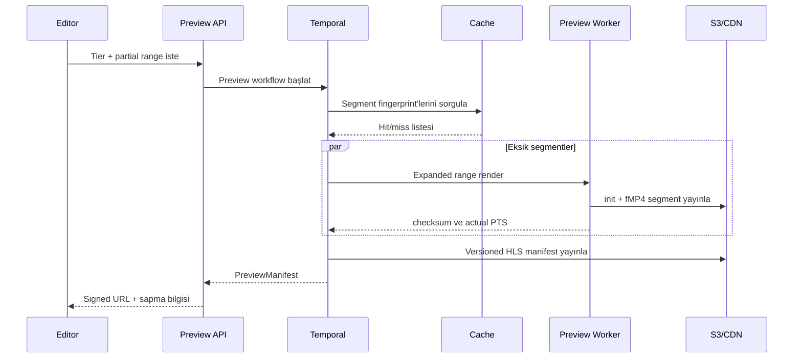
```mermaid
sequenceDiagram
    participant UI as Editor
    participant API as Preview API
    participant T as Temporal
    participant C as Cache
    participant W as Preview Worker
    participant S as S3/CDN
    UI->>API: Tier + partial range iste
    API->>T: Preview workflow başlat
    T->>C: Segment fingerprint'lerini sorgula
    C-->>T: Hit/miss listesi
    par Eksik segmentler
        T->>W: Expanded range render
        W->>S: init + fMP4 segment yayınla
        W-->>T: checksum ve actual PTS
    end
    T->>S: Versioned HLS manifest yayınla
    T-->>API: PreviewManifest
    API-->>UI: Signed URL + sapma bilgisi
```

### 41.8 Class diyagramı

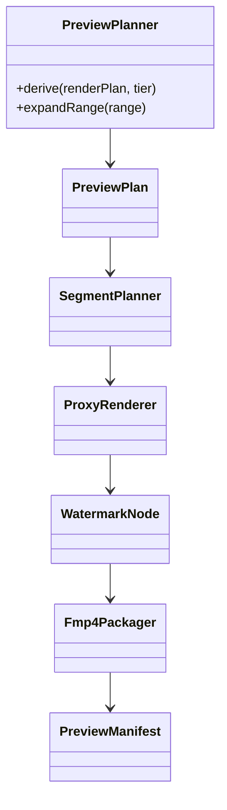
```mermaid
classDiagram
    class PreviewPlanner {
      +derive(renderPlan, tier)
      +expandRange(range)
    }
    class PreviewPlan
    class SegmentPlanner
    class ProxyRenderer
    class WatermarkNode
    class Fmp4Packager
    class PreviewManifest
    PreviewPlanner --> PreviewPlan
    PreviewPlan --> SegmentPlanner
    SegmentPlanner --> ProxyRenderer
    ProxyRenderer --> WatermarkNode
    WatermarkNode --> Fmp4Packager
    Fmp4Packager --> PreviewManifest
```

### 41.9 State diyagramı

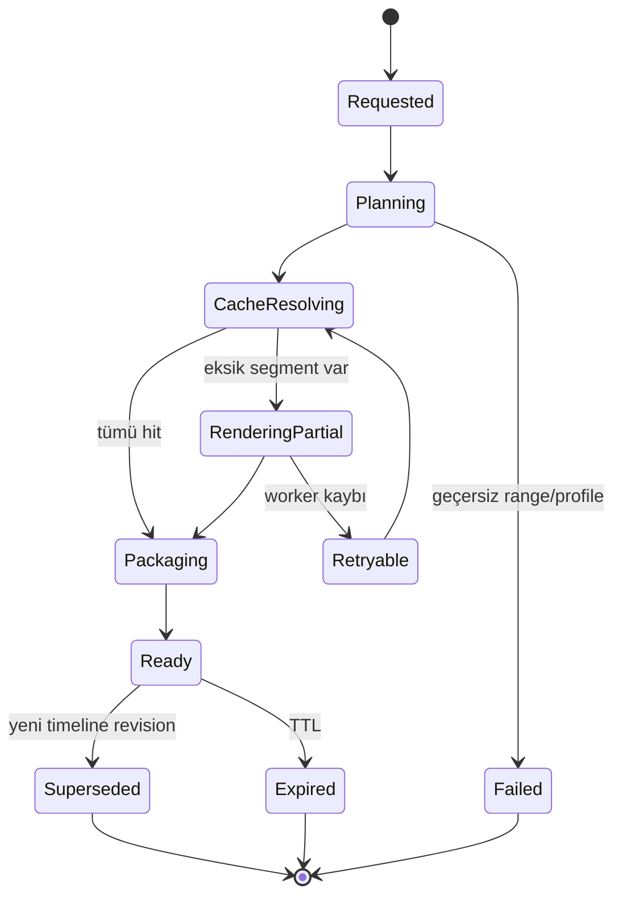
```mermaid
stateDiagram-v2
    [*] --> Requested
    Requested --> Planning
    Planning --> CacheResolving
    CacheResolving --> RenderingPartial: eksik segment var
    CacheResolving --> Packaging: tümü hit
    RenderingPartial --> Packaging
    Packaging --> Ready
    Ready --> Superseded: yeni timeline revision
    Ready --> Expired: TTL
    RenderingPartial --> Retryable: worker kaybı
    Retryable --> CacheResolving
    Planning --> Failed: geçersiz range/profile
    Superseded --> [*]
    Expired --> [*]
    Failed --> [*]
```

### 41.10 Production sorunları ve recovery

Eksik segment manifestte listelenmez; `EXT-X-GAP` ancak istemci destek profili izin verirse kullanılır. Worker kaybında yayımlanmış checksum'lı segmentler tekrar kullanılır. Ses/video segment timestamp uyumsuzluğu packager doğrulamasında manifest yayınını durdurur. Signed URL sızıntısı kısa TTL, tenant-bound claim ve CDN token ile sınırlandırılır. Watermark node hatası fail-closed'dur. Eski preview revision erişimi ürün politikasıyla sürdürülebilir ancak yeni revision altında karıştırılmaz. HLS player uyumsuzluğu için Safari/Chrome/Android conformance matrisi tutulur.

### 41.11 Performans, benchmark ve kabul eşikleri

- T0 storyboard ilk yanıt p95 1 saniye, T1 ilk oynatılabilir 4 saniyelik segment cold p95 3 saniye, warm p95 500 ms altında olmalıdır.
- T1 render hızı 1080p kaynakta 4 vCPU ile en az `4x` gerçek zaman, GPU worker'da `10x` gerçek zaman olmalıdır.
- Scrub seek sonrası görüntü p95 300 ms CDN warm, 1 saniye cold altında olmalıdır.
- Partial edit sonrası yeniden render edilen segment oranı teorik bağımlı segment sayısının yüzde 110'unu aşmamalıdır.
- A/V sync farkı 20 ms altında, segment PTS monotonluk hatası sıfır olmalıdır.
- Watermark görünürlük golden test skoru yüzde 100; final artifact'te preview watermark bulunma oranı sıfırdır.

### 41.12 Gerçek kullanım, ölçek, ownership ve testler

Editör 90 dakikalık videonun 12 saniyelik başlığını değiştirince yalnız çakışan segmentler ve bağlam komşuları yenilenir. Mobil istemci 360p tier, kalite kontrol 1080p tier kullanır. Ölçek hedefi 50.000 eşzamanlı preview oturumu, saniyede 10.000 segment isteği ve petabyte ölçeğinde kısa TTL CDN trafiğidir. Owner Derived Media; player sözleşmesi Client Platform, CDN Delivery ile ortaktır. HLS validator, timestamp property testleri, kısmi/tam render perceptual eşdeğerliği, watermark güvenlik testi, chaos ve çoklu player E2E testleri gerekir.

---

## 42. Asset Management

### 42.1 Mekanizma ve değişmezler

Asset Management, upload/import'tan silmeye kadar byte içeriği, teknik metadata, güvenlik durumu, provenance ve kullanım hakkını yönetir. Mantıksal `Asset` değişebilir bir kullanıcı nesnesidir; her `AssetVersion` değişmezdir ve bir veya daha fazla content-addressed blob'a referans verir.

- Blob kimliği stream sırasında hesaplanan SHA-256'dır. S3 anahtarı `cas/sha256/ab/cd/<hash>` biçimindedir.
- İstemcinin `Content-Type` veya dosya uzantısına güvenilmez. Magic-byte MIME sniffing, container probe ve decode smoke test uygulanır.
- Upload önce quarantine bucket/prefix'e gelir. AV/malware ve politika taraması temizlenmeden render worker erişemez.
- `ffprobe` JSON'u ham ve normalize edilmiş biçimde probe tool build kimliğiyle saklanır.
- Aynı hash tenant güvenlik sınırları içinde fiziksel dedupe olabilir; authorization ve metadata tenant bazında kalır. Hash varlığı cross-tenant oracle olarak açıklanmaz.
- Provenance kaynak URL, uploader, acquisition time, parent asset, transform ve checksum zinciridir.
- Font ve müzik lisanslarında belge hash'i, hak sahibi, bölgeler, kullanım türü, başlangıç/bitiş, attribution ve revocation durumu tutulur.
- Bir plan, asset version ve rights snapshot pinler. Sonraki metadata düzenlemesi geçmiş planı değiştirmez; hukuki revoke ayrı denylist ile yayın/yeniden render'ı durdurabilir.
- Blob silme yalnız tüm güçlü referanslar ve retention/legal-hold kontrolleri bittikten sonra yapılır.

### 42.2 Neden ve alternatifler

Kullanıcı dosya adını kimlik yapmak rename, duplicate ve overwrite sorunları doğurur. S3 ETag multipart upload'da içerik hash'i değildir. SHA-256 CAS, dedupe, bütünlük ve cache anahtarını birleştirir. Metadata'yı yalnız S3 object tag'lerinde tutmak sorgu, transaction ve hak denetimi için yetersizdir; PostgreSQL doğruluk kaynağıdır. Senkron upload sırasında tüm probe/tarama kullanıcı gecikmesini artırdığı için doğrudan quarantine sonrası Temporal ingest workflow seçilmiştir.

### 42.3 Veri akışı

1. API upload session ve tenant-scoped multipart signed URL üretir.
2. İstemci quarantine alanına yükler; gateway byte limiti ve checksum doğrular.
3. Complete çağrısı Temporal `AssetIngestWorkflow` başlatır.
4. Worker blob'u stream eder, SHA-256 ve gerçek boyutu doğrular, MIME sniff yapar.
5. AV tarama ve archive bomb/policy kontrolleri çalışır.
6. `ffprobe` ve sınırlı decode smoke test teknik metadata çıkarır.
7. Lisans/provenance kuralları doğrulanır; gerekiyorsa `PENDING_RIGHTS` durumunda tutulur.
8. Temiz blob CAS anahtarına server-side copy edilir; PostgreSQL asset version transaction'ı commit edilir.
9. Redis sıcak metadata invalid edilir/doldurulur ve `AssetReady` olayı outbox üzerinden yayınlanır.
10. Quarantine geçici objesi retention süresi sonunda temizlenir.

### 42.4 API, arayüz ve model

```proto
message Asset {
  string asset_id = 1;
  string tenant_id = 2;
  string display_name = 3;
  string current_version_id = 4;
}

message AssetVersion {
  string asset_version_id = 1;
  string asset_id = 2;
  string blob_hash = 3;
  uint64 byte_size = 4;
  string sniffed_mime = 5;
  ProbeMetadata probe = 6;
  Provenance provenance = 7;
  RightsSnapshot rights = 8;
  string state = 9;
  string created_at = 10;
}

message RightsSnapshot {
  string license_type = 1;
  string evidence_blob_hash = 2;
  repeated string territories = 3;
  repeated string usages = 4;
  optional string valid_from = 5;
  optional string valid_until = 6;
  bool attribution_required = 7;
  string revocation_status = 8;
}
```

API uçları `POST /v1/assets:beginUpload`, `POST /v1/assets/{id}:completeUpload`, `GET /v1/assets/{id}`, `POST /v1/assets/{id}:newVersion`, `POST /v1/assets/{id}:archive`, `POST /v1/assets/{id}:restore` ve hak yönetimi için ayrı yetkili uçlardır. Download URL yalnız authorization sonrası kısa ömürlü ve response-content-disposition güvenli biçimde üretilir.

PostgreSQL temel tabloları: `assets`, `asset_versions`, `blobs`, `asset_streams`, `asset_provenance_edges`, `rights_snapshots`, `license_evidence`, `asset_holds`, `asset_references`, `asset_scan_results`, `outbox_events`. `blobs.hash` unique; tenant erişimi yalnız ilişki tablolarıyla belirlenir.

### 42.5 Dosya ve klasör yeri

- `internal/assets/ingest/`: multipart finalize, hash ve CAS publish.
- `internal/assets/sniff/`, `probe/`, `scanner/`: MIME, ffprobe, decode ve AV.
- `internal/assets/provenance/` ve `licensing/`: lineage ve rights.
- `internal/assets/lifecycle/`: archive, retention, legal hold ve GC.
- `internal/storage/{s3,postgres,redis}/assets/`: repository implementasyonları.
- `migrations/postgres/*_assets.sql`: metadata şeması ve outbox.

### 42.6 Render pipeline entegrasyonu

Compiler yalnız `READY` ve rights policy'yi geçen asset version'ları plana alır. Render worker S3 anahtarı değil blob hash ve yetkilendirilmiş `AssetHandle` alır; handle node-scoped credential taşır. Probe metadata planlama içindir, decoder gerçek stream bilgisini yine doğrular. Font blob'ları text renderer sandbox'ına salt okunur mount edilir. Render sonucu provenance grafiğinde parent plan ve bütün input asset version'larına bağlanır.

### 42.7 Sequence diyagramı

```mermaid
sequenceDiagram
    participant U as Client
    participant A as Asset API
    participant Q as Quarantine S3
    participant T as Temporal
    participant W as Ingest Worker
    participant P as PostgreSQL
    participant S as CAS S3
    U->>A: beginUpload metadata
    A-->>U: Multipart signed URL
    U->>Q: Byte upload
    U->>A: completeUpload
    A->>T: AssetIngestWorkflow
    T->>W: Hash + sniff + AV + ffprobe
    W->>Q: Quarantine blob stream
    W-->>T: hash, clean scan, metadata
    T->>S: CAS'e doğrulanmış copy
    T->>P: AssetVersion + rights + outbox commit
    P-->>A: READY
    A-->>U: Immutable version kimliği
```

### 42.8 Class diyagramı

```mermaid
classDiagram
    class Asset {
      +assetId
      +tenantId
      +currentVersionId
    }
    class AssetVersion {
      +versionId
      +blobHash
      +state
    }
    class Blob {
      +sha256
      +size
      +storageClass
    }
    class ProbeMetadata
    class ProvenanceEdge
    class RightsSnapshot
    class ScanResult
    Asset "1" o-- "many" AssetVersion
    AssetVersion --> Blob
    AssetVersion --> ProbeMetadata
    AssetVersion --> RightsSnapshot
    AssetVersion --> ScanResult
    AssetVersion --> ProvenanceEdge
```

### 42.9 State diyagramı

```mermaid
stateDiagram-v2
    [*] --> Uploading
    Uploading --> Quarantined: multipart complete
    Quarantined --> Scanning
    Scanning --> Probing: temiz
    Scanning --> Rejected: malware/policy
    Probing --> PendingRights: lisans gerekli
    Probing --> Ready: teknik ve hak kontrolleri tamam
    PendingRights --> Ready: kanıt onaylandı
    Ready --> Archived: kullanıcı/lifecycle
    Archived --> Ready: retention içinde restore
    Ready --> Revoked: hak veya güvenlik revoke
    Archived --> DeletionPending: referans yok ve retention doldu
    Revoked --> DeletionPending: hold yok
    DeletionPending --> Deleted: GC doğruladı
    Rejected --> Deleted: quarantine retention doldu
    Deleted --> [*]
```

### 42.10 Production sorunları ve recovery

Multipart yarım kalırsa lifecycle rule ve workflow timer parçaları siler. Hash uyuşmazlığı asset'i reddeder ve güvenlik audit'i üretir. AV servisi kesintisinde fail-closed quarantine korunur; backlog autoscale edilir. `ffprobe` hang/zero-day riski seccomp, timeout, byte/read limiti ve izole pod ile sınırlandırılır. S3 copy başarılı, DB commit başarısızsa CAS'teki blobsuz referans zararsızdır ve orphan GC daha sonra temizler; DB hazır fakat blob yok durumu transaction sırası ve periyodik integrity scrubber ile engellenir. Rights revoke, Redis denylist ve PostgreSQL kaydıyla derhal compiler/publish kapısına yansır.

### 42.11 Performans, benchmark ve kabul eşikleri

- 1 GiB upload finalize hash throughput'u worker başına en az 500 MiB/s NVMe ve 200 MiB/s S3 akışında olmalıdır.
- 100 MiB asset için AV + probe hariç ingest overhead p95 2 saniye; video probe p95 5 saniye, hard timeout 30 saniyedir.
- Asset metadata read Redis hit p95 5 ms, PostgreSQL p95 30 ms altında olmalıdır.
- Hash collision pratikte kabul edilmez; byte size ve opsiyonel ikinci checksum integrity scrub'da doğrulanır.
- READY durumunda eksik CAS blob oranı sıfır; günlük scrub örnekleminde checksum hata oranı sıfır hedeflenir.
- Dedupe oranı, quarantine backlog yaşı, tarama hata oranı, orphan byte ve rights-expiry backlog temel SLO metrikleridir.

### 42.12 Gerçek kullanım, ölçek, ownership ve testler

Bir kullanıcı aynı müziği farklı adla yüklediğinde tek blob saklanabilir, fakat iki mantıksal asset ve hak kaydı korunur. Lisanslı font yalnız izinli tenant ve kullanım için planlanır. Ölçek hedefi günde 10 milyon ingest, 10 milyar metadata satırı ve exabyte'a büyüyebilen S3 lifecycle'dır; tablolar tenant/time ile partition, metadata read replica ve S3 prefix dağılımı kullanır. Owner Asset Platform; malware Trust & Safety, lisans Rights, S3 Storage Platform ile ortaktır. Parser fuzz, MIME spoof, zip bomb, multipart retry, transaction failure, legal hold, cross-tenant authorization ve restore/GC chaos testleri zorunludur.

---

## 43. Plugin System

### 43.1 Mekanizma ve değişmezler

Plugin sistemi video, audio, metadata analyzer ve overlay üreticilerinin çekirdek release dışında eklenmesini sağlar. Paket; manifest, şema, executable/WASM modülü, kaynaklar, SBOM ve imza zincirinden oluşur. Registry yalnız güvenilir yayımlayıcı anahtarıyla imzalanmış ve doğrulamadan geçmiş değişmez paketleri kabul eder.

- `RenderPlan` semver range değil tam `plugin_id`, `version`, `package_hash`, ABI ve config hash pinler.
- Host ABI sürümlüdür. ABI uyumsuzluğu derlemede reddedilir; runtime shim yalnız açık destek matrisinde bulunur.
- Native plugin ana render worker prosesine yüklenmez. Ayrı sandbox proses/pod, gRPC/Unix domain socket veya paylaşımlı bellek ring buffer ile çalışır. WASM tercih edilen düşük yetkili runtime'dır.
- Capability manifesti `read_frame`, `write_frame`, `read_audio`, `gpu`, `font`, `network:<allowlist>`, `scratch_bytes` gibi en az yetki ister. Varsayılan ağ yoktur.
- CPU, wall time, bellek, çıktı boyutu, frame başı süre ve toplam süre limitleri uygulanır.
- Plugin yalnız host tarafından verilen content handle'ları okuyabilir; genel S3 credential alamaz.
- Config JSON Schema ile compiler'da ve runner'da doğrulanır.
- Plugin deterministik çıktı, seed davranışı, locale/timezone ve external dependency beyan eder. Saat, entropy ve ağ varsayılan olarak sabitlenir/engellenir.
- Timeout, crash veya protokol ihlalinde plugin çıktısı publish edilmez. Bypass yalnız presetin açık `failure_policy=skip` seçimiyle mümkündür ve artifact uyarı taşır.

### 43.2 Neden ve alternatifler

Çekirdeğe her efektin eklenmesi release hızını, güvenlik yüzeyini ve ekip bağımlılığını artırır. Aynı proses dinamik kütüphane en hızlı veri yoludur fakat crash ve RCE tüm worker'ı etkiler. Ayrı proses güvenlik ve recovery sağlar; shared memory ile kopya maliyeti azaltılır. Tam container-per-frame reddedilmiştir; başlangıç maliyeti yüksektir. Uzun ömürlü ama iş başına temizlenen sandbox pool seçilir. WASM güçlü izolasyon sağlar ancak GPU ve mevcut native codec kütüphanelerinde sınırlıdır; iki runtime aynı host semantiğini uygular.

### 43.3 Veri akışı

1. Yayımlayıcı paketi, manifesti ve SBOM'u registry'ye gönderir.
2. Registry imza, issuer, revoke listesi, vulnerability ve conformance suite'i doğrular.
3. Onaylı paket CAS'e yazılır, sürüm metadata'sı PostgreSQL'de immutable olur.
4. Compiler preset/config'i schema ile doğrular ve exact package hash pinler.
5. Scheduler capability gereksinimine göre uygun Kubernetes node/runner seçer.
6. Runner sandbox açar, package hash ve imzayı tekrar doğrular, salt okunur mount yapar.
7. Host handshake ABI, determinism ve buffer formatını müzakere eder.
8. Frame/audio blokları bounded IPC ile işlenir; heartbeat ve timeout izlenir.
9. Output validation sonrası graph'a döner; log ve metrikler plugin kimliğiyle etiketlenir.

### 43.4 API, arayüz ve model

```json
{
  "plugin_id": "com.example.smart-overlay",
  "version": "2.4.1",
  "package_hash": "sha256:...",
  "publisher": "example",
  "abi": "video-plugin-abi/v3",
  "kind": "video_filter",
  "entrypoint": "plugin.wasm",
  "capabilities": ["read_frame", "write_frame", "font"],
  "determinism": {"level": "strict", "seeded": true},
  "limits": {"memory_mib": 512, "frame_timeout_ms": 100},
  "config_schema": "schemas/config-v2.json",
  "signature": {"key_id": "publisher-key-7", "value": "..."}
}
```

```proto
service PluginHost {
  rpc Handshake(HandshakeRequest) returns (HandshakeResponse);
  rpc Configure(ConfigureRequest) returns (ConfigureResponse);
  rpc ProcessVideo(stream VideoBuffer) returns (stream VideoBuffer);
  rpc ProcessAudio(stream AudioBuffer) returns (stream AudioBuffer);
  rpc Flush(FlushRequest) returns (FlushResponse);
}

message PluginInstanceSpec {
  string plugin_id = 1;
  string version = 2;
  string package_hash = 3;
  string abi = 4;
  bytes canonical_config_json = 5;
  uint64 seed = 6;
  string failure_policy = 7;
}
```

### 43.5 Dosya ve klasör yeri

- `internal/plugins/registry/`: publish, signature, revoke ve metadata.
- `internal/plugins/verify/`: package, SBOM ve conformance doğrulama.
- `internal/plugins/capabilities/`: policy engine ve Kubernetes security context.
- `internal/plugins/runtime/{wasm,native}/`: sandbox launcher ve IPC.
- `internal/plugins/host_api/`: versioned ABI/proto ve buffer sözleşmeleri.
- `cmd/plugin-runner/`: izole runtime process.
- `test/conformance/plugins/`: ABI, determinism, crash ve capability testleri.

### 43.6 Render pipeline entegrasyonu

Plugin graph node fingerprint'i package hash, canonical config, input fingerprint, host ABI/build, declared seed ve capability policy version içerir. Strict deterministik plugin cache'lenebilir. Bounded plugin yalnız aynı runtime/GPU driver sınıfında cache paylaşır. Nondeterministic plugin node'u ve tüm downstream bağımlıları varsayılan olarak cross-render cache dışıdır. Audio plugin latency sample cinsinden, video plugin frame/PTS cinsinden handshake'te bildirilir ve graph compensation'a girer.

### 43.7 Sequence diyagramı

```mermaid
sequenceDiagram
    participant C as Compiler
    participant R as Plugin Registry
    participant W as Render Worker
    participant S as Sandbox Runner
    participant P as Plugin
    C->>R: Exact sürüm ve hash çöz
    R-->>C: İmzalı manifest + schema
    C->>C: Config/capability doğrula
    W->>S: Package hash ile sandbox başlat
    S->>S: İmza, hash, seccomp doğrula
    S->>P: ABI handshake + seed + config
    P-->>S: Format ve latency
    loop Frame veya audio block
        W->>S: Bounded shared buffer
        S->>P: process
        P-->>S: output + status
        S-->>W: Doğrulanmış buffer
    end
    W->>S: flush ve teardown
```

### 43.8 Class diyagramı

```mermaid
classDiagram
    class PluginManifest {
      +pluginId
      +version
      +packageHash
      +abi
      +capabilities
    }
    class PluginRegistry {
      +publish(package)
      +resolve(exactVersion)
      +revoke(hash)
    }
    class SignatureVerifier
    class CapabilityPolicy
    class PluginRunner {
      +launch(spec)
      +terminate()
    }
    class HostApi
    class WasmRunner
    class NativeRunner
    PluginRegistry --> SignatureVerifier
    PluginRegistry --> PluginManifest
    PluginManifest --> CapabilityPolicy
    PluginRunner --> CapabilityPolicy
    PluginRunner <|-- WasmRunner
    PluginRunner <|-- NativeRunner
    PluginRunner --> HostApi
```

### 43.9 State diyagramı

```mermaid
stateDiagram-v2
    [*] --> Uploaded
    Uploaded --> Verifying
    Verifying --> Approved: imza ve conformance geçti
    Verifying --> Rejected
    Approved --> Active: registry publish
    Active --> Deprecated: yeni kullanım önerilmez
    Active --> Revoked: güvenlik/issuer revoke
    Deprecated --> Revoked
    Active --> Instantiating: render
    Instantiating --> Running: handshake başarılı
    Running --> Completed
    Running --> TimedOut
    Running --> Crashed
    TimedOut --> Terminated
    Crashed --> Terminated
    Completed --> [*]
    Rejected --> [*]
    Revoked --> [*]
```

### 43.10 Production sorunları ve recovery

Plugin crash sandbox'ı sonlandırır; worker sağlıklı kalır. Aynı package/input için tekrar eden crash circuit breaker açar ve registry health durumunu düşürür. Timeout'ta önce cooperative cancel, kısa grace sonrası SIGKILL/cgroup delete uygulanır. Sonsuz çıktı/backpressure bounded buffer ile kesilir. Network capability DNS rebinding'e karşı IP/egress proxy seviyesinde allowlist uygular. İmza anahtarı revoke edilirse yeni plan derleme ve yeni instance açma durur; devam eden işler güvenlik şiddetine göre iptal edilir. Runner ile worker IPC koparsa node aynı fingerprint ile başka pod'da retry edilir; partial plugin state cache'lenmez.

### 43.11 Performans, benchmark ve kabul eşikleri

- Warm sandbox başlatma p95 WASM 50 ms, native 250 ms; cold pod p95 2 saniye altında olmalıdır.
- 1080p RGBA frame shared-memory IPC overhead p95 0.5 ms ve bir kopyadan fazla olmamalıdır.
- Audio 1024-sample stereo block IPC + host overhead p99 0.5 ms altında olmalıdır.
- Limit aşımı tespiti wall timeout'tan en geç 100 ms sonra sandbox'ı sonlandırmalıdır.
- Conformance testinde aynı girdiyle 100 tekrar strict plugin için bit-eşit; bounded plugin için tanımlı perceptual/audio epsilon içinde olmalıdır.
- Plugin kaynaklı worker crash oranı sıfır; sandbox escape güvenlik kabul kriteri sıfır bulgudur.

### 43.12 Gerçek kullanım, ölçek, ownership ve testler

Markaya özel overlay, ses efekti, renk filtresi veya özel içerik analizi signed plugin olarak dağıtılır; preset exact sürümü seçer. Ölçek hedefi 100.000 kayıtlı package version, 20.000 eşzamanlı instance ve saniyede milyonlarca frame IPC'dir. Runner pool plugin hash ve capability sınıfına göre sıcak tutulur fakat tenant işi sonrası bellek/scratch sıfırlanır. Owner Extensibility Platform; sandbox Security, GPU Runtime ve ABI Media Runtime ile ortaktır. ABI conformance, schema fuzz, malicious plugin, fork bomb, OOM, timeout, nondeterminism, signature/revoke ve cross-tenant isolation testleri release gate'tir.

---

## 44. Preset System

### 44.1 Mekanizma ve değişmezler

Preset, tekrar kullanılabilir ve değişmez bir ClipSpec parçası/config paketidir. Sistem inheritance kullanmaz; composition kullanır. Her preset açık girişler, ürettiği patch, bağımlı preset bileşenleri, şema sürümü ve conflict policy taşır.

- Preset sürümü yayımlandıktan sonra değişmez. `latest` yalnız authoring kolaylığıdır ve RenderPlan'da exact `preset_version_id`ye çözülür.
- Composition sırası explicit listedir. Gizli parent zinciri ve field inheritance yoktur.
- Bileşenler namespaced alanlara veya tanımlı merge operatörlerine sahiptir: `replace`, `append_by_id`, `merge_map`, `error_on_conflict`.
- Varsayılan conflict policy `error_on_conflict`tir. Son yazan kazanır davranışı açıkça seçilmedikçe kullanılmaz.
- JSON Schema sürümü her preset türü için pinlenir. Bilinmeyen alanlar varsayılan olarak hatadır.
- Migration saf, sürümlü, idempotent ve audit edilebilir fonksiyondur; eski preset sürümünü yerinde değiştirmez, yeni draft üretir.
- Secret preset içinde saklanmaz. Secret reference derleme/runtime yetkisiyle çözülür ve plan hash'e yalnız secret version kimliği girer.
- Preset; asset, font ve plugin referanslarını exact version'a çözmeden yayınlanamaz veya `deferred` alanları açıkça belirtmelidir.

### 44.2 Neden ve alternatifler

Inheritance derin zincirlerde diamond problem, beklenmeyen override ve silinmiş parent etkisi doğurur. Composition küçük, test edilebilir parçaları explicit sırayla birleştirir. Serbest JSON blob hızlıdır ama doğrulama, migration ve UI üretimi zayıftır. Kod tabanlı preset güçlüdür ancak güvenlik/determinism ve kullanıcı düzenlemesi açısından plugin alanına girer. Bu nedenle preset deklaratif veri, davranış plugin'dir.

### 44.3 Veri akışı

1. Kullanıcı preset draft'ını schema version ile oluşturur.
2. Registry JSON Schema, referans, conflict ve policy doğrulaması yapar.
3. Composition resolver bağımlılık DAG'ını cycle kontrolüyle açar.
4. Her bileşen canonical sırada uygulanır ve provenance map alan bazında tutulur.
5. Publish yeni immutable version, canonical JSON hash ve audit kaydı üretir.
6. ClipSpec derlemede preset ref exact version'a çözülür.
7. Parametreler tip/izin sınırlarında bind edilir.
8. Composed result ClipSpec ile merge edilir; explicit kullanıcı alanlarının önceliği preset sözleşmesinde belirlenir.
9. RenderPlan resolved değerleri ve kullanılan preset sürüm listesini taşır.

### 44.4 API, arayüz ve model

```json
{
  "preset_id": "social-highlight",
  "version": 7,
  "schema": "render-preset/v3",
  "parameters": {
    "brand": {"type": "string", "enum": ["acme", "nova"]}
  },
  "components": [
    {"ref": "video/vertical-1080x1920@4", "merge": "error_on_conflict"},
    {"ref": "audio/social-loudness@2", "merge": "merge_map"},
    {"ref": "brand/acme-overlay@9", "when": "brand == 'acme'"}
  ],
  "patch": {"preview": {"tier": "T1"}},
  "plugin_pins": [{"id": "com.acme.overlay", "version": "3.2.0", "hash": "sha256:..."}]
}
```

```proto
message PresetRef {
  string preset_id = 1;
  optional uint64 version = 2;
  map<string, Value> parameters = 3;
}

message ResolvedPreset {
  string preset_version_id = 1;
  string canonical_hash = 2;
  bytes composed_patch = 3;
  repeated string component_version_ids = 4;
  map<string, string> field_provenance = 5;
}
```

API: draft CRUD, `POST /v1/presets/{id}:validate`, `:publish`, `:compose`, `:migrate` ve `GET /v1/presets/{id}/versions/{version}`. Published version için update/delete yoktur; deprecate ve access revoke ayrı operasyonlardır.

### 44.5 Dosya ve klasör yeri

- `internal/presets/registry/`: draft, publish, deprecate ve authorization.
- `internal/presets/compose/`: DAG, merge operatörleri ve field provenance.
- `internal/presets/validate/`: JSON Schema ve policy kontrolleri.
- `internal/presets/migrate/`: saf version-to-version migrator'lar.
- `api/schemas/presets/`: şema ve örnekler.
- `test/conformance/presets/`: composition, conflict ve migration golden'ları.

### 44.6 Render pipeline entegrasyonu

Preset çözümleme yalnız compiler aşamasındadır; render worker preset registry çağırmaz. Composed patch canonicalize edilip ClipSpec'e uygulanır, sonra asset/plugin çözümü yapılır. Preset hash'i tek başına node fingerprint'e girmek yerine etkilediği resolved değerler girer; böylece etkisiz metadata değişimi cache'i bozmaz. Audit için preset version listesi plan header'da korunur. Preview/final profilleri aynı kompozisyonda farklı explicit component olabilir.

### 44.7 Sequence diyagramı

```mermaid
sequenceDiagram
    participant U as Author
    participant P as Preset Registry
    participant V as Validator
    participant C as Composer
    participant R as Plan Compiler
    U->>P: Draft + schema + component refs
    P->>V: Schema/policy doğrula
    V->>C: DAG ve conflict kontrolü
    C-->>P: Canonical patch + provenance
    P-->>U: Immutable published version
    R->>P: Exact preset version çöz
    P-->>R: Composed result + pins
    R->>R: Parametre bind, ClipSpec merge
    R-->>U: RenderPlan + preset audit listesi
```

### 44.8 Class diyagramı

```mermaid
classDiagram
    class PresetDraft
    class PresetVersion {
      +versionId
      +schemaVersion
      +canonicalHash
    }
    class PresetComponent {
      +ref
      +mergeStrategy
      +condition
    }
    class CompositionResolver {
      +resolve(dag, parameters)
    }
    class SchemaValidator
    class PresetMigrator {
      <<interface>>
      +migrate(input) Draft
    }
    PresetDraft --> SchemaValidator
    PresetDraft --> CompositionResolver
    CompositionResolver o-- PresetComponent
    CompositionResolver --> PresetVersion
    PresetMigrator --> PresetDraft
```

### 44.9 State diyagramı

```mermaid
stateDiagram-v2
    [*] --> Draft
    Draft --> Validating
    Validating --> Draft: hata veya düzenleme
    Validating --> Publishable
    Publishable --> Published: immutable version
    Published --> Deprecated
    Published --> Revoked: güvenlik/hak ihlali
    Deprecated --> Revoked
    Draft --> Migrating: schema upgrade
    Migrating --> Draft: yeni migrated draft
    Published --> Resolving: plan compile
    Resolving --> Resolved
    Resolving --> ResolutionFailed
    Resolved --> [*]
    ResolutionFailed --> [*]
```

### 44.10 Production sorunları ve recovery

Component cycle publish öncesi reddedilir. Silinmiş/deprecated dependency mevcut published preset'i bozmaz çünkü version immutable ve blob tutulur; revoke ise policy gereği yeni derlemeyi engeller. Migration başarısız olursa eski sürüm çalışmaya devam eder, draft hata raporu alır. Registry kesintisinde compiler exact sürümün doğrulanmış Redis/local cache kopyasını TTL ve revoke epoch uygunsa kullanabilir; `latest` çözümü fail-closed olur. Concurrent publish PostgreSQL advisory/unique version constraint ile tek sürüm üretir. Yanlış preset geri alınmaz, deprecate edilip düzeltilmiş yeni sürüm yayımlanır.

### 44.11 Performans, benchmark ve kabul eşikleri

- 100 component ve 10.000 alanlık kompozisyon p95 50 ms, cold registry fetch dahil 200 ms altında olmalıdır.
- DAG cycle/conflict doğrulaması 1.000 node için 100 ms altında olmalıdır.
- Canonical composition aynı input için platformlar arasında byte-eşit JSON üretmelidir.
- Published preset mutation oranı sıfır; çözülmemiş exact dependency oranı sıfırdır.
- Migration golden corpus yüzde 100 idempotent olmalı: `migrate(migrate(x)) == migrate(x)` hedef şemada değişmemelidir.
- Plan compile sırasında preset cache hit oranı yüzde 95 üzeri hedeflenir.

### 44.12 Gerçek kullanım, ölçek, ownership ve testler

"Dikey sosyal highlight" preset'i boyut, crop, loudness, thumbnail ve marka overlay bileşenlerini kompoze eder; bir tenant yalnız marka bileşenini değiştirir. Ölçek hedefi bir milyon preset, yüz milyon immutable version ve saniyede 20.000 resolve'dur. Owner Render Platform; schema alanları ilgili media ekipleri, authoring UX Creative Tools ile ortaktır. Unit/property testler merge cebrini, golden testler composed JSON'u, migration testleri tüm tarihsel corpus'u, authorization testleri tenant paylaşımını ve load testleri derleme patlamalarını kapsar.

---

## 45. Video Cache

### 45.1 Mekanizma ve değişmezler

Video Cache, render graph düğüm sonuçlarını içerik ve yürütme bağımlılıklarına göre yeniden kullanır. Cache kimliği yolu veya iş kimliği değil `node_fingerprint`tir.

Kanonik fingerprint girdileri:

```text
SHA-256(
  node_type + node_schema_version +
  canonical_parameters +
  ordered_input_artifact_hashes +
  relevant_asset_blob_hashes +
  plugin_package_hash/config/seed +
  presetle çözülmüş etkili değerler +
  ffmpeg/libav/codec build id +
  model/font/color-profile hashes +
  target architecture/GPU driver class when required +
  determinism policy + segment range/context
)
```

- Dependency invalidation push tabanlı toplu silme değildir. Bir bağımlılık değişince fingerprint değişir ve eski entry erişilemez olur; GC daha sonra temizler.
- Cache entry ancak artifact blob hash, boyut, media descriptor ve üretici metadata'sıyla `COMMITTED` olur.
- Redis lease tek üretici optimizasyonudur, doğruluk kilidi değildir. Lease kaybolursa iki üretici çalışabilir; CAS publish ve PostgreSQL unique fingerprint güvenli winner seçer.
- Katmanlar: worker-local NVMe L1, bölgesel S3 CAS L2, Redis sıcak index/negative metadata. PostgreSQL kalıcı index ve refcount/retention doğruluk kaynağıdır.
- L1 byte'lar checksum doğrulanmadan kullanılmaz. L2 S3 strong read-after-write varsayımı yanında uygulama checksum doğrulaması yapar.
- Entry'ler immutable'dır. Hatalı artifact `QUARANTINED` olur, yerinde düzeltilmez.
- Nondeterministic düğüm varsayılan olarak kalıcı cache dışıdır. Seeded/strict düğüm paylaşılabilir; bounded düğüm yalnız uyumlu runtime scope'unda paylaşılır.
- Tenant gizlilik politikası cache paylaşım kapsamını `render`, `tenant`, `region` veya `global-public` ile sınırlar.

### 45.2 Neden ve alternatifler

Dosya adı/URL tabanlı cache içerik değişimini kaçırır. Yalnız final render cache'i küçük editlerde ara işi tekrarlar. Düğüm bazlı Merkle benzeri fingerprint, değişmeyen decode, audio analysis, thumbnail feature ve segment sonuçlarını paylaşır. Merkezi Redis'te büyük blob saklamak maliyetli ve dayanıksızdır; Redis yalnız hot metadata/lease içindir. Katı distributed lock worker kaybında ilerlemeyi engeller; süreli lease ve idempotent winner modeli daha dayanıklıdır. Push invalidation fan-out'u milyarlarca entry'de pahalıdır; içerik hash tabanlı doğal erişilemezlik seçilmiştir.

### 45.3 Veri akışı

1. Graph builder topolojik sırada her düğümün fingerprint'ini hesaplar.
2. Worker önce local index/NVMe, sonra Redis hot index, PostgreSQL ve S3 L2'yi kontrol eder.
3. Hit'te descriptor, checksum, runtime scope ve authorization doğrulanır; local'e hydrate edilir.
4. Miss'te Redis `SET lease:<fp> owner NX PX ttl` ile lease denenir.
5. Lease sahibi Temporal heartbeat ile lease'i yeniler ve düğümü üretir.
6. Diğer worker bounded jitter ile sonucu bekler; lease bitince üretimi devralabilir.
7. Üretici geçici dosyayı NVMe'ye yazar, hash/descriptor doğrular, S3 CAS'e upload eder.
8. PostgreSQL transaction unique fingerprint ile cache entry ve artifact referansını commit eder.
9. Redis index doldurulur; kaybeden üretici mevcut winner'ı doğrular ve kendi eşdeğer blob'unu orphan GC'ye bırakır.
10. L1 eviction admission/recency/cost politikasına, L2 lifecycle retention/refcount politikasına göre yapılır.

### 45.4 API, arayüz ve model

```proto
message CacheKey {
  string node_fingerprint = 1;
  string scope = 2;
  string runtime_class = 3;
}

message CacheEntry {
  CacheKey key = 1;
  string artifact_blob_hash = 2;
  uint64 byte_size = 3;
  MediaDescriptor descriptor = 4;
  string state = 5;
  string producer_build_id = 6;
  repeated string dependency_fingerprints = 7;
  string created_at = 8;
  string last_access_bucket = 9;
  double recompute_cost = 10;
}

interface NodeCache {
  lookup(key, expected_descriptor) -> Hit | Miss | Corrupt
  acquire_lease(key, owner, ttl) -> LeaseResult
  renew_lease(key, owner, ttl) -> bool
  commit(key, artifact, production_metadata) -> CommitResult
  quarantine(key, reason) -> void
  release_lease(key, owner) -> void
}
```

PostgreSQL tabloları `cache_entries`, `cache_dependencies`, `artifact_blobs`, `cache_access_buckets`, `cache_quarantine`, `cache_pins`; Redis anahtarları kısa ve hash tabanlıdır. Admin API invalidate yerine varsayılan olarak `quarantine fingerprint`, `purge scope` ve `bump runtime epoch` sunar. Geniş purge çift onay ve audit gerektirir.

### 45.5 Dosya ve klasör yeri

- `internal/graph/fingerprint/`: canonical dependency hashing.
- `internal/cache/index/`: PostgreSQL/Redis metadata repository.
- `internal/cache/lease/`: owner token, renew ve fencing semantiği.
- `internal/cache/local/`: NVMe layout, admission, checksum ve eviction.
- `internal/cache/s3/`: CAS upload/download ve multipart.
- `internal/cache/eviction/`: cost-aware LRU/LFU ve lifecycle.
- `test/conformance/cache/`: determinism, race, corruption ve invalidation.

### 45.6 Render pipeline entegrasyonu

Her graph node `CachePolicy` bildirir: `disabled`, `ephemeral`, `tenant`, `shared`; ayrıca estimated bytes, recompute cost, determinism ve context range taşır. Scheduler pahalı encode/analysis sonuçlarını cache'e kabul eder, çok ucuz veya tek kullanımlık dev ara frame'leri admission policy ile reddedebilir. Segment fingerprint'i merkez range yanında codec GOP, audio overlap ve state snapshot bağımlılıklarını içerir. Final artifact retention cache eviction'dan bağımsız bir ürün yaşam döngüsüdür; cache entry silinse bile güçlü artifact referansı blob'u korur.

### 45.7 Sequence diyagramı

```mermaid
sequenceDiagram
    participant W1 as Worker A
    participant W2 as Worker B
    participant R as Redis Lease
    participant P as PostgreSQL Index
    participant S as S3 CAS
    W1->>P: fingerprint lookup
    W2->>P: fingerprint lookup
    P-->>W1: miss
    P-->>W2: miss
    W1->>R: acquire lease(owner A)
    R-->>W1: acquired
    W2->>R: acquire lease(owner B)
    R-->>W2: busy
    W1->>W1: node üret, checksum
    W1->>S: blob hash ile upload
    W1->>P: unique fingerprint commit
    P-->>W1: winner
    W1->>R: release owner A
    W2->>P: bounded wait sonrası lookup
    P-->>W2: committed entry
    W2->>S: checksum doğrulayarak hydrate
```

### 45.8 Class diyagramı

```mermaid
classDiagram
    class FingerprintBuilder {
      +addDependency(hash)
      +addCanonicalParams(data)
      +finish() sha256
    }
    class NodeCache {
      <<interface>>
      +lookup(key)
      +commit(key, artifact)
    }
    class LocalNvmeCache
    class S3Cache
    class CacheIndex
    class LeaseManager
    class EvictionPolicy
    NodeCache <|.. LocalNvmeCache
    NodeCache <|.. S3Cache
    FingerprintBuilder --> CacheIndex
    CacheIndex --> LocalNvmeCache
    CacheIndex --> S3Cache
    CacheIndex --> LeaseManager
    LocalNvmeCache --> EvictionPolicy
```

### 45.9 State diyagramı

```mermaid
stateDiagram-v2
    [*] --> Absent
    Absent --> Producing: lease alındı
    Producing --> Uploading: node başarılı
    Uploading --> Committing: checksum doğrulandı
    Committing --> Committed: unique index winner
    Committing --> Superseded: başka üretici winner
    Committed --> Hydrating: L1 miss, L2 hit
    Hydrating --> Committed
    Committed --> Quarantined: corruption veya policy revoke
    Committed --> EvictionEligible: TTL/ref yok
    EvictionEligible --> Committed: yeni erişim/pin
    EvictionEligible --> Evicted
    Producing --> Absent: lease timeout/worker kaybı
    Uploading --> Absent: upload başarısız
    Quarantined --> Evicted
    Superseded --> [*]
    Evicted --> [*]
```

### 45.10 Production sorunları ve recovery

Redis tamamen kaybolursa cache hit PostgreSQL/S3 üzerinden sürer; duplicate compute artar ama doğruluk bozulmaz. Lease sahibi ölürse TTL sonrası başka worker üretir. Network partition'da fencing owner token yalnız lease yenilemesini korur; asıl commit PostgreSQL unique constraint ve artifact checksum ile güvenlidir. NVMe disk doluysa admission durur, unpinned L1 entry'ler silinir ve worker L2 streaming'e geçer. S3 5xx exponential backoff ve multipart resume ile retry edilir; deadline aşılırsa Temporal farklı bölgede/podda dener. Checksum uyuşmazlığı entry'yi quarantine eder, güvenli kaynaktan recompute başlatır ve aynı producer build için alarm açar.

Yanlış cache hit en yüksek şiddetli hatadır. Descriptor; süre, frame/sample count, zaman tabanı, pixel/sample formatı, kanal layout ve renk metadata'sıyla beklenen değerle karşılaştırılır. Nondeterminism canary aynı fingerprint'i bağımsız iki worker'da örnekleyip hash/perceptual farkı ölçer; ihlalde node type için cache epoch yükseltilir ve paylaşım kapatılır. Eviction race sırasında açık file descriptor Unix unlink semantiğine güvenmek yerine per-entry local reader ref ve atomik rename kullanır; Windows tabanlı geliştirme ortamında eşdeğer lock uygulanır.

### 45.11 Performans, benchmark ve kabul eşikleri

- L1 metadata+open hit p95 2 ms, Redis hot lookup p95 5 ms, PostgreSQL index p95 25 ms altında olmalıdır.
- L2 ilk byte aynı bölgede p95 100 ms; NVMe hydrate throughput en az 1 GiB/s, S3 büyük obje throughput worker başına 250 MiB/s olmalıdır.
- Lease acquisition p95 10 ms; lease sonrası gereksiz duplicate compute oranı yüzde 1'in altında olmalıdır.
- Checksum doğrulama CPU'su toplam render CPU'sunun yüzde 5'ini aşmamalıdır.
- Tekrarlanan tipik edit workload'unda node hit oranı yüzde 80, yeniden kullanılan hesap maliyeti oranı yüzde 70 üstü; final full rerender workload'unda byte hit oranı ayrı raporlanır.
- Yanlış hit ve tenant sınırı ihlali sıfır toleranslıdır. Commit olmuş fakat okunamayan entry oranı yüzde 0.001'in altında; corruption tespitinden quarantine'a p99 60 saniye altında olmalıdır.
- Eviction benchmark'ında L1 yüzde 90 dolulukta p99 render latency artışı yüzde 10'dan düşük olmalıdır.

### 45.12 Gerçek kullanım, ölçek, ownership ve testler

Bir altyazı rengi değiştiğinde kaynak decode, VAD, loudness pass 1'in yalnız etkilenmeyen audio kolu ve thumbnail feature sonuçları yeniden kullanılabilir; compositing ve downstream encode yeniden üretilir. Aynı video üç aspect ratio'da işlendiğinde decode/analysis ortak, crop sonrası düğümler ayrıdır. Ölçek hedefi on milyarlarca cache entry, petabyte L2, node başına 2-8 TiB NVMe ve saniyede 500.000 lookup'tır. PostgreSQL index zaman/hash partition, Redis cluster tenant shard ve S3 lifecycle storage class kullanır.

Owner Render Platform Cache ekibi; S3 Storage Platform, Redis Data Infrastructure, scheduler Compute Platform ile ortaktır. Unit testler canonicalization ve eviction'ı; property testler bağımlılık değişiminin fingerprint değiştirmesini; race testleri lease/commit'i; golden testler codec/runtime pinlerini; fault injection Redis/S3/PostgreSQL kesintisini; bit-rot testleri checksum recovery'yi; güvenlik testleri cross-tenant scope'u kapsar. Codec, plugin runtime veya GPU driver güncellemesi production'a çıkmadan dual-render determinism canary ve kontrollü cache epoch planı gerektirir.

---

## Ek A.4. Çapraz operasyon modeli

### 46.1 Temporal workflow yapısı

`RenderWorkflow`, plan derleme tamamlandıktan sonra asset readiness, analiz, graph execution, türetilmiş medya ve publish child workflow'larını koordine eder. Uzun süren işlerde continue-as-new kullanılır. Activity retry yalnız hata sınıfına göre yapılır:

| Hata sınıfı | Örnek | Politika |
|---|---|---|
| Geçici altyapı | S3 503, pod kaybı | Exponential backoff + jitter, deadline içinde retry |
| Kaynak geçici | Signed URL timeout | Credential refresh ve sınırlı retry |
| Kalıcı girdi | Bozuk codec, bilinmeyen layout | Retry yok, kullanıcıya alanlı hata |
| Politika | Lisans revoke, plugin capability | Retry yok; yeni plan/policy gerekir |
| Kaynak sınırı | OOM, GPU yok | Daha büyük/uygun worker class ile bir retry |
| Determinism | Aynı fingerprint farklı hash | Cache karantina, paylaşımı kapat, incident |

Workflow state yalnız küçük kimlik/metadata taşır; büyük ffprobe JSON, envelope, frame veya PCM S3 artifact'idir. Activity heartbeat ilerleme, geçici artifact kimliği ve lease owner token taşır. Cancellation graph boyunca yayılır; publish transaction başlamışsa ya tamamlanır ya orphan GC'ye güvenli kayıt bırakılır.

### 46.2 Kubernetes yerleşimi

- `plan-compiler`: stateless CPU deployment, PostgreSQL/Redis erişimi, medya byte erişimi yok veya sınırlı probe metadata.
- `asset-worker`: karantina erişimli izole node pool, sıkı egress, AV/probe sandbox.
- `render-worker-cpu`: libav CPU graph, yüksek ağ ve NVMe.
- `render-worker-gpu`: codec/model/plugin GPU sınıfı ve driver label ile schedule.
- `plugin-runner`: RuntimeClass, seccomp, read-only rootfs, non-root, capability drop, network policy deny-all.
- `derived-media-worker`: thumbnail/preview batch ve GPU paylaşımı.
- Her pod için requests/limits iş planı maliyet tahmininden gelir; limitsiz medya işi çalıştırılmaz.
- PodDisruptionBudget iş kaybını değil kapasiteyi korur; doğruluk Temporal ve idempotency ile sağlanır.

### 46.3 Gözlemlenebilirlik ve SLO'lar

Ortak metrikler:

- `render_node_duration_seconds{node_type,runtime_class,outcome}`
- `render_node_cache_total{node_type,tier,result}`
- `audio_loudness_lufs`, `audio_true_peak_dbtp`, `audio_limiter_reduction_db`
- `audio_sync_error_ms`, `sfx_polyphony`, `ducking_reduction_db`
- `asset_ingest_age_seconds`, `asset_scan_outcome`, `rights_denial_total`
- `plugin_process_duration_seconds`, `plugin_timeout_total`, `plugin_crash_total`
- `preview_first_segment_seconds`, `thumbnail_candidate_score`
- `cache_lease_wait_seconds`, `cache_corruption_total`, `cache_duplicate_compute_total`

SLO sınıfları final render başarı/latency, preview first-frame, asset ingest readiness ve metadata availability olarak ayrı tutulur. Kalite metrikleri availability SLO'suna karıştırılmaz; LUFS, A/V sync, exact frame ve determinism için ayrı quality gate ve error budget bulunur.

### 46.4 Güvenlik ve veri yönetişimi

S3 bucket/prefix rolleri quarantine, CAS, artifact ve license evidence için ayrıdır. KMS anahtarları tenant/sınıf politikasına göre seçilir. PostgreSQL satırları tenant bağlamı ve servis kimliğiyle korunur. Redis'e signed URL, secret veya lisans belgesi konmaz. Audit log append-only depoya asset download, rights kararı, plugin publish/revoke, preset publish ve cache admin işlemlerini yazar. Thumbnail yüz tespiti yalnız kompozisyon özelliğidir; biyometrik kimlik veya uzun süreli face embedding saklanmaz.

### 46.5 Sürüm yükseltme ve rollout

FFmpeg/libav, EBU meter, resampler, plugin host ABI, ML model, font shaper ve canonical serializer değişiklikleri cache/render kimliğini etkileyen release'lerdir. Rollout sırası shadow/dual render, golden corpus, yüzde 1 canary, kalite fark analizi, kademeli trafik ve eski worker drain'dir. In-flight RenderPlan yalnız uyumlu runtime class'ta yürütülür. Zorunlu güvenlik revoke hariç eski runtime bir planın retention süresince erişilebilir tutulur veya plan açıkça `UNRENDERABLE_RUNTIME_RETIRED` durumuna alınır.

## Ek A.5. Uçtan uca kabul planı

Release adayı aşağıdaki kapıları birlikte geçmeden production'a çıkmaz:

1. `ClipSpec -> RenderPlan` canonicalization aynı girdide byte-eşit ve plan hash'i kararlıdır.
2. 48 kHz sample-accurate timeline, tam ve segmentli render'da aynı merkez PCM'i üretir.
3. Kanal layout/downmix, pan law, gain staging, ducking, SFX polyphony ve latency compensation golden testleri geçer.
4. EBU R128 two-pass final çıktı hedef LUFS/true peak eşiklerini sağlar.
5. Thumbnail exact PTS, platform dimensions, crop safe-area, overlay/font ve feature scoring kalite setini geçer.
6. Preview HLS/fMP4 bütün player matrisinde seek edilir; partial render A/V sync ve watermark gereksinimlerini sağlar.
7. Asset ingest MIME spoof, malware, bozuk container, lisans expiry, legal hold ve dedupe senaryolarında fail-safe davranır.
8. Plugin sandbox ABI, capability, timeout, crash, imza/revoke ve determinism conformance testlerini geçer.
9. Preset composition cycle/conflict, immutable publish, schema migration ve exact version pin testlerini geçer.
10. Cache race, Redis kaybı, S3 hata enjeksiyonu, checksum corruption, dependency invalidation ve tenant isolation testlerini geçer.
11. Kubernetes node drain, pod kill ve Temporal retry testlerinde publish edilmiş duplicate/eksik artifact oluşmaz.
12. Yük testleri her bölümdeki p95/p99, throughput, bellek ve kalite kabul eşiklerini karşılar; sonuçlar build kimliğiyle arşivlenir.

Bu kapıların ölçüm fixture'ları lisanslanmış, sürümlü ve değişmez test asset'leri olarak Asset Management içinde tutulur. Benchmark sonuçları donanım, Kubernetes request/limit, runtime build, codec/model sürümü ve cache sıcaklığı belirtilmeden geçerli sayılmaz.
