# Video Engine SDD 05: Yürütme, Depolama ve Teslimat

**Durum:** Önerilen üretim tasarımı  
**Kapsam:** 46-57 numaralı yürütme, geçici depolama, kalıcı depolama ve platform teslimat bileşenleri  
**Ana karar:** FastAPI yalnızca control plane görevi görür; uzun süren işler Temporal durable workflow/activity modeliyle yürütülür. PostgreSQL metadata, durum görünümü ve transactional outbox için; S3 uyumlu nesne deposu kalıcı medya için; worker düğümlerindeki yerel NVMe ise yeniden üretilebilir scratch verisi için kullanılır.

Bu belge platform API'lerinin belirli bir tarih veya sürümdeki limitlerini sabit gerçek olarak kabul etmez. YouTube, TikTok, Instagram ve Kick entegrasyonları sürümlenmiş contract adapter, capability discovery/configuration ve periyodik sandbox/contract testleri üzerinden yönetilir. Platform dokümantasyonu, uygulama onayı, hesap tipi, bölge, OAuth scope ve kota değişiklikleri deploy gerektirmeden capability kapılarıyla devreye alınır veya kapatılır.

## Ortak Orchestration Akışı

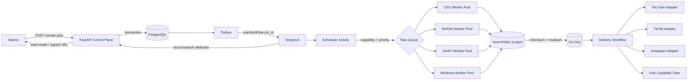
```mermaid
flowchart LR
    C[İstemci] -->|POST /render-jobs| API[FastAPI Control Plane]
    API -->|transaction| PG[(PostgreSQL)]
    PG --> OB[Outbox]
    OB -->|startWorkflow job_id| T[Temporal]
    T --> S[Scheduler Activity]
    S -->|capability + priority| Q{Task Queue}
    Q --> CPU[CPU Worker Pool]
    Q --> NV[NVIDIA Worker Pool]
    Q --> VA[VAAPI Worker Pool]
    Q --> WIN[Windows Worker Pool]
    CPU --> NVME[(Yerel NVMe Scratch)]
    NV --> NVME
    VA --> NVME
    WIN --> NVME
    NVME -->|checksum + multipart| S3[(S3 CAS)]
    S3 --> D[Delivery Workflow]
    D --> YT[YouTube Adapter]
    D --> TT[TikTok Adapter]
    D --> IG[Instagram Adapter]
    D --> KK[Kick Capability Gate]
    T -->|durum/search attributes| API
    API -->|read model / signed URL| C
```

### Uçtan Uca İş Akışı

1. FastAPI isteği doğrular, tenant kotası ve admission policy için hızlı ön kontrol yapar; `render_job`, ilk `job_attempt` ve outbox kaydını aynı PostgreSQL transaction'ında oluşturur.
2. Outbox relay, `workflow_id=render:{tenant_id}:{job_id}` ile Temporal workflow başlatır. Aynı kimlikle yinelenen başlatma yeni iş üretmez.
3. Workflow render graph'ı deterministik biçimde oluşturur, capability gereksinimlerini çıkarır ve activity'leri `render.cpu`, `render.nvidia`, `render.vaapi`, `render.windows` gibi task queue'lara yollar.
4. Worker önce S3 CAS girdilerini checksum doğrulayarak NVMe workspace'e materialize eder; ara çıktıları workspace manifestine atomik olarak kaydeder.
5. Bağımsız graph düğümleri paralel, bağımlı düğümler topolojik sırada çalışır. Transition sınırları kontrollü overlap ile render edilir; concat sırası graph tarafından sabitlenir.
6. Final artifact önce geçici anahtara multipart yüklenir, checksum doğrulanır, ardından CAS anahtarında görünür kılınır. PostgreSQL artifact kaydı ve outbox olayı transaction ile tamamlanır.
7. Teslimat workflow'u hedef platform adapter'ının canlı capability sonucunu değerlendirir; OAuth secret'larını Vault/KMS üzerinden kısa ömürlü olarak alır, resumable upload yapar ve platform processing durumunu terminal hale gelene kadar izler.
8. İptal, heartbeat kaybı, worker ölümü veya platform kesintisi Temporal history ve kalıcı checkpoint'lerden devam ettirilir. Scratch kaybı kabul edilir; doğrulanmış S3 girdileri ve deterministik plan üzerinden yeniden üretilir.

### Sistem Geneli Invariant'lar

- `job_id`, `artifact_id`, `delivery_id` ve Temporal `workflow_id` tenant kapsamında benzersizdir.
- Bir render veya teslimat komutu en az bir kez çalışabilir; dış dünyadaki etkisi idempotency key, CAS checksum, platform remote ID ve compare-and-set durum geçişleriyle en fazla bir kez görünür olur.
- PostgreSQL medya byte'ı taşımaz; yalnız metadata, audit, lease, outbox ve referans taşır.
- NVMe scratch hiçbir zaman tek kalıcı kopya değildir; pod veya node kaybında yeniden üretilebilir.
- Bir artifact `READY` olmadan delivery'ye açılamaz; `READY`, checksum doğrulaması ve metadata commit'inden sonra verilir.
- OAuth access/refresh token'ları log, Temporal payload veya PostgreSQL düz metninde bulunmaz; Vault/KMS referansı ve redacted hata bilgisi saklanır.
- Workflow kodu deterministik kalır; ağ, saat, rastgelelik ve veritabanı erişimi activity içinde yapılır.
- Queue ayrımı yalnız performans tercihi değildir; codec, işletim sistemi, GPU, sürücü ve lisans capability sözleşmesidir.

## Hedef Dosya ve Klasör Organizasyonu

```text
video-engine/
├── api/
│   ├── routers/render_jobs.py
│   ├── routers/deliveries.py
│   └── schemas/{jobs,artifacts,deliveries}.py
├── orchestration/
│   ├── workflows/{render,delivery,cleanup}.py
│   ├── activities/{schedule,render,storage,upload}.py
│   ├── retry_policies.py
│   └── task_queues.py
├── execution/
│   ├── scheduler/{admission,fairness,capabilities}.py
│   ├── workers/{cpu,nvidia,vaapi,windows}.py
│   ├── render_graph/{model,planner,concat}.py
│   └── scratch/{workspace,manifest,cleanup}.py
├── storage/
│   ├── cas.py
│   ├── multipart.py
│   ├── signed_urls.py
│   └── lifecycle.py
├── delivery/
│   ├── contracts/{base,capabilities,errors}.py
│   ├── youtube/adapter.py
│   ├── tiktok/adapter.py
│   ├── instagram/adapter.py
│   └── kick/adapter.py
├── persistence/
│   ├── models/{job,attempt,artifact,delivery,outbox}.py
│   └── repositories/
├── deploy/
│   ├── kubernetes/{api,workers,autoscaling}.yaml
│   └── temporal/worker-config.yaml
└── tests/
    ├── unit/
    ├── integration/
    ├── contract/platforms/
    ├── failure_injection/
    └── benchmark/
```

## 46. Geçici Dosya Yönetimi

### Çalışma Modeli ve Invariant'lar

Her activity attempt için worker'ın yerel NVMe diskinde `/scratch/{tenant_hash}/{job_id}/{attempt_id}/` altında izole bir workspace açılır. Workspace'in tek otoritesi `workspace.manifest.json` dosyasıdır. Manifest; girdi CAS anahtarlarını, yerel göreli yolları, byte boyutlarını, checksum'ları, üretici graph node'unu, tamamlanma durumunu ve cleanup lease bilgisini içerir.

- Tüm manifest yolları workspace köküne göre normalize edilmiş göreli yoldur; mutlak yol, `..`, symlink traversal ve device path reddedilir.
- Yazım önce aynı filesystem üzerindeki `*.partial-{uuid}` dosyasına yapılır; `fsync(file)`, checksum doğrulama, `fsync(directory)` ve atomic rename sonrasında manifest girdisi `COMMITTED` olur.
- Manifest güncellemesi temp manifest + atomic rename ile yapılır; yarım JSON hiçbir zaman geçerli kabul edilmez.
- Workspace ve tenant için soft/hard byte ve inode kotası uygulanır. Hard kota aşımı yeni node admission'ını durdurur; aktif finalizasyon için ayrılmış emergency headroom kullanılır.
- Cleanup yalnız süresi dolmuş lease, terminal workflow veya doğrulanmış orphan kararıyla yapılır. Çalışan attempt heartbeat ile lease'i yeniler.
- Secret, OAuth token ve signed URL query string'i dosya adına veya manifest metadata'sına yazılmaz.

### Neden

Video işleme yoğun sıralı I/O, seek ve ara frame üretir. S3'ü scratch filesystem gibi kullanmak latency, request maliyeti ve küçük nesne patlaması doğurur. Yerel NVMe yüksek throughput sağlar; manifest ve CAS referansları ise pod ölümü sonrası neyin yeniden üretileceğini açıklar. Atomic commit, FFmpeg'in yarım çıktısının başarılı artifact sanılmasını önler.

### Alternatifler ve Trade-off'lar

| Seçenek | Karar | Trade-off |
|---|---|---|
| Kubernetes `emptyDir` + NVMe node pool | Varsayılan | Çok hızlı; node kaybında veri kaybolur, yeniden render gerekir. |
| PVC/RWX scratch | Özel uzun işler için | Daha dayanıklı; ağ I/O'su ve contention render süresini artırır. |
| Doğrudan S3 ara çıktı | Varsayılan değil | Dayanıklı; request/egress maliyeti ve yüksek latency. |
| RAM disk | Yalnız küçük frame/cache | En hızlı; bellek baskısı ve OOM riski. |

### Veri Akışı

`WorkspaceManager.create` kota rezervasyonu yapar, manifesti `OPEN` yazar ve lease alır. `materialize` S3 nesnesini `.partial` dosyasına stream eder; checksum eşleşirse rename eder. Render node'u yeni çıktıyı temp dosyada üretir, probe/checksum sonrasında commit eder. Final artifact S3'e yüklendikten sonra manifest `SEALED`; workflow terminal olduğunda `RELEASABLE` olur. Cleanup controller lease'i CAS ile sahiplenip dosyaları siler ve rezervasyonu bırakır.

### API / Interface / Model Örneği

```python
class WorkspaceEntry(BaseModel):
    logical_name: str
    relative_path: str
    sha256: str | None = None
    size_bytes: int = 0
    producer_node_id: str | None = None
    state: Literal["ALLOCATED", "WRITING", "COMMITTED", "UPLOADED"]

class WorkspaceManifest(BaseModel):
    schema_version: int
    tenant_id: UUID
    job_id: UUID
    attempt_id: UUID
    lease_owner: str
    lease_expires_at: datetime
    quota_reserved_bytes: int
    entries: list[WorkspaceEntry]

class WorkspaceManager(Protocol):
    async def create(self, job: RenderJob, estimate_bytes: int) -> WorkspaceManifest: ...
    async def materialize(self, cas_key: str, expected_sha256: str) -> Path: ...
    async def commit(self, temp_path: Path, logical_name: str) -> WorkspaceEntry: ...
    async def renew_lease(self, attempt_id: UUID) -> None: ...
    async def release(self, attempt_id: UUID) -> None: ...
```

### Dosya / Klasör Organizasyonu

```text
/scratch/<tenant_hash>/<job_id>/<attempt_id>/
├── workspace.manifest.json
├── workspace.manifest.json.prev
├── inputs/<sha256>/source.mp4
├── graph/<node_id>/output.partial-<uuid>
├── graph/<node_id>/output.mp4
├── concat/segments.txt
└── logs/ffmpeg.stderr.redacted.log
```

Kod sahipliği `execution/scratch/`; Kubernetes volume, mount options ve disk pressure ayarları `deploy/kubernetes/workers/` altındadır.

### Render Pipeline Bağlantısı

Planner her render graph node'u için tahmini scratch byte değerini üretir. Scheduler bu tahmini node allocatable ephemeral storage ile karşılaştırır. Worker, node başlamadan girdileri materialize eder; output commit edilmeden downstream node hazır sayılmaz. Final concat sonucu storage activity'ye yalnız `COMMITTED` manifest girdisi olarak geçer.

### Sequence Diagram

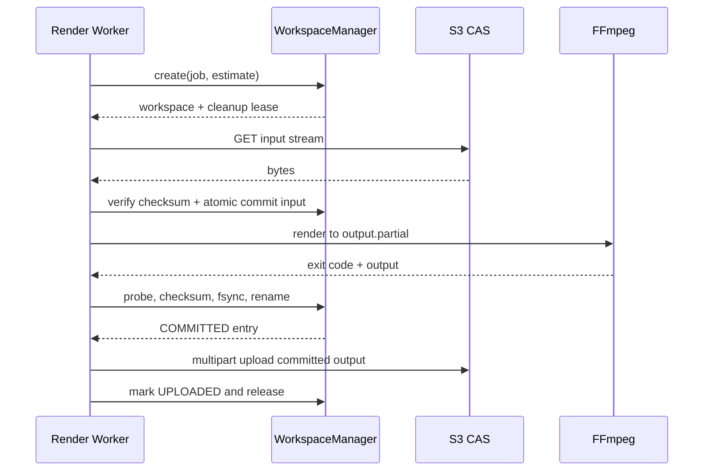
```mermaid
sequenceDiagram
    participant W as Render Worker
    participant M as WorkspaceManager
    participant S as S3 CAS
    participant F as FFmpeg
    W->>M: create(job, estimate)
    M-->>W: workspace + cleanup lease
    W->>S: GET input stream
    S-->>W: bytes
    W->>M: verify checksum + atomic commit input
    W->>F: render to output.partial
    F-->>W: exit code + output
    W->>M: probe, checksum, fsync, rename
    M-->>W: COMMITTED entry
    W->>S: multipart upload committed output
    W->>M: mark UPLOADED and release
```

### Class Diagram

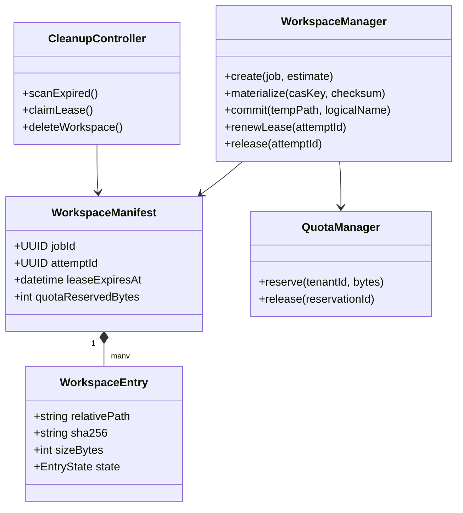
```mermaid
classDiagram
    class WorkspaceManager {
      +create(job, estimate)
      +materialize(casKey, checksum)
      +commit(tempPath, logicalName)
      +renewLease(attemptId)
      +release(attemptId)
    }
    class WorkspaceManifest {
      +UUID jobId
      +UUID attemptId
      +datetime leaseExpiresAt
      +int quotaReservedBytes
    }
    class WorkspaceEntry {
      +string relativePath
      +string sha256
      +int sizeBytes
      +EntryState state
    }
    class QuotaManager {
      +reserve(tenantId, bytes)
      +release(reservationId)
    }
    class CleanupController {
      +scanExpired()
      +claimLease()
      +deleteWorkspace()
    }
    WorkspaceManager --> WorkspaceManifest
    WorkspaceManifest "1" *-- "many" WorkspaceEntry
    WorkspaceManager --> QuotaManager
    CleanupController --> WorkspaceManifest
```

### State Machine

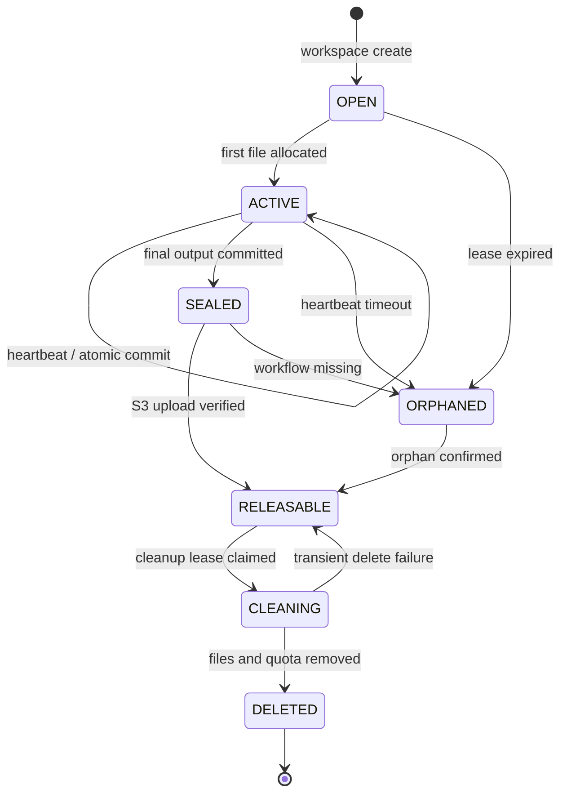
```mermaid
stateDiagram-v2
    [*] --> OPEN: workspace create
    OPEN --> ACTIVE: first file allocated
    ACTIVE --> ACTIVE: heartbeat / atomic commit
    ACTIVE --> SEALED: final output committed
    SEALED --> RELEASABLE: S3 upload verified
    OPEN --> ORPHANED: lease expired
    ACTIVE --> ORPHANED: heartbeat timeout
    SEALED --> ORPHANED: workflow missing
    ORPHANED --> RELEASABLE: orphan confirmed
    RELEASABLE --> CLEANING: cleanup lease claimed
    CLEANING --> DELETED: files and quota removed
    CLEANING --> RELEASABLE: transient delete failure
    DELETED --> [*]
```

### Production Problemleri

- Node disk pressure eviction, inode tükenmesi, FFmpeg'in beklenenden büyük ara dosya üretmesi.
- Symlink/path traversal, Windows reserved path ve case-insensitive collision.
- Container kill sırasında manifest ile dosya arasında kısa tutarsızlık.
- Aynı job retry'larının aynı workspace'i paylaşması halinde veri yarışı; bu nedenle attempt izolasyonu zorunludur.
- Antivirüs veya indexer'ın Windows worker'da rename/delete işlemini kilitlemesi.
- Cleanup controller clock skew; lease değerlendirmesi DB/Temporal zamanı ve güvenlik payıyla yapılır.

### Recovery, Retry ve Idempotency

Workspace create `attempt_id` ile idempotenttir. Aynı attempt tekrar açılırsa manifest doğrulanır; checksum'u doğru `COMMITTED` girdiler yeniden kullanılır, `WRITING` girdiler silinip yeniden üretilir. Cleanup delete işlemi dosya yoksa başarılı sayılır. Lease sahipliği PostgreSQL compare-and-set ile alınır. Pod kaybında workflow yeni attempt açar; eski workspace orphan TTL sonrasında temizlenir. Scratch checksum uyuşmazlığı retry edilebilir veri transfer hatasıdır; aynı kaynaktan tekrarlayan uyuşmazlık kalıcı/corrupt-input sınıfına yükseltilir.

### Performans ve Benchmark

- Hedef: sıralı write/read p95 en az `1 GiB/s`, küçük manifest operasyonu p95 `< 20 ms`, atomic commit p99 `< 100 ms`.
- Scratch kullanımında normal high-watermark `< %70`, admission throttle `%80`, hard reject `%90`; kalan alan finalizasyon ve cleanup için ayrılır.
- Benchmark: gerçek codec dağılımıyla 4K/1080p render, `fio` sequential/mixed profil, eşzamanlı 1/4/8 job, cold/warm materialization ve pod-kill testi.
- Metrikler: `scratch_bytes_used`, `scratch_reserved_bytes`, inode oranı, materialize throughput, checksum CPU süresi, orphan workspace sayısı/yaşı, cleanup latency, ENOSPC sayısı.
- Eşik: checksum başarısızlığı `< 10^-6 artifact`, 24 saatten yaşlı orphan `0`, quota kaynaklı başarısız job `< %0,1`; aşım autoscaling veya kapasite incident'ı açar.

### Gerçek Dünya Senaryosu

60 dakikalık 4K kayıttan dikey klip üreten NVIDIA worker, 18 GiB giriş ve 45 GiB peak scratch tahminiyle yerleştirilir. Node'da yalnız 40 GiB güvenli alan varsa scheduler işi başlatmaz. Render sırasında pod öldüğünde S3'teki kaynak korunur; yeni attempt başka node'da temiz workspace açar. Eski 31 GiB workspace lease dolunca cleanup controller tarafından silinir.

### Ölçeklenme ve Backpressure

Scheduler yalnız disk rezervasyonu yapılabilen işi worker'a verir. Kubelet ephemeral-storage request/limit, tenant scratch kotası ve queue admission birlikte çalışır. Cleanup gecikmesi high-watermark'i yükselttiğinde yeni düşük öncelikli işler durdurulur; aktif işlerin commit alanı korunur. Materialization için tenant ve node başına eşzamanlı download semaphore kullanılır.

### Ownership ve Test

**Sahip:** Media Execution ekibi; volume ve node pressure için Platform/SRE ortak sahibi.  
**Testler:** path fuzzing, symlink escape, atomic rename crash testleri, quota concurrency, manifest schema migration, disk-full injection, SIGKILL sonrası orphan cleanup, Windows lock davranışı, checksum corruption ve 24 saatlik soak. SLO ve cleanup alarmları SRE runbook'una bağlıdır.

## 47. Render Kuyruğu

### Çalışma Modeli ve Invariant'lar

Temporal task queue'ları durable iş dağıtım katmanıdır. PostgreSQL'deki `render_job` kullanıcıya dönük read model ve audit kaydıdır; bağımsız bir broker kuyruğu değildir. Kuyruk isimleri capability ve deployment ring içerir: `render.cpu.v1`, `render.nvidia.av1.v1`, `render.vaapi.h264.v1`, `render.windows.mediafoundation.v1`. Worker yalnız gerçekten sağladığı capability queue'sunu poll eder.

- Bir task queue içinde FIFO garantisine dayanılmaz; öncelik ve fairness scheduler admission katmanında uygulanır.
- Her job için tenant, priority class, deadline, cost estimate ve capability set zorunludur.
- Aynı job state geçişi PostgreSQL'de monoton version ile compare-and-set yapılır.
- Queue mesajı medya byte'ı veya secret taşımaz; kimlik, CAS referansı ve sürümlenmiş render spec taşır.
- Celery yalnız migration alternatifi olarak tutulur; yeni tasarımda Temporal history, cancellation, retry ve child workflow semantiği esas alınır. İki motor aynı job üzerinde eşzamanlı otorite olamaz.

### Neden

Render görevleri dakikalar/saatler sürer, worker kaybına açıktır ve çok aşamalı checkpoint ister. Temporal durable timer, heartbeat, cancellation ve workflow replay sağlar. Capability-specific queue, NVIDIA komutunun CPU worker'da veya Windows-only filtrenin Linux worker'da başlamasını engeller.

### Alternatifler ve Trade-off'lar

| Seçenek | Karar | Trade-off |
|---|---|---|
| Temporal task queue | Ana çözüm | Güçlü durability; workflow determinism ve operasyonel uzmanlık gerekir. |
| Celery + Redis/RabbitMQ | Sadece kontrollü migration köprüsü | Mevcut ekosistem kolaylığı; uzun workflow, exactly-once görünür etki ve history için ek kod gerekir. |
| Kafka job log'u | Event dağıtımı/outbox downstream için | Partition ordering güçlü; worker leasing ve workflow orchestration tek başına yeterli değil. |
| PostgreSQL `SKIP LOCKED` | Küçük kurulumda geçici | Basit; yüksek polling, timer ve retry semantiği sınırlı. |

### Veri Akışı

FastAPI transaction'ı job ve outbox oluşturur. Relay Temporal workflow'u başlatır. Admission controller tenant token'ı ve global kapasiteyi ayırır. Scheduler capability setini canonical forma getirip uygun queue'yu seçer. Temporal activity task'ı queue'da bekler; worker poll edip heartbeat ile çalıştırır. Sonuç workflow'a, projection activity aracılığıyla PostgreSQL'e ve outbox ile event tüketicilerine yansır.

### API / Interface / Model Örneği

```python
class RenderTaskEnvelope(BaseModel):
    schema_version: int = 1
    job_id: UUID
    tenant_id: UUID
    graph_node_id: str
    priority: Literal["interactive", "standard", "batch"]
    deadline_at: datetime | None
    required_capabilities: frozenset[str]
    input_artifacts: list[str]
    render_spec_ref: str
    idempotency_key: str

class QueueRouter(Protocol):
    def route(self, task: RenderTaskEnvelope, inventory: CapabilityInventory) -> str: ...

@router.post("/v1/render-jobs", status_code=202)
async def create_render_job(
    request: CreateRenderJob,
    idempotency_key: Annotated[str, Header()],
) -> RenderJobAccepted: ...
```

### Dosya / Klasör Organizasyonu

`orchestration/task_queues.py` canonical queue adlarını; `execution/scheduler/capabilities.py` eşleştirmeyi; `api/routers/render_jobs.py` submission'ı; `persistence/models/job.py` read modelini; `deploy/temporal/worker-config.yaml` poller dağılımını taşır. Celery adapter varsa `migration/celery_bridge/` altında ve feature flag arkasında izole edilir.

### Render Pipeline Bağlantısı

Render graph'ın her executable node'u ayrı task envelope'a dönüşebilir. Planner codec/filter gereksinimini capability setine çevirir. Queue sonucu node attempt'ini belirler; downstream node yalnız upstream artifact commit sinyaliyle ready olur. Final concat ayrı capability gerektiriyorsa farklı queue'ya taşınabilir.

### Sequence Diagram

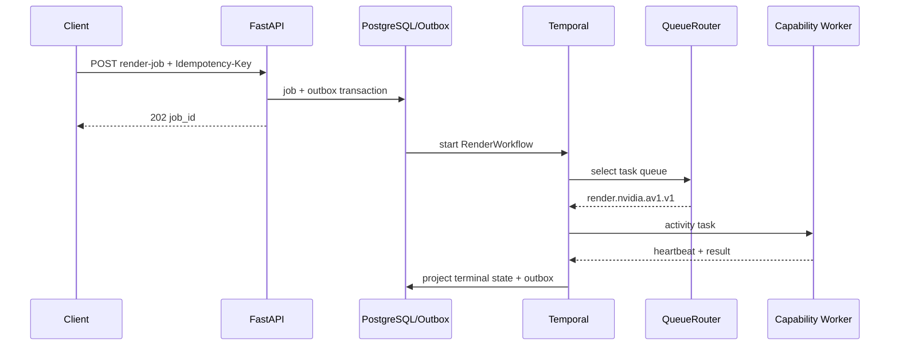
```mermaid
sequenceDiagram
    participant C as Client
    participant A as FastAPI
    participant P as PostgreSQL/Outbox
    participant T as Temporal
    participant R as QueueRouter
    participant W as Capability Worker
    C->>A: POST render-job + Idempotency-Key
    A->>P: job + outbox transaction
    A-->>C: 202 job_id
    P->>T: start RenderWorkflow
    T->>R: select task queue
    R-->>T: render.nvidia.av1.v1
    T->>W: activity task
    W-->>T: heartbeat + result
    T->>P: project terminal state + outbox
```

### Class Diagram

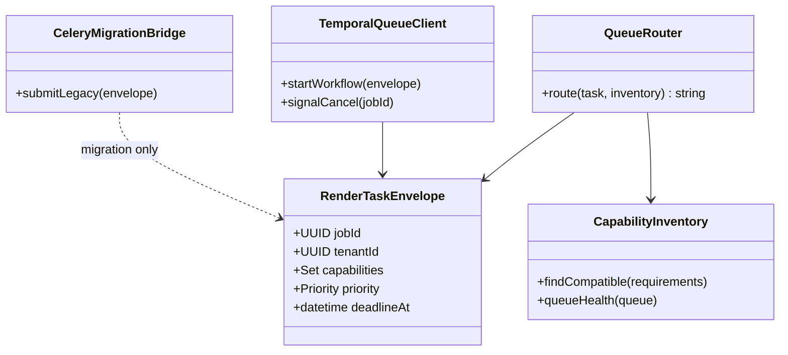
```mermaid
classDiagram
    class RenderTaskEnvelope {
      +UUID jobId
      +UUID tenantId
      +Set capabilities
      +Priority priority
      +datetime deadlineAt
    }
    class QueueRouter {
      +route(task, inventory) string
    }
    class CapabilityInventory {
      +findCompatible(requirements)
      +queueHealth(queue)
    }
    class TemporalQueueClient {
      +startWorkflow(envelope)
      +signalCancel(jobId)
    }
    class CeleryMigrationBridge {
      +submitLegacy(envelope)
    }
    QueueRouter --> RenderTaskEnvelope
    QueueRouter --> CapabilityInventory
    TemporalQueueClient --> RenderTaskEnvelope
    CeleryMigrationBridge ..> RenderTaskEnvelope : migration only
```

### State Machine

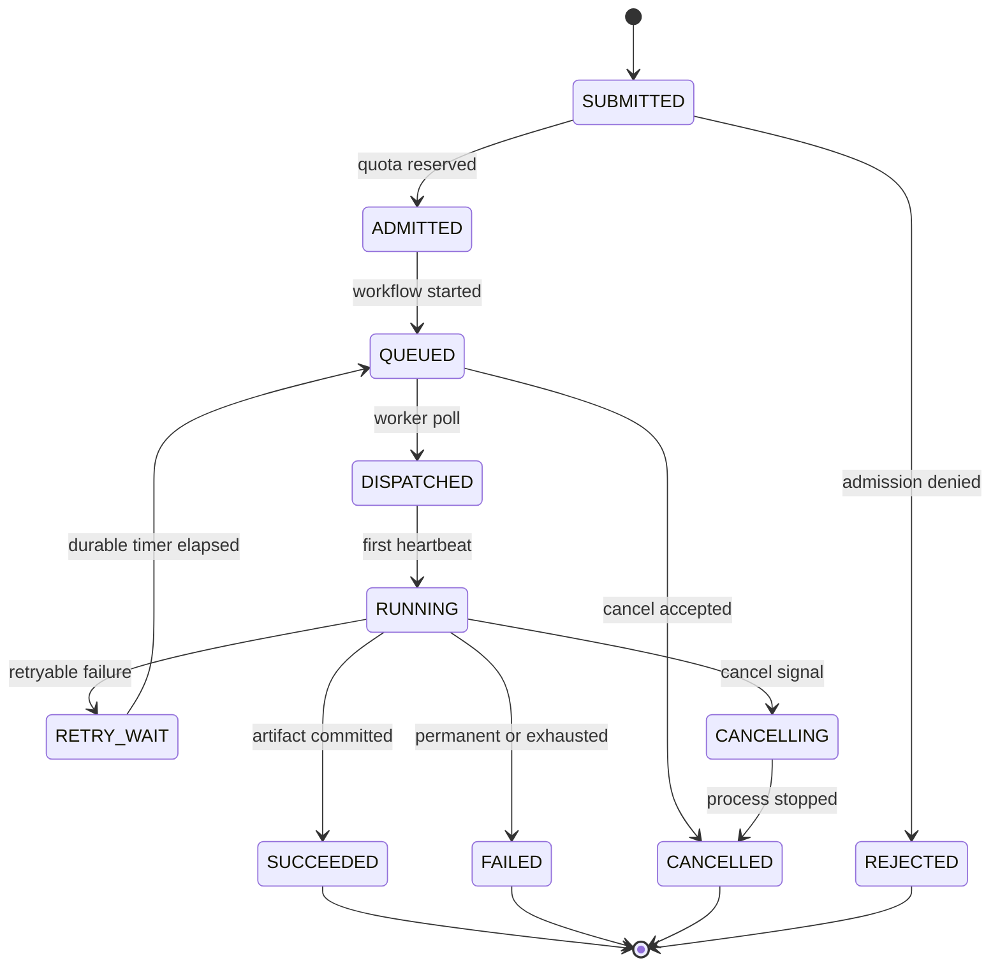
```mermaid
stateDiagram-v2
    [*] --> SUBMITTED
    SUBMITTED --> ADMITTED: quota reserved
    SUBMITTED --> REJECTED: admission denied
    ADMITTED --> QUEUED: workflow started
    QUEUED --> DISPATCHED: worker poll
    DISPATCHED --> RUNNING: first heartbeat
    RUNNING --> SUCCEEDED: artifact committed
    RUNNING --> RETRY_WAIT: retryable failure
    RETRY_WAIT --> QUEUED: durable timer elapsed
    QUEUED --> CANCELLED: cancel accepted
    RUNNING --> CANCELLING: cancel signal
    CANCELLING --> CANCELLED: process stopped
    RUNNING --> FAILED: permanent or exhausted
    SUCCEEDED --> [*]
    FAILED --> [*]
    CANCELLED --> [*]
    REJECTED --> [*]
```

### Production Problemleri

- Yanlış capability ilanı nedeniyle codec init failure; worker startup self-test zorunludur.
- Queue hot-spot, interactive işlerin batch arkasında kalması, tenant'ın tüm poller kapasitesini tüketmesi.
- Workflow başlatılmış fakat PostgreSQL projection gecikmiş olabilir; API Temporal query yerine read model + lag göstergesi sunar.
- Temporal payload büyümesi/history şişmesi; büyük spec S3/PostgreSQL referansı olarak taşınır ve continue-as-new kullanılır.
- Celery migration sırasında duplicate ownership; engine seçimi job create transaction'ında immutable kaydedilir.

### Recovery, Retry ve Idempotency

Outbox relay aynı `workflow_id` ile tekrar start edebilir; already-started başarılı kabul edilir. Activity idempotency key `job_id:node_id:spec_hash` biçimindedir. Worker sonucu CAS artifact varsa probe/checksum ile yeniden kullanır. Queue route kararı workflow history'sine kaydedilir; retry'da uyumsuz queue değişimi yalnız versioned workflow migration veya açık reschedule komutuyla yapılır. Poison job ayrı durumda karantinaya alınır, otomatik sonsuz retry yapılmaz.

### Performans ve Benchmark

- Submission API p95 `< 150 ms`, outbox-to-workflow p95 `< 2 s`, admitted-to-first-poll p95 interactive `< 5 s`, standard `< 60 s` hedeflenir.
- Benchmark: 100 bin bekleyen job, burst submission, dört capability pool'u, worker churn ve Temporal shard yük testi.
- Metrikler: queue schedule-to-start latency, task throughput, poll success, backlog age, priority/tenant bazında wait time, workflow start error, projection lag.
- Eşik: interactive queue en yaşlı task `> 30 s` veya p95 `> 5 s` ise autoscale; capability queue'da sağlıklı poller `0` ise admission kapatılır; outbox lag `> 30 s` incident üretir.

### Gerçek Dünya Senaryosu

Bir tenant AV1/NVENC isteyen 200 batch iş gönderirken başka tenant tek bir interactive H.264 preview ister. Admission, batch işlerini tenant kotasına göre sınırlar; preview `interactive` sınıfında ayrı scheduler lane üzerinden sağlıklı NVIDIA queue'suna girer ve batch backlog'u tarafından bloke edilmez.

### Ölçeklenme ve Backpressure

Backpressure katmanları sırasıyla API admission, tenant token bucket, scheduler concurrency lease, queue backlog yaşı ve Kubernetes autoscaling'dir. Queue uzunluğu tek başına ölçek metriği değildir; estimated GPU-seconds ve schedule-to-start latency kullanılır. Queue poller sayısı Temporal servis limitleriyle birlikte ayarlanır. Uygun worker yoksa job `BLOCKED_CAPABILITY` olur; yanlış queue'ya düşürülmez.

### Ownership ve Test

**Sahip:** Orchestration ekibi; Temporal cluster için Platform/SRE.  
**Testler:** duplicate submit, outbox replay, capability matrix, queue outage, priority inversion, tenant fairness, cancellation, Temporal replay determinism, continue-as-new, Celery migration ownership ve 100 bin job load testi.

## 48. Worker Pool

### Çalışma Modeli ve Invariant'lar

Worker pool'ları homojen capability sınıflarıdır: genel CPU, NVIDIA GPU, Linux VAAPI ve Windows-native codec/filter. Her Kubernetes deployment yalnız kendi task queue'larını poll eder. Worker startup sırasında FFmpeg build, codec encode/decode, driver/runtime, GPU memory ve scratch write self-test yapar; sonuç capability inventory'ye lease'li olarak yayımlanır.

- İlan edilen capability test edilmeden `READY` olunmaz.
- Bir worker'ın concurrency değeri CPU core sayısından değil, ölçülmüş codec/GPU/scratch kapasitesinden türetilir.
- Her activity child process/process group içinde çalışır; cancellation tüm alt süreçlere yayılır.
- Worker stateless kabul edilir; yalnız activity süresince workspace ve heartbeat checkpoint'i taşır.
- NVIDIA, VAAPI ve Windows pool'ları birbirinin sessiz fallback'i değildir. Fallback render spec'in kalite/determinism politikası izin veriyorsa scheduler tarafından açıkça seçilir.

### Neden

Codec ve filtre desteği yalnız işletim sistemi etiketiyle belirlenemez; FFmpeg build flag, sürücü, GPU modeli, encoder session limiti ve lisans koşulu etkiler. Homojen pool ve self-test, runtime sürprizini admission zamanına taşır. Kubernetes node selector/taint ile fiziksel kaynak, Temporal queue ile mantıksal capability birlikte korunur.

### Alternatifler ve Trade-off'lar

| Seçenek | Karar | Trade-off |
|---|---|---|
| Ayrı deployment ve queue | Varsayılan | İzolasyon güçlü; deployment sayısı artar. |
| Tek universal image | CPU araçlarında sınırlı | Basit dağıtım; image büyük, driver/OS kombinasyonları kırılgan. |
| Worker başına bir job | Ağır GPU işlerinde | İzolasyon ve tahmin kolay; utilization düşük olabilir. |
| Dinamik multi-job worker | CPU/hafif işlerde | Utilization yüksek; noisy-neighbor ve OOM riski. |

### Veri Akışı

Pod başlar, self-test çalışır, capability lease yayınlar ve Temporal queue poll etmeye başlar. Task alındığında tenant/job context, Vault identity ve scratch reservation hazırlanır. Worker input'ları materialize eder, FFmpeg'i resource limitleriyle başlatır, heartbeat'e frame/progress/checkpoint yazar. Çıktı S3'e commit edilince lease'ler bırakılır; pod draining ise yeni task poll etmez.

### API / Interface / Model Örneği

```python
class WorkerCapability(BaseModel):
    worker_id: str
    pool: Literal["cpu", "nvidia", "vaapi", "windows"]
    codecs: set[str]
    filters: set[str]
    max_width: int
    max_height: int
    gpu_memory_mb: int | None
    ffmpeg_build_hash: str
    lease_expires_at: datetime

class WorkerRuntime(Protocol):
    async def self_test(self) -> WorkerCapability: ...
    async def execute(self, task: RenderTaskEnvelope, heartbeat: Heartbeat) -> ArtifactRef: ...
    async def cancel(self, attempt_id: UUID, grace_seconds: int) -> None: ...
    async def drain(self) -> None: ...
```

### Dosya / Klasör Organizasyonu

`execution/workers/base.py` yaşam döngüsünü; `cpu.py`, `nvidia.py`, `vaapi.py`, `windows.py` capability probe ve komut kurulumunu; `deploy/kubernetes/workers/` deployment, taint/toleration ve device plugin ayarlarını; `tests/integration/workers/` golden media testlerini içerir.

### Render Pipeline Bağlantısı

Planner graph node requirement'ını capability inventory ile kesiştirir. Worker, spec hash ile birlikte gerçek FFmpeg build hash'ini attempt metadata'sına yazar. Böylece kalite farkı, cache reuse ve incident analizi yapılabilir. Downstream concat farklı encoder gerektirmiyorsa aynı pool'a affinity verilebilir; fakat scratch locality correctness koşulu değildir.

### Sequence Diagram

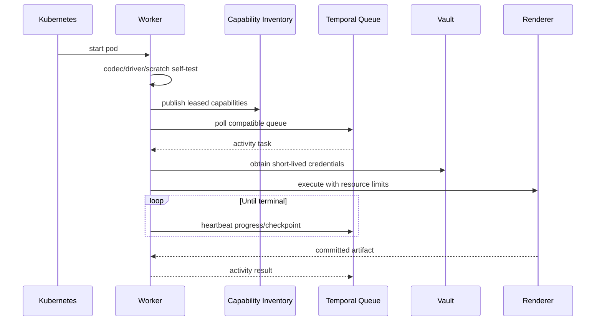
```mermaid
sequenceDiagram
    participant K as Kubernetes
    participant W as Worker
    participant I as Capability Inventory
    participant T as Temporal Queue
    participant V as Vault
    participant R as Renderer
    K->>W: start pod
    W->>W: codec/driver/scratch self-test
    W->>I: publish leased capabilities
    W->>T: poll compatible queue
    T-->>W: activity task
    W->>V: obtain short-lived credentials
    W->>R: execute with resource limits
    loop Until terminal
      W->>T: heartbeat progress/checkpoint
    end
    R-->>W: committed artifact
    W-->>T: activity result
```

### Class Diagram

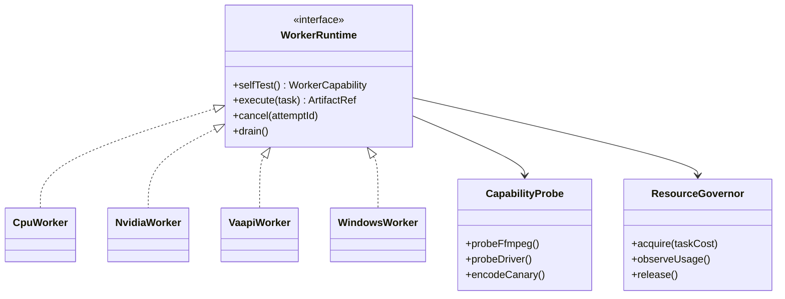
```mermaid
classDiagram
    class WorkerRuntime {
      <<interface>>
      +selfTest() WorkerCapability
      +execute(task) ArtifactRef
      +cancel(attemptId)
      +drain()
    }
    class CpuWorker
    class NvidiaWorker
    class VaapiWorker
    class WindowsWorker
    class CapabilityProbe {
      +probeFfmpeg()
      +probeDriver()
      +encodeCanary()
    }
    class ResourceGovernor {
      +acquire(taskCost)
      +observeUsage()
      +release()
    }
    WorkerRuntime <|.. CpuWorker
    WorkerRuntime <|.. NvidiaWorker
    WorkerRuntime <|.. VaapiWorker
    WorkerRuntime <|.. WindowsWorker
    WorkerRuntime --> CapabilityProbe
    WorkerRuntime --> ResourceGovernor
```

### State Machine

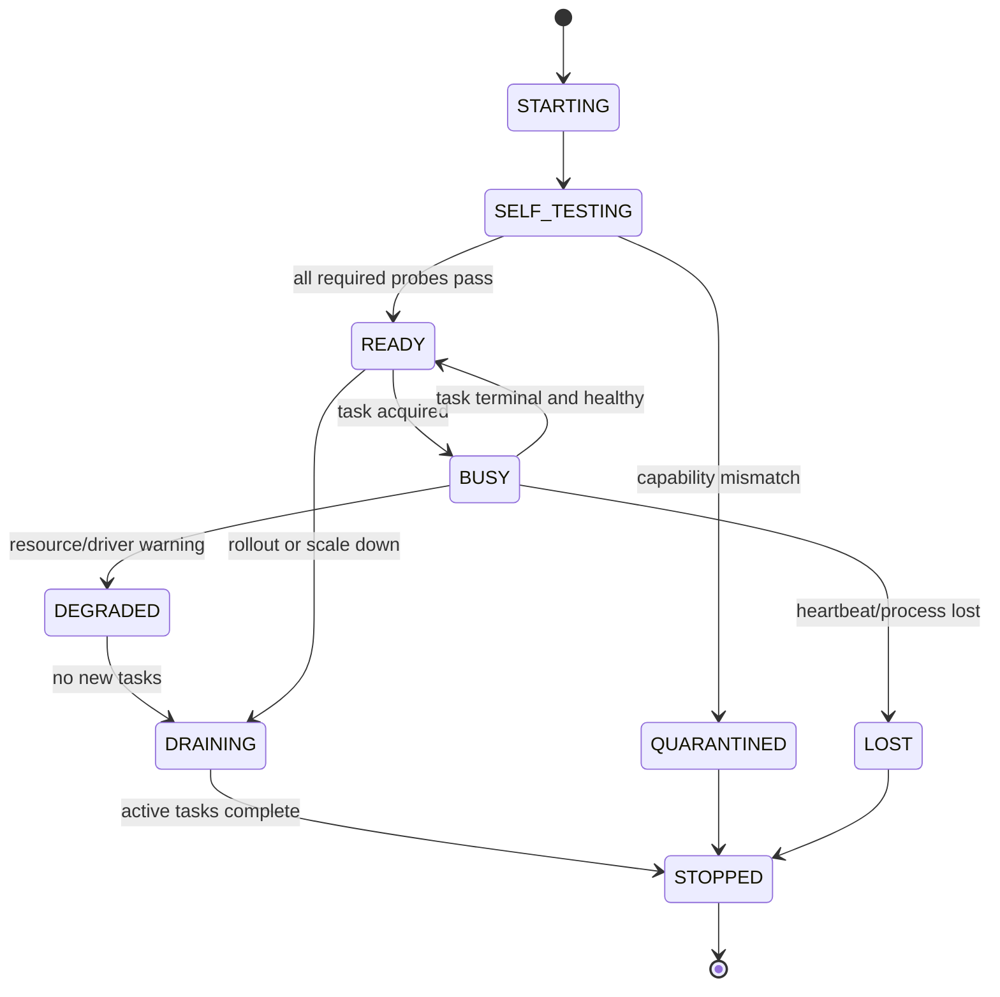
```mermaid
stateDiagram-v2
    [*] --> STARTING
    STARTING --> SELF_TESTING
    SELF_TESTING --> READY: all required probes pass
    SELF_TESTING --> QUARANTINED: capability mismatch
    READY --> BUSY: task acquired
    BUSY --> READY: task terminal and healthy
    BUSY --> DEGRADED: resource/driver warning
    DEGRADED --> DRAINING: no new tasks
    READY --> DRAINING: rollout or scale down
    DRAINING --> STOPPED: active tasks complete
    BUSY --> LOST: heartbeat/process lost
    QUARANTINED --> STOPPED
    LOST --> STOPPED
    STOPPED --> [*]
```

### Production Problemleri

- GPU driver reset, encoder session exhaustion, CUDA OOM, VAAPI device permission hatası.
- Windows process tree cancellation ve dosya lock davranışının Linux'tan farklı olması.
- FFmpeg build drift nedeniyle aynı spec'in farklı çıktı üretmesi.
- Kubernetes preemption/rollout sırasında uzun işin kesilmesi.
- CPU oversubscription, NUMA etkisi, NVMe contention ve GPU'nun decode/encode motorlarından yalnız birinin doyması.

### Recovery, Retry ve Idempotency

Heartbeat timeout activity'yi retry'a açar; eski process'in hâlâ çalışması ihtimaline karşı attempt fencing token output commit sırasında doğrulanır. Worker kaybında scratch yeniden üretilir. Driver reset aynı node'da sınırlı retry sonrası node/pod quarantine doğurur. `ArtifactRef` CAS'ta mevcut ve producer spec/build policy ile uyumluysa retry render etmeden sonucu döndürür. Cancellation idempotenttir; process yoksa başarılı sayılır.

### Performans ve Benchmark

- Pool başına gerçek zaman katsayısı (`render_seconds / media_seconds`), GPU engine utilization, VRAM high-watermark, CPU steal, scratch throughput ve startup self-test süresi ölçülür.
- Hedef: worker hazır olma p95 CPU `< 60 s`, GPU `< 120 s`; OOM `< %0,1 attempt`; utilization steady-state GPU `%65-%90`, CPU `%60-%85`.
- Benchmark matrisi: codec x çözünürlük x fps x filter chain x preset; 1/2/N concurrent job; cold image pull ve warm pod; 30 dakikalık soak.
- Kalite eşikleri: golden çıktıda VMAF/SSIM toleransı, A/V sync sapması `< 20 ms`, frame count ve duration toleransı; hardware/software fallback ayrı baseline kullanır.

### Gerçek Dünya Senaryosu

NVIDIA driver güncellemesi sonrası canary encode başarısız olursa yeni pod `QUARANTINED` kalır ve queue poll etmez. Eski replica'lar işi sürdürür; rollout otomatik durur. Scheduler kapasiteyi eski capability lease'lerinden görür, bu kapasite tükenirse yeni NVIDIA işleri `BLOCKED_CAPABILITY` durumunda bekler veya policy izin veriyorsa CPU fallback planı üretir.

### Ölçeklenme ve Backpressure

KEDA/HPA, Temporal schedule-to-start latency ile estimated resource-seconds backlog'unu birlikte kullanır. GPU node provisioning dakikalar sürebileceği için warm minimum replica tutulur. Worker local semaphore concurrency'yi sınırlar; kube resource limit tek başına yeterli değildir. Drain sırasında poller kapanır, aktif activity heartbeat ve checkpoint ile tamamlanır; deadline yaklaşırsa scheduler admission azaltır.

### Ownership ve Test

**Sahip:** Media Execution; image/driver/device plugin için Platform GPU ekibi; Windows node'ları için Windows Platform sahibi.  
**Testler:** startup canary, codec matrix, driver upgrade canary, cancellation process-tree, preemption, OOM/ENOSPC injection, output golden/VMAF, long-running soak, mixed tenant load ve capability lease expiry.

## 49. Paralel Rendering

### Çalışma Modeli ve Invariant'lar

Render planı bir DAG'dır. Source probe, scene normalization, overlays, audio processing, segment encode, transition ve concat düğümleri açık bağımlılıklar taşır. Bağımsız düğümler paralel yürütülür; output sırası tamamlanma zamanına göre değil `timeline_index` ve canonical graph hash'e göre belirlenir.

- Segment sınırları keyframe/audio sample kurallarına göre planner tarafından sabitlenir.
- Transition'lar için komşu segmentlerden gerekli handle süreleri alınır; overlap iki kez final timeline'a eklenmez.
- Her chunk aynı color space, time base, sample rate, channel layout, codec profile ve extradata sözleşmesini sağlamadan stream-copy concat yapılamaz.
- Deterministic concat listesi yalnız doğrulanmış artifact checksum'larını ve sabit sıralamayı içerir.
- Paralellik graph width, tenant kotası, worker capability ve scratch bütçesinin minimumuyla sınırlıdır.
- Cancellation parent workflow'dan child workflow/activity'lere yayılır; yeni node dispatch'i derhal kesilir.

### Neden

Uzun videoyu tek FFmpeg sürecinde render etmek basit ama tek worker kaybında tüm ilerlemeyi kaybettirir ve GPU'yu ölçeklemeyi sınırlar. DAG/chunk modeli bağımsız sahneleri paralelleştirir, checkpoint ve kısmi retry sağlar. Deterministik concat, paralel tamamlanma sırasının final medyayı değiştirmesini önler.

### Alternatifler ve Trade-off'lar

| Seçenek | Karar | Trade-off |
|---|---|---|
| Scene-aware DAG chunking | Uzun/karmaşık işler | Hız ve recovery güçlü; boundary/transition planı karmaşık. |
| Sabit süreli chunk | Basit codec işlerinde | Planlama kolay; sahne/transition ve GOP sınırları kötü olabilir. |
| Tek süreç render | Kısa kliplerde | Deterministik ve basit; paralellik/recovery zayıf. |
| Frame-level dağıtım | Varsayılan değil | Maksimum paralellik; veri hacmi, ordering ve encoder state maliyeti yüksek. |

### Veri Akışı

Planner immutable render spec'i probe metadata ile birleştirerek DAG üretir. Temporal parent workflow ready-set'i hesaplar ve child workflow/activity'leri limitli paralellikle başlatır. Her node CAS artifact üretir. Transition node'u iki komşu segmentin handle artifact'larını tüketir. Validator teknik parametreleri normalize eder. Concat node'u timeline sırasındaki checksum listesini kullanır, A/V sync ve duration probe yapar, final artifact'i commit eder.

### API / Interface / Model Örneği

```python
class RenderNode(BaseModel):
    node_id: str
    kind: Literal["probe", "segment", "transition", "audio", "concat", "validate"]
    depends_on: tuple[str, ...]
    timeline_index: int | None
    required_capabilities: frozenset[str]
    estimated_cost: ResourceCost
    output_contract: MediaContract

class RenderGraph(BaseModel):
    graph_hash: str
    nodes: tuple[RenderNode, ...]
    max_parallelism: int

class GraphExecutor(Protocol):
    async def execute(self, graph: RenderGraph, cancellation: CancellationToken) -> ArtifactRef: ...
```

### Dosya / Klasör Organizasyonu

`execution/render_graph/model.py` DAG modelini; `planner.py` segment ve transition kurallarını; `executor.py` ready-set yürütmesini; `concat.py` canonical liste ve media contract doğrulamasını; `tests/golden/render_graph/` boundary senaryolarını taşır. Workspace'te her node yalnız `graph/<node_id>/` alanına yazar.

### Render Pipeline Bağlantısı

Bu katman timeline/render-spec ile worker queue arasında köprüdür. Upstream edit/analysis çıktısını executable graph'a dönüştürür, node'ları 47-48'deki queue/pool'a yönlendirir ve 52'deki CAS artifact'lerle checkpoint oluşturur. Final validate düğümü başarılı olmadan delivery workflow tetiklenmez.

### Sequence Diagram

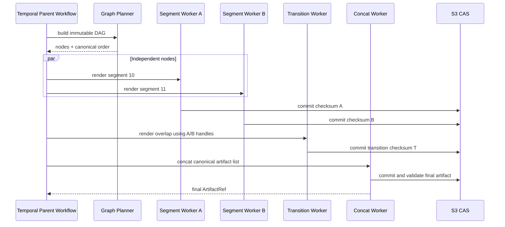
```mermaid
sequenceDiagram
    participant T as Temporal Parent Workflow
    participant P as Graph Planner
    participant W1 as Segment Worker A
    participant W2 as Segment Worker B
    participant X as Transition Worker
    participant C as Concat Worker
    participant S as S3 CAS
    T->>P: build immutable DAG
    P-->>T: nodes + canonical order
    par Independent nodes
      T->>W1: render segment 10
      T->>W2: render segment 11
    end
    W1->>S: commit checksum A
    W2->>S: commit checksum B
    T->>X: render overlap using A/B handles
    X->>S: commit transition checksum T
    T->>C: concat canonical artifact list
    C->>S: commit and validate final artifact
    C-->>T: final ArtifactRef
```

### Class Diagram

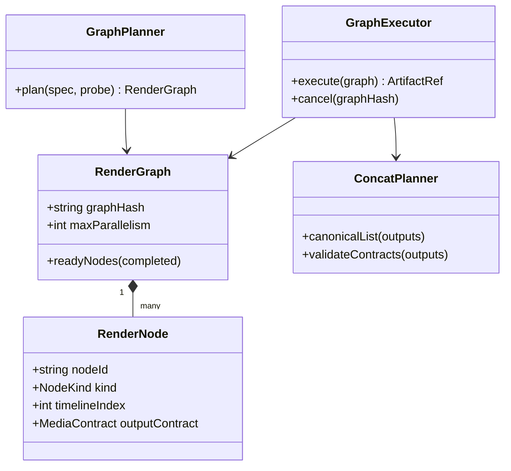
```mermaid
classDiagram
    class RenderGraph {
      +string graphHash
      +int maxParallelism
      +readyNodes(completed)
    }
    class RenderNode {
      +string nodeId
      +NodeKind kind
      +int timelineIndex
      +MediaContract outputContract
    }
    class GraphPlanner {
      +plan(spec, probe) RenderGraph
    }
    class GraphExecutor {
      +execute(graph) ArtifactRef
      +cancel(graphHash)
    }
    class ConcatPlanner {
      +canonicalList(outputs)
      +validateContracts(outputs)
    }
    RenderGraph "1" *-- "many" RenderNode
    GraphPlanner --> RenderGraph
    GraphExecutor --> RenderGraph
    GraphExecutor --> ConcatPlanner
```

### State Machine

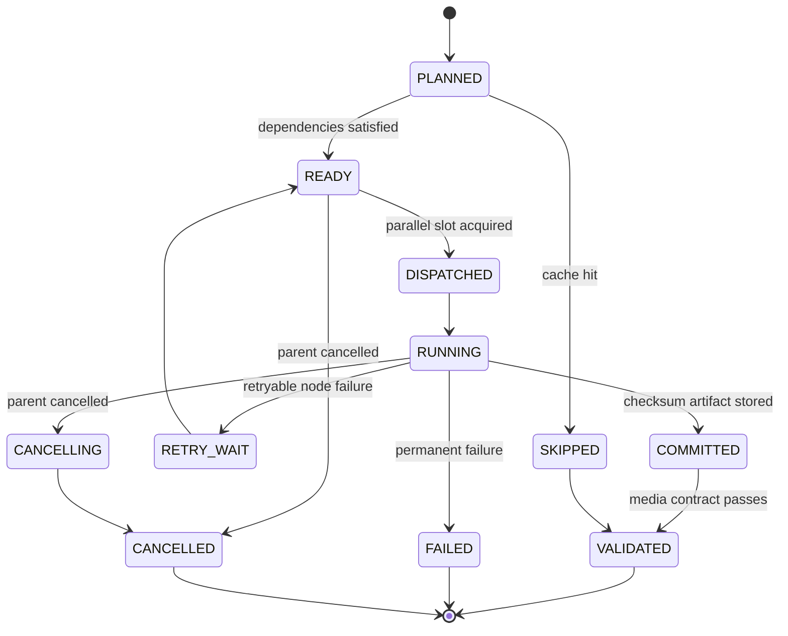
```mermaid
stateDiagram-v2
    [*] --> PLANNED
    PLANNED --> READY: dependencies satisfied
    READY --> DISPATCHED: parallel slot acquired
    DISPATCHED --> RUNNING
    RUNNING --> COMMITTED: checksum artifact stored
    RUNNING --> RETRY_WAIT: retryable node failure
    RETRY_WAIT --> READY
    COMMITTED --> VALIDATED: media contract passes
    VALIDATED --> [*]
    PLANNED --> SKIPPED: cache hit
    SKIPPED --> VALIDATED
    READY --> CANCELLED: parent cancelled
    RUNNING --> CANCELLING: parent cancelled
    CANCELLING --> CANCELLED
    RUNNING --> FAILED: permanent failure
    FAILED --> [*]
    CANCELLED --> [*]
```

### Production Problemleri

- Chunk sınırında görsel sıçrama, eksik B-frame, ses click'i veya timestamp discontinuity.
- Transition overlap'in final duration'ı uzatması/kısaltması.
- Farklı worker build'lerinin codec extradata üretip concat'i bozması.
- Fazla küçük chunk nedeniyle orchestration/S3 request overhead'inin kazancı aşması.
- Straggler node'un tüm finalizasyonu bekletmesi ve paralel fan-out'un tenant kotasını tüketmesi.
- Cancellation sonrası geç tamamlanan fenced attempt'in artifact'i yanlışlıkla graph'a eklemesi.

### Recovery, Retry ve Idempotency

Node idempotency anahtarı `graph_hash:node_id:input_checksums:renderer_build_policy` üzerinden türetilir. CAS'ta doğrulanmış output varsa node cache hit olur. Retry yalnız başarısız node'u ve ona bağımlı henüz commit edilmemiş düğümleri etkiler. Concat tamamen idempotenttir; canonical liste hash'i output identity'nin parçasıdır. Attempt fencing token'ı stale worker commit'ini reddeder. Cancellation terminal olduktan sonra geç sonuçlar unreferenced artifact olarak lifecycle ile temizlenir.

### Performans ve Benchmark

- Hedef parallel efficiency: 4 worker'da uygun iş için `>= %70`, 8 worker'da `>= %55`; orchestration overhead toplam sürenin `< %5`i.
- Varsayılan chunk süresi sabit değildir; benchmark ile codec/transition yoğunluğuna göre genellikle onlarca saniye ile birkaç dakika arasında seçilir.
- Metrikler: critical-path süresi, graph width, runnable/active node, straggler ratio, cache-hit, concat süresi, boundary validation failure, S3 request/node.
- Benchmark: tek süreç baseline'a karşı 2/4/8 worker, kısa/uzun GOP, yoğun transition, çoklu audio, altyazı burn-in, worker kill ve bir node retry.
- Eşik: final duration farkı `< 1 frame veya 20 ms`, A/V sync `< 20 ms`, boundary golden test failure `0`; straggler p95/median `> 2,5` ise repartition analizi.

### Gerçek Dünya Senaryosu

30 dakikalık derlemede 24 sahne ve 8 crossfade vardır. Planner crossfade çevresinde handle bırakır, bağımsız sahneleri altı GPU worker'a dağıtır. Bir worker sürücü reseti yaşadığında yalnız iki segment tekrar render edilir. Transition'lar ilgili iki segment hazır olunca başlar; concat tamamlanma sırasına değil timeline index'e göre yapılır.

### Ölçeklenme ve Backpressure

Parent workflow aynı anda sınırsız child başlatmaz; tenant `max_parallel_nodes`, pool slotu, scratch ve S3 multipart bütçesiyle bounded fan-out kullanır. Ready-set büyükse scheduler weighted fair token dağıtır. Straggler speculation varsayılan kapalıdır; yalnız deterministik ve pahalı olmayan node'larda, duplicate resource bütçesiyle ikinci attempt açılabilir ve ilk fenced commit kazanır.

### Ownership ve Test

**Sahip:** Render Pipeline ekibi; queue yürütmesi için Orchestration ortak sahibi.  
**Testler:** DAG cycle/property testleri, deterministic graph hash, transition boundary golden media, random completion ordering, partial retry, stale attempt fencing, cancellation cascade, concat contract matrix, A/V sync ve 2/4/8 worker benchmark regresyonları.

## 50. Job Scheduler

### Çalışma Modeli ve Invariant'lar

Scheduler, Temporal workflow içindeki durable karar katmanı ile PostgreSQL'deki kısa süreli kapasite/tenant lease activity'lerinden oluşur. Görevi; admission control, capability matching, öncelik, deadline, weighted fairness, tenant kota rezervasyonu ve pool seçimini tek bir açıklanabilir karara dönüştürmektir. Scheduler medya işlemez ve worker çalıştırmaz.

- Admission kararı tenant'ın eşzamanlı job, resource-seconds, günlük byte ve delivery limitlerini atomik olarak rezerve eder; rezervasyonsuz iş queue'ya girmez.
- Hard capability koşulları hiçbir öncelik nedeniyle esnetilmez. Soft preference yalnız kalite policy'sinin izin verdiği eşdeğer renderer'lar arasında kullanılır.
- Öncelik sınıfları `interactive`, `standard`, `batch` olarak sınırlıdır; tenant kullanıcı girdisi doğrudan sınırsız priority sayısına dönüşmez.
- Fairness, tenant ağırlıklı deficit round-robin/weighted fair queuing ile sağlanır; aynı tenant içinde deadline ve aging uygulanır.
- Starvation önlemek için bekleme yaşı effective priority'yi sınırlı artırır; hard tenant kota ve capability koşulunu aşmaz.
- Scheduler kararı `policy_version`, `cost_estimate`, `selected_queue`, `reason_codes` ve lease kimliğiyle audit edilir.
- Workflow replay sırasında karar değişmez: zaman, inventory ve kota sorguları activity sonucudur; history'ye kaydedilir.
- İptal edilen veya terminal işin lease'i idempotent biçimde bırakılır; lease TTL yalnız crash recovery içindir, normal yaşam döngüsü explicit release kullanır.

### Neden

Salt FIFO, büyük bir tenant'ın batch işlerinin interactive işleri bloke etmesine; salt priority ise düşük öncelikli işlerin sonsuza kadar beklemesine yol açar. Worker boşluğuna bakmadan queue'ya iş basmak disk, Temporal backlog ve dış servisleri aşırı yükler. Merkezi policy, kapasite ve ticari tenant sınırlarını gözlemlenebilir ve test edilebilir hale getirir.

### Alternatifler ve Trade-off'lar

| Seçenek | Karar | Trade-off |
|---|---|---|
| Weighted fair scheduler + leases | Varsayılan | Fairness ve admission güçlü; state/metric karmaşıklığı getirir. |
| Queue başına statik priority | Küçük sistemde başlangıç | Basit; tenant izolasyonu ve starvation kontrolü zayıf. |
| Kubernetes scheduler'a bırakmak | Yalnız pod yerleşimi için | Donanımı yerleştirir; iş maliyeti, deadline ve tenant bilgisini yönetmez. |
| Earliest-deadline-first | Interactive lane içinde yardımcı | Deadline başarısı iyi; uzak deadline'lı batch starvation yaşayabilir. |

### Veri Akışı

API ön kontrolü yalnız hızlı ret sağlar. Render workflow `EstimateCost` activity'siyle tahmini CPU/GPU-second, scratch byte ve egress çıkarır. `AdmitJob` PostgreSQL transaction'ında tenant bucket'larını kilitleyip lease oluşturur. Scheduler canlı capability inventory ve queue health snapshot'ını alır, hard filter uygular, sonra priority/fairness skoruyla queue seçer. Workflow task'ı dispatch eder; heartbeat gerçek tüketimi günceller. Terminal durumda gerçekleşen maliyet muhasebeleştirilir ve kullanılmayan rezervasyon bırakılır.

### API / Interface / Model Örneği

```python
class ScheduleRequest(BaseModel):
    job_id: UUID
    tenant_id: UUID
    priority_class: Literal["interactive", "standard", "batch"]
    submitted_at: datetime
    deadline_at: datetime | None
    requirements: frozenset[str]
    estimated_cost: ResourceCost

class SchedulingDecision(BaseModel):
    admitted: bool
    selected_queue: str | None
    reservation_id: UUID | None
    policy_version: str
    not_before: datetime | None
    reason_codes: tuple[str, ...]

class JobScheduler(Protocol):
    async def decide(self, request: ScheduleRequest) -> SchedulingDecision: ...
    async def renew(self, reservation_id: UUID, usage: ResourceUsage) -> None: ...
    async def release(self, reservation_id: UUID, terminal_state: str) -> None: ...
```

PostgreSQL çekirdek modeli:

```sql
CREATE TABLE scheduler_reservation (
  id uuid PRIMARY KEY,
  tenant_id uuid NOT NULL,
  job_id uuid NOT NULL UNIQUE,
  resource_class text NOT NULL,
  reserved_units bigint NOT NULL CHECK (reserved_units >= 0),
  fencing_token bigint NOT NULL,
  lease_expires_at timestamptz NOT NULL,
  state text NOT NULL,
  policy_version text NOT NULL
);
```

### Dosya / Klasör Organizasyonu

`execution/scheduler/admission.py` rezervasyon transaction'ını; `fairness.py` tenant seçim algoritmasını; `capabilities.py` hard/soft eşleşmeyi; `cost_model.py` resource tahminini; `orchestration/activities/schedule.py` Temporal activity sınırını; `persistence/models/reservation.py` lease modelini içerir. Policy config sürümlü olarak `config/scheduler/` altında veya merkezi config servisinde tutulur.

### Render Pipeline Bağlantısı

Planner her graph node'unun cost/capability değerini scheduler'a verir. Parent job reservation'ı toplam bütçeyi, node lease'i anlık paralelliği sınırlar. Transition overlap ve concat gibi critical-path node'larına sınırlı priority boost uygulanabilir. Scheduler render sonucunu değiştirmez; yalnız izin verilen renderer variant'larından birini seçer ve bu seçimi graph execution metadata'sına sabitler.

### Sequence Diagram

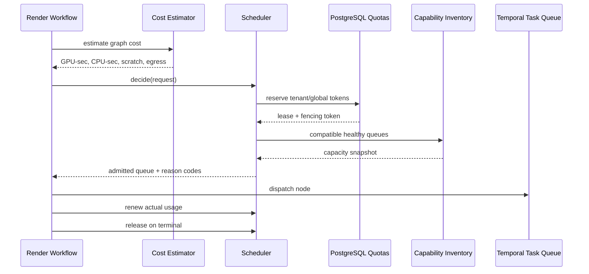
```mermaid
sequenceDiagram
    participant W as Render Workflow
    participant E as Cost Estimator
    participant S as Scheduler
    participant P as PostgreSQL Quotas
    participant I as Capability Inventory
    participant T as Temporal Task Queue
    W->>E: estimate graph cost
    E-->>W: GPU-sec, CPU-sec, scratch, egress
    W->>S: decide(request)
    S->>P: reserve tenant/global tokens
    P-->>S: lease + fencing token
    S->>I: compatible healthy queues
    I-->>S: capacity snapshot
    S-->>W: admitted queue + reason codes
    W->>T: dispatch node
    W->>S: renew actual usage
    W->>S: release on terminal
```

### Class Diagram

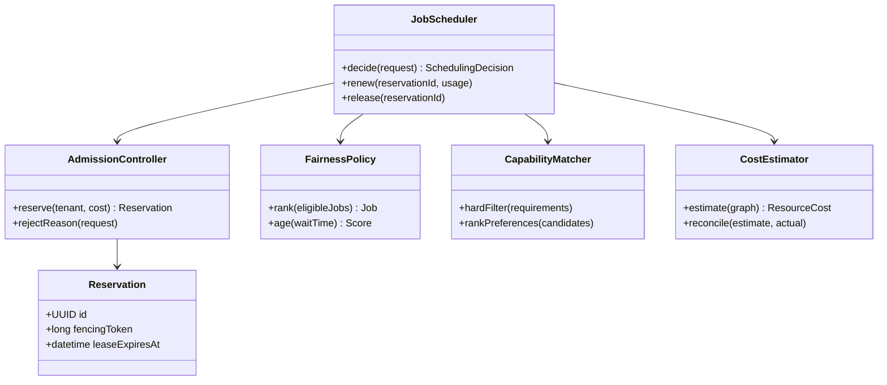
```mermaid
classDiagram
    class JobScheduler {
      +decide(request) SchedulingDecision
      +renew(reservationId, usage)
      +release(reservationId)
    }
    class AdmissionController {
      +reserve(tenant, cost) Reservation
      +rejectReason(request)
    }
    class FairnessPolicy {
      +rank(eligibleJobs) Job
      +age(waitTime) Score
    }
    class CapabilityMatcher {
      +hardFilter(requirements)
      +rankPreferences(candidates)
    }
    class CostEstimator {
      +estimate(graph) ResourceCost
      +reconcile(estimate, actual)
    }
    class Reservation {
      +UUID id
      +long fencingToken
      +datetime leaseExpiresAt
    }
    JobScheduler --> AdmissionController
    JobScheduler --> FairnessPolicy
    JobScheduler --> CapabilityMatcher
    JobScheduler --> CostEstimator
    AdmissionController --> Reservation
```

### State Machine

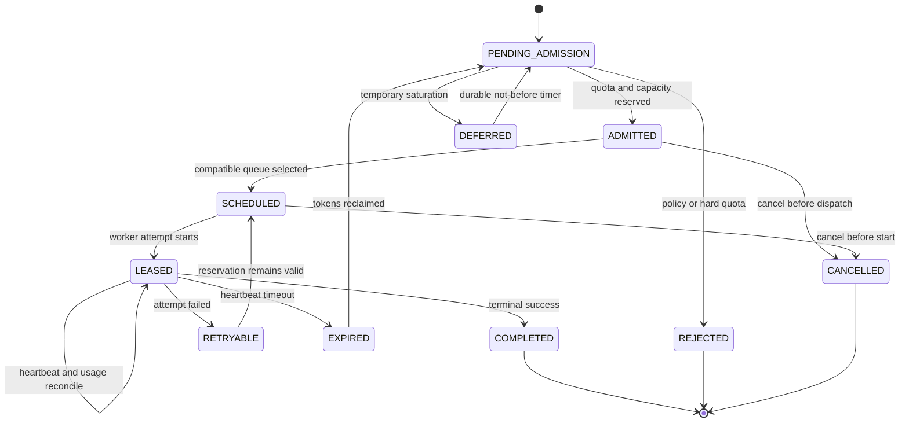
```mermaid
stateDiagram-v2
    [*] --> PENDING_ADMISSION
    PENDING_ADMISSION --> ADMITTED: quota and capacity reserved
    PENDING_ADMISSION --> DEFERRED: temporary saturation
    PENDING_ADMISSION --> REJECTED: policy or hard quota
    DEFERRED --> PENDING_ADMISSION: durable not-before timer
    ADMITTED --> SCHEDULED: compatible queue selected
    SCHEDULED --> LEASED: worker attempt starts
    LEASED --> LEASED: heartbeat and usage reconcile
    LEASED --> COMPLETED: terminal success
    LEASED --> RETRYABLE: attempt failed
    RETRYABLE --> SCHEDULED: reservation remains valid
    LEASED --> EXPIRED: heartbeat timeout
    EXPIRED --> PENDING_ADMISSION: tokens reclaimed
    ADMITTED --> CANCELLED: cancel before dispatch
    SCHEDULED --> CANCELLED: cancel before start
    COMPLETED --> [*]
    REJECTED --> [*]
    CANCELLED --> [*]
```

### Production Problemleri

- Tahmin modelinin 4K filter graph maliyetini düşük hesaplayıp oversubscription yaratması.
- Çok sayıda küçük interactive işin batch starvation üretmesi; lane capacity floor/ceiling gerekir.
- Tenant ID shard hot-spot ve reservation row lock contention.
- Capability inventory lease'inin stale kalması; queue seçilmiş olsa da poller bulunmaması.
- Deadline'ın gerçekçi olmaması; scheduler imkânsız deadline için `AT_RISK` reason code üretmeli, diğer işleri ezmemelidir.
- Lease expiry ile geç heartbeat yarışı; fencing token eski attempt'in kapasite ve artifact commit'ini engeller.

### Recovery, Retry ve Idempotency

`job_id` başına tek aktif reservation unique constraint ile korunur. `decide` tekrarlanırsa mevcut reservation/karar döner. Transaction deadlock/serialization failure kısa jitter ile retry edilir. Scheduler process kaybı Temporal activity retry ile güvenlidir. Süresi dolan lease reaper tarafından `EXPIRED` yapılır; yeni reservation daha yüksek fencing token alır. Permanent policy reject retry edilmez; geçici saturation `not_before` durable timer ile yeniden değerlendirilir. Usage reconcile monoton sequence number ile duplicate heartbeat'i yok sayar.

### Performans ve Benchmark

- Decision activity p95 `< 100 ms`, p99 `< 250 ms`; reservation lock wait p99 `< 50 ms`; scheduler throughput başlangıç hedefi `>= 1.000 decision/s`.
- Fairness metriği: tenant ağırlığına göre normalize edilmiş servis oranı sapması 15 dakikalık pencerede `< %10`; starvation yaşı hiçbir aktif batch tenant için tanımlı üst sınırı aşmamalıdır.
- Deadline metriği: kabul edilmiş interactive işlerde deadline success `>= %99`; imkânsız tahmin edilen işler ayrı sayılır.
- Benchmark: Zipf tenant dağılımı, burst, 10 bin tenant, 100 bin pending node, capability outage, DB failover, estimate error x0,5/x2 ve priority flood.
- Eşik: reservation leak `0`, expired active lease `< %0,1`, decision error `< %0,1`; fairness veya lock eşiği aşılırsa admission düşürülür ve shard/indeks analizi yapılır.

### Gerçek Dünya Senaryosu

Premium tenant 20 interactive preview, ücretsiz tenant 5.000 batch transcode gönderir. Scheduler her tenant'ın plan kotasını rezerve eder, interactive lane'i korur fakat premium tenant'a global kapasitenin tamamını vermez. Batch tenant weighted payını almaya devam eder. NVIDIA pool kaybolursa GPU-hard işler defer edilir; CPU-equivalent policy'li işler cost yeniden hesaplanarak CPU queue'suna planlanır.

### Ölçeklenme ve Backpressure

Scheduler instance'ları stateless ölçeklenir; correctness PostgreSQL transaction/constraint ve Temporal history'dedir. Tenant bucket'ları hash partition edilir. Admission; queue backlog age, worker lease kapasitesi, scratch high-watermark, S3 throttling ve platform upload kotası sinyallerini birleştirir. Backpressure HTTP `429`/`Retry-After` ile yalnız hard API kabul sınırında, kabul edilmiş durable işler için ise `DEFERRED` + `not_before` olarak ifade edilir.

### Ownership ve Test

**Sahip:** Orchestration/Scheduling ekibi; tenant plan/kota politikası için Product Platform, DB/SLO için SRE ortak sahibi.  
**Testler:** fairness model/property testleri, concurrent reservation, deadlock retry, lease expiry/fencing, starvation, priority abuse, capability outage, estimate reconciliation, replay determinism, load/soak ve policy version rollback.

## 51. Retry Mekanizması

### Çalışma Modeli ve Invariant'lar

Retry politikası katmanlıdır: Temporal workflow/activity retry, uygulama düzeyi checkpoint/resume ve dış platform adapter retry sınıflandırması. Her hata `FailureClass`, `retry_after`, `safe_to_retry`, `scope` ve redacted diagnostic ile canonical hale getirilir. Ham exception metni policy değildir.

- `TRANSIENT_INFRA`: timeout, bağlantı reseti, geçici S3/DB/Temporal servis hatası; exponential backoff + full jitter.
- `RESOURCE_EXHAUSTED`: disk/GPU memory/encoder session; aynı worker yerine reschedule veya daha düşük concurrency.
- `RATE_LIMITED`: platform/S3 quota; sağlayıcının `Retry-After` bilgisi ve ortak tenant/platform limiter'ı kullanılır.
- `AUTH_REFRESHABLE`: access token expiry; tek refresh coordination sonrası retry.
- `USER_ACTION_REQUIRED`: revoked consent, platform privacy seçimi/onay ihtiyacı; otomatik retry yok, kullanıcı aksiyonu beklenir.
- `INVALID_INPUT` ve `UNSUPPORTED_CAPABILITY`: permanent; spec değişmeden retry edilmez.
- `CORRUPT_INPUT`: kaynağı yeniden materialize ederek sınırlı retry; doğrulanmış CAS kaynağı da bozuksa karantina.
- `BUG_OR_NONDETERMINISM`: otomatik retry bütçesi çok düşük; poison job karantinası ve incident.
- Her retry'nin üst sınırı attempt sayısı kadar elapsed-time budget ile de sınırlıdır. Sonsuz retry yalnız açıkça beklenen insan sinyalli workflow state'inde, task çalıştırmadan yapılabilir.
- Retry dış etkileri çoğaltmamalıdır; upload session, multipart upload ID, platform remote ID ve artifact checksum checkpoint olarak tutulur.

### Neden

Tüm hataları aynı şekilde retry etmek kalıcı hatalarda kaynak yakar, rate limit'i büyütür ve poison job'larla queue'yu kilitler. Hiç retry etmemek ise geçici ağ/worker kayıplarında kullanıcı deneyimini bozar. Taxonomy, hata kaynağına uygun scope'ta yeniden deneme veya reschedule sağlar.

### Alternatifler ve Trade-off'lar

| Seçenek | Karar | Trade-off |
|---|---|---|
| Typed taxonomy + Temporal policy | Varsayılan | Açıklanabilir ve güvenli; adapter'ların doğru map etmesi gerekir. |
| Sabit N kez retry | Kullanılmaz | Basit; rate limit ve permanent hata ayrımı yok. |
| Workflow'u baştan çalıştırma | Yalnız graph/spec değişiminde | Kolay; tamamlanmış pahalı node'ları tekrarlar. |
| Manuel retry | User-action/permanent düzeltme sonrası | Kontrollü; operasyon ve kullanıcı gecikmesi getirir. |

### Veri Akışı

Activity exception'ı adapter/runtime tarafından `EngineFailure`a çevrilir. Workflow policy taxonomy, attempt geçmişi, elapsed budget ve idempotency checkpoint'ini değerlendirir. Retryable ise backoff timer kurar; resource hatasında scheduler'a reschedule sinyali verir; platform limiter'a rate-limit gözlemi yazar. Permanent veya exhausted hata `FAILED`; aynı signature tekrar eşiğini aşarsa `POISONED` olur. Kullanıcı düzeltmesinden sonra yeni spec/config version ile açık `resume` komutu gönderilir.

### API / Interface / Model Örneği

```python
class EngineFailure(BaseModel):
    code: str
    failure_class: Literal[
        "TRANSIENT_INFRA", "RESOURCE_EXHAUSTED", "RATE_LIMITED",
        "AUTH_REFRESHABLE", "USER_ACTION_REQUIRED", "INVALID_INPUT",
        "UNSUPPORTED_CAPABILITY", "CORRUPT_INPUT", "BUG_OR_NONDETERMINISM"
    ]
    safe_to_retry: bool
    retry_after_seconds: int | None = None
    scope: Literal["operation", "node", "worker", "workflow", "user"]
    fingerprint: str
    diagnostic_ref: str | None = None

class RetryDecision(BaseModel):
    action: Literal["RETRY", "RESCHEDULE", "WAIT_USER", "FAIL", "POISON"]
    delay_seconds: float | None
    next_attempt: int | None
    reason: str

class RetryPolicy(Protocol):
    def decide(self, failure: EngineFailure, history: AttemptHistory) -> RetryDecision: ...
```

Manuel API `POST /v1/render-jobs/{job_id}:resume` bir `Idempotency-Key`, beklenen terminal version ve düzeltilmiş spec/config referansı ister; aynı bozuk spec'i sessizce yeniden başlatmaz.

### Dosya / Klasör Organizasyonu

`orchestration/retry_policies.py` ortak bütçe/backoff'u; `delivery/contracts/errors.py` vendor mapping'i; `execution/errors.py` FFmpeg/worker mapping'ini; `persistence/models/attempt.py` deneme ve fingerprint audit'ini; `api/routers/render_jobs.py` resume/retry komutlarını; `tests/failure_injection/` fault senaryolarını içerir.

### Render Pipeline Bağlantısı

Retry scope graph node'udur; tamamlanmış CAS node'ları tekrar çalışmaz. FFmpeg exit code tek başına taxonomy değildir: stderr pattern, resource telemetry, cancellation flag ve input probe birlikte değerlendirilir. Concat media contract hatası upstream node/build uyuşmazlığını işaret edebilir ve workflow scope'unda replan gerektirebilir. Delivery retry render artifact'ini değiştirmez.

### Sequence Diagram

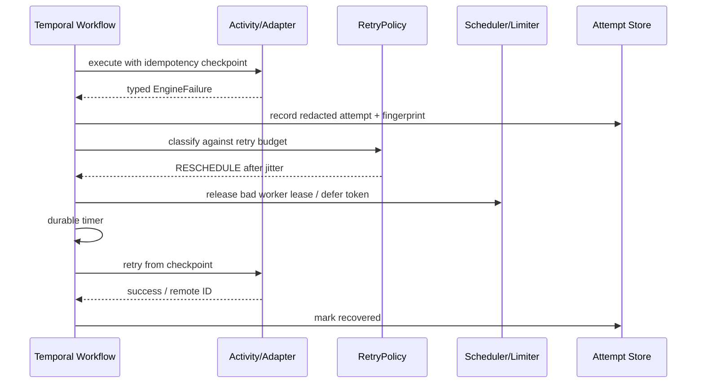
```mermaid
sequenceDiagram
    participant W as Temporal Workflow
    participant A as Activity/Adapter
    participant P as RetryPolicy
    participant S as Scheduler/Limiter
    participant D as Attempt Store
    W->>A: execute with idempotency checkpoint
    A-->>W: typed EngineFailure
    W->>D: record redacted attempt + fingerprint
    W->>P: classify against retry budget
    P-->>W: RESCHEDULE after jitter
    W->>S: release bad worker lease / defer token
    W->>W: durable timer
    W->>A: retry from checkpoint
    A-->>W: success / remote ID
    W->>D: mark recovered
```

### Class Diagram

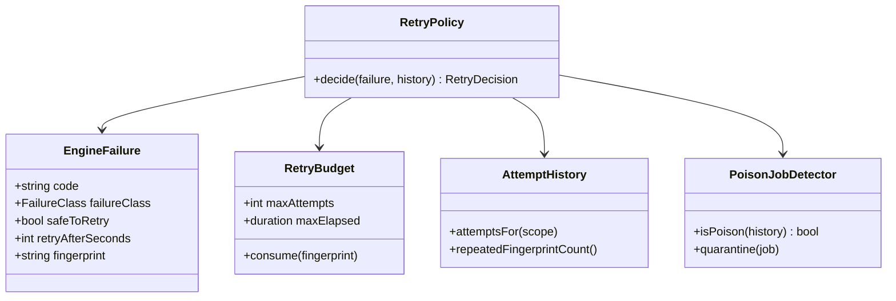
```mermaid
classDiagram
    class EngineFailure {
      +string code
      +FailureClass failureClass
      +bool safeToRetry
      +int retryAfterSeconds
      +string fingerprint
    }
    class RetryPolicy {
      +decide(failure, history) RetryDecision
    }
    class RetryBudget {
      +int maxAttempts
      +duration maxElapsed
      +consume(fingerprint)
    }
    class AttemptHistory {
      +attemptsFor(scope)
      +repeatedFingerprintCount()
    }
    class PoisonJobDetector {
      +isPoison(history) bool
      +quarantine(job)
    }
    RetryPolicy --> EngineFailure
    RetryPolicy --> RetryBudget
    RetryPolicy --> AttemptHistory
    RetryPolicy --> PoisonJobDetector
```

### State Machine

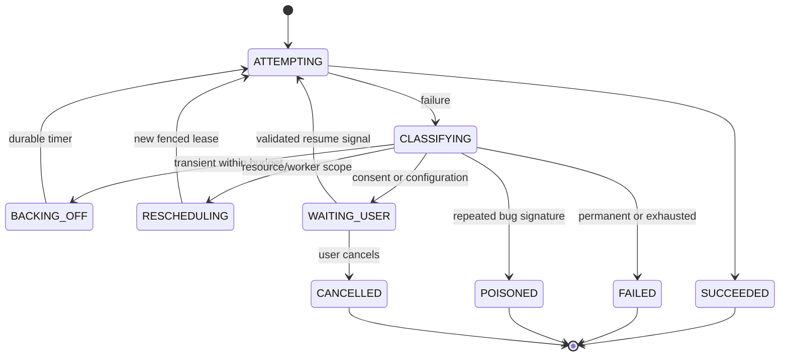
```mermaid
stateDiagram-v2
    [*] --> ATTEMPTING
    ATTEMPTING --> SUCCEEDED
    ATTEMPTING --> CLASSIFYING: failure
    CLASSIFYING --> BACKING_OFF: transient within budget
    CLASSIFYING --> RESCHEDULING: resource/worker scope
    CLASSIFYING --> WAITING_USER: consent or configuration
    CLASSIFYING --> FAILED: permanent or exhausted
    CLASSIFYING --> POISONED: repeated bug signature
    BACKING_OFF --> ATTEMPTING: durable timer
    RESCHEDULING --> ATTEMPTING: new fenced lease
    WAITING_USER --> ATTEMPTING: validated resume signal
    WAITING_USER --> CANCELLED: user cancels
    SUCCEEDED --> [*]
    FAILED --> [*]
    POISONED --> [*]
    CANCELLED --> [*]
```

### Production Problemleri

- Retry storm/thundering herd; full jitter, circuit breaker ve global retry budget gerekir.
- Yanlış `safe_to_retry` mapping'i duplicate platform post üretebilir.
- OAuth refresh token yarışında birden çok worker token'ı geçersizleştirebilir; credential başına single-flight/lease gerekir.
- Poison medya FFmpeg'i deterministik çökertip tüm pool'u meşgul edebilir.
- Sağlayıcı `Retry-After` değerinin eksik/aşırı olması; bounded policy ve capability health gerekir.
- Temporal activity timeout'ları yanlış ayarlanırsa uzun ama sağlıklı render tekrar başlatılabilir; heartbeat timeout ve start-to-close ayrı ayarlanır.

### Recovery, Retry ve Idempotency

Her dış operasyon stable idempotency key taşır. S3 multipart upload ID ve tamamlanmış part ETag/checksum listesi; YouTube session URL/offset ve remote video ID; TikTok publish/init kimliği; Instagram container ID; manuel Kick delivery bundle kimliği checkpoint edilir. Retry önce remote state'i reconcile eder, sonra yeni side effect üretir. Exponential backoff full jitter kullanır, ancak vendor `Retry-After` daha uzunsa ona uyulur. Manual resume yeni command ID ile idempotent signal gönderir. Poisoned job yalnız operator veya düzeltilmiş renderer/spec version ile açılır.

### Performans ve Benchmark

- Metrikler: attempt/job, recovered failure oranı, retry delay, exhausted/poison count, duplicate side-effect reconciliation, failure fingerprint cardinality, retry kaynak maliyeti.
- Hedef: transient hata recovery `>= %99` (sağlayıcı outage hariç), duplicate görünür platform post `0`, retry nedeniyle ek render maliyeti normal trafikte `< %5`.
- Fault benchmark: paket kaybı, timeout, 429/5xx, DB failover, pod SIGKILL, GPU reset, S3 part failure, expired OAuth, stale remote state ve malformed input.
- Eşik: aynı fingerprint 10 dakikada belirlenen job/pool oranını aşarsa circuit breaker; retry trafiği toplam activity'nin `%20` sini aşarsa admission azaltılır; poison queue yaşı için paging alarmı oluşturulur.

### Gerçek Dünya Senaryosu

YouTube resumable upload 2,7 GiB'de bağlantı reseti yaşar. Adapter session URL ve doğrulanmış offset'i workflow checkpoint'inden okur, remote offset'i sorgular ve kalan byte'lardan devam eder. Yeni video kaydı oluşturmaz. Aynı sırada token süresi dolmuşsa credential lease'i alan tek activity refresh yapar; diğerleri yeni Vault secret version'ını bekler.

### Ölçeklenme ve Backpressure

Retry işleri yeni işler kadar kapasite tüketir; ayrı sınırsız hızlı yol yoktur. Tenant ve failure-domain bazında retry token bucket kullanılır. Vendor circuit breaker açıkken delivery workflow'ları durable timer ile bekler, render queue etkilenmez. Backoff timer'ları worker slotu tutmaz. Büyük outage sonrası kademeli ramp-up ve randomized wake-up uygulanır.

### Ownership ve Test

**Sahip:** Orchestration Reliability ekibi; her platform/worker sahibi kendi hata mapping'inden sorumludur.  
**Testler:** taxonomy table tests, backoff property tests, elapsed budget, duplicate side-effect, OAuth refresh race, poison detection, circuit breaker, Temporal timeout/replay, all fault injection senaryoları ve outage recovery load testi.

## 52. Storage Layer

### Çalışma Modeli ve Invariant'lar

Kalıcı medya S3 uyumlu nesne deposunda content-addressed storage (CAS) olarak tutulur. Canonical anahtar `cas/{algorithm}/{prefix}/{digest}` biçimindedir; digest varsayılan olarak plaintext medya byte'larının SHA-256 değeridir. PostgreSQL `artifact` tablosu digest, teknik metadata, tenant erişim referansı, lineage, retention ve replication durumunu taşır. Fiziksel nesne ile tenant mantıksal referansı ayrıdır.

- `READY` artifact için S3 nesnesi mevcut, byte uzunluğu ve checksum doğrulanmış, PostgreSQL metadata commit edilmiş olmalıdır.
- Aynı digest'e yükleme idempotenttir; içerik eşleşmiyorsa digest collision/corruption incident'ı kabul edilir, overwrite yapılmaz.
- S3 list operation correctness için kullanılmaz. Okuma exact key/head üzerinden, ilişki PostgreSQL üzerinden yapılır.
- Bucket public değildir; erişim service identity veya kısa ömürlü signed URL ile en az yetki prensibine göre verilir.
- Encryption at rest SSE-KMS; anahtar politikası ortam/tenant sınıfına göre uygulanır. Checksum plaintext identity'dir, hassas tenant dedup politikası bilgi sızıntısı riski açısından ayrıca sınırlandırılabilir.
- Delete referans sayacı tek başına yeterli değildir; retention/legal hold, delivery lineage ve replication state kontrol edilir.
- Cross-region replication asenkrondur. Primary region commit'i ile DR-ready birbirinden ayrı durumdur.
- Metadata/outbox aynı PostgreSQL transaction'ındadır; S3 ve DB arasında dağıtık transaction yoktur, staged commit + reconciler kullanılır.

### Neden

CAS, aynı kaynak/çıktının tekrar yüklenmesini azaltır, checksum identity ile idempotency sağlar ve render graph checkpoint'lerini kalıcı hale getirir. PostgreSQL güçlü ilişki/audit sorgusu sağlarken S3 büyük medya byte'ını ekonomik ve ölçeklenebilir tutar. Staged commit, S3/DB çift yazımındaki yarım durumları onarılabilir yapar.

### Alternatifler ve Trade-off'lar

| Seçenek | Karar | Trade-off |
|---|---|---|
| S3 CAS + PostgreSQL metadata | Varsayılan | Dedup/idempotency güçlü; lifecycle/reconciliation gerekir. |
| Job-path mutable object | Teslimat paketi alias'ında sınırlı | İnsan tarafından okunur; overwrite ve duplicate riski. |
| PostgreSQL large object | Kullanılmaz | Transaction kolay; maliyet, backup ve throughput uygun değil. |
| Dağıtık filesystem | Özel on-prem gereksinim | POSIX kolaylığı; operasyon ve global durability maliyeti. |

### Veri Akışı

Worker output'u scratch'te checksum'lar. Storage activity `artifact_upload` kaydını `STAGING` açar, S3 temporary staging key'e checksum header'larıyla multipart yükler. Complete sonrası HEAD/checksum/size doğrular. CAS key yoksa conditional copy/put ile publish eder; varsa byte identity doğrular. PostgreSQL transaction'ında artifact/ref ve outbox yazılır, upload `COMMITTED` olur. Reconciler eski staging kayıtlarını tamamlar veya güvenli biçimde abort/delete eder. Lifecycle erişim yaşı, retention ve replication sonucuna göre storage class değiştirir.

### API / Interface / Model Örneği

```python
class ArtifactRef(BaseModel):
    artifact_id: UUID
    algorithm: Literal["sha256"] = "sha256"
    digest: str
    size_bytes: int
    media_type: str
    state: Literal["STAGING", "READY", "QUARANTINED", "DELETING", "DELETED"]
    storage_region: str
    replication_state: Literal["PENDING", "REPLICATED", "FAILED"]

class ArtifactStore(Protocol):
    async def put_file(self, path: Path, expected_digest: str, context: PutContext) -> ArtifactRef: ...
    async def open_stream(self, artifact: ArtifactRef, byte_range: Range | None = None) -> AsyncIterator[bytes]: ...
    async def head(self, digest: str) -> ArtifactRef | None: ...
    async def sign_download(self, artifact_id: UUID, ttl: timedelta, disposition: str) -> str: ...
    async def release_reference(self, artifact_id: UUID, owner: OwnerRef) -> None: ...
```

```sql
CREATE TABLE artifact (
  id uuid PRIMARY KEY,
  sha256 char(64) NOT NULL,
  size_bytes bigint NOT NULL CHECK (size_bytes >= 0),
  media_type text NOT NULL,
  storage_key text NOT NULL UNIQUE,
  state text NOT NULL,
  replication_state text NOT NULL,
  kms_key_ref text NOT NULL,
  created_at timestamptz NOT NULL,
  UNIQUE (sha256, size_bytes)
);
```

### Dosya / Klasör Organizasyonu

Nesne anahtarları:

```text
s3://media-primary/
├── cas/sha256/ab/cd/<64-hex-digest>
├── staging/<tenant-hash>/<upload-id>/<random-name>
├── manifests/render/<job-id>/<graph-hash>.json
├── delivery/<delivery-id>/package.json
└── quarantine/<reason>/<artifact-id>
```

Kod `storage/cas.py`, `storage/multipart.py`, `storage/signed_urls.py`, `storage/lifecycle.py`; persistence `persistence/models/artifact.py`; reconciliation `orchestration/workflows/storage_reconcile.py`; IaC bucket/KMS/replication policy'leri `deploy/storage/` altında tutulur.

### Render Pipeline Bağlantısı

Input ve her checkpoint output `ArtifactRef` ile graph'a bağlanır. Renderer yalnız signed URL'yi durable payload'a gömmek yerine artifact ID taşır; activity çalışma anında kısa ömürlü erişim üretir. Spec hash + input digest + renderer policy cache lookup'u sağlar. Final render `READY` ve media validation tamamlanınca delivery workflow sinyali üretilir.

### Sequence Diagram

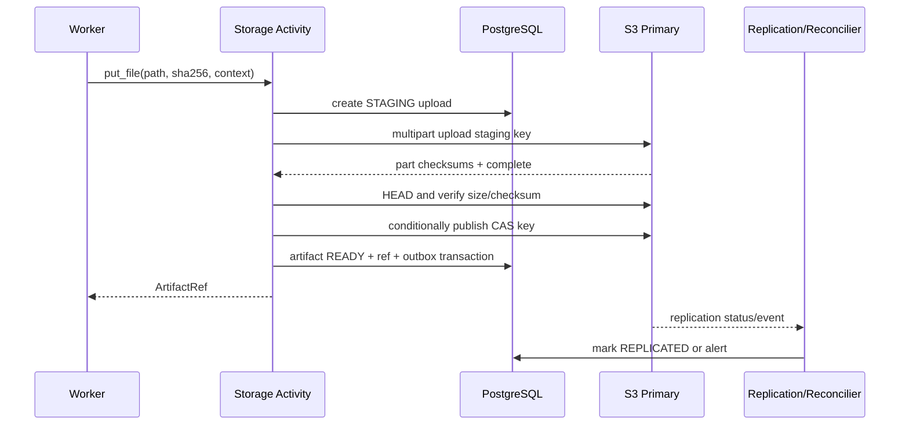
```mermaid
sequenceDiagram
    participant W as Worker
    participant A as Storage Activity
    participant P as PostgreSQL
    participant S as S3 Primary
    participant R as Replication/Reconcilier
    W->>A: put_file(path, sha256, context)
    A->>P: create STAGING upload
    A->>S: multipart upload staging key
    S-->>A: part checksums + complete
    A->>S: HEAD and verify size/checksum
    A->>S: conditionally publish CAS key
    A->>P: artifact READY + ref + outbox transaction
    A-->>W: ArtifactRef
    S-->>R: replication status/event
    R->>P: mark REPLICATED or alert
```

### Class Diagram

```mermaid
classDiagram
    class ArtifactStore {
      <<interface>>
      +putFile(path, digest) ArtifactRef
      +openStream(ref, range)
      +head(digest)
      +signDownload(id, ttl)
    }
    class S3CasStore
    class ArtifactRef {
      +UUID artifactId
      +string digest
      +long sizeBytes
      +ArtifactState state
    }
    class MultipartCoordinator {
      +start()
      +uploadPart()
      +complete()
      +abort()
    }
    class StorageReconciler {
      +reconcileStaging()
      +verifyMetadata()
    }
    class LifecycleManager {
      +transitionClass()
      +eligibleForDelete()
    }
    ArtifactStore <|.. S3CasStore
    S3CasStore --> MultipartCoordinator
    S3CasStore --> ArtifactRef
    StorageReconciler --> S3CasStore
    LifecycleManager --> ArtifactRef
```

### State Machine

```mermaid
stateDiagram-v2
    [*] --> STAGING
    STAGING --> VERIFYING: multipart complete
    VERIFYING --> READY: checksum and metadata committed
    VERIFYING --> QUARANTINED: checksum mismatch
    STAGING --> ABORTED: expired or explicit abort
    READY --> REPLICATING: DR policy applies
    REPLICATING --> READY: replica verified
    REPLICATING --> REPLICATION_FAILED: retry budget exhausted
    REPLICATION_FAILED --> REPLICATING: operator or timer retry
    READY --> ARCHIVED: lifecycle transition
    ARCHIVED --> READY: restore complete
    READY --> DELETING: no refs and retention elapsed
    ARCHIVED --> DELETING: no refs and retention elapsed
    DELETING --> DELETED: object and metadata tombstoned
    QUARANTINED --> DELETED: investigation released
    ABORTED --> [*]
    DELETED --> [*]
```

### Production Problemleri

- Multipart complete olmuş fakat DB commit başarısız; orphan staging/CAS nesnesi.
- DB artifact `READY` fakat yanlış IAM/KMS policy nedeniyle okunamayan nesne.
- S3 throttling, region outage, replication lag ve restore saatleri.
- Signed URL'nin log/referrer ile sızması veya TTL'nin iş süresinden kısa/uzun olması.
- CAS global dedup'ın tenantlar arası içerik varlığını timing ile sızdırması; yüksek izolasyon tenant'ında namespace/encryption scope ayrılmalıdır.
- Lifecycle'ın aktif delivery kaynağını Glacier benzeri sınıfa taşıması; active pin gerekir.
- Object lock/legal hold nedeniyle delete'in reddedilmesi; metadata silindi sanılmamalıdır.

### Recovery, Retry ve Idempotency

`put_file` digest üzerinden idempotenttir. Multipart retry mevcut upload ID ve part listesini reconcile eder; yalnız eksik/uyuşmayan part'ları gönderir. DB commit kaybında reconciler staging metadata ve object tag'lerinden artifact'i tamamlar veya TTL sonrası abort eder. S3 event'leri hint'tir, doğruluk için HEAD kullanılır. Delete iki aşamalıdır: tombstone + grace, ardından object delete; tekrar delete `NoSuchKey` için başarılıdır. Region failover, replication state ve RPO policy'ye göre yalnız doğrulanmış replica'ya yönelir.

### Performans ve Benchmark

- Hedef: aynı region tek stream upload/download throughput p95 `>= 100 MiB/s` (altyapı sınıfına göre kalibre edilir), HEAD p95 `< 100 ms`, signed URL üretimi p95 `< 50 ms`.
- Artifact commit p99 `< 5 s` + byte transfer süresi; reconciler 15 dakikadan yaşlı staging bırakmamalıdır.
- Metrikler: bytes/request, multipart part retry, checksum mismatch, CAS dedup ratio, storage-class byte, replication lag/RPO, restore latency, orphan byte, egress byte/maliyet.
- Benchmark: 1 MiB-100 GiB nesne, 64-512 MiB part varyantları, 1/4/16 paralel part, cross-region, KMS throttling ve S3 5xx injection.
- Eşik: `READY` missing object `0`, checksum mismatch `0` toleransıyla incident; replication lag kritik içerikte RPO eşiğini aşarsa delivery policy'ye göre blok/uyarı; aylık egress bütçe alarmı `%80/%100`.

### Gerçek Dünya Senaryosu

İki farklı render job aynı kaynak byte'ını kullanır. İlk iş CAS nesnesini commit eder; ikinci iş aynı digest/size için HEAD ve checksum metadata doğrulayıp yeni tenant artifact reference oluşturur, byte yüklemez. Tenantlardan biri referansını silse de diğer referans ve retention bulunduğu için fiziksel nesne korunur.

### Ölçeklenme ve Backpressure

Multipart concurrency node, tenant, bucket prefix ve KMS kotası başına sınırlandırılır. S3 SlowDown/503 oranı yükselirse adaptive concurrency düşer; render output'ları scratch'te bounded süre bekler ve scheduler yeni disk yoğun işleri azaltır. Egress için platform region affinity, transfer acceleration kararı ve CDN/signed URL kullanımı maliyet+latency policy'sine bağlıdır. Lifecycle sıcak, infrequent ve archive sınıflarını erişim telemetrisiyle yönetir.

### Ownership ve Test

**Sahip:** Storage Platform; artifact sözleşmesi için Media Platform, KMS/IAM için Security, replication/RPO için SRE ortak sahibi.  
**Testler:** CAS concurrency, multipart resume, DB/S3 split-brain reconciliation, checksum corruption, IAM/KMS denial, signed URL scope/expiry, lifecycle pin/legal hold, cross-region failover, restore, egress accounting ve büyük nesne load/soak.

## 53. Cloud Upload

### Çalışma Modeli ve Invariant'lar

Cloud Upload, S3 artifact'i herhangi bir remote destination'a güvenilir ve resumable biçimde taşıyan genel transfer katmanıdır. Platform adapter'ları bu katmana destination-specific session oluşturma, offset/part sorgulama ve finalize callback'i sağlar. Upload session checkpoint'i Temporal workflow state'inde secret içermeyen referanslarla, hassas session URL/token ise Vault'ta şifreli secret veya payload codec ile korunur.

- Kaynak artifact yükleme boyunca `delivery_pin` ile lifecycle/delete'ten korunur.
- Transfer başlamadan size, media type ve checksum bilinir; destination destekliyorsa end-to-end checksum gönderilir ve doğrulanır.
- Chunk/part yeniden gönderilebilir; finalize çağrısı idempotency key veya remote-state reconciliation olmadan tekrar edilmez.
- Signed source URL kısa ömürlü ve yalnız gerekli object/range için üretilir; remote pull desteklenmiyorsa worker stream eder.
- Session state `delivery_id`, destination, artifact digest ve adapter contract version'a bağlıdır; başka artifact için tekrar kullanılamaz.
- Credential'lar Vault/KMS'den workload identity ile alınır; token loglanmaz, exception ve HTTP trace header/body redaction uygulanır.
- Başarı yalnız byte transferi değildir: remote finalize ve gerekiyorsa processing kabulü ayrı state'lerdir.

### Neden

Çok GiB medya transferi tek HTTP isteğinde ağ kesintilerine dayanmaz. Her platform için tekrar yazılmış upload loop'ları farklı retry/checksum hataları üretir. Ortak resumable engine, bandwidth control, checkpoint, egress metriği ve secret hygiene sağlar; adapter yalnız vendor contract farkını yönetir.

### Alternatifler ve Trade-off'lar

| Seçenek | Karar | Trade-off |
|---|---|---|
| Ortak resumable transfer engine | Varsayılan | Tutarlı güvenilirlik; vendor protokolleri için extensible strategy gerekir. |
| Platform SDK upload helper | Adapter içinde kullanılabilir | Hızlı entegrasyon; checkpoint/telemetri kontrolü ve SDK drift riski. |
| Remote platformun signed URL'den pull etmesi | Capability varsa tercih | Egress worker'ı atlar; URL erişimi, SSRF ve fetch durumu kontrol edilmelidir. |
| Tek-shot upload | Yalnız küçük ve desteklenen dosya | Basit; büyük dosya ve kesintide pahalı tekrar. |

### Veri Akışı

Delivery workflow capability/preflight sonucunu alır ve artifact'i pinler. Adapter `create_session` çağrısıyla remote upload session üretir. Transfer engine remote offset veya tamamlanmış part'ları sorgular; S3'ten ilgili byte range'i stream eder ve her chunk sonrası checkpoint/heartbeat yazar. Tüm byte'lar kabul edilince checksum/offset reconcile edilir, adapter finalize edilir. Remote ID kaydedilir ve processing monitor'a geçilir. Terminal başarı/başarısızlık sonrası pin policy'ye göre bırakılır.

### API / Interface / Model Örneği

```python
class UploadCheckpoint(BaseModel):
    delivery_id: UUID
    artifact_digest: str
    adapter_contract_version: str
    session_secret_ref: str
    confirmed_offset: int = 0
    completed_parts: dict[int, str] = {}
    remote_resource_id: str | None = None
    expires_at: datetime | None = None

class ResumableDestination(Protocol):
    async def create_session(self, request: UploadRequest) -> UploadCheckpoint: ...
    async def inspect_session(self, checkpoint: UploadCheckpoint) -> RemoteProgress: ...
    async def upload_chunk(self, checkpoint: UploadCheckpoint, chunk: ByteChunk) -> RemoteProgress: ...
    async def finalize(self, checkpoint: UploadCheckpoint) -> RemoteResource: ...
    async def abort(self, checkpoint: UploadCheckpoint) -> None: ...

class TransferEngine(Protocol):
    async def transfer(self, artifact: ArtifactRef, destination: ResumableDestination) -> RemoteResource: ...
```

### Dosya / Klasör Organizasyonu

`storage/multipart.py` S3 source range ve part hesaplarını; `delivery/transfer/engine.py` ortak loop'u; `delivery/transfer/checkpoints.py` durable modeli; `delivery/contracts/base.py` destination protocol'ünü; `orchestration/activities/upload.py` Temporal heartbeat/checkpoint sınırını; `deploy/vault/policies/delivery.hcl` secret yetkisini içerir.

### Render Pipeline Bağlantısı

Final render artifact `READY` olduktan ve platform preflight media contract'ını geçtikten sonra upload başlar. Platform farklı encode isterse aynı kaynak doğrudan upload edilmez; yeni delivery-specific render graph oluşturulur ve output digest upload session'a bağlanır. Upload render worker slotunu işgal etmez; network-optimized upload worker queue'sunda çalışır.

### Sequence Diagram

```mermaid
sequenceDiagram
    participant W as Delivery Workflow
    participant A as Platform Adapter
    participant E as Transfer Engine
    participant S as S3 CAS
    participant V as Vault/KMS
    participant P as Remote Platform
    W->>A: preflight artifact + capability
    A-->>W: resumable strategy
    W->>V: resolve credential/session secret
    W->>A: create or recover session
    A->>P: init upload with idempotency key
    P-->>A: session reference
    loop Missing byte ranges
      E->>P: inspect confirmed offset/parts
      E->>S: ranged GET
      S-->>E: chunk + checksum
      E->>P: upload chunk
      E-->>W: heartbeat checkpoint
    end
    A->>P: finalize once
    P-->>A: remote resource ID
    A-->>W: uploaded, processing pending
```

### Class Diagram

```mermaid
classDiagram
    class TransferEngine {
      +transfer(artifact, destination)
      +resume(checkpoint)
      +throttle(limiter)
    }
    class ResumableDestination {
      <<interface>>
      +createSession(request)
      +inspectSession(checkpoint)
      +uploadChunk(checkpoint, chunk)
      +finalize(checkpoint)
      +abort(checkpoint)
    }
    class UploadCheckpoint {
      +UUID deliveryId
      +string artifactDigest
      +long confirmedOffset
      +Map completedParts
      +string sessionSecretRef
    }
    class BandwidthLimiter {
      +acquire(tenant, destination, bytes)
      +observe(rateLimit)
    }
    class ChecksumVerifier {
      +verifyChunk()
      +verifyRemote()
    }
    TransferEngine --> ResumableDestination
    TransferEngine --> UploadCheckpoint
    TransferEngine --> BandwidthLimiter
    TransferEngine --> ChecksumVerifier
```

### State Machine

```mermaid
stateDiagram-v2
    [*] --> PREFLIGHT
    PREFLIGHT --> SESSION_CREATING: capability accepted
    PREFLIGHT --> REJECTED: unsupported media/policy
    SESSION_CREATING --> TRANSFERRING: session persisted
    TRANSFERRING --> TRANSFERRING: chunk accepted/checkpointed
    TRANSFERRING --> PAUSED: rate limit or transient outage
    PAUSED --> RECONCILING: durable timer elapsed
    RECONCILING --> TRANSFERRING: remote progress known
    RECONCILING --> SESSION_CREATING: session expired safely
    TRANSFERRING --> FINALIZING: all bytes confirmed
    FINALIZING --> UPLOADED: remote resource ID persisted
    FINALIZING --> RECONCILING: ambiguous response
    TRANSFERRING --> CANCELLING: cancel requested
    CANCELLING --> CANCELLED: remote abort or local detach
    UPLOADED --> [*]
    REJECTED --> [*]
    CANCELLED --> [*]
```

### Production Problemleri

- Session URL'nin bearer credential olması ve trace/log'a sızması.
- Remote offset ile local checkpoint'in farklı olması; local değer doğru varsayılmamalıdır.
- Chunk boyutunun platform minimum/multiple şartına uymaması veya session'ın süre aşımı.
- NAT/egress bandwidth saturation ve aynı tenant'ın diğer delivery'leri aç bırakması.
- Finalize response timeout: remote resource yaratılmış olabilir; kör finalize duplicate yaratabilir.
- S3 signed URL ile remote pull'da URL expiry, platform IP/range davranışı ve private network erişimsizliği.
- Kaynak lifecycle transition/delete ile upload'ın ortasında kaybolması; delivery pin gerekir.

### Recovery, Retry ve Idempotency

Session create stable `delivery_id` ile adapter'ın desteklediği idempotency veya lookup/reconcile mekanizmasını kullanır. Her retry önce `inspect_session` çağırır. Local offset yalnız alt sınır değildir; remote'un doğruladığı offset otoritedir. Ambiguous finalize sonrası remote ID, idempotency key veya recent-upload query ile aranır. Session gerçekten expired ve remote resource oluşmamışsa yenisi açılır. Part/chunk checksum uyuşmazlığı yalnız ilgili aralığı tekrarlar. Cancel/abort desteklenmiyorsa local state `CANCELLED_REMOTE_MAY_PERSIST` ve audit uyarısı taşır.

### Performans ve Benchmark

- Metrikler: effective throughput, source read/remote write latency, chunk retry, resume success, session-create latency, egress byte/maliyet, throttle süresi ve remote processing'e geçiş süresi.
- Hedef: aynı region/uygun uplink'te available bandwidth'in `>= %70`i; upload restart sonrası resume p95 `< 30 s`; sıfırdan tekrar gönderilen byte oranı `< %1`.
- Benchmark: 10 MiB/1 GiB/20 GiB artifact, 1/4/8 stream, farklı chunk boyutları, %1 paket kaybı, bağlantı reseti, 429/5xx, session expiry, finalize timeout ve S3 range throttling.
- Eşik: resumable destekli destination'da full restart oranı `< %0,1`; checksum mismatch `0` toleranslı incident; destination 5xx/429 belirli pencerede `%10`u aşarsa circuit breaker.

### Gerçek Dünya Senaryosu

20 GiB çıktı 14 GiB'de network worker restart'ı yaşar. Yeni activity Vault'tan session secret'ını alır, remote confirmed offset'i sorgular ve S3'ten yalnız kalan range'i okur. Lifecycle pin transfer boyunca korunur. Finalize yanıtı timeout olursa adapter yeni session açmadan remote resource lookup yapar ve mevcut ID'yi workflow'a kaydeder.

### Ölçeklenme ve Backpressure

Upload worker'ları render worker'larından ayrıdır. Global NIC, tenant, destination ve credential başına token bucket uygulanır. S3 egress veya vendor 429 yükselince adaptive concurrency azalır; Temporal timer sırasında worker tutulmaz. Scheduler daily egress budget ve platform quota forecast'iyle yeni delivery admission'ını defer edebilir. Remote pull destekleniyorsa güvenlik ve maliyet policy'si izin verdiğinde worker bandwidth'i azaltmak için tercih edilir.

### Ownership ve Test

**Sahip:** Delivery Infrastructure; S3 source için Storage Platform, Vault/KMS için Security, adapter session sözleşmesi için ilgili Platform Integrations ekibi.  
**Testler:** chunk boundary/property, resume offset reconciliation, secret redaction, signed URL expiry/scope, finalize ambiguity, session expiry, bandwidth fairness, cancellation, lifecycle pin, checksum corruption ve 20 GiB fault-injection soak.
