# Video Engine SDD 06 - Platform ve Operasyonlar

**Belge durumu:** Tasarım temeli  
**Kapsam:** 58-70; API, veri, paketleme, gözlemlenebilirlik, performans, kaynak yönetimi, doğrulama, teslimat, üretim, hata kurtarma ve ölçeklenebilirlik  
**Normatif dil:** "MUST/ZORUNLU", "SHOULD/ÖNERİLİR" ve "MAY/OPSİYONEL" ifadeleri RFC 2119 anlamında kullanılır.  
**Ortak mimari:** FastAPI ve Pydantic v2, PostgreSQL, Temporal, S3 uyumlu nesne deposu, yalnız hot cache/ephemeral koordinasyon için Redis, FFmpeg/libav işçileri, GPU capability queue'ları, OpenTelemetry, Prometheus, Loki, Kubernetes ve Vault/KMS. Sistem multi-tenant, idempotent ve asenkron iş semantiğine sahiptir.

Bu belge, render motorunun platform sözleşmesini tanımlar. Medya algoritmalarının ayrıntıları ayrı render pipeline belgelerinde kalır; burada API'den kabul edilen bir işin doğrulanması, kalıcılaştırılması, planlanması, çalıştırılması, gözlemlenmesi, yayımlanması ve hata halinde kurtarılması ele alınır.

## Dağıtım ve Topoloji

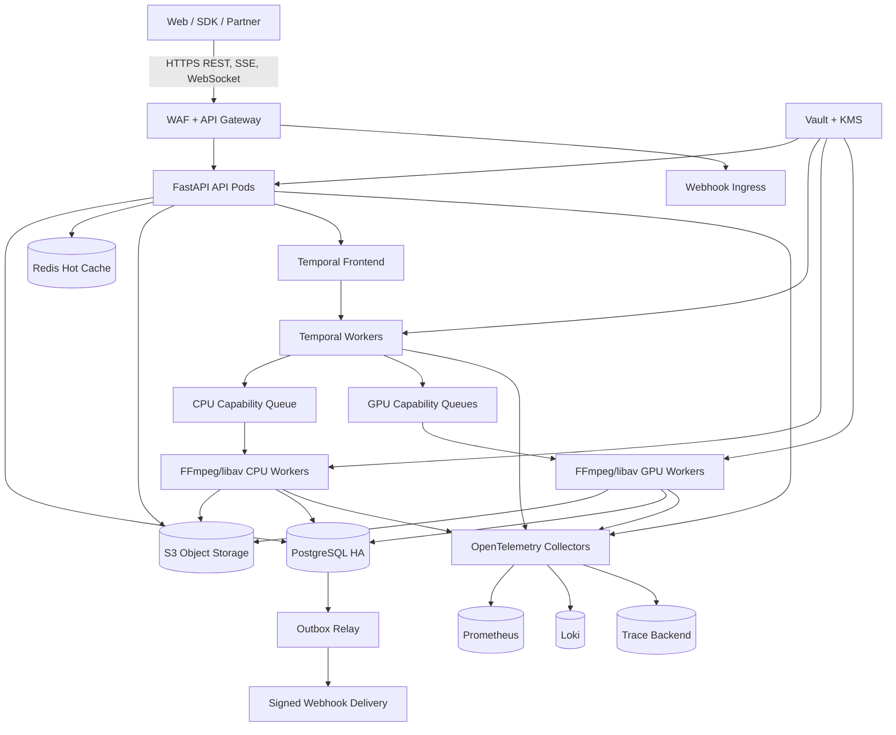

### Topoloji kararları

- API, Temporal worker ve medya worker deployment'ları ayrı ölçeklenir; API pod'u FFmpeg çalıştırmaz.
- CPU ve GPU worker'ları ayrı Kubernetes node pool'larında çalışır. GPU pool'ları codec, GPU modeli, VRAM sınıfı ve driver capability etiketiyle ayrılır.
- PostgreSQL iş/tenant/audit için source of truth'tür. Redis hiçbir kalıcı iş durumu, lock sahibi veya sonuç kaydı için source of truth olamaz.
- S3, input, intermediate checkpoint ve immutable output nesnelerini tutar. İstemci yüklemeleri kısa ömürlü signed URL ile doğrudan S3'e gider.
- Temporal workflow, uzun süren orchestration ve retry zamanlamasının sahibidir; media activity idempotent checkpoint üretir.
- Secret'lar image, Git, ConfigMap veya log içine girmez. Vault dinamik credential üretir; envelope encryption anahtarları KMS tarafından korunur.
- Tenant kimliği API'den DB session context'e, Temporal search attribute'a, S3 key prefix'e, telemetry resource attribute'a ve webhook'a taşınır.
- Bölgesel deployment hücreleri bağımsız failure domain'dir. Bir iş, açık failover kararı ve checkpoint transferi olmadan bölgeler arasında koşarken taşınmaz.

### Önerilen klasör ağacı

```text
video-engine/
|-- apps/
|   |-- api/
|   |   |-- routes/
|   |   |-- schemas/
|   |   |-- dependencies/
|   |   `-- problem_details/
|   |-- webhook_dispatcher/
|   `-- outbox_relay/
|-- domain/
|   |-- jobs/
|   |-- assets/
|   |-- tenants/
|   |-- quotas/
|   `-- audit/
|-- orchestration/
|   |-- workflows/
|   |-- activities/
|   |-- task_queues/
|   `-- recovery/
|-- workers/
|   |-- common/
|   |-- ffmpeg_cpu/
|   |-- ffmpeg_gpu/
|   |-- probes/
|   `-- checkpoints/
|-- persistence/
|   |-- models/
|   |-- repositories/
|   |-- migrations/
|   |-- partitions/
|   `-- outbox/
|-- platform/
|   |-- storage/
|   |-- cache/
|   |-- telemetry/
|   |-- security/
|   `-- admission/
|-- deploy/
|   |-- docker/
|   |-- helm/video-engine/
|   |-- environments/
|   `-- dashboards/
|-- benchmarks/
|   |-- corpus-manifest/
|   |-- scenarios/
|   |-- baselines/
|   `-- reports/
|-- tests/
|   |-- unit/
|   |-- contract/
|   |-- integration/
|   |-- golden/
|   |-- fuzz/
|   |-- chaos/
|   `-- load/
`-- docs/video-engine-sdd/
```

### Uçtan uca invariantlar

1. Her mutating public request, tenant kapsamlı `Idempotency-Key` ile tekrar edilebilir olmalıdır.
2. Bir job state değişimi PostgreSQL'de monoton `version` artırır; API `ETag: "job-{id}-v{version}"` döndürür.
3. İşin terminal sonucu yalnız doğrulanmış S3 nesnesi ve transaction içinde yazılmış terminal DB durumu birlikte mevcutsa başarılıdır.
4. Bir workflow/activity retry'si aynı logical output'u ikinci kez yayımlayamaz; object key ve publish transaction deterministiktir.
5. Redis kaybı gecikmeyi artırabilir ancak doğruluk, yetkilendirme, quota muhasebesi veya recovery'yi bozamaz.
6. Her medya subprocess'i tenant, job, attempt ve trace kimliğiyle ilişkilidir; hassas signed URL'ler process argümanları ve loglardan maskelenir.
7. Kabul edilen iş miktarı, ölçülmüş kapasite ve quota ile sınırlanır; sınırsız kuyruk sistem davranışı değildir.

---

## 58. API Design

### Mekanizma, invariantlar ve gerekçe

Public API, `/v1` altında resource-oriented REST ve asenkron job semantiği kullanır. Render oluşturma çağrısı işi çalıştırmayı beklemez; doğrulama ve admission sonrasında `202 Accepted`, `Location`, `ETag` ve izleme bağlantıları döner. Pydantic v2 modellerinde `extra="forbid"`, strict tipler, açık discriminator ve normalize edilmiş zaman/UUID kullanılır.

- `Idempotency-Key`, tenant + HTTP method + canonical route kapsamında unique'dir. Aynı key ve aynı canonical body aynı cevabı; farklı body `409 idempotency_conflict` üretir.
- `POST /jobs` atomik olarak job, idempotency kaydı ve outbox `job.accepted` olayını oluşturur. Temporal start DB transaction içinde yapılmaz; outbox/dispatcher workflow'u başlatır.
- Optimistic concurrency için `If-Match` ZORUNLUDUR; iptal veya metadata güncellemesi stale ETag ile `412 Precondition Failed` döndürür.
- Hatalar `application/problem+json` RFC 7807 biçimindedir; `type`, `title`, `status`, `detail`, `instance`, `code`, `trace_id` ve güvenli `errors[]` taşır.
- Upload/download signed URL'leri dar method, content-type, content-length, checksum, tenant prefix ve en fazla 15 dakika TTL ile üretilir.
- Liste uçları cursor pagination kullanır; cursor tenant, stable sort tuple ve filter hash içeren imzalı opaque token'dır. Offset pagination yüksek cardinality tablolarda kullanılmaz.
- Webhook body, timestamp ve delivery id üzerinde HMAC-SHA256/Ed25519 ile imzalanır. Beş dakikalık tolerans, unique delivery id ve receiver replay store beklenir.
- Progress için SSE varsayılandır; çift yönlü kontrol gereken editör oturumlarında WebSocket kullanılabilir. Her event `id`, monoton `sequence`, `job_version` taşır; `Last-Event-ID` ile devam edilir.
- Quota; eşzamanlı job, bekleyen iş, input byte, output byte, GPU-saniye ve günlük medya-dakika boyutlarında uygulanır.

Neden: HTTP retry, mobil bağlantı kopması ve proxy timeout'ları kaçınılmazdır. Idempotency ve version sözleşmesi olmadan aynı render iki kez ücretlendirilebilir veya iptal edilmiş iş yayımlanabilir.

Alternatifler ve tradeoff'lar:

- Senkron render endpoint'i basittir ancak gateway timeout, kopmuş bağlantı ve kaynak rezervasyonu nedeniyle yalnız kısa probe işlemlerinde uygundur.
- GraphQL okuma esnekliği sağlar; upload, cache, async lifecycle ve HTTP conditional request semantiği için REST daha öngörülebilirdir.
- WebSocket daha düşük etkileşim gecikmesi sunar; proxy ve reconnect karmaşıklığı nedeniyle tek yönlü progress'te SSE tercih edilir.
- Broker'a doğrudan publish düşük gecikmelidir; transactional outbox olmadan DB/publish dual-write kaybı oluşur.

### Veri akışı ve public/internal API örneği

1. İstemci `POST /v1/uploads` ile checksum ve byte boyutunu bildirir; API quota kontrol edip signed PUT üretir.
2. İstemci S3'e doğrudan yükler ve `POST /v1/uploads/{id}:complete` çağrısıyla doğrulamayı başlatır.
3. API, `POST /v1/jobs` isteğini Pydantic ile doğrular, asset ownership ve quota kontrolü yapar, transaction içinde job/idempotency/outbox yazar.
4. Outbox relay Temporal workflow'u deterministic workflow id ile başlatır.
5. Progress DB projection ve ephemeral Redis fan-out üzerinden SSE'ye ulaşır; reconnect DB'deki son sequence'dan devam eder.
6. Terminal outbox olayı webhook dispatcher'a gider; delivery her denemede aynı event id, yeni attempt ve imza taşır.

```http
POST /v1/jobs HTTP/1.1
Authorization: Bearer <token>
Idempotency-Key: 01J2EXAMPLEA7Z6J
Content-Type: application/json

{
  "input_asset_id": "ast_01J2...",
  "timeline_id": "tml_01J2...",
  "output": {"container": "mp4", "video_codec": "h264", "width": 1920, "height": 1080},
  "callback": {"webhook_id": "wh_01J2..."},
  "client_reference": "campaign-42-v7"
}
```

```http
HTTP/1.1 202 Accepted
Location: /v1/jobs/job_01J2...
ETag: "job-job_01J2-v1"
Retry-After: 2
Content-Type: application/json

{"id":"job_01J2...","status":"accepted","version":1,"links":{"events":"/v1/jobs/job_01J2.../events"}}
```

```json
{
  "type": "https://errors.example.com/quota/gpu-seconds",
  "title": "GPU kotası aşıldı",
  "status": 429,
  "detail": "Yeni GPU işi şu anda kabul edilemiyor.",
  "instance": "/v1/jobs",
  "code": "quota_gpu_seconds_exceeded",
  "trace_id": "4bf92f3577b34da6a3ce929d0e0e4736",
  "retry_after_seconds": 60
}
```

Internal worker contract versioned protobuf/JSON payload olabilir, ancak yalnız kimlikleri ve immutable plan digest'ini taşır; büyük timeline veya signed media URL queue payload'ına gömülmez.

```python
from pydantic import BaseModel, ConfigDict, Field

class StartRenderActivity(BaseModel):
    model_config = ConfigDict(extra="forbid", strict=True)
    tenant_id: str
    job_id: str
    attempt_id: str
    plan_digest: str = Field(pattern=r"^sha256:[0-9a-f]{64}$")
    capability: str
    traceparent: str
```

### Dosya/klasör organizasyonu ve render pipeline bağı

```text
apps/api/routes/{jobs,uploads,events,webhooks}.py
apps/api/schemas/{requests,responses,problems}.py
apps/api/dependencies/{auth,tenant,etag,idempotency,quota}.py
domain/jobs/{entities,commands,policies}.py
orchestration/workflows/render.py
platform/admission/service.py
```

API codec ayrıntılarını doğrudan worker flag'lerine çevirmez. Validated request önce immutable `RenderIntent`, sonra capability-aware planner tarafından versioned `RenderPlan` olur. Plan digest'i workflow ve checkpoint boyunca sabit kalır; worker yalnız bu planı FFmpeg/libav graph'ına derler.

### Mermaid sequence

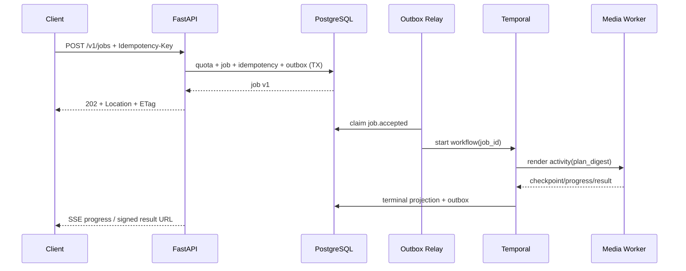

### Mermaid class

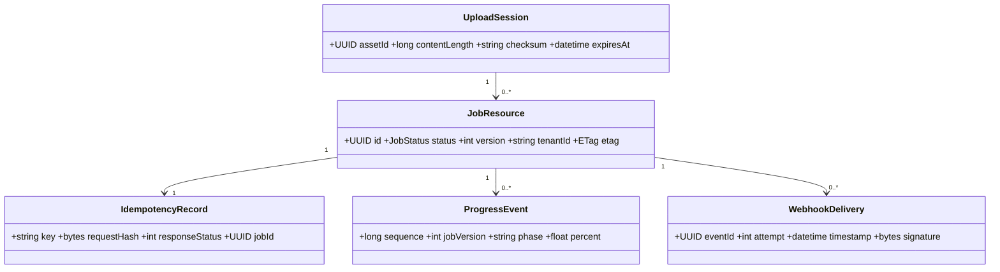

### Mermaid state

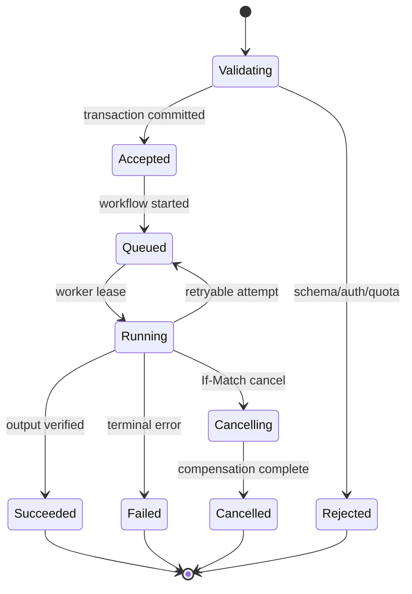

### Production sorunları, recovery ve performans

- İstemci timeout sonrası retry ederse idempotency kaydı aynı response snapshot/iş kimliğini döndürür. İlk transaction sonucu belirsizse key üzerinden GET yapılır.
- Outbox relay çökmesi job'u kaybetmez; `SKIP LOCKED`, lease expiry ve deterministic Temporal workflow id ile tekrar işler.
- SSE node değişimi event kaybettirmez; kısa hot replay Redis'ten, kalıcı gap PostgreSQL progress projection'dan doldurulur.
- Webhook endpoint yavaşsa jittered exponential backoff, per-destination circuit breaker ve dead-letter review uygulanır. Job başarısı webhook başarısına bağlı değildir.
- Signed URL sızması riskinde TTL kısa tutulur; token log redaction, object prefix policy ve KMS-backed tenant key ile blast radius sınırlandırılır.
- API latency için Pydantic schema cache, async DB pool, batched quota reads ve conditional GET kullanılır. Render payload'ları DB/API üzerinden kopyalanmaz.

### Benchmark, gerçek dünya, ölçek ve ownership

Yöntem: kayıtlı OpenAPI senaryoları ile k6/Locust; aynı tenant, çok tenant, idempotent retry fırtınası, pagination ve 100 bin SSE bağlantısı ayrı test edilir. Metrikler ve kabul eşikleri: cached GET p95 `< 100 ms`, job create p95 `< 250 ms`, p99 `< 750 ms`, API hata oranı `< %0,5`, duplicate logical job `0`, SSE event lag p99 `< 2 s`, webhook imzalama p99 `< 20 ms`. Eşikler üretim donanımı ve corpus manifest'iyle versionlanır.

Gerçek dünya senaryosu: bir mobil istemci upload tamamlandıktan sonra üç kez job create gönderir ve bağlantı değiştirir. Tek job oluşur; tüm cevaplar aynı `Location` değerini verir; progress yeni SSE bağlantısında `Last-Event-ID` ile devam eder.

Ölçeklenme: API stateless yatay ölçeklenir; tenant-rate shard edilmiş gateway limiter ve DB-backed authoritative quota kullanılır. Hot tenant için tenant concurrency cap ve weighted fair admission diğer tenant'ları korur.

Ownership: API Platform ekibi OpenAPI, auth, idempotency ve pagination; Workflow ekibi internal command; Media ekibi RenderIntent/RenderPlan sözleşmesi; SRE quota ve SLO sahibidir. Contract testleri OpenAPI breaking-change diff, idempotency race, ETag conflict, webhook signature/replay ve SSE resume senaryolarını ZORUNLU kapsar.

---

## 59. Database Schema

### Mekanizma, invariantlar ve gerekçe

PostgreSQL authoritative metadata store'dur. Her tenant-owned tabloda `tenant_id` bulunur; foreign key'ler mümkün olduğunda `(tenant_id, id)` composite key üzerinden tenant çapraz bağını fiziksel olarak engeller. Uygulama transaction başında `SET LOCAL app.tenant_id` uygular ve defense-in-depth Row Level Security kullanır. Kimlikler UUIDv7/ULID sıralanabilirliğiyle üretilir; dış kimlikler tahmin edilebilir sequence değildir.

Temel invariantlar:

- Bir job'ın state'i state machine dışında değişemez; `version` her mutasyonda tam bir artar.
- `jobs.output_asset_id`, yalnız `assets.status='verified'` olduğunda terminal success transaction'ına bağlanır.
- Aynı tenant/idempotency scope/key için tek canonical request hash vardır.
- Outbox olayı domain değişikliğiyle aynı transaction'da yazılır; relay teslimatı at-least-once, consumer etkisi idempotent'tir.
- Audit satırları append-only'dir; application role `UPDATE/DELETE` yetkisine sahip değildir.
- Monetary/usage counters float değil `bigint` tabanlı byte, frame, sample, millisecond veya micro-credit birimi kullanır.

Neden: render işlerinin dakika/saat sürmesi ve retry alması, transient queue durumunu yetersiz kılar. İlişkisel constraint'ler tenant izolasyonu, lifecycle ve faturalama doğruluğunu uygulama hatalarına karşı korur.

Alternatifler ve tradeoff'lar:

- Tam document store, değişken render spec için rahattır; lifecycle join, unique idempotency, audit ve quota transaction'larında daha zayıf/karmaşıktır.
- Event sourcing güçlü tarihçe sağlar; projection, GDPR silme ve operasyonel sorgu maliyeti yüksektir. Burada current-state + outbox + immutable audit seçilir.
- Redis job store düşük gecikmelidir ancak eviction/failover kalıcı doğruluğu bozacağından yalnız hot cache olarak kullanılır.
- Her tabloyu baştan partition etmek bakım maliyeti getirir; yalnız yüksek hacimli append tabloları partition edilir.

### Ayrıntılı schema ve indeksler

```sql
CREATE TABLE tenants (
  id uuid PRIMARY KEY,
  slug text NOT NULL UNIQUE,
  status text NOT NULL CHECK (status IN ('active','suspended','deleting')),
  home_region text NOT NULL,
  created_at timestamptz NOT NULL DEFAULT now()
);

CREATE TABLE jobs (
  tenant_id uuid NOT NULL REFERENCES tenants(id),
  id uuid NOT NULL,
  status text NOT NULL CHECK (status IN
    ('accepted','queued','running','cancelling','cancelled','succeeded','failed')),
  version integer NOT NULL DEFAULT 1 CHECK (version > 0),
  priority smallint NOT NULL DEFAULT 50 CHECK (priority BETWEEN 0 AND 100),
  input_asset_id uuid NOT NULL,
  output_asset_id uuid,
  render_spec jsonb NOT NULL,
  plan_digest text,
  capability_key text,
  progress_sequence bigint NOT NULL DEFAULT 0,
  error_code text,
  client_reference text,
  accepted_at timestamptz NOT NULL DEFAULT now(),
  started_at timestamptz,
  finished_at timestamptz,
  deleted_at timestamptz,
  PRIMARY KEY (tenant_id, id),
  CHECK ((status = 'succeeded') = (output_asset_id IS NOT NULL)),
  CHECK (finished_at IS NULL OR started_at IS NULL OR finished_at >= started_at)
);
CREATE INDEX jobs_tenant_status_priority_idx
  ON jobs (tenant_id, status, priority DESC, accepted_at, id)
  WHERE deleted_at IS NULL;
CREATE INDEX jobs_active_capability_idx
  ON jobs (capability_key, priority DESC, accepted_at)
  WHERE status IN ('accepted','queued','running');
CREATE UNIQUE INDEX jobs_client_reference_uq
  ON jobs (tenant_id, client_reference) WHERE client_reference IS NOT NULL AND deleted_at IS NULL;

CREATE TABLE assets (
  tenant_id uuid NOT NULL,
  id uuid NOT NULL,
  kind text NOT NULL CHECK (kind IN ('input','intermediate','output','thumbnail','manifest')),
  status text NOT NULL CHECK (status IN ('pending','uploaded','verifying','verified','quarantined','deleted')),
  bucket text NOT NULL,
  object_key text NOT NULL,
  version_id text,
  size_bytes bigint NOT NULL CHECK (size_bytes >= 0),
  sha256 bytea NOT NULL,
  media_type text NOT NULL,
  probe jsonb,
  kms_key_ref text NOT NULL,
  retention_until timestamptz,
  created_at timestamptz NOT NULL DEFAULT now(),
  PRIMARY KEY (tenant_id, id),
  UNIQUE (tenant_id, bucket, object_key, version_id),
  FOREIGN KEY (tenant_id) REFERENCES tenants(id)
);
ALTER TABLE jobs ADD CONSTRAINT jobs_input_asset_fk
  FOREIGN KEY (tenant_id, input_asset_id) REFERENCES assets(tenant_id, id);
ALTER TABLE jobs ADD CONSTRAINT jobs_output_asset_fk
  FOREIGN KEY (tenant_id, output_asset_id) REFERENCES assets(tenant_id, id);

CREATE TABLE idempotency_records (
  tenant_id uuid NOT NULL,
  scope text NOT NULL,
  key text NOT NULL,
  request_hash bytea NOT NULL,
  resource_id uuid,
  response_status smallint,
  response_body jsonb,
  created_at timestamptz NOT NULL DEFAULT now(),
  expires_at timestamptz NOT NULL,
  PRIMARY KEY (tenant_id, scope, key),
  CHECK (expires_at > created_at)
);

CREATE TABLE job_attempts (
  tenant_id uuid NOT NULL,
  job_id uuid NOT NULL,
  attempt_no integer NOT NULL CHECK (attempt_no > 0),
  worker_id text,
  node_name text,
  capability_key text NOT NULL,
  checkpoint_asset_id uuid,
  status text NOT NULL CHECK (status IN ('leased','running','retryable_failed','terminal_failed','completed','lost')),
  error_class text,
  metrics jsonb,
  started_at timestamptz NOT NULL,
  heartbeat_at timestamptz,
  finished_at timestamptz,
  PRIMARY KEY (tenant_id, job_id, attempt_no),
  FOREIGN KEY (tenant_id, job_id) REFERENCES jobs(tenant_id, id)
);

CREATE TABLE outbox_events (
  shard smallint NOT NULL,
  id uuid NOT NULL,
  tenant_id uuid NOT NULL,
  aggregate_type text NOT NULL,
  aggregate_id uuid NOT NULL,
  aggregate_version integer NOT NULL,
  event_type text NOT NULL,
  payload jsonb NOT NULL,
  trace_context jsonb NOT NULL,
  occurred_at timestamptz NOT NULL DEFAULT now(),
  available_at timestamptz NOT NULL DEFAULT now(),
  claimed_until timestamptz,
  published_at timestamptz,
  attempts integer NOT NULL DEFAULT 0,
  PRIMARY KEY (shard, occurred_at, id),
  UNIQUE (tenant_id, aggregate_type, aggregate_id, aggregate_version, event_type)
) PARTITION BY RANGE (occurred_at);

CREATE TABLE audit_log (
  occurred_at timestamptz NOT NULL,
  id uuid NOT NULL,
  tenant_id uuid NOT NULL,
  actor_type text NOT NULL,
  actor_id text NOT NULL,
  action text NOT NULL,
  resource_type text NOT NULL,
  resource_id text NOT NULL,
  request_id text,
  source_ip inet,
  before_hash bytea,
  after_hash bytea,
  metadata jsonb NOT NULL DEFAULT '{}'::jsonb,
  PRIMARY KEY (occurred_at, id)
) PARTITION BY RANGE (occurred_at);
```

Ek tablolar: `webhook_endpoints`, `webhook_deliveries`, `quota_limits`, `usage_ledger`, `workflow_bindings`, `progress_events`, `schema_migrations`, `legal_holds`. `progress_events`, `audit_log`, `usage_ledger` ve `outbox_events` aylık/günlük hacme göre time partition; `jobs` ise ancak yüz milyonlar seviyesinde tenant hash partition'a geçirilir.

JSONB kullanımı:

- Kullanılır: versioned `render_spec`, ffprobe çıktısının sorgulanmayan/seyrek sorgulanan kısmı, attempt diagnostic metrics, event payload ve audit metadata.
- Kullanılmaz: tenant id, job status, timestamps, codec/capability routing alanları, quota counters, object key, lifecycle relation ve sık filtrelenen billing boyutları.
- Sık sorgulanan JSON alanı generated column veya normal kolona promote edilir. Geniş `GIN(render_spec)` varsayılan değildir; yazma amplifikasyonu ve bloat nedeniyle yalnız kanıtlanmış query için expression index eklenir.

### Veri akışı ve repository API örneği

1. API transaction, idempotency satırını conflict-safe insert eder.
2. Asset ownership ve quota ledger satırları tenant kapsamında kilitlenir/atomic update edilir.
3. Job ve `job.accepted` outbox satırı yazılır, commit edilir.
4. Relay partition/shard bazında `FOR UPDATE SKIP LOCKED` ile batch claim eder.
5. Worker heartbeat ve yüksek frekanslı progress'i her frame yazmaz; coalesced projection günceller, attempt terminal özeti kalıcılaştırır.
6. Success transaction asset'i verified, job'ı succeeded ve usage ledger/outbox'ı aynı atomik sınırda yazar.

```sql
UPDATE jobs
SET status = 'cancelling', version = version + 1
WHERE tenant_id = $1 AND id = $2 AND version = $3
  AND status IN ('accepted','queued','running')
RETURNING id, status, version;
-- Satır yoksa 404 değil önce existence kontrolüyle 404/412/409 ayrıştırılır.
```

Migration politikası expand/migrate/contract'tır. Önce nullable/yeni tablo ve geriye uyumlu kod; sonra chunked backfill ve doğrulama; en son `NOT NULL`, constraint validation ve eski kolon kaldırma yapılır. Büyük constraint `NOT VALID` eklenip ayrı deploy'da `VALIDATE CONSTRAINT` edilir. DDL lock bütçesi, statement timeout ve rollback/runbook migration dosyasına yazılır; app startup migration çalıştırmaz.

### Dosya/klasör organizasyonu ve render pipeline bağı

```text
persistence/models/{job,asset,attempt,outbox,audit}.py
persistence/repositories/{jobs,assets,quotas}.py
persistence/migrations/versions/*.sql
persistence/partitions/{create,retain,archive}.py
persistence/outbox/{relay,consumer_dedup}.py
tests/integration/postgres/
```

Pipeline, büyük frame/audio verisini DB'ye yazmaz. DB yalnız plan digest, checkpoint pointer, media probe özeti, usage ve lifecycle tutar. Intermediate segmentler S3'te immutable'dır; schema bunların checksum ve retention bağını saklar.

### Mermaid sequence

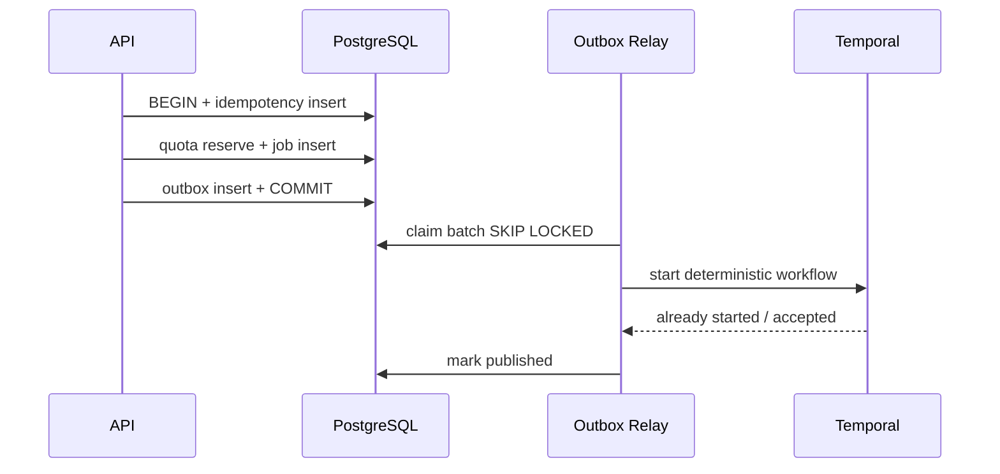

### Mermaid class

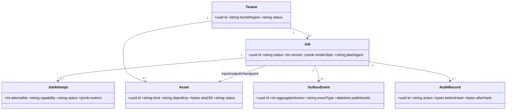

### Mermaid state

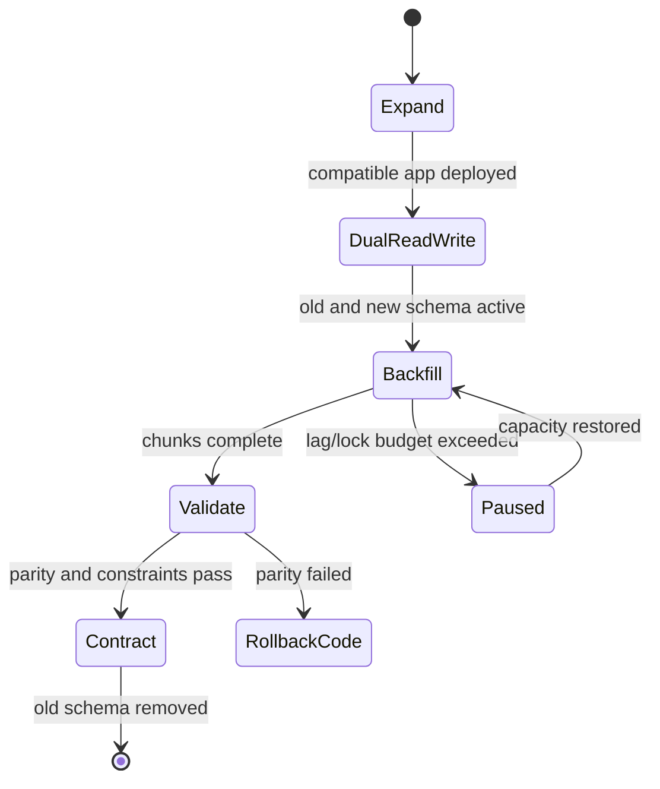

### Production sorunları, recovery ve performans

- Connection storm için PgBouncer transaction pooling, sınırlı app pool ve admission uygulanır. Session-level tenant state yerine her transaction `SET LOCAL` kullanır.
- Replica lag nedeniyle job state read-after-write primary veya version-aware session route üzerinden okunur; stale replica terminal sonucu gizleyemez.
- Bloat/autovacuum geride kalırsa append partition rotate edilir, hot update index sayısı azaltılır ve vacuum per-table ayarlanır.
- Deadlock durumunda transaction kısa, lock order sabit ve serialization/deadlock retry bounded jitter ile yapılır.
- Partition oluşturma hatası yazmayı kesmemelidir; önceden N dönem yaratılır, default emergency partition alarm üretir.
- PITR; WAL archive, encrypted cross-region backup ve düzenli restore drill ile doğrulanır. Logical silme/retention ve legal hold ayrı policy'dir.
- Query performansı `pg_stat_statements`, `EXPLAIN (ANALYZE, BUFFERS)`, lock wait ve index hit ratio ile izlenir. N+1 ve geniş JSONB select engellenir.

### Benchmark, gerçek dünya, ölçek ve ownership

Yöntem: üretime benzer cardinality ile pgbench/custom replay; 10 milyon job, 1 milyar progress/audit satırı, hot tenant ve relay concurrency senaryoları. Eşikler: create transaction p95 `< 40 ms`, state transition p95 `< 25 ms`, job lookup p99 `< 50 ms`, outbox publish lag p99 `< 2 s`, lock wait p99 `< 20 ms`, duplicate aggregate event `0`, restore point objective doğrulaması RPO `<= 5 dk`.

Gerçek dünya: tek tenant bir kampanya anında 500 bin job yollar. Composite tenant/status index ve weighted admission taramayı sınırlarken outbox shard'ları paralel akar; tenant kota satırı global mutex olmaması için zaman kovalarına bölünür.

Ölçeklenme: önce vertical primary + read replicas + partitioning; write sınırında tenant-home-region/hücre bazlı PostgreSQL cluster shard'ı. Cross-shard join public request yolunda yapılmaz; global admin raporu async warehouse projection kullanır.

Ownership: Data Platform schema/migration/backup; domain ekipleri tablo semantiği; SRE capacity ve restore; Security audit/RLS politikasının sahibidir. Her migration CI'da boş DB, önceki release upgrade, downgrade/runbook, lock-budget ve veri parity testinden geçer.

---

## 60. Docker

### Mekanizma, invariantlar ve gerekçe

API, orchestration, CPU worker ve GPU worker için ayrı, multi-stage ve digest ile pinlenmiş image'lar üretilir. FFmpeg/libav binary'si build aşamasında belirli source revision, configure flags ve codec lisans manifest'iyle derlenir; runtime image'a yalnız gerekli shared library ve CA bundle taşınır.

- CPU image ve GPU image aynı `RenderPlan` contract version'ını uygular; capability farkı image label ve startup self-test ile ilan edilir.
- GPU image matrisi `CUDA major.minor + minimum driver + FFmpeg revision + codec SDK` olarak kilitlenir. Kubernetes node driver'ı image'ın minimum driver şartını sağlamıyorsa pod Ready olmaz.
- Container rootless, read-only root filesystem, dropped capabilities, `no-new-privileges`, seccomp/AppArmor ve explicit tmpfs ile çalışır.
- Image içinde secret, cloud credential, model lisans anahtarı veya writable cache bulunmaz.
- Her release OCI provenance, CycloneDX/SPDX SBOM, vulnerability scan ve cosign signature taşır.
- Floating tag (`latest`, unpinned distro/package) üretimde yasaktır; deployment image digest kullanır.

Neden: medya stack'i sistem library, codec patent/lisansı ve GPU driver ABI'sine hassastır. Aynı application commit'i farklı FFmpeg build'iyle farklı frame veya crash üretebilir; image supply-chain ve codec build'i birlikte reproducible olmalıdır.

Alternatifler ve tradeoff'lar:

- Tek universal image operasyonu basitleştirir fakat GPU kütüphaneleri CPU pod'larını büyütür, saldırı yüzeyi ve pull süresi artar.
- Distro FFmpeg güvenlik güncellemesini kolaylaştırır; configure flags/version kontrolü ve bit-exact baseline zorlaşır.
- Distroless küçüktür; FFmpeg shared library ve üretim debug araçları için sıkça zorlayıcıdır. Minimal Debian/Ubuntu runtime + ayrı debug image dengeli çözümdür.
- Static FFmpeg dependency drift'i azaltır; glibc, codec plugin ve lisans gereksinimleri doğrulanmadan varsayılan yapılmaz.

### Build/data flow ve image sözleşmesi örneği

1. BuildKit hermetic builder, lockfile ve checksum doğrulanmış kaynaklarla FFmpeg/libav üretir.
2. Unit test stage binary capability ve linked library manifest'ini kontrol eder.
3. Runtime stage non-root UID, worker binary, FFmpeg ve policy dosyalarını alır.
4. CI image'ı tarar, SBOM/provenance üretir, imzalar ve immutable registry'ye push eder.
5. Admission controller yalnız trusted issuer ve izinli digest'i cluster'a alır.
6. Worker başlangıçta `ffmpeg -buildconf`, encoder probe ve kısa encode/decode self-test sonucu capability registry'ye yazar.

```dockerfile
# syntax=docker/dockerfile:1.7
FROM debian:bookworm@sha256:<builder-digest> AS ffmpeg-build
ARG FFMPEG_REF=n7.0.1
RUN --mount=type=cache,target=/var/cache/apt \
    ./build-ffmpeg.sh --ref "$FFMPEG_REF" --enable-libx264 --disable-debug

FROM python:3.12-slim-bookworm@sha256:<runtime-digest> AS app-build
RUN --mount=type=cache,target=/root/.cache/pip pip wheel --require-hashes -r requirements.lock -w /wheels

FROM python:3.12-slim-bookworm@sha256:<runtime-digest>
RUN groupadd -g 10001 engine && useradd -r -u 10001 -g engine engine
COPY --from=ffmpeg-build /opt/ffmpeg /opt/ffmpeg
COPY --from=app-build /wheels /wheels
COPY workers /app/workers
USER 10001:10001
ENV PATH="/opt/ffmpeg/bin:${PATH}" PYTHONUNBUFFERED=1
ENTRYPOINT ["python", "-m", "workers.ffmpeg_cpu"]
```

Image label sözleşmesi:

```text
org.opencontainers.image.revision=<git-sha>
video.example.com/ffmpeg.revision=n7.0.1
video.example.com/render-plan.version=6
video.example.com/capabilities=h264-sw,aac,scale-zimg
video.example.com/min-driver=550.54
video.example.com/sbom.digest=sha256:...
```

### Dosya/klasör organizasyonu ve render pipeline bağı

```text
deploy/docker/{Dockerfile.api,Dockerfile.worker-cpu,Dockerfile.worker-gpu,Dockerfile.debug}
deploy/docker/scripts/{build-ffmpeg,verify-libs,self-test}.sh
deploy/docker/locks/{sources.lock,apt.snapshot,python.lock}
deploy/docker/policies/{seccomp.json,licenses.yaml}
tests/container/{capabilities,nonroot,readonly,sbom}.py
```

Render planner yalnız registry'de self-test geçmiş capability'lere plan yollar. FFmpeg configure flag veya encoder değişikliği render output baseline'ını etkilediğinden application değişikliği kadar versionlanır.

### Mermaid sequence

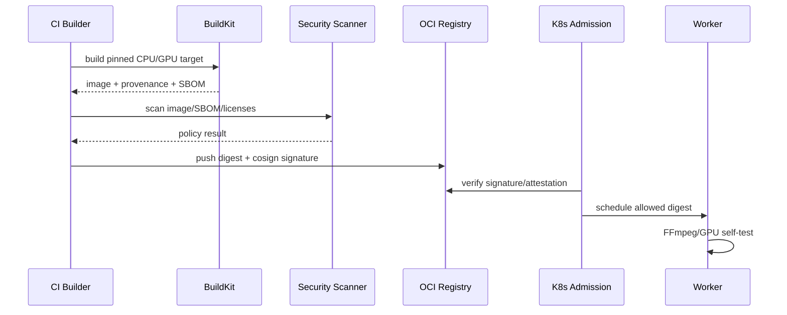

### Mermaid class

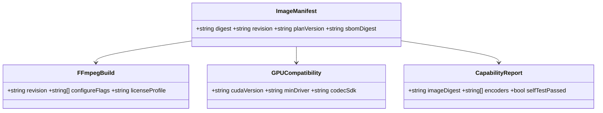

### Mermaid state

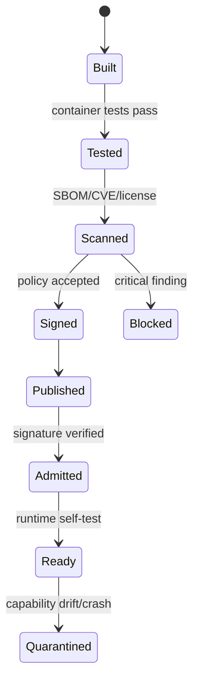

### Production sorunları, recovery ve performans

- Driver mismatch pod crash-loop üretirse readiness capability probe başarısız olur, node taint edilir ve önceki signed digest'e rollout edilir.
- Registry kesintisine karşı node image cache tek recovery değildir; bölgesel registry replication ve pull-through mirror kullanılır.
- CVE bulunduğunda exploitability + reachable component değerlendirilir; critical reachable bulgu için rebuild/canary ve digest rollout, değişmeyen source revision ile yapılabilir.
- Read-only filesystem için FFmpeg temp path bounded `emptyDir`/tmpfs'tir; kapasite limiti aşılırsa job retryable resource error alır.
- Büyük image pull startup gecikmesini artırır; CPU/GPU katmanları ayrılır, gereksiz compiler/header silinir, node pre-pull DaemonSet canary öncesi çalışır.
- Core dump varsayılan kapalıdır; kontrollü debug image ve encrypted dump store yalnız incident policy ile açılır.

### Benchmark, gerçek dünya, ölçek ve ownership

Yöntem: cold/warm pull, startup self-test, image size, CVE count, encode throughput parity ve binary reproducibility karşılaştırılır. Eşikler: API image `< 300 MB`, CPU worker `< 800 MB`, GPU worker organization baseline'ına göre takip edilir; cold start readiness CPU `< 20 s`, pre-pulled GPU `< 30 s`; critical reachable CVE `0`; aynı source/build input için manifest dışı binary drift `0`; codec smoke corpus başarı `%100`.

Gerçek dünya: CUDA base image güncellenir ancak cluster driver eski kalır. Compatibility attestation ve startup probe rollout'u bloke eder; scheduler işleri eski healthy digest/capability pool'una yönlendirir.

Ölçeklenme: registry bölgesel mirror, layer dedup, pre-pull ve küçük specialization image'larıyla yüzlerce node aynı anda açılabilir. Capability image sayısı kontrolsüz kombinatoryal büyütülmez; desteklenen codec/GPU matrisi ürün SLO'suna göre sınırlanır.

Ownership: Developer Platform base image/BuildKit; Media Runtime FFmpeg flags ve codec lisansı; GPU Platform driver matrisi; Security SBOM/signing/CVE policy; SRE registry ve rollout sahibidir. Container contract testleri rootless, read-only, signal handling, graceful shutdown, capability truthfulness ve output parity içerir.

---

## 61. Monitoring

### Mekanizma, invariantlar ve gerekçe

OpenTelemetry trace/metric/log correlation katmanıdır. Prometheus sayısal zaman serilerini, Loki yapılandırılmış logları, trace backend span'leri tutar. API için RED (Rate, Errors, Duration), altyapı ve worker için USE (Utilization, Saturation, Errors), medya pipeline için frame/audio/codec özel sinyalleri birlikte kullanılır.

- Her request/job/workflow/activity/FFmpeg process `trace_id`, `tenant_hash`, `job_id`, `attempt_id`, `region`, `capability`, `image_digest` ile ilişkilidir.
- Raw tenant adı, signed URL, token, timeline içeriği ve kullanıcı dosya adı label/log olamaz.
- Prometheus label cardinality bounded'dır; `job_id` ve `asset_id` metric label değil trace/log field'dır.
- Workflow trace context, Temporal memo/search attribute'a minimum W3C `traceparent` olarak taşınır; retry yeni span, aynı logical trace linkage üretir.
- FFmpeg child process span'i komutun sanitize edilmiş template'ini, build revision'ı, progress parser sonuçlarını ve exit classification'ı taşır.
- Alert, tek düşük seviye metrikten değil kullanıcı etkisi/SLO burn-rate ve semptom-kapasite korelasyonundan üretilir.

Neden: yalnız CPU metriği, bozuk timestamp veya encoder stall'ını göstermez; yalnız log ise trend ve SLO üretmez. Correlated telemetry bir job'ın API kabulünden codec subprocess'ine kadar gecikme dağılımını görünür kılar.

Alternatifler ve tradeoff'lar:

- Her frame için log/metric kesin görünürlük sağlar ancak maliyet ve cardinality kabul edilemez; worker aggregation + sampled detail seçilir.
- Vendor agent hızlı kurulur; açık OTel semantic conventions taşınabilirliği ve merkezi redaction sağlar.
- Tail sampling hata/yavaş trace'leri korur fakat collector state maliyeti vardır; head sampling tek başına nadir codec hatalarını kaçırır.

### Veri akışı ve telemetry API örneği

1. Gateway W3C trace context'i doğrular veya yeni root trace oluşturur.
2. FastAPI span'i DB, S3 ve outbox child span'leri üretir.
3. Temporal interceptor context'i workflow/activity'ye taşır; replay sırasında nondeterministic telemetry workflow kararına etki etmez.
4. Worker sanitized FFmpeg process span'i açar; `-progress pipe:1` key/value akışını parser.
5. OTel Collector attribute processor hassas alanları siler, tail sampler hata/yavaş trace'i tutar.
6. Metrics Prometheus remote-write, logs Loki, traces backend'e gider; exemplars metric noktasını trace'e bağlar.

```text
http.server.request.duration{route="/v1/jobs",status_class="2xx"}
render.queue.wait.seconds{capability="nvenc-h264",priority_class="standard"}
render.realtime_factor{codec="h264",resolution="1080p",path="gpu"}
render.frames.total{result="encoded|dropped|duplicated"}
render.audio.samples.total{result="processed|clipped|silent"}
render.ffmpeg.exit.total{class="input|resource|codec|internal|cancelled"}
render.checkpoint.age.seconds{phase="encode"}
node.gpu.vram.utilization{gpu_model="..."}
```

```python
with tracer.start_as_current_span("ffmpeg.encode") as span:
    span.set_attributes({
        "media.ffmpeg.revision": FFMPEG_REVISION,
        "media.plan.digest": plan_digest,
        "media.codec": codec,
        "render.attempt_id": attempt_id,
    })
    result = await run_ffmpeg(progress_callback=record_aggregated_progress)
    span.set_attribute("process.exit.code", result.exit_code)
```

SLO örnekleri: API accepted-job availability `%99,95`; job dispatch latency p99 `< 30 s` standard queue; platform kaynaklı terminal failure `< %0,2`; progress freshness p99 `< 5 s`; webhook first-attempt dispatch p99 `< 10 s`. Render completion süresi input karmaşıklığına bağlı olduğundan resolution/codec/duration sınıfına göre SLO dilimlenir.

### Dosya/klasör organizasyonu ve render pipeline bağı

```text
platform/telemetry/{bootstrap,attributes,redaction,sampling}.py
workers/common/{ffmpeg_progress,process_span,metric_aggregation}.py
deploy/dashboards/{api,workflow,worker,gpu,media-quality}.json
deploy/alerts/{slo,capacity,codec,storage}.yaml
deploy/otel-collector/{gateway,agent}.yaml
tests/contract/telemetry/
```

Pipeline phase'leri `probe`, `download`, `decode`, `filter`, `compose`, `encode`, `upload`, `verify`, `publish` ortak span/metric adlarını kullanır. Böylece plan değişse de kritik yol ve bottleneck karşılaştırılabilir.

### Mermaid sequence

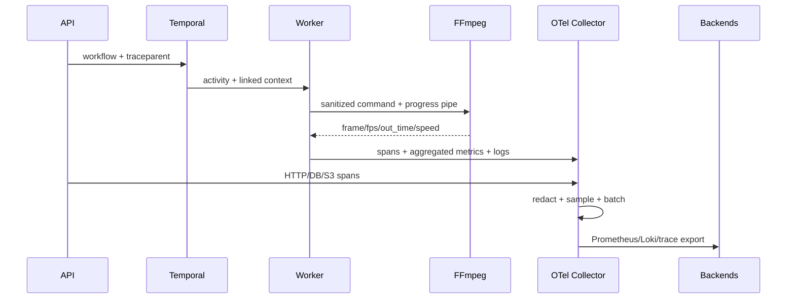

### Mermaid class

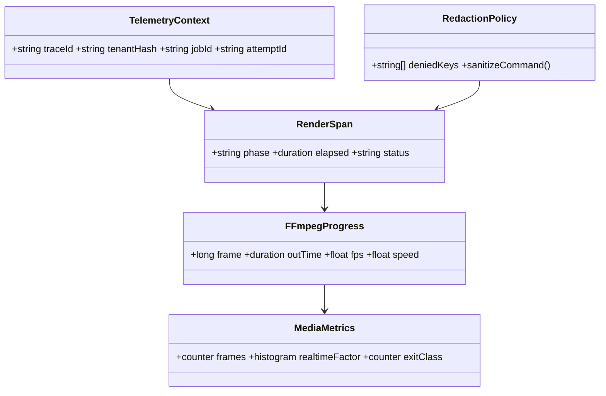

### Mermaid state

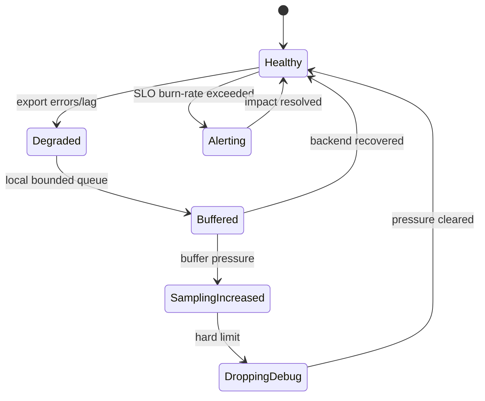

### Production sorunları, recovery ve performans

- Collector/back-end kesintisi render'ı durdurmaz; bounded memory/disk queue, priority sampling ve telemetry drop counters kullanılır. Telemetry backpressure media path'e aktarılmaz.
- Cardinality patlamasında offending label collector'da drop edilir, dashboard query sınırlandırılır ve recording rule ile aggregation yapılır.
- FFmpeg stderr burst'leri line/rate limit ve dedup fingerprint ile yönetilir; ilk/son bağlam korunur, signed URL maskelenir.
- Clock skew span sırasını bozarsa node NTP alarmı ve monotonic process duration kullanılır.
- Stuck job tespiti yalnız progress yüzdesine dayanmaz; heartbeat, CPU/GPU utilization, I/O bytes ve checkpoint age birlikte değerlendirilir.
- Telemetry overhead, worker CPU'nun `%2` ve job wall time'ın `%1` altında tutulur; high-frequency değerler process içinde aggregate edilir.

### Benchmark, gerçek dünya, ölçek ve ownership

Yöntem: telemetry açık/kapalı A/B, collector failure, cardinality bomb, log burst ve tail-sampling load testleri. Eşikler: span export success `> %99,9` normal durumda, metric scrape freshness `< 30 s`, log ingestion p99 `< 10 s`, trace-to-log correlation başarı `> %99`, worker CPU overhead `< %2`, dropped error traces `0`, page alert MTTD `< 5 dk`.

Gerçek dünya: belirli bir GPU driver sürümünde NVENC process'i exit vermeden ilerlemeyi keser. `ffmpeg_progress_age`, GPU utilization düşüşü ve checkpoint age alarmı aynı image/driver boyutunda kümelenir; worker watchdog process'i sonlandırıp retryable infrastructure hatası sınıflandırır.

Ölçeklenme: agent collector node-local batching, gateway collector tail sampling yapar. Metric recording rule ve tenant hash örneklemesi backend'i korur; yüksek hacimli debug log kısa retention, audit log ayrı immutable store/policy kullanır.

Ownership: Observability Platform collector/schema/backend; SRE SLO ve paging; Media Runtime media metric semantiği; Security redaction/audit; domain ekipleri dashboard/runbook sahibidir. Telemetry contract testleri zorunlu attribute, secret redaction, trace propagation, retry span linkage ve cardinality budget kontrolü yapar.

---

## 62. Performance Profiling

### Mekanizma, invariantlar ve gerekçe

Profiling, render süresini tek bir "FFmpeg yavaş" sonucuna indirgemek yerine wall-clock, CPU, GPU, disk/network I/O, queue wait ve scheduler throttling bileşenlerine ayırır. Her profil `image_digest`, FFmpeg revision/configuration, RenderPlan digest, corpus case, node tipi, GPU/driver, concurrency, warm/cold cache durumu ve profiler sürümü içeren immutable bir manifest ile saklanır.

- Profiling üretimde varsayılan olarak kapalı veya düşük oranlıdır; tenant/job hedefli açma yetkisi audit edilir, süre ve overhead bütçesiyle otomatik sona erer.
- Profiling sonucu iş davranışını değiştiremez. Profiler çökmesi render'ı başarısız yapmaz; yalnız profile artifact'i incomplete işaretlenir.
- Wall time her pipeline phase için monotonic clock ile ölçülür. CPU time, cgroup throttling ve runnable wait ayrı tutulur; `%CPU` tek başına bottleneck kanıtı değildir.
- GPU kernel/encoder/decode süreleri ile host-to-device/device-to-host transferleri ayrılır. GPU utilization yüksekliği tek başına verimli throughput anlamına gelmez.
- I/O ölçümü logical media byte, S3 transfer byte, local spill byte, read/write latency ve stall time olarak ayrılır.
- Profil artifact'lerinde signed URL, token, müşteri dosya adı, frame içeriği ve environment secret bulunamaz. Flamegraph sembolleri ve command line sanitize edilir.
- İki profil ancak aynı benchmark manifest'i ve toleranslı eşdeğer runtime sınıfında karşılaştırılır; farklı codec preset'i veya driver sonucu aynı baseline'a karıştırılmaz.

Neden: bir render'ın wall süresi; queue wait, input indirme, decode, filter graph, encode, upload ve throttling toplamıdır. Yalnız örnekleme profiler'ı CPU hot path'i bulabilir ama S3 stall'ını; yalnız GPU aracı kernel beklemesini bulabilir ama Python orchestration gecikmesini açıklamaz. Katmanlı profil, optimizasyonun doğru kaynağa uygulanmasını sağlar.

Alternatifler ve tradeoff'lar:

- Instrumentation profiler kesin phase süreleri verir ancak kod değişikliği ve ölçüm overhead'i getirir; sampling profiler daha düşük müdahaleyle hot stack bulur fakat kısa çağrıları kaçırabilir. İkisi birlikte kullanılır.
- `perf`/eBPF düşük seviyede güçlüdür; kernel capability ve sembol yönetimi ister. Üretimde ayrı privileged profiler DaemonSet'i, worker container'ına ek capability vermekten daha güvenlidir.
- Full GPU trace ayrıntılıdır ancak yüksek overhead ve büyük artifact üretir; CI/lab için, üretimde NVML/DCGM sayaçları ve hedefli kısa trace tercih edilir.
- FFmpeg `-benchmark_all` aşama bilgisi sağlar ancak log hacmini artırır ve tüm filtrelerde tutarlı ayrım sunmaz; `-progress pipe:1`, process rusage ve OTel phase span'leriyle korele edilir.
- Continuous profiling regresyonu erken yakalar; maliyet ve veri güvenliği nedeniyle symbol-only, düşük örneklemeli ve tenant-safe politika gerektirir.

### Veri akışı ve internal API/schema örneği

1. Benchmark runner veya yetkili operatör, job/corpus case için süreli bir `ProfileSession` oluşturur.
2. Policy service, ortam ve tenant politikasına göre izin verilen profiler'ları, maksimum süreyi ve overhead bütçesini belirler.
3. Worker render başlamadan manifest'e runtime fingerprint yazar; OTel span ve profiler session aynı `attempt_id` ile bağlanır.
4. FFmpeg `-benchmark`, gerektiğinde `-benchmark_all`, `-progress pipe:1` ve `-stats_period` ile çalışır. Wrapper process rusage, cgroup CPU/memory/I/O ve context-switch değerlerini toplar.
5. GPU agent NVML/DCGM; hedefli laboratuvar koşusunda Nsight Systems/Compute verisini toplar. Node agent disk/network eBPF özetini ilişkilendirir.
6. Artifact'ler sanitize edilip sıkıştırılır, checksum ile S3'e yazılır; PostgreSQL'e yalnız manifest, özet ve object pointer kaydedilir.
7. Analyzer kritik yol, flamegraph, phase breakdown ve baseline delta üretir; sonucu benchmark raporuna bağlar.

```python
from datetime import datetime
from typing import Literal
from pydantic import BaseModel, ConfigDict, Field

class ProfileSessionSpec(BaseModel):
    model_config = ConfigDict(extra="forbid", strict=True)
    target_attempt_id: str
    mode: Literal["phase", "cpu-sample", "io", "gpu-sample", "gpu-trace"]
    duration_seconds: int = Field(ge=5, le=300)
    sample_hz: int = Field(default=49, ge=1, le=199)
    include_native_stacks: bool = True
    expires_at: datetime

class ProfileSummary(BaseModel):
    wall_ms: int
    cpu_user_ms: int
    cpu_system_ms: int
    cpu_throttled_ms: int
    io_wait_ms: int
    gpu_active_ms: int | None
    ffmpeg_utime_ms: int
    ffmpeg_stime_ms: int
    max_rss_bytes: int
    artifact_sha256: str
```

Internal uçlar public internete açılmaz: `POST /internal/v1/profile-sessions`, `GET /internal/v1/profile-sessions/{id}` ve `POST /internal/v1/profile-sessions/{id}:cancel`. Çağrılar mTLS workload identity, role, environment allowlist ve audit ile korunur. Profil DB kaydı örneği:

```sql
CREATE TABLE profile_runs (
  id uuid PRIMARY KEY,
  tenant_id uuid,
  job_id uuid,
  attempt_id text NOT NULL,
  mode text NOT NULL,
  runtime_fingerprint jsonb NOT NULL,
  summary jsonb,
  artifact_bucket text,
  artifact_key text,
  artifact_sha256 bytea,
  status text NOT NULL CHECK (status IN ('requested','collecting','analyzing','completed','incomplete','rejected')),
  expires_at timestamptz NOT NULL,
  created_by text NOT NULL,
  created_at timestamptz NOT NULL DEFAULT now()
);
```

### Dosya/klasör organizasyonu ve render pipeline bağı

```text
platform/profiling/{policy,sessions,manifest,sanitizer}.py
workers/common/profiling/{phase_timer,rusage,ffmpeg_benchmark}.py
workers/probes/{cpu_sampler,io_sampler,gpu_sampler}.py
benchmarks/analyzers/{critical_path,flamegraph,baseline_delta}.py
deploy/profilers/{ebpf-daemonset,dcgm,nvidia-tools}.yaml
tests/performance/profiling/
```

Render pipeline'daki `probe`, `download`, `decode`, `filter`, `compose`, `encode`, `upload`, `verify` ve `publish` sınırları profil phase id'leriyle bire bir eşleşir. FFmpeg tek process içinde birden çok phase çalıştırsa bile filter graph node isimleri, progress zamanı ve libav instrumentation ile alt kırılım üretilir. Profil sonucu planner'ın maliyet modelini besleyebilir; ancak yeni model offline doğrulanıp versionlanmadan canlı admission kararını değiştiremez.

### Mermaid sequence

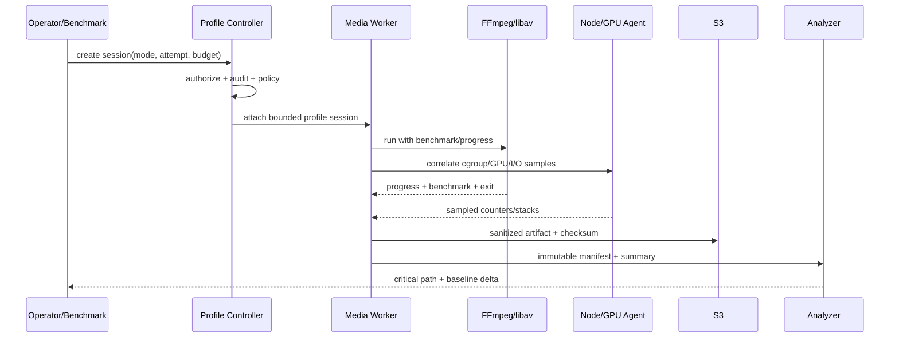

### Mermaid class

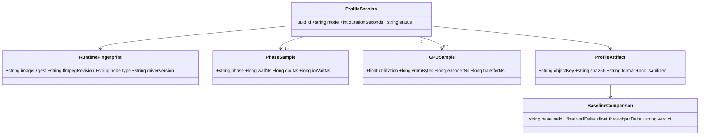

### Mermaid state

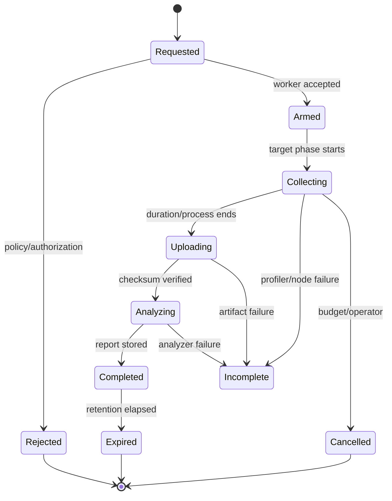

### Production sorunları, recovery ve performans optimizasyonları

- Profiler overhead'i budget'ı aşarsa controller session'ı sonlandırır; render devam eder ve artifact `incomplete/overhead_guard` olur.
- Native stack sembolleri eksikse build-id üzerinden ayrı debug symbol image/store kullanılır; production image'a compiler/debug paketi eklenmez.
- PID namespace veya kısa ömürlü FFmpeg process'i attach yarışına yol açarsa worker process'i suspended başlatmak yerine profiler önceden cgroup'a bağlanır; başarısız attach render'ı geciktirmez.
- Node agent veri kaybında aynı kaynağın OTel/cgroup özetleri korunur; eksik eksen raporda açıkça belirtilir, sıfır kabul edilmez.
- Flamegraph'ta mutex contention görülürse yalnız fonksiyon mikro-optimizasyonu yapılmaz; queue depth, CPU affinity, NUMA remote access ve cgroup throttling birlikte kontrol edilir.
- I/O bottleneck için S3 multipart concurrency sınırlı artırılır, range read ve local spill düzeni optimize edilir; bandwidth saturation admission'a geri beslenir.
- CPU hot path için filter fusion, gereksiz pixel format/color conversion kaldırma, uygun SIMD build'i ve thread count/affinity denenir. GPU bottleneck için transfer azaltma ve kernel/encoder overlap ölçülmeden uygulanmaz.

Recovery, profil kontrol düzleminde idempotent session id ile yapılır. Controller restart sonrası `requested/collecting` kayıtları worker heartbeat ile reconcile eder; süresi geçmiş session'ı kapatır. Artifact upload multipart kaldıysa lifecycle rule temizler. Profiler kaynaklı worker crash'i `profiling_induced` olarak sınıflanır, aynı job profiling kapalı yeni attempt'te checkpoint'ten devam eder ve incident açılır.

### Benchmark yöntemi, metrikler, eşikler, gerçek dünya, ölçek ve ownership

Yöntem: aynı node'da pinlenmiş corpus ve en az 5 warm iteration; cold-cache ayrı seri; median, p95 ve güven aralığı raporlanır. Profil açık/kapalı A/B sırası randomize edilir. Metrikler: phase wall/CPU, CPU cycles/instructions/IPC, context switch, throttled time, page fault, disk/network throughput ve latency, GPU SM/encoder/decoder utilization, PCIe byte, VRAM, FPS ve realtime factor.

Kabul eşikleri: phase timer overhead `< %0,5`; normal CPU sampling overhead `< %2 wall`; hedefli GPU trace overhead raporlanır ve baseline performans sonucu olarak kullanılmaz; profile manifest alan tamlığı `%100`; secret redaction ihlali `0`; aynı build/corpus için üç tekrar coefficient of variation CPU serisinde `< %5`, GPU serisinde `< %7`; açıklanamayan wall-time payı `< %10`.

Gerçek dünya: 4K overlay işinde GPU utilization yalnız `%35`, wall time yüksektir. Profil, her frame'in GPU'dan host'a indirildiğini, CPU overlay sonrası tekrar upload edildiğini gösterir. Filter graph GPU-native overlay/scale zincirine çevrilir; PCIe byte/frame ve wall time düşüşü golden kalite testleriyle doğrulanır.

Ölçeklenme: continuous profile örneklemesi node ve capability sınıfı başına bütçelenir; aynı anda tüm pod'lar profile edilmez. Artifact retention tiered'dır, özetler uzun; ham stack/GPU trace kısa saklanır. Analyzer queue'su render queue'sundan bağımsızdır ve düşmesi üretimi etkilemez.

Ownership: Performance Engineering metodoloji/baseline; Media Runtime phase instrumentation ve FFmpeg sembolleri; GPU Platform GPU profiler; SRE production policy/incident; Security artifact redaction sahibidir. Test organizasyonu profiler unit parser testleri, container permission contract'ı, overhead benchmark'ı, secret canary redaction testi ve bilinen sentetik CPU/I/O/GPU bottleneck entegrasyon senaryolarını kapsar.

---

## 63. GPU Memory Optimization

### Mekanizma, invariantlar ve gerekçe

GPU memory yönetimi, işe başlamadan tahmin edilen ve runtime'da ölçülen bir `GpuMemoryEnvelope` sözleşmesine dayanır. Envelope; decoder surfaces, filter graph frame pool, compositor/intermediate surfaces, encoder lookahead/reference frames, model/workspace, upload/download staging, driver/runtime overhead ve fragmentation headroom toplamıdır.

Yaklaşık rezervasyon hesabı:

```text
surface_bytes = aligned_width * aligned_height * bytes_per_pixel(pixel_format)
pipeline_bytes = surface_bytes * (decode_surfaces + filter_inflight + compose_layers + encode_surfaces)
reserved_vram = pipeline_bytes + workspace_bytes + staging_bytes + driver_baseline + fragmentation_headroom
admit if reserved_vram <= allocatable_vram - node_safety_margin
```

- GPU worker, reservation alınmadan device allocation veya FFmpeg process başlatamaz.
- Scheduler'ın `allocatable_vram` değeri fiziksel toplam değil; driver baseline, sistem DaemonSet'leri, MIG partition ve güvenlik payı düşülmüş değerdir.
- Tüm frame/intermediate queue'ları bounded'dır. Producer, consumer'dan hızlıysa backpressure uygular; frame biriktirerek VRAM büyütmez.
- Aynı pixel format/device üzerindeki decode-filter-encode yolunda zero-copy hardware frame context korunur. CPU'ya download yalnız plan açıkça gerektiriyorsa yapılır.
- Pool allocation'ları shape/pixel format/device/capability ile key'lenir, kullanım sonrası temizlenir ve tenant verisi yeni işe görünmez.
- Peak VRAM tahmini admission'da kullanılır; ortalama VRAM ile concurrency açılmaz. Runtime hard watermark yeni frame admission'ını durdurur.
- OOM sonrasında aynı kaynak profiliyle kör retry yapılmaz. Retry, checkpoint + düşürülmüş inflight/tile/concurrency veya farklı capability/CPU fallback kararı taşır.
- Bitstream ve frame sonuç doğruluğu, memory optimizasyonundan bağımsızdır; tile/chunk sınırları timestamp, GOP, audio continuity ve filter halo kurallarını korur.

Neden: 4K/8K 10-bit frame, çok katmanlı compose ve encoder lookahead birkaç yüz yüzey oluşturabilir. GPU utilization düşük görünürken VRAM tükenebilir; bir işin plansız peak'i node'daki diğer tenant işlerini de OOM'a sürükler. Explicit reservation ve bounded surfaces failure domain'i iş seviyesine indirir.

Alternatifler ve tradeoff'lar:

- Bir GPU başına tek iş en güçlü izolasyondur fakat küçük 720p işleri için utilization düşüktür. VRAM reservation + encoder session limiti kontrollü bin-packing sağlar.
- MIG güçlü memory/compute izolasyonu sağlar; tüm GPU/codec modellerinde mevcut değildir ve video encoder engine paylaşımı GPU modeline göre değişir.
- CUDA MPS compute paylaşımını iyileştirebilir; NVENC/NVDEC ve tenant fault isolation semantiğini tek başına çözmez.
- Unified memory programlamayı kolaylaştırır ancak page migration ve beklenmeyen latency üretir; deterministic video path'te explicit device/host buffer tercih edilir.
- Full-frame pipeline basittir; 8K veya ağır modelde tile/chunk zorunlu olabilir. Tiling halo, seam ve temporal filter state karmaşıklığı getirir.
- Büyük kalıcı pool allocation overhead'ini azaltır; fragmentation ve idle VRAM tutma riski nedeniyle pool üst sınırı ve idle trim gerekir.

### Veri akışı ve internal API/schema örneği

1. Planner input probe, resolution, bit depth, pixel format, filter graph, layer count, encoder preset/lookahead ve model sürümünden peak envelope hesaplar.
2. Admission service capability queue seçmeden önce tenant GPU kotası, encoder session ve node sınıfı sınırını kontrol eder.
3. Scheduler `gpu_model`, `mig_profile`, `driver`, `codec`, `vram_class` label'lı node'a pod/activity yönlendirir.
4. Worker local arbiter'dan atomic reservation alır ve tahmin/gerçek kullanım telemetry'sini başlatır.
5. Decoder surface pool'a yazar; bounded graph queue'ları surface reference geçirir; encoder tamamlayınca reference count pool'a döner.
6. Soft watermark'ta producer concurrency azaltılır ve pool trim edilir; hard watermark/OOM'da process kesilir, son geçerli checkpoint doğrulanır.
7. Retry policy envelope'i `memory_profile=constrained` ile yeniden planlar veya daha büyük VRAM/MIG/CPU capability queue'suna taşır.

```python
from typing import Literal
from pydantic import BaseModel, ConfigDict, Field

class GpuMemoryEnvelope(BaseModel):
    model_config = ConfigDict(extra="forbid", strict=True)
    device_class: str
    pixel_format: str
    peak_bytes: int = Field(gt=0)
    decode_surfaces: int = Field(ge=2, le=64)
    filter_inflight: int = Field(ge=1, le=32)
    encode_surfaces: int = Field(ge=2, le=64)
    workspace_bytes: int = Field(ge=0)
    headroom_percent: int = Field(ge=10, le=40)
    strategy: Literal["full-frame", "tiled", "chunked", "cpu-fallback"]
    estimate_model_version: str

class GpuReservation(BaseModel):
    reservation_id: str
    attempt_id: str
    device_uuid: str
    bytes_reserved: int
    encoder_sessions: int
    expires_at_monotonic_ms: int
```

Local reservation socket/API yalnız aynı node workload identity'lerine açıktır: `Reserve(envelope, attempt_id)`, `Heartbeat(reservation_id, actual_peak)`, `Release(reservation_id)`. PostgreSQL attempt kaydına model version, estimated/actual peak ve OOM sınıfı yazılır; hızlı reservation Redis'e konmaz, node-local arbiter crash durumunda device process tablosundan reconcile eder.

### Dosya/klasör organizasyonu ve render pipeline bağı

```text
platform/admission/{gpu_envelope,gpu_quota,capability_router}.py
workers/ffmpeg_gpu/{device_context,surface_pool,reservation}.py
workers/ffmpeg_gpu/strategies/{zero_copy,tiled,chunked,fallback}.py
workers/probes/{nvml,dcgm,encoder_sessions}.py
orchestration/recovery/gpu_oom.py
benchmarks/scenarios/gpu_memory/
tests/integration/gpu_memory/
```

Pipeline compiler, her graph edge için memory domain (`host`, `cuda`, `vaapi`), surface format, ownership ve maksimum inflight sayısı üretir. `hwupload`/`hwdownload` node'ları plan içinde görünürdür ve maliyetlendirilir. Tiled filter'lar spatial halo; temporal filter'lar önceki/sonraki frame context'i tanımlar. Encode checkpoint'leri bağımsız segment/GOP sınırlarında alınır.

### Mermaid sequence

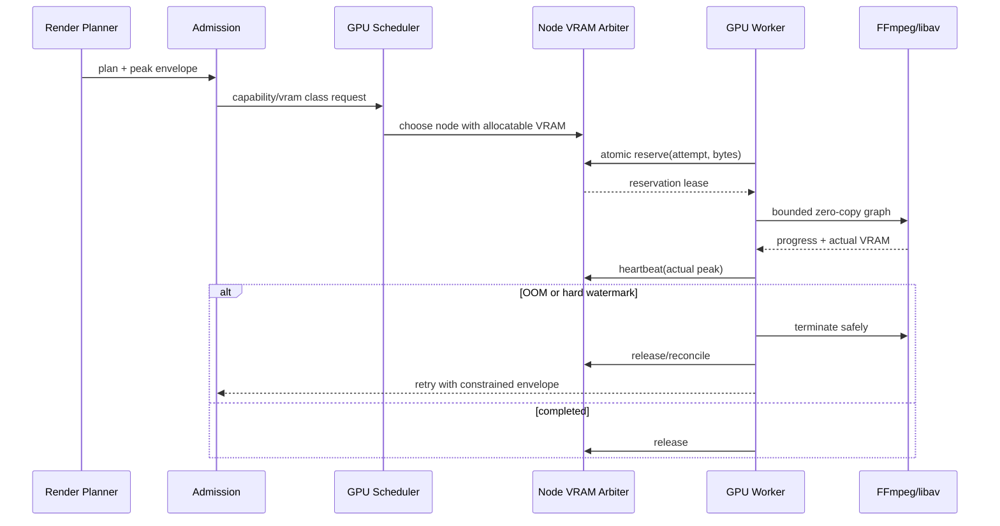

### Mermaid class

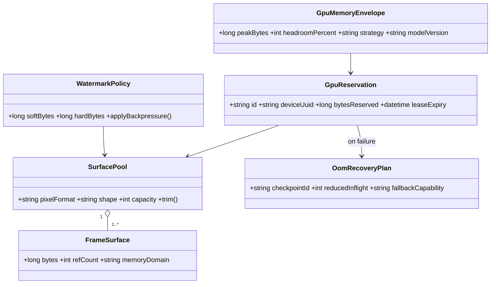

### Mermaid state

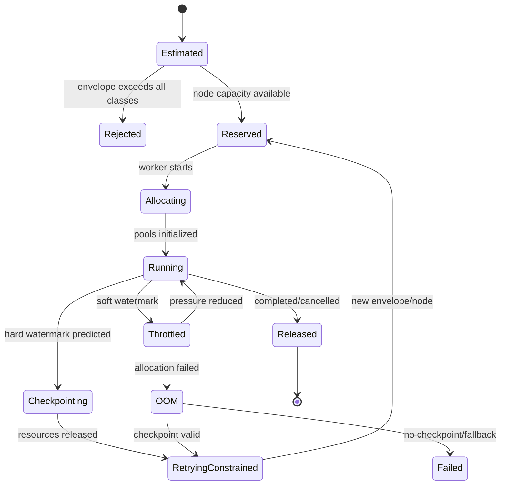

### Production sorunları, recovery ve performans optimizasyonları

- Estimate drift, yeni FFmpeg/driver sürümünde artarsa actual/estimated oranı capability ve plan feature'larına göre alarm üretir; model düzeltilene kadar safety margin otomatik policy ile yükseltilir.
- Fragmentation nedeniyle free byte yeterli görünürken allocation başarısız olabilir. Uzun yaşayan context/pool trim edilir, iş concurrency'si düşürülür; worker process recycle drain ile yapılır.
- Leaked surface, refcount ve pool outstanding metric'iyle tespit edilir. Attempt sonu tüm reservation/surface'lerin sıfırlanması invariant testi başarısızsa worker quarantine edilir.
- GPU reset/Xid, tek job OOM'undan ayrılır. Device health agent node'u cordon/taint eder, tüm affected attempt'ler checkpoint'ten başka node'da retry edilir.
- Encoder session limiti VRAM'den bağımsız admission boyutudur; reservation hem byte hem session token alır.
- Zero-copy optimizasyonu için aynı hardware frame context'i paylaşılır, gereksiz renk uzayı ve bit-depth dönüşümleri kaldırılır. Bounded pipeline decode/filter/encode overlap sağlar ancak queue derinliği ölçülmeden büyütülmez.
- Tiled processing, filter halo kadar overlap ve deterministic crop ile seam'i önler. Temporal denoise/interpolation gibi global state isteyen filter'lar destek matrisi yoksa tile edilmez; daha büyük GPU veya CPU path seçilir.

Recovery sırası: allocation durdur, process'i bounded grace ile sonlandır, device context ve IPC handle'ları serbest bırak, node sağlık sınıfını kontrol et, son checksum doğrulanmış segment checkpoint'ini seç, envelope'i yeni observed peak ile büyüt veya constrained stratejiye indir, yeni attempt id ile retry et. Partial output publish edilmez; aynı deterministic object key'e yalnız verify sonrası atomic manifest pointer güncellenir.

### Benchmark yöntemi, metrikler, eşikler, gerçek dünya, ölçek ve ownership

Yöntem: çözünürlük (`720p`-`8K`), 8/10/12-bit, chroma formatı, layer sayısı, codec/preset/lookahead, full/tile/chunk ve concurrency matrisi; NVML/DCGM high-water mark ile process allocator değerleri karşılaştırılır. Soak test fragmentation ve pool reuse için en az 8 saat sürer.

Metrikler ve eşikler: estimate/actual peak oranı p99 `>= 1,10` ve `< 1,35`; steady-state allocatable VRAM kullanımı `< %85`, geçici peak `< %90`; safety reserve `>= max(2 GiB, %10)` capability policy'sine göre; beklenmeyen GPU OOM `0/10.000 job`; reservation leak `0`; constrained retry success `> %95`; zero-copy path host-device transfer byte'ını baseline'a göre en az `%50` azaltmalı ve kalite testini geçmelidir; throughput optimizasyonu VRAM/job'ı `%10` artırıyorsa açık kapasite onayı ister.

Gerçek dünya: iki 4K 10-bit HEVC işi aynı 24 GiB GPU'ya yerleştirilir; ikisinin encode lookahead peak'i aynı anda oluşur. Ortalama bazlı scheduler OOM üretirken peak reservation ikinci işi bekletir. Birinci tamamlandığında lease serbest kalır ve ikinci başlar; tenant fairness korunur.

Ölçeklenme: queue'lar `codec + gpu_arch + vram_class + driver_generation + strategy` capability anahtarlarıyla sınırlı sayıda tutulur. Fragmentasyonu önlemek için small-job bin packing ve large-job reserved pool ayrılır. Çok büyük işler tile/chunk ile yatay parçalansa da final mux ve temporal boundary koordinasyonu workflow tarafından bounded fan-out/fan-in ile yapılır.

Ownership: GPU Platform driver/device plugin/MIG ve health; Media Runtime surface graph, pool ve FFmpeg hardware context; Capacity Engineering envelope modeli; Workflow ekibi checkpoint retry; SRE alarm/runbook sahibidir. Testler allocator unit/property testleri, reservation race, forced CUDA OOM, GPU reset chaos, cross-tenant zeroization, long soak leak ve golden seam/timestamp doğrulamasını kapsar.

---

## 64. RAM Optimization

### Mekanizma, invariantlar ve gerekçe

RAM yönetimi pod cgroup limiti, işe özgü `MemoryEnvelope`, bounded queue ve streaming I/O üzerine kuruludur. Python heap, FFmpeg/libav native heap, decoded frame/audio buffers, multipart network buffers, page cache, subprocess overhead ve safety margin ayrı tahmin edilir.

```text
frame_bytes = stride_bytes * aligned_height
audio_bytes = channels * bytes_per_sample * samples_per_chunk
working_set = process_baseline + frame_bytes * max_inflight_frames
            + audio_bytes * max_inflight_audio_chunks
            + network_buffers + filter_workspace + page_cache_budget
pod_limit >= working_set + fragmentation_headroom + recovery_margin
```

- Input/output nesnesi RAM'e bütünüyle alınmaz; S3 range/multipart streaming ve bounded chunks kullanılır.
- Queue capacity byte bazlıdır; yalnız item sayısı kullanmak değişken 8K frame ile bellek taşmasına izin vermez.
- Pydantic request/RenderPlan içinde base64 medya, dev timeline blob'u veya ffprobe raw output kopyaları taşınmaz; S3 pointer/digest kullanılır.
- Worker pod'un toplam limitinin tamamı işlere dağıtılmaz. Runtime, telemetry, TLS, allocator fragmentation ve graceful checkpoint için rezerv bırakılır.
- Backpressure zinciri sink'ten source'a yayılır. Upload yavaşsa encoder output queue sınırsız büyümez; encoder/read cadence sınırlandırılır veya local bounded spill kullanılır.
- Shared pool buffer'ı tenant geçişinde sıfırlanır; reference ownership açık ve use-after-free/double-return engellenir.
- OOMKilled attempt terminal media failure sayılmaz. Checkpoint varsa daha düşük queue/chunk veya daha büyük memory class ile sınırlı retry edilir.
- Memory optimization output frame/audio/timestamp semantiğini değiştiremez; chunk sınırları filter state ve resampler delay'ini taşır.

Neden: decoded 8K RGBA tek frame yüzlerce MB olabilir; birkaç queue ve Python/native kopya pod limitini hızla aşar. Kernel OOM killer process'e cleanup fırsatı vermediğinden yalnız exception yakalamak yeterli değildir. Admission ve bounded working set, OOM'u oluşmadan önlemelidir.

Alternatifler ve tradeoff'lar:

- Yüksek pod memory limiti operasyonu kolaylaştırır fakat bin-packing'i bozar ve leak'i gizler. Ölçülmüş envelope sınıfları tercih edilir.
- Local disk spill RAM'i azaltır; disk kapasitesi, encryption, cleanup ve I/O latency maliyeti getirir. Yalnız rewind/intermediate zorunluysa kullanılır.
- `mmap` kopyayı azaltabilir fakat page cache yine cgroup memory'ye sayılır ve random access I/O fault üretir; resident memory olarak ölçülür.
- Genel amaçlı object pool allocation maliyetini düşürür; farklı shape ve ömürlerde fragmentation/retention yaratır. Pool'lar boyut sınıflı ve bounded olmalıdır.
- Forked worker process izolasyon ve tam heap reclaim sağlar; startup ve model warm-up maliyeti vardır. Uzun yaşayan supervisor + iş başına subprocess, native leak failure domain'ini sınırlar.
- Çok küçük chunks peak RAM'i azaltır ancak syscall, S3 part ve codec overhead'ini artırır; ölçülmüş optimum kullanılır.

### Veri akışı ve internal API/schema örneği

1. Planner probe ve graph'tan frame/audio/network çalışma setini tahmin eder; memory class (`small`, `medium`, `large`, `xlarge`) seçer.
2. Admission tenant concurrency ve cluster allocatable RAM'i kontrol eder; Temporal capability queue memory class içerir.
3. Worker cgroup limitini okur, envelope ile uyuşmazsa başlamadan `resource_mismatch` döndürür.
4. S3 reader bounded chunk pool'a okur; demux/decode/filter/encode stage'leri byte-weighted semaphore üzerinden buffer devreder.
5. Upload multipart sink tüketim hızını yayınlar; backpressure upstream inflight sınırını düşürür.
6. Worker RSS/PSS, cgroup `memory.current`, `memory.events`, major fault, allocator ve queue byte değerlerini izler.
7. Soft watermark'ta cache/pool trim, chunk küçültme ve prefetch kapatma; hard watermark'ta checkpoint + kontrollü process sonlandırma uygulanır.

```python
from pydantic import BaseModel, ConfigDict, Field

class MemoryEnvelope(BaseModel):
    model_config = ConfigDict(extra="forbid", strict=True)
    class_name: str
    pod_limit_bytes: int = Field(gt=0)
    process_baseline_bytes: int = Field(ge=0)
    max_frame_queue_bytes: int = Field(gt=0)
    max_audio_queue_bytes: int = Field(gt=0)
    max_network_buffer_bytes: int = Field(gt=0)
    max_spill_bytes: int = Field(ge=0)
    soft_watermark_percent: int = Field(default=75, ge=50, le=85)
    hard_watermark_percent: int = Field(default=90, ge=80, le=95)
    estimate_model_version: str
```

Checkpoint schema'sı process belleğini serialize etmez; yeniden üretilebilir sınırı tanımlar:

```json
{
  "checkpoint_version": 3,
  "job_id": "job_01J2...",
  "plan_digest": "sha256:...",
  "completed_segment": 17,
  "next_input_pts": 1843200,
  "audio_sample_cursor": 882000,
  "filter_state_asset_id": "ast_01J2...",
  "output_parts": [{"part": 17, "sha256": "...", "size_bytes": 42881920}]
}
```

### Dosya/klasör organizasyonu ve render pipeline bağı

```text
platform/admission/{memory_envelope,memory_classes}.py
workers/common/memory/{byte_semaphore,buffer_pool,watermarks}.py
workers/common/io/{s3_stream,multipart_sink,spill_manager}.py
workers/common/checkpoints/{manifest,segment_boundary}.py
workers/probes/{cgroup_memory,allocator_stats}.py
orchestration/recovery/oom.py
tests/integration/memory/
```

Pipeline graph edge'leri `max_inflight_bytes`, buffer ownership ve spill policy taşır. Decode frame pool'u, audio chunk pool'u ve mux output chunk'ı bağımsız bütçelenir. Timeline compositor yalnız görünür/halo gereken tile ve frame'leri açar; tüm asset'leri preload etmez. Segment checkpoint, encoder flush ve audio sample cursor tutarlılığı sağlandıktan sonra durable olur.

### Mermaid sequence

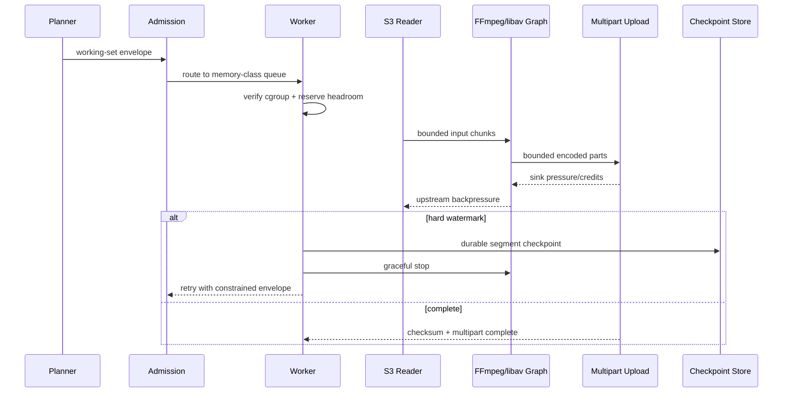

### Mermaid class

```mermaid
classDiagram
    class MemoryEnvelope {+long podLimit +long queueBudget +int softWatermark +int hardWatermark}
    class ByteSemaphore {+long capacity +long inUse +acquire(bytes) +release(bytes)}
    class BufferPool {+string sizeClass +int maxBuffers +trim() +zeroize()}
    class MediaBuffer {+long size +string owner +int references}
    class SpillManager {+long maxBytes +string encryptedPath +cleanup()}
    class MemoryCheckpoint {+long nextPts +long audioCursor +string[] partHashes}
    MemoryEnvelope --> ByteSemaphore
    ByteSemaphore --> BufferPool
    BufferPool "1" o-- "0..*" MediaBuffer
    MemoryEnvelope --> SpillManager
    SpillManager --> MemoryCheckpoint
```

### Mermaid state

```mermaid
stateDiagram-v2
    [*] --> Estimated
    Estimated --> Admitted: class capacity available
    Estimated --> Rejected: exceeds maximum class
    Admitted --> Running
    Running --> Backpressured: queue byte limit
    Backpressured --> Running: sink catches up
    Running --> Trimming: soft watermark
    Trimming --> Running: memory released
    Trimming --> Checkpointing: hard watermark
    Checkpointing --> RetryingConstrained: checkpoint durable
    Running --> OOMKilled: unexpected peak/leak
    OOMKilled --> RetryingConstrained: checkpoint exists
    OOMKilled --> Failed: retry exhausted/no safe checkpoint
    RetryingConstrained --> Admitted
    Running --> Released: completed/cancelled
    Released --> [*]
```

### Production sorunları, recovery ve performans optimizasyonları

- Python RSS düşmüyorsa bunun live object, allocator arena veya page cache olduğu heap/PSS/cgroup değerleriyle ayrılır. Kör `gc.collect()` hot loop'a eklenmez; object lifetime ve native ownership düzeltilir.
- Native FFmpeg filter leak'i joblar arasında birikiyorsa worker subprocess her iş/iş grubu sonunda recycle edilir; supervisor Ready kalırken yeni iş alımı drain edilir.
- Slow S3 upload queue şişmesi byte semaphore ile engellenir; bölgesel storage sorunu circuit breaker/admission'ı düşürür, RAM limitini artırmaz.
- `emptyDir` spill dolarsa input okumaları durur, tamamlanmış checkpoint upload edilir ve retry başka node/storage class'a taşınır. Partial spill lifecycle cleanup ve pod UID ownership ile silinir.
- OOMKilled sonrası Kubernetes exit `137`, cgroup `oom_kill` counter ve son watermark telemetry'si birleştirilir. Aynı plan için ilk retry queue/chunk'u küçültür, ikinci retry daha büyük class'a gider; bounded deneme sonrası terminal resource error döner.
- Kopyaları azaltmak için `memoryview`/zero-copy pipe, pooled aligned buffer, streaming JSON parser yerine küçük pointer payload ve FFmpeg pipe/socket buffer tuning uygulanabilir. Her zero-copy değişikliği ownership ve lifetime sanitizer testinden geçer.
- NUMA node ile CPU/memory locality yüksek throughput worker'da pinlenir; remote memory artışı profille kanıtlanmadan affinity uygulanmaz.

Recovery'de job state, kernel process memory'sine dayanmaz. Son durable segment ve filter-state checkpoint'i doğrulanır; tamamlanmamış multipart upload abort edilir; yeni attempt deterministic segment numarasından devam eder. Stateful filter checkpoint desteklemiyorsa son güvenli GOP/segment başından yeniden render edilir ve eski parçalar content hash ile deduplicate edilir.

### Benchmark yöntemi, metrikler, eşikler, gerçek dünya, ölçek ve ownership

Yöntem: 720p-8K, layer/filter sayısı, VFR, yüksek kanal audio, uzun duration, yavaş S3 sink, memory pressure ve 24 saat soak corpus'u. `memory.current`, `memory.peak`, RSS/PSS, page cache, major faults, allocation rate, GC pause, queue bytes, spill bytes ve throughput birlikte ölçülür.

Eşikler: observed peak / pod limit p99 `< %85` normal profile, hard watermark'e ulaşan normal job `< %0,1`; tahmin actual peak'i en az `%10` headroom ile kapsamalı ve overestimate p95 `< %35`; beklenmeyen OOMKill `0/10.000 job`; iş sonrası retained memory artışı 1.000 iterasyonda `< %2`; backpressure altında queue byte hard limit aşımı `0`; streaming input için object boyutuyla RSS korelasyon eğimi yaklaşık `0`; constrained retry başarı `> %95`.

Gerçek dünya: iki saatlik ProRes input önce geçici `bytes` nesnesine indirilip sonra FFmpeg'e verildiğinde pod 12 GiB'da OOM olur. Range streaming ve 16 MiB bounded chunks ile peak RSS duration'dan bağımsız hale gelir; network sink yavaşladığında reader credit bekler.

Ölçeklenme: memory class'ları scheduler request/limit ve queue capability ile eşleşir. Küçük işler aynı node'da bin-pack edilir; xlarge işler taint/toleration ile ayrılır. Admission, `sum(reserved_working_set) <= node_allocatable - daemon_and_safety` invariantını uygular; overcommit yalnız ölçülmüş düşük korelasyonlu phase'lerde kontrollü ve kill-cost aware olabilir.

Ownership: Media Runtime buffer lifecycle/streaming; Capacity Engineering envelope modeli ve class sizing; Kubernetes Platform cgroup/NUMA/eviction; Storage Platform multipart/spill; Workflow ekibi checkpoint; SRE OOM runbook sahibidir. Testler byte semaphore property/race, buffer zeroization, forced slow sink, cgroup pressure, OOM chaos, checkpoint resume, long soak leak ve golden chunk-boundary audio/video testlerini içerir.
