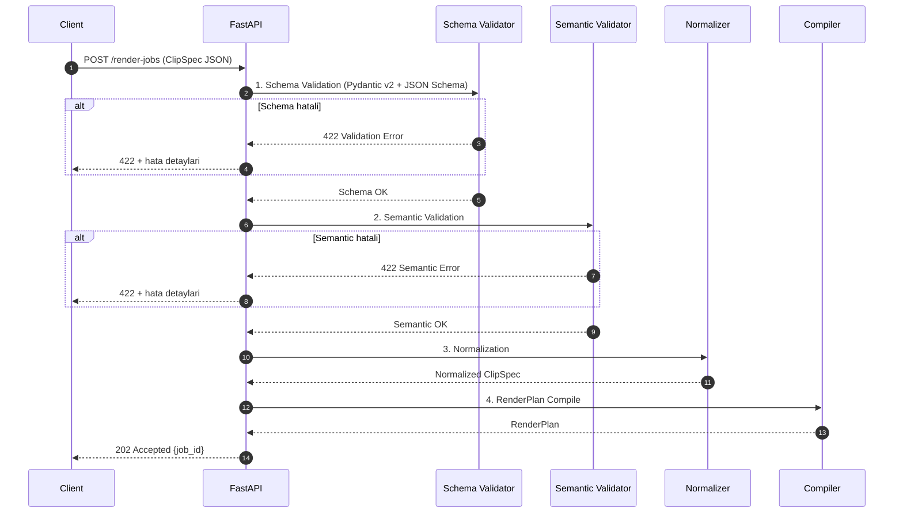
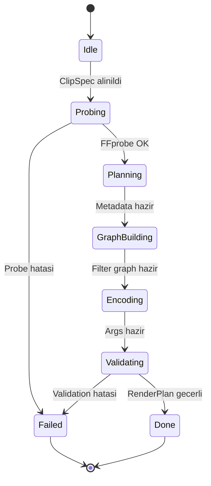
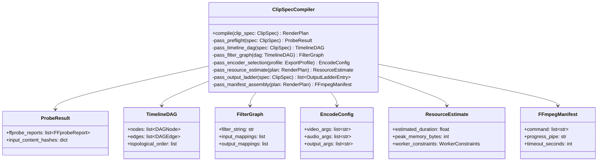

# ClipSpec v1 Sozlesme Referans Belgesi

> **Durum:** Taslak v1.0
> **Son Guncelleme:** 2026-07-15
> **Yazar:** Core Team
> **Kapsam:** ClipSpec v1 JSON sozlesmesi, validasyon, normalizasyon, Compile pipeline'i, API ornekleri

---

## Icindekiler

1. [ClipSpec v1 Guven Siniri](#1-clipspec-v1-guven-siniri)
2. [Validation Phases](#2-validation-phases)
3. [Semantic Validation](#3-semantic-validation)
4. [Normalization ve Default Resolution](#4-normalization-ve-default-resolution)
5. [Time/Color/Coordinate Unit Sozlesmeleri](#5-timecolorcoordinate-unit-sozlesmeleri)
6. [Canonical JSON Hashing](#6-canonical-json-hashing)
7. [Versioning ve Migration](#7-versioning-ve-migration)
8. [ClipSpec --> RenderPlan Compiler](#8-clipspec--renderplan-compiler)
9. [Typed Pydantic Model Organizasyonu](#9-typed-pydantic-model-organizasyonu)
10. [REST API Request/Response Ornekleri](#10-rest-api-requestresponse-ornekleri)
11. [Webhook ve Progress Events](#11-webhook-ve-progress-events)
12. [FFprobe Normalized Metadata Ornegi](#12-ffprobe-normalized-metadata-ornegi)
13. [RenderPlan Node Ornegi](#13-renderplan-node-ornegi)
14. [FFmpeg Execution Manifest](#14-ffmpeg-execution-manifest)
15. [Dosya ve Klasor Organizasyonu](#15-dosya-ve-klasor-organizasyonu)
16. [Production Sorunlari ve Recovery](#16-production-sorunlari-ve-recovery)
17. [Security](#17-security)
18. [Performance ve Benchmark](#18-performance-ve-benchmark)
19. [Testing / Fuzz / Property / Golden](#19-testing-fuzz--property--golden)

---

## 1. ClipSpec v1 Guven Siniri

### 1.1 Sozlesme Garantileri

ClipSpec v1 JSON, render pipeline'inin **ilk dogrulama sinirini** olusturur.
Asagidaki garantileri saglar:

| Garanti | Aciklama |
|---------|----------|
| **Tip guvenligi** | Tum alanlar JSON Schema draft-2020-12 ile tanimlidir; string/integer/enum sinirlari net. |
| **Benzersizlik** | `clipId`, `trackId`, `assetId`, `animationId` gibi Identifier alanlari regex-pattern ile sinirlandirilmis: `^[A-Za-z0-9][A-Za-z0-9._:-]*$`, max 128 karakter. |
| **Deterministik zaman** | Tum zaman degerleri rational time (`{value, rate: {num, den}}`) formatindadir; floating-point kaybi yoktur. |
| **Icerik butunlugu** | Her asset `integrity.sha256` (hex, 64 karakter) ve `integrity.sizeBytes` icerir; S3'ten yuklenirken dogrulanir. |
| **Immutability** | Pydantic v2 model'de `ConfigDict(frozen=True)` ile ClipSpec donmus (immutable) nesne olarak islenir. |
| **Vendor escape hatch** | `extensions` alani `x-[namespace]` pattern'i ile sinirlandirilmis; max 32 property, max 128 nested level. |
| **Negatif sinir degerleri** | NormalizedPoint, opacity, gain gibi alanlarda negatif ust sinir (-5000'e kadar) desteklenir; overdraw ve crop icin gereklidir. |

### 1.2 Sozlesmenin Vermedigi Garantiler

| Sinirlama | Aciklama | Cozum |
|-----------|----------|-------|
| **Asset erisilebilirligi** | Schema, S3'teki dosyanin var oldugunu veya erisebilir oldugunu garanti etmez. | `ValidateClipSpec` activity'si ffprobe + S3 HEAD ile dogrulama yapar. |
| **Gorsel kalite** | CRF/ bitrate degerleri optimal kalite garantisi vermez; encoder'a gore sonuc degisir. | Benchmark golden file'lar ile periyodik dogrulama. |
| **Render sureci** | ClipSpec, render suresini garanti etmez; donanim, yuk ve codec'e baglidir. | `RenderPlan.estimated_duration` tahmini deger. |
| **Lisans uyumlulugu** | Font, LUT veya 3. parti asset'lerin lisans durumunu kontrol etmez. | `x-acme.licensing` extension'i ile lisans metadata'si tasinir. |
| **Cross-version compat** | v1 schema, v2 ile uyumlu olmak zorunda degildir. | Semver versioning + migration tools. |

---

## 2. Validation Phases

ClipSpec validasyonu dort asamali bir pipeline'da calisir:

```
JSON Input --> [1] Schema --> [2] Semantic --> [3] Normalization --> [4] Compile
```



### 2.1 Faz 1: Schema Validation

Pydantic v2 model'i ile JSON'un tip dogrulugu kontrol edilir.

| Kontrol | Detay |
|---------|-------|
| `additionalProperties: false` | Bilinmeyen alan reddedilir. |
| `required` alanlar | `schemaVersion`, `project`, `assets`, `timeline`, `exportProfiles` zorunlu. |
| `schemaVersion` | Sabit `"1.0.0"` degeri; farkli versiyon reddedilir. |
| Regex pattern'ler | `Identifier`, `HexColor`, `Sha256` gibi alanlar pattern ile sinirlandirilmis. |
| `enum` sinirlari | `BlendMode`, `Crop.mode`, `ExportProfile.container` gibi alanlar kapali kume. |
| `minItems/maxItems` | `exportProfiles`: 1-8 arasi; `assets.items`: 1-1000 arasi; `tracks`: 1-128 arasi. |

### 2.2 Faz 2: Semantic Validation

Schema'dan daha derin, is anlami kurallari dogrulanir (Bolum 3 detayli).

### 2.3 Faz 3: Normalization

Varsayilan degerler doldurulur, birim donusumleri yapilir (Bolum 4 detayli).

### 2.4 Faz 4: Compile

Normalized ClipSpec, RenderPlan'a donusturulur (Bolum 8 detayli).

---

## 3. Semantic Validation

### 3.1 Zaman Tutarsizlik Kurallari

| Kural | Aciklama | Ornek Hata |
|-------|----------|------------|
| **Timeline icinde clip** | Her clip'in `timelineRange.start + timelineRange.duration <= timeline.duration` olmali. | Clip 0-20s araliginda ama timeline 15s. |
| **Source range sinirinda** | `sourceRange.duration`, asset'in `declaredMetadata.duration`'indan kucuk veya esit olmali. | Kaynak 10s ama sourceRange 15s istenmis. |
| **Rate uyumu** | `timebase` ile ayni rate kullanan tum zaman degerleri ayni `num/den` formatinda olmali. | `timebase: {1, 1000}` iken timeline `{1, 30}` rate kullaniyor. |
| **Transition overlap** | Ust uste binen transition'lar sure toplami timeline icinde kalmali. | transitionIn 500ms + clip 1s + transitionOut 500ms > timeline. |
| **Keyframe sirali** | Animation keyframe'leri `at` degerine gore sirali olmali (artan). | at:0, at:500, at:200 siralamasi gecersiz. |

### 3.2 Asset Varsaligi Kurallari

| Kural | Aciklama |
|-------|----------|
| **Referans tutarliligi** | Her `clip.assetId`, `assets.items[]` icinde mevcut olmali. |
| **Font referansi** | `TextStyle.fontAssetId` mevcut bir `font` asset'ini gostermeli. |
| **LUT referansi** | `LutEffect.assetId` mevcut bir `data` asset'ini (purpose: "lut") gostermeli. |
| **Face tracking data** | `FaceTracking.trackingDataAssetId`, `purpose: "face-track"` olan bir `data` asset'ini gostermeli. |
| **Image boyut** | `ImageAsset.width/height` > 0 olmali; `ImageGraphic.sizing` dogru secilmeli. |

### 3.3 Track Uyumu Kurallari

| Kural | Aciklama |
|-------|----------|
| **Video track z-index** | En az bir video track `zIndex: 0` olmali (primary layer). |
| **Audio mixOrder** | Audio track'lerde `mixOrder` benzersiz ve sirali olmali. |
| **Blend mode uyumu** | `GraphicsTrack.blendMode`, clip'in `blendMode` degeri ile tutarli olmali. |
| **Clip tipi eslesme** | `VideoTrack.clips[]` icinde sadece `VideoClip`, `AudioTrack.clips[]` icinde sadece `AudioClip` olmali. |
| **Enabled false ise** | Track `enabled: false` ise clip'ler yine de gecerli olmali (devre disi ama tanimli). |
| **Ducking target** | `Ducking.sidechainTrackId`, farkli bir audio track'i gostermeli (kendisi degil). |

### 3.4 Export Profile Kurallari

| Kural | Aciklama |
|-------|----------|
| **Cozunurluk uyumu** | `ExportProfile.resolution`, `project.canvas.designResolution` ile ayni aspect ratio'yu paylasmali. |
| **Codec destegi** | `h264` icin `profile: "high"`, `hevc` icin `main10` gibi codec-profil eslesmeleri dogru olmali. |
| **Rate control tutarliligi** | `crf` modunda `crf` alani zorunlu; `vbr/cbr` modunda `targetBitrateKbps` zorunlu. |
| **Loudness hedef** | `integratedMilliLufs` ile `truePeakMilliDbtp` arasindaki fark makul olmali (>= 1000). |
| **Container uyumu** | `vp9` codec'i sadece `webm` container ile; `h264/hevc` `mp4/mov` ile. |

---

## 4. Normalization ve Default Resolution

### 4.1 Varsayilan Degerler

Schema'da opsiyonel olan alanlar, normalize asamasinda asagaki degerleri alir:

| Alan | Varsayilan | Kaynak |
|------|-----------|--------|
| `project.locale` | `"en-US"` | Sistem default'u |
| `project.canvas.backgroundColor` | `"#000000FF"` | Siyah, tam opaque |
| `project.canvas.safeArea` | `{0, 0, 10000, 10000}` | Tam canvas |
| `VideoClip.playback.speed` | `{num: 1, den: 1}` | Normal hiz |
| `VideoClip.playback.reverse` | `false` | Normal yon |
| `VideoClip.faceTracking.enabled` | `false` | Face tracking kapali |
| `AudioClip.loop` | `false` | Loop kapali |
| `AudioClip.gainMilliDb` | `0` | Neutral gain |
| `AudioTrack.gainMilliDb` | `0` | Neutral gain |
| `TextClip.style.letterSpacingMilliPixels` | `0` | Default spacing |
| `TextClip.style.lineHeightBasisPoints` | `10000` | Normal satir arasi |
| `TextClip.layout.paddingBasisPoints` | `0` | Padding yok |
| `GraphicsClip.blendMode` | `"normal"` | Normal blend |
| `Thumbnail.format` | `"jpeg"` | Varsayilan format |
| `Thumbnail.qualityBasisPoints` | `9000` | %90 kalite |

### 4.2 Birim Donusumleri

```
Basis Points donusumu:
  10000 basis points = %100 (tam deger)
  5000 basis points  = %50
  0 basis points     = %0

  Ornegin: opacityBasisPoints: 7500 => %75 opaklik

Milli-degrees donusumu:
  3600000 milli-degrees = 360 derece (tam donus)
  900000 milli-degrees  = 90 derece

Milli-decibels donusumu:
  0 milli-db        = 0 dB (neutral)
  -6000 milli-db    = -6 dB (yarim azaltma)
  6000 milli-db     = +6 dB (yarim artirma)
  -96000 milli-db   = -96 dB (sessizlik)

Milli-pixels donusumu:
  1000 milli-pixels = 1 piksel
  88000 milli-pixels = 88 piksel (font buyuklugu)

Milli-Kelvin donusumu:
  0 mK = neutral sicaklik
  120000 mK = +120K sicaklik (sari ton)
  -120000 mK = -120K sogukluk (mavi ton)

Milli-LUFS donusumu:
  -14000 milli-LUFS = -14 LUFS (streaming standart)
  -23000 milli-LUFS = -23 LUFS (EBU R128 broadcast)
```

### 4.3 Rate Normalizasyonu

Tum Rate degerleri `num >= 1` ve `den >= 1` olmalidir. Asagidaki donusumler uygulanir:

```
FPS normalizasyonu:
  30 fps   => {num: 30000, den: 1001} veya {num: 30, den: 1}
  24 fps   => {num: 24000, den: 1001}
  60 fps   => {num: 60000, den: 1001}

Sures normalizasyonu:
  timebase {num: 1, den: 1000} ise:
    1 tick = 1 milisaniye
    5000 tick = 5 saniye
```

---

## 5. Time/Color/Coordinate Unit Sozlesmeleri

### 5.1 Rational Time

ClipSpec v1'de tum zaman degerleri rational time kullanir:

```json
{
  "value": 9000,
  "rate": { "num": 1, "den": 1000 }
}
```

- `value`: Tamsayi tick sayisi
- `rate.num / rate.den`: Her tick'in saniye cinsinden degeri
- Ornek: `{9000, {1, 1000}}` = 9000 * (1/1000) = 9 saniye

### 5.2 Hex Color

Format: `#RRGGBBAA` (8 hex digit, alpha dahil) veya `#RRGGBB` (6 hex digit, alpha varsayilan FF)

```json
{
  "backgroundColor": "#101014FF",
  "fillColor": "#FFFFFFFF",
  "strokeColor": "#00000099"
}
```

Renk uzayi: sRGB (gamma-prefixed), linear light compositing icin donusum render asamasinda uygulanir.

### 5.3 Normalized Coordinates

Tum koordinatlar basis points (1/10000) cinsinden:

```
Canvas:
  (0, 0)    = ust sol kose
  (10000, 10000) = alt sag kose
  (5000, 5000)   = tam orta

Piksel donusumu:
  x_pixel = (x_basis / 10000) * canvas_width
  y_pixel = (y_basis / 10000) * canvas_height

  Ornegin: 1080x1920 canvas'da
  x=5000 => 5000/10000 * 1080 = 540 piksel
  y=2500 => 2500/10000 * 1920 = 480 piksel

Negative values:
  x=-5000 => -5000/10000 * 1080 = -540 piksel (canvas disi, sol)
  y=12000 => 12000/10000 * 1920 = 2304 piksel (canvas disi, alt)
```

---

## 6. Canonical JSON Hashing

### 6.1 Deterministic Serialization

ClipSpec'in SHA-256 hash'i asagidaki kurallara gore hesaplanir:

```
Canonical JSON serialization kurallari:

1. Anahtarlar alfabetik sirada
2. Bosluk/tabit yok (minified)
3. String'ler Unicode escaped degil, dogrudan UTF-8
4. Null degerler dahil
5. Boolean'lar kucuk harf: true, false
6. Integer'lar dot yok: 10 (10.0 degil)
7. Float'lar dot ile: 1.5
8. Array sirasi korunur (değiştirilmez)
9. Nested objeler recursively ayni kurallarla
```

### 6.2 Hash Hesaplama Ornegi

```python
import json
import hashlib

def canonical_hash(clip_spec: dict) -> str:
    canonical = json.dumps(
        clip_spec,
        sort_keys=True,
        separators=(",", ":"),
        ensure_ascii=False,
    )
    return hashlib.sha256(canonical.encode("utf-8")).hexdigest()

# Ornegin:
# hash = "a1b2c3d4e5f6...64 karakter hex"
```

### 6.3 Hash Kullanim Yerleri

| Kullanim | Aciklama |
|----------|----------|
| `clip_spec_hash` | RenderPlan icinde referans; ayni ClipSpec ayni hash'i uretir. |
| Cache key | `plan:{hash}` pattern'i ile RenderPlan cache'lenir. |
| Deduplication | Ayni hash'li job'lar tekrar render edilmez. |
| Integrity check | DB'ye yazarken ve okurken hash karsilastirmasi. |

---

## 7. Versioning ve Migration

### 7.1 v1 --> v2 Stratejisi

```
Semver uyumlu strateji:

MAJOR (v1 -> v2):
  - Breaking change: field ekleme/cikarma, tip degisikligi
  - Migration tool zorunlu
  - Backward compatibility 6 ay desteklenir

MINOR (v1.0 -> v1.1):
  - Yeni opsiyonel alanlar (extensions disinda)
  - Mevcut client'lar bozulmaz
  - Eski alanlar deprecated olarak kalir

PATCH (v1.0.0 -> v1.0.1):
  - Doc fix, validation iyilestirmesi
  - Behavior degisikligi yok
```

### 7.2 Backward Compatibility Kurallari

| Kural | Aciklama |
|-------|----------|
| **Yeni required alan eklenemez** | v1 client'lar bozulmamali; alan opsiyonel eklenmeli + default degeri olmali. |
| **Mevcut alan silinemez** | Deprecated olarak isaretlenip minimum 2 major version daha korunmali. |
| **Enum genisletilebilir** | Yeni enum degerleri opsiyonel olarak eklenebilir; eski client'lar bilinmeyen degeri atlayabilir. |
| **Pattern daraltilamaz** | Mevcut pattern'e uyan degerler her zaman gecerli olmali. |
| **Extensions guvenli** | `x-*` alanlari her zaman opsiyoneldir; bilinmeyenler atlanir. |

### 7.3 Migration Tools

```python
# libs/clip-spec/src/clip_spec/migration.py

class ClipSpecMigrator:
    """v1 -> v2 migration tool"""

    def migrate_v1_to_v2(self, v1_spec: dict) -> dict:
        """
        v1 ClipSpec'i v2 formatina donusturur.

        Adimlar:
        1. v1 schema dogrulama
        2. v2 target schema ile eslesme
        3. Field mapping (v1 -> v2)
        4. Default deger ekleme (v2 opsiyonel alanlari)
        5. v2 schema dogrulama
        6. Hash hesaplama (her iki version icin)
        """
        v2_spec = self._map_fields(v1_spec)
        v2_spec["schemaVersion"] = "2.0.0"
        self._validate_v2(v2_spec)
        return v2_spec

    def detect_version(self, spec: dict) -> str:
        """Spec versiyonunu tespit eder."""
        return spec.get("schemaVersion", "unknown")
```

---

## 8. ClipSpec --> RenderPlan Compiler

### 8.1 Derleme Sureci



### 8.2 Compile Pass'leri

```
Pass 0: Pre-flight
  - schemaVersion kontrolu
  - asset integrity hash dogrulama (S3 HEAD request)
  - FFprobe ile declaredMetadata dogrulama

Pass 1: Timeline DAG Construction
  - Track bazli timeline DAG olusturma
  - z-index siralamasi (video katmanlari)
  - Audio mixOrder siralamasi
  - Transition overlap tespiti

Pass 2: Filter Graph Generation
  - Her video clip icin: crop, scale, transform, effects chain
  - Audio clip icin: gain, fade, ducking, effects chain
  - Text clip icin: subtitle burn-in filter
  - Graphics clip icin: overlay filter
  - Animation keyframe -> FFmpeg expression donusumu

Pass 3: Encoder Selection
  - ExportProfile'dan codec/preset/profil secimi
  - Rate control parametreleri
  - GOP yapisi
  - Color space transform (gerekirse)

Pass 4: Resource Estimation
  - Tahmini render suresi
  - Peak bellek kullanimi
  - Disk I/O tahmini
  - Worker constraint belirleme (CPU/GPU)

Pass 5: Output Ladder
  - Her ExportProfile icin ayri encode job'i
  - Thumbnail generation
  - Sidecar subtitle dosyalari

Pass 6: Manifest Assembly
  - FFmpeg args array olusturma
  - Content hash seed'leri (deterministic output addressing)
  - Temporal activity parametreleri
```

### 8.3 Compiler Class Diyagrami



---

## 9. Typed Pydantic Model Organizasyonu

### 9.1 Model Hiyerarsisi

```python
# libs/clip-spec/src/clip_spec/spec.py

from pydantic import BaseModel, Field, ConfigDict

# --- Temel Tipler ---
class Rate(BaseModel):
    model_config = ConfigDict(frozen=True)
    num: int = Field(ge=1, le=1_000_000_000)
    den: int = Field(ge=1, le=1_000_000_000)

class Time(BaseModel):
    model_config = ConfigDict(frozen=True)
    value: int = Field(ge=0, le=9_223_372_036_854_775_807)
    rate: Rate

class Duration(BaseModel):
    model_config = ConfigDict(frozen=True)
    value: int = Field(ge=1, le=9_223_372_036_854_775_807)
    rate: Rate

class TimeRange(BaseModel):
    model_config = ConfigDict(frozen=True)
    start: Time
    duration: Duration

class NormalizedPoint(BaseModel):
    model_config = ConfigDict(frozen=True)
    x: int = Field(ge=-5000, le=15000)
    y: int = Field(ge=-5000, le=15000)

# --- Project ---
class Project(BaseModel):
    model_config = ConfigDict(frozen=True)
    projectId: str
    revision: int
    idempotencyKey: str
    title: str
    locale: str
    timebase: Rate
    canvas: "Canvas"
    createdAt: str

# --- Assets ---
class VideoAsset(BaseModel):
    model_config = ConfigDict(frozen=True)
    assetId: str
    kind: Literal["video"]
    locator: "StorageLocator"
    integrity: "AssetIntegrity"
    mediaType: str
    declaredMetadata: "DeclaredVideoMetadata" | None = None

class AudioClip(BaseModel):
    model_config = ConfigDict(frozen=True)
    clipId: str
    type: Literal["audio"]
    assetId: str
    role: Literal["dialogue", "voiceover", "music", "sfx", "ambient"]
    timelineRange: TimeRange
    sourceRange: TimeRange
    playback: "Playback"
    gainMilliDb: int = Field(ge=-96000, le=24000)
    loop: bool
    effects: list["AudioEffect"]
    animations: list["Animation"]

# --- Timeline ---
class VideoTrack(BaseModel):
    model_config = ConfigDict(frozen=True)
    trackId: str
    type: Literal["video"]
    name: str
    enabled: bool
    zIndex: int
    blendMode: "BlendMode"
    opacityBasisPoints: int = Field(ge=0, le=10000)
    clips: list["VideoClip"]

# --- Root ---
class ClipSpec(BaseModel):
    model_config = ConfigDict(frozen=True)
    schemaVersion: Literal["1.0.0"]
    project: Project
    assets: "AssetManifest"
    template: "TemplateBinding" | None = None
    timeline: "Timeline"
    thumbnail: "ThumbnailSpec" | None = None
    exportProfiles: list["ExportProfile"] = Field(min_length=1, max_length=8)
    extensions: "Extensions" | None = None
```

### 9.2 Validation Decorator Pattern

```python
# libs/clip-spec/src/clip_spec/validation.py

from functools import wraps
from typing import TypeVar, Callable

T = TypeVar("T")

def validate_clip_spec(func: Callable) -> Callable:
    """ClipSpec validasyon decorator'u."""
    @wraps(func)
    async def wrapper(spec: dict, *args, **kwargs):
        # 1. Schema validation
        clip_spec = ClipSpec.model_validate(spec)

        # 2. Semantic validation
        errors = semantic_validate(clip_spec)
        if errors:
            raise ValidationError(errors)

        # 3. Normalization
        normalized = normalize(clip_spec)

        return await func(normalized, *args, **kwargs)
    return wrapper

def semantic_validate(spec: ClipSpec) -> list[ValidationError]:
    errors = []
    # Asset referans kontrolu
    asset_ids = {a.assetId for a in spec.assets.items}
    for track in spec.timeline.tracks:
        for clip in track.clips:
            if hasattr(clip, "assetId") and clip.assetId not in asset_ids:
                errors.append(f"Asset {clip.assetId} not found")
    return errors
```

---

## 10. REST API Request/Response Ornekleri

### 10.1 POST /render-jobs

**Request:**

```http
POST /api/v1/render-jobs
Content-Type: application/json
Authorization: Bearer eyJhbG...
X-Idempotency-Key: idem-abc-123-456

{
  "clipSpec": {
    "schemaVersion": "1.0.0",
    "project": {
      "projectId": "prj-demo-001",
      "revision": 1,
      "idempotencyKey": "clipgen:demo:rev-1",
      "title": "Demo Video",
      "locale": "tr-TR",
      "timebase": { "num": 1, "den": 1000 },
      "canvas": {
        "aspectRatio": { "width": 9, "height": 16 },
        "designResolution": { "width": 1080, "height": 1920 },
        "backgroundColor": "#000000FF",
        "safeArea": { "x": 500, "y": 500, "width": 9000, "height": 9000 }
      },
      "createdAt": "2026-07-15T12:00:00Z"
    },
    "assets": {
      "items": [
        {
          "assetId": "asset-video-01",
          "kind": "video",
          "locator": { "provider": "s3", "bucket": "my-bucket", "key": "input/video01.mp4" },
          "integrity": { "sha256": "aaaa1111...64char...", "sizeBytes": 104857600 },
          "mediaType": "video/mp4",
          "declaredMetadata": {
            "duration": { "value": 30000, "rate": { "num": 1, "den": 1000 } },
            "width": 1920, "height": 1080,
            "frameRate": { "num": 30000, "den": 1001 },
            "hasAudio": true
          }
        }
      ]
    },
    "timeline": {
      "duration": { "value": 30000, "rate": { "num": 1, "den": 1000 } },
      "tracks": [
        {
          "trackId": "video-main", "type": "video", "name": "Main",
          "enabled": true, "zIndex": 0, "blendMode": "normal",
          "opacityBasisPoints": 10000,
          "clips": [
            {
              "clipId": "clip-01", "type": "video", "assetId": "asset-video-01",
              "timelineRange": {
                "start": { "value": 0, "rate": { "num": 1, "den": 1000 } },
                "duration": { "value": 30000, "rate": { "num": 1, "den": 1000 } }
              },
              "sourceRange": {
                "start": { "value": 0, "rate": { "num": 1, "den": 1000 } },
                "duration": { "value": 30000, "rate": { "num": 1, "den": 1000 } }
              },
              "playback": { "speed": { "num": 1, "den": 1 }, "reverse": false },
              "transform": {
                "position": { "x": 5000, "y": 5000 },
                "anchor": { "x": 5000, "y": 5000 },
                "scaleBasisPoints": 10000, "rotationMilliDegrees": 0,
                "opacityBasisPoints": 10000
              },
              "crop": { "mode": "fill", "zoomBasisPoints": 10000, "pan": { "x": 5000, "y": 5000 } },
              "faceTracking": {
                "enabled": false, "subject": "largest-face", "framing": "upper-body",
                "smoothingBasisPoints": 7000,
                "lookAhead": { "value": 200, "rate": { "num": 1, "den": 1000 } },
                "maxPanBasisPointsPerSecond": 3000
              },
              "effects": [],
              "animations": []
            }
          ]
        }
      ]
    },
    "exportProfiles": [
      {
        "exportProfileId": "profile-1080p",
        "platformTargets": ["tiktok"],
        "aspectRatio": { "width": 9, "height": 16 },
        "resolution": { "width": 1080, "height": 1920 },
        "frameRate": { "num": 30, "den": 1 },
        "encodingPreset": "social-balanced",
        "container": "mp4",
        "video": {
          "codec": "h264", "pixelFormat": "yuv420p",
          "rateControl": { "mode": "crf", "crf": 23 },
          "gopFrames": 60, "colorSpace": "bt709", "fastStart": true
        },
        "audio": {
          "codec": "aac", "sampleRateHz": 48000, "channels": 2,
          "bitrateKbps": 128,
          "loudness": { "integratedMilliLufs": -14000, "truePeakMilliDbtp": -1000, "loudnessRangeMilliLu": 7000 }
        },
        "captions": { "mode": "none", "sidecarFormats": [] },
        "filename": "demo-output.mp4"
      }
    ]
  }
}
```

**Response (202 Accepted):**

```json
{
  "jobId": "550e8400-e29b-41d4-a716-446655440000",
  "status": "pending",
  "clipSpecHash": "a1b2c3d4e5f6a1b2c3d4e5f6a1b2c3d4e5f6a1b2c3d4e5f6a1b2c3d4e5f6a1b2",
  "createdAt": "2026-07-15T14:32:10Z",
  "estimatedDuration": 35.0,
  "links": {
    "self": "/api/v1/render-jobs/550e8400-e29b-41d4-a716-446655440000",
    "cancel": "/api/v1/render-jobs/550e8400-e29b-41d4-a716-446655440000/cancel",
    "events": "/api/v1/render-jobs/550e8400-e29b-41d4-a716-446655440000/events"
  }
}
```

### 10.2 GET /render-jobs/{id}

**Response (200 OK):**

```json
{
  "jobId": "550e8400-e29b-41d4-a716-446655440000",
  "status": "rendering",
  "progress": 0.42,
  "currentStep": "RenderVideo",
  "clipSpecHash": "a1b2c3d4e5f6a1b2c3d4e5f6a1b2c3d4e5f6a1b2c3d4e5f6a1b2c3d4e5f6a1b2",
  "createdAt": "2026-07-15T14:32:10Z",
  "startedAt": "2026-07-15T14:32:12Z",
  "workerId": "worker-cpu-07",
  "outputs": [],
  "error": null,
  "links": {
    "self": "/api/v1/render-jobs/550e8400-e29b-41d4-a716-446655440000",
    "cancel": "/api/v1/render-jobs/550e8400-e29b-41d4-a716-446655440000/cancel",
    "events": "/api/v1/render-jobs/550e8400-e29b-41d4-a716-446655440000/events"
  }
}
```

### 10.3 PATCH /render-jobs/{id}/cancel

**Request:**

```http
PATCH /api/v1/render-jobs/550e8400-e29b-41d4-a716-446655440000/cancel
Content-Type: application/json
Authorization: Bearer eyJhbG...

{
  "reason": "User cancelled"
}
```

**Response (200 OK):**

```json
{
  "jobId": "550e8400-e29b-41d4-a716-446655440000",
  "status": "cancelling",
  "cancelledAt": "2026-07-15T14:35:00Z",
  "cancelReason": "User cancelled"
}
```

---

## 11. Webhook ve Progress Events

### 11.1 Event Tipleri

| Event | Trigger | Payload alanlari |
|-------|---------|------------------|
| `job.created` | Job olusturuldu | jobId, clipSpecHash, createdAt |
| `job.validating` | Validasyon basladi | jobId |
| `job.planning` | RenderPlan uretimi basladi | jobId |
| `job.rendering` | Render basladi | jobId, workerId, estimatedDuration |
| `job.progress` | Ilerleme guncellendi | jobId, progress (0.0-1.0), currentStep |
| `job.compositing` | Mux/merge asamasi | jobId |
| `job.uploading` | S3 upload basladi | jobId |
| `job.completed` | Basarili tamamlandi | jobId, outputs[], duration, storageUsed |
| `job.failed` | Hatali tamamlandi | jobId, errorCode, errorMessage, retryable |
| `job.cancelled` | Iptal edildi | jobId, cancelledAt, reason |

### 11.2 Signed Webhook Delivery

```json
{
  "event": "job.completed",
  "timestamp": "2026-07-15T14:35:30Z",
  "jobId": "550e8400-e29b-41d4-a716-446655440000",
  "data": {
    "status": "completed",
    "outputs": [
      {
        "profileId": "profile-1080p",
        "s3Key": "outputs/a1b2c3/def456.mp4",
        "fileSizeBytes": 15728640,
        "durationSeconds": 30.0,
        "contentHash": "sha256:abcdef..."
      }
    ],
    "durationMs": 32500,
    "storageUsedBytes": 15728640
  },
  "signature": "sha256=hmac-sha256-imzasi",
  "webhookId": "wh-abc-123"
}
```

### 11.3 Retry Policy

| Deneme | Gecikme | Toplam Bekleme |
|--------|---------|----------------|
| 1. deneme | 0 saniye | 0 saniye |
| 2. deneme | 30 saniye | 30 saniye |
| 3. deneme | 2 dakika | 2.5 dakika |
| 4. deneme | 8 dakika | 10.5 dakika |
| 5. deneme | 30 dakika | 40.5 dakika |

5 deneme sonrasi webhook devre disi birakilir ve `webhook.failed` event'i uretilir.

---

## 12. FFprobe Normalized Metadata Ornegi

```json
{
  "streams": [
    {
      "index": 0,
      "codec_type": "video",
      "codec_name": "h264",
      "codec_long_name": "H.264 / AVC / MPEG-4 AVC / MPEG-4 part 10",
      "width": 1920,
      "height": 1080,
      "coded_width": 1920,
      "coded_height": 1080,
      "pix_fmt": "yuv420p",
      "r_frame_rate": "30000/1001",
      "avg_frame_rate": "30000/1001",
      "time_base": "1/90000",
      "start_pts": 0,
      "start_time": "0.000000",
      "duration_ts": 2702700,
      "duration": "30.030000",
      "nb_frames": 901,
      "bit_rate": "5000000",
      "level": 42,
      "profile": "High",
      "color_space": "bt709",
      "color_transfer": "bt709",
      "color_primaries": "bt709",
      "has_b_frames": 2,
      "sample_aspect_ratio": "1:1",
      "display_aspect_ratio": "16:9"
    },
    {
      "index": 1,
      "codec_type": "audio",
      "codec_name": "aac",
      "codec_long_name": "AAC (Advanced Audio Coding)",
      "sample_rate": "48000",
      "channels": 2,
      "channel_layout": "stereo",
      "bits_per_sample": 0,
      "time_base": "1/48000",
      "start_pts": 0,
      "start_time": "0.000000",
      "duration_ts": 1441440,
      "duration": "30.030000",
      "bit_rate": "192000"
    }
  ],
  "format": {
    "filename": "gameplay-a.mp4",
    "nb_streams": 2,
    "format_name": "mov,mp4,m4a,3gp,3g2,mj2",
    "format_long_name": "QuickTime / MOV",
    "start_time": "0.000000",
    "duration": "30.030000",
    "size": "185420112",
    "bit_rate": "49366521",
    "probe_score": 100,
    "tags": {
      "major_brand": "isom",
      "minor_version": "512",
      "compatible_brands": "isomiso2avc1mp41",
      "encoder": "Lavf60.16.100"
    }
  }
}
```

---

## 13. RenderPlan Node Ornegi

```json
{
  "planId": "plan-7f8e9d0c-1b2a-3c4d-5e6f-7a8b9c0d1e2f",
  "clipSpecHash": "a1b2c3d4e5f6a1b2c3d4e5f6a1b2c3d4e5f6a1b2c3d4e5f6a1b2c3d4e5f6a1b2",
  "version": "1.0.0",
  "ffprobeReports": [
    {
      "assetId": "asset-gameplay-a",
      "codec": "h264",
      "width": 1920,
      "height": 1080,
      "frameRate": { "num": 30000, "den": 1001 },
      "duration": { "value": 30000, "rate": { "num": 1, "den": 1000 } },
      "pixFmt": "yuv420p",
      "hasAudio": true,
      "bitRate": 5000000
    }
  ],
  "filterGraph": "[0:v]crop=1080:1920:420:0,scale=1080:1920,setsar=1[vcrop];[vcrop]fps=30[vfps];[0:a]aresample=48000,pan=stereo|FC=FL+FR[amix];[1:a]aresample=48000[bgm];[amix][bgm]amix=inputs=2:duration=first:dropout_transition=2[afinal]",
  "videoEncodeArgs": [
    "-c:v", "libx264",
    "-profile:v", "high",
    "-level", "4.2",
    "-pix_fmt", "yuv420p",
    "-crf", "18",
    "-maxrate", "16000k",
    "-bufsize", "32000k",
    "-g", "60",
    "-color_primaries", "bt709",
    "-color_trc", "bt709",
    "-colorspace", "bt709"
  ],
  "audioEncodeArgs": [
    "-c:a", "aac",
    "-b:a", "192k",
    "-ar", "48000",
    "-ac", "2"
  ],
  "subtitleEncodeArgs": null,
  "workerConstraints": {
    "required_hardware": "cpu",
    "min_cpu_cores": 4,
    "min_memory_gb": 4.0,
    "required_gpu_model": null,
    "required_codecs": ["h264", "aac"],
    "preferred_queue": "clip-rendering-cpu"
  },
  "estimatedDuration": 35.0,
  "estimatedStorageBytes": 15728640,
  "estimatedPeakMemoryBytes": 2147483648,
  "inputContentHashes": {
    "asset-gameplay-a": "1111111111111111111111111111111111111111111111111111111111111111"
  },
  "outputLadder": [
    {
      "name": "social-master-1080x1920",
      "codec": "h264",
      "profile": "high",
      "level": "4.2",
      "width": 1080,
      "height": 1920,
      "fps": "30/1",
      "bitrateKbps": 16000,
      "maxBitrateKbps": 16000,
      "bufferSizeKbits": 32000,
      "pixelFormat": "yuv420p",
      "encoderSettings": {
        "preset": "medium",
        "tune": "zerolatency",
        "x264-params": "keyint=60:min-keyint=60"
      }
    },
    {
      "name": "social-preview-720x1280",
      "codec": "h264",
      "profile": "main",
      "level": "4.0",
      "width": 720,
      "height": 1280,
      "fps": "30/1",
      "bitrateKbps": 3500,
      "maxBitrateKbps": 5000,
      "bufferSizeKbits": 10000,
      "pixelFormat": "yuv420p",
      "encoderSettings": {
        "preset": "fast",
        "tune": "zerolatency"
      }
    }
  ]
}
```

---

## 14. FFmpeg Execution Manifest

```json
{
  "manifestId": "manifest-001",
  "jobId": "550e8400-e29b-41d4-a716-446655440000",
  "planId": "plan-7f8e9d0c-1b2a-3c4d-5e6f-7a8b9c0d1e2f",
  "ffmpegVersion": "7.1",
  "command": [
    "ffmpeg",
    "-y",
    "-hide_banner",
    "-stats",
    "-progress", "pipe:1",
    "-i", "/scratch/550e8400/video/gameplay-a.mp4",
    "-i", "/scratch/550e8400/audio/dialogue-clean.wav",
    "-filter_complex",
    "[0:v]crop=1080:1920:420:0,scale=1080:1920,setsar=1,fps=30[vout];[0:a]aresample=48000,pan=stereo|FC=FL+FR[a0];[1:a]aresample=48000[a1];[a0][a1]amix=inputs=2:duration=first:dropout_transition=2[aout]",
    "-map", "[vout]",
    "-map", "[aout]",
    "-c:v", "libx264",
    "-profile:v", "high",
    "-level", "4.2",
    "-pix_fmt", "yuv420p",
    "-crf", "18",
    "-maxrate", "16000k",
    "-bufsize", "32000k",
    "-g", "60",
    "-color_primaries", "bt709",
    "-color_trc", "bt709",
    "-colorspace", "bt709",
    "-c:a", "aac",
    "-b:a", "192k",
    "-ar", "48000",
    "-ac", "2",
    "-movflags", "+faststart",
    "/scratch/550e8400/output/son-saniye-zaferi-social.mp4"
  ],
  "timeoutSeconds": 600,
  "progressPipe": "/tmp/tuncay-klip/progress/550e8400.progress",
  "envVars": {
    "FFMPEG_THREADS": "4",
    "TMPDIR": "/scratch/550e8400/tmp"
  },
  "retryPolicy": {
    "maxAttempts": 2,
    "backoffSeconds": 10
  },
  "exitCodeExpected": 0,
  "outputValidation": {
    "checkDuration": true,
    "durationToleranceMs": 100,
    "checkCodec": true,
    "expectedCodec": "h264",
    "minFileSizeBytes": 1048576
  }
}
```

---

## 15. Dosya ve Klasor Organizasyonu

```
tuncay-klip/
  libs/
    clip-spec/
      src/clip_spec/
        __init__.py
        spec.py              # Pydantic v2 root model'leri
        validation.py        # Semantic validation fonksiyonlari
        normalization.py     # Default deger atama, birim donusumu
        migration.py         # v1 -> v2 migration tools
        types.py             # Identifier, Sha256, HexColor gibi temel tipler
    render-plan/
      src/render_plan/
        __init__.py
        plan.py              # RenderPlan Pydantic model'leri
        generator.py         # ClipSpec -> RenderPlan compiler
        codec_matrix.py      # Codec/profille/ladder eslestirme matrisi
        filter_builder.py    # FFmpeg filter graph olusturucu
    ffmpeg-utils/
      src/ffmpeg_utils/
        __init__.py
        probe.py             # FFprobe wrapper, normalized metadata
        filter_graph.py      # Filter graph string builder
        encoder.py           # Encoder args builder
        hw_accel.py          # HW detection, fallback logic
    subtitle-utils/
      src/subtitle_utils/
        __init__.py
        ass_parser.py        # ASS format parser
        srt_parser.py        # SRT format parser
        font_resolver.py     # Font file resolution
        shaping.py           # HarfBuzz text shaping
    storage/
      src/storage/
        __init__.py
        s3_client.py         # S3 wrapper (boto3)
        content_hash.py      # SHA-256 content addressing
        presigned_url.py     # Time-limited URL generation
  schemas/
    clip-spec-v1.schema.json     # JSON Schema (source of truth)
    clip-spec-v1.example.json    # Ornek ClipSpec
  tests/
    unit/
      test_clip_spec_validation.py
      test_normalization.py
      test_render_plan_generator.py
    integration/
      test_ffmpeg_render.py
      test_e2e_clip.py
    golden/
      input/
        simple-clip.json
        complex-clip.json
        edge-cases/
      expected/
        simple-clip-hash.txt
        complex-clip-renderplan.json
    fuzz/
      fuzz_clip_spec.py
```

---

## 16. Production Sorunlari ve Recovery

| Sorun | Belirti | Root Cause | Cozum |
|-------|---------|-----------|-------|
| **Schema drift** | Client farkli versiyon gonderiyor | Versiyon kontrolu yok | `schemaVersion` sabit `const` kontrolu + migration endpoint |
| **Asset silinmisse** | FFprobe basarisiz | S3 object silinmis veya key yanlis | S3 HEAD ile pre-flight dogrulama + retry with fresh HEAD |
| **Bellek tasmasi** | FFmpeg OOM kill | 4K clip + coklu overlay | `workerConstraints.min_memory_gb` dinamik hesaplama; memory limit K8s resource quota |
| **GPU session dolu** | NVENC hatasi | Tum session'lar kullanildi | CPU fallback otomatik; `gpu_utilization` metrik ile alert |
| **Dusuk disk alani** | NVMe scratch dolu | Intermediate dosyalar temizlenmedi | `CleanupScratch` activity'si; disk usage monitor + alert |
| **Timebase uyumsuz** | Audio drift | Farkli timebase'lerden kaynak | FFmpeg `aresample=async=1` ile senkronizasyon; timebase normalization |
| **Font bulunamadi** | Subtitle bos cikiyor | Font dosyasi S3'te yok | Font asset validation; fallback font listesi |
| **Hash collision** | Ayni hash farkli ickler | Olgasil olarak imkansiz (SHA-256) | Double-hash strategy veya content hash + metadata hash |

---

## 17. Security

| Alan | Uygulama |
|------|----------|
| **Injection** | FFmpeg argumanlari array olarak gecilir; shell string olusturulmaz. `-` prefix'li dosya adlari engellenir. |
| **Secret rotation** | Vault/KMS entegrasyonu; S3 access key 90 gunde rotasyon. |
| **Tenant isolation** | PostgreSQL RLS + S3 prefix isolation + Redis key prefix. |
| **TLS everywhere** | API: TLS 1.3; inter-service: mTLS; DB: SSL required. |
| **Presigned URLs** | S3 erisimi time-limited (15 dk); public URL yasak. |
| **Input size** | ClipSpec max 10MB JSON; asset sayisi 1000 ile sinirli. |
| **Rate limiting** | Per-tenant 10 req/s default; system-wide 1000 req/s. |
| **Audit logging** | Tum write operasyonlari loglanir; 90 gun retention. |

---

## 18. Performance ve Benchmark

### 18.1 Validasyon Hizi

| Metrik | Hedef | Olcum |
|--------|-------|-------|
| Schema validation (P50) | <= 5ms | Pydantic v2 benchmark |
| Schema validation (P99) | <= 20ms | Pydantic v2 benchmark |
| Semantic validation (P50) | <= 10ms | Custom validation logic |
| FFprobe (P50) | <= 500ms | Network + parse |
| RenderPlan generation (P50) | <= 200ms | Full compile pipeline |
| Canonical hash (P50) | <= 1ms | SHA-256 10MB JSON |

### 18.2 Render Hizi Referans Degerleri

| Islem | CPU | NVENC | VAAPI |
|-------|-----|-------|-------|
| H.264 1080p encode | ~120 fps | ~600 fps | ~400 fps |
| H.265 1080p encode | ~30 fps | ~200 fps | ~150 fps |
| AV1 1080p encode | ~10 fps | ~100 fps | N/A |
| Scale (1080p) | ~300 fps | ~2000 fps | ~800 fps |
| Crop (1080p) | ~500 fps | ~3000 fps | ~1200 fps |

### 18.3 Memory Kullanimi

| Kaynak | Minimum | Tavsiye |
|--------|---------|---------|
| API instance | 512MB | 2GB |
| Worker (CPU) | 4GB | 16GB |
| Worker (GPU) | 8GB | 32GB |
| NVMe scratch | 100GB | 1TB |
| FFmpeg per-session | 200MB | 500MB |

---

## 19. Testing / Fuzz / Property / Golden

### 19.1 Unit Test Ornekleri

```python
# tests/unit/test_clip_spec_validation.py

import pytest
from clip_spec.spec import ClipSpec
from clip_spec.validation import semantic_validate

def test_valid_clip_spec():
    spec = ClipSpec.model_validate(load_fixture("simple-clip.json"))
    errors = semantic_validate(spec)
    assert errors == []

def test_asset_reference_not_found():
    spec = load_fixture("missing-asset-ref.json")
    errors = semantic_validate(spec)
    assert any("asset not found" in e for e in errors)

def test_timeline_overflow():
    spec = load_fixture("timeline-overflow.json")
    errors = semantic_validate(spec)
    assert any("timeline" in e.lower() for e in errors)

def test_rate_normalization():
    spec = ClipSpec.model_validate(load_fixture("minimal-clip.json"))
    assert spec.project.timebase.num >= 1
    assert spec.project.timebase.den >= 1
```

### 19.2 Property-Based Testing

```python
# tests/fuzz/fuzz_clip_spec.py

from hypothesis import given, strategies as st
from clip_spec.spec import ClipSpec

@given(st.data())
def test_roundtrip_serialization(data):
    """ClipSpec serialize -> deserialize -> serialize ayni sonucu uretmeli."""
    spec = data.draw(clip_spec_strategy())
    json_1 = spec.model_dump_json()
    spec_2 = ClipSpec.model_validate_json(json_1)
    json_2 = spec_2.model_dump_json()
    assert json_1 == json_2

@given(st.integers(min_value=1, max_value=1_000_000_000))
def test_rate_never_zero_den(num):
    """Rate.deger her zaman 1+ olmali."""
    rate = Rate(num=num, den=1)
    assert rate.den >= 1
```

### 19.3 Golden File Testing

```python
# tests/integration/test_golden_renderplans.py

import hashlib
import json
from pathlib import Path

GOLDEN_DIR = Path("tests/golden")

@pytest.mark.parametrize("fixture_name", [
    "simple-clip",
    "complex-clip",
    "multi-track",
    "karaoke-subtitles",
])
def test_renderplan_matches_golden(fixture_name):
    spec = load_fixture(f"{fixture_name}.json")
    plan = compile_render_plan(spec)
    golden_path = GOLDEN_DIR / "expected" / f"{fixture_name}-renderplan.json"
    golden = json.loads(golden_path.read_text())
    assert plan.model_dump() == golden

def test_clip_spec_hash_golden():
    spec = load_fixture("simple-clip.json")
    canonical = json.dumps(spec.model_dump(), sort_keys=True, separators=(",", ":"))
    hash_val = hashlib.sha256(canonical.encode()).hexdigest()
    expected = (GOLDEN_DIR / "expected" / "simple-clip-hash.txt").read_text().strip()
    assert hash_val == expected
```

### 19.4 Fuzz Test Stratejisi

```
Fuzz hedefleri:
  1. Schema validation: Rastgele JSON girdisi -> crash olmamali (error done)
  2. FFprobe parser: Bozuk FFprobe ciktisi -> graceful degradation
  3. Canonical hash: Farkli input formatlari -> deterministik output
  4. FFmpeg args: Edge case parametreler -> inject olmamali
  5. Animation keyframes: Sirasiz/eksik keyframe -> hata raporu

Fuzz orchestrasyon: Atheris (Python) veya libFuzzer wrapper
Sures: CI'da 60 saniye fuzz; nightly 10 dakika
Crashter: Yeni crash bulunursa golden test'e donustur
```

---

> **Son Not:** Bu belge ClipSpec v1 sozlesmesinin kaynak referansidir. Tum API client'lari, validator'lar ve compiler'lar bu belgeyi esas almalidir. Degisiklikler ADR (Architecture Decision Record) formatinda dokumante edilmeli ve versiyonlanmalidir.
